# Capability Ladder

<!--
Audience: evaluator, adopter, integrator
Depth: high
Status: current
Verified against: Melder 0.1.2 / git 7b31be6d7665
Last verified: 2026-08-29
Diagram source: architecture_and_design/diagrams/source/capability_ladder.mmd
Source anchors:
- README.md
- src/melder/aether/conduit/conduit.py
- src/melder/nexus/nexus.py
-->

[Architecture and design home](../README.md)

## Reader Question

How much of Melder must an application adopt at once?

## Short Answer

Only the layer that solves the current problem. Basic binding and resolution are complete
on their own. Scopes, subsystem links, isolated frames, Rift rooms, persistence, and
governed evolution are successive capabilities rather than mandatory setup.

[Editable diagram source](../diagrams/source/capability_ladder.mmd)

## The Layers

| Layer | Use it when | Primary strength | Accepted tradeoff |
| --- | --- | --- | --- |
| Bind, conjure, meld | Wiring is becoming a real problem | Compiled object graph | Explicit registration |
| Scoped ownership | Work needs request/session lifetimes | Deterministic ownership | Lifecycle design |
| Linked conduits | Subsystems should own separate registries | Permissioned composition | Contract choreography |
| Isolated frames | Tenants/plugins/tests need hard separation | Independent worlds | Repeated frame-local state |
| Rift access | Tools or agents need bounded live access | Compiled authority | ACL and room configuration |
| Continuity/evolution | Worlds must survive or change deliberately | Recorded structure and foresight | Governance overhead |

## How to Read the Ceiling

The ladder is cumulative in capability, not in required ceremony. A project may use the
first two layers permanently. The higher layers exist so growth does not force migration
to a different runtime model later.

## Where to Go Next

- [Compose an application](../03_usage/compose_an_application.md) for the entry layer.
- [Connect subsystems](../03_usage/connect_subsystems.md) for dynamic composition.
- [System context](../02_architecture/system_context.md) for the outside boundary.
