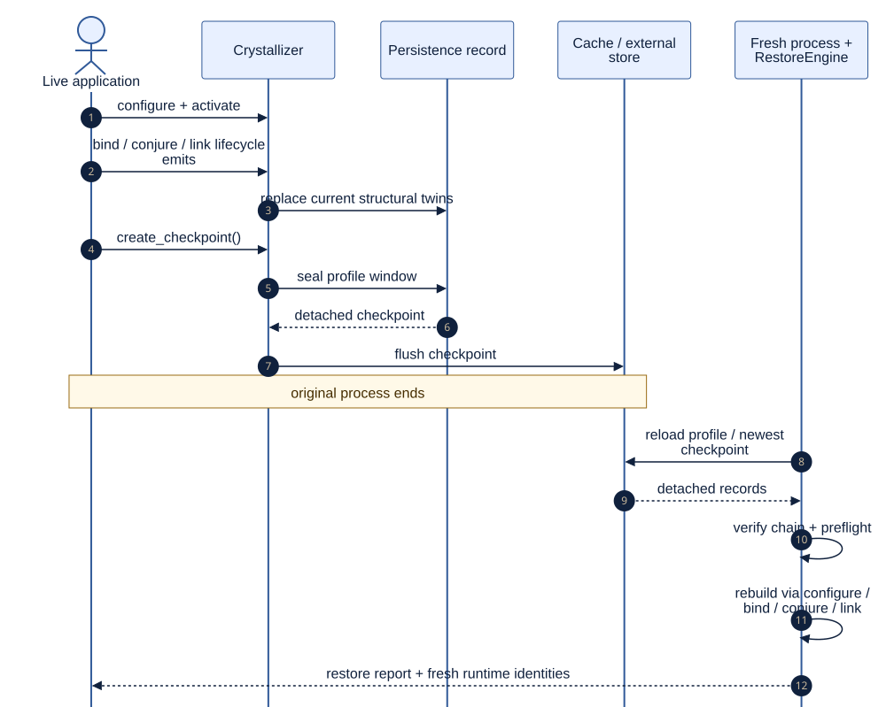

# Continuity and Evolution

<!--
Audience: integrator, contributor
Depth: mid
Status: current
Verified against: Melder 0.1.2 / git 7b31be6d7665
Last verified: 2026-08-29
Diagram source: architecture_and_design/diagrams/source/checkpoint_restore.mmd
Source anchors:
- src/melder/crystallizer/crystallizer.py
- src/melder/crystallizer/persistence/persistence_system.py
- src/melder/crystallizer/crystal_loader_system/restore_engine.py
- src/melder/mutation_research/mutation_research.py
- tests/integration/melder/crystallizer/test_crystallizer_restore_integration.py
-->

[Architecture and design home](../README.md)

## Reader Question

How does Melder preserve a runtime world and retain deliberate change history?

## Short Answer

`Crystallizer` records pure-data structural twins and checkpoint windows so a fresh
process can rebuild a world through normal runtime verbs. `MutationResearch` is a
separate process-owned record for version lanes, composition history, source/impact
views, and candidate rehearsal. Persistence reconstructs; research organizes evolution.

[Editable diagram source](../diagrams/source/checkpoint_restore.mmd)

## Continuity Path

1. Structural units emit their current record at defined lifecycle points.
2. A checkpoint seals a profile window into a detached persistence artifact.
3. Local cache or user-provided external handlers store that artifact.
4. A fresh process reloads records, verifies/preflights them, and rebuilds through public
   configuration, bind, conjure, link, and cluster verbs.
5. The restore report names built units, translated identities, and shortfalls.

## Evolution Path

MutationResearch organizes content-addressed spell versions and grouped compositions into
lanes with append-only journal history. Read operations can expose recorded source,
structural/part diffs, drift, and impact. Candidate preview remains separate from actual
binding or promotion.

## Why This Design Is Strong

- Records are value data rather than serialized live Python instances.
- Fresh runtime identities avoid pretending old process objects survived restart.
- Restore uses the same public construction semantics as normal runtime setup.
- Research history and persistence custody remain separate responsibilities.

## Tradeoffs

Not every live value or callable can be reconstructed from data alone. Restore therefore
requires code participation and reports shortfalls rather than hiding them. Fresh
identities require translation maps for structural records, while content-derived spell
identities remain stable where the source contract permits.

## Where to Go Next

- [Preserve and evolve a world](../03_usage/preserve_and_evolve.md)
- [Governance and structural change](governance_and_change.md)

Source entry points:

- [`Crystallizer`](../../src/melder/crystallizer/crystallizer.py)
- [Restore engine](../../src/melder/crystallizer/crystal_loader_system/restore_engine.py)
- [`MutationResearch`](../../src/melder/mutation_research/mutation_research.py)
- [Cold-restore integration](../../tests/integration/melder/crystallizer/test_crystallizer_restore_integration.py)
