# Runtime Model

<!--
Audience: adopter, integrator, contributor
Depth: mid
Status: current
Verified against: Melder 0.1.2 / git 7b31be6d7665
Last verified: 2026-08-29
Diagram source: architecture_and_design/diagrams/source/core_runtime_components.mmd
Source anchors:
- src/melder/aether/aether.py
- src/melder/aether/aetheric_frame/aetheric_frame.py
- src/melder/aether/spellbook/spellbook.py
- src/melder/aether/conduit/conduit.py
- src/melder/aether/conduit/meld/meld.py
-->

[Architecture and design home](../README.md)

## Reader Question

Which components own definition, compilation, execution, lifecycle, and governance?

## Short Answer

`Aether` owns process-level runtime state and `AethericFrame` partitions it into worlds.
Within a frame, a `Spellbook` defines and compiles graph structure; a `Conduit` hosts one
execution scope; `Meld` resolves objects; `Creations` and `SpellSpace` enforce lifetimes;
frame-local DevOps state governs structural mutation and stale-resolution refusal.

[Editable diagram source](../diagrams/source/core_runtime_components.mmd)

## Responsibility Split

| Component | Owns | Does not own |
| --- | --- | --- |
| Aether | Frames and process roots | Application domain behavior |
| AethericFrame | World-local registries, posture, control plane | Cross-frame linking |
| Spellbook | Bindings, compilation, one root conjure | Arbitrary repeated roots |
| Conduit | Runtime scope, contracts, pools, creation front door | Global process state |
| Meld | Lookup, validity gates, instance realization | Structural registration |
| Creations | Live instances and teardown metadata | Graph definition |
| DevOps plane | Mutation admission, dirty roots, validity | Normal read-path resolution |

## Core Flow

1. A spellbook binds objects and their addresses/lifetimes.
2. Conjure compiles and validates structural and resolution artifacts.
3. The resulting conduit becomes the caller's runtime scope.
4. Meld resolves through compiled creation contexts and creation stores.
5. Structural changes mark affected truth dirty so later resolution can refuse or rebuild.

## Why This Design Is Strong

Responsibilities are separated by ownership and phase. Definition work does not leak into
the hot resolve path, while mutation governance does not charge every reader a transaction
cost.

## Tradeoffs

The split introduces more named components than a small service locator. In return, each
component has a narrower lifecycle and the system can reason about changes, scopes, and
failures without one global container object doing everything.

## Where to Go Next

- [Ownership and lifetimes](ownership_and_lifetimes.md)
- [Scope work](../03_usage/scope_work.md)
- [Connect subsystems](../03_usage/connect_subsystems.md)

Source entry points:

- [`AethericFrame`](../../src/melder/aether/aetheric_frame/aetheric_frame.py)
- [`Spellbook`](../../src/melder/aether/spellbook/spellbook.py)
- [`Conduit`](../../src/melder/aether/conduit/conduit.py)
- [`Meld`](../../src/melder/aether/conduit/meld/meld.py)
