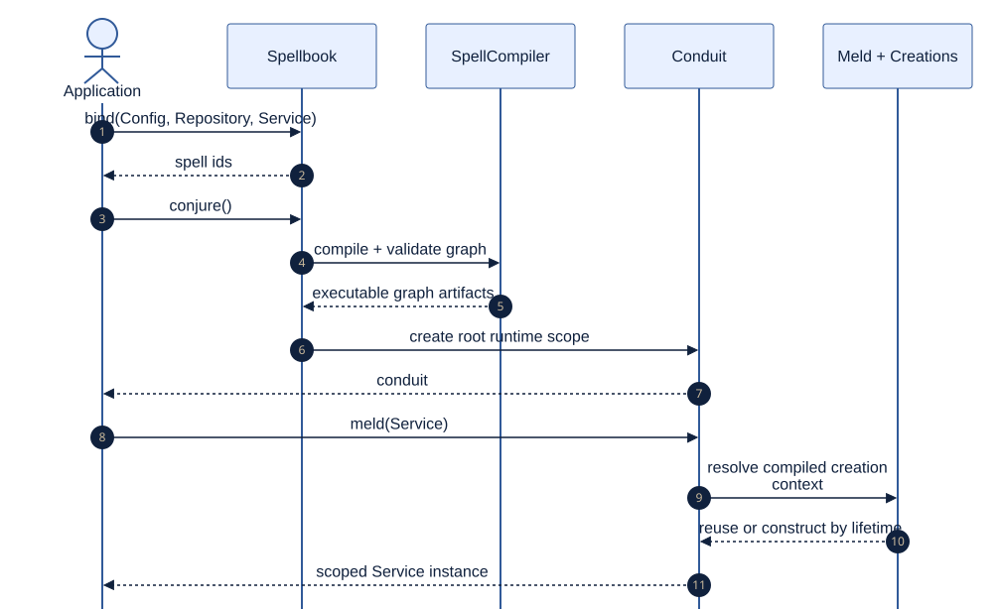

# Compose an Application

<!--
Audience: adopter
Depth: mid
Status: current
Verified against: Melder 0.1.2 / git 7b31be6d7665
Last verified: 2026-08-29
Diagram source: architecture_and_design/diagrams/source/bind_conjure_meld.mmd
Source anchors:
- README.md
- tests/integration/melder/live_sim/bootstrap.py
- tests/integration/melder/spellbook/test_spellbook_integration_public_api.py
-->

[Architecture and design home](../README.md)

## Reader Question

What is the smallest complete Melder application shape?

## Short Answer

Create a spellbook, bind ordinary Python objects, conjure once, then meld from the
resulting conduit. The application keeps its own entry point and domain classes; Melder
owns the compiled dependency world and the instances created inside it.



[Editable diagram source](../diagrams/source/bind_conjure_meld.mmd)

## Representative Shape

```python
import melder as md

book = md.Spellbook()
book.bind(spell=Config, existence="unique")
book.bind(spell=Repository, existence="unique")
book.bind(spell=Service, existence="unique_per_conduit")

conduit = book.conjure()
service = conduit.meld("Service")
```

Constructor annotations or explicit `SpellMap` values define dependency edges. Conjure
compiles and validates the graph; meld resolves or creates the requested object according
to its lifetime.

## Why This Design Is Strong

- User classes remain normal Python classes.
- Graph validation is concentrated before steady-state resolution.
- The conduit is an explicit runtime scope rather than a hidden global locator.
- Cleanup belongs to the same owner that created the objects.

## Tradeoffs

Registration is explicit and a spellbook produces one root conduit. Those restrictions
make graph boundaries and root ownership unambiguous; additional scopes are represented
as lesser conduits or separate spellbooks rather than repeated implicit construction.

## Where to Go Next

- [Scope work and resources](scope_work.md)
- [Runtime model](../02_architecture/runtime_model.md)
- [Root README tutorial](../../README.md#part-i--the-basics)

Evidence:

- [Live application bootstrap](../../tests/integration/melder/live_sim/bootstrap.py)
- [Public API integration](../../tests/integration/melder/spellbook/test_spellbook_integration_public_api.py)
