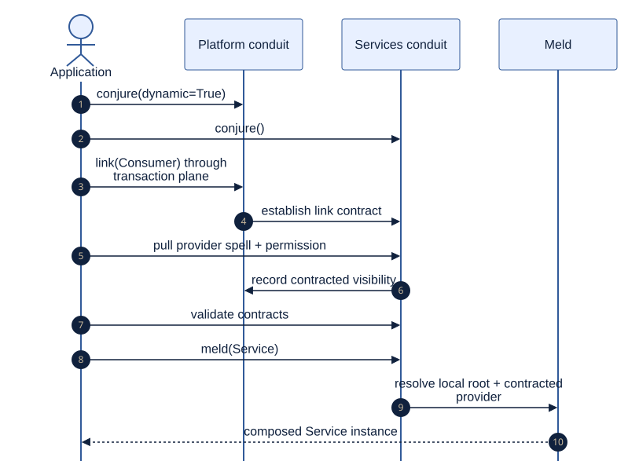

# Connect Independently Owned Subsystems

<!--
Audience: integrator, contributor
Depth: mid
Status: current
Verified against: Melder 0.1.2 / git 7b31be6d7665
Last verified: 2026-08-29
Diagram source: architecture_and_design/diagrams/source/link_contract_meld.mmd
Source anchors:
- tests/integration/melder/live_sim/bootstrap.py
- tests/integration/melder/live_sim/test_live_sim_dynamic.py
- src/melder/aether/conduit/conduit_ward/conduit_ward.py
-->

[Architecture and design home](../README.md)

## Reader Question

How can two subsystems keep separate registries while sharing selected capabilities?

## Short Answer

Give each subsystem its own spellbook and conduit, enable dynamic posture, link the
conduits, and let the consumer pull selected spells across the contract boundary. A
`SpellContract` can leave a dependency socket intentionally unresolved until that link
provides its provider.



[Editable diagram source](../diagrams/source/link_contract_meld.mmd)

## Representative Shape

```python
platform = platform_book.conjure(dynamic=True, name="platform")
services = services_book.conjure(name="services")

platform.link(services)
services.add_spell_to_contract(
    spell_id=config_id,
    conduit=platform,
    permissions="create",
)
services.validate_contracts_and_define()
service = services.meld(spell=Service)
```

The provider keeps ownership. The borrower receives only the contracted visibility and
permissions it requested. Links remain inside one aetheric frame.

## Why This Design Is Strong

- Subsystems compile, configure, and clean up independently.
- Sharing is explicit and consumer-pulled.
- Permission and contract state remain inspectable.
- Late binding connects categories without forcing provider imports into consumers.

## Tradeoffs

Dynamic composition requires ordering: both conduits exist, the link is established, the
consumer requests providers, and contract validation runs before use. That choreography
buys an explicit boundary instead of a single registry where every subsystem sees everything.

## Where to Go Next

- [Isolate worlds](isolate_worlds.md) for boundaries that must not link.
- [Runtime model](../02_architecture/runtime_model.md) for ownership details.

Evidence:

- [Dynamic live-sim bootstrap](../../tests/integration/melder/live_sim/bootstrap.py)
- [Linked application integration](../../tests/integration/melder/live_sim/test_live_sim_dynamic.py)
