# Isolate Worlds in One Process

<!--
Audience: integrator
Depth: mid
Status: current
Verified against: Melder 0.1.2 / git 7b31be6d7665
Last verified: 2026-08-29
Diagram source: architecture_and_design/diagrams/source/runtime_process.mmd
Source anchors:
- tests/integration/melder/aether/test_aether_integration_frames.py
- src/melder/aether/aether.py
- src/melder/aether/aetheric_frame/aetheric_frame.py
-->

[Architecture and design home](../README.md)

## Reader Question

When should an application use multiple aetheric frames rather than more conduits?

## Short Answer

Use a new frame when the world itself must be isolated: separate registries, frame-wide
singletons, control-plane state, and dynamic posture. Use another conduit when scopes may
still collaborate inside the same world.



[Editable diagram source](../diagrams/source/runtime_process.mmd)

## Representative Shape

```python
import melder as md

tenant_a = md.Spellbook(aetheric_frame="tenant-a")
tenant_b = md.Spellbook(aetheric_frame="tenant-b")

scope_a = tenant_a.conjure()
scope_b = tenant_b.conjure()
```

The two books may use identical spellframe and binding names without sharing registered
state. Conduit contracts stay frame-local, so the boundary cannot be bypassed by linking.

## Why This Design Is Strong

Frames make in-process tenancy, plugin isolation, and test isolation architectural rather
than conventional. The runtime owns separate world state instead of asking callers to
remember which dictionary or prefix belongs to which tenant.

## Tradeoffs

Each frame carries its own registries and control-plane state. That duplicates selected
runtime structures in exchange for a wider, harder isolation boundary.

## Where to Go Next

- [Connect subsystems](connect_subsystems.md) for collaboration inside a frame.
- [System context](../02_architecture/system_context.md) for the process boundary.

Evidence:

- [Frame integration tests](../../tests/integration/melder/aether/test_aether_integration_frames.py)
- [`AethericFrame`](../../src/melder/aether/aetheric_frame/aetheric_frame.py)
