# Operate Through a Rift

<!--
Audience: integrator, contributor
Depth: mid
Status: current
Verified against: Melder 0.1.2 / git 7b31be6d7665
Last verified: 2026-08-29
Diagram source: architecture_and_design/diagrams/source/advanced_planes.mmd
Source anchors:
- tests/integration/melder/aether/test_capability_space_frame_and_workstation_integration.py
- tests/integration/melder/aether/rift/test_static_rift_json_testbench_integration.py
- tests/integration/melder/aether/rift/test_codegen_rift_json_testbench_integration.py
-->

[Architecture and design home](../README.md)

## Reader Question

What does a bounded live-runtime workflow look like for a tool or agent?

## Short Answer

Create a Rift with the required room posture, link it to an eligible frame, inspect through
the viewer, bind selected objects onto the workstation, and perform allowed operations
through the command surface. Codegen rooms add a validation-and-execution engine; they do
not bypass the room or frame policy.



[Editable diagram source](../diagrams/source/advanced_planes.mmd)

## Representative Shape

```python
# After Nexus configuration and activation for this process:
rift = nexus.create_rift(rift_name="operations")
root = rift.create_nexus_frame(frame_name="ops")
rift.create_frame_link("ops")

space = rift.space
viewer = space.frame_viewer
workstation = space.workstation
command = space.command_system

service = root.meld("ReportService")
workstation.bind_object("service", service, weak_ref=False)
workstation.set_target("service")
```

The viewer and command system continue to resolve current Rift projection truth. The
workstation is a room-local workbench, not a second ownership system for Melder's world.

## Why This Design Is Strong

- The operator receives a named place with a bounded vocabulary.
- Selected live objects can be worked on without making the whole process globally visible.
- Static, capability, and codegen needs do not share one maximal authority surface.

## Tradeoffs

The workflow is more explicit than passing a service object directly to a tool. That
explicitness creates an auditable boundary for discovery, targeting, action, and refresh.

## Where to Go Next

- [Mediated runtime access](../02_architecture/mediated_access.md)
- [Preserve and evolve](preserve_and_evolve.md)

Evidence:

- [Capability room and workstation](../../tests/integration/melder/aether/test_capability_space_frame_and_workstation_integration.py)
- [Static Rift testbench](../../tests/integration/melder/aether/rift/test_static_rift_json_testbench_integration.py)
- [Codegen Rift testbench](../../tests/integration/melder/aether/rift/test_codegen_rift_json_testbench_integration.py)
