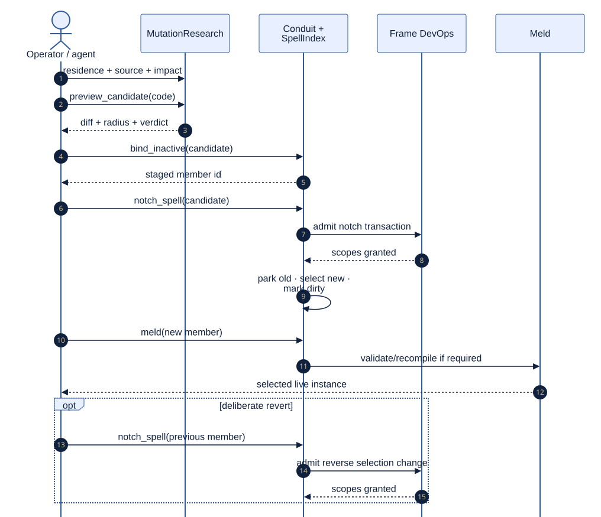

# Preserve and Evolve a World

<!--
Audience: integrator, contributor
Depth: mid
Status: current
Verified against: Melder 0.1.2 / git 7b31be6d7665
Last verified: 2026-08-29
Diagram source:
- architecture_and_design/diagrams/source/checkpoint_restore.mmd
- architecture_and_design/diagrams/source/governed_change_loop.mmd
Source anchors:
- tests/integration/melder/crystallizer/test_crystallizer_restore_integration.py
- tests/integration/melder/mutation_research/test_mutation_research_root_integration.py
- tests/integration/melder/aether/conduit/test_index_link_notch_follow_integration.py
-->

[Architecture and design home](../README.md)

## Reader Question

How can an application recover a configured world and deliberately promote a new version
without conflating persistence with live mutation?

## Short Answer

Use Crystallizer checkpoints for continuity across process death. Use MutationResearch,
inactive index members, and a mediated notch for deliberate live evolution. A checkpoint
rebuild and a hot version promotion are separate workflows with separate evidence.

[Editable restore source](../diagrams/source/checkpoint_restore.mmd)

[Editable change-loop source](../diagrams/source/governed_change_loop.mmd)

## Continuity Workflow

1. Activate/configure Crystallizer for a dynamic world.
2. Let runtime lifecycle events record structural twins.
3. Create and flush a checkpoint to local or caller-provided external custody.
4. On a fresh process, reload, preflight, restore, and inspect the report.

## Evolution Workflow

1. Read current research residence, source, drift, and impact.
2. Preview candidate code without executing, binding, or recording it.
3. Bind the accepted version as an inactive member beside the live version.
4. Notch the index through the structural transaction path.
5. Meld to realize the selected version after validity handling.
6. Revert deliberately by notching the retained prior member back into selection.

## Why This Design Is Strong

The system can distinguish a rehearsed candidate, a staged version, a promoted version,
and a reconstructed world. Each state has a separate owner and evidence surface.

## Tradeoffs

Continuity requires recordable configuration and code participation at rebuild. Live
evolution requires custody, research history, staging, and transaction governance. The
cost buys explicit state transitions rather than treating deploy/restart as invisible magic.

## Where to Go Next

- [Continuity and evolution](../02_architecture/continuity_and_evolution.md)
- [Governance and structural change](../02_architecture/governance_and_change.md)

Evidence:

- [Restore integration](../../tests/integration/melder/crystallizer/test_crystallizer_restore_integration.py)
- [MutationResearch integration](../../tests/integration/melder/mutation_research/test_mutation_research_root_integration.py)
- [Linked-index notch integration](../../tests/integration/melder/aether/conduit/test_index_link_notch_follow_integration.py)
