# Scope Work and Resources

<!--
Audience: adopter, integrator
Depth: mid
Status: current
Verified against: Melder 0.1.2 / git 7b31be6d7665
Last verified: 2026-08-29
Diagram source: architecture_and_design/diagrams/source/ownership_lifetimes.mmd
Source anchors:
- tests/integration/melder/conduit/test_conduit_integration_scope_ordering_matrix.py
- tests/integration/melder/conduit/test_conduit_integration_spellspace_scope_safety.py
- src/melder/aether/conduit/creations/creations.py
-->

[Architecture and design home](../README.md)

## Reader Question

How should a web request, job, session, or nested operation receive an honest lifetime?

## Short Answer

Choose the narrowest owner that matches the work. Frame-wide services use `unique`;
request/session state commonly uses `unique_per_conduit`; child work can share lineage
state; request-local ephemeral objects can live in an active `SpellSpace`; stateless work
can use `many`.



[Editable diagram source](../diagrams/source/ownership_lifetimes.mmd)

## A Typical Request Shape

```python
root = book.conjure()
request_scope = root.create_lesser_conduit()

try:
    handler = request_scope.meld("RequestHandler")
    handler.handle()
finally:
    request_scope.cleanup()
```

The root retains broad services. The lesser conduit owns request-specific creations and
inherits only the lifetimes designed to cross the lineage boundary.

## Why This Design Is Strong

The object graph and lifetime graph agree. Reuse decisions are made by the owning store,
and teardown can run deterministically when the scope ends rather than waiting for GC.

## Tradeoffs

The application must end scopes deliberately and choose lifetime semantics during
registration. This adds lifecycle design work and prevents accidental process-global state.

## Where to Go Next

- [Ownership and lifetimes](../02_architecture/ownership_and_lifetimes.md)
- [Isolate worlds](isolate_worlds.md) for a wider boundary.

Evidence:

- [Scope-ordering matrix](../../tests/integration/melder/conduit/test_conduit_integration_scope_ordering_matrix.py)
- [Spell-space safety](../../tests/integration/melder/conduit/test_conduit_integration_spellspace_scope_safety.py)
