# Melder Engineering Drawings

<!--
Audience: evaluator, adopter, integrator, contributor
Depth: high-to-source-bridge
Status: current
Verified against: Melder 0.1.2 / git 7b31be6d7665
Last verified: 2026-08-29
Diagram source: 05_engineering_drawings/mermaid (semantic companions)
Source anchors:
- README.md
- src/melder/aether/aether.py
- src/melder/aether/spellbook/spellbook.py
- src/melder/aether/conduit/conduit.py
- src/melder/aether/conduit/meld/meld.py
- src/melder/aether/aetheric_frame/dev_ops/change_control_manager/transaction_manager/transaction_mediator.py
- src/melder/nexus/nexus.py
- src/melder/nexus/rift/rift.py
- src/melder/nexus/rift/rift_space/rift_space.py
- src/melder/crystallizer/crystallizer.py
- src/melder/crystallizer/persistence/persistence_system.py
- src/melder/crystallizer/crystal_loader_system/restore_engine.py
- src/melder/mutation_research/mutation_research.py
- src/melder/mutation_research/research_set/research_set.py
- src/melder/utilities/synchronization/creation_gate.py
- src/melder/utilities/synchronization/load_gate.py
- src/melder/utilities/synchronization/phase_scheduler.py
- src/melder/utilities/synchronization/safeguard.py
- src/melder/_build_assets/_build_asset_runner.py
- src/melder/_build_assets/_system_documents/_builder.py
- src/melder/_build_assets/_system_documents/system_documents.py
- src/melder/utilities/ai_native_support_tools/system_document_view.py
-->

This page is a seventeen-picture visual descent through Melder. Start with the DI
comparison, move outside the runtime at C4, open ownership at C3, follow one meld at
C2, then enter actor use cases and the cross-cutting lifecycle, coordination,
documentation, recovery, Nexus/Rift, Crystallizer, and MutationResearch mechanisms.

These are manually composed engineering drawings rather than Mermaid renders. Their
Mermaid companions preserve the same nodes and relationships in a diff-friendly form.

## From DI Container to Dependency Graph Runtime

A typical DI container emphasizes a compact loop: register providers, resolve and
inject an object graph, apply familiar lifetimes, then clean the owning scope. Exact
features vary by library; that common baseline is the comparison point, not a universal
limit on every DI implementation.

Melder keeps that baseline. Binding, resolution, lifetime selection, reuse, and cleanup
remain central. It widens the unit of design from one constructed graph to a governed
runtime world:

- AethericFrames, Conduits, and SpellSpaces make runtime ownership boundaries explicit.
- SpellCompiler and Frame DevOps validate, compile, gate, and lazily revalidate
  execution.
- Dynamic worlds can link subsystems, form clusters, and transfer ownership through
  admitted structural transactions.
- Nexus/Rift, Crystallizer, and MutationResearch add mediated operation, continuity,
  restore, and governed evolution above the DI core.

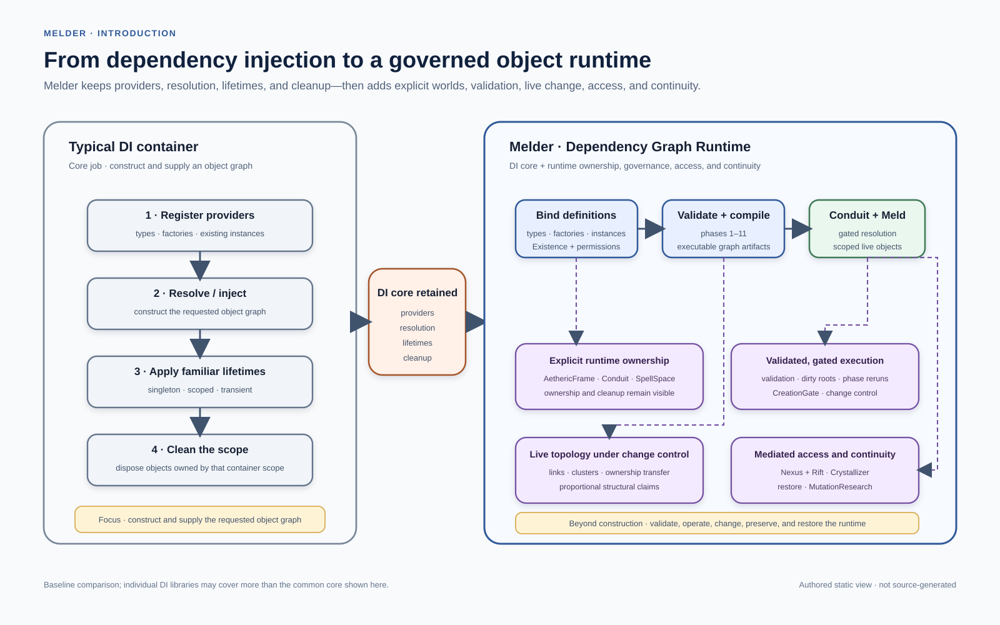

[Open full-size SVG](svg/di_container_vs_melder.svg) ·
[Open the Mermaid companion](mermaid/di_container_vs_melder.mmd) ·
[Read what Melder is](../01_overview/what_melder_is.md)

## The Three-Level Descent

| Level | Question answered | Primary picture | Semantic companion |
| --- | --- | --- | --- |
| C4 | Where does Melder sit, and who interacts with it? | [SVG](svg/c4_system_context.svg) | [Mermaid](mermaid/c4_system_context.mmd) |
| C3 | Which components own definition, execution, access, continuity, and change? | [SVG](svg/c3_runtime_components.svg) | [Mermaid](mermaid/c3_runtime_components.mmd) |
| C2 | What happens inside one gated meld resolution? | [SVG](svg/c2_meld_resolution.svg) | [Mermaid](mermaid/c2_meld_resolution.mmd) |

## C4 — System Context

The C4 view establishes the boundary: application code and Melder share one Python
process, while developers, optional agents, persistence, and logging interact across
explicit edges.

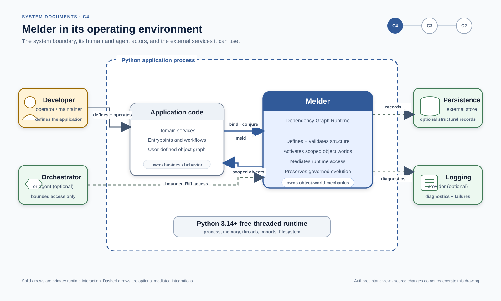

[Open full-size SVG](svg/c4_system_context.svg) ·
[Open the Mermaid companion](mermaid/c4_system_context.mmd) ·
[Read the system-context prose](../02_architecture/system_context.md)

## C3 — Runtime Components

The C3 view opens Melder into three collaboration planes. The frame-owned core handles
definition, activation, object lifetimes, and validity. Nexus/Rift mediates access.
Crystallizer and MutationResearch handle continuity and governed evolution.

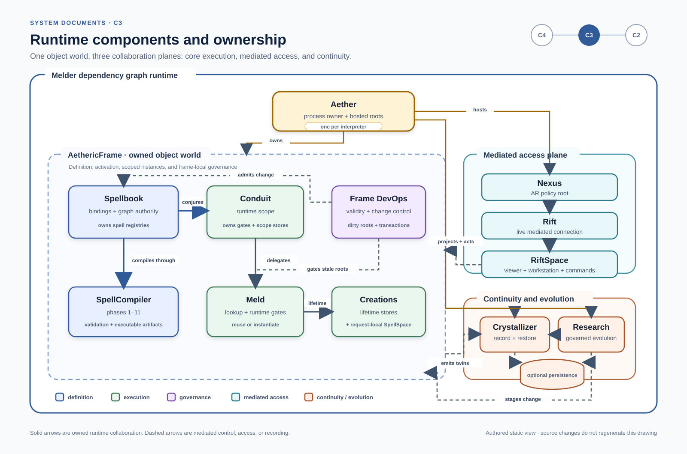

[Open full-size SVG](svg/c3_runtime_components.svg) ·
[Open the Mermaid companion](mermaid/c3_runtime_components.mmd) ·
[Read the runtime-model prose](../02_architecture/runtime_model.md)

## C2 — Meld Resolution

The C2 view follows `Conduit.meld` through its CreationGate, target lookup, lineage
and dirty-root checks, lazy revalidation, compiled CreationContext, and
Existence-directed lifetime stores.

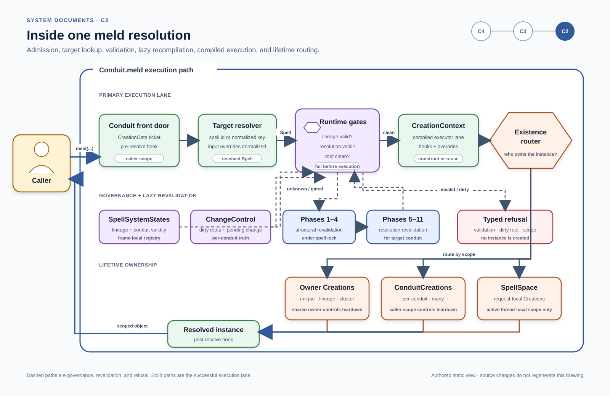

[Open full-size SVG](svg/c2_meld_resolution.svg) ·
[Open the Mermaid companion](mermaid/c2_meld_resolution.mmd) ·
[Read ownership and lifetimes](../02_architecture/ownership_and_lifetimes.md)

## Actor-Centered Use Cases

These views answer why a developer, application, operator, or agent enters the system.
They complement the structural ladder rather than adding another architecture level.

### Application Runtime Use Cases

Developers define and activate the object world through registration, configuration,
and conjure. Application code resolves objects and opens narrower work scopes.
Operators inspect current truth and drive deterministic teardown. Dynamic applications
can also link or sever independently owned conduit subgraphs without rebuilding the
whole process.

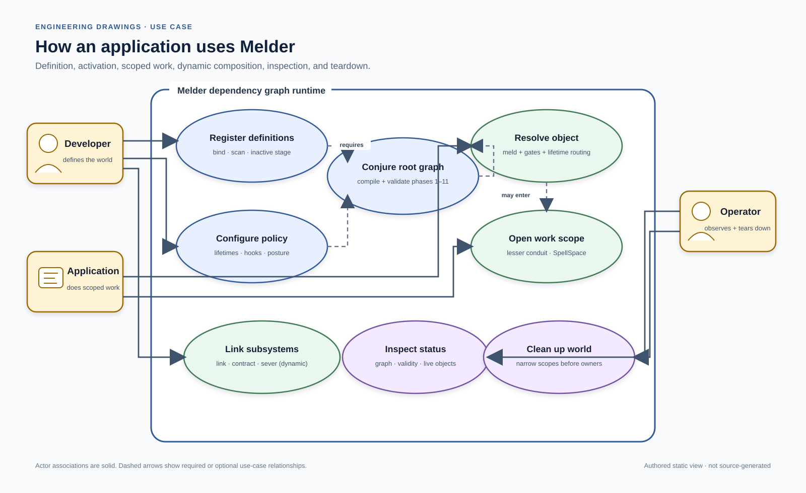

[Open full-size SVG](svg/use_case_application_runtime.svg) ·
[Open the Mermaid companion](mermaid/use_case_application_runtime.mmd) ·
[Read how to compose an application](../03_usage/compose_an_application.md)

### Nexus and Rift Use Cases

Nexus and Rift divide authority between two actors. An operator authors process policy,
managed-frame topology, ACL families, and refresh behavior. A tool or agent enters a
named Rift, links an eligible frame, inspects current projections, binds selected
assets in the room workstation, and acts through the room command surface.

Room posture is part of the contract:

- static rooms expose live, reuse-oriented inspection;
- capability rooms expose broader manual runtime operations;
- codegen rooms add validated namespace construction and execution.

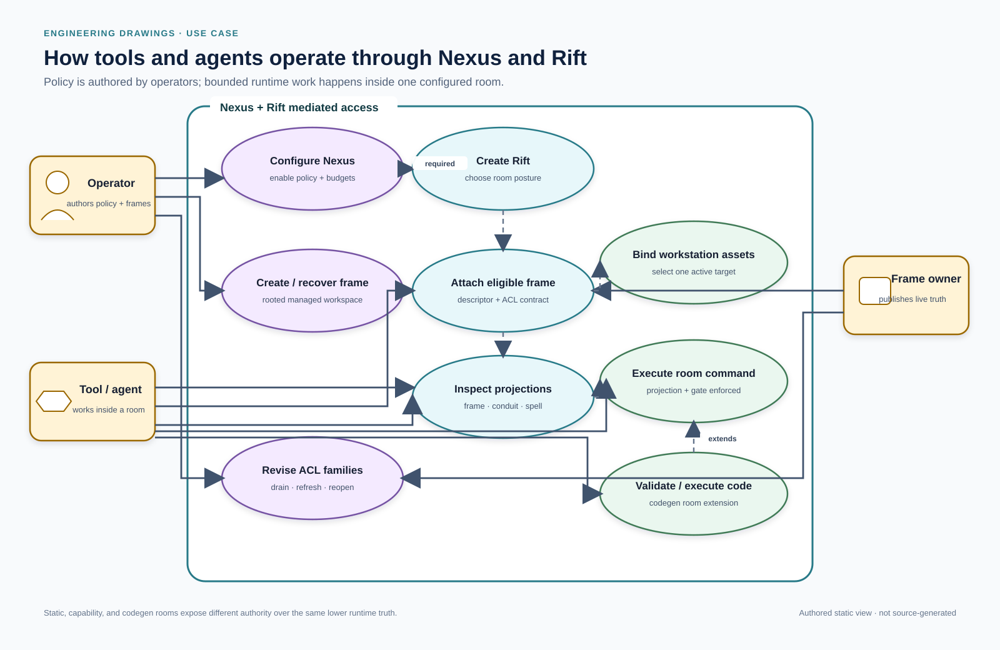

[Open full-size SVG](svg/use_case_nexus_rift.svg) ·
[Open the Mermaid companion](mermaid/use_case_nexus_rift.mmd) ·
[Read mediated runtime access](../02_architecture/mediated_access.md)

### Continuity and Research Use Cases

Crystallizer and MutationResearch solve different problems. Crystallizer records
structural twins, seals checkpoints, and reconstructs a fresh world. MutationResearch
declares version and composition history, joins runtime residence with recorded
custody, exposes source/drift/diff/impact evidence, rehearses candidates, and records
deliberate promotion.

The separation matters: a restored world is not the same event as a promoted version,
and a preview is not a mutation.

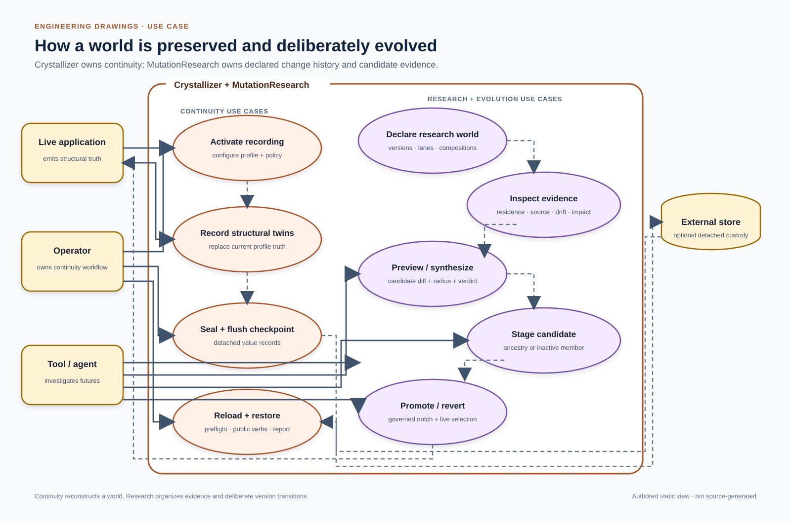

[Open full-size SVG](svg/use_case_continuity_research.svg) ·
[Open the Mermaid companion](mermaid/use_case_continuity_research.mmd) ·
[Read continuity and evolution](../02_architecture/continuity_and_evolution.md)

### Scoped Lifetime Use Cases

Existence is the ownership and reuse contract for a resolved object. It is selected
when a spell is bound, then Meld routes the resulting instance into the matching
owner's store:

- `unique` belongs to one AethericFrame;
- `unique_per_conduit_lineage` and `unique_per_conduit_cluster` share within an
  explicitly related subsystem boundary;
- `unique_per_conduit` belongs to one Conduit;
- `unique_per_spell_space` requires an active request-local SpellSpace;
- `many` creates a new instance for each resolution.

The no-create probe answers whether a matching live object already exists without
changing runtime state. Cleanup then composes two orderings: narrow scopes before broad
owners, and newest-created objects before their dependencies.

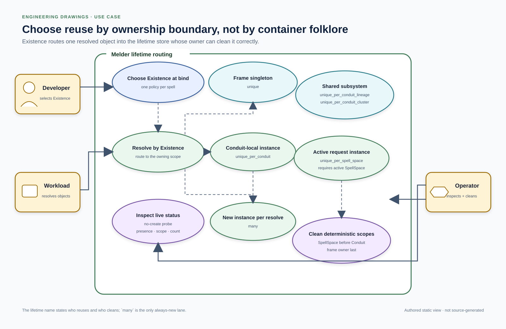

[Open full-size SVG](svg/use_case_scoped_lifetimes.svg) ·
[Open the Mermaid companion](mermaid/use_case_scoped_lifetimes.mmd) ·
[Scope application work](../03_usage/scope_work.md)

### Linked Subsystem Use Cases

Dynamic Conduits can remain separately owned while sharing selected graph surfaces.
Peer links create directional contracts governed by `Policies` and per-spell
`Permissions`; ConduitCluster provides automatic root-lineage sharing; ownership
transfer and severing remain explicit structural mutations.

Three boundaries keep this composition honest:

- peers are normal Conduits in the same AethericFrame;
- the frame posture is dynamic;
- structural mutations acquire proportional scope claims, so disjoint changes can
  proceed while true overlap waits.

Affected roots are gated and lazily revalidated on the next meld rather than rebuilt
eagerly as a side effect of every topology change.

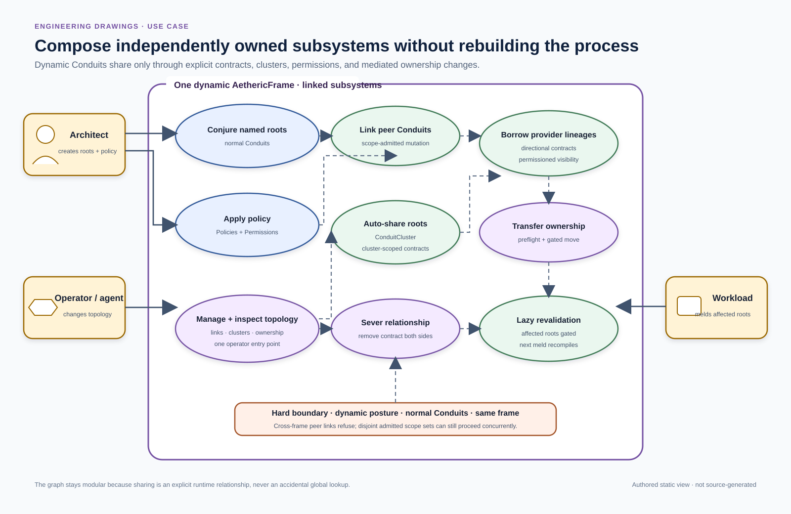

[Open full-size SVG](svg/use_case_linked_subsystems.svg) ·
[Open the Mermaid companion](mermaid/use_case_linked_subsystems.mmd) ·
[Connect independently owned subsystems](../03_usage/connect_subsystems.md)

### Isolated Runtime World Use Cases

One Aether process owner can host multiple named AethericFrames. Frames are created
lazily, receive their posture before Spellbooks conjure into them, and keep their own
registries, DevOps control plane, Conduits, and frame-unique objects.

This supports independent application worlds inside one process without turning them
into a single global container. A workload resolves inside its assigned frame. An
operator can attach a Rift to one explicitly eligible frame, restore a formation into
one target frame, or clean one frame without collapsing its siblings. Peer Conduit
links remain same-frame only.

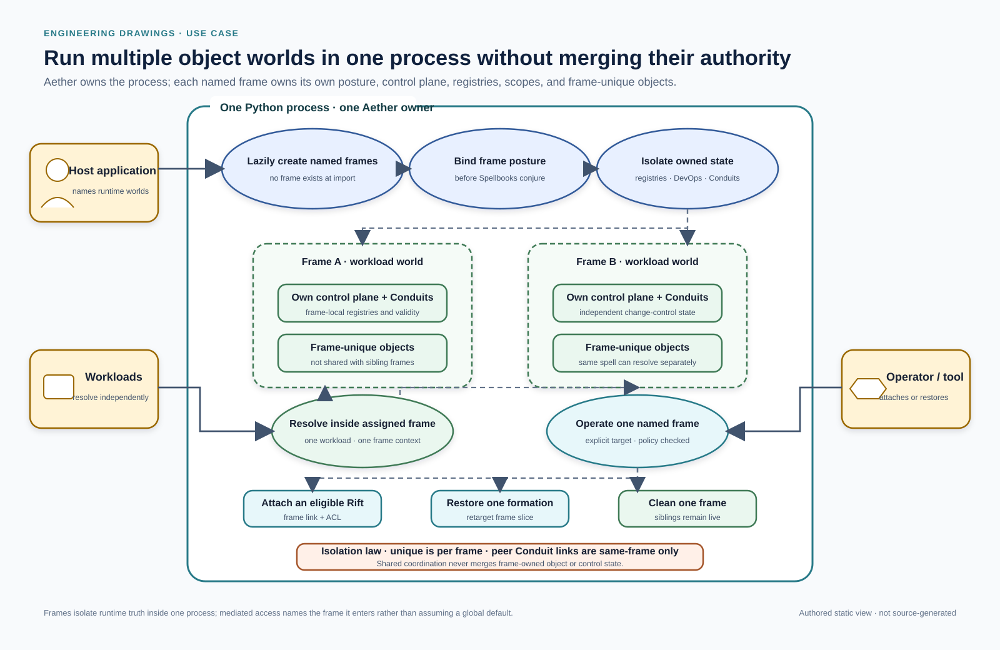

[Open full-size SVG](svg/use_case_isolated_worlds.svg) ·
[Open the Mermaid companion](mermaid/use_case_isolated_worlds.mmd) ·
[Isolate object worlds](../03_usage/isolate_worlds.md)

## Cross-Cutting Engineering Flows

### Boot and Ownership Lifecycle

`import melder` creates the package-root document views and the Aether singleton, but
it creates no frame. Aether hosts the shared utility, load, continuity, and access
roots. The first Spellbook lazily establishes its named frame, binds definitions, and
conjures one root Conduit.

Ownership then narrows. The frame owns its registries and control plane. A Conduit owns
Meld, CreationGate, ConduitWard, ConduitCreations, and its narrower scope pools. The
resolved objects retain creation order so teardown can proceed safely in reverse.

Shutdown closes admission before changing state, drains active tickets, cleans
SpellSpace and lesser scopes, disposes created objects newest-first, detaches Conduit
and frame services, then cleans hosted roots. Logger teardown stays last so failures
remain reportable during the cascade.

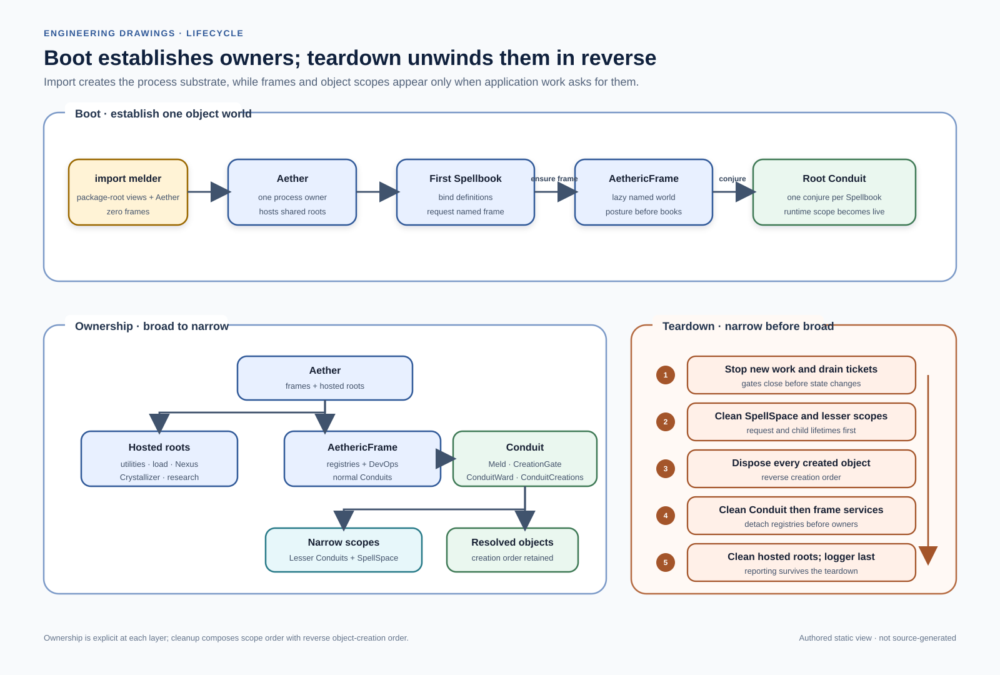

[Open full-size SVG](svg/boot_and_ownership_lifecycle.svg) ·
[Open the Mermaid companion](mermaid/boot_and_ownership_lifecycle.mmd) ·
[Read the runtime model](../02_architecture/runtime_model.md)

### Free-Threaded Coordination

Melder does not coordinate the whole runtime through one global lock. Its mechanisms
match the ownership or transition being protected:

- per-instance `RLock` objects protect local mutable state;
- SafeGuard imposes deterministic identity ordering when one operation needs peer
  locks;
- thread-local stacks isolate SpellSpace and transaction-session state;
- Spellbook's `_phase_run_lock` protects the per-run phase registry, while
  PhaseScheduler executes units behind a per-phase barrier;
- frame TransactionMediator admits proportional `x`, `s`, and `ix` scope claims and
  waits outside its own lock;
- CreationGate, RiftGate, and LoadGate stop new entrants and drain bounded work before
  a structural change, projection refresh, or restore.

The standalone Aetheric Mediator package is deliberately excluded from the live path:
it exists and is tested, but nothing constructs or submits runtime work through it.

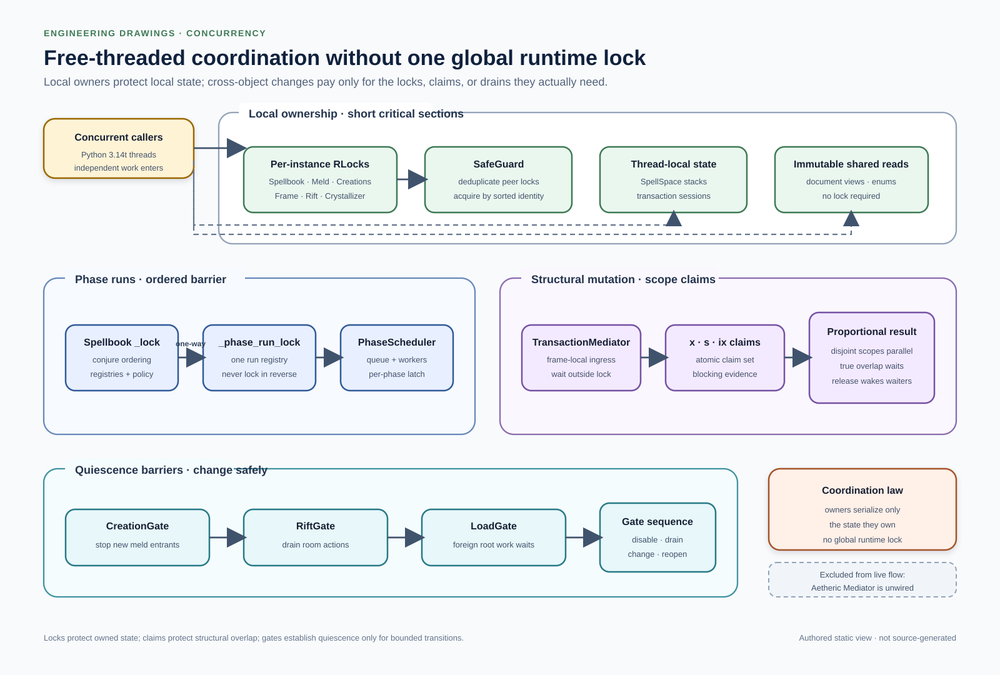

[Open full-size SVG](svg/free_threaded_coordination.svg) ·
[Open the Mermaid companion](mermaid/free_threaded_coordination.mmd) ·
[Read the design tradeoffs](../04_tradeoffs/design_tradeoffs.md)

### Self-Documentation Descent

The source maps remain authored documents. At build time, the discovery runner finds
the system-document builder, which verifies each document/index pair before emitting
an eager manifest, deferred section tables, lazy Python text payloads, and graph
adjacency. Runtime then publishes four package-root query views:
`__architecture__`, `__components__`, `__graph_network__`, and `__graph_details__`.

The reading path mirrors the information hierarchy:

1. read architecture broadly for boundaries, boot order, invariants, and vocabulary;
2. use the component index and open only the component branch in scope;
3. walk the graph network for nodes, edges, trust origin, and impact;
4. open the source-path graph detail that names the implementation files;
5. read source code, which remains the authority for current behavior.

The engineering drawings do not enter this generator. They remain manually composed
SVGs with Mermaid semantic companions, so build-asset runs never overwrite deliberate
layout or architectural judgment.

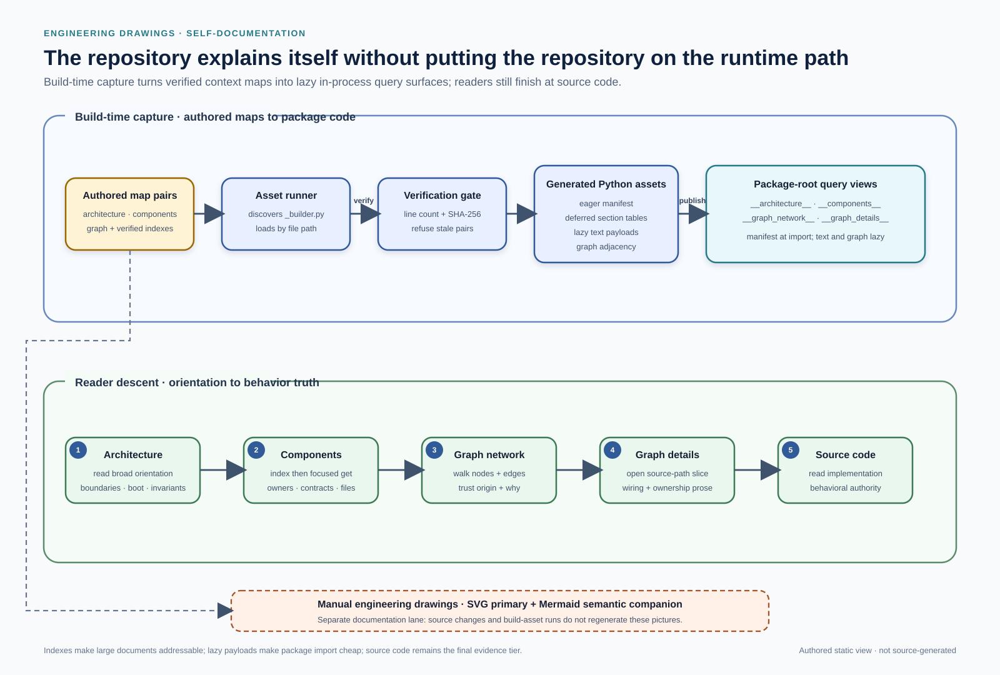

[Open full-size SVG](svg/self_documentation_descent.svg) ·
[Open the Mermaid companion](mermaid/self_documentation_descent.mmd) ·
[Return to the reader journey](../README.md)

### Failure, Rollback, and Recovery

Failure is handled by the boundary that owns the threatened invariant:

1. SpellCompiler validation refuses a broken graph before a Conduit activates.
2. Meld checks lineage validity and dirty roots, lazily reruns phases when state is
   unknown or gated, and returns typed validation, change-control, hook, or scope
   failures before constructing an object.
3. Structural transactions finalize through commit or abort and release their scope
   claims so waiters are not stranded.
4. LoadAdmission refuses restore blockers before replay. If a RestoreEngine stage
   later fails, every built unit is cleaned in reverse order and the original cause is
   chained into the raised error.
5. Creations attempts every configured disposer newest-first, then raises one
   `ExceptionGroup` containing all failures after teardown has completed.

Warnings, identity translations, and unreplayable shortfalls remain explicit report
data. Recovery does not claim more continuity than the recorded values can support.

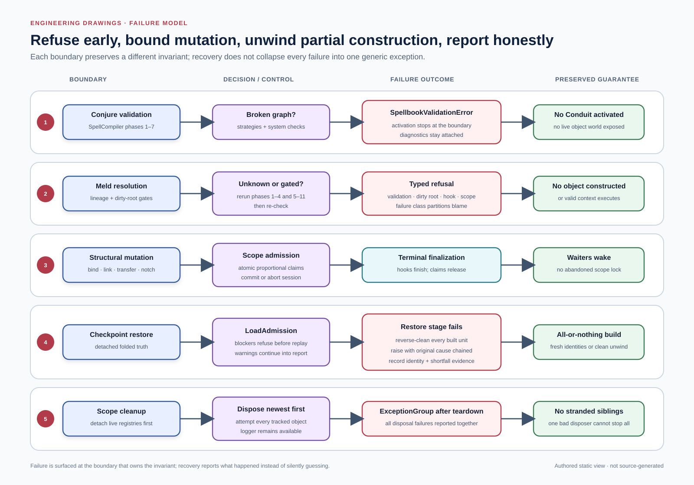

[Open full-size SVG](svg/failure_rollback_recovery.svg) ·
[Open the Mermaid companion](mermaid/failure_rollback_recovery.mmd) ·
[Read governance and change](../02_architecture/governance_and_change.md)

## Advanced System Flows

### Nexus → Rift → Room

The detailed access flow has four phases:

1. Nexus is configured and enabled; a Rift is created with one selected room posture.
2. A managed frame is created or recovered, then attached only after target policy,
   descriptor truth, and the frame-name ACL contract resolve.
3. Nexus compiles projection sets; Rift owns the current projection registry and applies
   it to the room viewer and command assets.
4. An ACL revision disables impacted Rift gates, drains in-flight tickets, recompiles
   only the changed-frame subset, reapplies assets, and reopens the gates.

The room therefore never owns lower runtime truth and never bypasses Nexus policy.

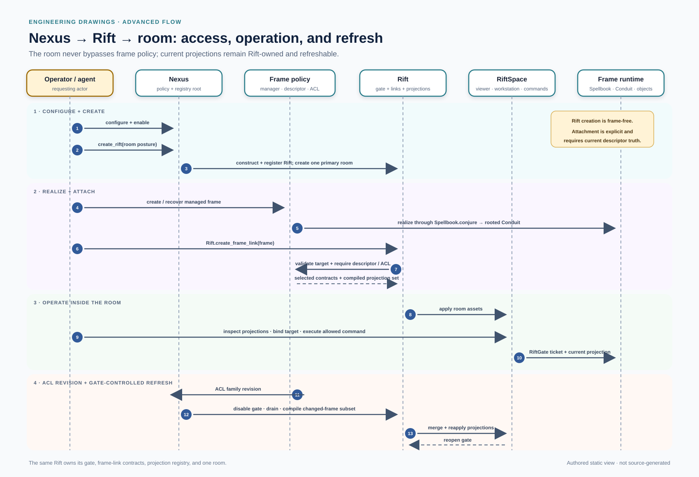

[Open full-size SVG](svg/nexus_rift_access_flow.svg) ·
[Open the Mermaid companion](mermaid/nexus_rift_access_flow.mmd) ·
[Operate through a Rift](../03_usage/operate_through_a_rift.md)

### Crystallizer Record and Restore

The live half is passive. Once configured and active, Crystallizer receives lifecycle
emissions and replaces the corresponding twins in the active persistence profile.
`PersistenceSystem` seals a profile window as detached value data;
`AssetManagementSystem` places it in local cache or caller-provided external custody.

The cold half starts in a fresh process. `CrystalLoaderSystem` loads feedstock,
`LoadAdmission` verifies scope, chain, collisions, and blockers, and `RestoreEngine`
executes a `LoadPlan` through normal configuration, bind, conjure, link, cluster, and
research verbs. Runtime identities are freshly minted and the report carries translation
and shortfall evidence.

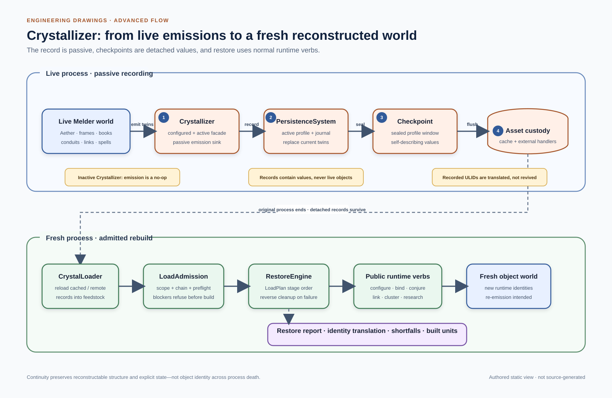

[Open full-size SVG](svg/crystallizer_record_restore.svg) ·
[Open the Mermaid companion](mermaid/crystallizer_record_restore.mmd) ·
[Preserve and evolve a world](../03_usage/preserve_and_evolve.md)

### MutationResearch Governed Evolution

MutationResearch begins with declaration, not mutation. One content identity claims one
residence lane, while the append-only journal preserves the event story even when
organization snapshots rewind. Foresight reads expose recorded source, runtime residence,
drift, diff, and impact before a candidate can affect the live world.

`preview_candidate` and structural synthesis produce evidence without executing or
binding code. An accepted candidate is staged through ancestry and/or an inactive
SpellIndex member. Promotion then crosses the real runtime boundary: Conduit admits a
notch transaction, Frame DevOps protects the structural change, Meld validates and
realizes the selected version, and the promotion returns to the journal and persistence
twin. Retaining the prior member makes revert an explicit reverse notch.

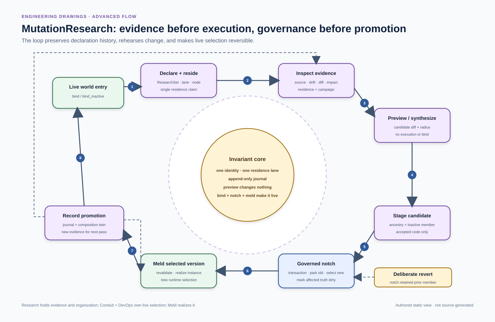

[Open full-size SVG](svg/mutation_research_evolution.svg) ·
[Open the Mermaid companion](mermaid/mutation_research_evolution.mmd) ·
[Read governance and structural change](../02_architecture/governance_and_change.md)

## Provenance and Freshness

The original C4/C3/C2 pairs are byte-identical mirrors of the
[packaged system-document drawing set](../../src/melder/_build_assets/_system_documents/diagrams/README.md).
The fourteen introductory, use-case, cross-cutting, and advanced-flow pairs are
authored directly in this public documentation lane.

They are intentionally static:

- `src_graph` is not used to derive them.
- Source changes do not regenerate them.
- The handmade SVG and Mermaid companion must be updated together.
- The SVG remains the primary human-facing drawing; Mermaid remains the semantic,
  text-native companion.

That tradeoff preserves architectural judgment and deliberate layout. Ownership,
boundary intent, lifetime authority, and the reason for an edge cannot be inferred
reliably from syntax alone.
