# Melder Architecture and Design

<!--
Audience: evaluator, adopter, integrator, contributor
Depth: high
Status: current
Verified against: Melder 0.1.2 / git 7b31be6d7665
Last verified: 2026-08-29
Diagram source: architecture_and_design/diagrams/source/system_context.mmd
Source anchors:
- README.md
- pyproject.toml
- src/melder/aether/aether.py
-->

Melder is an AI-native Dependency Graph Runtime: it turns registered Python objects
into a governed, scoped, inspectable object world. This documentation explains that
world from its outside boundary down to the source files that implement it.

[Editable diagram source](diagrams/source/system_context.mmd)

## Choose Your Path

| Intent | Start here | What you will learn |
| --- | --- | --- |
| Understand Melder | [What Melder is](01_overview/what_melder_is.md) | Category, mental model, and value |
| See the ceiling | [Capability ladder](01_overview/capability_ladder.md) | Which layers are optional |
| Understand the runtime | [Runtime model](02_architecture/runtime_model.md) | Ownership and execution boundaries |
| Follow the visual descent | [Engineering drawings](05_engineering_drawings/README.md) | C4 system context through C2 meld internals |
| Build with it | [Compose an application](03_usage/compose_an_application.md) | The basic application shape |
| Integrate subsystems | [Connect subsystems](03_usage/connect_subsystems.md) | Dynamic links and contracts |
| Evaluate design costs | [Design tradeoffs](04_tradeoffs/design_tradeoffs.md) | Benefits and accepted costs |

## Three Reading Depths

1. **High-level orientation** explains what Melder is and where it sits.
2. **Mid-level architecture and use** explains boundaries, lifetimes, and flows.
3. **Source descent** links directly to implementation and integration evidence.

Nothing in the advanced ceiling is required to use Melder as a dependency runtime.
Start with the human core and stop when you have the depth you need.

## Architecture

- [System context](02_architecture/system_context.md)
- [Runtime model](02_architecture/runtime_model.md)
- [Ownership and lifetimes](02_architecture/ownership_and_lifetimes.md)
- [C4 → C3 → C2 engineering drawings](05_engineering_drawings/README.md)

Advanced architecture follows in the optional ceiling:

- [Governance and structural change](02_architecture/governance_and_change.md)
- [Continuity and evolution](02_architecture/continuity_and_evolution.md)
- [Mediated runtime access](02_architecture/mediated_access.md)

## Utilization Stories

- [Compose an application](03_usage/compose_an_application.md)
- [Scope work and resources](03_usage/scope_work.md)
- [Connect independently owned subsystems](03_usage/connect_subsystems.md)
- [Isolate worlds in one process](03_usage/isolate_worlds.md)
- [Operate through a Rift](03_usage/operate_through_a_rift.md)
- [Preserve and evolve a world](03_usage/preserve_and_evolve.md)

## Documentation Contract

Every page answers one reader question, explains one dominant picture when a picture
helps, states the mechanism behind each strength, names accepted tradeoffs, and ends
with a deliberate next-depth route. Pictures never replace the adjacent text.

The canonical diagram sources and generated assets follow the
[diagram contract](diagrams/README.md).

## Current License

Melder is licensed under GNU AGPL v3 or later (`AGPL-3.0-or-later`). See the repository
[LICENSE](../LICENSE) and [NOTICE](../NOTICE).
