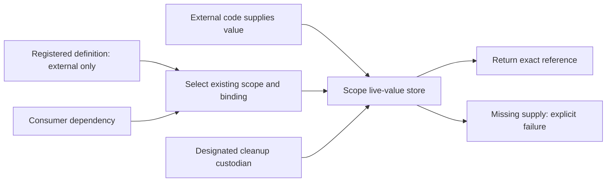

# Existing-object reference and blueprint discovery

Status: initial discovery evidence and candidate options; current staged work is routed by the story checkpoint.
Owner: updater_0.
Story: STORY-2026-09-17-existing-object-reference-blueprint-discovery.
Task: TASK-2026-09-17-trace-existing-object-reference-model.

## Direction

Current starting point: the user binds an actual existing object, Melder studies its reference/type,
reuses normal machinery, and disables construction. Transfer must carry the object and its ownership.
The story's Current Checkpoint controls staged work; the broader definition-first supply options below
remain future possibilities. This initial source/probe report does not authorize all stages at once.

## Current registration and execution boundary

Source read on 2026-09-17. Component index verified at 8,460 LF lines and SHA256
7af4a98ecf300fd08c9cf9581279f33a5f1436a1f82b1a75aa39dd2767ad6049.
Graph index verified at 27,706 LF lines and SHA256
9b2e57071e56665abfe4961a9df07dfe877a19c794e584582425fff6ceb82cf8.
The project interpreter is `.venv_new/Scripts/python.exe`, Python 3.14.7.
Source HEAD: 4b3ab72ee0a12139aaa543c33336613987d2ffb6. `git diff --name-only -- src` was empty
at final verification; pre-existing changes outside this discovery were preserved.

1. Bind examines the actual target. InstanceBindingProfile/OtherBindingProfile select an existing
   SpellType and pass the same target as `existing_object`; class profiles select factory SpellTypes.
2. `_validate_binding` restricts existing profiles to `Existence.unique`. The policy matrix records
   the same restriction. Merely relaxing it would leave the execution behavior below unchanged.
3. Spell's immutable `is_existing_creation` and mutable `has_existing_object` are ALREADY distinct.
   Do not describe this as a single presence flag. What is missing from the inspected binding path
   is an explicit way to register a class definition as external-only before a value exists.
4. Phase 1 emits identity/lifetime metadata and no constructor requirements for existing SpellTypes.
   The repaired Phase-8/9 contract scanners also skip constructor discovery for an existing provider.
   Retaining a blueprint must not reactivate those constructor dependency requirements.
5. Existing-object root executors read `spell.user_created_object` at execution, ignore caller/owner
   Creations arguments, return `created=False`, and fail if the value is absent. The override executor
   refuses supplied overrides; it is not an external-value admission operation.
6. A constructed consumer's runtime-model processing records the existing provider's reference as
   `user_created_object`. Its later planner/executor consumers still need tracing before deciding
   whether a new scope lookup or replacement would require rebinding/recompilation.
7. Bind resolves disposal methods and checks Protocol members only for ClassBindingProfile today.
   The accepted existing-value disposal and Protocol requirements remain unimplemented.

Evidence:
- src/melder/aether/spellbook/bind/bind.py:323-523
- src/melder/aether/spellbook/bind/bind.py:673-740
- src/melder/aether/spellbook/bind/bind.py:768-837
- src/melder/aether/spellbook/resolution_style_matrix.py:132-162
- src/melder/aether/spellbook/spell.py:955-1066
- src/melder/aether/spellbook/spell_compiler/spell_requirements_finder/spell_requirements_finder.py:188-276
- src/melder/aether/spellbook/spell_compiler/spell_analyzer/strategies/spell_occurrence_graph_analyzer_strategy.py:985-1023
- src/melder/aether/spellbook/spell_compiler/artifact_processor/strategies/spell_occurrence_contract_processor_strategy.py:216-253
- src/melder/aether/conduit/meld/creation_context/creation_context_builder.py:68-234
- src/melder/aether/spellbook/spell_compiler/artifact_processor/strategies/spell_runtime_processor_strategy.py:40-101

## Store and ownership trace

Creations already has separate live-reference and cleanup-metadata registries. It can extract and
restore the same objects and method-list references without cloning. This is a usable storage seam,
but current existing-object resolution does not consistently use it as its value authority.

Active bindings are eagerly admitted at conjure and late bind. `bind_inactive` wires a post-conjure
Spell to its owner but never calls the existing-value registration helper; conjure walks active
`_spells`, and `_reactivate_owned_spell` restores maps without admitting a creation. Thus retention,
selection and live-store admission are currently different transitions, requiring an explicit rule.

Transfer changes the same Spell's owner/book and clears its context/artifacts. With `move_creations`,
it extracts and restores all index-member entries from source to target. With that option False,
`_teardown_creations` only extracts the selected entry and retains it for potential rollback: it does
not invoke disposal or clear `Spell.user_created_object`. The name/docstring is broader than the code.
The direct retrieval path can therefore still see a supplied reference after its store entry leaves.
This implication needs a native transfer probe before being reported as an observed outcome.

The creation-move helper catches per-member exceptions and continues. Its undo is registered AFTER
target restore succeeds; a failure in that restore needs explicit qualification for detached-value
loss. General rollback is best-effort. Do not promise atomic custody based on transaction naming.

Current scope routing is available on SpellSpaceMeld's reuse-only path: per-conduit, per-SpellSpace,
owner-unique, lineage-root and elected-cluster stores. Its existing-object branch returns the Spell
reference before reaching that routing. Transfer intentionally excludes live SpellSpace objects and
resolver-relative lineage instances; these boundaries must be preserved or deliberately changed.

Evidence:
- src/melder/aether/conduit/creations/creations.py:151-299
- src/melder/aether/conduit/creations/creations.py:365-544
- src/melder/aether/spellbook/spellbook_creation_system.py:1190-1240
- src/melder/aether/spellbook/spellbook.py:4752-4951
- src/melder/aether/spellbook/spellbook.py:5203-5238
- src/melder/aether/spellbook/spellbook.py:1507-1563
- src/melder/aether/conduit/conduit.py:1386-1427
- src/melder/aether/conduit/meld/spellspace_meld.py:469-619
- src/melder/aether/conduit/conduit_ward/transfer/transfer_of_ownership.py:361-500
- src/melder/aether/conduit/conduit_ward/transfer/transfer_of_ownership.py:901-993
- src/melder/aether/conduit/conduit_ward/transfer/transfer_of_ownership.py:1070-1094
- src/melder/aether/conduit/conduit_ward/transfer/transfer_of_ownership.py:1374-1646

## Native transition observations

Executed `test_reference_transitions.py` against asserted local source on Python 3.14.7 with fresh
dynamic worlds and disk caching disabled. Four characterization tests passed; this does not mean
the proposed ownership contract is implemented. No runtime method was monkeypatched.

| Input/transition | Observed result |
| --- | --- |
| Active supplied value, transfer with move_creations=True | Same object returned; entry moves to target store. |
| Active supplied value, transfer with move_creations=False | Same object returned; neither store holds it, including after target meld. |
| Supplied value staged after conjure, then notched | Same staged object returned; no staged store entry before/after selection or meld. |
| Supplied value staged before conjure, then notched | Meld refuses with RuntimeError: Spell has no configured CreationContextFactory. |

The transfer cases supplied explicit `dispose` metadata; current binding discards it and no disposal
ran. These are current-state observations, not acceptance tests for the future configured-disposal rule.
The pre-conjure staged failure is distinct from the repaired existing-provider contract-discovery bug.
Preserve it in the admission/selection regression matrix.

Evidence:
- context_compass/artifacts/existing_object_discovery_20260917/test_reference_transitions.py
- context_compass/artifacts/existing_object_discovery_20260917/reference_transitions.log
- context_compass/artifacts/existing_object_discovery_20260917/reference_transitions.xml

## Crystal and validation boundary

SpellCrystal records class/function definitions as hydratable and instance roots as replay_required.
This depends on target kind, not whether source text is present. RestoreEngine._hydrate_target
reports a shortfall and returns before rebuilding any module when rebindability is not hydratable.
Consequently, retaining an instance's class source does not currently recreate its registration.

SyntheticModule already carries module identity, source text/hash, exports and dependencies. It
materializes a definition from supplied source, without requiring a physical file. Its constructor
requires nonempty source text; the synthetic custody strategy harvests an actual SyntheticModule.
A pathless reference alone is not silently converted into source. SpellCrystal requires at least a
resolvable module name; a named but unavailable module can be represented as an unknown source leaf.
Native probes will distinguish those cases from a real source-bearing synthetic module.

The current Phase-4 existing-creation strategy requires a present value, unique existence, an instance
profile and zero constructor requirements. An external-only definition awaiting supply needs a
deliberate validation contract: structural validity can coexist with a missing runtime input, while
ordinary missing dependencies must continue to fail. Retaining a class as a definition must never
silently reclassify it as a factory during restore.

Provider artifact ownership remains a separate obligation inside this program. Current Phase 5
attaches the shared index to every visible Spell and clears its context/codegen. The Phase-8/11 queue
uses local owned Spells. A borrower may inspect provider metadata but must not clear executable
artifacts it does not own. Retain the original seven failing regressions for later qualification;
this discovery does not implement their repair or claim external-value disposal caused that symptom.

Evidence:
- src/melder/crystallizer/crystals/spell_crystal.py:143-342
- src/melder/crystallizer/crystals/spell_crystal.py:938-1040
- src/melder/crystallizer/crystal_loader_system/restore_engine.py:2456-2517
- src/melder/crystallizer/synthetic_module.py:327-460
- src/melder/crystallizer/synthetic_module.py:901-949
- src/melder/crystallizer/synthetic_module.py:1047-1094
- src/melder/crystallizer/crystal_analysis/custody/synthetic_custody_strategy.py:100-214
- src/melder/aether/spellbook/spell_compiler/validation/strategies/existing_creation_compatibility_strategy.py:79-163
- src/melder/aether/spellbook/spell_compiler/phases/compiler_phase_5.py:162-214
- src/melder/aether/spellbook/spell_compiler/phases/compiler_phase_5.py:311-368
- src/melder/aether/spellbook/spell_compiler/spell_compiler_artifact.py:365-398
- src/melder/aether/spellbook/spellbook_creation_system.py:3084-3156

## Native source and identity observations

Five additional carrier/identity probes passed on Python 3.14.7; Ruff F checks passed for both probe
files. These prove capture and fingerprint behavior, not a full checkpoint restore or repaired runtime.

| Input | Observed crystal behavior |
| --- | --- |
| Existing instance from a real SyntheticModule | Source retained; instance remains replay_required; live marker absent. |
| Class from that SyntheticModule | Source retained; class definition is hydratable. |
| Live instance with a named but nonexistent module | Bind succeeds; crystal records unknown origin, no source, replay_required. |
| Live instance whose type has no module name | Bind succeeds; crystal creation refuses missing module identity. |

A separate fingerprint control proves two distinct instances with equal type/module/repr inputs
produce equal spell IDs, while different binding names produce different IDs for the same reference.
This is fingerprint evidence only; it does not establish all registry admission/collision rules.
The current ID is therefore not a reliable proxy for object identity or a future custody identity.

Evidence:
- context_compass/artifacts/existing_object_discovery_20260917/test_reference_crystals.py
- context_compass/artifacts/existing_object_discovery_20260917/reference_crystals.log
- context_compass/artifacts/existing_object_discovery_20260917/reference_crystals.xml
- src/melder/aether/spellbook/bind/bind.py:573-670
- src/melder/aether/spellbook/spell_compiler/spell_examiner/strategies/binding_profile_strategy.py:198-215

## Candidate model, not an accepted API

Recommended direction: represent external supply as an explicit source policy on a registered
definition, independent of its Existence and whether a live value is attached. Reuse the current
scope stores and transactions once their external-value admission/custody contract is defined.
Do not silently make an instance callable or use a factory wrapper to hide the difference.

This preserves two useful input forms within one model:
- An object supplied with registration: retain its exact reference, with its explicit definition/key.
- A definition registered first: require an external value for the selected scope before resolving it.

The blueprint describes what the provider is and how consumers depend on it. Its executable action
is retrieval of an admitted external value. Constructor details may be retained for source/introspection,
but contribute no constructor requirements or constructor invocation for this registration.

```text
Registered definition + external-only policy + existing scope rule
                 |                         |
           consumer edge             external supply
                 |                         |
                 +---- resolve ----> admitted scope value ----> exact reference
                                           |
                                  explicit cleanup custodian
```



The diagram is proposed, not a description of today's existing-object shortcut. Absence never
switches the operation into construction. Class/source materialization during restore restores a
definition; it must not authorize instantiation of an external-only registration.

### Identities and ownership obligations

| Identity/role | Proposed meaning |
| --- | --- |
| Definition/version | Stable description, contract, source provenance and external-only policy. |
| Registration/index | Selection and uniqueness in Melder's existing registry/version structure. |
| Supplied object | Actual Python reference; neither a repr hash nor a definition SHA proves its identity. |
| Scope admission | Which existing scope holds a supplied value for a registration and version. |
| Cleanup custody | Who may run the effective disposal methods and at which release boundary. |
| Executable artifact owner | Who may publish, invalidate or destroy compiled consumer/provider plans. |

These are conceptual distinctions, not a proposal for six new registries or wrapper classes.
The first implementation design must say which existing fields/stores carry each obligation.

Prefer the selected scope store as the authoritative post-admission value location. A pre-conjure
reference still needs an explicit staging owner until admission; Spell may retain staging data, but
its private reference must not bypass later release, transfer or missing-supply checks.

Compiled code should retain a stable binding/scope lookup recipe for replaceable or scope-specific
external inputs. Capturing one global instance is only safe if the contract guarantees it cannot
change throughout that artifact's lifetime. Direct meld, nested injection, overrides, reuse-only
queries, live probes and cache hydration must agree. Performance is unmeasured; no O(1) speed claim.

### Proposed lifetime interpretation

| Existing lifetime | Meaning for external-only supply | Decision still needed |
| --- | --- | --- |
| unique | One admitted reference for the registration under its canonical owner. | Custody start for values supplied before conjure. |
| unique_per_conduit | Each resolving conduit supplies its own value for that registration. | Explicit inheritance/fallback, if any; recommend no silent fallback. |
| unique_per_spell_space | Each existing SpellSpace supplies its value; its release ends that admission. | Whether re-supply inside a live scope is allowed. |
| unique_per_conduit_lineage | Admission belongs to the resolving lineage root, following current store routing. | Who may supply/release it and what happens when roots change. |
| unique_per_conduit_cluster | Admission belongs to the elected cluster store. | Leader change, transfer and shared custody policy. |
| many | Cannot mean that Melder constructs another external object. | Explicit per-resolution supply/consumption semantics or refusal; no automatic inference. |

Different scopes can receive different objects of the same declared type. Supplying the same
reference to several scopes is a separate alias/custody decision: scope multiplicity never clones it.
No global reference counting or identity deduplication is selected. Current support stays unique-only
until the chosen meanings are implemented and verified.

### State and transition rules to select

Proposed value lifecycle: declared/unsupplied -> admitted -> released. Parking and active selection
remain registration state, orthogonal to whether a supplied value is retained or owned.

- Registration validates the definition and policy. Value admission validates the actual supplied
  object against its advertised contract; preserve the existing concrete/string grouping semantics.
- An external-only definition may be structurally valid while missing its scope's value. Meld names
  the missing registration/scope and refuses; ordinary unresolved constructor dependencies still fail.
- Start with immutable value admission within a scope. Replacing a live reference requires a later
  explicit operation with quiescence, consumer/version policy and release semantics; arbitrary field
  reassignment must not become an implicit supply API.
- A borrower gains visibility/use, not disposal authority or permission to invalidate provider artifacts.
- Transfer with values moves the reference and custody together, including selected/parked members
  under the chosen rules. Live SpellSpace/lineage exclusions need an explicit decision, not accidental moves.
- Transfer without values must explicitly leave a target unsupplied, retain a source admission, or
  refuse. Recommend refusing destructive/discarding behavior until the external-only contract defines it.
  The current result, resolvable with neither store holding it, must not survive as an accidental fourth state.
- Irreversible disposal cannot be undone by restoring a reference to the disposed object. Prepare/
  commit/rollback must distinguish reversible detachment from final user cleanup.
- Unregistered borrowed values are released without user disposal. Managed values follow the accepted
  effective method list and one designated custodian. Exactly-once behavior across aliases is undecided.
- Persist definition, source availability and external-only/custody policy. Structural restore recreates
  the external registration as unsupplied and reports required participation; it does not restore live state.
- Source-bearing synthetic definitions use SyntheticModule. Live-only values need explicit provenance
  or an opaque external identity record; creating an empty synthetic module does not supply lost source.

The accepted `existing_objects_configured_dispose_applied=False` contract remains: explicit bind names
apply; configured book names join only on True, using ordinary priority/overlap rules. The setting
selects effective methods, not the admission owner, transfer policy or time at which custody begins.

## Alternatives and first decisions

| Choice | Benefit | Cost/limit |
| --- | --- | --- |
| Extend the current fixed-reference shortcut | Smaller immediate repair surface. | Does not express a definition awaiting per-scope supply; preserves competing value authorities. |
| Explicit external-only source policy with normal scope retrieval (recommended) | Covers both owner proposals; construction is prohibited independently of value presence. | Coordinated compiler/admission/transfer/persistence work and migration. |
| External factory that returns the object | Uses existing factory machinery. | Hides supply/ownership semantics and does not implement the requested external-only registration contract. |

Owner decisions before implementation:
1. Confirm the recommended external-only definition plus scoped admission direction, including both
   already-supplied and later-supplied values. Public names/enums remain unselected.
2. Decide custody start: on bind (including never-conjured/staged values) or at scope admission, with
   the user retaining responsibility until then. Recommend scope admission with explicit staging ownership.
3. Decide whether multiple admissions of one reference are refused for managed objects or share a
   single designated custodian. Do not promise cleanup exactly once without that choice.
4. Decide the initial supported lifetime set and the meaning/refusal of many. Conduit/SpellSpace are
   existing scopes, not new scope design work.
5. Decide transfer-without-value and parked-value cleanup rules, plus whether live replacement is needed.
6. Decide opaque live-only persistence: require external identity/provenance or refuse durable registration
   when no suitable definition/source identity can be provided.

## Impact and qualification map

The entries below identify required implementation work or targeted audits. Source families with many
generated variants need a complete branch audit once contracts are accepted; a search inventory is
not represented here as proof that every variant has been read or tested.

| Boundary | Source areas to revisit | Required proof |
| --- | --- | --- |
| Admission and identity | bind/bind.py; examiner BindingProfileStrategy; Spell; ResolutionStyleMatrix; SpellType | Existing/later supply, callable external values, equal repr/different references, key/version collisions. |
| Structural graph | SpellRequirementsFinder; Phase-4 ExistingCreationCompatibilityStrategy; Phase 5; Phase-8/9 contract scanners | Incoming consumer edges preserved; external constructors never become requirements; missing supply is explicit. |
| Planning and codegen | SpellRuntimeProcessorStrategy; SpellGeneralizedCodegenLanePlan; solo/generalized/many_only compiler families | Direct/nested/collection/override paths retrieve the correct scope reference without constructing or capturing another scope's value. |
| Runtime doors | CreationContextBuilder; creation_runtime_door_compiler.py; ConduitMeld; SpellSpaceMeld | Meld, reuse-only, live-status and missing-value outcomes agree for the same scope/version. |
| Cache hydration | spell_codegen_creation_cache.py and planner/runtime payload consumers | Warm/cold parity; policy/semantic changes use existing invalidation; cached code cannot turn external-only into constructor calls. |
| Bind, park and select | Spellbook.bind/bind_inactive/_reactivate_owned_spell/_apply_notch; define_conduit_into_spells | Pre/post-conjure, no-meld, parked, notched, removed and reselected values have coherent admission/custody. |
| Scope stores and release | Creations, ConduitCreations, ClusterCreations; Conduit/SpellSpace cleanup and pool reset | Exact reference per scope, borrower survival, no stale value on reuse, method order and failure aggregation. |
| Transfer and failure | Conduit.transfer_spell_ownership; TransferOfOwnership move/teardown/inactive/rollback helpers | Move/discard policy, target restore failure, same object after rollback, no stranded or duplicated cleanup owner. |
| Provider executable ownership | Phase-5 setters/attachment; SpellCompilerArtifact; owned plan-group eligibility | Original independent-prefix/repeated/two-borrower regressions and same-book late-bind provider remeld. |
| Protocol admission | Bind._structurally_implements_protocol and the actual-value admission boundary | Retained four rejection regressions plus fourteen controls; inherited members and valid exact identity. |
| Disposal configuration | SpellbookConfiguration; Bind effective names; configuration/crystal transport | False/True/explicit names, ordering, staging/ownership start, old records and shared configuration. |
| Recording and replay | SpellCrystal/SpellbookCrystal; CrystalAnalyzer custody; SyntheticModule; RestoreEngine/GraftRunner | Definition reconstitutes without user-object construction; unsupplied registration survives; synthetic/opaque origins remain honest. |
| Introspection/version metadata | SpellExaminer profiles, SpellIndex, structural emission and affected Nexus/MR projections | Definition versus live/admitted state is visible; transferred/selected versions expose correct owner and provenance. |
| Documentation and assets | Authored architecture/components, graph descriptors, public guides, source build runner and LLM bundles | Accepted semantics documented; regenerate affected outputs and run existing checks after production changes. |

Catch-up source roots for the table:
- src/melder/aether/spellbook/
- src/melder/aether/spellbook/spell_compiler/
- src/melder/aether/conduit/
- src/melder/crystallizer/

Read exact evidence ranges above first. The parent epic carries the fuller per-file reread inventory;
the source/component/graph indexes locate remaining variants. Do not restart with a repository-wide scan.

## Implementation order after design acceptance

1. Settle source policy, identity, custody start, supported lifetimes and supply/release/transfer rules.
2. Write the architecture/component/control-flow contracts and desired-behavior regressions. Convert
   today's characterization observations into acceptance assertions only for selected behavior.
3. Implement registration/definition and actual-value admission, including staged ownership.
4. Implement one external retrieval operation consistently through direct, compiled and cached paths;
   preserve existing defaults/annotation/injection repairs.
5. Integrate transfer/rollback, scope release, Protocol validation and accepted disposal configuration.
   Repair executable-artifact ownership under the same explicit authority rules.
6. Integrate crystal/replay/graft and introspection, then qualify the full transition matrix.
7. Refresh public documentation and generated assets. Release/version work needs its own owner instruction.

## Limits and remaining implementation discovery

Nine focused characterization cases ran: four transitions and five crystal/identity cases. One transition
deliberately records a runtime refusal. No production source, public API, environment or wheel changed.
Full regression suite, performance, concurrent transfer/failure injection, complete checkpoint replay,
all codegen/cache variants, and Nexus/MR projection behavior were not newly qualified in this pass.
Their required proof is mapped above. These limits do not imply missing existing scope infrastructure.

The design is cross-component work. The probes support that conclusion; they do not establish a full
compiler rewrite as necessary or provide a measured effort estimate. Review the first design choice
before implementing any of these transitions.
