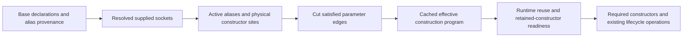

# Occurrence slicing and constructor identity

Owner: updater_1. Lead: updater_0. Date: 2026-09-24.
Task: tickets/tasks/2026-09-24_discover_override_occurrence_slicing_task.md.

## Conclusion

Supplied dependency values can remove unnecessary construction by cutting their parent parameter
edges before selecting work reachable from the root. The existing injection plan contains enough
information for basic cuts, and the current manifests preserve that information.

The general solution needs a distinction the current representation does not fully preserve:
logical access paths versus physical constructor instances. Shared providers collapse several paths
into one object, and their transient descendants must not be duplicated or addressed only through
whichever path happened to become canonical first. The diagnostic exposes failures in both shortcuts.

## Measured structural examples

Eleven untimed scenes use real binding, phase-8 occurrence analysis, phase-9 injection data and
phase-10 plans. A separate row-slice interpreter calls constructors directly to verify retained work.
It does not replace native Meld or implement its admission, scopes, hooks, reuse or disposal policies.

| Scene | Current native constructors | Row-slice simulation | What it establishes |
| --- | ---: | ---: | --- |
| Five many dependency slots, three supplied | 6 | 3 | Two default providers plus root remain. All five slots use the same provider type, so pruning by type would be wrong. |
| Five shared-provider slots, three supplied | 2 | 2 | Remaining d/e uses retain one shared provider plus root. |
| One-member collection replaced with [] | 2 | 1 | Whole-socket replacement cuts member construction even when the supplied list is empty. |
| child>value supplied | 2 | 2 | Modifying a constructor input still needs that child constructor. |
| Whole child supplied | 2 | 1 | Replacing the child removes its constructor. |
| Deep left branch supplied | 511 | 256 | The right branch and root remain. |
| Both deep root branches supplied | 511 | 1 | Only the root constructor remains. |

The other four scenes probe shared-provider descendants, below. All eleven also reconstruct the same
basic slice from marshal-round-tripped manifest rows. Canonical manifest bytes remain unchanged.
Source fingerprints and the diagnostic hash are retained in results.json. No speed timings are claimed.

## Shared-descendant counterexample

The fixture has one Branch per conduit and a Token declared many:

```text
PairRoot.left  --+--> one shared Branch --> one Token
PairRoot.right -+
```

There are five logical occurrences if both paths are expanded: root, left Branch, right Branch,
left Token and right Token. Native planning creates three physical instances. Expanding both paths
and then merely deduplicating Branch leaves four instances, including an unused second Token.

The selector side shows the opposite information loss:

| Request | Current native right.token.value | Row-only simulation | Structural observation |
| --- | ---: | ---: | --- |
| No override | 13 | 13 | Baseline has three instances. |
| right>token>value = 91 | 13 | 13 | Selector is accepted, but its Token occurrence has no base instance row. |
| left supplied; right>token>value = 91 | 13 | 13 | The retained right alias still cannot address its descendant through base rows. |
| left supplied; left>token>value = 91 | 91 | 91 | A rule beneath the replaced logical path changes the Branch retained by right. |

These are observations of the existing runtime, not behavior introduced by the simulator.
Filtering the existing instance rows preserves the asymmetry. Fully expanding logical paths and
then shallow grouping introduces extra construction. Both are insufficient as a general algorithm.

The missing information is an alias-to-construction-site relationship. A many child under one shared
parent constructor is one physical child, even when that parent is accessible through several paths.
The same provider type requested by two distinct many parent sites remains two children.

## Bounded proof of the proposed representation

alias_demand_probe.py now tests constructor-site identity using the real uncollapsed declarations.
It is an untimed interpreter with the proposed policy: validate selectors, ignore valid inactive
targets, and reject unequal equal-rank inputs on one active physical socket. Native admission,
locking, hooks, disposal and generalized contract readiness are outside this proof.

Nine cases pass:
- A right-side descendant input reaches the one Token even while both Branch aliases remain live.
- Replacing the old canonical left alias preserves the right input and keeps three constructors.
- An input below the replaced left path becomes inactive and does not change the right Token.
- Matching inputs through both aliases converge on one Token; conflicting active inputs refuse
  before application construction. A conflicting input under a cut alias remains inactive.
- Direct and deeper aliases converge before expanding their shared descendant; four constructors
  run for the unequal-depth fixture, with the requested value reaching both aliases.
- An injected reuse result stops descent through the shared Branch, while an independent Token
  sibling still constructs. The same plan executes two constructors with reuse and four after the
  reuse value is removed. This simulates the branch condition; it does not implement native stores.
- Four changing ordinary/falsey values bind through one prepared graph without retaining old values.
- The same logical socket set with different selector specificity requires a different prepared
  binding layout, as described in the cache section below.

The plan stores socket references rather than caller values. Values and equal-rank comparisons bind
per evaluation. Runtime, fixture and diagnostic hashes are stable; Ruff passes with UP045 excluded.
Exact results are in alias_results.json. This proves the bounded identity mechanism, not a complete
native structural implementation or a production speedup.

## Conditional alias proof after independent review

The lead's review exposed two limits in the earlier nine-case interpreter: a rule below a reused
CachedParent could still conflict with, or outrank, the rule below a FreshParent that actually needs
the shared child. The native control confirms this state is reachable: CachedParent can retain an
external child while the declared SharedService store is empty after purge. The two alias failures
remain observations of the earlier interpreter, not claims about newly tested native input behavior.

The separate conditional_alias_plan.py and conditional_alias_probe.py preserve those earlier files
and receipts. Twenty cases pass under the proposed inactive-path policy:

| Conditional case | Observed result |
| --- | --- |
| Reused parent contributes an equal-rank conflicting descendant input | Inactive input excluded; active value 91; three constructors. |
| Reused parent contributes a higher-rank descendant input | Inactive input excluded; surviving broadcast 91 wins; three constructors. |
| Same prepared equal-rank plan with no reused parent | Both inputs active; conflict before application constructors. |
| Same prepared priority plan with no reused parent | Higher rank 21 wins; both parents share the new service; four constructors. |
| Parent and shared service both reused | No service input comparison/construction; only FreshParent and root construct. |
| Only rule supplying a service's Token lies below reused parent | Default Token edge becomes active; Token value 13; four constructors. |
| Same prepared Token plan with no reuse | Supplied Token/None/False used by identity; no Token constructor; four constructors. |

The remaining controls retain static cuts, equal-rank conflicts, specificity, distinct many sites,
unequal-depth fan-in, independent sibling demand and falsey/empty whole-collection replacement.
One plan accepts changing falsey values. Value-only metadata snapshots and canonical native manifests
remain unchanged across evaluations; runtime and earlier artifact hashes remain unchanged. Both new
files pass scoped Ruff with UP045 excluded. Exact evidence is in conditional_alias_results.json.

The lead independently confirms both repaired input layouts in
artifacts/override_structural_discovery_20260924/conditional_alias_review_results.json. Native Meld
and purge establish a live parent with an absent stored child; one conditional plan then alternates
reused/fresh/reused outcomes as 91/conflict/91 and 91/21/91. Its guard instructions and canonical
manifest remain unchanged. That execution still uses the interpreter with injected reuse outcomes.

The prepared representation is a boolean instruction schedule plus physical construction sites:

```text
alias demand = incoming path demand AND parent-construction branch AND unsupplied socket
site demand = OR(all alias demands for that physical site)
site construction = site demand AND reuse miss                 # shared lifetimes only
input source = highest-rank candidate whose alias/construction guard is true
default dependency demand = site construction AND no active supplied input for this socket
```

Preparation collects all possible fan-in before lowering a site's sources and children. It keeps
every guarded candidate, including lower-priority candidates that may later be the only active ones.
It also keeps conditional default edges: removing an inactive value alone is insufficient when the
earlier static plan permanently removed its default provider. Reuse results and caller values are
never cached. The same prepared program handles reuse, fresh construction and changed values.

This is an untimed interpreter over fixed injected reuse outcomes. It evaluates a prepared boolean
schedule and interprets constructor edges; it does not establish production hot-path overhead.
It also does not establish native lookup/reservation atomicity, lock ordering, readiness admission,
hook behavior or disposal. Arbitrary-object equality remains an unresolved policy choice; the proof
uses the earlier scalar equality rule only. A production emitter can lower prepared guards into
direct branches, but that lowering and its timing remain unimplemented.

## Existing source and data boundaries

| Layer | Current representation | Consequence |
| --- | --- | --- |
| Phase 3 topology | Per-parameter target IDs, socket kind, collection/optional flags, signature and required-reference metadata | Useful declaration templates; readiness and executable edges are distinct facts. |
| Phase 5 blueprint | Spell-ID DAG plus full topology-derived socket paths | Structural DAG edges omit parameter metadata; socket overlay preserves logical paths. |
| Phase 8 graph | (Spell ID, path ID) -> parameter -> ordered child occurrences | Shared expansion always stops after the first occurrence of a shared Spell. Alternate descendants disappear. |
| Phase 9 instances | many uses (Spell ID, path ID); shared uses (Spell ID, None) and one canonical occurrence | Constructor identity and path identity diverge. |
| Phase 9 injection | Per-instance parameter sources and dependency instance keys; explicit collection/required-input data | Basic edge cuts are available, but canonical shared descendants retain the original path. |
| Phase 9 targeting | Rooted socket refs normalized into exact, unique and broadcast selectors | Logical selectors can outlive their corresponding constructor rows. |
| Phase 10 plans | Ordered physical steps and parameter dependency keys | Filtering every step by Spell ID is unsafe; filtering instance rows alone loses alias semantics. |
| Phase 11 manifests | Pure-data rows, targets, specificity and plan signatures | Basic closure round-trips today; alternate shared descendant routing is absent. |
| phase8_11 Codegen IR | Counts, summaries, strategy IDs and signatures | This exporter is diagnostic, not a stored full adjacency graph. |

Source anchors:
- src/melder/aether/spellbook/spell_compiler/system/spell_system_root_blueprint_builder.py:61-190
- src/melder/aether/spellbook/spell_compiler/system/spell_system_root_blueprint_builder.py:432-490
- src/melder/aether/spellbook/spell_compiler/spell_analyzer/strategies/spell_occurrence_graph_analyzer_strategy.py:218-242
- src/melder/aether/spellbook/spell_compiler/spell_analyzer/strategies/spell_occurrence_graph_analyzer_strategy.py:719-855
- src/melder/aether/spellbook/spell_compiler/artifact_processor/strategies/spell_occurrence_instance_processor_strategy.py:134-215
- src/melder/aether/spellbook/spell_compiler/artifact_processor/strategies/spell_injection_processor_strategy.py:124-342
- src/melder/aether/spellbook/spell_compiler/artifact_processor/strategies/spell_override_targeting_processor_strategy.py:43-119
- src/melder/aether/spellbook/spell_compiler/phases/shared_compiler_executions.py:1355-1451

## Proposed effective-plan preparation

This is a design proposal, not an implemented production algorithm.

The concrete internal payload needs these distinct relations; names here describe proposed fields,
not new public classes or APIs:

| Proposed relation | Required data and owner |
| --- | --- |
| Base parameter templates | Selected Spell ID, constructor parameter name/kind/position, source kind, ordered provider/member references, descriptor state and existing runtime/store/disposal facts. Produced by phases 8-9 from durable topology and contract selection. |
| Physical construction sites | Root site; existing shared-lifetime identity; many sites relative to their effective physical parent and parameter/provider slot. This avoids multiplying children merely because a shared parent has two logical paths. Owned by instance planning. |
| Logical aliases | Each declared/active (Spell ID, path ID) points to its construction site. Retain baseline provenance and enough parameter templates to derive active aliases after cuts. |
| Socket normalization | A logical owner/path/parameter maps to a physical constructor parameter slot. Normalize active aliases before applying cross-alias conflict rules. |
| Effective request program | Retained site IDs, substituted operand slots, inactive logical-rule classification, constructor prerequisites and runtime reuse branches. Derived once per structural override shape. |

Construction-site identity is compiler metadata. Existing Existence policy, store routing and Creations
remain the lifetime/ownership authorities. Process all active consumer aliases before expanding a shared
provider's children; a first-visited-path recipe would repeat the canonical-path bias shown above.

Candidate source owners:
- SpellOccurrenceGraphAnalysis and SpellOccurrenceGraphAnalyzerStrategy: retain logical alias evidence
  when duplicate shared expansion stops, rather than silently discarding that relationship.
- SpellOccurrenceInstanceAnalysis and SpellOccurrenceInstanceProcessorStrategy: own physical sites and
  their logical aliases, including many descendants of shared parents.
- SpellInjectionInstanceSpec and SpellInjectionProcessorStrategy: express parameter operand sources
  against those sites and retain structural descriptor facts separately from Python argument values.
- SpellOverrideTargetingProcessorStrategy and the family targeting/finalizer runtimes: normalize
  selected logical sockets against active aliases and bind per-call values to the resulting slots.
- SpellCodegenPlanner/family plan builders: own the base program and effective structural projection.
- Family manifest builders/helpers/hydrators: persist/reconstruct the required value-only relations.
- Family emitters and existing CreationContext/Meld doors: execute the projected program with the
  lead's scope, readiness and reuse ordering. The ordinary many path can retain direct-call emission.

1. Retain a base construction description with parameter edges, declaration/readiness facts and
   logical-to-physical alias provenance. Preserve the ordinary plan and its ownership boundary.
2. Resolve selectors against declaration/socket metadata using the existing specificity rules.
   Bind supplied values later; only source/slot identity belongs in a cached structural shape.
3. Starting at the requested root, process consumers before providers. Collect the active aliases
   that demand each shared physical constructor before selecting its parameter sources or descendants.
4. Map active logical rules to physical constructor sockets. A many constructor site is determined
   by its effective parent construction and parameter/provider occurrence, not by Spell ID alone.
   Shared construction retains the existing lifetime grouping. Nested aliases map through that
   grouped parent to its one set of actual child construction sites.
5. Cut provider edges whose parameter values are supplied. Preserve ordered collection membership
   on unsupplied sockets and never infer collection shape from provider count. Plain/required inputs
   add no constructor edges. Fold applicable contract/default operand precedence before demanding work.
6. Keep only root-demanded physical constructors, including providers still used by other edges.
   Emit them using normal call layouts plus substitutions. Do not seed traversal from every ordered
   node: phase-8 ordered-node completion can include nodes outside root-path demand.
7. Retain guarded alias/source/default-edge choices where demand depends on runtime reuse. A shared
   object that is already available must be queried before constructing dependencies that only its
   constructor would need. Its inactive aliases must also stop contributing values or priority to
   other surviving paths. The cache holds that conditional program, not a snapshot of live stores.



For the basic graph the implemented diagnostic uses O(V+E) root traversal per shape. A full design
must account for alias fan-in and make its work proportional to the represented/reached graph, not
repeat graph traversal on every Meld call. Full uncollapsed expansion is a diagnostic oracle here;
it is not a recommendation to multiply stored shared subtrees in production.

## Cache and invalidation impact

The many-only and generalized family manifests both preserve parameter dependency rows and targeting
metadata. Their schema versions are currently 3. The shared cache package version is 2 and routes to
family loaders. New alias/construction-site/readiness data should live in that existing family-owned
serialization path, with explicit versioning and cold rejection of incompatible records.

Derived effective plans should remain scoped to their base plan/CreationContext. Key them by the base
structural signature, resolved physical operand placement/cuts, positional shape when applicable and
the chosen semantics version. Do not key on supplied object identity or snapshot current live stores.
Value-dependent equal-rank conflict checks remain per call. Generalized source/factory caches currently
use coarser count-based keys and need exact effective-layout identity before emitting different slices.

The new alias proof also shows why the old many-only logical socket shape is insufficient by itself
after aliases converge. {**value: 21, right>token>value: 91} and
{left>token>value: 21, right>token>value: 91} resolve to the same two logical sockets. The first request
selects 91 by priority; the second has an equal-rank conflict on the one physical Token input.
Preserve effective specificity/provenance in a conservative shape key, or key the final physical
winner/conflict layout. Do not reuse the first binding program merely because the socket set matches.

With conditional aliases, a cached binding layout must include all potential ranked candidates and
default-edge guards. The winner from one reuse state is not a stable structural identity. The twenty
conditional cases exercise unchanged plan metadata through different simulated store outcomes.

Phase-5 blueprint/index replacement already cleans occurrence analysis, model/plan/creation output
and the Spell's CreationContext. Context cleanup advances the Spell's door epoch and resets leader
election. Attach derived state to that lifecycle instead of introducing another invalidation authority.
PathRegistry is builder-owned and not thread-safe; clone/own any registry that a shape builder extends.
The diagnostic clones it and leaves the canonical manifest unchanged.

Source anchors:
- src/melder/aether/spellbook/spell_compiler/codegen_creation_system/strategies/many_only/manifest/many_only_manifest.py:47-150
- src/melder/aether/spellbook/spell_compiler/codegen_creation_system/strategies/generalized/manifest/generalized_manifest.py:39-202
- src/melder/aether/spellbook/spell_compiler/codegen_creation_system/shared_assets/manifest_creation_cache.py:29-122
- src/melder/aether/spellbook/spell_compiler/phases/compiler_phase_5.py:166-218
- src/melder/aether/spellbook/spell.py:686-713
- src/melder/aether/spellbook/spell_compiler/dag/dag_index.py:32-275

## Decisions the lead must combine with this representation

- Define valid nested rules beneath replaced paths: ignore as inactive, or reject as contradictory.
  Do not mutate the supplied object, and do not let an inactive alias silently modify a retained one.
- Decide conflicts between different logical aliases of the same physical socket after normalization.
- Distinguish static replacement from runtime shared reuse, including nested rules beneath an already
  reused parent. Do not cache live reuse outcomes as if they were structural shape facts.
- Check readiness for every constructor actually demanded. Full-graph validation cannot simply be
  bypassed: lead probes find both early refusals and unresolved contract defaults reaching constructors.
  Readiness here means structural provider/descriptor and execution-policy prerequisites. Do not add
  a blanket required-argument validator: preserve ordinary Python missing-argument errors and their
  existing Meld translation for retained constructors.
- Recompute inherited request-only Space requirements from effective work while retaining the root's
  own lifetime/scope constraints. The lead owns the exact admission ordering and locking decision.
- Preserve current direct/nested hook contracts unless the owner separately chooses a hook change.

The graph diagnostic intentionally does not settle those policies. The lead's semantics_findings.md
and semantics_observations.json carry the independent validation/lifecycle evidence.

## Verification and next boundary

graph_slice_probe.py passes eleven scenes, marshal round-trip closure equality, canonical-manifest
immutability and source/diagnostic fingerprint checks. Ruff passes with UP045 excluded for Optional
typing. No production changes or timings were made. The earlier emitter prototype remains frozen.

```powershell
$env:PYTHONPATH = "$PWD/src;$PWD"
& .venv_new/Scripts/python.exe context_compass/artifacts/override_occurrence_discovery_20260924/graph_slice_probe.py
```

The combined structural_plan.md agrees with the source and bounded diagnostics, with the additional
requirement to retain conditional default edges as well as guarded operand candidates. Twenty new
cases qualify conditional alias selection in simulation; the earlier nine-case proof and the lead's
counterexamples remain preserved. The next boundary is native admission/readiness and lifecycle
integration under the selected structural contract. Actual store locks, purge/reuse races, contract
readiness, cache hydration and positional inputs remain unqualified by this proof.

```powershell
$env:PYTHONPATH = "$PWD/src;$PWD"
& .venv_new/Scripts/python.exe context_compass/artifacts/override_occurrence_discovery_20260924/conditional_alias_probe.py
```
