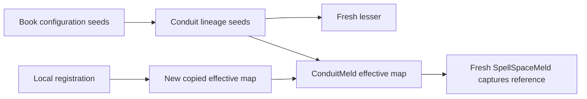

# Runtime hook registration, dispatch and lifecycle trace

- Ticket: TASK-2026-09-21-investigate-runtime-hook-clearing
- Epic: EPIC-2026-09-21-runtime-hook-lifecycle-and-adjustment
- Source review: 2026-09-21; updater_0
- Status: discovery reference; implementation is not authorized
- Scope: Book/Bind, per-Spell creation, Conduit lifecycle/link/contract, ConduitMeld and SpellSpaceMeld.

The broad epic is backlogged. Current work is only pooled Conduit/SpellSpace Meld baseline reset:
`tickets/tasks/2026-09-22_investigate_pooled_conduit_hook_reset_task.md`.

This records current source behavior, including gaps. It does not make every observed behavior a
desired contract. The owner accepts the existing local/lineage model. No source or test edits,
new runtime probes, or asset generation were performed during this continuation.

## Scope clarification: this is not a system-wide hook audit

The later broader investigation is recorded in `system_hook_standardization.md` in this directory.
It traces the additional families and proposes the common API. This file remains the core trace.

The owner asked whether this covers every hook in Melder. It does not: this lifecycle trace
is scoped to registration, resolution and Conduit/SpellSpace lifecycle. Additional source
surfaces confirmed in the follow-up are:

- RiftSpace action-specific and category-wide pre/post hooks for command/viewer/codegen operations.
- Rift room event callback subscriptions and memory callback subscriptions, each with unregister APIs.
- ChangeControlManager commit/abort hooks and associated validation/dirty-marking callbacks.
- SyntheticModule's process-global import hook, an infrastructure hook rather than a lifecycle callback.

At the initial follow-up, only their presence and entry methods had been read. The later system
inventory above adds their ownership, mutation and dispatch traces. This list gives counterexamples
to system-wide completeness; it is not itself an exhaustive inventory of every callback/extension seam.
The owner's later standardization direction brings these families into the common-API design scope.
That direction does not turn this presence check into a complete lifecycle audit or authorize repairs.

Evidence:
- `src/melder/nexus/rift/rift_space/rift_space.py:325-409`
- `src/melder/nexus/rift/rift_space/rift_space.py:596-727`
- `src/melder/nexus/rift/rift_space/event_system/rift_event_system.py:152-199`
- `src/melder/nexus/rift/rift_space/memory_system/rift_memory_system.py:340-387`
- `src/melder/aether/aetheric_frame/dev_ops/change_control_manager/change_control_manager.py:481-642`
- `src/melder/crystallizer/synthetic_module.py:1298-1340`

## Registry ownership and adjustment

| Family | Registration and storage | Change visibility / clearing today |
| --- | --- | --- |
| Configuration seeds | `SpellbookConfiguration.add_hook/add_hooks/with_hook/with_hooks`, keyed by Book ID | Additive until freeze. Split getters return live maps; merged getter copies maps and lists. No public clear. |
| Conduit events | `Conduit.register_conduit_hooks`, shared `_conduit_hooks` plus `_local_conduit_hooks` | Nonempty local event list shadows its inherited list. Empty/missing local event reveals inherited callbacks. No public clear. |
| Meld events | Same Conduit registration routes Meld names to `Meld.set_meld_hooks` | Shared mode stores a reference. Local mode copies effective lists and appends; overwrite replaces the copy. No public clear facade. |
| Per-Spell creation | `bind/bind_inactive` creation-hook kwargs, or SpellBinder `with_*_hook(s)` | Stored on the Spell version; shared by direct callers of that version. Internal `_set_hooks` replaces provided stages, `None` leaves unchanged, `[]` clears. |
| Bind lifecycle | Book `add_bind_hooks/clear_bind_hooks`, mirrored through normal Conduit | Own Bind tuple registry, independent of configuration freeze. Every operation retains one immutable three-stage callback set. Fresh Book starts empty. |
| SpellSpace | Construction passes owner ConduitMeld's effective map into its own SpellSpaceMeld | No separate public hook registration or Space-specific lifecycle event registry. Existing/recycled Spaces keep the captured map reference. |

Configuration admits eleven event names: two Meld events and nine Conduit/lifecycle/link/contract
events. `on_meld_activation` has a runtime dispatch branch but is absent from both public admission
sets. A search located all these family dispatchers; their implementations were read directly.

Runtime Conduit registration does not take a lock across its two updates. Configuration `add_hooks`
calls individual additions sequentially and can partially apply before a bad later callback/name.
Conduit mixed registration can likewise apply lifecycle updates before rejecting Meld updates.
Bind's new registry instead validates all three stages before replacement under its own lock.
These are different current guarantees; a future batch API must state its guarantee explicitly.

Evidence:
- `src/melder/aether/spellbook/configuration/spellbook_configuration.py:78-112`
- `src/melder/aether/spellbook/configuration/spellbook_configuration.py:692-928`
- `src/melder/aether/conduit/conduit.py:1657-1840`
- `src/melder/aether/conduit/meld/meld.py:1264-1329`
- `src/melder/aether/spellbook/spell.py:638-684`
- `src/melder/aether/spellbook/bind/bind.py:257-387`
- `src/melder/aether/conduit/conduit.py:3098-3179`

## Every event and its actual dispatch boundary

| Event | Arguments | Dispatcher and timing |
| --- | --- | --- |
| Bind pre | Original input reference | Bind, before reflection/construction; Book transaction already active. |
| Bind activation | Newly constructed internal Spell | Outside Bind construction lock, before profile completion and Book publication. |
| Bind post | Registered active or parked Spell | Book after its registration/recording steps; before the enclosing transaction exits. |
| `on_conduit_pre_created`, root conjure | None | CreationSystem after phase preparation, before Conduit construction. |
| `on_conduit_activated`, root conjure | New Conduit | Book is attached and marked conjured; ownership wiring/cache hydration follows. |
| `on_conduit_post_created`, root conjure | New Conduit | After ownership wiring, cache work, Nexus publication and risk registration. |
| `on_conduit_pre_created`, lesser | Calling parent Conduit | Parent's effective lifecycle chain before pool acquisition/construction. |
| `on_conduit_activated`, lesser | New/reused lesser | Parent's chain after shell creation/reactivation, before ward attachment. |
| `on_conduit_post_created`, lesser | Calling parent, lesser | Parent's chain after ward attachment. Same sequence for fresh/reused shells. |
| `on_conduit_cleanup_start` | Dying Conduit | Permanent cleanup only, before `_cleaned` and core teardown. |
| `on_conduit_cleanup_complete` | Dying Conduit | After core teardown and field removal, before hook references/logger are dropped. |
| `on_conduit_post_link` | Initiator, target | Successful public `link`, after its transaction and local lock exit. |
| `on_conduit_post_unlink` | Initiator, target | Successful public `sever_link`, after its transaction and local lock exit. |
| `on_contract_created` | Calling Conduit, peer | Successful `add_spell_to_contract`; bulk add emits once if any success. Inside transaction. |
| `on_contract_removed` | Calling Conduit, peer | Successful single/bulk removal or internal remove-all wrapper; once per operation/batch. |
| Spell pre | None | Ordinary Meld after target admission/validation, before Meld pre. |
| `on_meld_pre_resolve` | Selected Spell | After Spell pre; before CreationContext execution. |
| Spell activation | New application instance | Only when execution returns `created=True`. |
| `on_meld_activation` | Selected Spell, new instance | After Spell activation; internally reachable, public registration rejects its name. |
| Spell post | None | After successful execution/activation, including ordinary reuse. |
| `on_meld_post_resolve` | Selected Spell | After Spell post. No resolved-instance argument. |

Root and lesser construction reach different dispatchers with different argument counts.
A callback registered for both must accept the actual signatures. Lesser construction uses the
calling parent's lifecycle chain, while the child's inherited seed maps come from the lineage root.
Local root/parent callbacks do not automatically become the child's local callbacks.

Link hooks fire on the initiator, not automatically on both participants. Contract events receive no
Spell ID or batch report. Peer-resolution failure omits the advisory event. Index add/remove and
`remove_root_from_contracts` have no direct event call; internal ward operations do not provide a
general lifecycle hook dispatcher. Do not describe these events as a complete graph-change feed.

Evidence:
- `src/melder/aether/spellbook/bind/bind.py:636-788`
- `src/melder/aether/spellbook/spellbook.py:4944-5089`
- `src/melder/aether/spellbook/spellbook.py:5264-5450`
- `src/melder/aether/spellbook/spellbook_creation_system.py:202-288`
- `src/melder/aether/spellbook/spellbook_creation_system.py:954-1019`
- `src/melder/aether/conduit/conduit.py:638-695`
- `src/melder/aether/conduit/conduit.py:2228-2388`
- `src/melder/aether/conduit/conduit.py:4541-4643`
- `src/melder/aether/conduit/conduit.py:4940-5003`
- `src/melder/aether/conduit/conduit.py:5439-6136`
- `src/melder/aether/conduit/conduit.py:6369-6464`
- `src/melder/aether/conduit/meld/conduit_meld.py:486-576`
- `src/melder/aether/conduit/meld/spellspace_meld.py:450-536`

## Invocation consistency, reuse and failures

| Family | In-flight callback view | Failure behavior |
| --- | --- | --- |
| Bind | One captured immutable set for the entire bind | First ordinary exception becomes HookExecutionError; later callbacks stop. Unpublished activation failure tears down the new Spell/index. Post failure does not undo publication. |
| Root conjure | Captured map reference, live list lookup/iteration per stage | Logs/suppresses ordinary callback failures and continues. |
| Runtime Conduit events | Detached list selected for each event; local shadow rule | Logs/suppresses ordinary callback failures and continues. |
| Meld / Spell | Reads stage maps/lists when each stage runs; no whole-call snapshot | First ordinary callback failure becomes HookExecutionError and stops that call's remaining stages. |

Both ordinary Meld doors share the same callback order. Ordinary reuse still runs pre/post, but no
activation. Existing-object execution returns `created=False`, so activation is also skipped there.
Both `meld_existing_spell` implementations bypass all hooks. Observational lookup and purge are
separate paths; sharing lookup does not make them emit Meld callbacks.

Public Conduit.meld always enters its own Meld; it does not redirect into an active Space. Public
SpellSpace.meld uses its own Meld. In dynamic mode the Conduit facade holds an outer CreationGate
ticket across callbacks. Direct Space meld has no equivalent outer ticket: CreationContext gates
execution, and Space pre/post callbacks run outside that inner ticket. A future clear/update protocol
must not assume draining construction freezes every callback in every scope.

The previously retained experiments show selected-root creation hooks execute on direct requests;
dependency creation hooks did not fire for inline construction in the tested graph. Extending that
behavior is a separate decision, not necessary to expose set/clear.

Warm doors already check the effective Meld map and Spell `_door_epoch`. `_set_hooks` updates the
hook gate and bumps that epoch. No alternate cache invalidation system is proposed. Retaining an
empty event list inside a nonempty Meld dictionary still selects the hook-aware lane.

Bind activation precedes `_add_hooks_to_spell`, so explicit bind creation-hook kwargs can replace
stages set by activation. SpellBinder's similarly named fluent hooks configure application creation,
not registration callbacks. Rebinding hooks must preserve this distinction.

Evidence:
- `src/melder/aether/spellbook/bind/bind.py:307-437`
- `src/melder/aether/spellbook/spellbook.py:5526-5575`
- `src/melder/aether/spellbook/spellbinder.py:668-870`
- `src/melder/aether/spellbook/spellbook_creation_system.py:1280-1316`
- `src/melder/aether/conduit/meld/meld.py:1309-1329`
- `src/melder/aether/conduit/meld/meld.py:1660-1716`
- `src/melder/aether/conduit/meld/conduit_meld.py:359-751`
- `src/melder/aether/conduit/meld/spellspace_meld.py:333-703`
- `src/melder/aether/conduit/meld/creation_context/creation_context_builder.py:179-234`
- `src/melder/aether/conduit/conduit.py:4051-4199`
- `src/melder/aether/conduit/spell_space/spell_space.py:440-495`
- `src/melder/aether/conduit/meld/creation_context/creation_context.py:237-274`
- `tests/experimentation/test_runtime_hook_discovery_experiment.py:302-394`

## Pool and graduation reference map

```text
Configuration[Book ID] --> Conduit lineage seeds --> fresh lesser seeds
                                 |
                                 +--> ConduitMeld effective map --> fresh SpellSpaceMeld
                                           |
                          local add replaces effective map with copied lists
                          earlier SpellSpaces still hold the earlier reference
```



Lesser return clears local Conduit events but retains its effective Meld map. Its Space pool survives
the return too. Manual and managed Space cleanup reset creations but preserve Meld collaborators.
Neither manual acquire/prepare nor managed `acquire_untracked` refreshes those collaborators. A reset
fix must cover both acquisition paths and owner changes while a Space is idle. Clearing a borrowed
dictionary in place would alter other scopes; replace/rebind the local reference instead.

Ordinary lesser pool return emits no permanent-cleanup events. Overflow later destroys an idle shell whose
local lifecycle callbacks were already removed. Permanent Conduit cleanup keeps hooks/logger until
its final event; that event receives a largely torn-down object. Meld cleanup drops borrowed maps.
Space hard teardown currently deletes `_meld` without invoking its cleanup: record a focused future
teardown probe before changing that behavior.

Graduation has a separate ownership problem:

1. It flips normal state, installs a new pool and rewires creation stores/root IDs.
2. Ward conversion only accepts a childless lesser. This contradicts the higher-level docstring's
   retained-children claim, and the Conduit state flip already happened when ward refusal occurs.
3. Conversion clears the child's parent pointer but leaves the parent's child-map entry in place.
4. The fresh Book factory's return is discarded. Conduit/Meld retain the old Book and map aliases.
5. Existing Spaces retain the old Book, resolution ID, store and hook references they captured.
6. Bind-hook facades now pass the normal-state guard and still change the old Book. Normal cleanup
   calls cleanup on that same attached Book. The former parent's child-map cleanup also still has
   the graduated conduit as a target.

These are source findings, not new runtime reproductions. Graduation qualification must cover
reciprocal detachment, refusal before mutation, fresh Book attachment, every cached registry alias,
definition visibility, existing/idle Spaces, bind-hook isolation, and cleanup in both parent/child
orders. Do not promise descendant migration or repair this with a one-line Book assignment.

Evidence:
- `src/melder/aether/conduit/conduit.py:334-363`
- `src/melder/aether/conduit/conduit.py:564-695`
- `src/melder/aether/conduit/conduit.py:767-866`
- `src/melder/aether/conduit/conduit.py:1902-2140`
- `src/melder/aether/conduit/conduit_pool.py:100-161`
- `src/melder/aether/conduit/conduit_ward/conduit_ward.py:305-329`
- `src/melder/aether/conduit/conduit_ward/conduit_ward.py:526-579`
- `src/melder/aether/conduit/conduit_ward/conduit_ward.py:1140-1185`
- `src/melder/aether/conduit/meld/meld.py:241-362`
- `src/melder/aether/conduit/spell_space/spell_space.py:166-208`
- `src/melder/aether/conduit/spell_space/spell_space.py:266-400`
- `src/melder/aether/conduit/spell_space/spell_space_pool.py:119-279`
- `src/melder/aether/spellbook/spellbook.py:360-451`
- `src/melder/aether/spellbook/spellbook.py:6386-6423`

## Recording and restoration

Book configuration emission records `conduit:<event>` and `meld:<event>` keys plus supplied
`bind:pre`, `bind:activation`, `bind:post` markers. Bind add/clear refreshes the whole Book twin when
recording is applicable. Current Conduit twins carry no runtime-local hook markers; SpellCrystal
carries no per-Spell creation-hook markers. Preflight/restore can report only what was recorded.

ConfigurationLossStrategy emits informational code-participation findings. RestoreEngine records
`hook_requires_code_participation` shortfalls and continues without recreating callback functions.
Future controls need marker ownership, scope and update emission, not callable serialization.
Ordinary lesser conduits and SpellSpaces remain transient in this epic.

Evidence:
- `src/melder/aether/spellbook/configuration/spellbook_configuration.py:332-418`
- `src/melder/aether/spellbook/spellbook.py:4833-4858`
- `src/melder/aether/conduit/conduit.py:422-466`
- `src/melder/crystallizer/crystals/spell_crystal.py:1071-1170`
- `src/melder/crystallizer/crystals/spellbook_crystal.py:243-264`
- `src/melder/crystallizer/crystal_analysis/preflight/configuration_loss_strategy.py:75-120`
- `src/melder/crystallizer/crystal_loader_system/restore_engine.py:1738-1818`

## Follow-up order and evidence limits

1. Pool reset: smallest independent repair; retain local/lineage semantics and cover both Space paths.
2. Graduation: separate ownership investigation/probes before implementation; parent isolation is key.
3. Public adjustment: choose clear versus restore-inheritance versus explicit mute, validation and
   in-flight behavior per family. Internal primitives exist, but their semantics differ.
4. Recording and qualification: precise presence/scope markers and source-backed documentation.

Decisions to keep separate: public Meld activation, dependency-node callbacks, missing contract-event
symmetry, new Space lifecycle hooks, and changes to permanent-cleanup timing. None is silently approved.

Retained evidence is sixteen characterization cases passing in 4.83 seconds before the owner's
documentation-only instruction. They describe current behavior, including undesirable outcomes.
This continuation ran no tests and generated no assets. Concurrency stress, graduation runtime
reproduction, failure-side effects and corrected next-lease behavior remain future validation.
