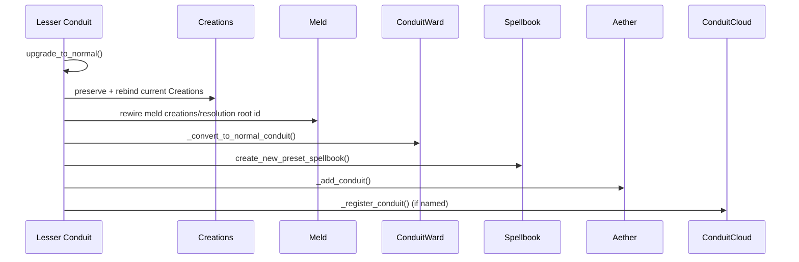
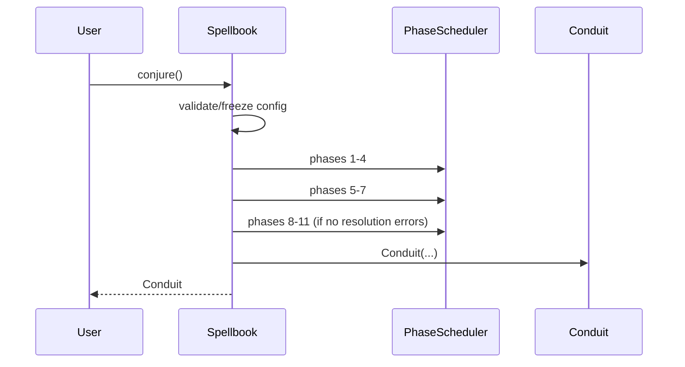
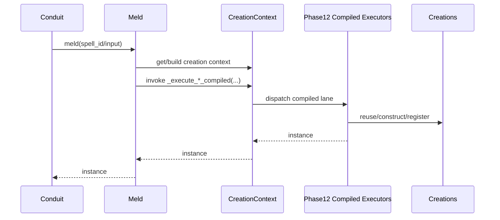
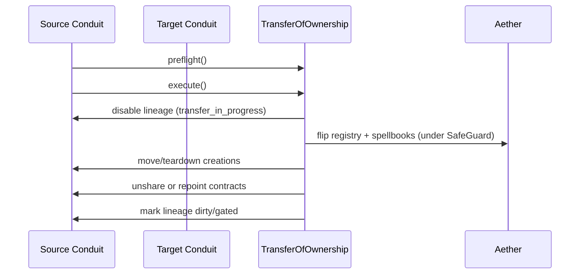
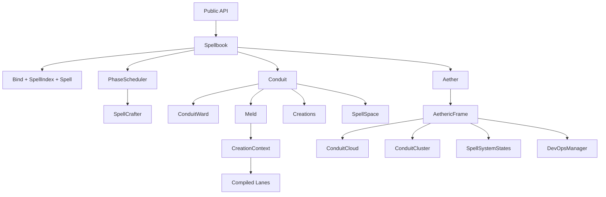

# Src Components (C3/C2/C1)

## Metadata
- Doc ID: COMP-SRC-2026-01-17
- Status: in_progress
- Owner:
- Created: 2026-01-17
- Updated: 2026-02-14

## Scope
This document defines C3 components, C2 subcomponents, and C1 code references
for the Melder core platform (`src/melder`). It complements
`context_compass/architecture/src_architecture.md` by providing component-level
responsibilities, contracts, and relationships.
Melder is framed here as a Dependency Graph Runtime (DGR) with DI-style
binding and resolution as a subset capability.

Out of scope:
- Tests and example docs.
- JSON sidecar metadata files (`__*.json`).

## Documentation Quality Standard
This document is treated as durable context. It must be deep enough to recover
system understanding from a blank slate without handwaving.

Required rules:
- No handwaving. Every claim must be grounded in source evidence or marked as UNKNOWN.
- Explicit entrypoints and method-level call flows for core behavior.
- Explicit ownership, lifecycle, and cleanup order for components.
- Explicit invariants, failure modes, and concurrency constraints.
- ASCII and Mermaid diagrams for core flows.
- Update the information sources list when new files are used.

## DO NOT ASSUME / Unknowns Gate
Rule: No Unverified Claims.
Any statement that is not directly supported by evidence must be treated as UNKNOWN.

Evidence means at least one of:
- A specific source file reference (preferred: file + symbol/method/class name).
- A citation to an explicit, already-verified artifact (e.g., a prior approved doc section).

If not evidenced => UNKNOWN.

UNKNOWN items must be explicitly labeled UNKNOWN (or added to the Unknowns section).
UNKNOWN items must be investigated by reading the relevant source(s).
If investigation cannot be completed (missing source access, ambiguity, or time),
the item must remain UNKNOWN and must not be promoted to fact.

No reasonable assumptions.
Do not infer behavior from naming, patterns, conventions, or typical frameworks.
Only the code/docs count.

When unsure:
- Mark it UNKNOWN.
- Identify the most likely evidence target (file + symbol).
- Investigate, then update the doc (or leave it UNKNOWN).

## Unknowns
This section is a living list of claims currently not backed by evidence.
Each item must include:
- What is unknown.
- Why it matters (impact).
- Where to investigate (file(s) + symbol(s)).
- Current status (uninvestigated / investigating / blocked).

- UNKNOWN: Producer call sites for advanced mutation/contract state flags
  (`SpellState.contract_violation`, `SpellState.mutation_candidate`,
  `SpellState.mutation_quarantined`, `SpellState.mutation_failed`) remain
  unresolved in runtime code.
  Why it matters: Without explicit producers, mutation/contract diagnostics and
  policy gating can drift from actual runtime behavior.
  Clarification: SpellContract/MutationContract descriptor behavior is already
  evidenced and no longer unknown. SpellContract contract-unvalidated wiring is
  present via Phase 4 + `mark_contract_dependents_dirty` call paths; and
  MutationContract sockets are explicitly blocked in Phase 4 with
  `MUTATION_CONTRACT_DISABLED`, while mutation overlays still emit
  `mutation_contract_set` / `mutation_contract_cleared` through
  `Spell.apply_mutation_override` and `Spell.clear_mutation_override`.
  Evidence from current sweep:
  `SpellMutationNode.snapshot_from_spell` / `apply_to_blueprint` and
  `CreationMutationNode.snapshot_from_creation` / `apply_to_creation` are
  placeholder `NotImplementedError` hooks, and `Research.promote_spell_version`
  documents runtime propagation as a surrounding-system hook.
  Where to investigate: `src/melder/spellbook/mutations/research/research.py`
  (`promote_spell_version`), `src/melder/spellbook/mutations/research/spell/node/spell_mutation_node.py`,
  `src/melder/spellbook/mutations/research/creation/node/creation_mutation_node.py`,
  `src/melder/aether/dev_ops/spell_system_states/spell_system_states.py`,
  `src/melder/aether/dev_ops/spell_system_states/spell_state.py`,
  `src/melder/aether/dev_ops/spell_system_states/spell_state_change_reason.py`.
  Follow-up stories:
  `STORY-2026-02-13-spellstate-advanced-flag-producers`,
  `STORY-2026-02-13-mutation-research-runtime-wiring`.
  Current status: blocked (mutation systems partially on hold; producer wiring
  is tracked by follow-up stories).

## Table of Contents
- Metadata
- Scope
- Documentation Quality Standard
- DO NOT ASSUME / Unknowns Gate
- Unknowns
- Table of Contents
- Component Template
- C3 Components Catalog
- C2 Subcomponents Catalog
- Method-Level Call Flows (C1)
- C1 Code Map (Core)
- Diagrams
- Information Sources
- DI Resolution Contract Notes (Spec vs Implementation)
- Open Questions
- Context / Handoff Summary

## Component Template
Each component entry includes:
- Purpose
- Responsibilities
- Inputs
- Outputs
- Owned State
- Lifecycle/Cleanup
- Concurrency/Threading
- Invariants/Guarantees
- Failure Modes
- Observability
- Extension Points
- Key Files (C1)

## C3 Components Catalog

### Component: Public API and Runtime Guardrails
Purpose:
- Provide the package entrypoint and import-time guardrails.

Responsibilities:
- Warn on Python < 3.13 and on GIL-enabled builds.
- Instantiate the registration guard singleton.
- Expose package metadata and version string.

Inputs:
- Python runtime version and `sys._is_gil_enabled()`.

Outputs:
- UserWarning messages.
- Module-level `__melder_registration_guard__` instance.

Owned State:
- Package metadata (`__version__`, `__author__`, `__license__`, `__description__`).
- `__melder_registration_guard__` singleton instance.

Lifecycle/Cleanup:
- Executes at import time; no explicit cleanup.

Concurrency/Threading:
- No explicit locks; import-time only.

Invariants/Guarantees:
- Guard singleton exists after package import.
- Runtime warnings are emitted but do not block execution.

Failure Modes:
- `InternalRegistrationError` when a candidate tagged with the guard sentinel is
  submitted through guarded registration paths.
- Runtime guardrails are warning-only for Python version / GIL mode checks.

Observability:
- Warnings via `warnings.warn`.
- Guard-block failures are surfaced as `InternalRegistrationError` exceptions in
  guarded bind paths.

Extension Points:
- None.

Key Files (C1):
- `src/melder/__init__.py`
- `src/melder/__melder_registration_guard__.py`

### Component: Spellbook Core (Binding and Conjure)
Purpose:
- Provide the primary binding and conjure surface for the DGR.

Responsibilities:
- Manage configuration lifecycle and logger initialization.
- Register spells into local maps and version caches.
- Maintain spell_id maps for O(1) spell_id resolution.
- Run phase pipelines before conjure.
- Conjure exactly one Conduit per Spellbook instance.
- Provide SpellBinder fluent adapter.
- Scan user-supplied modules for `scan_bind` metadata and bind spells.

Inputs:
- User spell objects, configuration inputs, policy/automatic flags.
- Module objects passed to `scan(...)`.

Outputs:
- Spell IDs from `bind()`.
- Spell ID lists from `scan(...)`.
- Conduit instances from `conjure()`.

Owned State:
- Spell registries (`_spells`, `_lookup_spells`, `_contracted_spells`).
- Spell_id maps (`_spells_by_id`, `_contracted_spells_by_id`).
- Version caches (`_spell_versions`, `_contracted_versions`).
- `_spell_validator`, `_spell_system_states`.
- `_configuration`, `_configuration_locked`.
- `_conduit`, `_conjured`, `_bind`.

Lifecycle/Cleanup:
- Configuration is validated/frozen before conjure.
- Cleanup is idempotent, unregisters local lineages from SpellSystemStates, and clears spells, configuration, validators, and logger. EVIDENCE: src/melder/spellbook/spellbook.py:_cleanup_spells

Concurrency/Threading:
- Internal RLock guards most mutable operations.

Invariants/Guarantees:
- Conjure allowed once per Spellbook instance.
- Configuration must be frozen before Conduit creation.
- Existing-object spells are registered into Creations on conjure/bind.

Failure Modes:
- `SpellbookValidationError` when Phase 1-4 produces broken spells.
- RuntimeError for duplicate spell ids or lookup key collisions.

Observability:
- Logs via SafeLogger in Spellbook and related components.

Extension Points:
- Conduit lifecycle hooks pulled from Configuration.
- Spell-level hooks (pre, activation, post).
- SpellBinder fluent binding surface.

Key Files (C1):
- `src/melder/spellbook/spellbook.py`
- `src/melder/spellbook/spellbinder.py`

### Component: Binding Pipeline (Bind, Spell, SpellIndex)
Purpose:
- Convert user objects into registered spell metadata with stable lineage keys.

Responsibilities:
- Build binding profiles via SpellExaminer.
- Compute fingerprints and create SpellIndex lineages.
- Determine canonical SpellType from binding profile + name/spellframe.
- Enforce Protocol and module binding constraints.
- Reject module and Protocol concrete binding targets while allowing class,
  callable, and existing-object bindings under profile/existence rules.
- Enforce existence constraints for method/lambda spells.
- Construct Spell objects with metadata and hooks.

Inputs:
- Spell object, spellframe, binding name, existence, permissions.

Outputs:
- Spell and SpellIndex instances.

Owned State:
- SpellIndex: immutable ULID + mutable version pointer.
- Spell: metadata, hooks, dependency placeholders, ownership fields.

Lifecycle/Cleanup:
- SpellIndex and Spell are Cleanable and null references on cleanup.

Concurrency/Threading:
- SpellIndex and Spell use RLock to protect mutation and cleanup.

Invariants/Guarantees:
- SpellIndex hash identity is stable and never changes.
- Protocols cannot be bound as concrete spells.
- Method/lambda spells must use `Existence.unique`.
- SpellType classification is stable for a given binding profile + metadata.
- Resolution style policy is maintained in
  `src/melder/spellbook/resolution_style_matrix.py`, where
  `BINDING_FAMILY_POLICY` is canonical and SpellType rows are derived.

Failure Modes:
- TypeError for invalid binding targets or protocol misuse.
- ValueError for invalid bindings (existence rules, binding name conflicts).
- ValueError if method/lambda spells are bound with non-unique existence.

Observability:
- Errors surfaced via exceptions and Spellbook logger.

Extension Points:
- Binding profile strategies in SpellExaminer.

Key Files (C1):
- `src/melder/spellbook/bind/bind.py`
- `src/melder/spellbook/bind/spell_index.py`
- `src/melder/spellbook/spell.py`
- `src/melder/spellbook/spell_types/spell_types.py`
- `src/melder/spellbook/resolution_style_matrix.py`

### Component: DI Descriptors and Contract Sockets
Purpose:
- Provide declarative DI placeholders and contract sockets for spell parameters.

Responsibilities:
- SpellMap encodes explicit DI intent and optional override payloads (dict/list/tuple).
- SpellMap supports concrete spell, spellframe, and frame-only forms and supplies canonical keys via SpellInputUtils.
- SpellContract declares late-bound sockets to be satisfied via conduit links.
- MutationContract declares mutation sockets with early vs late binding semantics.
- ParameterDIShape classification drives Phase 1 socket interpretation.

Inputs:
- Spell/frame/binding identifiers and optional override payloads (dict/list/tuple).
- `late_binding` flag for MutationContract.

Outputs:
- Canonical keys (frame_key, binding_key) and lookup triplets consumed by SpellCrafter and validators.

Owned State:
- SpellMap/SpellContract/MutationContract fields (spell, spellframe, binding_name, override).

Lifecycle/Cleanup:
- Cleanable descriptors; cleanup clears overrides and references.

Concurrency/Threading:
- No internal locks; immutable intent objects after construction.

Invariants/Guarantees:
- At least one of `spell` or `spellframe` must be provided.
- Binding names are normalized for case-insensitive matching and default to `__default__` when omitted.
- SpellMap preserves override payloads as provided; when `None`, no override is attached.
- SpellContract/MutationContract are intended for dynamic mode usage.

Failure Modes:
- ValueError when both `spell` and `spellframe` are None.
- `ContractProviderPresenceStrategy.validate` emits errors for SpellContract
  sockets in automatic mode; emits warnings for missing SpellContract providers;
  emits errors for invalid or ambiguous SpellContract defaults.
- `ContractProviderPresenceStrategy.validate` emits `MUTATION_CONTRACT_DISABLED`
  errors for MutationContract sockets while mutation systems are on hold.

Observability:
- Exceptions on invalid construction; validation issues reported in Phase 4.

Extension Points:
- None (descriptor types are not intended for subclassing).

Key Files (C1):
- `src/melder/aether/conduit/meld/contracts/spell_map.py`
- `src/melder/aether/conduit/meld/contracts/spell_contract.py`
- `src/melder/aether/conduit/meld/contracts/mutation_contract.py`
- `src/melder/spellbook/spell_crafter/spell_examiner/spell_requirements_finder/parameter_di_shape.py`

### Component: Configuration and System State
Purpose:
- Provide validated, freezable configuration for the Melder runtime.

Responsibilities:
- Maintain configuration properties and hook registry.
- Validate required properties and freeze mutation.
- Provide logger factory for SafeLogger initialization.
- Control system_state (automatic vs dynamic).

Inputs:
- Property values and hook registrations.

Outputs:
- Frozen configuration and hook maps.

Owned State:
- `_properties`, `available_properties`, `_idempotent_keys`.
- `_hooks` and `_logger_factory`.

Lifecycle/Cleanup:
- `freeze()` locks property mutations.
- Cleanup clears properties, hooks, and logger factory.

Concurrency/Threading:
- RLock guards property and hook mutations.

Invariants/Guarantees:
- Idempotent properties can be set once only.
- Frozen configuration cannot be modified.

Failure Modes:
- RuntimeError when cleaned/frozen configuration is mutated.
- ValueError when required properties are missing or semantically invalid.
- TypeError for invalid key/factory/hook input types.
- KeyError for unknown property lookup requests.

Observability:
- Exception-based reporting; no internal logging.

Extension Points:
- Additional properties and hook names.

Key Files (C1):
- `src/melder/spellbook/configuration/configuration.py`
- `src/melder/spellbook/configuration/system_state.py`

### Component: Aether Singleton (Global Runtime)
Purpose:
- Global singleton for all frames and shared registries.

Responsibilities:
- Create and manage AethericFrames.
- Bind configuration to frames.
- Register conduits and spell lineages.
- Provide version registry for spell ids.

Inputs:
- Conduit objects, SpellIndex sets, Configuration.

Outputs:
- Frame-level registries and lookups.

Owned State:
- `_aetheric_frames`, `_default_frame`, `_logger`.
- Singleton state (`_instance`, `_initialized`, `_lock`).

Lifecycle/Cleanup:
- `cleanup()` tears down frames and resets singleton state.

Concurrency/Threading:
- Class-level RLock guards singleton initialization and updates.

Invariants/Guarantees:
- One Aether instance per interpreter.
- Default frame exists when needed.

Failure Modes:
- ValueError for missing frames, duplicate registry entries, or not-found lookups.
- TypeError for invalid input types (e.g., non-string frame names).
- RuntimeError when singleton/frame registries are cleaned or unavailable.

Observability:
- Logs via SafeLogger.

Extension Points:
- Additional frame behaviors or registries.

Key Files (C1):
- `src/melder/aether/aether.py`

### Component: AethericFrame Services
Purpose:
- Per-frame container for conduits, registries, and control-plane services.

Responsibilities:
- Track conduits and spell registries.
- Maintain version registry.
- Provide ConduitCloud for named conduit lookup (dynamic mode).
- Provide ConduitCluster for auto-sharing roots.
- Own MutationResearch, SpellSystemStates, and DevOpsManager.
- MutationResearch manages per-SpellIndex Research sessions and mutation entrypoints.

Inputs:
- Conduit objects and SpellIndex sets.

Outputs:
- Registry state and DevOps services.

Owned State:
- `_conduits`, `_spell_registry`, `_version_registry`.
- `_conduit_cloud`, `_conduit_clusters`.
- `_mutation_research`, `_spell_system_states`, `_dev_ops_manager`.
- `_configuration` (bound by Spellbook).

Lifecycle/Cleanup:
- Cleanup cascades to conduits, clusters, cloud, and control plane.

Concurrency/Threading:
- Frame-level RLock.

Invariants/Guarantees:
- One SpellSystemStates and DevOpsManager per frame.

Failure Modes:
- Cleanup is best-effort; errors are suppressed to complete teardown.

Observability:
- Minimal internal logging; relies on caller logs.

Extension Points:
- Additional per-frame services.

Key Files (C1):
- `src/melder/aether/aetheric_frame.py`
- `src/melder/aether/conduit_cloud.py`
- `src/melder/aether/conduit/conduit_cluster.py`
- `src/melder/spellbook/mutations/mutation_research.py`

### Component: Conduit Runtime (Normal and Lesser)
Purpose:
- Execution scope for resolving spells and managing object lifecycles.

Responsibilities:
- Register normal conduits into Aether and ConduitCloud.
- Manage Meld runtime and Creations.
- Manage ConduitWard and hook wiring.
- Create lesser conduits and manage lineage trees.
- Upgrade lesser conduits to normal in dynamic mode by preserving/rebinding the
  current Creations manager and rewiring Meld/ConduitWard state.
- Manage peer link/sever flows and fire conduit hooks on success.
- Transfer spell ownership between conduits in dynamic mode.
- Gate meld execution per conduit via MeldGate and register gates in the
  lineage MeldGateController for bulk enable/disable and close-and-drain.

Inputs:
- Spellbook, Configuration, policy and automatic flags, optional logger.
- Optional name/hooks for `upgrade_to_normal`.
- Target conduit for `link(...)` / `sever_link(...)`.
- Target conduit and transfer options for `transfer_spell_ownership(...)`.

Outputs:
- Resolved instances via `meld()`.
- Boolean link/sever results.
- Ownership transfer preflight summary (dict).

Owned State:
- `_creations`, `_meld`, `_conduit_ward`, `_conduit_hooks`.
- `_meld_gate` (per-conduit gate) and `_meld_gate_controller` registry.
- `_spellspace_stack`, `_spellspace_registry`.
- Conduit metadata (`_id`, `_name`, `_automatic`, `_aetheric_frame`).

Lifecycle/Cleanup:
- Cleanup fires hooks, tears down Meld, ConduitWard, Creations, then logger.
- Upgrade rewires Creations/Meld and converts ConduitWard lineage state.

Concurrency/Threading:
- Internal RLock guards conduit operations.
- MeldGate uses an internal RLock and Event to block/unblock meld calls and a
  per-gate ticket deque for active meld tracking and close-and-drain.

Invariants/Guarantees:
- Normal conduits register with Aether; lesser conduits do not.
- Lesser conduits cannot have names.
- Existing-object spells must be Existence.unique when registered into Creations.
- `upgrade_to_normal` requires dynamic mode and a lesser conduit state.
- `link` and `sever_link` are only allowed in dynamic mode.
- `upgrade_to_normal` rewires Meld to the currently owned Creations manager.
- Ownership transfer is only allowed in dynamic mode.

Failure Modes:
- RuntimeError for invalid policies, missing root conduits, or illegal operations.
- RuntimeError if `upgrade_to_normal` is called in non-dynamic mode or on a non-lesser conduit.
- RuntimeError if `link`/`sever_link` is called in non-dynamic mode.
- TypeError if `link` target is not an `IConduit`.
- RuntimeError if `link` target lacks a valid creation context.
- RuntimeError if `transfer_spell_ownership` is called in non-dynamic mode.
- Meld calls block while the local MeldGate is disabled.

Observability:
- Logs via SafeLogger.

Extension Points:
- Per-conduit hooks via Configuration.
- Dynamic policies and ConduitCloud registration.

Key Files (C1):
- `src/melder/aether/conduit/conduit.py`
- `src/melder/aether/conduit/meld/meld_gate.py`
- `src/melder/aether/conduit/meld/meld_gate_controller.py`

### Component: ConduitWard and Contracts
Purpose:
- Control-plane manager for conduit contracts and lineage links.

Responsibilities:
- Maintain contract graph and linking indices.
- Manage parent/child (lesser) lineage tree.
- Apply policy rules for contract creation.
- Update Spellbook contracted maps when links change.
- Convert lesser lineage state to normal during conduit upgrade.

Inputs:
- Conduit objects, policies, and SpellIndex sets.

Outputs:
- Contract state and contracted spell visibility.

Owned State:
- `_contracts`, `_initiated_index`, `_received_index`.
- `_lesser_conduits`, `_parent_conduit`, `_root_conduit`.
- `_policy` and `_dynamic` flags.

Lifecycle/Cleanup:
- Cleanup severs contracts and cleans lesser conduits.

Concurrency/Threading:
- Internal RLock; contract creation uses ordered locking (per docstring).

Invariants/Guarantees:
- Ward owns and cleans all lesser conduits it links.
- Peer links require dynamic mode and normal conduits.
- `_convert_to_normal_conduit` requires a parent link and no children.

Failure Modes:
- RuntimeError for invalid policy or state transitions.
- RuntimeError for self-linking, linking lesser conduits, or policy-gated links.
- RuntimeError if `_sever_link` finds no contract to remove.

Observability:
- Logs via SafeLogger.

Extension Points:
- Policies and contract detail types.

Key Files (C1):
- `src/melder/aether/conduit/conduit_ward/conduit_ward.py`
- `src/melder/aether/conduit/conduit_ward/policies/policies.py`
- `src/melder/aether/conduit/conduit_ward/permissions/permissions.py`

### Component: Creations and SpellSpace
Purpose:
- Instance lifecycle registry for Conduits and scoped spellspaces.

Responsibilities:
- Track instances by existence category.
- Dispose instances during cleanup using a LIFO disposal stack.
- Provide SpellSpace scoping for unique_per_spell_space.
- Preserve/rebind the active Creations manager during lesser-to-normal upgrade.

Inputs:
- Instances created by Meld.

Outputs:
- Stored instances and cleanup errors (ExceptionGroup).

Owned State:
- Existence maps (unique, unique_per_scope, many, etc.).
- Disposal stack (LIFO deque) and logger references.

Lifecycle/Cleanup:
- Cleanup drains the disposal stack (LIFO) and nulls internal maps.
- SpellSpace cleanup resets scope and unregisters from owner.

Concurrency/Threading:
- RLock guarding instance maps.

Invariants/Guarantees:
- Creations is used by both normal and lesser conduits; behavior is driven by
  conduit state and root-lineage wiring.
- Disposal uses per-spell method lists in order (first method attempted).

Failure Modes:
- ExceptionGroup raised if any disposal errors occur.
- SpellSpaceScopeError if scope is misused.
- RuntimeError if conduit state is missing during Creations initialization.

Observability:
- Logs errors during cleanup and disposal attempts.

Extension Points:
- Disposal method names in Configuration.

Key Files (C1):
- `src/melder/aether/conduit/creations/creations.py`
- `src/melder/aether/conduit/creations/creation.py`
- `src/melder/aether/conduit/spell_space/spell_space.py`

### Component: Meld Resolution Runtime
Purpose:
- Resolve and instantiate spells within a Conduit.

Responsibilities:
- Resolve spells by spell_id or by normalized (spell/spellframe/binding_name) keys.
- Support root entry modes: spell_name (logical name), spell object, spellframe, or spell_id string.
- Normalize per-call `spell_override` payloads (dict/list/tuple) into runtime-friendly maps.
- Enforce reuse vs instantiate based on Existence, including EXISTING_CREATION spells returning stored objects.
- Select creations container by Existence: shared lifetimes (unique, unique_per_conduit_cluster,
  unique_per_conduit_lineage) use `spell._owner_creations`; per-conduit lifetimes
  (unique_per_conduit, many, unique_per_spell_space) use caller creations.
- Apply hooks and register instances into Creations.
- Enforce spell validity and change-control gates.
- Gate execution when ChangeControlManager marks a root dirty (if available).
- Perform lazy structural/resolution validation when validity is UNKNOWN or GATED.

Inputs:
- Spellbook maps and spell identifiers (`spell_name`, `spell`, `spellframe`, `binding_name`).
- Optional `spell_override` payloads (dict/list/tuple).

Outputs:
- Constructed instances.

Owned State:
- Spellbook map references and per-spell CreationContext caches/compiled lanes.

Lifecycle/Cleanup:
- Cleanup clears spellbook references and CreationContext caches.

Concurrency/Threading:
- Internal RLock guards Meld operations.

Invariants/Guarantees:
- At least one of `spell_name`, `spell`, or `spellframe` is required to resolve a target.
- `spell` as a string is treated as a spell_id; `spell_name` is treated as a logical name key.
- `spell_name` without an explicit spell/spellframe resolves via SpellInputUtils name normalization.
- EXISTING_CREATION spells bypass the runtime and return the stored object.
- Spells must be validated and not broken before execution.
- Change control may block dirty roots.
- Change-control checks are best-effort; failures to access change control do not block.
- Gated validity triggers Phase 1-4 and Phase 5-11 reruns under spell lock.

Failure Modes:
- ValueError when no identity inputs are provided.
- KeyError when a spell_id or lookup key cannot be resolved.
- TypeError when `spell_override` has an unsupported shape.
- RuntimeError for missing runtime state or EXISTING_CREATION spells without a backing instance.
- SpellSpaceScopeError for unique_per_spell_space without an active spellspace.
- MeldExecutionError for invalid spell state or dirty root gating.
- HookExecutionError for hook failures.

Observability:
- Exceptions and SafeLogger errors.

Extension Points:
- Hook maps from Configuration.

Key Files (C1):
- `src/melder/aether/conduit/meld/meld.py`
- `src/melder/aether/conduit/meld/creation_context/creation_context.py`

### Component: SpellCrafter and Validation Pipeline
Purpose:
- Compile per-spell artifacts and validate correctness before resolution.

Responsibilities:
- Build requirements, symbolic graph, and local frames.
- Classify ParameterDIShape for constructor sockets (single, collection, SpellMap, contracts).
- Resolve SpellMap defaults and single/collection DI targets during Phase 3 graph construction.
- Compile Phase 8-11 artifacts for spells with attached blueprints; existing-creation
  spells bypass Phase 8-11 compilation.
- Track `SpellCrafter._phase8_11_codegen_ir_dirty` as a spell-local export
  freshness bit for phase8_11 IR snapshot updates.
- Run validation strategies and record results.
- Clean per-phase artifacts after resolution phases.
- Register ChangeControlManager revalidator and rebuild component-of index.
- Execute Phase 4 structural strategies (circular/self-dependency, SpellMap shape,
  contract provider presence, binding resolution cycles, parameter policy).
- Execute Phase 6 system strategies (cycle detection, graph consistency,
  root reachability/coverage, contract graph cycles, root viability/scale).

Inputs:
- Spell objects and spellbook registries.

Outputs:
- Validation results and runtime artifacts on Spell.

Owned State:
- Per-spell artifacts (requirements, symbolic graph, resolution frame).
- Validation results, root blueprints, and occurrence plans.

Lifecycle/Cleanup:
- Cleanup clears phase artifacts and detaches from Spell.

Concurrency/Threading:
- Internal RLock; PhaseScheduler coordinates parallel work items.

Invariants/Guarantees:
- Phase artifacts are keyed by `spell_index.current`.
- Broken spells halt conjure via SpellbookValidationError.
- Single-annotation DI resolves to exactly one class/creation spell (methods/lambdas excluded).
- Collection DI (list[FrameType]) can resolve zero or more spells, including methods/lambdas.
- SpellMap defaults must resolve to exactly one candidate.
- `phase8_11` IR dirty state means "refresh export payload before read/compile",
  not "runtime root requires revalidation."

Failure Modes:
- Validation errors captured in SpellValidationResult and SpellbookValidationError.
- RuntimeError when single-annotation DI resolves to zero or multiple candidates.
- RuntimeError when SpellMap defaults resolve to zero or multiple candidates.

Observability:
- Errors surfaced via exceptions and logger in Spellbook.

Extension Points:
- Custom validation strategies registered in SpellValidationSystem.

Key Files (C1):
- `src/melder/spellbook/spell_crafter/spell_crafter.py`
- `src/melder/spellbook/spell_crafter/validation/validation_system.py`
- `src/melder/spellbook/spell_crafter/system/spell_system_validation_system.py`

### Component: DevOps Control Plane
Purpose:
- Track lineage validity, per-conduit resolution validity, dirty roots, and pending changes.

Responsibilities:
- Maintain SpellSystemStates registry, SpellSystemState entries, and per-conduit ConduitResolutionState.
- Track dirty roots and pending changes in ChangeControlManager.
- Aggregate incident/change control in DevOpsManager.
- Revalidate dirty roots via registered callback outside the lock.
- DevOpsManager and ChangeControlManager are per-frame; per-conduit resolution validity lives in SpellSystemStates._resolution_by_conduit_id. EVIDENCE: src/melder/aether/aetheric_frame.py:__init__ + src/melder/aether/dev_ops/spell_system_states/spell_system_states.py:get_or_create_conduit_resolution_state.
- RiskManager tracks per-conduit risk and toggles Spellbook validation gating. EVIDENCE: src/melder/aether/dev_ops/risk_manager/risk_manager.py:register_conduit + on_resolution_validity_change.

Inputs:
- SpellIndex/Spell registrations and dependency updates.
- Conduit ids, per-conduit validity updates, and system diagnostics (Phases 5-11).

Outputs:
- Lineage validity and dirty-root state used by Meld gates.
- Per-conduit resolution validity and diagnostics surfaced by SpellSystemStates.

Owned State:
- `SpellSystemStates` indexes, dirty sets, and `_resolution_by_conduit_id`.
- `ConduitResolutionState` validity maps, diagnostics, and dirty flags.
- `ChangeControlManager` pending changes and dirty roots.
- `DevOpsManager` incident and change control managers.
- `RiskManager` per-conduit risk sets and spellbook gating state. EVIDENCE: src/melder/aether/dev_ops/risk_manager/risk_manager.py:__init__ + _conduit_states.

Lifecycle/Cleanup:
- Cleanup is idempotent and releases references.

Concurrency/Threading:
- RLocks guard state mutations.

Invariants/Guarantees:
- Registering a lineage marks it dirty.
- Dirty roots for a conduit can block Meld execution.
- `revalidate_dirty_roots(conduit_id, ...)` returns early without dirty roots or a revalidator for that conduit.
- Successful revalidation clears dirty roots and disables monitoring for that conduit.
- DevOps dirty roots are conduit-scoped revalidation state and are separate from
  SpellCrafter `phase8_11` IR freshness dirty tracking.

Failure Modes:
- ValueError for invalid or missing ids.
- RuntimeError when SpellSystemStates is cleaned/unavailable for state access.

Observability:
- Exceptions; minimal internal logging.

Extension Points:
- Revalidation hooks in ChangeControlManager.

Key Files (C1):
- `src/melder/aether/dev_ops/dev_ops_manager.py`
- `src/melder/aether/dev_ops/spell_system_states/spell_system_states.py`
- `src/melder/aether/dev_ops/spell_system_states/spell_system_state.py`
- `src/melder/aether/dev_ops/spell_system_states/conduit_resolution_state.py`
- `src/melder/aether/dev_ops/change_control_manager/change_control_manager.py`

### Component: Logging and Initialization Helpers
Purpose:
- Provide safe logging adapters and early initialization helpers.

Responsibilities:
- Wrap stdlib or channel loggers in SafeLogger.
- Resolve logger factories for Spellbook and Aether.

Inputs:
- Logger instances or logger factories.

Outputs:
- SafeLogger instances.

Owned State:
- SafeLogger holds raw logger reference and level.

Lifecycle/Cleanup:
- SafeLogger cleanup releases the wrapped logger reference.

Concurrency/Threading:
- SafeLogger uses no explicit locking; underlying logger handles threading.

Invariants/Guarantees:
- SafeLogger never raises during init for None logger.

Failure Modes:
- TypeError if logger is not a supported type.

Observability:
- SafeLogger routes messages with or without masking.

Extension Points:
- Configuration logger factory.

Key Files (C1):
- `src/melder/utilities/logger/safe_logger.py`
- `src/melder/utilities/helpers/init_helpers.py`

### Component: PhaseScheduler and UnitOfWork Orchestration
Purpose:
- Coordinate multi-phase execution across spells.

Responsibilities:
- Register phases with factories producing UnitOfWork.
- Manage worker threads and a shared cancellation signal.
- Enforce phase barriers and timeouts.

Inputs:
- Spellbook and Configuration.

Outputs:
- Phase results (UnitOfWork sequences).

Owned State:
- Worker threads, queue, cancellation signal.
- Phase registry and order.

Lifecycle/Cleanup:
- Cleanup cancels workers, joins threads, and clears registries.

Concurrency/Threading:
- Dedicated worker threads and shared queue.

Invariants/Guarantees:
- One-shot usage; cleaned scheduler is unusable.

Failure Modes:
- PhaseTimeoutError or PhaseExecutionError on failures.

Observability:
- Exceptions raised to caller.

Extension Points:
- Additional phases or alternative UnitOfWork factories.

Key Files (C1):
- `src/melder/utilities/synchronization/phase_scheduler.py`

## C2 Subcomponents Catalog

### Subcomponent: Runtime Warning Guardrails
Parent Component: Public API and Runtime Guardrails
Purpose:
- Warn on unsupported Python versions and GIL mode.
Contract/Interface:
- `warnings.warn` used for soft warnings.
Data Structures:
- None.
Concurrency/Threading:
- Import-time only.
Key Files (C1):
- `src/melder/__init__.py`

### Subcomponent: Registration Guard Sentinel
Parent Component: Public API and Runtime Guardrails
Purpose:
- Block internal objects from being bound as spells.
Contract/Interface:
- `assert_allowed(candidate, context)` raises on internal sentinel.
Data Structures:
- `_SENTINEL` identity object.
Concurrency/Threading:
- Singleton, no explicit lock.
Key Files (C1):
- `src/melder/__melder_registration_guard__.py`

### Subcomponent: Spellbook Configuration Initialization
Parent Component: Spellbook Core (Binding and Conjure)
Purpose:
- Initialize Configuration by adopting Aether config or creating a new one.
Contract/Interface:
- `_initialize_configuration()` sets `_configuration` and `_configuration_locked`.
Data Structures:
- Configuration properties and hook maps.
Concurrency/Threading:
- RLock in Spellbook and Configuration.
Key Files (C1):
- `src/melder/spellbook/spellbook.py`

### Subcomponent: Spellbook Conjure Pipeline
Parent Component: Spellbook Core (Binding and Conjure)
Purpose:
- Run phases 1-4 plus conduit resolution phases 5-11 (with 8-11 gated on
  foundational success), then build a Conduit and wire ownership into spells.
Contract/Interface:
- `conjure(policy, automatic, name, conduit_logger)`.
Data Structures:
- PhaseScheduler units and spell registries.
Concurrency/Threading:
- Spellbook lock + PhaseScheduler workers.
Key Files (C1):
- `src/melder/spellbook/spellbook.py`
- `src/melder/utilities/synchronization/phase_scheduler.py`

### Subcomponent: Spellbook Binding Pipeline
Parent Component: Binding Pipeline (Bind, Spell, SpellIndex)
Purpose:
- Register a spell and update local maps and SpellSystemStates.
Contract/Interface:
- `Spellbook.bind(...)` and `Bind._bind_logic(...)`.
Data Structures:
- SpellIndex, Spell, lookup maps.
Concurrency/Threading:
- RLocks in Spellbook, Bind, and SpellIndex.
Key Files (C1):
- `src/melder/spellbook/spellbook.py`
- `src/melder/spellbook/bind/bind.py`

### Subcomponent: SpellIndex Lineage Tracking
Parent Component: Binding Pipeline (Bind, Spell, SpellIndex)
Purpose:
- Provide stable dictionary keys while allowing version updates.
Contract/Interface:
- `SpellIndex.current` and `SpellIndex.update(...)`.
Data Structures:
- ULID id and set of versions.
Concurrency/Threading:
- RLock protecting version updates.
Key Files (C1):
- `src/melder/spellbook/bind/spell_index.py`

### Subcomponent: Parameter DI Shape Classification
Parent Component: DI Descriptors and Contract Sockets
Purpose:
- Classify constructor parameters into DI shapes (single, collection, SpellMap, contracts).
Contract/Interface:
- `ParameterDIShape` enumeration and Phase 1 requirements capture.
Data Structures:
- `ParameterDIShape` values attached to SpellRequirements.
Concurrency/Threading:
- No internal locks; classification occurs under SpellCrafter orchestration.
Key Files (C1):
- `src/melder/spellbook/spell_crafter/spell_examiner/spell_requirements_finder/parameter_di_shape.py`

### Subcomponent: SpellMap Descriptor
Parent Component: DI Descriptors and Contract Sockets
Purpose:
- Declare explicit DI targets with optional override payloads.
Contract/Interface:
- `SpellMap.lookup_triplet` and `SpellMap.canonical_key`.
Data Structures:
- `(spell, spellframe, binding_name)` tuple and override payload.
Concurrency/Threading:
- No internal lock.
Key Files (C1):
- `src/melder/aether/conduit/meld/contracts/spell_map.py`

### Subcomponent: SpellContract and MutationContract Descriptors
Parent Component: DI Descriptors and Contract Sockets
Purpose:
- Declare late-bound sockets for dynamic-mode linking and mutation workflows.
Contract/Interface:
- `SpellContract.lookup_triplet`, `MutationContract.lookup_triplet`, and `canonical_key`.
- MutationContract usage is currently blocked by Phase 4 validation
  (`MUTATION_CONTRACT_DISABLED`) while mutation systems are on hold.
Data Structures:
- Contract keys and optional override payloads; `late_binding` flag for mutations.
Concurrency/Threading:
- No internal lock.
Key Files (C1):
- `src/melder/aether/conduit/meld/contracts/spell_contract.py`
- `src/melder/aether/conduit/meld/contracts/mutation_contract.py`

### Subcomponent: Configuration Freeze and Validation
Parent Component: Configuration and System State
Purpose:
- Validate required properties and freeze configuration.
Contract/Interface:
- `freeze()` (which internally calls `validate()` before locking).
Data Structures:
- Property map and idempotent keys.
Concurrency/Threading:
- RLock guards property mutation and freeze.
Key Files (C1):
- `src/melder/spellbook/configuration/configuration.py`

### Subcomponent: PhaseScheduler Pipeline
Parent Component: PhaseScheduler and UnitOfWork Orchestration
Purpose:
- Run phases with worker pool, barrier timeout, and cancellation.
Contract/Interface:
- `register_phase` and `run_all_phases`.
Data Structures:
- Worker threads and shared queue.
Concurrency/Threading:
- Dedicated worker threads, cancellation signal.
Key Files (C1):
- `src/melder/utilities/synchronization/phase_scheduler.py`

### Subcomponent: SpellCrafter Phase Artifacts
Parent Component: SpellCrafter and Validation Pipeline
Purpose:
- Build per-spell requirements, symbolic graphs, and resolution frames.
Contract/Interface:
- `SpellCrafter.cleanup_phase_artifacts()` and phase methods.
Data Structures:
- Requirements, symbolic graph, resolution frame, validation results.
- RootResolutionBlueprint uses a PathRegistry (PathId interning) and DagIndex
  (SocketRef stores param_path_id) for Phase 5/8 path handling.
- `_phase8_11_codegen_ir_dirty` tracks whether exported phase8_11 IR must be
  recaptured before `codegen_ir` reads or Phase 12 compile.
Concurrency/Threading:
- SpellCrafter RLock; PhaseScheduler creates UnitOfWork.
Key Files (C1):
- `src/melder/spellbook/spell_crafter/spell_crafter.py`
- `src/melder/spellbook/spell_crafter/blueprints/root_resolution_blueprint.py`
- `src/melder/spellbook/spell_crafter/dag/dag_index.py`

### Subcomponent: Spell Validation Strategies
Parent Component: SpellCrafter and Validation Pipeline
Purpose:
- Run structural validation strategies (Phase 4).
Contract/Interface:
- `SpellValidationSystem.validate_spell(...)`.
Data Structures:
- Strategy registry and validation results.
Concurrency/Threading:
- RLock on strategy registry.
Key Files (C1):
- `src/melder/spellbook/spell_crafter/validation/validation_system.py`

### Subcomponent: System Validation (Phase 6)
Parent Component: SpellCrafter and Validation Pipeline
Purpose:
- Validate Phase 5 artifacts at system level and update resolution validity.
Contract/Interface:
- `SpellSystemValidationSystem.validate(...)`.
Data Structures:
- Root blueprints and diagnostics.
Concurrency/Threading:
- No internal locking; caller-managed.
Key Files (C1):
- `src/melder/spellbook/spell_crafter/system/spell_system_validation_system.py`

### Subcomponent: Change-Control Revalidation Wiring
Parent Component: SpellCrafter and Validation Pipeline
Purpose:
- Rebuild component-of index and register revalidation callback for dirty roots.
Contract/Interface:
- `ChangeControlManager.rebuild_component_of(conduit_id, ...)` and `set_revalidator(conduit_id, ...)`.
- Component-of rebuild uses **owned roots only** (filtered from Phase 5 root blueprints). EVIDENCE: src/melder/spellbook/spell_crafter/spell_crafter.py:run_phase_root_blueprints + _filter_root_blueprints_to_owned.
- Revalidation wiring consumes ChangeControlManager dirty roots and is not
  driven by `SpellCrafter._phase8_11_codegen_ir_dirty`.
Data Structures:
- Root blueprint DAGs from Phase 5.
Concurrency/Threading:
- SpellCrafter lock; ChangeControlManager lock in `rebuild_component_of`.
Key Files (C1):
- `src/melder/spellbook/spell_crafter/spell_crafter.py`
- `src/melder/aether/dev_ops/change_control_manager/change_control_manager.py`

### Subcomponent: Aether Frame Registry
Parent Component: Aether Singleton (Global Runtime)
Purpose:
- Ensure and retrieve AethericFrames and bind configuration.
Contract/Interface:
- `_ensure_frame`, `_bind_configuration`, `_get_configuration`.
Data Structures:
- `_aetheric_frames` map and `_default_frame`.
Concurrency/Threading:
- Aether singleton class lock for instance creation and Aether instance lock for
  frame registry operations.
Key Files (C1):
- `src/melder/aether/aether.py`

### Subcomponent: Conduit Normal Initialization
Parent Component: Conduit Runtime (Normal and Lesser)
Purpose:
- Register a normal conduit in Aether and register spell indices.
Contract/Interface:
- `_configure_conduit_state()` and `_add_spells_to_aether()`.
Data Structures:
- Aether frame registry and spell registry.
Concurrency/Threading:
- Conduit lock and Aether lock.
Key Files (C1):
- `src/melder/aether/conduit/conduit.py`

### Subcomponent: Lesser Conduit Creation
Parent Component: Conduit Runtime (Normal and Lesser)
Purpose:
- Spawn a lesser conduit and link it into the lineage tree.
Contract/Interface:
- `create_lesser_conduit(...)`.
Data Structures:
- ConduitWard lineage maps and Creations delegation.
Concurrency/Threading:
- Parent conduit lock.
Key Files (C1):
- `src/melder/aether/conduit/conduit.py`

### Subcomponent: Conduit Upgrade to Normal
Parent Component: Conduit Runtime (Normal and Lesser)
Purpose:
- Convert a lesser conduit into a normal conduit in dynamic mode.
Contract/Interface:
- `upgrade_to_normal(name, hooks)`; preserves/rebinds the current `Creations`
  manager, rewires Meld, calls `ConduitWard._convert_to_normal_conduit`, and
  calls `Spellbook.create_new_preset_spellbook`.
Data Structures:
- Current `Creations` manager rebound to upgraded conduit state.
- Snapshot of root conduit resolution state (if available).
Concurrency/Threading:
- Conduit lock with ConduitWard lock during conversion.
Key Files (C1):
- `src/melder/aether/conduit/conduit.py`
- `src/melder/aether/conduit/creations/creations.py`
- `src/melder/aether/conduit/creations/creation.py`
- `src/melder/aether/conduit/conduit_ward/conduit_ward.py`
- `src/melder/spellbook/spellbook.py`

### Subcomponent: Conduit Link and Sever
Parent Component: Conduit Runtime (Normal and Lesser)
Purpose:
- Establish or sever peer link contracts between normal conduits.
Contract/Interface:
- `link(...)` and `sever_link(...)` delegate to ConduitWard `_link`/`_sever_link`,
  which create or remove Spellbook link contracts.
Data Structures:
- Contract maps and inbound/outbound indices.
Concurrency/Threading:
- Conduit lock and SafeGuard ordering in ConduitWard.
Key Files (C1):
- `src/melder/aether/conduit/conduit.py`
- `src/melder/aether/conduit/conduit_ward/conduit_ward.py`
- `src/melder/spellbook/spellbook.py`

### Subcomponent: Conduit Hook Wiring
Parent Component: Conduit Runtime (Normal and Lesser)
Purpose:
- Pull hook map from Configuration and attach to Conduit and Meld.
Contract/Interface:
- `_initialize_conduit_hooks()` and `_get_conjure_hook_map()`.
Data Structures:
- Hook map keyed by spellbook id.
Concurrency/Threading:
- Conduit lock.
Key Files (C1):
- `src/melder/aether/conduit/conduit.py`
- `src/melder/spellbook/spellbook.py`

### Subcomponent: ConduitWard Contract Graph
Parent Component: ConduitWard and Contracts
Purpose:
- Create and manage contracts and link indices.
Contract/Interface:
- `_link`, `_sever_link`, `_remove_contract`.
Data Structures:
- Contract map and inbound/outbound indexes.
Concurrency/Threading:
- Ward lock and ordered locking during contract creation.
Key Files (C1):
- `src/melder/aether/conduit/conduit_ward/conduit_ward.py`

### Subcomponent: ConduitWard Conversion
Parent Component: ConduitWard and Contracts
Purpose:
- Convert a lesser conduit's lineage state to normal during upgrade.
Contract/Interface:
- `_convert_to_normal_conduit()`.
Data Structures:
- Parent/root conduit references and policy state.
Concurrency/Threading:
- ConduitWard lock.
Key Files (C1):
- `src/melder/aether/conduit/conduit_ward/conduit_ward.py`

### Subcomponent: Ownership Transfer
Parent Component: ConduitWard and Contracts
Purpose:
- Transfer spell stewardship between conduits in dynamic mode.
Contract/Interface:
- `Conduit.transfer_spell_ownership(...)` and `_transfer_spell_ownership(...)`.
Data Structures:
- Preflight summaries (borrowers, dependencies, creations) and rollback snapshots.
Concurrency/Threading:
- SafeGuard around source/target conduit locks during registry flips.
Key Files (C1):
- `src/melder/aether/conduit/conduit.py`
- `src/melder/aether/conduit/conduit_ward/conduit_ward.py`
- `src/melder/aether/conduit/conduit_ward/transfer/transfer_of_ownership.py`

### Subcomponent: ConduitCluster Auto-Sharing
Parent Component: AethericFrame Services
Purpose:
- Auto-share spell roots among cluster members.
- Shareable roots are filtered to `Existence.unique_per_conduit_cluster` via
  `ConduitCluster._get_shareable_spells`.
Contract/Interface:
- `handle_join`, `handle_leave`, `share_to_borrower`.
- `share_to_borrower` calls `Conduit.add_spell_to_contract` with permissions from
  `spell.permissions` (defaults to "create" if missing) and dependency linking
  controlled by `auto_link_dependencies`.
- `share_to_borrower` uses a cluster-scoped `root_spell_id`
  (`cluster:{name}:{owner_id}:{spell_id}`) so cluster teardown removes only
  cluster-created contracts.
Data Structures:
- `members` set and `shared_spells` map.
Concurrency/Threading:
- Cluster lock.
Key Files (C1):
- `src/melder/aether/conduit/conduit_cluster.py`

### Subcomponent: ConduitCloud Registry
Parent Component: AethericFrame Services
Purpose:
- Registry for named conduits in dynamic mode.
Contract/Interface:
- `get_conduit`, `_register_conduit`, `_unregister_conduit`.
Data Structures:
- `_registry` map.
Concurrency/Threading:
- RLock.
Key Files (C1):
- `src/melder/aether/conduit_cloud.py`

### Subcomponent: MutationResearch Sessions
Parent Component: AethericFrame Services
Purpose:
- Manage mutation Research sessions anchored to SpellIndex lineages.
- Provide entrypoints for spell and creation mutation flows.
Contract/Interface:
- `create_session`, `get_session_for_index`, `get_session_by_index_id`.
- `begin_spell_mutation`, `begin_creation_mutation`.
Data Structures:
- `_sessions_by_index` map (SpellIndex id -> Research).
Concurrency/Threading:
- RLock.
Key Files (C1):
- `src/melder/spellbook/mutations/mutation_research.py`
- `src/melder/spellbook/mutations/research/research.py`
- `src/melder/spellbook/mutations/research/spell/spell_research.py`
- `src/melder/spellbook/mutations/research/creation/creation_research.py`

### Subcomponent: Meld Execution Flow
Parent Component: Meld Resolution Runtime
Purpose:
- Resolve spells by id or normalized key, execute hooks, and register instances.
Contract/Interface:
- `Meld.meld(spell_name=..., spell=..., spellframe=..., binding_name=..., spell_override=...)`.
Data Structures:
- Spellbook lookup maps and creation manager.
Concurrency/Threading:
- Meld RLock.
Key Files (C1):
- `src/melder/aether/conduit/meld/meld.py`

### Subcomponent: Meld Runtime Gating
Parent Component: Meld Resolution Runtime
Purpose:
- Enforce spell validity and change-control gating before execution.
Contract/Interface:
- `Meld._ensure_lineage_resolvable(...)` and `Meld._gated_validation_required(...)`.
Data Structures:
- SpellSystemStates lineage validity and change-control dirty-root state.
Concurrency/Threading:
- RLock.
Key Files (C1):
- `src/melder/aether/conduit/meld/meld.py`
- `src/melder/aether/dev_ops/change_control_manager/change_control_manager.py`

### Subcomponent: Creations Disposal Pipeline
Parent Component: Creations and SpellSpace
Purpose:
- Dispose instances across all existence categories in order.
Contract/Interface:
- `Creations.cleanup()`.
Data Structures:
- Existence maps for unique/many/scope.
Concurrency/Threading:
- RLock.
Key Files (C1):
- `src/melder/aether/conduit/creations/creations.py`
- `src/melder/aether/conduit/creations/creation.py`

### Subcomponent: LesserCreations Transfer
Parent Component: Creations and SpellSpace
Purpose:
- Historical transfer slot retained for continuity; current runtime performs
  in-place Creations rebinding during conduit upgrade.
Contract/Interface:
- `Conduit.upgrade_to_normal(...)` rebinding of the current `Creations`
  manager (`_conduit`, `_conduit_state`) and meld rewiring.
Data Structures:
- Current `Creations` manager references carried across lesser->normal state change.
Concurrency/Threading:
- Conduit lock during upgrade.
Key Files (C1):
- `src/melder/aether/conduit/conduit.py`
- `src/melder/aether/conduit/creations/creations.py`

### Subcomponent: SpellSpace Scope Gate
Parent Component: Creations and SpellSpace
Purpose:
- Enforce spellspace activation for unique_per_spell_space.
Contract/Interface:
- `SpellSpace.meld()` checks active scope and delegates to Conduit.
Data Structures:
- SpellSpace id and version counter.
Concurrency/Threading:
- No explicit lock; owner Conduit lock used upstream.
Key Files (C1):
- `src/melder/aether/conduit/spell_space/spell_space.py`

### Subcomponent: SpellSystemStates Registry
Parent Component: DevOps Control Plane
Purpose:
- Track lineage validity, dependencies, dirty sets, and per-conduit resolution state.
Contract/Interface:
- `register_lineage`, `update_dependencies`, `consume_dirty_lineages`.
- `get_or_create_conduit_resolution_state`, `set_conduit_spell_validity`,
  `record_conduit_diagnostics`.
- `unregister_lineage` removes lineage state and notifies RiskManager with
  SpellValidity.cleaned to force validation gating. EVIDENCE: src/melder/aether/dev_ops/spell_system_states/spell_system_states.py:unregister_lineage.
Scope:
- Per-frame structural state with per-conduit resolution state keyed by conduit_id. EVIDENCE: src/melder/aether/dev_ops/spell_system_states/spell_system_states.py:__init__ + get_or_create_conduit_resolution_state.
Data Structures:
- `_states_by_index_id`, `_dirty_lineages`, `_resolution_by_conduit_id`.
Concurrency/Threading:
- RLock.
Key Files (C1):
- `src/melder/aether/dev_ops/spell_system_states/spell_system_states.py`

### Subcomponent: Conduit Resolution State
Parent Component: DevOps Control Plane
Purpose:
- Track per-conduit resolution validity and diagnostics for Phases 5-11.
Contract/Interface:
- `get_spell_validity`, `set_spell_validity`, `get_root_validity`, `set_root_validity`,
  `record_diagnostics`, `mark_dirty`, `clear_dirty`.
Data Structures:
- `_spell_validity`, `_root_validity`, `_diagnostics`, `_dirty`,
  `_last_validated_at`, `_last_change_reason`, `_initial_validity`.
Concurrency/Threading:
- RLock.
Key Files (C1):
- `src/melder/aether/dev_ops/spell_system_states/conduit_resolution_state.py`

### Subcomponent: ChangeControl Dirty Roots
Parent Component: DevOps Control Plane
Purpose:
- Track pending changes and dirty roots for revalidation.
Contract/Interface:
- `register_pending_change`, `is_root_dirty(conduit_id, root_id)`, `revalidate_dirty_roots(conduit_id, ...)`.
Scope:
- Per-conduit dirty roots and component-of mapping keyed by conduit_id within a frame. EVIDENCE: src/melder/aether/dev_ops/change_control_manager/change_control_manager.py:__init__ + rebuild_component_of.
Data Structures:
- `_pending_changes`, `_dirty_roots_by_conduit`, `_component_of_by_conduit`.
Concurrency/Threading:
- RLock.
Key Files (C1):
- `src/melder/aether/dev_ops/change_control_manager/change_control_manager.py`

### Subcomponent: Change-Control Revalidation
Parent Component: DevOps Control Plane
Purpose:
- Invoke revalidator for dirty roots and clear dirty flags on success.
Contract/Interface:
- `revalidate_dirty_roots(conduit_id, ...)` and `is_root_dirty(conduit_id, root_id)`.
Scope:
- Conduit-scoped revalidator invoked by ChangeControlManager; meld gating reads
  `is_root_dirty(conduit_id, root_id)` in `Meld._gated_validation_required`
  via the Aether change-control manager. EVIDENCE:
  src/melder/aether/conduit/meld/meld.py:_gated_validation_required +
  src/melder/aether/aether.py:_get_change_control_manager.
Data Structures:
- Dirty roots/spells and component-of maps keyed by conduit_id.
Concurrency/Threading:
- ChangeControlManager lock; revalidator called outside lock.
Key Files (C1):
- `src/melder/aether/dev_ops/change_control_manager/change_control_manager.py`

### Subcomponent: SafeLogger Adapter
Parent Component: Logging and Initialization Helpers
Purpose:
- Normalize logging for stdlib and channel loggers.
Contract/Interface:
- `SafeLogger.debug/info/warning/error/critical`.
Data Structures:
- `_logger`, `_level`, `_level_name`.
Concurrency/Threading:
- No internal lock.
Key Files (C1):
- `src/melder/utilities/logger/safe_logger.py`

## Method-Level Call Flows (C1)
These flows describe concrete method sequences for core behaviors.

### Flow: Import -> Runtime Guardrails
1. `import melder`:
   - `melder/__init__.py` checks Python version and warns if < 3.13.
   - `_detect_nogil_mode()` calls `sys._is_gil_enabled()` and warns if GIL on.
   - `__melder_registration_guard__` singleton is instantiated.

### Flow: Spellbook Init -> Configuration and Logging
1. `Spellbook.__init__`:
   - Ensures Aether frame exists via `_ensure_frame`.
   - `_initialize_configuration` adopts or creates Configuration.
   - `_initialize_logging` resolves SafeLogger and upgrades Aether logger if needed.
   - Initializes registries and SpellValidationSystem.

### Flow: Bind Spell -> SpellIndex and SpellSystemStates
1. `Spellbook.bind(...)`:
   - Converts permissions and existence enums.
   - Calls `Bind._bind_logic` to create SpellIndex and Spell.
   - Attaches hooks and registers local lookup keys.
   - Registers lineage in SpellSystemStates (marks dirty).
   - If Conduit exists, stamps ownership and registers existing objects into Creations.

### Flow: Conjure -> Phases -> Conduit
1. `Spellbook.conjure(...)`:
   - Validates and freezes Configuration.
   - Binds Configuration to Aether frame.
   - Runs phases 1-4 via PhaseScheduler.
   - Runs phases 5-7 via PhaseScheduler (foundational conduit resolution).
   - Runs phases 8-11 via PhaseScheduler only when phases 5-7 report no
     resolution errors.
   - Constructs a normal Conduit and registers it with Aether.
   - Fires pre/activated/post hooks and wires Conduit into spells.

### Flow: Conduit.meld -> Meld -> CreationContext -> Creations
1. `Conduit.meld(...)` validates identity inputs, fires pre-resolve hook, and delegates to Meld.
2. `Meld.meld(...)` normalizes `spell_override` (dict/list/tuple) into a map.
3. `Meld._resolve_spell(...)` resolves by spell_id (string `spell`) or by lookup key derived from `spell_name`/`spellframe`/`binding_name` via SpellInputUtils.
4. `Meld` gates validity (`_ensure_lineage_resolvable`) and executes pre-cast hooks.
5. Meld resolves or creates the instance (reuse via Creations; otherwise
   CreationContext compiled execution lanes for class/method/lambda spells).
6. Creations registers newly created instances per Existence semantics.
7. `Conduit.meld(...)` fires post-resolve hook.

### Flow: SpellMap Default Resolution (Phase 3)
1. SpellRequirementsFinder classifies a parameter default `SpellMap` as `ParameterDIShape.SPELLMAP_DEFAULT`.
2. `SpellCrafter._resolve_spellmap_default(...)` prefers an explicit `spell` target, then frame+binding lookup by iterating Spellbook `_spell_id_pool`.
3. Zero candidates raises RuntimeError; multiple candidates raise RuntimeError with disambiguation guidance.
4. The single resolved spell becomes the dependency target in the local resolution frame.

### Flow: Collection DI (list[FrameType])
1. SpellRequirementsFinder classifies `list[FrameType]` as `ParameterDIShape.COLLECTION_BY_ANNOTATION`.
2. `SpellCrafter._resolve_collection_by_annotation(...)` scans all spells and matches the frame annotation (methods/lambdas allowed).
3. The resulting candidate map (possibly empty) is injected as the collection dependency.

### Flow: Meld-Time Validation Gate
1. `Meld._ensure_lineage_resolvable(...)` checks SpellSystemState validity.
2. If validity is UNKNOWN/GATED:
   - `spell.run_structural_phases()` executes under the per-spell lock.
3. If per-conduit resolution validity is UNKNOWN/GATED:
   - `spell._spellbook._run_resolution_phases_for_target_spell(conduit_id, spell)` executes.

### Flow: Create Lesser Conduit
1. `Conduit.create_lesser_conduit(...)` fires pre-create hook.
2. Constructs lesser Conduit with inherited Spellbook/Configuration.
3. Wires root Creations and root conduit into lesser conduit.
4. Links lesser into ConduitWard lineage tree.
5. Fires activated and post-create hooks.

### Flow: Upgrade Lesser Conduit -> Normal
1. `Conduit.upgrade_to_normal(name, hooks)` checks dynamic mode and lesser state.
2. Snapshots root conduit resolution state (if available).
3. Sets state to normal, assigns name, and initializes conduit hooks.
4. Rebinds the current `Creations` manager to the upgraded conduit state.
5. Rewires Meld to use the same `Creations` manager with updated resolution conduit id.
7. `ConduitWard._convert_to_normal_conduit()` detaches parent link and resets policy.
8. `Spellbook.create_new_preset_spellbook()` rebuilds spellbook internals.
9. Seeds conduit resolution state from the former root (best-effort).
10. Registers conduit in Aether and ConduitCloud (if named).
11. Registers upgrade-supplied hooks (if provided).

### Flow: Link Conduits (Dynamic)
1. `Conduit.link(target)` validates dynamic mode and target validity.
2. `ConduitWard._link(target)` enforces policy and avoids self/lesser links.
3. `ConduitWard._create_new_contract` uses SafeGuard to lock both wards.
4. Each Spellbook creates a link contract bucket.
5. `Conduit` fires `on_conduit_post_link` hooks on success.

### Flow: Sever Conduit Link (Dynamic)
1. `Conduit.sever_link(target)` validates dynamic mode.
2. `ConduitWard._sever_link(target)` removes the contract or raises if absent.
3. Each Spellbook severs its link contract bucket.
4. `Conduit` fires `on_conduit_post_unlink` hooks on success.

### Flow: Change-Control Revalidation
1. SpellCrafter Phase 5 rebuilds `ChangeControlManager` component-of index for a conduit using owned roots only.
2. SpellCrafter registers a revalidator callback via `set_revalidator(conduit_id, ...)`.
3. `ChangeControlManager.revalidate_dirty_roots(conduit_id, ...)` copies dirty roots
   for that conduit and calls the revalidator outside the lock.
4. On success, dirty roots/spells are cleared and monitoring is disabled for that conduit.
5. `Meld` gates execution via `_gated_validation_required` +
   `is_root_dirty(conduit_id, root_id)`.

### Flow: Transfer Spell Ownership (Dynamic)
1. `Conduit.transfer_spell_ownership(...)` validates dynamic mode.
2. `TransferOfOwnership.preflight()` enumerates borrowers/deps/creations.
3. `TransferOfOwnership.execute()`:
   - Marks lineage disabled (transfer_in_progress).
   - Flips registries/spellbooks under SafeGuard lock.
   - Moves or tears down creations and adjusts contracts/clusters.
   - Marks lineage dirty/gated for revalidation.

### Flow: SpellSpace Scoped Meld
1. `conduit.enter_spellspace()` creates and activates a SpellSpace.
2. `SpellSpace.meld(...)` verifies it is the active scope.
3. Delegates to `Conduit.meld(...)` for resolution.
4. `SpellSpace.reset()` clears spellspace-scoped instances and increments version.

### Mermaid: Conduit Upgrade


### Mermaid: Conjure Pipeline


### Mermaid: Meld Runtime


### Mermaid: Ownership Transfer


## C1 Code Map (Core)
- `src/melder/__init__.py` - runtime guardrails and metadata.
- `src/melder/__melder_registration_guard__.py` - internal registration guard.
- `src/melder/spellbook/spellbook.py` - Spellbook core.
- `src/melder/spellbook/spellbinder.py` - fluent binding adapter.
- `src/melder/spellbook/bind/bind.py` - binding pipeline.
- `src/melder/spellbook/bind/spell_index.py` - lineage tracking.
- `src/melder/spellbook/spell.py` - spell metadata and hooks.
- `src/melder/spellbook/configuration/configuration.py` - configuration and hooks.
- `src/melder/spellbook/existence/existence.py` - existence modes.
- `src/melder/spellbook/spell_types/spell_types.py` - binding type classification.
- `src/melder/spellbook/resolution_style_matrix.py` - canonical resolution-style matrix and drift validation.
- `src/melder/spellbook/spell_crafter/spell_crafter.py` - per-spell pipeline.
- `src/melder/spellbook/spell_crafter/spell_examiner/spell_requirements_finder/spell_requirements_finder.py` - DI shape classification.
- `src/melder/spellbook/spell_crafter/spell_examiner/spell_requirements_finder/spell_requirements.py` - parameter requirements model.
- `src/melder/spellbook/spell_crafter/validation/validation_system.py` - phase 4 validation.
- `src/melder/spellbook/spell_crafter/validation/strategies/circular_dependency_strategy.py` - Phase 4 cycles.
- `src/melder/spellbook/spell_crafter/validation/strategies/binding_resolution_cycle_strategy.py` - binding-key cycles.
- `src/melder/spellbook/spell_crafter/system/spell_system_validation_system.py` - phase 6 validation.
- `src/melder/spellbook/spell_crafter/system/validation/cycle_detection_strategy.py` - system cycle detection.
- `src/melder/aether/aether.py` - global singleton and frame registry.
- `src/melder/aether/aetheric_frame.py` - per-frame state.
- `src/melder/aether/conduit/conduit.py` - conduit runtime.
- `src/melder/aether/conduit/conduit_ward/conduit_ward.py` - contracts and lineage.
- `src/melder/aether/conduit/conduit_ward/transfer/transfer_of_ownership.py` - ownership transfer.
- `src/melder/aether/conduit_cloud.py` - dynamic conduit registry.
- `src/melder/aether/conduit/conduit_cluster.py` - cluster sharing.
- `src/melder/aether/conduit/meld/meld.py` - meld orchestration.
- `src/melder/aether/conduit/meld/creation_context/creation_context.py` - compiled execution lanes.
- `src/melder/aether/conduit/meld/contracts/spell_map.py` - SpellMap descriptor.
- `src/melder/aether/conduit/meld/contracts/spell_contract.py` - SpellContract descriptor.
- `src/melder/aether/conduit/meld/contracts/mutation_contract.py` - MutationContract descriptor.
- `src/melder/aether/conduit/creations/creations.py` - instance registry.
- `src/melder/aether/conduit/creations/creation.py` - creation wrapper.
- `src/melder/aether/conduit/spell_space/spell_space.py` - spellspace scoping.
- `src/melder/aether/dev_ops/dev_ops_manager.py` - dev-ops hub.
- `src/melder/aether/dev_ops/spell_system_states/spell_system_states.py` - lineage state.
- `src/melder/aether/dev_ops/change_control_manager/change_control_manager.py` - change control.
- `src/melder/utilities/general_base/cleanable.py` - cleanup contract.
- `src/melder/utilities/synchronization/phase_scheduler.py` - phase orchestration.
- `src/melder/utilities/logger/safe_logger.py` - logging adapter.
- `src/melder/utilities/helpers/general_helpers.py` - SpellInputUtils key normalization.
- `src/melder/utilities/helpers/id_builder.py` - id helper.
- `src/melder/utilities/helpers/init_helpers.py` - logger resolution.

## Diagrams
### ASCII Component Diagram (C3/C2)
```
[Public API]
  |-- [Registration Guard]
[Spellbook]
  |-- [Bind] -> [SpellIndex] -> [Spell]
  |-- [PhaseScheduler] -> [SpellCrafter]
  |-- [Conjure]
[Aether]
  |-- [AethericFrame]
      |-- [ConduitCloud]
      |-- [ConduitCluster]
      |-- [SpellSystemStates]
      |-- [DevOpsManager]
[Conduit]
  |-- [ConduitWard]
  |-- [Meld] -> [CreationContext] -> [Compiled Lanes]
  |-- [Creations]
  |-- [SpellSpace]
```

### Mermaid Component Diagram (C3/C2)


## Information Sources
- `README.md`
- `src/melder/__init__.py`
- `src/melder/__melder_registration_guard__.py`
- `src/melder/spellbook/spellbook.py:L45-L75,L2342-L2480,L2909-L3008`
- `src/melder/spellbook/spellbinder.py`
- `src/melder/spellbook/bind/bind.py`
- `src/melder/spellbook/bind/scan.py`
- `src/melder/spellbook/bind/spell_index.py`
- `src/melder/spellbook/spell.py:L1010-L1187`
- `src/melder/spellbook/configuration/configuration.py`
- `src/melder/spellbook/existence/existence.py`
- `src/melder/spellbook/spell_types/spell_types.py`
- `src/melder/spellbook/resolution_style_matrix.py`
- `src/melder/spellbook/spell_crafter/spell_examiner/spell_requirements_finder/parameter_di_shape.py`
- `src/melder/spellbook/spell_crafter/spell_examiner/spell_requirements_finder/spell_requirements_finder.py`
- `src/melder/spellbook/spell_crafter/spell_examiner/spell_requirements_finder/spell_requirements.py`
- `src/melder/spellbook/spell_crafter/spell_crafter.py:L131-L2383`
- `src/melder/spellbook/spell_crafter/validation/validation_system.py`
- `src/melder/spellbook/spell_crafter/validation/strategies/circular_dependency_strategy.py`
- `src/melder/spellbook/spell_crafter/validation/strategies/duplicate_spell_name_strategy.py`
- `src/melder/spellbook/spell_crafter/validation/strategies/binding_resolution_cycle_strategy.py`
- `src/melder/spellbook/spell_crafter/validation/strategies/contract_provider_presence_strategy.py`
- `src/melder/spellbook/spell_crafter/system/spell_system_validation_system.py`
- `src/melder/spellbook/spell_crafter/system/validation/cycle_detection_strategy.py`
- `src/melder/spellbook/spell_crafter/system/validation/contract_graph_cycle_strategy.py`
- `src/melder/spellbook/mutations/mutation_research.py`
- `src/melder/spellbook/mutations/research/research.py`
- `src/melder/spellbook/mutations/research/spell/spell_research.py`
- `src/melder/spellbook/mutations/research/creation/creation_research.py`
- `src/melder/aether/aether.py`
- `src/melder/aether/aetheric_frame.py`
- `src/melder/aether/conduit/conduit.py`
- `src/melder/aether/conduit_cloud.py`
- `src/melder/aether/conduit/conduit_cluster.py`
- `src/melder/aether/conduit/meld/meld.py:L220-L499`
- `src/melder/aether/conduit/meld/meld_gate.py`
- `src/melder/aether/conduit/meld/meld_gate_controller.py`
- `src/melder/aether/conduit/meld/creation_context/creation_context.py`
- `src/melder/spellbook/spell_crafter/blueprints/phase12_no_overrides_executor.py`
- `src/melder/spellbook/spell_crafter/blueprints/phase12_overrides_executor.py`
- `src/melder/utilities/custom_exceptions/meld_execution_error.py:L4-L96`
- `src/melder/utilities/custom_exceptions/spellbook_validation_error.py:L1-L233`
- `src/melder/aether/conduit/meld/meld_context/meld_context.py`
- `src/melder/aether/conduit/meld/contracts/spell_map.py`
- `src/melder/aether/conduit/meld/contracts/spell_contract.py`
- `src/melder/aether/conduit/meld/contracts/mutation_contract.py`
- `src/melder/aether/conduit/creations/creations.py`
- `src/melder/aether/conduit/creations/creation.py`
- `src/melder/aether/conduit/spell_space/spell_space.py`
- `src/melder/aether/conduit/conduit_ward/conduit_ward.py`
- `src/melder/aether/conduit/conduit_ward/permissions/permissions.py`
- `src/melder/aether/conduit/conduit_ward/transfer/transfer_of_ownership.py`
- `src/melder/aether/dev_ops/dev_ops_manager.py`
- `src/melder/aether/dev_ops/spell_system_states/spell_system_states.py`
- `src/melder/aether/dev_ops/spell_system_states/spell_system_state.py`
- `src/melder/aether/dev_ops/spell_system_states/conduit_resolution_state.py`
- `src/melder/aether/dev_ops/spell_system_states/spell_state.py`
- `src/melder/aether/dev_ops/spell_system_states/spell_state_change_reason.py`
- `src/melder/aether/dev_ops/change_control_manager/change_control_manager.py`
- `src/melder/aether/dev_ops/risk_manager/risk_manager.py`
- `src/melder/utilities/general_base/cleanable.py`
- `src/melder/utilities/interfaces/interfaces.py`
- `src/melder/spellbook/spell_crafter/dag/resolution_frame/resolution_frame.py`
- `src/melder/utilities/synchronization/phase_scheduler.py`
- `src/melder/utilities/logger/safe_logger.py`
- `src/melder/utilities/helpers/general_helpers.py`
- `src/melder/utilities/helpers/id_builder.py`
- `src/melder/utilities/helpers/init_helpers.py`

## DI Resolution Contract Notes (Spec vs Implementation)
- Decision: Conduit.meld and SpellSpace.meld docstrings now describe multi-entry
  resolution (spell_id, spell object, spellframe, spell_name).
- Decision: post-init SpellMap deep scan is not planned; no post-init wiring is
  supported. Use constructor DI (SpellMap defaults/type hints).
- Implementation: `ContractProviderPresenceStrategy.validate` issues a
  `CONTRACT_IN_AUTOMATIC_MODE` error for SpellContract sockets under automatic
  system_state.
- Implementation: SpellName-only resolution builds `(frame_key, binding_key)`
  via SpellInputUtils; `Meld._resolve_spell_by_lookup_key` checks local first,
  then contracted maps, and raises
  `KeyError("[MELD] No spell found for frame=..., binding=...")` on miss.
  `_assert_lookup_key_available` is enforced within local binds and within
  contracted maps, but does not prevent local vs contracted key collisions;
  local lookup wins. Phase 4 `DuplicateSpellNameStrategy` scans local +
  contracted spells by `spell_name` and raises `DUPLICATE_SPELL_NAME` errors.
- Implementation: MutationContract sockets are blocked in Phase 4 with
  `MUTATION_CONTRACT_DISABLED` while mutation systems are on hold.
- Implementation: `ResolutionStyleMatrix.BINDING_FAMILY_POLICY` is the
  canonical resolution-style policy; `MATRIX_BY_SPELL_TYPE` is a derived
  projection and `validate()` enforces enum/mapping drift checks.
- Implementation: `SpellCrafter._iter_all_spells` iterates `spellbook._spell_id_pool`
  values directly, with no explicit sorting. Ordering is therefore the underlying
  mapping insertion order.

## Open Questions
- SpellContract and MutationContract are no longer unknown:
  SpellContract sockets are validated in Phase 4
  (`CONTRACT_IN_AUTOMATIC_MODE` in automatic mode; missing-provider warning in
  dynamic mode), and `SpellState.contract_unvalidated` is produced via
  `SpellSystemStates.mark_contract_dependents_dirty` call paths and Phase 4
  set/clear transitions in `SpellCrafter`.
  MutationContract sockets are currently blocked in Phase 4
  (`MUTATION_CONTRACT_DISABLED`) while mutation systems are on hold, but
  mutation overlay application still emits
  `mutation_contract_set` / `mutation_contract_cleared` reasons.
- Remaining unknown: producer call sites for `SpellState.contract_violation`
  and mutation-state flags
  (`SpellState.mutation_candidate`, `SpellState.mutation_quarantined`,
  `SpellState.mutation_failed`) remain unresolved in current `src/melder` sweep.
  Follow-up stories:
  `STORY-2026-02-13-spellstate-advanced-flag-producers`,
  `STORY-2026-02-13-mutation-research-runtime-wiring`.
  Status: blocked (mutation systems partially on hold).

## Context / Handoff Summary
- Added DevOps scoping notes (per-frame ChangeControlManager/DevOpsManager, per-conduit resolution state, per-conduit risk gating) with evidence references.
- Integrated DI resolution contract details (root entry modes, SpellMap defaults,
  collection DI, and uniqueness rules), aligned meld docstrings to the multi-entry
  contract, and marked deep scan as not planned (no post-init wiring in
  `src/melder`).
- Resolved public Spellbook entrypoint mismatch by aligning README to direct
  `Spellbook` import; `src/melder/__init__.py` exports metadata only.
- Verified ownership transfer sets/clears `SpellState.transfer_in_progress`
  (`TransferOfOwnership._mark_lineage_disabled` / `_lift_disable`).
- Verified contract-state invalidation producers now exist:
  `SpellSystemStates.mark_contract_dependents_dirty` adds
  `SpellState.contract_unvalidated` and is invoked by
  `ChangeControlManager._apply_staged_change_markers` and
  `ConduitWard._mark_contract_dependents_dirty`; Phase 4 in `SpellCrafter`
  also sets/clears `SpellState.contract_unvalidated`.
- Verified mutation overlays update `SpellStateChangeReason.mutation_contract_*`
  via `Spell.apply_mutation_override`, while producer call sites for
  `SpellState.mutation_candidate` / `mutation_quarantined` / `mutation_failed`
  remain unverified in current `src/melder` sweep.
- Verified SpellName-only resolution uses SpellInputUtils to build lookup keys.
  `Meld._resolve_spell_by_lookup_key` checks local then contracted and raises
  a KeyError on miss; `_assert_lookup_key_available` does not prevent local vs
  contracted collisions, so lookup is local-first. Phase 4
  `DuplicateSpellNameStrategy` scans local + contracted spells by `spell_name`
  and raises `DUPLICATE_SPELL_NAME` errors.
- Verified `SpellCrafter._iter_all_spells` uses `spellbook._spell_id_pool` and
  preserves the pool's insertion order (no explicit sorting).
- Resolved resolution-style matrix ownership: canonical policy now lives in
  `ResolutionStyleMatrix.BINDING_FAMILY_POLICY`, with SpellType rows derived by
  projection and drift checks in `ResolutionStyleMatrix.validate()`.
- Documented per-conduit resolution state (ConduitResolutionState) and
  SpellSystemStates ownership of `_resolution_by_conduit_id` validity/diagnostics.
- Added MutationResearch session coverage, including ResearchSpell/ResearchCreation
  mutation-line ownership and entrypoints.
- Documented ConduitCluster cluster-scoped `root_spell_id` usage for safe
  contract teardown.
- Documented Spellbook cleanup unregistering local lineages from SpellSystemStates. EVIDENCE: src/melder/spellbook/spellbook.py:_cleanup_spells
- Documented SpellSystemStates unregister notifying RiskManager to force validation gating. EVIDENCE: src/melder/aether/dev_ops/spell_system_states/spell_system_states.py:unregister_lineage
- Updated SpellContract automatic-mode validation severity to error.
- Marked MutationContract usage as blocked via Phase 4 validation while
  mutation systems are on hold.
- Documented creations selection for shared vs per-conduit existences; aligned
  `Existence.unique_per_conduit_cluster` and `ConduitCluster` sharing docstrings
  with the contract-based sharing behavior.
- Reframed Melder as a Dependency Graph Runtime (DGR) and scoped DI-style
  binding/resolution as a subset capability.
- Updated the meld runtime component sequence and source map to reflect
  Phase 12 generated executors as the active codegen-only execution path.
- Added optimization-wave notes for:
  - meld front-door spell-id cache routing,
  - inline creations-target dispatch in emitted Phase 12 no-overrides and
    overrides executors,
  - route-matrix benchmark reporting in
    `benchmarks/testing_other_di/run_codegen_benchmark_deltas.py`.
