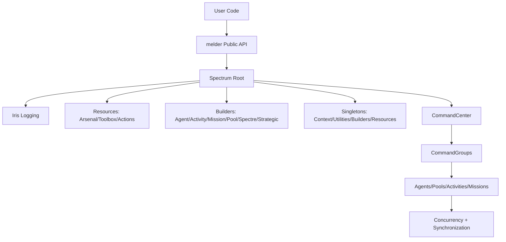
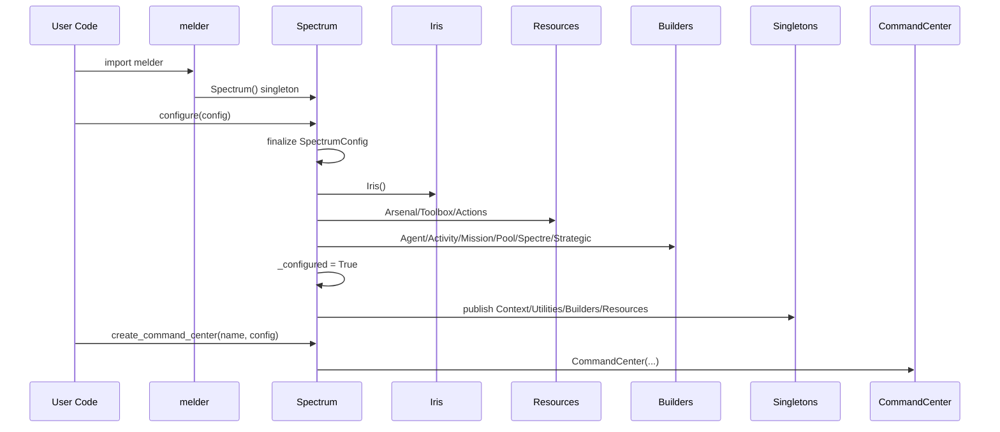

# Src Architecture (C4)

## Metadata
- Doc ID: ARCH-SRC-2026-01-17
- Status: current
- Owner:
- Created: 2026-01-17
- Updated: 2026-01-17

## Table of Contents
- Scope and Intent
- Documentation Quality Standard
- Source Coverage and Evidence
- Glossary and Core Terms
- System Context (C4)
- System Boundary and External Interfaces
- Architecture Summary (C4)
- Entrypoints and Runtime Guardrails
- Boot and Configuration Sequence
- Spectrum Root Responsibilities
- Singleton Publication and Access Rules
- Logging Fabric (Iris)
- Resource Managers (Arsenal, Toolbox, Actions)
- Builders and Registries
- CommandCenter Lifecycle
- CommandGroup Lifecycle
- Agent Lifecycle (Base Agent + General Agent)
- Activities and Missions
- Agent Pools, Tasks, and Deployments
- StrategicCommand and Strategy Routing
- Concurrency Foundations
- Synchronization Foundations
- Utilities and Coordination Foundations
- Ownership, Lifecycle, and Cleanup
- Operational Invariants
- Failure Modes and Error Paths
- Extension Points
- Data Flows and Sequences
- C3 and C2 Cross-Reference
- C1 Code Map (Core Only)
- Diagrams
- Information Sources
- Open Questions
- Context / Handoff Summary

## Scope and Intent
This document covers the src architecture at the C4 level for the `melder` package.
It is the system-level view for the Melder core platform, centered on Spectrum as
entrypoint and root builder. The goal is to allow a future session to recover the
system context without relying on memory.

The core platform is defined as:
- Spectrum root configuration and singleton publication.
- CommandCenter orchestration and CommandGroup organization.
- Agents, Activities, Missions, and Agent Pools as first-class orchestration units.
- StrategicCommand routing and strategy registries.
- Iris logging fabric and global resource managers.
- Concurrency, synchronization, and core utilities used by the platform.

Out of scope (for this document):
- Peripheral tools not required to understand the core runtime behavior.
- Test code (covered by `architecture/tests_architecture.md`).

## Documentation Quality Standard
This document is treated as durable context. It must be deep enough to recover
system understanding from a blank slate without handwaving.

Required rules:
- No vague summaries. Every claim must be grounded in source evidence or marked as unknown.
- Explicit entrypoints and boot sequence (Spectrum-first).
- Explicit ownership, lifecycle, and cleanup order for core components.
- Explicit invariants, failure modes, and concurrency constraints.
- ASCII and Mermaid diagrams for core flows.
- Update the evidence list when new sources are used.

## Source Coverage and Evidence
This document is grounded in the following core files (non-exhaustive list):
- `src/melder/__init__.py`
- `src/melder/command_center/spectrum/spectrum.py`
- `src/melder/command_center/spectrum/configurations/spectrum.py`
- `src/melder/command_center/spectrum/configurations/command_center.py`
- `src/melder/command_center/spectrum/configurations/iris.py`
- `src/melder/command_center/spectrum/system_wide_tools/context_config.py`
- `src/melder/command_center/spectrum/system_wide_tools/utilities.py`
- `src/melder/command_center/spectrum/system_wide_tools/builders.py`
- `src/melder/command_center/spectrum/system_wide_tools/resources.py`
- `src/melder/command_center/spectrum/iris/iris.py`
- `src/melder/command_center/spectrum/arsenal/arsenal.py`
- `src/melder/command_center/spectrum/toolbox/toolbox.py`
- `src/melder/command_center/spectrum/actions/actions.py`
- `src/melder/command_center/command_center.py`
- `src/melder/command_center/command_group.py`
- `src/melder/command_center/agent_cleanup_tracker.py`
- `src/melder/command_center/activity/base.py`
- `src/melder/command_center/activity/general.py`
- `src/melder/command_center/activity/builder.py`
- `src/melder/command_center/mission/base.py`
- `src/melder/command_center/mission/sequential_orchestrator.py`
- `src/melder/command_center/mission/builder.py`
- `src/melder/command_center/agents/agent_builder.py`
- `src/melder/command_center/agents/agent_types/agent.py`
- `src/melder/command_center/agents/agent_types/general.py`
- `src/melder/command_center/agents/spectre/spectre.py`
- `src/melder/command_center/agents/spectre/minds/base_mind.py`
- `src/melder/command_center/agents/utilities/operational_memory.py`
- `src/melder/command_center/agent_pools/base.py`
- `src/melder/command_center/agent_pools/agent_pool_builder.py`
- `src/melder/command_center/agent_pools/general.py`
- `src/melder/command_center/agent_pools/deployment/deployment.py`
- `src/melder/command_center/agent_pools/task/task.py`
- `src/melder/command_center/agent_pools/performance_ops/performance_ops.py`
- `src/melder/command_center/strategic_command/strategic_command.py`
- `src/melder/command_center/strategic_command/command_center/deploy/load_balanced.py`
- `src/melder/concurrency/data_structures/concurrent_dict.py`
- `src/melder/concurrency/sync_types/sync_int.py`
- `src/melder/synchronization/controllers/signal_controller.py`
- `src/melder/synchronization/primitives/agentic_rlock.py`
- `src/melder/utilities/interfaces/cleanable.py`
- `src/melder/utilities/coordination/package.py`
- `src/melder/utilities/data_structures/object_registry.py`
- `src/melder/utilities/general_helpers/init_helpers.py`
- `src/melder/utilities/general_helpers/agentic_helpers.py`

If a claim is not clearly supported by these sources, it is labeled as
"needs verification" in-line.

## Glossary and Core Terms
- Melder: The orchestration platform built in `src/melder`.
- Spectrum: Global root singleton that configures and publishes core services.
- CommandCenter: Primary orchestration node created by Spectrum.
- CommandGroup: Container for agents, activities, missions, and pools under a named scope.
- Agent: Thread-based actor that executes jobs and participates in activities/missions.
- Activity: Tactical work unit that agents execute; controlled lifecycle.
- Mission: Strategic workflow that orchestrates activities.
- Agent Pool: Manager for agents that executes tasks and deployments.
- StrategicCommand: Registry for task and deployment strategies across scopes.
- Iris: Logging fabric, channels, policies, viewers.
- Cleanable: Core interface for idempotent cleanup and lifecycle discipline.
- Agentic mode: A runtime mode that uses agent-aware locks and synchronization.

## System Context (C4)
Melder is a Python 3.13+ no-GIL concurrency and orchestration toolkit.
It operates as a library, not as a service. User code imports `melder`,
configures Spectrum, and creates CommandCenter instances to orchestrate agents,
activities, missions, and pools.

External actors and systems:
- Application developer integrating Melder into their process.
- External services accessed via Arsenal connectors or services.
- OS thread scheduler and Python runtime (no-GIL build required).

Constraints:
- Importing `melder` enforces Python version and no-GIL requirements.
- Melder is in-process; all state is in memory.
- Concurrency uses internal locks and thread-safe structures designed for no-GIL.

## System Boundary and External Interfaces
Public interfaces are the `melder` package exports and the Spectrum singleton.
The most important boundary is at import time:
- `src/melder/__init__.py` checks Python version and no-GIL mode.
- A global `spectrum = Spectrum()` instance is created on import.

Primary public surface:
- `melder.spectrum` and `Spectrum.get_instance()`.
- `Spectrum.create_spectrum_config()` to build a config.
- `Spectrum.configure(config)` to initialize the system.
- `Spectrum.create_command_center(name, config)` to create orchestration nodes.

## Architecture Summary (C4)
At the top level, the system is a configured Spectrum singleton that constructs
and publishes global services (Iris, resources, builders, utilities) and produces
CommandCenter instances. A CommandCenter manages CommandGroups and delegates
construction to builders and resources. Each CommandGroup manages agents, pools,
missions, and activities. Underneath, Melder relies on its own concurrency
collections, synchronization primitives, and coordination utilities.

High-level components:
- Spectrum root and configuration pipeline.
- Iris logging fabric.
- Resource managers (Arsenal, Toolbox, Actions).
- Builder registries (AgentBuilder, ActivityBuilder, MissionBuilder, AgentPoolBuilder, Spectre, StrategicCommand).
- CommandCenter orchestration.
- CommandGroup organization and work submission.
- Agents, Activities, Missions, Agent Pools.
- Concurrency and synchronization foundations.
- Utilities and coordination helpers.

## Entrypoints and Runtime Guardrails
Import-time rules (from `src/melder/__init__.py`):
- Require Python >= 3.13.
- Require a free-threaded (no-GIL) build using `sys._is_gil_enabled()` heuristic.
- Create a global Spectrum singleton instance named `spectrum`.

Runtime entrypoints:
- `Spectrum.get_instance()` returns the global Spectrum instance.
- `Spectrum.configure(...)` must be called before any `CommandCenter` is created.
- `Spectrum.create_command_center(name, config)` constructs a CommandCenter.

Important guardrails:
- Spectrum tracks `_configured` and raises if used before configuration.
- Spectrum publishes singletons only after `_configured` is True.
- All core components are Cleanable and expected to follow idempotent cleanup.

## Boot and Configuration Sequence
The boot sequence is deterministic and centered on Spectrum.
The core sequence is defined in `src/melder/command_center/spectrum/spectrum.py`.

High-level sequence:
1. Import `melder`.
2. Runtime guardrails run (Python version and no-GIL checks).
3. Global `spectrum = Spectrum()` is created.
4. User creates a config via `Spectrum.create_spectrum_config()` or provides a `SpectrumConfig`.
5. User calls `Spectrum.configure(config)` to initialize global services.
6. User calls `Spectrum.create_command_center(name, config)` to create a CommandCenter.

Detailed Spectrum.configure sequence (from `Spectrum.configure`):
- Acquire Spectrum `_lock` and check `_configured` flag.
- Build a finalized SpectrumConfig:
  - Use `SpectrumConfig.ensure_fully_configured()` to validate and freeze.
  - Set `_environment` and `_agentic_mode` from config.
- Initialize Iris logging fabric and create the Spectrum logger.
- Initialize resources (Arsenal, Toolbox, Actions).
- Initialize builders (AgentBuilder, ActivityBuilder, MissionBuilder, AgentPoolBuilder, Spectre, StrategicCommand).
- Set `_configured = True`.
- Publish singletons in order:
  1. SpectrumContextConfig
  2. SpectrumUtilities
  3. SpectrumBuilders
  4. SpectrumResources

Important ordering constraints:
- Singletons validate that Spectrum is configured; publication requires `_configured = True`.
- Iris must be created before resources/builders to supply channel loggers.
- CommandCenter creation requires singletons to be published.

## Spectrum Root Responsibilities
Spectrum is the root singleton for Melder core.
Primary responsibilities:
- Enforce singleton lifecycle (only one Spectrum).
- Orchestrate configuration and initialization sequence.
- Instantiate and own Iris, resources, and builders.
- Publish global singletons for downstream access.
- Create and register CommandCenter instances.
- Provide deterministic cleanup of the entire system.

Key state on Spectrum (`spectrum.py`):
- `_configured` flag that gates all operations.
- `_cfg`, `_environment`, `_agentic_mode` for system context.
- `_iris` and `_logger` for global logging.
- `_command_centers` and `_all_command_centers` registries.
- `arsenal`, `toolbox`, `actions` resource managers.
- `agent_builder`, `activity_builder`, `mission_builder`, `agent_pool_builder`.
- `spectre_builder`, `strategic_command`.
- `builders`, `resources`, `utilities`, `context_config` singletons.

Spectrum invariants:
- `_configured` must be True before singleton publication.
- `create_command_center` only succeeds after configure.
- Global registries are ConcurrentDict and must be cleaned explicitly.
- Spectrum cleanup resets the singleton state.

Spectrum failure modes:
- Calling `configure()` twice raises RuntimeError.
- Accessing singletons before configuration raises RuntimeError.
- Creating a CommandCenter with a duplicate name raises ValueError.

## Singleton Publication and Access Rules
Singletons are process-wide service locators.
They are created in Spectrum and accessed elsewhere via `get_instance()`.

Singleton list and purpose:
- SpectrumContextConfig: publishes environment and agentic_mode context.
- SpectrumUtilities: provides ObjectRegistry and Iris access.
- SpectrumBuilders: carries builder instances for CommandCenter.
- SpectrumResources: carries Arsenal/Toolbox/Actions.

Rules enforced in singleton constructors:
- The class-level `_lock` must be set prior to construction.
- The singleton must not already exist.
- Spectrum must be provided and configured.
- Each singleton sets `_initialized` and `_instance` only after full init.

Access rules:
- `get_instance()` raises RuntimeError if the singleton is unpublished.
- `is_available()` returns a boolean for safe checks.

Cleanup rules:
- `cleanup()` unpublishes singletons by nulling `_instance` and `_initialized`.
- Cleanup uses class-level locks for thread safety.
- Logger cleanup happens last.

## Logging Fabric (Iris)
Iris is the central logging and telemetry system.
It provides channel-based logging, policy controls, and a viewer.

Key Iris components (from `iris.py` and related files):
- `Iris`: manager and registry.
- `IrisChannel`: per-channel logging with memory handlers and optional archivers.
- `ChannelLogger`: per-registrant logger with channels and groups.
- `IrisPolicy`: routing policy and enable/disable controls.
- `IrisViewer`: in-memory viewer of channel messages.
- `HighResolutionFormatter`: timestamp formatting.
- `ContextFilter`: context injection and field filtering.

Iris initialization flow:
- Construct Iris with default configuration.
- Create default channel via `_setup_default_channel`.
- Register Iris as its own logger.
- Attach policy and viewer to the logger.

Iris responsibilities:
- Register registrants and issue ChannelLogger instances.
- Manage channels and channel subscriptions.
- Apply policy decisions to enable/disable channels or groups.
- Archive logs based on dispatch mode if enabled.

Iris invariants:
- Registrants are stored in `_registrants` ConcurrentDict.
- Channels are stored in `_channels` ConcurrentDict.
- Cleanable components are cleaned before Iris references are nulled.

Iris failure modes:
- Missing archiver callback can raise ValueError (per IrisConfig notes).
- Cleanup errors are swallowed to preserve teardown order.

## Resource Managers (Arsenal, Toolbox, Actions)
Spectrum creates three shared resource managers:
- Arsenal: registry for connectors and services.
- Toolbox: registry for stateless tools.
- Actions: registry and facades for collaborative actions.

Arsenal details (`arsenal.py`):
- Holds connector factories as Pack objects.
- Lazily builds connectors and can cache retained instances.
- Holds live services registry.
- Exposes `register_connector_factory` and `get_connector`.

Toolbox details (`toolbox.py`):
- Registers tool classes by name.
- Builds tools via `build_tool`.
- Default tool registration is currently empty (placeholder).

Actions details (`actions.py`):
- Registers built-in Action classes: Gather, Distribute, Collect, HandOut, SelfCheck.
- Provides facade methods for common actions.
- Exposes `get_action` for direct class access.

Resource invariants:
- All resources use ConcurrentDict registries.
- All resource registries are cleaned on teardown.

Resource failure modes:
- Missing connector factories raise KeyError.
- Invalid registrations raise TypeError.

## Builders and Registries
Spectrum creates builder registries for key object types:
- AgentBuilder
- ActivityBuilder
- MissionBuilder
- AgentPoolBuilder
- Spectre (mind/thoughtstream registry)
- StrategicCommand (strategy registry)

Builder responsibilities:
- Register default types at construction time.
- Enforce type checks on registration.
- Provide `build_*` methods that instantiate objects by name.

Builder invariants:
- Builders are Cleanable and registry cleanup is idempotent.
- Default registration is only performed once per builder instance.

Builder failure modes:
- Registering non-subclass types raises TypeError.
- Unregistering missing entries raises KeyError.

## CommandCenter Lifecycle
CommandCenter is the primary orchestration node created by Spectrum.
It owns CommandGroups and enforces system-level limits.

Construction (from `command_center.py`):
- CommandCenter receives:
  - `name`
  - `CommandCenterConfig`
  - `SpectrumContextConfig`
  - `SpectrumBuilders`
  - `SpectrumResources`
  - `SpectrumUtilities`
- CommandCenter resolves `agentic_mode` using InitHelpers.
- CommandCenter creates a lock (AgenticRLock or threading.RLock).
- CommandCenter sets internal agent count and max size via SyncInt.
- CommandCenter captures builders/resources for downstream delegation.
- CommandCenter resolves its logger via InitHelpers.
- CommandCenter registers with an external SignalController if provided.
- CommandCenter creates a maintenance CommandGroup and maintenance AgentPool.
- CommandCenter creates a default CommandGroup.

Key internal registries:
- `_command_groups`: ConcurrentDict of CommandGroup instances.
- `_cleanup_tracker`: AgentCleanupTracker to track cleaning agents.

CommandCenter invariants:
- CommandGroups are created inside CommandCenter and registered in `_command_groups`.
- Maintenance group and maintenance pool are always created at startup.
- Agent counts are tracked via SyncInt.

CommandCenter failure modes:
- Failure to register with external SignalController logs a warning.
- Cleanup errors are swallowed and logged to preserve teardown.

## CommandGroup Lifecycle
CommandGroup is the container for agents, pools, activities, and missions.
It is created and owned by a CommandCenter.

Construction (from `command_group.py`):
- Receives CommandCenter reference, group name, max agents, and logger.
- Resolves `agentic_mode` from CommandCenter.
- Creates lock (AgenticRLock or threading.RLock).
- Registers with external SignalController if provided.
- Initializes registries:
  - `_agents`
  - `_signal_controllers`
  - `_missions`
  - `_activities`
  - `_agent_pools`
- Initializes counters:
  - `_agent_count`
  - `_group_max_agents`
  - `_total_agent_count` (shared from CommandCenter)
- Binds strategic command reference.
- Binds maintenance pool for non-maintenance groups.

CommandGroup responsibilities:
- Create and remove agents, activities, missions, and pools.
- Submit work to pools via `create_request` and `create_requests`.
- Execute strategies via `execute_strategy`.
- Provide convenience facades for Arsenal, Toolbox, and Actions.
- Coordinate lifecycle operations: start, pause, cancel, and cleanup.

CommandGroup invariants:
- Registries are ConcurrentDict and cleaned explicitly.
- `_agents` and `_agent_pools` are authoritative group registries.
- `create_request` enforces pool tag validation before dispatch.

CommandGroup failure modes:
- `create_request` raises ValueError if pool id is unknown.
- `create_request` raises ValueError if pool tags do not match required tags.
- Strategy execution errors are raised and logged.

## Agent Lifecycle (Base Agent + General Agent)
Agents are thread-based actors with lifecycle, state, and memory.

Base Agent (`agent_types/agent.py`):
- Extends `threading.Thread` and implements `Cleanable`.
- Owns identity (`_id`), metadata, and agentic mode.
- Holds internal lock for state transitions.
- Manages:
  - OperationalMemory
  - Spectre mind
  - Registered activities and missions
  - Public and private inventories
- Has cleanup tracking flags for agent lifecycle control.

General Agent (`agent_types/general.py`):
- Implements concrete agent behavior using AgentState enum.
- Provides default tags for tasks and deployments.
- Integrates with records ledger for work tracking.
- Supports transitions between jobs and dismissal.

Agent invariants:
- Agent thread must be started for lifecycle run loop to execute.
- Agent state transitions are guarded by the internal lock.
- Cleanup is idempotent and will unregister from group and signal controller.

Agent failure modes:
- Operations performed after cleanup raise RuntimeError via `check_cleaned`.
- Attempted lifecycle operations in the wrong thread may raise (AgenticHelpers).

## Activities and Missions
Activities are tactical units; missions orchestrate activities.

BaseActivity (`activity/base.py`):
- Cleanable base class with lifecycle state (ActivityStatus).
- Holds gates for start/pause control.
- Maintains registered agents and metadata.
- Registers with SignalController if provided.

GeneralActivity (`activity/general.py`):
- Adds job-specific state (collection, progress, result).
- Provides additional commands for job management.
- Uses ConcurrentQueue for work collection.

BaseMission (`mission/base.py`):
- Cleanable base class with lifecycle state (MissionStatus).
- Holds registered activities and agents.
- Supports mission-level pause and start gates.
- Can register itself as a service in Arsenal via SpectrumResources.

SequentialOrchestratorMission (`mission/sequential_orchestrator.py`):
- Sequentially deploys activities in order.
- Uses CommandGroup to deploy activities with required agents.
- Waits for each activity to complete before moving to the next.

Mission and Activity invariants:
- Activities and missions register with their CommandGroup upon creation.
- Activities and missions track status enums and transition only through valid states.
- Cleanup cascades to registered agents and activities.

## Agent Pools, Tasks, and Deployments
Agent pools manage execution of tasks and deployments.

BaseAgentPool (`agent_pools/base.py`):
- Manages agent registry and job registry.
- Provides shared counters and tag enforcement.
- Integrates with CommandGroup for registration and cleanup.

GeneralPool (`agent_pools/general.py`):
- Provides a concrete pool with task and deployment queues.
- Uses FlowRegulator and AgenticLock for coordination.
- Maintains performance and maintenance subsystems.
- Creates and manages Task and Deployment objects.

Task (`agent_pools/task/task.py`):
- Future-like object with retries and timeout.
- Holds Pack work callable and required tags.
- Tracks status via TaskStatus enum.

Deployment (`agent_pools/deployment/deployment.py`):
- Future-like object for multi-agent deployments.
- Tracks assigned agents and completion counts.
- Supports hooks for pre and post stages.

Pool invariants:
- Pools use ConcurrentDict and ConcurrentSet for state tracking.
- Pool cleanup flags agents for dismissal and clears queues.
- Task and Deployment objects are Cleanable and clean their internal collections.

Pool failure modes:
- Invalid pool types or missing registrations raise errors at build time.
- Agent tag mismatch prevents assignment.

## StrategicCommand and Strategy Routing
StrategicCommand is a unified strategy registry.

Core behaviors (`strategic_command.py`):
- Maintains nested registries by scope and command type.
- Registers default strategies at init time.
- Executes strategies by name and type with context injection.

Default strategies (from strategic_command subfolders):
- CommandCenter deploy strategy: `CC_LoadBalancedDeployStrategy`.
- CommandCenter task strategy: `CC_RoundRobinTaskStrategy`.
- CommandGroup deploy strategy: `CG_PoolAffinityDeployStrategy`.
- CommandGroup task strategy: `CG_TaggedRoundRobinTaskStrategy`.

Strategy invariants:
- Strategy class must subclass BaseStrategy.
- Strategy execution must receive required args such as deployment or work.

Strategy failure modes:
- Unknown strategy name raises KeyError.
- Missing command type raises KeyError.
- Invalid scope raises ValueError.

## Concurrency Foundations
Melder defines its own concurrency collections and sync types.
These are used across Spectrum, CommandCenter, and pools.

Core data structures (`src/melder/concurrency/data_structures`):
- ConcurrentDict: thread-safe dict with optional freeze.
- ConcurrentList: thread-safe list with optional freeze.
- ConcurrentSet: thread-safe set with optional freeze.
- ConcurrentQueue: thread-safe FIFO queue.
- ConcurrentStack: thread-safe LIFO stack.
- ConcurrentCollection: sharded queue-like collection for throughput.
- ConcurrentBag: multiset-like concurrent container.
- ConcurrentHeap: thread-safe heap with key and stable ordering.

Core sync types (`src/melder/concurrency/sync_types`):
- SyncInt, SyncFloat, SyncBool, SyncString, SyncRef.
- Each wraps a value with an internal lock and lock ordering.
- Supports atomic operations and interop with other sync types.

Weak data structures (`src/melder/concurrency/weak_data_structures`):
- Used for weak references where needed (not detailed here).

Concurrency invariants:
- All concurrent structures are Cleanable and must be cleaned explicitly.
- When frozen, structures allow lockless reads but disallow mutation.
- In agentic mode, locks are AgenticRLock, not threading.RLock.

Concurrency failure modes:
- Mutations on frozen structures raise TypeError.
- Use of cleaned objects raises RuntimeError via `check_cleaned`.

## Synchronization Foundations
Synchronization primitives coordinate threads and workflows.

Core primitives (`src/melder/synchronization/primitives`):
- AgenticRLock: agent-aware reentrant lock with symbolic handoff.
- AgenticLock: agent-aware non-reentrant lock (used in pools).
- FlowRegulator: semaphore-like control with targeted wakeups.
- Dynaphore: dynamic semaphore for resource control.
- Latch and SignalLatch: one-shot or resettable synchronization gates.
- SmartCondition, TransitCondition: condition primitives with extra routing.
- AgenticEvent: agent-aware event (used in Spectre mind).

Controllers and coordinators:
- SignalController: registry and invocation framework for managed objects.
- Conductor, MultiConductor: orchestration of grouped tasks.
- TransitBarrier, SignalBarrier, ClockBarrier: barrier coordination.
- Scout: predicate-based monitoring.

Dispatchers and execution:
- Fork, SyncFork, SignalFork, SyncSignalFork: dispatchers for work routing.
- BypassConductor: limited execution gate.

Synchronization invariants:
- SignalController expects objects to expose `_get_object_details` and `id`.
- Agentic locks rely on agent-compatible threads (AgenticHelpers).
- Cleanup wakes waiters to prevent deadlocks.

Synchronization failure modes:
- Using AgenticRLock from non-agentic threads raises errors.
- SignalController invocation fails if commands are missing.

## Utilities and Coordination Foundations
Core utilities provide shared interfaces and coordination primitives.

Key utilities used by core:
- Cleanable interface (`utilities/interfaces/cleanable.py`).
- InitHelpers (`utilities/general_helpers/init_helpers.py`).
- AgenticHelpers (`utilities/general_helpers/agentic_helpers.py`).
- Pack and Package (`utilities/coordination/package.py`).
- ObjectRegistry (`utilities/data_structures/object_registry.py`).
- Group and Outcome (`utilities/coordination/group.py`, `outcome.py`).
- Stopwatch and AutoResetTimer (`utilities/timing_tools`).
- Exceptions like Empty (`utilities/exceptions/empty.py`).

Utility invariants:
- Cleanable enforces idempotent cleanup.
- Pack enforces callable verification and safe binding.
- ObjectRegistry is hierarchical and uses RegistryNode for categories/items.

Utility failure modes:
- Package creation rejects generator functions and invalid callables.
- ObjectRegistry operations raise ValueError on invalid paths.

## Ownership, Lifecycle, and Cleanup
Cleanup is a first-class design rule.
The cleanup pattern is consistent across components:
- Phase 1: under lock, mark cleaned, cleanup internal components.
- Phase 2: outside lock, null references, cleanup lock, cleanup logger last.

Core cleanup ordering:
- Spectrum.cleanup:
  1. Clean CommandCenters.
  2. Clean singletons (Resources, Builders, Utilities, ContextConfig).
  3. Clean components (resources, builders).
  4. Clean Iris.
  5. Clean lock.
  6. Null references and reset singleton state.

- CommandCenter.cleanup:
  1. Clean CommandGroups (maintenance last).
  2. Clean internal components (cleanup tracker, external controllers).
  3. Cleanup lock and logger.

- CommandGroup.cleanup:
  1. Shutdown members (pools, missions, activities, agents, controllers).
  2. Cleanup registries.
  3. Cleanup lock and logger.

Lifecycle invariants:
- Cleanup is idempotent and must be safe for repeated calls.
- Logger is the last element cleaned.
- Locks are cleaned only after components are cleaned.

## Operational Invariants
System-level invariants enforced by the code:
- Python >= 3.13 and no-GIL build required for import.
- Spectrum must be configured before use.
- Singletons must be published only after Spectrum is configured.
- CommandCenter limits and CommandGroup limits enforced by SyncInt counters.
- Agent tags must match pool requirements before work assignment.
- CommandGroup registries are authoritative and cleaned explicitly.

## Failure Modes and Error Paths
Common failure paths:
- Spectrum.configure called twice -> RuntimeError.
- Spectrum.create_command_center before configure -> RuntimeError.
- CommandCenter duplicate name -> ValueError.
- AgentPool or Activity registration with invalid type -> TypeError.
- Strategy lookup failures -> KeyError or ValueError.
- Pool tag mismatch -> ValueError.

Error handling conventions:
- Many cleanup errors are logged and swallowed to complete teardown.
- Logging may degrade to SafeLogger if Iris is not available.

## Extension Points
The system is designed for extension via registries:
- AgentBuilder.register_template (agent types).
- ActivityBuilder.register_activity (activity types).
- MissionBuilder.register_mission (mission types).
- AgentPoolBuilder.register_agent_pool (pool types).
- Toolbox.register_tool (tools).
- Actions.register_action (actions).
- Arsenal.register_connector_factory and register_service (connectors/services).
- StrategicCommand.register_strategy (strategies).
- SpectrumUtilities.register_object (ObjectRegistry integration).

## Data Flows and Sequences
### Sequence: Import to Ready
1. Import `melder`.
2. Python version and no-GIL checks run.
3. `spectrum = Spectrum()` is created.
4. User creates or loads SpectrumConfig.
5. User calls `Spectrum.configure(config)`.
6. Iris is constructed and Spectrum logger registered.
7. Arsenal, Toolbox, Actions are created with Iris channel loggers.
8. Builders are created with Iris channel loggers.
9. Spectrum `_configured` set to True.
10. Singletons published.
11. System ready for CommandCenter creation.

### Sequence: Create CommandCenter
1. User calls `Spectrum.create_command_center(name, config)`.
2. Spectrum validates configuration.
3. Spectrum creates CommandCenter with singletons.
4. CommandCenter resolves agentic mode and creates lock.
5. CommandCenter creates maintenance CommandGroup.
6. CommandCenter creates maintenance pool via CommandGroup setup.
7. CommandCenter creates default CommandGroup.

### Sequence: Create Activity and Deploy
1. CommandGroup.create_activity(template_name, kwargs).
2. CommandCenter builds activity via ActivityBuilder.
3. Activity is registered with CommandGroup.
4. CommandGroup.deploy_all_pending_activities executes a strategy.
5. Strategy chooses a pool and calls CommandGroup.create_request.
6. AgentPool handles the request by creating Task or Deployment.
7. Agents check in and execute work.

### Sequence: Mission Orchestration
1. CommandGroup.create_mission(name, kwargs).
2. Mission is registered with CommandGroup.
3. Mission is started; orchestrator agent executes mission loop.
4. Mission deploys activities sequentially via CommandGroup.
5. Mission waits for activities to finish; updates MissionStatus.

## C3 and C2 Cross-Reference
Detailed C3 and C2 component descriptions are maintained in:
- `components/src_components.md`

This architecture doc provides the system-level view and lifecycle sequences.

## C1 Code Map (Core Only)
The following map lists key files and their roles in the core architecture.
This is not exhaustive, but focuses on the Melder core platform.

Package root:
- `src/melder/__init__.py`
  - Import-time guardrails and global Spectrum instance.
- `src/melder/__os__.py`
  - OS identification helper for exports.
- `src/melder/__version__.py`
  - Version declaration.
- `src/melder/__author__.py`
  - Author metadata.

Spectrum root:
- `src/melder/command_center/spectrum/spectrum.py`
  - Spectrum singleton and configuration pipeline.
- `src/melder/command_center/spectrum/configurations/spectrum.py`
  - SpectrumConfig builder and validator.
- `src/melder/command_center/spectrum/configurations/command_center.py`
  - CommandCenterConfig and fluent configuration methods.
- `src/melder/command_center/spectrum/configurations/iris.py`
  - IrisConfig and logging configuration surface.
- `src/melder/command_center/spectrum/configurations/arsenal.py`
  - ArsenalConfig and connector factory configuration.

Spectrum system-wide tools:
- `src/melder/command_center/spectrum/system_wide_tools/context_config.py`
  - SpectrumContextConfig singleton.
- `src/melder/command_center/spectrum/system_wide_tools/utilities.py`
  - SpectrumUtilities singleton with ObjectRegistry and Iris access.
- `src/melder/command_center/spectrum/system_wide_tools/builders.py`
  - SpectrumBuilders singleton for builder access.
- `src/melder/command_center/spectrum/system_wide_tools/resources.py`
  - SpectrumResources singleton for resource access.

Spectrum resources:
- `src/melder/command_center/spectrum/arsenal/arsenal.py`
  - Arsenal resource manager.
- `src/melder/command_center/spectrum/arsenal/base_connector.py`
  - BaseConnector contract.
- `src/melder/command_center/spectrum/arsenal/base_service.py`
  - BaseService contract.
- `src/melder/command_center/spectrum/toolbox/toolbox.py`
  - Toolbox resource manager.
- `src/melder/command_center/spectrum/toolbox/base.py`
  - BaseTool contract.
- `src/melder/command_center/spectrum/actions/actions.py`
  - Actions manager and facades.
- `src/melder/command_center/spectrum/actions/action/action.py`
  - Action base class.

Iris logging:
- `src/melder/command_center/spectrum/iris/iris.py`
  - Iris core manager.
- `src/melder/command_center/spectrum/iris/iris_channel.py`
  - IrisChannel implementation.
- `src/melder/command_center/spectrum/iris/channel_logger.py`
  - ChannelLogger implementation.
- `src/melder/command_center/spectrum/iris/iris_policy.py`
  - IrisPolicy routing.
- `src/melder/command_center/spectrum/iris/iris_viewer.py`
  - IrisViewer and query interface.
- `src/melder/command_center/spectrum/iris/memory_handler.py`
  - Memory-based handler.
- `src/melder/command_center/spectrum/iris/high_resolution_formatter.py`
  - Formatter with micro/nano precision.
- `src/melder/command_center/spectrum/iris/context_filter.py`
  - Context filter for log records.
- `src/melder/command_center/spectrum/iris/safe_logger.py`
  - SafeLogger fallback when Iris unavailable.

CommandCenter and groups:
- `src/melder/command_center/command_center.py`
  - CommandCenter orchestration root.
- `src/melder/command_center/command_group.py`
  - CommandGroup container for agents/activities/missions/pools.
- `src/melder/command_center/agent_cleanup_tracker.py`
  - AgentCleanupTracker utility.

Activities:
- `src/melder/command_center/activity/base.py`
  - BaseActivity contract and lifecycle.
- `src/melder/command_center/activity/general.py`
  - GeneralActivity implementation.
- `src/melder/command_center/activity/builder.py`
  - ActivityBuilder registry.
- `src/melder/command_center/activity/status/status.py`
  - ActivityStatus enum.

Missions:
- `src/melder/command_center/mission/base.py`
  - BaseMission contract and lifecycle.
- `src/melder/command_center/mission/sequential_orchestrator.py`
  - SequentialOrchestratorMission implementation.
- `src/melder/command_center/mission/builder.py`
  - MissionBuilder registry.
- `src/melder/command_center/mission/status/status.py`
  - MissionStatus enum.

Agents and Spectre:
- `src/melder/command_center/agents/agent_builder.py`
  - AgentBuilder registry and AgentTemplate.
- `src/melder/command_center/agents/agent_types/agent.py`
  - Base Agent thread implementation.
- `src/melder/command_center/agents/agent_types/general.py`
  - General agent behavior.
- `src/melder/command_center/agents/spectre/spectre.py`
  - Spectre mind registry.
- `src/melder/command_center/agents/spectre/minds/base_mind.py`
  - BaseMind contract.
- `src/melder/command_center/agents/spectre/thoughtstream/base_thoughtstream.py`
  - BaseThoughtStream contract.
- `src/melder/command_center/agents/utilities/operational_memory.py`
  - OperationalMemory and Operations facade.

Agent pools:
- `src/melder/command_center/agent_pools/base.py`
  - BaseAgentPool contract.
- `src/melder/command_center/agent_pools/agent_pool_builder.py`
  - AgentPoolBuilder registry.
- `src/melder/command_center/agent_pools/general.py`
  - GeneralPool implementation.
- `src/melder/command_center/agent_pools/maintenance.py`
  - MaintenancePool implementation.
- `src/melder/command_center/agent_pools/task/task.py`
  - Task object for single-agent work.
- `src/melder/command_center/agent_pools/deployment/deployment.py`
  - Deployment object for multi-agent work.
- `src/melder/command_center/agent_pools/performance_ops/performance_ops.py`
  - PerformanceOps control plane for pools.

Strategic command:
- `src/melder/command_center/strategic_command/strategic_command.py`
  - StrategicCommand registry.
- `src/melder/command_center/strategic_command/base.py`
  - BaseStrategy contract.
- `src/melder/command_center/strategic_command/command_center/deploy/load_balanced.py`
  - CommandCenter load-balanced deploy strategy.
- `src/melder/command_center/strategic_command/command_group/deploy/pool_affinity.py`
  - CommandGroup pool-affinity deploy strategy.

Concurrency:
- `src/melder/concurrency/data_structures/concurrent_dict.py`
  - ConcurrentDict and freeze support.
- `src/melder/concurrency/data_structures/concurrent_list.py`
  - ConcurrentList and freeze support.
- `src/melder/concurrency/data_structures/concurrent_set.py`
  - ConcurrentSet and freeze support.
- `src/melder/concurrency/data_structures/concurrent_queue.py`
  - ConcurrentQueue FIFO.
- `src/melder/concurrency/data_structures/concurrent_stack.py`
  - ConcurrentStack LIFO.
- `src/melder/concurrency/data_structures/concurrent_collection.py`
  - Sharded queue collection.
- `src/melder/concurrency/data_structures/concurrent_bag.py`
  - Bag/multiset structure.
- `src/melder/concurrency/data_structures/concurrent_heap.py`
  - Concurrent heap with key.
- `src/melder/concurrency/sync_types/sync_int.py`
  - SyncInt wrapper.
- `src/melder/concurrency/sync_types/sync_float.py`
  - SyncFloat wrapper.
- `src/melder/concurrency/sync_types/sync_bool.py`
  - SyncBool wrapper.
- `src/melder/concurrency/sync_types/sync_string.py`
  - SyncString wrapper.
- `src/melder/concurrency/sync_types/sync_ref.py`
  - SyncRef wrapper.

Synchronization:
- `src/melder/synchronization/primitives/agentic_rlock.py`
  - AgenticRLock implementation.
- `src/melder/synchronization/controllers/signal_controller.py`
  - SignalController registry.
- `src/melder/synchronization/primitives/flow_regulator.py`
  - FlowRegulator synchronization primitive.
- `src/melder/synchronization/dispatchers/fork.py`
  - Fork dispatcher.
- `src/melder/synchronization/coordinators/conductor.py`
  - Conductor coordination primitive.

Utilities:
- `src/melder/utilities/interfaces/cleanable.py`
  - Cleanable interface.
- `src/melder/utilities/coordination/package.py`
  - Pack/Package wrappers for callables.
- `src/melder/utilities/data_structures/object_registry.py`
  - ObjectRegistry and RegistryNode.
- `src/melder/utilities/general_helpers/init_helpers.py`
  - InitHelpers for agentic mode and logger resolution.
- `src/melder/utilities/general_helpers/agentic_helpers.py`
  - AgenticHelpers for thread patching and compatibility.

## Diagrams
### ASCII Context Diagram (C4)
```
[User Code]
    |
    v
[melder Public API]
    |
    v
[Spectrum Root Singleton]
    |-- configure() -> Iris + Resources + Builders + Singletons
    |-- create_command_center()
    v
[CommandCenter]
    |-- CommandGroups
    |-- Agents / Pools / Activities / Missions
    v
[Concurrency + Synchronization Foundations]
```

### Mermaid Context Diagram (C4)


### ASCII Boot Sequence Diagram
```
import melder
  -> runtime checks (py version, no-GIL)
  -> Spectrum() singleton created
Spectrum.configure()
  -> build SpectrumConfig
  -> init Iris + Spectrum logger
  -> init Arsenal/Toolbox/Actions
  -> init Builders
  -> _configured = True
  -> publish singletons
Spectrum.create_command_center()
  -> CommandCenter __init__
  -> maintenance group + pool
  -> default group
```

### Mermaid Boot Sequence Diagram


## Information Sources
- `src/melder/__init__.py`
- `src/melder/command_center/spectrum/spectrum.py`
- `src/melder/command_center/command_center.py`
- `src/melder/command_center/command_group.py`
- `src/melder/command_center/agents/agent_types/agent.py`
- `src/melder/command_center/agent_pools/general.py`
- `src/melder/command_center/mission/sequential_orchestrator.py`
- `src/melder/command_center/spectrum/iris/iris.py`
- `src/melder/concurrency/data_structures/concurrent_dict.py`
- `src/melder/synchronization/primitives/agentic_rlock.py`
- `src/melder/utilities/interfaces/cleanable.py`

## Open Questions
- Are there additional core entrypoints beyond `melder/__init__.py` that should be treated as public API?
- Which utilities in `src/melder/utilities` are strictly core vs optional tools?

## Context / Handoff Summary
This doc is a deep C4 architecture view centered on Spectrum as the root entrypoint.
It captures the configuration pipeline, singleton publication, CommandCenter lifecycle,
and the core orchestration flow across agents, pools, activities, and missions.
Use this as the system-level reference and consult `components/src_components.md`
for component-level C3/C2/C1 detail.

# Appendix A: Deep Component Narratives (Core)
This appendix provides a deep, source-anchored narrative for each core component.
Each component uses the same template to avoid ambiguity.

Template fields:
- Purpose
- Responsibilities
- Inputs
- Outputs
- Owned State
- Lifecycle
- Concurrency and Threading
- Invariants
- Failure Modes
- Observability
- Extension Points
- Key Files

## A1. Spectrum Root
Purpose:
- Provide the global configuration and construction entrypoint for Melder.

Responsibilities:
- Create and validate SpectrumConfig.
- Initialize Iris and its logging channel.
- Construct shared resources (Arsenal, Toolbox, Actions).
- Construct shared builders (AgentBuilder, ActivityBuilder, MissionBuilder, AgentPoolBuilder, Spectre, StrategicCommand).
- Publish global singletons (ContextConfig, Utilities, Builders, Resources).
- Create and register CommandCenter instances.
- Orchestrate full system cleanup.

Inputs:
- Optional SpectrumConfig from user.
- Environment name and agentic_mode settings from config.

Outputs:
- Published singletons.
- CommandCenter instances.
- Global registries of command centers.

Owned State:
- `_cfg`, `_environment`, `_agentic_mode`, `_configured`.
- `_iris` and `_logger`.
- `_command_centers` and `_all_command_centers` registries.
- Resource manager instances.
- Builder instances.
- Singleton instances.

Lifecycle:
- Constructed at import time.
- Configured once by user call.
- Remains active for lifetime of process unless cleaned.
- Cleaned via `cleanup()` which resets singleton and resources.

Concurrency and Threading:
- Uses Spectrum `_lock` (RLock) to protect configuration and cleanup.
- ConcurrentDict used for registries.

Invariants:
- `_configured` must be True before singleton publication.
- `configure()` can be called only once per Spectrum lifetime.
- CommandCenter creation requires configured Spectrum.

Failure Modes:
- Calling `configure()` twice raises RuntimeError.
- Access before configure raises RuntimeError.
- Duplicate CommandCenter name raises ValueError.

Observability:
- Spectrum registers a ChannelLogger in Iris.
- Warnings and errors are logged on failures.

Extension Points:
- Custom SpectrumConfig for environment and Iris settings.
- Custom CommandCenterConfig for group sizing.

Key Files:
- `src/melder/command_center/spectrum/spectrum.py`

## A2. SpectrumConfig and Configuration Pipeline
Purpose:
- Provide a typed, validated configuration root for Spectrum.

Responsibilities:
- Hold ArsenalConfig and IrisConfig.
- Provide fluent builder methods.
- Validate and freeze configuration.

Inputs:
- Optional builder mode flag `factory_configure`.
- ArsenalConfig, IrisConfig, environment, agentic_mode.

Outputs:
- Frozen SpectrumConfig with `configured = True`.

Owned State:
- `arsenal_config`, `iris_config`, `environment`, `agentic_mode`.
- `_frozen` and `configured` flags.

Lifecycle:
- Created by user or Spectrum.
- Validated and frozen by `ensure_fully_configured()`.
- Cleaned by nulling config references.

Concurrency and Threading:
- No explicit locks.
- Intended to be configured before use.

Invariants:
- ArsenalConfig and IrisConfig must be present.
- `ensure_fully_configured()` freezes config.

Failure Modes:
- Missing config raises ValueError.
- Modifying frozen config raises RuntimeError.

Observability:
- No logger in config; errors are raised.

Extension Points:
- Use fluent setters to configure Iris/Arsenal/environment.

Key Files:
- `src/melder/command_center/spectrum/configurations/spectrum.py`

## A3. Iris Logging Fabric
Purpose:
- Provide process-wide structured logging, routing, and viewing.

Responsibilities:
- Manage channels and registrant loggers.
- Apply IrisPolicy for routing and enable/disable rules.
- Provide IrisViewer for in-memory inspection.
- Provide archiving hooks when enabled.

Inputs:
- IrisConfig values (enable flags, channel defaults, archiver options).
- Registrant registration requests from Spectrum and other components.

Outputs:
- ChannelLogger instances.
- Log events routed to channels and archives.

Owned State:
- `_channels`, `_registrants`, `_subscriptions` registries.
- `_policy`, `_viewer`, `_formatter`, `_context_filter`.
- `_default_channel_name`, `_default_message_capacity`, etc.

Lifecycle:
- Constructed by Spectrum.
- Used by Spectrum to register logging for components.
- Cleaned by tearing down registrants, channels, and viewer.

Concurrency and Threading:
- Internal lock (AgenticRLock or RLock) protects registries.
- ConcurrentDict and ConcurrentList used for registries and subscriptions.

Invariants:
- Default channel is created at init.
- Registrants are tracked in `_registrants`.
- Policy and viewer are attached to Iris logger.

Failure Modes:
- Archiver misconfiguration can raise during channel creation.
- Cleanup errors are suppressed to complete teardown.

Observability:
- Iris creates its own ChannelLogger on default channel.

Extension Points:
- Register custom channels.
- Enable archive strategies via IrisConfig.

Key Files:
- `src/melder/command_center/spectrum/iris/iris.py`
- `src/melder/command_center/spectrum/iris/iris_channel.py`
- `src/melder/command_center/spectrum/iris/channel_logger.py`
- `src/melder/command_center/spectrum/iris/iris_policy.py`
- `src/melder/command_center/spectrum/iris/iris_viewer.py`

## A4. Resource Managers (Arsenal, Toolbox, Actions)
Purpose:
- Provide shared resource registries used by the Melder core.

Responsibilities:
- Arsenal: manage connector factories and live connectors/services.
- Toolbox: register tool classes and build tool instances by name.
- Actions: register action classes and provide action facades.

Inputs:
- ArsenalConfig connector factories (Pack objects).
- Tool and Action class registrations.

Outputs:
- Connector instances and tool/action instances.

Owned State:
- Arsenal: `_factories`, `_live_connectors`, `_live_services`.
- Toolbox: `_registry`.
- Actions: `_registry`.

Lifecycle:
- Constructed by Spectrum with Iris loggers.
- Registries are cleaned on teardown.

Concurrency and Threading:
- Internal locks for each resource manager.
- ConcurrentDict for registries.

Invariants:
- Arsenal factories must be Pack instances.
- Toolbox and Actions only accept subclasses of BaseTool and Action.

Failure Modes:
- Arsenal raises KeyError for missing factories.
- Invalid registration raises TypeError.

Observability:
- Each resource manager has a dedicated Iris ChannelLogger.

Extension Points:
- Register custom connectors, tools, and actions.

Key Files:
- `src/melder/command_center/spectrum/arsenal/arsenal.py`
- `src/melder/command_center/spectrum/toolbox/toolbox.py`
- `src/melder/command_center/spectrum/actions/actions.py`

## A5. System-wide Singletons
Purpose:
- Provide global access to configuration context, utilities, builders, and resources.

Responsibilities:
- SpectrumContextConfig: expose environment and agentic mode.
- SpectrumUtilities: expose ObjectRegistry and Iris access.
- SpectrumBuilders: expose builder instances.
- SpectrumResources: expose Arsenal/Toolbox/Actions.

Inputs:
- Spectrum instance and dependencies from Spectrum.configure.

Outputs:
- Published singleton instances accessible via get_instance().

Owned State:
- Each singleton holds references to its dependencies.
- Each singleton has class-level `_instance` and `_initialized` flags.

Lifecycle:
- Constructed and published by Spectrum only.
- Unpublished and cleaned during Spectrum cleanup.

Concurrency and Threading:
- Class-level lock controls publish/unpublish.

Invariants:
- Singletons are only available after Spectrum is configured.
- Access before publication raises RuntimeError.

Failure Modes:
- Attempts to publish when already published raise ValueError.

Observability:
- Singletons have ChannelLogger instances and log during cleanup.

Extension Points:
- None; singletons are owned by Spectrum.

Key Files:
- `src/melder/command_center/spectrum/system_wide_tools/context_config.py`
- `src/melder/command_center/spectrum/system_wide_tools/utilities.py`
- `src/melder/command_center/spectrum/system_wide_tools/builders.py`
- `src/melder/command_center/spectrum/system_wide_tools/resources.py`

## A6. Builder Registries
Purpose:
- Provide centralized registries for constructing core object types.

Responsibilities:
- AgentBuilder: map template names to AgentTemplate.
- ActivityBuilder: map names to Activity classes.
- MissionBuilder: map names to Mission classes.
- AgentPoolBuilder: map names to Pool classes.
- Spectre: map names to Mind and ThoughtStream templates.
- StrategicCommand: map strategies by scope and type.

Inputs:
- Default registrations at construction.
- Dynamic registrations via register_* methods.

Outputs:
- Instances created by build_* methods.

Owned State:
- ConcurrentDict registries for each builder.

Lifecycle:
- Constructed by Spectrum.
- Cleaned when SpectrumBuilders or Spectrum cleanup runs.

Concurrency and Threading:
- Each builder holds its own lock.
- Registries are ConcurrentDict for safe access.

Invariants:
- Registered classes must be subclasses of expected base type.

Failure Modes:
- Invalid registration raises TypeError.
- Unregistering missing entries raises KeyError.

Observability:
- Builders use Iris loggers for warnings and errors.

Extension Points:
- Register new templates and strategy classes.

Key Files:
- `src/melder/command_center/agents/agent_builder.py`
- `src/melder/command_center/activity/builder.py`
- `src/melder/command_center/mission/builder.py`
- `src/melder/command_center/agent_pools/agent_pool_builder.py`
- `src/melder/command_center/agents/spectre/spectre.py`
- `src/melder/command_center/strategic_command/strategic_command.py`

## A7. CommandCenter Deep Dive
Purpose:
- Act as the primary orchestration node for agents, pools, activities, and missions.

Responsibilities:
- Enforce total and per-group agent limits.
- Manage CommandGroup registry.
- Wire Spectrum builders, resources, and utilities into group operations.
- Provide maintenance group and pool for system upkeep.
- Optionally integrate with external SignalController.

Inputs:
- CommandCenterConfig.
- Spectrum singletons for builders/resources/utilities.

Outputs:
- CommandGroup instances and agent pool infrastructure.

Owned State:
- `_command_groups` registry.
- `_maintenance_group` reference.
- `_cleanup_tracker`.
- `_max_size` and `_total_agent_count` SyncInt counters.

Lifecycle:
- Constructed by Spectrum.
- Creates maintenance group and pool.
- Creates default group.
- Cleaned by cleanup sequence that cascades into groups.

Concurrency and Threading:
- Uses AgenticRLock or RLock for internal synchronization.

Invariants:
- Maintenance group is always created on startup.
- Default group is created on startup.
- Builder and resource references are available during lifecycle.

Failure Modes:
- External SignalController registration can fail and log warnings.
- Cleanup uses best-effort for external controller interactions.

Observability:
- CommandCenter logs lifecycle events to Iris.

Extension Points:
- Custom CommandCenterConfig.
- External SignalController integration.

Key Files:
- `src/melder/command_center/command_center.py`

## A8. CommandGroup Deep Dive
Purpose:
- Provide a scoped container for orchestrating agents, activities, missions, and pools.

Responsibilities:
- Manage registries for agents, missions, activities, pools, and controllers.
- Provide lifecycle controls for managed objects.
- Submit work to pools and run strategies.
- Expose resource access facades to Arsenal/Toolbox/Actions.

Inputs:
- CommandCenter reference.
- Group configuration (max agents, name, type).

Outputs:
- Agents, pools, activities, missions.
- Task and deployment requests via pools.

Owned State:
- `_agents`, `_agent_pools`, `_activities`, `_missions`, `_signal_controllers`.
- `_agent_count`, `_group_max_agents`, `_total_agent_count`.

Lifecycle:
- Created by CommandCenter.
- Serves as the runtime boundary for work submission.
- Cleanup cascades to pools, missions, activities, and agents.

Concurrency and Threading:
- Uses AgenticRLock or RLock.
- Registries are ConcurrentDict.

Invariants:
- `create_request` validates pool tags before submission.
- `execute_strategy` delegates to StrategicCommand with scope "cg".

Failure Modes:
- Unknown pool id raises ValueError in `create_request`.
- Missing required tags raises ValueError.

Observability:
- Logs lifecycle operations and strategy execution errors.

Extension Points:
- Register and use custom strategies via StrategicCommand.

Key Files:
- `src/melder/command_center/command_group.py`

## A9. Agent Base Deep Dive
Purpose:
- Provide thread-based agent that executes work in Melder.

Responsibilities:
- Manage identity, state, and metadata.
- Provide inventories and memory.
- Track registered activities and missions.
- Integrate with Spectre mind and OperationalMemory.

Inputs:
- CommandGroup reference.
- AgentPool reference.
- Agent template and mind template names.

Outputs:
- Thread execution and operational behavior.

Owned State:
- `_spectre_mind`, `operational_memory`.
- `_registered_activities`, `_registered_missions`.
- `_private_inventory`, `public_inventory`.

Lifecycle:
- Constructed by AgentBuilder or pool.
- Runs as a daemon thread.
- Cleaned via cleanup which deregisters and releases resources.

Concurrency and Threading:
- Agent holds its own lock.
- Agentic mode uses AgenticRLock.

Invariants:
- Agent must be melder agent to participate in agentic operations.
- Cleaned agent should not be reused.

Failure Modes:
- Invalid state transitions raise errors.
- Cleanup warnings when deregistration fails.

Observability:
- Uses Iris logging for state changes and cleanup.

Extension Points:
- Subclass Agent for custom behavior.

Key Files:
- `src/melder/command_center/agents/agent_types/agent.py`

## A10. General Agent Deep Dive
Purpose:
- Provide default agent behavior with state machine and task/deployment tags.

Responsibilities:
- Maintain AgentState and transitions.
- Assign and track work records.
- Handle dismissal and job transitions.

Inputs:
- Agent base initialization and agent pool context.

Outputs:
- Work execution transitions and record updates.

Owned State:
- `_records` ledger and `_current_record`.
- `_state_enum_class` set to AgentState.

Lifecycle:
- Created by AgentBuilder default template.
- Cleaned by delegating to Agent cleanup.

Concurrency and Threading:
- Uses agent lock for state updates.

Invariants:
- AgentState transitions guard lifecycle consistency.

Failure Modes:
- Logging errors on invalid record assignments.

Key Files:
- `src/melder/command_center/agents/agent_types/general.py`

## A11. Spectre and Mind System
Purpose:
- Provide registry and construction of mind and thoughtstream components.

Responsibilities:
- Manage MindTemplate and ThoughtStreamTemplate registries.
- Create minds and thoughtstreams for agents.
- Track active mind instances.

Inputs:
- Registration of mind and thoughtstream templates.

Outputs:
- Mind and thoughtstream instances for agents.

Owned State:
- `_mind_registry`, `_thoughtstream_registry`, `_minds`.

Lifecycle:
- Constructed by Spectrum.
- Cleaned by cleaning registries and mind references.

Concurrency and Threading:
- Uses AgenticRLock or RLock.
- ConcurrentDict for registries.

Invariants:
- Default mind and thoughtstream templates registered on init.

Failure Modes:
- Invalid template registration raises TypeError.

Key Files:
- `src/melder/command_center/agents/spectre/spectre.py`
- `src/melder/command_center/agents/spectre/minds/base_mind.py`

## A12. OperationalMemory
Purpose:
- Provide agent behavioral engine and capability management.

Responsibilities:
- Maintain registries of jobs, tools, and actions.
- Provide focus profiles that constrain capabilities.
- Delegate execution to Operations engine.

Inputs:
- Agent instance and configuration for capabilities.

Outputs:
- Execution of jobs via Operations.

Owned State:
- `_all_jobs`, `_all_tools`, `_all_actions`.
- `_saved_memories`, `_saved_focuses`.

Lifecycle:
- Constructed within Agent.
- Cleaned by clearing registries and engine.

Concurrency and Threading:
- Uses AgenticRLock or RLock.
- Registries are ConcurrentDict.

Invariants:
- All jobs are Pack instances.

Failure Modes:
- Cleanup errors are logged and swallowed.

Key Files:
- `src/melder/command_center/agents/utilities/operational_memory.py`

## A13. BaseActivity and GeneralActivity
Purpose:
- Define controllable work units that agents execute.

Responsibilities:
- Maintain activity status and lifecycle gates.
- Register with SignalController if provided.
- Track registered agents.
- Provide metadata and tags.

Inputs:
- Activity configuration: min/max agents, signal controller, logger.
- Work collection and Pack functions (GeneralActivity).

Outputs:
- Activity state transitions and results.

Owned State:
- `_status`, `_pause_gate`, `_start_gate`.
- `_registered_agents`, `_metadata`.

Lifecycle:
- Created via ActivityBuilder.
- Registered with CommandGroup.
- Starts, pauses, resumes, cancels via lifecycle commands.
- Cleaned with registry and gate cleanup.

Concurrency and Threading:
- Uses AgenticRLock or RLock.
- ConcurrentDict for registries.

Invariants:
- `min_agents` must not exceed `max_agents` when provided.

Failure Modes:
- Invalid collection length logs error in GeneralActivity.

Key Files:
- `src/melder/command_center/activity/base.py`
- `src/melder/command_center/activity/general.py`

## A14. BaseMission and SequentialOrchestratorMission
Purpose:
- Define strategic workflows and orchestrate activities.

Responsibilities:
- Maintain mission status and lifecycle gates.
- Manage registered activities and mission agents.
- Execute mission logic (sequential orchestration).

Inputs:
- Mission configuration: min/max agents, signal controller, logger.
- Workflow steps for sequential orchestrator.

Outputs:
- Mission state transitions and activity execution.

Owned State:
- `_registered_activities`, `_registered_agents`.
- `_status`, `_pause_gate`, `_start_gate`.

Lifecycle:
- Created via MissionBuilder.
- Registered with CommandGroup.
- Orchestrator agent executes mission loop.
- Cleaned by cleaning activities and agents.

Concurrency and Threading:
- Uses AgenticRLock or RLock.

Invariants:
- Sequential orchestrator uses one orchestrator agent at a time.

Failure Modes:
- Mission can fail if activity fails; logs and sets status.

Key Files:
- `src/melder/command_center/mission/base.py`
- `src/melder/command_center/mission/sequential_orchestrator.py`

## A15. BaseAgentPool and GeneralPool
Purpose:
- Manage pools of agent threads and dispatch work requests.

Responsibilities:
- Track agent registration and lifecycle.
- Maintain job, task, and deployment queues.
- Enforce agent tag constraints.
- Provide performance operations and maintenance hooks.

Inputs:
- CommandGroup reference.
- Pool template name.
- Work requests via create_request.

Outputs:
- Task and deployment execution results.

Owned State:
- `_jobs`, `_request_types`, `_agents_in_pool`, `_agent_count`.
- GeneralPool adds task/deployment queues and flow regulators.

Lifecycle:
- Created by AgentPoolBuilder or CommandGroup setup.
- Active until cleanup; cleanup dismisses agents and clears queues.

Concurrency and Threading:
- Uses AgenticRLock or RLock.
- ConcurrentDict, ConcurrentQueue, ConcurrentSet for state.

Invariants:
- Pool must validate agent tags before assigning work.

Failure Modes:
- Tag mismatches raise ValueError.
- Cleanup must wake waiting agents to avoid deadlocks.

Key Files:
- `src/melder/command_center/agent_pools/base.py`
- `src/melder/command_center/agent_pools/general.py`

## A16. Task and Deployment Objects
Purpose:
- Represent work units as Future-like objects with lifecycle and status.

Responsibilities:
- Track status and timing.
- Manage work callable and hooks.
- Handle retries and timeouts (Task).
- Coordinate multi-agent work (Deployment).

Inputs:
- Pack work callable.
- Agent count or work type metadata.

Outputs:
- Result values through Future interface.

Owned State:
- Task: `_work_callable`, `_status`, `_retries`, `_timeout`.
- Deployment: `_assigned_agents`, `_completion_counter`.

Lifecycle:
- Created by AgentPool.
- Executed by agents using `run` or `execute_deployment`.
- Cleaned with internal collection cleanup.

Concurrency and Threading:
- Uses AgenticRLock or RLock.
- ConcurrentSet and ConcurrentList for tracking.

Invariants:
- Work callable is Pack verified.
- Deployment `agent_count` must be > 0.

Failure Modes:
- Timeout triggers status update and failure.

Key Files:
- `src/melder/command_center/agent_pools/task/task.py`
- `src/melder/command_center/agent_pools/deployment/deployment.py`

## A17. PerformanceOps
Purpose:
- Provide an optional control plane for pool performance and policy decisions.

Responsibilities:
- Register and select performance strategies.
- Register and select policies.
- Evaluate policies and apply decisions.

Inputs:
- Pool reference and strategy/policy registrations.

Outputs:
- Decisions executed via strategies.

Owned State:
- `_strategies`, `_policies`, `_active_strategy`, `_active_policy`.

Lifecycle:
- Created by GeneralPool.
- Cleaned by nulling references and registries.

Concurrency and Threading:
- Uses AgenticRLock or RLock.

Invariants:
- Null strategy/policy are registered by default.

Failure Modes:
- Missing strategy or policy logs error.

Key Files:
- `src/melder/command_center/agent_pools/performance_ops/performance_ops.py`

## A18. StrategicCommand
Purpose:
- Provide a unified strategy registry across CommandCenter and CommandGroup scopes.

Responsibilities:
- Register default strategies.
- Execute strategies with context injection.
- Maintain nested registries by scope and command type.

Inputs:
- Strategy classes and execution kwargs.

Outputs:
- Strategy results.

Owned State:
- `_registries` dict with nested ConcurrentDict objects.

Lifecycle:
- Constructed by Spectrum.
- Cleaned by cleaning registries and logger.

Concurrency and Threading:
- Uses AgenticRLock or RLock.

Invariants:
- Strategy class must subclass BaseStrategy.

Failure Modes:
- Invalid scope or type raises ValueError/KeyError.

Key Files:
- `src/melder/command_center/strategic_command/strategic_command.py`

## A19. SignalController
Purpose:
- Provide a registry and invocation hub for managed objects.

Responsibilities:
- Register objects by id and expose their commands.
- Invoke commands with pre/post hooks.
- Manage subscribers for event notifications.
- Cleanup registered objects and collections.

Inputs:
- Objects that implement `_get_object_details` and `id`.

Outputs:
- Command execution results and notifications.

Owned State:
- `_registry`, `_active_waits`, `_subscribers`, `_hooks`.

Lifecycle:
- Constructed by user or system.
- Cleaned with cascading cleanup of objects and hooks.

Concurrency and Threading:
- Uses AgenticRLock or RLock.
- ConcurrentDict and ConcurrentList for registries.

Invariants:
- Registered objects must provide command map.

Failure Modes:
- Missing commands or invalid object raise errors.

Key Files:
- `src/melder/synchronization/controllers/signal_controller.py`

## A20. AgenticRLock
Purpose:
- Provide an agent-aware reentrant lock with symbolic handoff.

Responsibilities:
- Track owner thread by agent id.
- Provide cooperative waits and wakeups.
- Support async and sync acquisition.

Inputs:
- Agentic thread context from AgenticHelpers.

Outputs:
- Lock acquisition and release.

Owned State:
- `_owner_id`, `_recursion_level`, `_waiters`.

Lifecycle:
- Constructed by components in agentic mode.
- Cleaned by waking waiters and clearing state.

Concurrency and Threading:
- Uses internal mutex for state.

Invariants:
- Only the owning agent can release.

Failure Modes:
- Releasing from non-owner raises RuntimeError.

Key Files:
- `src/melder/synchronization/primitives/agentic_rlock.py`

# Appendix B: Detailed Sequences and Data Flows
This appendix provides explicit step-by-step sequences for core flows.
Each sequence is intentionally verbose to preserve context after compaction.

## B1. Spectrum.configure Detailed Sequence
1. User calls `Spectrum.configure(config)`.
2. Spectrum checks `_cleaned` via Cleanable.
3. Spectrum acquires `_lock`.
4. Spectrum checks `_configured`; if True, raise RuntimeError.
5. Spectrum calls `_prepare_config(config)`.
6. `_prepare_config` resolves `config` or builds default SpectrumConfig.
7. SpectrumConfig.ensure_fully_configured validates ArsenalConfig and IrisConfig.
8. SpectrumConfig is frozen and stored in `_cfg`.
9. Spectrum sets `_environment` and `_agentic_mode` from config.
10. Spectrum calls `_init_iris_and_logger(cfg)`.
11. IrisConfig is validated via `check_configuration`.
12. Iris instance is created with config values.
13. Spectrum registers itself with Iris to get `_logger`.
14. Spectrum calls `_init_resources(cfg)`.
15. Arsenal is created with its own Iris channel logger.
16. Toolbox is created with its own Iris channel logger.
17. Actions is created with its own Iris channel logger.
18. Spectrum calls `_init_builders()`.
19. AgentBuilder is created with Iris channel logger.
20. ActivityBuilder is created with Iris channel logger.
21. MissionBuilder is created with Iris channel logger.
22. AgentPoolBuilder is created with Iris channel logger.
23. Spectre is created with Iris channel logger.
24. StrategicCommand is created with Iris channel logger.
25. Spectrum sets `_configured = True`.
26. Spectrum publishes singletons in order:
27. SpectrumContextConfig (sets lock, registers logger, stores environment and agentic mode).
28. SpectrumUtilities (creates ObjectRegistry, stores Iris reference).
29. SpectrumBuilders (stores builder references).
30. SpectrumResources (stores Arsenal, Toolbox, Actions).
31. Spectrum releases lock.
32. Spectrum is ready to create CommandCenter instances.

## B2. Spectrum.create_command_center Detailed Sequence
1. User calls `Spectrum.create_command_center(name, config)`.
2. Spectrum checks `_configured` via `_check_configured`.
3. Spectrum acquires `_lock`.
4. Spectrum checks name collisions in `_command_centers`.
5. Spectrum constructs a new CommandCenter with:
   - context_config singleton
   - builders singleton
   - resources singleton
   - utilities singleton
   - provided or default CommandCenterConfig
6. CommandCenter allocates `_id` and lock.
7. CommandCenter resolves agentic_mode via InitHelpers.
8. CommandCenter sets counters for total agents and max size.
9. CommandCenter resolves logger via InitHelpers.
10. CommandCenter registers with external SignalController if provided.
11. CommandCenter creates AgentCleanupTracker.
12. CommandCenter creates `_command_groups` registry.
13. CommandCenter creates maintenance CommandGroup.
14. CommandCenter creates maintenance pool in maintenance group.
15. CommandCenter creates default CommandGroup.
16. Spectrum registers CommandCenter in `_command_centers` (by name).
17. Spectrum registers CommandCenter in `_all_command_centers` (by id).
18. Spectrum releases lock and returns CommandCenter.

## B3. CommandGroup.create_activity Detailed Sequence
1. Caller invokes `CommandGroup.create_activity(name, **kwargs)`.
2. CommandGroup checks `_cleaned` state.
3. CommandGroup delegates to CommandCenter `_create_activity` (builder).
4. ActivityBuilder builds activity by name.
5. Activity instance is created and configured.
6. CommandGroup injects group context into activity.
7. Activity is registered in `_activities` registry.
8. CommandGroup notifies via SignalController if configured.
9. Activity is returned to caller.

## B4. CommandGroup.create_mission Detailed Sequence
1. Caller invokes `CommandGroup.create_mission(name, **kwargs)`.
2. CommandGroup checks `_cleaned` state.
3. CommandGroup delegates to MissionBuilder to build mission by name.
4. Mission instance is created and configured.
5. CommandGroup injects group context into mission.
6. Mission is registered in `_missions` registry.
7. CommandGroup notifies via SignalController if configured.
8. Mission is returned to caller.

## B5. CommandGroup.create_request Detailed Sequence
1. Caller invokes `CommandGroup.create_request(pool_id, request_type, work_callable, required_tags, **kwargs)`.
2. CommandGroup checks `_cleaned` state.
3. Pack.verify verifies the work_callable.
4. CommandGroup resolves target pool by id.
5. If pool not found, ValueError is raised.
6. CommandGroup validates pool tags against required_tags.
7. Pool `handle_request` is called with request_type and work_callable.
8. Pool constructs Task or Deployment object based on request_type.
9. Pool queues the request and returns a Future-like object.
10. Caller receives a trackable request object.

## B6. GeneralPool.handle_request (Conceptual Sequence)
1. Pool receives request_type and work_callable.
2. Pool validates tags and capacity.
3. Pool constructs Task or Deployment based on request_type.
4. Pool registers Task/Deployment in internal registries or queues.
5. Pool signals FlowRegulator to wake agent threads.
6. Agents check in and execute work.
7. Task/Deployment marks status and records progress.

## B7. SequentialOrchestratorMission Execution
1. Mission is started and status set to RUNNING.
2. Orchestrator agent enters `execute_mission`.
3. For each workflow step:
   - Wait for pause gate if mission is paused.
   - Check mission status for cancellation/failure.
   - Deploy activity to CommandGroup with required agent count.
   - Poll activity status until terminal state.
4. If any activity fails, mission sets FAILED.
5. If all activities succeed, mission sets COMPLETED.

## B8. Activity Lifecycle (Base + General)
1. Activity created by builder.
2. Activity registered with CommandGroup.
3. Activity state starts at PENDING.
4. Activity can be started, paused, resumed, canceled.
5. Activity tracks registered agents.
6. GeneralActivity processes collection using work_function.
7. Activity transitions to COMPLETED or FAILED.
8. Activity cleanup unregisters from SignalController.
9. Gates, registries, and metadata are cleaned.

## B9. Cleanup Sequence (Spectrum)
1. `Spectrum.cleanup()` invoked.
2. Acquire Spectrum lock.
3. For each CommandCenter, call cleanup.
4. Cleanup singletons (Resources, Builders, Utilities, ContextConfig).
5. Cleanup resources and builder instances.
6. Release lock.
7. Cleanup Iris.
8. Cleanup lock (polymorphic).
9. Null all references and reset static singleton fields.

# Appendix C: Core File Inventory (Expanded)
This inventory lists core files and notes coverage status.
Coverage status:
- traced: reviewed in this session.
- partial: skimmed or inferred from naming; verify if needed.

## C1. Package Root
### File: `src/melder/__init__.py`
Role: import-time guardrails and public API export.
Coverage: traced.
Notes: Enforces Python >= 3.13 and no-GIL, creates global Spectrum instance.

### File: `src/melder/__os__.py`
Role: OS identification helper for exports.
Coverage: partial.
Notes: Used for OS_NAME export; verify if used elsewhere.

### File: `src/melder/__version__.py`
Role: version constant.
Coverage: partial.
Notes: Used by __init__ for __version__.

### File: `src/melder/__author__.py`
Role: author metadata.
Coverage: partial.
Notes: Used by __init__ for __author__.

## C2. Spectrum Root
### File: `src/melder/command_center/spectrum/spectrum.py`
Role: Spectrum singleton, configuration, and lifecycle.
Coverage: traced.
Notes: Central entrypoint; publishes singletons and creates CommandCenters.

### File: `src/melder/command_center/spectrum/__init__.py`
Role: module marker.
Coverage: partial.
Notes: No core logic observed.

## C3. Spectrum Configurations
### File: `src/melder/command_center/spectrum/configurations/spectrum.py`
Role: SpectrumConfig builder and validator.
Coverage: traced.
Notes: Freezes configuration after validation.

### File: `src/melder/command_center/spectrum/configurations/command_center.py`
Role: CommandCenterConfig with fluent setters.
Coverage: traced.
Notes: Defines defaults for groups and maintenance pool.

### File: `src/melder/command_center/spectrum/configurations/iris.py`
Role: IrisConfig with logging options.
Coverage: traced.
Notes: Controls channels, archiver, and formatting.

### File: `src/melder/command_center/spectrum/configurations/arsenal.py`
Role: ArsenalConfig for connectors and services.
Coverage: partial.
Notes: Verify connector factory configuration details.

### File: `src/melder/command_center/spectrum/configurations/__init__.py`
Role: module marker.
Coverage: partial.
Notes: No core logic observed.

## C4. Spectrum System-wide Tools
### File: `src/melder/command_center/spectrum/system_wide_tools/context_config.py`
Role: SpectrumContextConfig singleton.
Coverage: traced.
Notes: Stores environment and agentic_mode.

### File: `src/melder/command_center/spectrum/system_wide_tools/utilities.py`
Role: SpectrumUtilities singleton.
Coverage: traced.
Notes: Provides ObjectRegistry and Iris access.

### File: `src/melder/command_center/spectrum/system_wide_tools/builders.py`
Role: SpectrumBuilders singleton.
Coverage: traced.
Notes: Carries builder instances for CommandCenter.

### File: `src/melder/command_center/spectrum/system_wide_tools/resources.py`
Role: SpectrumResources singleton.
Coverage: traced.
Notes: Carries Arsenal, Toolbox, Actions.

### File: `src/melder/command_center/spectrum/system_wide_tools/__init__.py`
Role: module marker.
Coverage: partial.
Notes: No core logic observed.

## C5. Spectrum Resources
### File: `src/melder/command_center/spectrum/arsenal/arsenal.py`
Role: connector and service registry.
Coverage: traced.
Notes: Uses Pack factories and caching.

### File: `src/melder/command_center/spectrum/arsenal/base_connector.py`
Role: connector base contract.
Coverage: partial.
Notes: Verify interface for connector cleanup and usage.

### File: `src/melder/command_center/spectrum/arsenal/base_service.py`
Role: service base contract.
Coverage: partial.
Notes: Verify service lifecycle and registry semantics.

### File: `src/melder/command_center/spectrum/toolbox/toolbox.py`
Role: tool registry and builder.
Coverage: traced.
Notes: Default tool registration is empty.

### File: `src/melder/command_center/spectrum/toolbox/base.py`
Role: BaseTool contract.
Coverage: partial.
Notes: Verify required interface for tools.

### File: `src/melder/command_center/spectrum/actions/actions.py`
Role: action registry and facades.
Coverage: traced.
Notes: Provides gather/distribute/collect/handout/self_check.

### File: `src/melder/command_center/spectrum/actions/action/action.py`
Role: Action base class.
Coverage: partial.
Notes: Verify base interface for actions.

### File: `src/melder/command_center/spectrum/actions/action/gather.py`
Role: Gather action.
Coverage: partial.
Notes: Verify how agent inventories are accessed.

### File: `src/melder/command_center/spectrum/actions/action/distribute.py`
Role: Distribute action.
Coverage: partial.
Notes: Verify distribution semantics.

### File: `src/melder/command_center/spectrum/actions/action/collect.py`
Role: Collect action.
Coverage: partial.
Notes: Verify dropbox behavior and lifecycle.

### File: `src/melder/command_center/spectrum/actions/action/hand_out.py`
Role: HandOut action.
Coverage: partial.
Notes: Verify supply crate behavior and lifecycle.

### File: `src/melder/command_center/spectrum/actions/action/self_check.py`
Role: SelfCheck action.
Coverage: partial.
Notes: Verify self-diagnostics behavior.

## C6. Iris Logging Files
### File: `src/melder/command_center/spectrum/iris/iris.py`
Role: Iris manager and registries.
Coverage: traced.
Notes: Creates default channel and registers Iris logger.

### File: `src/melder/command_center/spectrum/iris/iris_channel.py`
Role: Per-channel logging and archiving.
Coverage: partial.
Notes: Verify dispatch modes and archiver integration.

### File: `src/melder/command_center/spectrum/iris/channel_logger.py`
Role: Per-registrant logging facade.
Coverage: partial.
Notes: Verify group/system group handling.

### File: `src/melder/command_center/spectrum/iris/iris_policy.py`
Role: Routing policy and enable/disable logic.
Coverage: partial.
Notes: Verify policy rules and muting.

### File: `src/melder/command_center/spectrum/iris/iris_viewer.py`
Role: Log viewer and query interface.
Coverage: partial.
Notes: Verify query syntax and filters.

### File: `src/melder/command_center/spectrum/iris/memory_handler.py`
Role: Memory-backed log handler.
Coverage: partial.
Notes: Verify ring buffer size semantics.

### File: `src/melder/command_center/spectrum/iris/high_resolution_formatter.py`
Role: Timestamp formatting.
Coverage: partial.
Notes: Verify formatting options for time scale.

### File: `src/melder/command_center/spectrum/iris/context_filter.py`
Role: Context field injection.
Coverage: partial.
Notes: Verify field-level filtering behavior.

### File: `src/melder/command_center/spectrum/iris/safe_logger.py`
Role: Fallback logger.
Coverage: partial.
Notes: Used when Iris is unavailable.

## C7. CommandCenter and Group
### File: `src/melder/command_center/command_center.py`
Role: CommandCenter orchestration root.
Coverage: traced.
Notes: Creates maintenance group and default group.

### File: `src/melder/command_center/command_group.py`
Role: CommandGroup container and work submission.
Coverage: traced.
Notes: Provides create_request and execute_strategy.

### File: `src/melder/command_center/agent_cleanup_tracker.py`
Role: Agent cleanup tracker.
Coverage: traced.
Notes: Tracks agents being cleaned.

## C8. Activities
### File: `src/melder/command_center/activity/base.py`
Role: BaseActivity contract.
Coverage: traced.
Notes: Controls pause/start gates and status.

### File: `src/melder/command_center/activity/general.py`
Role: GeneralActivity implementation.
Coverage: traced.
Notes: Handles collection processing and progress.

### File: `src/melder/command_center/activity/builder.py`
Role: ActivityBuilder registry.
Coverage: traced.
Notes: Registers GeneralActivity as default.

### File: `src/melder/command_center/activity/status/status.py`
Role: ActivityStatus enum.
Coverage: traced.
Notes: Defines lifecycle states.

## C9. Missions
### File: `src/melder/command_center/mission/base.py`
Role: BaseMission contract.
Coverage: traced.
Notes: Tracks activities and mission agents.

### File: `src/melder/command_center/mission/sequential_orchestrator.py`
Role: SequentialOrchestratorMission.
Coverage: traced.
Notes: Deploys activities sequentially.

### File: `src/melder/command_center/mission/builder.py`
Role: MissionBuilder registry.
Coverage: traced.
Notes: Registers SequentialOrchestratorMission by default.

### File: `src/melder/command_center/mission/status/status.py`
Role: MissionStatus enum.
Coverage: traced.
Notes: Defines mission lifecycle states.

## C10. Agents and Spectre
### File: `src/melder/command_center/agents/agent_builder.py`
Role: AgentBuilder registry.
Coverage: traced.
Notes: Registers default General agent template.

### File: `src/melder/command_center/agents/agent_types/agent.py`
Role: Base Agent thread class.
Coverage: traced.
Notes: Owns Spectre mind and OperationalMemory.

### File: `src/melder/command_center/agents/agent_types/general.py`
Role: General agent implementation.
Coverage: traced.
Notes: Uses AgentState and record tracking.

### File: `src/melder/command_center/agents/state/state.py`
Role: AgentState enum.
Coverage: partial.
Notes: Verify full state list and transitions.

### File: `src/melder/command_center/agents/spectre/spectre.py`
Role: Spectre registry for minds and thoughtstreams.
Coverage: traced.
Notes: Registers default mind and thoughtstream templates.

### File: `src/melder/command_center/agents/spectre/minds/base_mind.py`
Role: BaseMind contract.
Coverage: traced.
Notes: Mind loop and thoughtstream management.

### File: `src/melder/command_center/agents/spectre/minds/puppet_mind.py`
Role: PuppetMind implementation.
Coverage: partial.
Notes: Verify mind behavior.

### File: `src/melder/command_center/agents/spectre/thoughtstream/base_thoughtstream.py`
Role: BaseThoughtStream contract.
Coverage: partial.
Notes: Verify thoughtstream lifecycle.

### File: `src/melder/command_center/agents/spectre/thoughtstream/asyncio_thoughtstream.py`
Role: AsyncioThoughtStream implementation.
Coverage: partial.
Notes: Verify asyncio loop integration.

### File: `src/melder/command_center/agents/spectre/cognitive_core.py`
Role: CognitiveCore implementation.
Coverage: partial.
Notes: Verify core prioritization semantics.

### File: `src/melder/command_center/agents/utilities/operational_memory.py`
Role: OperationalMemory capability manager.
Coverage: traced.
Notes: Maintains jobs/tools/actions registries.

### File: `src/melder/command_center/agents/utilities/operations.py`
Role: Operations engine for executing jobs.
Coverage: partial.
Notes: Verify job dispatch and focus constraints.

### File: `src/melder/command_center/agents/agentnet/`
Role: Agent network utilities.
Coverage: partial.
Notes: Not traced; verify if core or optional.

### File: `src/melder/command_center/agents/codec/`
Role: Encoding/decoding utilities.
Coverage: partial.
Notes: Not traced; verify usage in BaseMind.

### File: `src/melder/command_center/agents/situation_awareness/`
Role: Situation awareness helpers.
Coverage: partial.
Notes: Not traced; verify if core.

### File: `src/melder/command_center/agents/utilities/`
Role: Agent utilities.
Coverage: partial.
Notes: Not traced; verify core usage.

## C11. Agent Pools and Work Objects
### File: `src/melder/command_center/agent_pools/base.py`
Role: BaseAgentPool contract.
Coverage: traced.
Notes: Provides cleanup, registries, and agent tracking.

### File: `src/melder/command_center/agent_pools/agent_pool_builder.py`
Role: AgentPoolBuilder registry.
Coverage: traced.
Notes: Registers general and maintenance pools.

### File: `src/melder/command_center/agent_pools/general.py`
Role: GeneralPool implementation.
Coverage: traced.
Notes: Task and deployment queues, FlowRegulator usage.

### File: `src/melder/command_center/agent_pools/maintenance.py`
Role: MaintenancePool implementation.
Coverage: partial.
Notes: Verify maintenance job semantics.

### File: `src/melder/command_center/agent_pools/jobs/job.py`
Role: Job wrapper for pool.
Coverage: partial.
Notes: Verify job lifecycle and record integration.

### File: `src/melder/command_center/agent_pools/task/task.py`
Role: Task object.
Coverage: traced.
Notes: Future-like with retries and timeouts.

### File: `src/melder/command_center/agent_pools/deployment/deployment.py`
Role: Deployment object.
Coverage: traced.
Notes: Multi-agent deployment tracking.

### File: `src/melder/command_center/agent_pools/records/record.py`
Role: Record object for auditing.
Coverage: partial.
Notes: Verify WorkStatus state tracking.

### File: `src/melder/command_center/agent_pools/records/records.py`
Role: Records registry.
Coverage: partial.
Notes: Verify pooling and cleanup behavior.

### File: `src/melder/command_center/agent_pools/performance_ops/performance_ops.py`
Role: PerformanceOps control plane.
Coverage: traced.
Notes: Strategy and policy registry.

### File: `src/melder/command_center/agent_pools/performance_ops/policies/`
Role: Performance policies.
Coverage: partial.
Notes: Verify default policies and thresholds.

### File: `src/melder/command_center/agent_pools/performance_ops/strategies/`
Role: Performance strategies.
Coverage: partial.
Notes: Verify reporting and action application.

## C12. Strategic Command
### File: `src/melder/command_center/strategic_command/strategic_command.py`
Role: Strategy registry.
Coverage: traced.
Notes: Nested registry by scope and command type.

### File: `src/melder/command_center/strategic_command/base.py`
Role: BaseStrategy contract.
Coverage: partial.
Notes: Verify execute signature requirements.

### File: `src/melder/command_center/strategic_command/command_center/deploy/load_balanced.py`
Role: Load-balanced deploy strategy.
Coverage: traced.
Notes: Selects group by capacity and tags.

### File: `src/melder/command_center/strategic_command/command_center/tasks/task_round_robin.py`
Role: Round-robin task strategy.
Coverage: partial.
Notes: Verify scheduling logic.

### File: `src/melder/command_center/strategic_command/command_group/deploy/pool_affinity.py`
Role: Pool-affinity deploy strategy.
Coverage: partial.
Notes: Verify pool selection logic.

### File: `src/melder/command_center/strategic_command/command_group/tasks/task_round_robin.py`
Role: Tagged round-robin task strategy.
Coverage: partial.
Notes: Verify tagged routing.

## C13. Concurrency Structures
### File: `src/melder/concurrency/data_structures/concurrent_dict.py`
Role: Concurrent dict with freeze.
Coverage: traced.
Notes: Uses AgenticRLock in agentic mode.

### File: `src/melder/concurrency/data_structures/concurrent_list.py`
Role: Concurrent list with freeze.
Coverage: partial.
Notes: Verify freeze semantics.

### File: `src/melder/concurrency/data_structures/concurrent_set.py`
Role: Concurrent set.
Coverage: partial.
Notes: Verify set operations and freeze.

### File: `src/melder/concurrency/data_structures/concurrent_queue.py`
Role: Concurrent queue.
Coverage: partial.
Notes: Verify blocking semantics.

### File: `src/melder/concurrency/data_structures/concurrent_stack.py`
Role: Concurrent stack.
Coverage: partial.
Notes: Verify LIFO behavior.

### File: `src/melder/concurrency/data_structures/concurrent_collection.py`
Role: Sharded collection.
Coverage: partial.
Notes: Verify sharding and ordering.

### File: `src/melder/concurrency/data_structures/concurrent_bag.py`
Role: Concurrent multiset.
Coverage: partial.
Notes: Verify duplicate handling.

### File: `src/melder/concurrency/data_structures/concurrent_heap.py`
Role: Concurrent heap.
Coverage: partial.
Notes: Used by BaseMind for priority ordering.

### File: `src/melder/concurrency/sync_types/sync_int.py`
Role: SyncInt wrapper.
Coverage: traced.
Notes: Lock ordering for multi-sync operations.

### File: `src/melder/concurrency/sync_types/sync_float.py`
Role: SyncFloat wrapper.
Coverage: partial.
Notes: Verify arithmetic semantics.

### File: `src/melder/concurrency/sync_types/sync_bool.py`
Role: SyncBool wrapper.
Coverage: partial.
Notes: Used in activities and missions.

### File: `src/melder/concurrency/sync_types/sync_string.py`
Role: SyncString wrapper.
Coverage: partial.
Notes: Verify string method coverage.

### File: `src/melder/concurrency/sync_types/sync_ref.py`
Role: SyncRef wrapper.
Coverage: partial.
Notes: Verify reference semantics.

## C14. Synchronization Primitives and Controllers
### File: `src/melder/synchronization/primitives/agentic_rlock.py`
Role: AgenticRLock.
Coverage: traced.
Notes: Symbolic handoff and agent-compatible waiting.

### File: `src/melder/synchronization/primitives/agentic_lock.py`
Role: AgenticLock.
Coverage: partial.
Notes: Used in GeneralPool for deployment lock.

### File: `src/melder/synchronization/primitives/flow_regulator.py`
Role: FlowRegulator.
Coverage: partial.
Notes: Wake/sleep coordination in pools.

### File: `src/melder/synchronization/primitives/dynaphore.py`
Role: Dynaphore.
Coverage: partial.
Notes: Verify dynamic semaphore behavior.

### File: `src/melder/synchronization/primitives/latch.py`
Role: Latch and Gate.
Coverage: partial.
Notes: Used for activity/mission start and pause gates.

### File: `src/melder/synchronization/primitives/signal_latch.py`
Role: SignalLatch.
Coverage: partial.
Notes: Integration with SignalController.

### File: `src/melder/synchronization/primitives/smart_condition.py`
Role: SmartCondition.
Coverage: partial.
Notes: Verify targeted wakeups.

### File: `src/melder/synchronization/primitives/transit_condition.py`
Role: TransitCondition.
Coverage: partial.
Notes: Verify condition semantics.

### File: `src/melder/synchronization/controllers/signal_controller.py`
Role: SignalController.
Coverage: traced.
Notes: Registry and command invocation.

### File: `src/melder/synchronization/coordinators/conductor.py`
Role: Conductor.
Coverage: partial.
Notes: Verify group threshold behavior.

### File: `src/melder/synchronization/coordinators/multi_conductor.py`
Role: MultiConductor.
Coverage: partial.
Notes: Verify multi-group coordination.

### File: `src/melder/synchronization/coordinators/transit_barrier.py`
Role: TransitBarrier.
Coverage: partial.
Notes: Verify threshold coordination.

### File: `src/melder/synchronization/coordinators/signal_barrier.py`
Role: SignalBarrier.
Coverage: partial.
Notes: Verify signal-based barrier.

### File: `src/melder/synchronization/coordinators/clock_barrier.py`
Role: ClockBarrier.
Coverage: partial.
Notes: Verify timeout behavior.

### File: `src/melder/synchronization/coordinators/scout.py`
Role: Scout predicate monitor.
Coverage: partial.
Notes: Verify predicate evaluation semantics.

### File: `src/melder/synchronization/dispatchers/fork.py`
Role: Fork dispatcher.
Coverage: partial.
Notes: Verify usage caps.

### File: `src/melder/synchronization/dispatchers/sync_fork.py`
Role: SyncFork dispatcher.
Coverage: partial.
Notes: Verify synchronized slot behavior.

### File: `src/melder/synchronization/dispatchers/signal_fork.py`
Role: SignalFork dispatcher.
Coverage: partial.
Notes: Verify non-blocking dispatch.

### File: `src/melder/synchronization/dispatchers/sync_signal_fork.py`
Role: SyncSignalFork dispatcher.
Coverage: partial.
Notes: Verify signal execution behavior.

### File: `src/melder/synchronization/execution/bypass_conductor.py`
Role: BypassConductor execution gate.
Coverage: partial.
Notes: Verify cap semantics.

## C15. Utilities
### File: `src/melder/utilities/interfaces/cleanable.py`
Role: Cleanable interface.
Coverage: traced.
Notes: Enforces idempotent cleanup.

### File: `src/melder/utilities/interfaces/isync.py`
Role: ISync interface for sync types.
Coverage: partial.
Notes: Verify type detection semantics.

### File: `src/melder/utilities/coordination/package.py`
Role: Pack/Package wrapper for callables.
Coverage: traced.
Notes: Supports binding, composition, cleanup.

### File: `src/melder/utilities/coordination/group.py`
Role: Group container.
Coverage: partial.
Notes: Verify group operations and usage.

### File: `src/melder/utilities/coordination/outcome.py`
Role: Outcome result container.
Coverage: partial.
Notes: Verify result aggregation behavior.

### File: `src/melder/utilities/data_structures/object_registry.py`
Role: ObjectRegistry and RegistryNode.
Coverage: traced.
Notes: Hierarchical registry used by SpectrumUtilities.

### File: `src/melder/utilities/general_helpers/init_helpers.py`
Role: InitHelpers for logger/agentic mode.
Coverage: traced.
Notes: Falls back to SpectrumContextConfig.

### File: `src/melder/utilities/general_helpers/agentic_helpers.py`
Role: AgenticHelpers for thread patching.
Coverage: traced.
Notes: Adds melder_wait and async wait.

### File: `src/melder/utilities/exceptions/empty.py`
Role: Empty exception.
Coverage: partial.
Notes: Used by ConcurrentQueue.

### File: `src/melder/utilities/timing_tools/stopwatch.py`
Role: Stopwatch for timing.
Coverage: partial.
Notes: Used in Task and Deployment.

### File: `src/melder/utilities/timing_tools/auto_reset_timer.py`
Role: AutoResetTimer.
Coverage: partial.
Notes: Exported in __init__.

### File: `src/melder/utilities/concurrent_tools/concurrent_tools.py`
Role: ConcurrentTools helper.
Coverage: partial.
Notes: Exported in __init__.

### File: `src/melder/utilities/interceptor/`
Role: Interceptor runtime.
Coverage: partial.
Notes: Not traced; may be out-of-scope for core.

### File: `src/melder/utilities/artificial_intelligence_tools/`
Role: AI tooling utilities.
Coverage: partial.
Notes: Not traced; likely out-of-scope for core.

# Appendix D: Invariants and Contract Checklist
This checklist captures explicit contracts that the core system assumes.
Each line is intended to be testable or observable in code.

## D1. Spectrum and Singletons
- Spectrum exists as a singleton; __new__ enforces a single instance.
- Spectrum.configure must run before any singleton is accessed.
- Spectrum.configure cannot be called twice per instance.
- Spectrum publishes singletons only after `_configured` is True.
- SpectrumContextConfig.get_instance raises if unpublished.
- SpectrumUtilities.get_instance raises if unpublished.
- SpectrumBuilders.get_instance raises if unpublished.
- SpectrumResources.get_instance raises if unpublished.
- Spectrum cleanup unpublishes singletons and resets class state.
- Spectrum logger is created only after Iris initialization.
- Spectrum creates resources before builders.
- Spectrum creates builders before publishing singletons.

## D2. Iris Logging
- Iris default channel is created on initialization.
- Iris maintains a registry of channels by name.
- Iris maintains a registry of registrants by id.
- IrisPolicy routes log events by channel and group.
- IrisViewer provides in-memory access to recent log entries.
- Iris cleanup attempts to clean registrants before channels.
- Iris cleanup attempts to remove channels via remove_channel when possible.
- Iris cleanup sets `_policy` and `_viewer` to None.

## D3. Resource Managers
- Arsenal connector factories are Pack-verified.
- Arsenal get_connector raises for missing factory.
- Toolbox only registers BaseTool subclasses.
- Actions only registers Action subclasses.
- Actions provides default built-in actions.

## D4. CommandCenter
- CommandCenter creates maintenance group and pool on init.
- CommandCenter creates default group on init.
- CommandCenter holds reference to Spectrum builders/resources/utilities.
- CommandCenter uses SyncInt for agent count and limits.
- CommandCenter cleanup cleans groups before core resources.
- CommandCenter external controller integration is best-effort.

## D5. CommandGroup
- CommandGroup maintains separate registries for agents, missions, activities, pools.
- CommandGroup create_request validates pool existence.
- CommandGroup create_request validates pool tags.
- CommandGroup execute_strategy uses StrategicCommand registry.
- CommandGroup cleanup shuts down members before clearing registries.
- CommandGroup maintenance pool exists only for non-maintenance groups.

## D6. Agents
- Agent inherits threading.Thread and Cleanable.
- Agent id is ULID on creation.
- Agent operational_memory and spectre_mind are created on init.
- Agent inventories are ConcurrentDict.
- Agent cleanup deregisters activities and missions.
- General agent uses AgentState as state enum.
- General agent uses tags for task/deployment roles.

## D7. Activities
- BaseActivity uses ActivityStatus enum.
- BaseActivity has pause and start gates.
- BaseActivity registers with SignalController when provided.
- GeneralActivity uses ConcurrentQueue for work items.
- GeneralActivity cleanup delegates to BaseActivity cleanup.

## D8. Missions
- BaseMission uses MissionStatus enum.
- BaseMission has pause and start gates.
- BaseMission registers with SignalController when provided.
- SequentialOrchestratorMission uses one orchestrator agent.
- SequentialOrchestratorMission deploys activities via CommandGroup.

## D9. Agent Pools
- BaseAgentPool is Cleanable and uses ConcurrentDict/Set for registries.
- BaseAgentPool cleanup flags agents for dismissal.
- GeneralPool maintains task and deployment queues.
- GeneralPool uses FlowRegulator for agent wakeup.
- Task uses Pack-verified work_callable.
- Deployment uses Pack-verified work_callable.

## D10. StrategicCommand
- StrategicCommand stores registries per scope and command_type.
- Strategy classes must subclass BaseStrategy.
- Strategy execution passes context and kwargs.

## D11. Concurrency and Synchronization
- ConcurrentDict supports freeze to prevent mutation.
- SyncInt uses lock ordering for multi-operand operations.
- AgenticRLock enforces owner-based release.
- AgenticRLock uses symbolic handoff for waiting agents.
- SignalController requires `_get_object_details` on managed objects.

# Appendix E: Ownership and Cleanup Map
This map enumerates ownership edges and cleanup responsibilities.
Each entry lists an owner, the resources it owns, and cleanup ordering.

## E1. Spectrum Ownership
Owner: Spectrum
Owns:
- Iris instance
- Resource managers (Arsenal, Toolbox, Actions)
- Builder instances (AgentBuilder, ActivityBuilder, MissionBuilder, AgentPoolBuilder, Spectre, StrategicCommand)
- Singleton instances (ContextConfig, Utilities, Builders, Resources)
- CommandCenter registries
Cleanup Order:
1. CommandCenters
2. Singletons
3. Resources and builders
4. Iris
5. Lock and fields

## E2. SpectrumResources Ownership
Owner: SpectrumResources
Owns:
- Arsenal
- Toolbox
- Actions
Cleanup Order:
1. Resources (best-effort)
2. Unpublish singleton
3. Lock and logger

## E3. SpectrumBuilders Ownership
Owner: SpectrumBuilders
Owns:
- AgentBuilder
- AgentPoolBuilder
- ActivityBuilder
- MissionBuilder
- Spectre
- StrategicCommand
Cleanup Order:
1. Builders
2. Unpublish singleton
3. Lock and logger

## E4. SpectrumUtilities Ownership
Owner: SpectrumUtilities
Owns:
- ObjectRegistry
- Iris reference
Cleanup Order:
1. ObjectRegistry
2. Unpublish singleton
3. Lock and logger

## E5. CommandCenter Ownership
Owner: CommandCenter
Owns:
- CommandGroups
- AgentCleanupTracker
- Internal counters and locks
Cleanup Order:
1. CommandGroups
2. AgentCleanupTracker
3. Lock and logger

## E6. CommandGroup Ownership
Owner: CommandGroup
Owns:
- Agents registry
- Activities registry
- Missions registry
- Agent Pools registry
- SignalControllers registry
Cleanup Order:
1. Shutdown pools, missions, activities, agents
2. Cleanup registries
3. Lock and logger

## E7. Agent Ownership
Owner: Agent
Owns:
- Spectre mind
- OperationalMemory
- Inventories
- Registered activities and missions
Cleanup Order:
1. Spectre mind + OperationalMemory
2. Registrations
3. Inventories
4. Lock and logger

## E8. BaseActivity Ownership
Owner: BaseActivity
Owns:
- Gates and pause system
- Registered agents
- Metadata
Cleanup Order:
1. SignalController unregister
2. Collections and gates
3. Lock and logger

## E9. BaseMission Ownership
Owner: BaseMission
Owns:
- Registered activities and agents
- Gates and metadata
Cleanup Order:
1. SignalController unregister
2. Child activities/agents
3. Gates and metadata
4. Lock and logger

## E10. BaseAgentPool Ownership
Owner: BaseAgentPool
Owns:
- Job registry
- Agents-in-pool set
- Request types
Cleanup Order:
1. Flag agents for dismissal
2. Cleanup job registry
3. Cleanup sets and counters
4. Lock and logger

## E11. GeneralPool Ownership
Owner: GeneralPool
Owns:
- Task and deployment queues
- Flow regulators
- PerformanceOps
Cleanup Order:
1. Wake agents
2. Cleanup queues and flow regulators
3. Cleanup PerformanceOps
4. Delegate to BaseAgentPool cleanup

## E12. Task / Deployment Ownership
Owner: Task / Deployment
Owns:
- Pack work callable
- Hook lists
- Record object
Cleanup Order:
1. Cleanup hooks and record
2. Cleanup lock

## E13. SignalController Ownership
Owner: SignalController
Owns:
- Registered objects registry
- Hooks and subscribers
Cleanup Order:
1. Cleanup registered objects
2. Cleanup hooks and subscribers
3. Cleanup lock and logger

# Appendix F: Observability and Logging Map
This map lists primary logging contexts for core components.
It focuses on system_groups and groups used in InitHelpers.

## F1. Spectrum Logging
- System groups: spectrum
- Groups: lifecycle, configuration, singleton
- Channel: system

## F2. CommandCenter Logging
- System groups: command_center, spectrum, signal_controller
- Groups: lifecycle, organization
- Channel: system

## F3. CommandGroup Logging
- System groups: command_center, command_group
- Groups: command_center, organization, lifecycle, signal_controller
- Channel: system

## F4. Agent Logging
- System groups: command_group, base_agent
- Groups: agent, thread, signal_controller
- Channel: system

## F5. General Agent Logging
- System groups: command_group, agent, general
- Groups: agent, thread
- Channel: system

## F6. Activity Logging
- System groups: command_center, command_group, base_activity
- Groups: medium_running_operation, organization, lifecycle, signal_controller
- Channel: system

## F7. Mission Logging
- System groups: arsenal, command_group, base_mission
- Groups: long_running_operation, service, signal_controller
- Channel: system

## F8. Agent Pool Logging
- System groups: command_group, agent_pool, base_agent_pool
- Groups: thread_pool, task_management
- Channel: system

## F9. General Pool Logging
- System groups: command_group, agent_pool, general_pool
- Groups: thread_pool, task_management
- Channel: system

## F10. PerformanceOps Logging
- System groups: performance_ops
- Groups: operational_efficiency
- Channel: system

## F11. SignalController Logging
- System groups: signal_controller
- Groups: command, control
- Channel: system

## F12. Iris Logging
- System groups: iris
- Groups: lifecycle, configuration
- Channel: system (default channel)

# Appendix G: Agentic Mode Map
This map describes where agentic mode affects locks and behavior.

## G1. Agentic Mode Resolution
- InitHelpers.resolve_agentic_mode checks SpectrumContextConfig when state is None.
- If SpectrumContextConfig is unavailable, defaults to True.

## G2. Components Using AgenticRLock (when agentic_mode True)
- Spectrum singletons (ContextConfig, Utilities, Builders, Resources).
- CommandCenter, CommandGroup.
- Agents (Agent, General Agent).
- Activities and Missions.
- Agent pools (BaseAgentPool, GeneralPool).
- Task and Deployment objects.
- PerformanceOps.
- SignalController.
- Concurrency data structures (ConcurrentDict, ConcurrentList, etc).
- Sync types (SyncInt, SyncFloat, SyncBool, SyncString, SyncRef).

## G3. Agentic Thread Compatibility
- AgenticRLock uses AgenticHelpers.ensure_thread_is_agentic_compatible.
- Threads are patched with melder_wait and melder_async_wait.
- Cleanup engages synchronous wait mode to avoid event loop conflicts.

## G4. Consequences of Agentic Mode
- Locks use symbolic handoff to waiting agents.
- Registries use agent-aware Concurrent* structures.
- Some cleanup paths wake sleeping agents explicitly.
