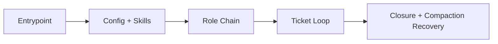

# Example src_architecture (repo-grounded)

## Metadata
- Example type: high-fidelity architecture example
- Objective: show what a strong architecture document looks like when based on
  real repository files
- Last verified at: 2026-02-19T03:15:00Z

## Scope and Intent
This example demonstrates a credible C4 architecture narrative for Context
Compass using this repo's actual entrypoints, routing files, ticket lanes, and
board state files.

## DO NOT ASSUME / Unknowns Gate
- Keep unresolved claims marked UNKNOWN.
- Promote to FACT only with file evidence.

## Unknowns
- UNKNOWN: whether automated path/reference scanning will be part of the default
  release checklist.
- UNKNOWN: whether artifact retention defaults should differ by lane.

## System Context (C4)
Context Compass turns volatile chat context into durable, file-backed execution
state through policy bootstrap, role routing, and ticket-first notes.

## System Boundary and External Interfaces
- Entrypoints: `AGENTS.md`
- Router/config: `SKILLS.md`, `config/context_compass_config.yaml`
- Work memory: `attention_board.md`, `tickets/`
- Artifact memory: `artifact_board.md`, `artifacts/`

## Architecture Summary (C4)
- bootstrap/guardrails
- role-chain routing
- ticket microcycle execution
- closure and compaction continuity

## Entrypoints and Runtime Guardrails
- mandatory onboarding/certification before work
- parent-first role-chain reads
- explicit re-onboarding after compaction/handoff

## Boot and Configuration Sequence
1. Read runtime entrypoint.
2. Read execution contract and compaction policy.
3. Read config + top-level skills map.
4. Resolve and read role chain.
5. Route to active ticket.
6. Execute microcycle and document findings.

## Data Flows and Sequences
- request -> routing -> ticket loop -> validation -> closure sync
- compaction -> re-onboarding -> recertify -> resume

## Operational Invariants
- ticket notes are canonical in-flight memory
- UNKNOWN never becomes FACT without evidence
- sample assets stay in `examples/` lanes

## Failure Modes and Error Paths
- broken references
- stale attention-board pointer
- missing artifact disposition

## C1 Code Map (Core Only)
- path: `SKILLS.md`
  start_line: 1
  end_line: 68
  loc: 68
  verified_at: 2026-02-19T03:15:00Z
- path: `config/context_compass_config.yaml`
  start_line: 1
  end_line: 136
  loc: 136
  verified_at: 2026-02-19T03:15:00Z
- path: `attention_board.md`
  start_line: 1
  end_line: 33
  loc: 33
  verified_at: 2026-02-19T03:15:00Z
- path: `artifact_board.md`
  start_line: 1
  end_line: 31
  loc: 31
  verified_at: 2026-02-19T03:15:00Z

## Diagrams
```text
Entrypoint -> Config/Skills -> Role Chain -> Ticket Loop -> Closure/Compaction
```



## Information Sources
- `AGENTS.md`

- `SKILLS.md`
- `config/context_compass_config.yaml`
- `agent_onboarding/default/general/skills/workflow.md`

## Context / Handoff Summary
This example shows the expected depth standard: concrete boundaries, explicit
invariants, and repo-backed references.


