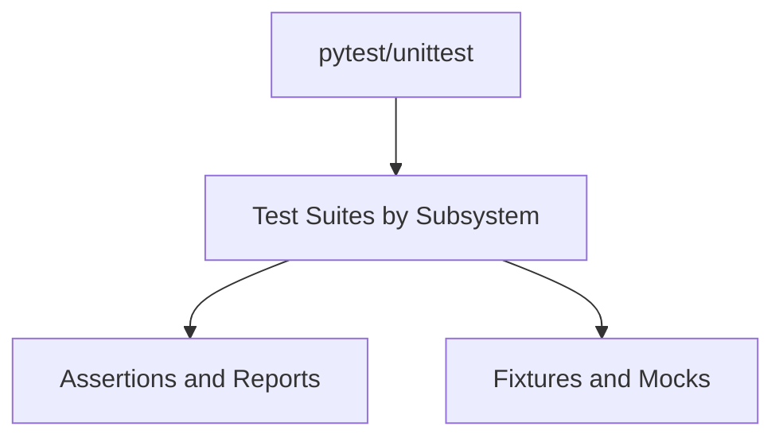

# Tests Architecture (C4)

## Metadata
- Doc ID: ARCH-TESTS-2026-01-17
- Status: current
- Owner:
- Created: 2026-01-17
- Updated: 2026-01-17

## Scope
This document covers the tests architecture at the C4 level, including how tests map to src and the system contracts they validate.

## C4 Architecture Summary
The tests layer mirrors the src package structure and validates concurrency primitives, orchestration logic, and utilities.
Tests are currently written in unittest style (TestCase, unittest.mock), while project policy is to use pytest for new tests.

## External Interfaces and Entry Points
- Test runner: unittest today; pytest is the required format going forward.
- Entry points: module test files under `tests/`.
- External dependencies: unittest, unittest.mock; no external services.

## Core Responsibilities
- Validate behavioral contracts for concurrency data structures and sync types.
- Validate synchronization primitives, coordinators, and dispatchers.
- Validate command_center orchestration, agents, pools, spectrum, and strategic commands.
- Validate utilities (coordination, timing, interceptor, helpers, exceptions).

## Data Flows and Lifecycle
- Inputs: test fixtures, mocked collaborators, and concurrency configurations.
- Outputs: test pass or fail results and assertion reports.
- Lifecycle and ownership: unittest setup and teardown; mocks cleaned after each test.

## Invariants and Guarantees
- Tests are organized by subsystem and should mirror src boundaries.
- New tests should use pytest even if legacy tests are unittest-based.

## C3 Components Overview
Reference details in `system_docs/tests_components.md`.
- command_center tests (activity, agents, pools, spectrum, strategic_command)
- concurrency tests (data_structures, sync_types, weak_data_structures)
- synchronization tests (controllers, coordinators, dispatchers, execution, primitives)
- utilities tests (coordination, timing, interceptor, helpers, exceptions)
- system integration tests (basic system flows)

## C2 Subcomponents Overview
Reference details in `system_docs/tests_components.md`.
- Test suites under `tests/command_center/`, `tests/concurrency/`, `tests/synchronization/`, `tests/utilities/`

## C1 Code Map (Key Paths)
- `tests/command_center/`
- `tests/concurrency/`
- `tests/synchronization/`
- `tests/utilities/`
- `tests/system_integration/`
- `tests/test_idea.py`

## ASCII Diagram (C4)
```
[pytest/unittest]
      |
      v
[Test Suites by Subsystem]
      |
      v
[Assertions and Reports]
```

## Mermaid Diagram (C4)


## Information Sources
- Directory layout under `tests/`
- `tests/command_center/test_command_center.py`

## Open Questions
- None recorded yet.

## Context / Handoff Summary
Populated tests architecture based on directory layout and unittest usage. Update as pytest adoption progresses.

