# Tests Components (C3/C2/C1)

## Metadata
- Doc ID: COMP-TESTS-2026-01-17
- Status: current
- Owner:
- Created: 2026-01-17
- Updated: 2026-01-17

## Scope
This document defines C3 components, C2 subcomponents, and C1 code references for tests.

## C3 Components Catalog
For each component, provide:
- Purpose:
- Responsibilities:
- Inputs/Outputs:
- Key Dependencies:
- Lifecycle/Cleanup:
- Invariants/Guarantees:
- Risks/Failure Modes:
- Key Files (C1):

Component: Command Center Tests
- Purpose: Validate orchestration, agents, pools, spectrum, missions, and strategic command.
- Responsibilities: assert lifecycle, limits, cleanup, and orchestration behaviors.
- Inputs/Outputs: unittest TestCase fixtures; assertions and mocks.
- Key Dependencies: unittest, unittest.mock, command_center modules.
- Lifecycle/Cleanup: setup and teardown per TestCase.
- Invariants/Guarantees: tests mirror command_center boundaries.
- Risks/Failure Modes: brittle mocks or reliance on internal details.
- Key Files (C1): `tests/command_center/`, `tests/command_center/test_command_center.py`

Component: Concurrency Tests
- Purpose: Validate concurrent collections and sync types.
- Responsibilities: assert thread-safe behavior, error paths, and invariants.
- Inputs/Outputs: unittest TestCase fixtures; assertions.
- Key Dependencies: unittest, concurrency modules.
- Lifecycle/Cleanup: per-test instance isolation.
- Invariants/Guarantees: concurrency contracts preserved.
- Risks/Failure Modes: timing-sensitive tests if not controlled.
- Key Files (C1): `tests/concurrency/`

Component: Synchronization Tests
- Purpose: Validate controllers, coordinators, dispatchers, execution gates, and primitives.
- Responsibilities: assert ordering, signaling, timeouts, and cleanup.
- Inputs/Outputs: unittest TestCase fixtures; assertions.
- Key Dependencies: unittest, synchronization modules.
- Lifecycle/Cleanup: per-test teardown of synchronization objects.
- Invariants/Guarantees: coordination contracts preserved.
- Risks/Failure Modes: deadlocks or flaky timing if misused.
- Key Files (C1): `tests/synchronization/`

Component: Utilities Tests
- Purpose: Validate coordination utilities, timing tools, helpers, interceptor, and exceptions.
- Responsibilities: assert correctness of shared utilities.
- Inputs/Outputs: unittest TestCase fixtures; assertions.
- Key Dependencies: unittest, utilities modules.
- Lifecycle/Cleanup: per-test isolation.
- Invariants/Guarantees: utility contracts preserved.
- Risks/Failure Modes: over-mocking or reliance on internal state.
- Key Files (C1): `tests/utilities/`

Component: System Integration Tests
- Purpose: Validate minimal cross-cutting behavior across subsystems.
- Responsibilities: basic system build and integration flows.
- Inputs/Outputs: unittest TestCase fixtures; assertions.
- Key Dependencies: unittest, multiple src subsystems.
- Lifecycle/Cleanup: ensure teardown to avoid leaked threads.
- Invariants/Guarantees: minimal integration coverage exists.
- Risks/Failure Modes: slow or flaky integration steps.
- Key Files (C1): `tests/system_integration/`

Component: Experimental or Idea Tests
- Purpose: Capture exploratory or comparison tests.
- Responsibilities: ensure experiments are isolated and documented.
- Inputs/Outputs: unittest TestCase fixtures.
- Key Dependencies: unittest.
- Lifecycle/Cleanup: per-test isolation.
- Invariants/Guarantees: keep experimental scope explicit.
- Risks/Failure Modes: unclear intent or stale experiments.
- Key Files (C1): `tests/test_idea.py`

## C2 Subcomponents Catalog
For each subcomponent, provide:
- Parent Component:
- Purpose:
- Contract/Interface:
- Data Structures:
- Concurrency/Threading Notes:
- Key Files (C1):

Subcomponent: Command Center - Activity Tests
- Parent Component: Command Center Tests
- Purpose: Validate activity builders and status.
- Contract/Interface: activity lifecycle and status invariants.
- Data Structures: activity objects and status states.
- Concurrency/Threading Notes: validate thread-safe interactions.
- Key Files (C1): `tests/command_center/activity/`

Subcomponent: Command Center - Agent Pools Tests
- Parent Component: Command Center Tests
- Purpose: Validate pool building, deployment, and job execution.
- Contract/Interface: pool lifecycle and policy enforcement.
- Data Structures: pool records and job definitions.
- Concurrency/Threading Notes: pool coordination and cleanup.
- Key Files (C1): `tests/command_center/agent_pools/`

Subcomponent: Command Center - Agents Tests
- Parent Component: Command Center Tests
- Purpose: Validate agent behavior and state management.
- Contract/Interface: agent lifecycle and cognition flows.
- Data Structures: agent state and operational memory.
- Concurrency/Threading Notes: agent thread safety.
- Key Files (C1): `tests/command_center/agents/`

Subcomponent: Command Center - Mission Tests
- Parent Component: Command Center Tests
- Purpose: Validate mission orchestration and sequencing.
- Contract/Interface: mission flow and status transitions.
- Data Structures: mission objects and status.
- Concurrency/Threading Notes: coordination behavior.
- Key Files (C1): `tests/command_center/mission/`

Subcomponent: Command Center - Spectrum Tests
- Parent Component: Command Center Tests
- Purpose: Validate logging, resources, and toolbox behavior.
- Contract/Interface: spectrum configuration and channel policies.
- Data Structures: log channels and action registries.
- Concurrency/Threading Notes: thread-safe logging expectations.
- Key Files (C1): `tests/command_center/spectrum/`

Subcomponent: Command Center - Strategic Command Tests
- Parent Component: Command Center Tests
- Purpose: Validate strategic command orchestration patterns.
- Contract/Interface: command distribution and deployment logic.
- Data Structures: command group routing and scheduling.
- Concurrency/Threading Notes: dispatch and ordering behavior.
- Key Files (C1): `tests/command_center/strategic_command/`

Subcomponent: Concurrency - Data Structures Tests
- Parent Component: Concurrency Tests
- Purpose: Validate concurrent collections.
- Contract/Interface: CRUD behavior, ordering, and error handling.
- Data Structures: concurrent dict/list/queue/set/stack/collection/bag/heap.
- Concurrency/Threading Notes: assert thread-safe behavior where applicable.
- Key Files (C1): `tests/concurrency/data_structures/`

Subcomponent: Concurrency - Sync Types Tests
- Parent Component: Concurrency Tests
- Purpose: Validate sync type operations and atomic behavior.
- Contract/Interface: arithmetic, mutation, and invariants.
- Data Structures: sync int/float/bool/string/ref.
- Concurrency/Threading Notes: atomic updates and contention handling.
- Key Files (C1): `tests/concurrency/sync_types/`

Subcomponent: Concurrency - Weak Data Structures Tests
- Parent Component: Concurrency Tests
- Purpose: Validate weak reference collections.
- Contract/Interface: weak ref semantics and cleanup.
- Data Structures: weak concurrent collections.
- Concurrency/Threading Notes: weak reference safety.
- Key Files (C1): `tests/concurrency/weak_data_structures/`

Subcomponent: Synchronization - Controllers Tests
- Parent Component: Synchronization Tests
- Purpose: Validate SignalController behavior.
- Contract/Interface: register, notify, cleanup.
- Data Structures: controller registries.
- Concurrency/Threading Notes: thread-safe registry operations.
- Key Files (C1): `tests/synchronization/controllers/`

Subcomponent: Synchronization - Coordinators Tests
- Parent Component: Synchronization Tests
- Purpose: Validate barriers and conductors.
- Contract/Interface: ordering, thresholds, timeouts.
- Data Structures: barrier state and counters.
- Concurrency/Threading Notes: coordination and wakeups.
- Key Files (C1): `tests/synchronization/coordinators/`

Subcomponent: Synchronization - Dispatchers Tests
- Parent Component: Synchronization Tests
- Purpose: Validate dispatchers and routing behavior.
- Contract/Interface: fork routing and synchronization.
- Data Structures: routing slots and caps.
- Concurrency/Threading Notes: deterministic routing under concurrency.
- Key Files (C1): `tests/synchronization/dispatchers/`

Subcomponent: Synchronization - Execution Tests
- Parent Component: Synchronization Tests
- Purpose: Validate execution gates and routing helpers.
- Contract/Interface: execution caps and gating behavior.
- Data Structures: execution slots.
- Concurrency/Threading Notes: gated execution behavior.
- Key Files (C1): `tests/synchronization/execution/`

Subcomponent: Synchronization - Primitives Tests
- Parent Component: Synchronization Tests
- Purpose: Validate primitives such as dynaphore and smart_condition.
- Contract/Interface: wait, signal, and state transitions.
- Data Structures: internal counters and queues.
- Concurrency/Threading Notes: avoid deadlocks and flakiness.
- Key Files (C1): `tests/synchronization/primitives/`

Subcomponent: Utilities - Coordination Tests
- Parent Component: Utilities Tests
- Purpose: Validate Group, Outcome, Pack, Package.
- Contract/Interface: correctness of coordination utilities.
- Data Structures: group and outcome state.
- Concurrency/Threading Notes: expected thread-safe usage.
- Key Files (C1): `tests/utilities/coordination/`

Subcomponent: Utilities - Timing Tools Tests
- Parent Component: Utilities Tests
- Purpose: Validate timers and stopwatch behavior.
- Contract/Interface: time measurement and reset semantics.
- Data Structures: timer state.
- Concurrency/Threading Notes: timing sensitivity and precision.
- Key Files (C1): `tests/utilities/timing_tools/`

Subcomponent: Utilities - Interceptor Tests
- Parent Component: Utilities Tests
- Purpose: Validate interceptor runtime and target types.
- Contract/Interface: interception chaining and target resolution.
- Data Structures: replacement chain and nodes.
- Concurrency/Threading Notes: thread safety depends on usage.
- Key Files (C1): `tests/utilities/interceptor/`

## C1 Code Index (Key Paths)
- `tests/command_center/`
- `tests/concurrency/`
- `tests/synchronization/`
- `tests/utilities/`
- `tests/system_integration/`
- `tests/test_idea.py`

## ASCII Diagram (C3/C2)
```
[Command Center Tests]
  |-- [Activity]
  |-- [Agent Pools]
  |-- [Agents]
  |-- [Mission]
  |-- [Spectrum]
  |-- [Strategic Command]
[Concurrency Tests]
  |-- [Data Structures]
  |-- [Sync Types]
  |-- [Weak Data Structures]
[Synchronization Tests]
  |-- [Controllers]
  |-- [Coordinators]
  |-- [Dispatchers]
  |-- [Execution]
  |-- [Primitives]
[Utilities Tests]
  |-- [Coordination]
  |-- [Timing Tools]
  |-- [Interceptor]
```

## Mermaid Diagram (C3/C2)

```mermaid
graph TD
  CC[Command Center Tests] --> ACT[Activity]
  CC --> AP[Agent Pools]
  CC --> AG[Agents]
  CC --> MS[Mission]
  CC --> SP[Spectrum]
  CC --> SC[Strategic Command]
  CON[Concurrency Tests] --> DS[Data Structures]
  CON --> ST[Sync Types]
  CON --> WD[Weak Data Structures]
  SYN[Synchronization Tests] --> CTR[Controllers]
  SYN --> CO[Coordinators]
  SYN --> DP[Dispatchers]
  SYN --> EX[Execution]
  SYN --> PR[Primitives]
  UT[Utilities Tests] --> CRD[Coordination]
  UT --> TT[Timing Tools]
  UT --> INT[Interceptor]
```


## Information Sources
- Directory layout under `tests/`
- `tests/command_center/test_command_center.py`

## Open Questions
- None recorded yet.

## Context / Handoff Summary
Populated test component map based on folder layout and unittest patterns. Update as pytest adoption progresses.


