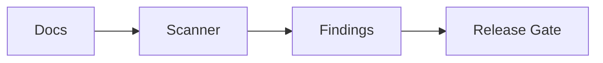

# Example tests_components

## Metadata
- Example only; demonstrates tests component mapping format.

## Scope
Map key test-validation components for workflow integrity.

## DO NOT ASSUME / Unknowns Gate
Keep unresolved test assumptions as UNKNOWN.

## Unknowns
- UNKNOWN: final CI matrix for multi-runtime validation.

## C3 Components Catalog
### Reference integrity scanner
- Purpose: detect broken internal references.
- Responsibilities: scan docs and resolve paths.
- Inputs: markdown/yaml files.
- Outputs: missing reference findings.
- Owned State: scan report.
- Lifecycle/Cleanup: run on release hardening.
- Concurrency/Threading: serial scan pass.
- Invariants/Guarantees: findings include file references.
- Failure Modes: false negatives from incomplete patterns.
- Observability: ticket validation notes.
- Key Files (C1): `tickets/*/README.md`, `templates/*.md`.

## C2 Subcomponents Catalog
- path resolver
- missing-target reporter
- severity triage layer

## Method-Level Call Flows (C1)
- `scan_files -> resolve_targets -> emit_findings`
- `triage_findings -> gate_release`

## C1 Code Map (Key Paths)
- path: `agent_onboarding/user_defined/synaptic_python_developer/examples/python/pytest_unit_examples.py`
  start_line: 1
  end_line: 40
  loc: 40
  verified_at: 2026-02-19T00:00:00Z
- path: `agent_onboarding/user_defined/synaptic_python_developer/examples/python/pytest_integration_examples.py`
  start_line: 1
  end_line: 40
  loc: 40
  verified_at: 2026-02-19T00:00:00Z

## Diagrams
```text
Docs -> Scanner -> Findings -> Release Gate
```



## Information Sources
- `templates/*.md`
- `tickets/*/README.md`
- `agent_onboarding/user_defined/synaptic_python_developer/skills/testing/*`

## Context / Handoff Summary
Use this structure when mapping real test components.