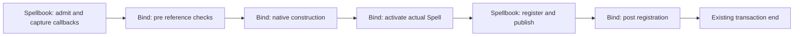

# Bind lifecycle hooks architecture patch

## Scope
Add synchronous registration hooks to each Spellbook through its owned Bind. Preserve application
creation hooks, native identities, compiler/cache semantics and lesser bind restrictions.
No generated assets are authorized until the owner approves the source.

## Interfaces
Spellbook.add_bind_hooks(pre=None, activation=None, post=None) appends callable sequences in order.
Spellbook.clear_bind_hooks() removes all three stages. Both operate on live books before or after
conjure, independently of frozen/shared configuration. Repeated callables are repeated registrations.
Pre receives the original reference and rejects by raising. Activation/post receive the actual Spell.
Return values are ignored, matching current synchronous activation conventions.
Conduit exposes matching add_bind_hooks and clear_bind_hooks facades for its owning Spellbook.
Only a live normal conduit may use them; no local callback registry or extra transaction is created.
Hook setup retains Book parity on automatic/dynamic roots; actual bind remains posture-gated.

## Ownership and flow
Book owns Bind; Bind owns immutable callback tuples and its existing examiner. Callback objects are
borrowed; teardown releases references and does not dispose callback objects. One tuple set is retained
for a bind operation so concurrent/reentrant hook updates affect later binds, not its remaining stages.
Callbacks run outside Bind's construction lock, within the existing admitted transaction.

```text
Book admission -> retain hook set -> Bind pre(reference) -> native construction
 -> Bind activation(Spell) -> profile completion -> Book registration/publication
 -> Bind post(Spell) -> existing transaction end -> return spell_id
```



## Persistence
Book hands value-only stage markers to the existing configuration-owned book-twin producer. Origin
freeze and re-freeze include them; successful post-conjure hook changes refresh the complete book twin.
The existing generic record/cache/formation/tap and preflight/restore shortfall readers are retained.
Full restore does not recreate callback code; live graft uses its receiving book's configured hooks.

## Failure and invariants
Callbacks wrap ordinary exceptions in HookExecutionError with phase/name/cause. Pre refusal allocates
no Spell. Activation failure retires the unpublished Spell/index locally; public registered removal
must not run. Post failure occurs after registration and is not an all-state rollback promise.
Nested bind completion does not imply outer commit. No new per-Meld check or callback fingerprinting.

## Migration and rollback
Core Book/Bind -> recording producer -> focused tests -> authored user documentation -> owner review.
Assets remain held. Roll back only additive hooks/producer arguments; retain all pre-existing flows.

## Ticket coverage
TASK-2026-09-21-implement-bind-lifecycle-hooks owns core, recording, regressions and code-review handoff.
