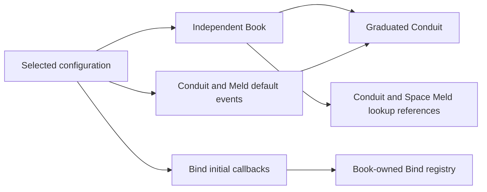

# Graduation configuration and independent Book ownership

<!-- BEGIN ENTRY: "Normal setup for graduated Books" -->
## Objective and boundaries
Graduation adopts an independent Book through ordinary configuration selection. Local omission
creates defaults; an existing shared frame configuration is adopted; a conflicting explicit object
is refused. The parent retains its Book, bindings and callbacks. No ordinary meld hot-path changes.
No generated assets until owner source approval.

## Configuration and hook interfaces
- Configuration supplies initial Bind callbacks through add_bind_hooks, clear_bind_hooks,
  get_bind_hooks and fluent with_bind_hooks. Defaults are empty. Freeze seals the seed configuration.
- Bind receives an optional immutable initial callback set. Book supplies the selected config's set
  at construction. Later Book/Conduit add/clear replaces that Book's tuples only.
- Configuration add_hooks/with_hooks accept omitted spellbook_id for default Conduit/Meld events.
  Existing explicit Book IDs remain valid. Book-specific event lists replace defaults for that event;
  other default events remain. Callbacks remain borrowed, not deep-copied or disposed.
- Conduit.upgrade_to_normal accepts optional configuration using normal Book selection. Existing
  hooks mapping remains a local runtime override installed after the new normal setup.

## Ownership and control flow
```text
optional configuration -> normal Book selection -> fresh Bind seeded once
  -> graduation adoption -> Conduit/Meld/Space references -> normal root publication
```



The frame owns shared config cleanup. Local Book config remains owned by that Book. Existing
creations remain in their actual stores; new definitions belong to the new Book. The former parent's
child map must no longer own the graduated root. Old Meld lookup caches must not cross Book adoption.

## Resolved definition boundary
Owner explicitly requires a new normal root with no parent and an empty Book. No existing Book,
registries or definitions transfer. Do not add implicit borrowing or contracts. Existing creation
retention is a separate store/disposal contract; it does not grant resolution of old spell IDs.
Correct legacy tests that encoded continuing access through the discarded-Book bug.

## Persistence and failure
Callback bodies are never serialized. Existing Book twin hook-presence markers include effective
configuration defaults and the Book's current Bind stages. Shared configuration remains a value
policy plus code-participation requirements on restore. Validate callback batches before mutation.
Graduation failures must not clean the parent Book or canonical shared configuration.

## Migration and rollback
Configuration/Bind foundation -> focused tests -> resolved graduation adoption -> lifecycle tests ->
owner review. Existing per-Book configured events and direct Book hook APIs retain semantics when no
defaults are configured. Rollback removes new setup/adoption behavior without altering parent state.

## Ticket coverage
TASK-2026-09-22-implement-graduation-configuration-and-hook-ownership owns implementation and tests.
<!-- END ENTRY: "Normal setup for graduated Books" -->
