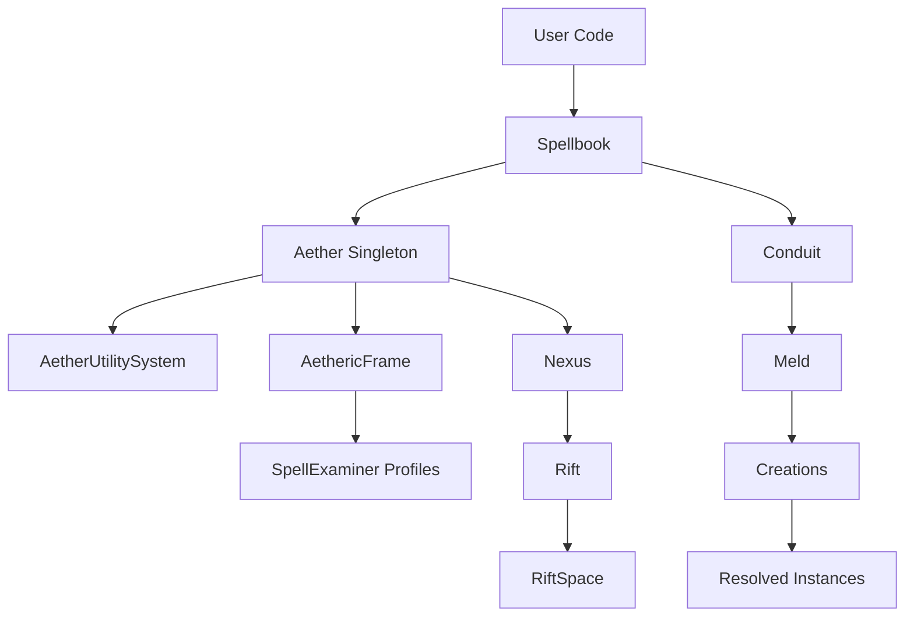
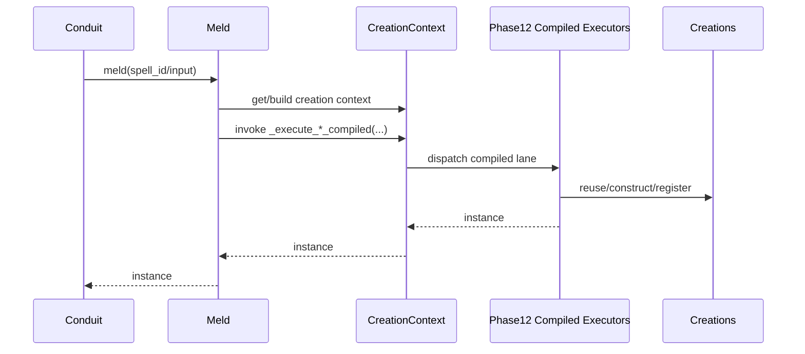
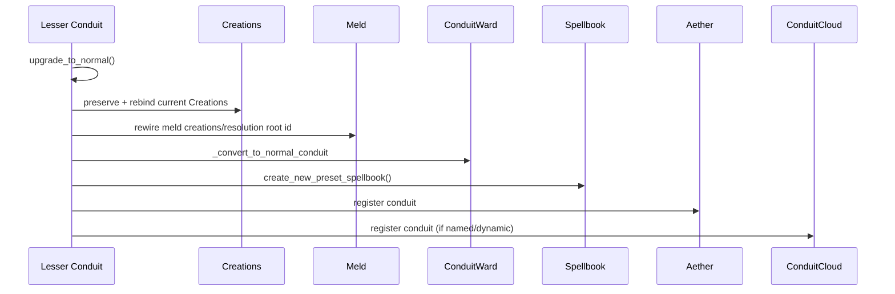



# Src Architecture (C4)

## Metadata
- Doc ID: ARCH-SRC-2026-01-17
- Status: in_progress
- Owner:
- Created: 2026-01-17
- Updated: 2026-06-13

## Table of Contents
- Metadata
- Scope and Intent
- Documentation Quality Standard
- DO NOT ASSUME / Unknowns Gate
- Unknowns
- Source Coverage and Evidence
- Glossary and Core Terms
- System Context (C4)
- System Boundary and External Interfaces
- Architecture Summary (C4)
- Entrypoints and Runtime Guardrails
- Boot and Configuration Sequence
- Spellbook Root Responsibilities
- Aether Global Singleton Responsibilities
- Aetheric Frame Responsibilities
- Conduit Lifecycle (Normal and Lesser)
- Binding and Registration Pipeline
- Resolution Styles and DI Shapes
- DI Resolution Contract (Spec)
- SpellCompiler and Validation Pipeline
- Resolution and Meld Pipeline
- Contracts, Policies, and Permissions
- Existence and Scoping Model
- Logging and Observability
- Ownership, Lifecycle, and Cleanup
- Operational Invariants
- Failure Modes and Error Paths
- Extension Points
- Data Flows and Sequences
- C3 and C2 Cross-Reference
- C1 Code Map (Core Only)
- Diagrams
- Information Sources
- Open Questions
- Context / Handoff Summary
- Appendix A: Deep Component Narratives (Core)
- Appendix B: Detailed Sequences and Data Flows
- Appendix C: Core File Inventory (Expanded)

## Scope and Intent
This document describes the Melder core architecture at the C4 level for
`src/melder`. It focuses on system boundaries, runtime entrypoints,
boot/configuration sequencing, and execution lifecycle for dependency
resolution and cleanup. It is intended to stand on its own after context
compaction.
Melder is framed here as a Dependency Graph Runtime (DGR) with DI-style
binding and resolution as a subset capability.

In scope (core runtime):
- Spellbook binding and conjure pipeline.
- Aether global singleton and per-frame state.
- Conduit runtime (normal and lesser), contracts, and policies.
- SpellCompiler phases and validation pipeline.
- Meld resolution runtime and Creations lifecycle manager.
- Control-plane state (SpellSystemStates, change control, incidents).
- Logging and cleanup contracts.

Out of scope:
- Tests and examples.
- JSON sidecar metadata files (`__*.json`).
- External docs beyond the codebase.

## Documentation Quality Standard
This document is durable context and must stand on its own.

Rules:
- No handwaving. Every claim is grounded in source evidence or marked as unknown.
- Entry points and boot sequences are explicit and ordered.
- Ownership, lifecycle, and cleanup ordering are explicit for core components.
- Invariants, failure modes, and concurrency constraints are stated.
- ASCII and Mermaid diagrams included for core flows.
- Evidence list updated when new sources are used.

## DO NOT ASSUME / Unknowns Gate
Rule: No Unverified Claims.
Any statement that is not directly supported by evidence must be treated as UNKNOWN.

Evidence means at least one of:
- A specific source file reference (preferred: file + symbol/method/class name).
- A citation to an explicit, already-verified artifact (e.g., a prior approved doc section).

If not evidenced => UNKNOWN.

UNKNOWN items must be explicitly labeled UNKNOWN (or added to the Unknowns section).
UNKNOWN items must be investigated by reading the relevant source(s).
If investigation cannot be completed (missing source access, ambiguity, or time),
the item must remain UNKNOWN and must not be promoted to fact.

No reasonable assumptions.
Do not infer behavior from naming, patterns, conventions, or typical frameworks.
Only the code/docs count.

When unsure:
- Mark it UNKNOWN.
- Identify the most likely evidence target (file + symbol).
- Investigate, then update the doc (or leave it UNKNOWN).

## Unknowns
This section is a living list of claims currently not backed by evidence.
Each item must include:
- What is unknown.
- Why it matters (impact).
- Where to investigate (file(s) + symbol(s)).
- Current status (uninvestigated / investigating / blocked).

- SYNC NOTE (2026-06-12 path/rename sweep, filesystem-verified):
  - C1 path normalization applied in this doc:
    the Nexus subtree now resolves under `src/melder/nexus/`;
    the dev-ops subtree remains under
    `src/melder/aether/aetheric_frame/dev_ops/`;
    `aetheric_frame.py` and `conduit_cloud.py` now resolve under
    `src/melder/aether/aetheric_frame/`;
    mutation-research paths now resolve under
    `src/melder/mutation_research/`;
    `spell_crafter/` -> `spell_compiler/` (class `SpellCrafter` is now
    `SpellCompiler` in `spell_compiler.py`; phase logic lives under
    `spell_compiler/phases/compiler_phase_*.py`).
  - Verified renames: `Configuration` -> `SpellbookConfiguration`
    (`configuration/spellbook_configuration.py`); `conjure(...)` takes
    `dynamic: bool` (no `automatic` parameter); `MeldGate`/`MeldGateController`
    files are gone and `utilities/synchronization/creation_gate.py` /
    `creation_gate_controller.py` exist instead.
  - Verified removals (paths annotated REMOVED below): runtime
    `MutationContract` descriptor (`meld/contracts/mutation_contract.py`) and
    `MUTATION_CONTRACT_DISABLED` are gone from `src/melder`; the
    `structure_profiles` subsystem is gone; `spell_examiner` AI-profile files
    are gone (profiles are now `binding_profile.py`, `general_profile.py`,
    `detailed_profile.py`, and `spell_compiler/profiles/resolution_profile.py`);
    `rift_event_configuration.py` is gone; `phase12_*_executor.py` are gone;
    `SpellCrafter._phase8_11_codegen_ir_dirty` no longer exists as the owning
    surface in `spell_compiler.py`; the live field is on
    `spell_compiler_artifact.py` as
    `SpellCompilerArtifact._phase8_11_codegen_ir_dirty`.
  - Verified compiler phase-artifact ownership:
    `SpellCompilerArtifact` is the spell-scoped owner of the phase-8-to-11
    analysis/planning/runtime outputs
    (`_occurrence_graph_analysis`, `_occurrence_order_analysis`,
    `_occurrence_instance_analysis`, `_occurrence_contract_analysis`,
    `_spell_codegen_model`, `_spell_codegen_plan`,
    `_spell_codegen_creation`, `_codegen_ir`,
    `_phase8_11_codegen_ir_dirty`), while the later facade layers publish into
    those slots rather than owning them:
    `SpellAnalyzer` -> occurrence analyses,
    `SpellArtifactProcessor` -> `SpellCodegenModel`,
    `SpellCodegenPlanner` -> `SpellCodegenPlan`,
    `CodegenCreationSystem` -> `SpellCodegenCreation`.

- UNKNOWN: Producer call sites for advanced state flags
  `SpellState.contract_violation`, `SpellState.mutation_candidate`,
  `SpellState.mutation_quarantined`, and `SpellState.mutation_failed` are not
  verified in runtime code.
  Why it matters: These flags/reasons exist in DevOps state enums and are used
  for diagnostics/governance, but missing producers make state semantics
  ambiguous during incidents and mutation rollout.
  Clarification: SpellContract/MutationContract behavior is no longer unknown.
  SpellContract contract-unvalidated paths are evidenced in
  `src/melder/aether/spellbook/spell_compiler/validation/strategies/contract_provider_presence_strategy.py`,
  `src/melder/aether/spellbook/spell_compiler/spell_compiler.py`,
  `src/melder/aether/aetheric_frame/dev_ops/spell_system_states/spell_system_states.py`,
  `src/melder/aether/aetheric_frame/dev_ops/change_control_manager/change_control_manager.py`,
  `src/melder/aether/conduit/conduit_ward/conduit_ward.py`, and
  `src/melder/aether/conduit/meld/meld.py`.
  MutationContract handling is currently explicit Phase 4 blocking
  (`MUTATION_CONTRACT_DISABLED`) with mutation overlay change-reason wiring in
  `src/melder/aether/spellbook/spell.py`.
  Where to investigate:
  `src/melder/aether/aetheric_frame/dev_ops/spell_system_states/spell_system_states.py`,
  `src/melder/aether/aetheric_frame/dev_ops/spell_system_states/spell_system_state.py`.
  SYNC NOTE (2026-07-11): the May MR skeleton (`research/**`, `promote_spell_version`,
  mutation node hooks) was deleted in the ResearchSet rebuild; producers for these
  flags now belong to the future MR runtime-seam slice (select/staged/promoted acts),
  not to any existing code path.
  Current status: blocked (producers await the MR runtime-seam slice; follow-up
  stories: `STORY-2026-02-13-spellstate-advanced-flag-producers`,
  `STORY-2026-02-13-mutation-research-runtime-wiring`).

## Source Coverage and Evidence
Coverage summary (non-exhaustive):
- Package entrypoint and guardrails: `__init__.py`, `__melder_registration_guard__.py`.
- Spellbook + binding pipeline: `spellbook.py`, `bind.py`, `spell.py`, `spell_index.py`.
- SpellbookConfiguration and system state:
  `spellbook_configuration.py`, `system_state.py`.
- SpellCompiler and validation: `spell_compiler.py`, `validation_system.py`,
  `spell_system_validation_system.py`.
- Resolution styles and DI descriptors: `spell_types.py`, `existence.py`,
  `parameter_di_shape.py`, `spell_map.py`, `spell_contract.py`,
  `resolution_style_matrix.py`.
- Validation strategies: `circular_dependency_strategy.py`,
  `binding_resolution_cycle_strategy.py`, `cycle_detection_strategy.py`,
  `contract_graph_cycle_strategy.py`.
- Aether and frames: `aether.py`, `aetheric_frame.py`.
- Package-root hardcopy docs and root helpers:
  `system_document.py`, `__architecture__.py`, `__components__.py`,
  `__graph_network__.py`, `__graph_details__.py`,
  `aether_configuration.py`, and `aether_configuration_builder.py`.
- Crystallizer root, decomposed subsystems, and module-world surfaces
  (paths current as of the 2026-07-10 decomposition): `crystallizer.py`,
  `configuration/crystallizer_configuration.py`,
  `configuration/crystallizer_configuration_builder.py`,
  `persistence/persistence_system.py`, `persistence/persistence_profile.py`,
  `persistence/persistence_crystal.py`,
  `asset_management/asset_management_system.py`,
  `asset_management/crystallizer_cache.py`,
  `crystal_loader_system/` (crystal_loader_system.py, load_admission.py,
  load_plan.py, restore_engine.py, bootstrap_loader.py),
  `crystal_analysis/` (crystal_analyzer.py + custody/strategies/preflight),
  `crystals/**` (the package-level digital-twin family incl.
  `spell_crystal.py` and `recorded_unit_state.py`), and
  `synthetic_module.py`.
- Mutation-research root and the ResearchSet package (2026-07-11 rebuild):
  `mutation_research.py`, `mutation_configuration.py`,
  `mutation_configuration_builder.py`, and `research_set/`
  (research_set.py, research_lane.py, research_node.py, transition_entry.py,
  research_journal.py, residence_registry.py, network_versioner.py).
- Nexus / AR runtime: `nexus.py`, `frame_descriptor_manager.py`,
  `frame_acl_manager.py`, `nexus_frame_builder.py`, `rift.py`,
  `rift_space.py`, room-specific `RiftSpace` types, `workstation.py`,
  `command_system/*.py`, `static_frame_viewer.py`, and `codegen_system/*`.
- Conduit runtime and contracts: `conduit.py`, `conduit_ward.py`, `policies.py`,
  `permissions.py`.
- Resolution runtime: `meld.py`, `creation_context.py`, `creations.py`, and
  `conduit_creations.py`.
- Runtime codegen/creation packaging: `spell_compiler_artifact.py`,
  `codegen_creation_system.py`, `spell_codegen_creation.py`,
  `resolution_frame.py`.
- Control plane: `spell_system_states.py`, `spell_system_state.py`,
  `spell_state.py`, `spell_state_change_reason.py`,
  `change_control_manager.py`, `dev_ops_manager.py`.
- Ownership transfer: `transfer_of_ownership.py`.
- Utilities: `cleanable.py`, `phase_scheduler.py`, `safe_logger.py`,
  `id_builder.py`, `init_helpers.py`, and `protocol_crafter.py`.

Evidence list (non-exhaustive):
- `src/melder/__init__.py`
- `src/melder/__melder_registration_guard__.py`
- `src/melder/system_document.py`
- `src/melder/__architecture__.py`
- `src/melder/__components__.py`
- `src/melder/__graph_network__.py`
- `src/melder/__graph_details__.py`
- `src/melder/aether/aether_configuration.py`
- `src/melder/aether/aether_configuration_builder.py`
- `src/melder/crystallizer/crystallizer.py`
- `src/melder/crystallizer/configuration/crystallizer_configuration.py`
- `src/melder/crystallizer/configuration/crystallizer_configuration_builder.py`
- `src/melder/crystallizer/persistence/persistence_system.py`
- `src/melder/crystallizer/persistence/persistence_profile.py`
- `src/melder/crystallizer/persistence/persistence_crystal.py`
- `src/melder/crystallizer/asset_management/asset_management_system.py`
- `src/melder/crystallizer/asset_management/crystallizer_cache.py`
- `src/melder/crystallizer/crystal_loader_system/crystal_loader_system.py`
- `src/melder/crystallizer/crystal_loader_system/load_admission.py`
- `src/melder/crystallizer/crystal_loader_system/restore_engine.py`
- `src/melder/crystallizer/crystal_analysis/crystal_analyzer.py`
- `src/melder/crystallizer/crystals/recorded_unit_state.py`
- `src/melder/crystallizer/crystals/spell_crystal.py`
- `src/melder/crystallizer/crystals/spell_index_crystal.py`
- `src/melder/crystallizer/crystals/contract_crystal.py`
- `src/melder/crystallizer/synthetic_module.py`
- `src/melder/mutation_research/mutation_research.py`
- `src/melder/mutation_research/mutation_configuration.py`
- `src/melder/mutation_research/mutation_configuration_builder.py`
- `src/melder/mutation_research/research_set/research_set.py`
- `src/melder/mutation_research/research_set/research_lane.py`
- `src/melder/mutation_research/research_set/research_node.py`
- `src/melder/mutation_research/research_set/transition_entry.py`
- `src/melder/mutation_research/research_set/research_journal.py`
- `src/melder/mutation_research/research_set/residence_registry.py`
- `src/melder/mutation_research/research_set/network_versioner.py`
- `src/melder/aether/spellbook/spellbook.py:L45-L75,L2342-L2480,L2909-L3008`
- `src/melder/aether/spellbook/spellbinder.py`
- `src/melder/aether/spellbook/bind/bind.py`
- `src/melder/aether/spellbook/bind/scan.py`
- `src/melder/aether/spellbook/bind/spell_index.py`
- `src/melder/aether/spellbook/spell.py:L1010-L1187`
- `src/melder/aether/spellbook/existence/existence.py`
- `src/melder/aether/spellbook/spell_types/spell_types.py`
- `src/melder/aether/spellbook/spell_compiler/spell_requirements_finder/parameter_di_shape.py`
- `src/melder/aether/spellbook/configuration/spellbook_configuration.py`
- `src/melder/aether/spellbook/configuration/system_state.py`
- `src/melder/aether/spellbook/spell_compiler/spell_compiler.py:L131-L2383`
- `src/melder/aether/spellbook/spell_compiler/validation/validation_system.py`
- `src/melder/aether/spellbook/spell_compiler/validation/strategies/circular_dependency_strategy.py`
- `src/melder/aether/spellbook/spell_compiler/validation/strategies/binding_resolution_cycle_strategy.py`
- `src/melder/aether/spellbook/spell_compiler/validation/strategies/contract_provider_presence_strategy.py`
- `src/melder/aether/spellbook/spell_compiler/system/spell_system_validation_system.py`
- `src/melder/aether/spellbook/spell_compiler/system/validation/cycle_detection_strategy.py`
- `src/melder/aether/spellbook/spell_compiler/system/validation/contract_graph_cycle_strategy.py`
- `src/melder/mutation_research/mutation_research.py`
- `src/melder/aether/aether.py`
- `src/melder/aether/aether_utility_system.py`
- `src/melder/aether/aetheric_frame/aetheric_frame.py`
- `src/melder/nexus/nexus.py`
- `src/melder/nexus/nexus_frame_manager.py`
- `src/melder/nexus/nexus_frame_builder.py`
- `src/melder/nexus/acl/builder/frame_acl_builder.py`
- `src/melder/nexus/rift/rift.py`
- `src/melder/nexus/rift/codegen_system/codegen_system.py`
- `src/melder/nexus/rift/codegen_system/codegen_transaction_context.py`
- `src/melder/nexus/rift/codegen_system/namespace/codegen_namespace_builder.py`
- `src/melder/nexus/rift/codegen_system/namespace/codegen_namespace_configuration.py`
- `src/melder/nexus/rift/codegen_system/validation/codegen_validator.py`
- `src/melder/nexus/rift/codegen_system/validation/codegen_validation_result.py`
- `src/melder/nexus/rift/codegen_system/execution/codegen_compiler.py`
- `src/melder/nexus/rift/codegen_system/execution/codegen_executor.py`
- `src/melder/nexus/rift/codegen_system/execution/codegen_execution_result.py`
- `src/melder/nexus/rift/codegen_system/observability/codegen_monitor.py`
- `src/melder/nexus/rift/frame_viewer/frame_viewer.py`
- `src/melder/nexus/rift/frame_viewer/view_multiframe.py`
- `src/melder/nexus/rift/frame_viewer/view_frame.py`
- `src/melder/nexus/rift/frame_viewer/view_conduit.py`
- `src/melder/nexus/rift/frame_viewer/view_spell.py`
- `src/melder/nexus/rift/rift_space/rift_space.py`
- `src/melder/nexus/rift/rift_space/event_system/rift_event_system.py`
- `src/melder/nexus/rift/rift_space/event_system/rift_event.py`
- `src/melder/nexus/rift/rift_space/static_rift_space.py`
- `src/melder/nexus/rift/rift_space/codegen_rift_space.py`
- `src/melder/nexus/rift/rift_space/capability_rift_space.py`
- `src/melder/aether/conduit/conduit.py`
- `src/melder/aether/conduit/conduit_cluster.py`
- `src/melder/aether/aetheric_frame/conduit_cloud.py`
- `src/melder/aether/conduit/meld/meld.py:L220-L499`
- `src/melder/aether/conduit/meld/creation_context/creation_context.py:L109-L814`
- `src/melder/aether/spellbook/spell_compiler/spell_compiler_artifact.py`
- `src/melder/aether/spellbook/spell_compiler/codegen_creation_system/codegen_creation_system.py`
- `src/melder/utilities/custom_exceptions/meld_execution_error.py:L4-L96`
- `src/melder/utilities/custom_exceptions/spellbook_validation_error.py:L1-L233`
- `src/melder/aether/spellbook/spell_compiler/dag/resolution_frame/resolution_frame.py`
- `src/melder/aether/conduit/meld/contracts/spell_map.py`
- `src/melder/aether/conduit/meld/contracts/spell_contract.py`
- `src/melder/aether/conduit/creations/creations.py`
- `src/melder/aether/conduit/creations/conduit_creations.py`
- `src/melder/aether/conduit/spell_space/spell_space.py`
- `src/melder/aether/conduit/conduit_ward/conduit_ward.py`
- `src/melder/aether/conduit/conduit_ward/transfer/transfer_of_ownership.py`
- `src/melder/aether/conduit/conduit_ward/policies/policies.py`
- `src/melder/aether/conduit/conduit_ward/permissions/permissions.py`
- `src/melder/aether/aetheric_frame/dev_ops/devops_information_registry.py`
- `src/melder/aether/aetheric_frame/dev_ops/dev_ops_manager.py`
- `src/melder/aether/aetheric_frame/dev_ops/spell_system_states/spell_system_states.py`
- `src/melder/aether/aetheric_frame/dev_ops/spell_system_states/spell_system_state.py`
- `src/melder/aether/aetheric_frame/dev_ops/change_control_manager/change_control_manager.py`
- `src/melder/utilities/general_base/cleanable.py`
- `src/melder/utilities/helpers/id_builder.py`
- `src/melder/utilities/helpers/init_helpers.py`
- `src/melder/utilities/synchronization/phase_scheduler.py`
- `src/melder/utilities/logger/safe_logger.py`
- `src/melder/utilities/ai_native_support_tools/protocol_crafter.py`

## Glossary and Core Terms
- Aether: Global singleton that owns AethericFrames and global registries.
- AethericFrame: Per-frame container for conduits, registries, and dev-ops state.
- Dependency Graph Runtime (DGR): Runtime that builds and executes dependency
  graphs at resolution time, supports late binding via contracts/links, and
  enforces runtime validation gates before activation.
- Spellbook: User-facing binding and conjure surface for the DGR.
- Spell: Bound object metadata (spellframe, spell_id, existence, permissions).
- SpellIndex: Stable index (ULID) that categorizes and targets spells and holds
  the active selected spell. Version history is owned by MutationResearch.
- Conduit: Runtime scope and activation host for resolving spells via Meld.
- ConduitWard: Relationship manager for contracts, policies, and lineage links.
- Creations: Instance registry for a conduit; enforces existence semantics.
- SpellSpace: Scoped handle for unique_per_spell_space instances.
- SpellCompiler: Per-spell pipeline for requirements, graph, frame, validation.
- SpellSystemStates: Per-frame control plane for lineage topology and validity.
- ChangeControlManager: DevOps tracker for dirty roots and pending changes.
- AetherUtilitySystem: Process-wide utility host for shared providers,
  currently logger resolver/fallback registration.
- Nexus: Public singleton AR root over hidden Aether substrate state.
- FrameDescriptorManager: Nexus-owned manager for frame-scoped descriptors,
  passive publication, and Nexus-managed frame-record ownership.
- FrameACLManager: Nexus-owned manager for frame-local ACL containers,
  profile registries, and frame-level ACL change fan-out.
- NexusFrameBuilder: fluent authored-frame builder created by
  `NexusFrameManager.begin(...)` to stage one Nexus-managed frame
  configuration before rooted creation.
- FrameACLBuilder: frame-local mutable ACL authoring surface that owns one
  active view/command/codegen draft session for a `FrameACLContainer`.
- Rift: Live AR runtime object that attaches to Nexus-managed frames and
  userland target frames.
- RiftSpace: Room/workspace object owned by a Rift.
- FrameLinkContract: Rift-local frame selection contract storing the selected
  view, command, and codegen ACL family names per frame.
- FrameViewer: Rift-backed public viewer host that reads current view
  projections on demand and requires explicit `frame_name` for frame-local
  operations.
- ViewMultiFrame / ViewFrame / ViewConduit / ViewSpell: on-demand viewer helper
  surfaces above the current Rift projection state.
- Workstation: Room-local strong/weak binding canvas for saved objects,
  attributes, methods, and one active target.
- CommandSystem: Room-local mediated command layer above the
  viewer/workstation split, specialized by room mode.
- CodegenSystem: room-owned internal codegen engine that builds transaction
  contexts, validates code, builds namespaces, compiles/executes code, and
  publishes codegen lifecycle events for one `CodegenRiftSpace`.
- StaticFrameViewer: Static-room viewer overlay that filters spell-facing
  query/projection paths down to already-live spell surfaces.
- SpellExaminer profile layer: registry-backed `general` and `detailed`
  examination profiles used for richer inspection over raw candidates and live
  spells.
- Policies: Conduit link/visibility rules used in dynamic mode.
- Permissions: Spell access levels across conduits (read/create/block).
- SpellMap: Declarative DI placeholder for explicit spell/frame/binding targets.
- SpellContract: Late-bound contract socket for dynamic linking across conduits.
- Legacy mutation-socket semantics: retained validation/change-reason context
  for the removed `MutationContract` runtime descriptor.
- ParameterDIShape: Phase 1 classification of how a parameter should resolve.

## System Context (C4)
Melder is a Dependency Graph Runtime embedded into user systems. User code
binds classes/functions/instances into a Spellbook, then conjures Conduits to
resolve instances via Meld. DI-style binding and resolution are a subset of
the runtime behavior. The live system now also includes:
- a hidden substrate/utility layer (`Aether`, `AetherUtilitySystem`,
  `AethericFrame`)
- a public AR runtime surface (`Nexus`, `Rift`, `RiftSpace`)
- tooling/introspection layers centered on SpellExaminer profile builders

Dependencies include:
- Python runtime (warns if < 3.13 or if GIL is enabled).
- `ulid` for unique identifiers.
- Logging via `InitHelpers` + `AetherUtilitySystem` + `SafeLogger`
  (channel resolver first, stdlib fallback second).

## System Boundary and External Interfaces
External interfaces are Python APIs:
- package-root hardcopy document objects:
  `__architecture__`, `__components__`, `__graph_network__`, and
  `__graph_details__`
- `Aether.create_configuration()`,
  `Aether.create_configuration_builder()`, `Aether.configure(...)`, and
  `Aether.activate(...)` for root logger-policy installation
- `Aether.attach_logger(...)` and `Aether.enable_logging(...)` for explicit
  post-boot root logger attachment or config-backed automatic logger enablement
- `Crystallizer.create_configuration()`, `configure(...)`, `activate(...)`,
  `deactivate()`, and `create_spell_crystal(...)` for crystallizer policy and
  spell-world manifest construction; profile/checkpoint facades
  (`create_profile`, `set_active_profile`, `describe_profile`,
  `list_profile_names`, `clear_profile`, `delete_profile`,
  `create_checkpoint`, `describe_checkpoint`, `checkpoint_replay_data`,
  `list_checkpoint_ids`, `load_checkpoint`, `flush_checkpoint`,
  `reload_cached_checkpoint`, `list_cached_checkpoint_ids`,
  `get_spell_crystal`) as the ONLY public
  surface over the buried persistence record; emit sink verbs (`emit`,
  `emit_spell_crystal`, `emit_spell_activity`, `emit_spell_removed`,
  `emit_spellbook_removed`, `emit_spell_index_removed`,
  `emit_contract_removed`, `emit_frame_removed`, `emit_nexus_state`,
  `emit_mutation_research_state`) are pushed by structural units at their
  own confirmation/teardown points and are NO-OPs while the crystallizer is
  inactive; `create_spell_index_crystal` / `create_contract_crystal` are
  the builder companions the seams emit through
- `Aether.mutation_research` as the access path to the hosted mutation root,
  plus `MutationResearch.create_configuration()`,
  `create_configuration_builder()`, `configure(...)`, `activate(...)`,
  `research_set(...)`, `create_research_set(...)`,
  `list_research_set_names()`, `describe_research_composition()`,
  `load_recorded_composition(...)`, `record_world_entry(...)`,
  `record_promotion(...)`, `residency_view(...)` (the query-time
  active/parked/stored join), `set_active_campaign(...)` /
  `clear_active_campaign()` / `active_campaign` (ambient stamp carried by
  every runtime auto-record), `diff_research(...)`,
  `create_diff_engine()`, and the foresight reads (2026-07-11 agent QoL
  kit): `source_view(...)` (recorded-first module text, live-disk fallback
  w/ drift marker), `impact_view(...)` (blast radius joined with research
  residency), `module_graph_view(...)` (walkable module world),
  `source_drift_view()` (full drift report), the crystal-well reads
  (2026-07-11 units-and-scales ruling): `module_view(...)` (the one-call
  module dossier: text labeled synthetic/user/live_disk, fingerprint,
  path, deps both ways, exports, drift), `part_view(...)` (one named
  top-level part's text/span/carrying module), `parts_view(...)` (the
  class-code inventory: every top-level part per module with full text)
  and `part_diff(...)`
  (unified part-text diff between versions over RECORDED material only,
  carrying its module-grain radius; diff material drinks BOTH recorded
  carriers - synthetic and user-retained - and never the live disk;
  whole-version diffs offer the grain CHOICE via three registered
  strategies: source/structural/parts),
  `preview_candidate(...)`
  (read-only candidate mock: AST analysis + would-be diff via
  `DiffEngine.diff_materials` + would-be radius; nothing executes, binds,
  or records), `synthesize_candidate(...)` (surgical composition through
  the owned `StructuralSynthesizer`: donor parts splice into the base root
  module + full preview; salvaged May lane), and the staged-ancestry mint
  seam (`stage_ancestry`/`clear_staged_ancestry`/`staged_ancestry`,
  campaign-pattern: the next fresh world entry mints the multi-parent
  node one-shot), and the composition reads (GroupedResearchNode ruling
  2026-07-11: `group_view` roster + behind drift, `group_diff_research`
  through the MIRRORED GroupDiffEngine ["members" strategy:
  lane-evidenced version_moved pairing], `group_impact_view` union
  member radii + internal/outbound split + CLOSURE + adjacency,
  `group_footprint_view` physical shadow + shared-module coupling,
  `group_drift_view` custody drift narrowed to the footprint,
  `group_history_view` the area's journal story, `compositions_of` the
  reverse lift [surfaced as `pinned_by_compositions` on spell
  residency]; `residency_view` is kind-aware - compositions answer
  "informational" with no custody/frame probes; POLYMORPHIC VERBS
  [2026-07-12]: the spell-grain reads themselves dispatch on node kind -
  source/parts/module_graph/module fan out per member, part_view
  roster-searches naming the carrying member, impact_view on a
  composition answers the group radius, diff_research routes two
  compositions through the members engine, code-grain verbs refuse
  compositions teach-grade; the emitted MutationResearchCrystal derives
  EXPLICIT DB-storable node rows for both families at construction, and
  MutationResearchConfiguration.activate() CARRIES the recorded
  composition forward - the docking-loop law); the returned `ResearchSet` carries the
  agent verb surface (`register_spell`, `register_group`/
  `recompose_group` [compositions = GroupedResearchNode, its OWN node
  type, purely informational, content-addressed over pinned members; a
  lane of group nodes is a subsystem's timeline], `create_lane` [typed via
  `LaneType` development/experiment/production/test; join gate armed by
  configuration `lane_type_enforcement`], `attach`/`detach`,
  `join`, `archive`, `walk`/`history`/`heads`, `campaign_view`,
  `snapshot_network`/`restore_network`); the spellbook's bind,
  bind_inactive, and notch confirmation points auto-record
  world-entry/staged/promoted events while the root is active. The USER
  surface is the Rift rooms (2026-07-11): codegen rooms carry the full
  34-command `research_*` family (14 record/organization/campaign incl.
  the research_recent cold-landing read + 9
  foresight incl. the crystal-well module/part reads and the codegen-only
  `research_preview` + 3 synthesis + 8 composition),
  capability rooms the twenty-one reads (seven record + eight foresight +
  six composition), both
  ADVERTISED via `list_supported_command_methods`, and
  `ViewSpell.describe_spell_research(...)` / `describe_spell_source(...)`
  annotate any visible spell with its research residency and recorded
  module source. The old `Conduit.get_mutation_research()` door is
  DELETED; as of 2026-07-12 (patch
  mutation_research_accessor_doors_2026_07_12) Spellbook and Conduit
  instead bind the world root at init and expose it through borrowed
  read-only `mutation_research` properties (frames still carry no
  mutation dimension)
- `Spellbook.bind(...)` and `SpellBinder` fluent binding helpers.
- `Spellbook.scan(...)` and `Scan.scan_module(...)` for deferred module
  registration through `scan_bind` metadata
- `Spellbook.notch_spell(...)`, `add_spell_into_spellindex(...)`, and
  `remove_spell_from_spellindex(...)` for transaction-backed SpellIndex member
  switching, move-in, and move-out flows
- `Spellbook.conjure(...)` for building a root Conduit.
- `Conduit.meld(...)` for resolving instances.
- `Conduit.create_lesser_conduit(...)` for child scopes.
- `Conduit.link(...)` / `Conduit.sever_link(...)` for dynamic linking.
- `SpellbookConfiguration` properties and hooks.
- `Nexus.configure(...)`, `Nexus.enable(...)`, `Nexus.create_rift(...)`,
  and `Nexus.create_rift_configuration(...)` for AR bootstrap.
- `Rift.get_nexus_frame(...)`, `Rift.create_nexus_frame(...)`, and the
  singular `Rift.space` / viewer helpers for live AR work.
  - Nexus-facing create/get paths both return rooted conduits, not frame
    objects.
  - `create_nexus_frame(...)` is strict-create and raises if the frame already
    exists.
  - `get_nexus_frame(...)` is the recovery path for existing managed frames.
- `SpellExaminer.create_profile(target, profile="general"|"detailed", ...)`
  for reflective profile generation.
- `ProtocolCrafter.craft_protocol_code(...)`,
  `craft_protocol_module_code_from_source_file(...)`, and
  `write_protocol_module_from_source_file(...)` for protocol generation and
  bounded interface-file maintenance.

External IO:
- Logging provider registration through `AetherUtilitySystem` and
  `SafeLogger`.
- `ProtocolCrafter` reads Python source files and can write generated protocol
  modules or append/remove bounded protocol blocks in interface files.
- User-provided callables bound as spells.

## Architecture Summary (C4)
Melder runtime flow is layered:
1) Global substrate (`Aether`) owns frames, conduit registries, and hidden
   process-wide support objects.
2) Utility and logging resolution (`AetherUtilitySystem`, `InitHelpers`,
   `SafeLogger`) provide system-wide logger/provider indirection.
3) Spellbooks bind spells, run structural/resolution phases, and conjure
   Conduits.
4) Conduits resolve spells via Meld and manage object lifecycles via
   Creations.
5) Public AR state (`Nexus`, `Rift`, `RiftSpace`) mediates live access into
   the Melder-owned object world.
6) Tooling/introspection layers centered on `SpellExaminer` build reflective
   profile views over live runtime truth.
7) Package-root hardcopy document and helper exports expose agent-facing
   `StaticSystemDocument` objects plus root configuration/protocol tooling
   without entering the runtime graph itself.

Spell registration uses Bind to reflect objects into SpellIndex + Spell.
SpellCompiler and PhaseScheduler run phases before Conduit creation.
ConduitWard and contracts govern cross-conduit sharing.
SpellSystemStates and ChangeControl track structural/resolution validity and dirty roots
used by Meld to gate execution and trigger revalidation.
SpellIndex member mutation is transaction-backed at the public Spellbook
surface even though the member-store implementation still lives behind the
current `_apply_notch`, `_apply_add_to_index`, and `_apply_remove_from_index`
seams.

## Entrypoints and Runtime Guardrails
- `melder/__init__.py` warns on Python < 3.13 and on GIL-enabled builds
  via `_detect_nogil_mode()`.
- `MelderRegistrationGuard` provides a sentinel to tag internal objects
  and block their registration as spells.
- `__melder_registration_guard__` is instantiated at import time and
  referenced by internal classes via `__melder_internal__`.
- The first `Aether()` boot eagerly constructs hidden singleton support
  objects, including `AetherUtilitySystem`, `Crystallizer`, and `Nexus`.

## Boot and Configuration Sequence
1) First `Aether()` boot:
   - Creates hidden singleton support objects:
     `AetherUtilitySystem`, `Crystallizer`, and `Nexus`.
   - Starts with a null `SafeLogger` wrapper and no attached raw logger.
   - Requires a later explicit `attach_logger(...)` call to attach a real
     logger.
   - A live root-owned `AetherConfiguration` /
     `AetherConfigurationBuilder` lifecycle already exists through
     `Aether.create_configuration*()`, `configure(...)`, and `activate(...)`;
     it can enable automatic channel logger activation in the utility system,
     but that path is disabled by default.
2) User constructs a `Spellbook` or explicitly engages `Nexus`.
3) `Spellbook.__init__`:
   - Ensures the Aether frame exists (`Aether._ensure_frame`).
   - Initializes `SpellbookConfiguration`:
      - If Aether already has a frame-owned shared `SpellbookConfiguration`,
        adopts it.
      - If a config is provided and does not match frame, raises.
      - Otherwise creates a fresh `SpellbookConfiguration` and loads defaults.
   - Initializes logging through `InitHelpers` and
     `AetherUtilitySystem` (provider-backed channel logger first,
     explicit logger override or stdlib fallback second).
   - Initializes spell registries and SpellValidationSystem.
   - Pulls SpellSystemStates from the frame.
4) `Spellbook.conjure(...)`:
   - Validates and freezes `SpellbookConfiguration`.
   - Binds `SpellbookConfiguration` into Aether for the frame.
   - Derives and binds `AethericFrameConfiguration` for narrow frame posture.
   - Runs phases 1-4 (requirements, symbolic graph, local frame, validation).
   - Runs foundational conduit phases 5-7 (root blueprints, system validation, change control).
   - Runs conduit plan phases 8-11 (occurrence, injection, patch maps, execution plan) when foundational phases report no resolution errors.
   - Constructs a normal Conduit and registers it in Aether.
   - Fires pre/activated/post hooks and wires ownership into spells.
5) `Nexus` AR path (when engaged):
   - `Nexus.configure(...)` installs frozen process-wide AR policy.
   - `Nexus.enable()` opens Rift creation.
   - `Nexus.create_rift_configuration()` builds a Rift config whose primary
     room posture is chosen through `space_type`.
   - `Nexus.create_rift(...)` creates a bare `Rift`, programs one primary room
     from `space_type`, and registers the live Rift without requiring an
     initial target frame.
   - `Rift.create_nexus_frame(...)` / `Nexus.create_nexus_frame_for_rift(...)`
     now use the normal public Spellbook API:
     - build the Spellbook-facing `SpellbookConfiguration`
     - construct a `Spellbook`
     - call `spellbook.conjure(name=<root_conduit_name>, dynamic=True)`
     - publish descriptor/ACL state from the rooted result
     - return the rooted conduit rather than the frame object
     - raise if the target Nexus-managed frame already exists
   - `Rift.create_frame_link(frame_name)` is the separate attachment step: it
     validates generic target-frame policy through `Nexus`, requires descriptor
     truth, delegates Nexus-managed frame authorization back through `Nexus`
     when the target frame is Nexus-managed, ensures the frame-name ACL contract
     exists, mutates the frame contract, and refreshes the owned-space viewer.

## Spellbook Root Responsibilities
- Owns local spell registries and lookup maps.
- Maintains owned and contracted spell_id maps for O(1) resolution by current id.
- Binds spells using `Bind` and tracks spell identifiers.
- Interfaces with Aether for shared configuration and spell registry updates.
- Starts transaction-backed SpellIndex mutation flows for active-member switch,
  move-in, and move-out operations.
- Runs SpellCompiler phases and validation before Conduit creation.
- Conjures a single Conduit per Spellbook instance.
- Provides a `SpellBinder` fluent adapter for binding.

## Aether Global Singleton Responsibilities
- Singleton root for all AethericFrames.
- Owns the default frame and a map of named frames.
- Owns one optional root `AetherConfiguration` and exposes
  create/builder/install/activate helpers that apply logger policy into
  `AetherUtilitySystem`.
- Maintains spell registries per conduit and selected-spell registries per frame.
- Binds `SpellbookConfiguration` to frames.
- Registers conduits and spell indices.
- Exposes ConduitCloud and ConduitCluster access via frame.
- Privately hosts `Nexus`, `Crystallizer`, `AetherUtilitySystem`, and the
  lazily constructed `MutationResearch` singleton root rather than exposing AR
  or mutation control through Aether's public surface directly.

## Aether Utility System Responsibilities
- Singleton utility host for shared runtime providers.
- Owns one registered channel-logger resolver and one default stdlib logger
  fallback.
- Resolves provider-backed channel loggers for runtime objects through
  `InitHelpers.resolve_channel_logger(...)`.
- Resolves explicit logger overrides through
  `InitHelpers.resolve_safe_logger(...)`.
- Replaced the old logger-factory layer; live runtime no longer depends on
  `IrisLoggerFactory` or `StdLoggerFactory`.

## Crystallizer Responsibilities
- `Crystallizer` is a hosted singleton root owned by `Aether`.
- Owns installed crystallizer configuration plus configured/activated state.
- Uses `create_spell_crystal(...)` to build one loader-facing `SpellCrystal`
  from a live spell under the installed policy.
- Keeps source-classification policy in `CrystallizerConfiguration` rather
  than on `SpellCrystal` itself.
- Since the 2026-07-10 decomposition the root is a thin facade over THREE
  same-rank children (see "Persistence Subsystem Topology" at the end of
  this doc): `PersistenceSystem` (the record), `AssetManagementSystem`
  (bytes at rest: cache, formation files, the EPM DB seam), and
  `CrystalLoaderSystem` (the admission-gated unfold).
- `SpellCrystal` is the custody-twin CARRIER for one concrete spell: it
  delegates module-world analysis to the shared `crystal_analysis` service
  and carries the returned `CrystalAnalysisResult` (V3 carrier law), while
  `SyntheticModule` is the live in-memory module embodiment used when
  crystallized code is activated into the runtime.
- The loader, analysis, and asset-management packages are REAL subsystems
  since 2026-07-10 (formerly scaffold-only). `bootstrap_manifest.py` is
  gone; the pod-boot lane is `crystal_loader_system/bootstrap_loader.py`.

## Aetheric Frame Responsibilities
Each frame owns:
- Conduits (root conduits mapped by id).
- Spell registry per conduit and aggregated selected-spell registry.
- Conduit clusters for auto-sharing roots.
- ConduitCloud for dynamic named lookup.
- DevopsInformationRegistry as the frame-local topology and transaction mirror.
- SpellSystemStates registry and DevOpsManager.
- Optional frame-owned shared `SpellbookConfiguration`.
- Narrow `AethericFrameConfiguration` posture object bound during Spellbook
  conjure.
- DevOpsManager is constructed per frame and owns ChangeControlManager + RiskManager for that frame. EVIDENCE: src/melder/aether/aetheric_frame/aetheric_frame.py:__init__ + src/melder/aether/aetheric_frame/dev_ops/dev_ops_manager.py:__init__.
- SpellSystemStates stores per-conduit resolution state keyed by conduit_id in addition to frame-wide structural state. EVIDENCE: src/melder/aether/aetheric_frame/dev_ops/spell_system_states/spell_system_states.py:__init__ + get_or_create_conduit_resolution_state.
- ChangeControlManager admits structural mutations (bind/link/cluster_link/transfer_ownership/unlink) through one moded scope-acquisition gate (claim modes x exclusive / s shared / ix intent); the link and cluster-membership mirrors are maintained EAGERLY at the mutation site, race-safe under held claims, so strategies need no relational commit deltas. EVIDENCE: src/melder/aether/aetheric_frame/dev_ops/change_control_manager/transaction_manager/transaction_mediator.py + embargo_manager/embargo_manager.py; component detail in src_components.md "Transaction Admission Plane".

## Nexus and Rift Responsibilities
- `Nexus` is the public singleton AR root, not `Aether`.
- `Nexus` owns:
  - hidden `Aether` reference for Nexus-managed frame realization/disposal
  - process-wide AR configuration and enabled/configured state
  - process-wide Rift creation/direct-access gates plus target-frame and
    active-Rift budget enforcement
  - Rift registry, Rift name/id indexes, named Rift profiles, deterministic
    default-name counters, and target-frame ref counts used for budget
    enforcement
  - `RiftGateController` for per-Rift admission, drain, and entry-mode control
  - `FrameDescriptorManager`, which owns one `FrameDescriptor` per frame plus
    passive frame/conduit/spell publication and Nexus-managed frame records
  - `NexusFrameManager`, which owns the authoritative Nexus-managed frame
    registry and the authored configuration metadata for those frames
  - `NexusFrameBuilder`, which is created by
    `NexusFrameManager.begin(frame_name)` and defaults authored frames to the
    only valid Nexus-managed posture: dynamic, AI-native, and Rift-enabled
  - `FrameACLManager`, which now owns one frame-local ACL container per frame
    and each container owns separate named version chains plus one
    `FrameACLBuilder` family-draft surface for:
    - view
    - command
    - codegen
  - projection compilation through `create_frame_projection_sets(...)` and
    `create_frame_projection_sets_for_rift(...)`
  - ACL-change fan-out and batch refresh orchestration through
    `_refresh_rift_projection_sets_for_frames(...)`, with
    `_on_frame_acl_changed(...)` as the thin single-frame delegate into that
    batch path
- `Nexus` currently implements three internal frame topology behaviors:
  - `single` (behaviorally shared for all Rifts)
  - `indexed` (multiple named frames; shared-by-name access)
  - `one_per_workspace` (private frame per Rift)
  - creation remains explicit; Nexus does not auto-provision frames as part of
    these mode rules
  - Nexus-facing managed creation is Spellbook-mediated and rooted by default:
    - the caller may name the root conduit explicitly
    - the default root conduit name is `"root"`
    - the public result is the rooted conduit, not the frame
  - raw `NexusFrameManager` authoring is mode-constrained:
    - `single`
      - only the canonical shared default frame name may be created directly
    - `indexed`
      - explicit named direct creation remains allowed
    - `one_per_workspace`
      - raw direct manager creation is rejected because the path has no Rift
        owner identity, so callers must use the Rift-scoped Nexus creation path
- `Rift` owns:
  - per-Rift config snapshot
  - explicit target-frame contracts only
  - one `FrameLinkContract` per engaged target frame, each storing per-frame ACL selection across
    `view`, `command`, and `codegen` families
  - exactly one primary room created from `space_type`
  - one Rift-owned `RiftGate`
  - no eager Nexus-frame attachment state at Rift creation
  - no room registry or active-space switching surface
  - registration/active flags, logger, and live metadata
  - refresh orchestration for one Rift:
    - ask Nexus for fresh projection sets for the full assigned frame set or
      one changed-frame subset
    - store the current projection state on the Rift itself
    - apply updated projection state to the hosted room assets
- `RiftSpace` owns room-local identity, metadata, the durable attached
  Rift-backed `FrameViewer` asset, room-local workstation state, room-local
  command-system state, one room-local event system, and one room-local memory
  system.
- `CodegenRiftSpace` additionally owns one internal `CodegenSystem` and
  attaches it to the room-owned `CodegenCommandSystem` during room
  initialization.
- `RiftSpace` is now an asset host, not the projection manager:
  - generic rooms create one Rift-backed `FrameViewer` during room init
  - static rooms create one Rift-backed `StaticFrameViewer` during room init
  - the viewer reads current Rift projection truth on demand instead of
    storing a second local projection registry
  - frame-local viewer operations are explicit-frame operations; the viewer
    no longer owns default-frame routing state
- `Workstation` stores room-local strong/weak object, attribute, and method
  bindings plus one active target binding.
- `CommandSystem` is the room-local mediated command base. It owns shared
  command infrastructure, shared spell/runtime query helpers, and
  workstation-target execution helpers. Room-specific subclasses now own the
  commands that do not belong to every room:
  - `CapabilityCommandSystem` owns conduit discovery, link/contract-topology
    helpers, broad manual topology mutation, plus direct spell
    activation/reuse helpers
  - `StaticCommandSystem` owns live-only spell retrieval, reuse-only spell
    activation, and static spell-status helpers
  - `CodegenCommandSystem` keeps a selected runtime-helper surface, owns the
    public `validate_codegen(...)` / `execute_codegen(...)` seams, delegates
    those actions into the attached `CodegenSystem`, emits full-source
    codegen room-memory records through the room `RiftMemorySystem`, and
    owns the FULL research command family (2026-07-11): `research_walk`/
    `research_history`/`research_heads`/`research_residency`/
    `research_diff`/`research_campaign_view` reads plus
    `research_create_lane`/`research_attach`/`research_detach`/
    `research_join`/`research_archive` organization,
    `research_set_campaign`/`research_clear_campaign`, the five
    foresight commands (2026-07-11 agent QoL kit): `research_source`,
    `research_impact`, `research_module_graph`, `research_source_drift`,
    the crystal-well reads (`research_module` dossier, `research_part`,
    `research_parts` inventory, `research_part_diff` w/ automatic
    module-grain radius; `research_diff` offers the grain choice via
    strategy source/structural/parts),
    and the codegen-only `research_preview` (read-only candidate mock;
    composes an optional frame-scoped `validate_codegen` verdict when
    `frame_name` is given), plus the three synthesis verbs
    (`research_synthesize` surgical composition + preview,
    `research_stage_ancestry`/`research_clear_staged_ancestry` ambient
    multi-parent mint), plus the five composition commands
    (GroupedResearchNode subsystems: `research_group_register`/
    `research_group_recompose` organization and `research_group_view`/
    `research_group_diff`/`research_group_impact`/
    `research_group_footprint`/`research_group_drift`/
    `research_group_history` reads) - all mediated
    through the same command-action
    idiom, reaching the Aether-hosted MutationResearch root via a
    NON-CONSTRUCTING peek with a teach-grade refusal while research is
    inactive. `CapabilityCommandSystem` carries the twenty-one research
    READS only (seven record + eight foresight + six composition; no
    preview/synthesis/group-organization - they take or produce code or
    organize the record); static rooms carry none. Both rooms ADVERTISE
    their research family in `list_supported_command_methods`.
  When room-local memory callbacks are registered, one top-level successful
  public command call emits one `IRiftMemory` record through the room-owned
  `RiftMemorySystem`.
- `CodegenSystem` is the internal engine beneath that command facade. It owns:
  - per-call `CodegenTransactionContext` creation
  - `CodegenValidator`
  - `CodegenNamespaceBuilder`
  - `CodegenCompiler`
  - `CodegenExecutor`
  - `CodegenMonitor`
  It validates before execution, builds the live namespace only after accepted
  validation, and keeps lifecycle-event publication inside the monitor layer.
- `StaticFrameViewer` wraps the generic viewer only in static rooms so the
  spell-facing query/project surface stays aligned with static live-only
  semantics while still reading current projection truth from `Rift`.
- `StaticRiftSpace`, `CapabilityRiftSpace`, and `CodegenRiftSpace` are all
  live room types.
- Current room-mode split:
  - `static`
    - static viewer overlay
    - weak-by-default workstation
    - no topology mutation
    - no direct create-path spell activation
    - live-only spell-facing surface
    - static-specific status helpers
  - `capability`
    - broad manual runtime/object access
    - strong-by-default workstation
    - no codegen
    - owns conduit discovery, link/contract-topology helpers, topology
      mutation, and direct spell activation/reuse command helpers
    - lower Melder frame truth still wins
  - `codegen`
    - keeps a selected runtime-helper subset rather than capability parity
    - owns one internal `CodegenSystem` under `CodegenRiftSpace`
    - routes public validate/execute requests through `CodegenCommandSystem`
      into that engine
    - emits full-source codegen room-memory records for top-level validation
      and execution actions
- Current limitation: `Rift.on_nexus_frame_disposed(...)` is still only a
  logging seam. A real Rift-level event orchestration layer has not been
  built yet.
- ACL selection model:
  - the old frame-global bundle chain is gone
  - one frame container now owns separate named revision chains for view,
    command, and codegen
  - same-name selection is convenience only at the storage layer; the three
    family chains can hold divergent named contracts
  - the `Rift` frame-link path, however, pins a fixed same-name selection:
    `FrameLinkContract` resolves view, command, and codegen to the attached
    `frame_name` contract, materializing it from `default` when absent.
    EVIDENCE: src/melder/nexus/rift/frame_link/frame_link_contract.py:_build_selected_contract_names
    + src/melder/nexus/rift/rift.py:_ensure_frame_link_acl_contract
  - chain bumps trigger ACL-driven projection refresh through `Nexus`
  - the single-frame ACL callback delegates into the same batch refresh
    primitive used for explicit multi-frame refresh
  - `Nexus` computes the union of impacted Rifts by checking whether each
    changed frame is present in each Rift's assigned frame-contract set
  - each impacted Rift refreshes one changed-frame subset in one call
  - each affected Rift updates its own projection registry and then applies
    view/command/codegen projection state to its hosted assets
  - the refresh barrier is config-backed through `NexusConfiguration`:
    - `projection_refresh_gate_enabled`
    - `projection_refresh_gate_timeout_seconds`
    - `projection_refresh_gate_poll_interval_seconds`
  - default behavior remains:
    - block new entrants through the impacted Rift gates
    - wait for in-flight tickets to drain
    - refresh each impacted Rift once for its changed-frame subset
    - reopen the gates

## Conduit Lifecycle (Normal and Lesser)
Normal Conduits:
- Created by `Spellbook.conjure` with policy and mode.
- Register themselves and their spell indices in Aether.
- Own one `ConduitCreations` registry, one `ConduitMeld` front door, one
  `ConduitWard`, one `CreationGate`, one `SpellSpacePool`, and one
  `ConduitPool`.
- Optionally register into ConduitCloud if dynamic and named.

Lesser Conduits:
- Created by `Conduit.create_lesser_conduit`.
- Inherit Spellbook and `SpellbookConfiguration`.
- Use `ConduitCreations` too; lesser behavior is driven by conduit state,
  pooled lesser reuse, and root-lineage ids rather than by a different
  creations class.
- Are linked into the parent's ConduitWard lineage tree.
- Reuse the root conduit pool and the root-lineage resolution conduit id.

Upgrades:
- `Conduit.upgrade_to_normal` converts a lesser conduit to normal in dynamic mode:
  transfers creations, rewires Meld, converts ward state, seeds resolution state,
  and registers into Aether/ConduitCloud.

## Binding and Registration Pipeline
Binding flow (local spell):
1) `Spellbook.bind` converts permissions and existence enums.
2) `Bind._bind_logic`:
   - Rejects modules and Protocols as concrete spells.
   - Uses SpellExaminer to build a binding profile.
   - Fingerprints the profile and constructs a SpellIndex.
   - Creates a Spell with metadata (existence, permissions, spellframe).
3) Spellbook attaches hooks and registers the spell into local maps.
4) SpellSystemStates registers the lineage and marks it dirty.
5) If a Conduit exists, ownership metadata is stamped and existing objects
   are registered into Creations.
6) If a Conduit exists, Spellbook registers the new SpellIndex in Aether for
   conduit-scoped spell-id lookups.

## Spell Examination Profile Responsibilities
- `SpellExaminer` is the registry-backed reflective facade over profile
  creation.
- The built-in public profile names are `general` and `detailed`.
- Binding profiles are used during `Bind`; resolution profiles are attached
  when a live `Spell` is available; the detailed profile then adds class and
  callable inspection payloads.
- `SpellExaminer.create_profile(...)` is the stable public front door and
  delegates all work to registered builders.

## Resolution Styles and DI Shapes
Melder resolution behavior is composed from binding style, lifetime scope,
and per-parameter DI shapes.

Canonical matrix artifact:
- `src/melder/aether/spellbook/resolution_style_matrix.py` is the owner-maintained
  source of truth for SpellType x Existence support policy.
- `ResolutionStyleMatrix.BINDING_FAMILY_POLICY` is canonical.
- `ResolutionStyleMatrix.MATRIX_BY_SPELL_TYPE` is an expanded projection from
  family policy, not an independent policy table.

Binding styles (SpellType = 14):
- Class-based spells: `SPELL`, `SPELL_WITH_SPELLFRAME`,
  `SPELL_WITH_BINDING_NAME`, `SPELL_WITH_BINDING_NAME_WITH_SPELLFRAME`.
- Method/function spells: `METHOD`, `METHOD_WITH_BINDING_NAME`,
  `METHOD_WITH_SPELLFRAME`, `METHOD_WITH_BINDING_NAME_WITH_SPELLFRAME`.
- Lambda methods: `LAMBDA_METHOD_WITH_BINDING_NAME`,
  `LAMBDA_METHOD_WITH_SPELLFRAME`,
  `LAMBDA_METHOD_WITH_BINDING_NAME_WITH_SPELLFRAME`.
- Existing creations: `EXISTING_CREATION`, `EXISTING_CREATION_WITH_SPELLFRAME`,
  `EXISTING_CREATION_WITH_BINDING_NAME_WITH_SPELLFRAME`.

Lifetime scopes (Existence = 6):
- `unique`, `unique_per_conduit`, `many`, `unique_per_conduit_cluster`,
  `unique_per_conduit_lineage`, `unique_per_spell_space`.

Constraints:
- Method/lambda spells must use `Existence.unique` (enforced in `Bind`).

Parameter DI shapes (Phase 1, `ParameterDIShape`):
- `IGNORE`, `PLAIN`, `SINGLE_BY_ANNOTATION`, `COLLECTION_BY_ANNOTATION`,
  `SPELLMAP_DEFAULT`, `SPELL_CONTRACT`, `MUTATION_CONTRACT`.

Declarative DI descriptors:
- `SpellMap` supports four explicit shapes:
  1) `SpellMap(MyService)` (concrete-type key).
  2) `SpellMap(ILogic)` (frame-type key).
  3) `SpellMap(MyService, spellframe=ILogic, binding_name="primary")`.
  4) `SpellMap(spell=None, spellframe=ILogic, binding_name="primary")`.
- `SpellContract` declares late-bound contract sockets for dynamic mode;
  linking conduits later supplies providers.
- Legacy mutation-socket classifications are still recognized by validation,
  but the runtime descriptor class is gone and Phase 4 blocks that socket
  family with `MUTATION_CONTRACT_DISABLED` while mutation systems are on hold.

## DI Resolution Contract (Spec)
This section records the approved DI resolution contract (19-item spec) for
Melder. It is the reference for `Conduit.meld`, `Meld.meld`, `SpellInputUtils`,
`SpellMap` semantics, and SpellCompiler resolution behavior. Where the spec
and current implementation differ, the gap is called out explicitly.

Spec overview (Sections A-H):
- Root meld entry modes:
  - By spell_id (string) and by spell object (class/function).
  - By Protocol/frame type and by binding_name for disambiguation.
  - Root-level `spell_override` payload (dict/list/tuple).
  - By SpellName string (logical name) using a `(frame_key, bind_key)` index.
- Constructor DI shapes:
  - Type-hint DI by concrete class and Protocol frame.
  - SpellMap defaults and SpellMap frame-only mode.
  - Explicit method/lambda injection only via SpellMap or root meld.
  - Existing instance spells resolved by frame type.
- Collection DI:
  - `list[FrameType]` returns all implementations in registration order.
  - No separate IIndex-like DI concept.
- SpellMap semantics:
  - SpellMap mirrors type-hint DI but allows explicit spellframe/binding.
  - Override payloads are passed directly as positional/keyword overrides.
- Spell eligibility and uniqueness:
  - Classes, callables, and existing objects are valid spell targets.
  - Existing-object spells must bind as `Existence.unique`.
  - Single DI requires exactly one provider for a frame/key; ambiguity is a
    build-time error with guidance to SpellMap or list DI.
- Deep scan:
  - Post-init SpellMap resolution is not planned; no deep scan pass is implemented.
- Existence vs resolution:
  - Resolution decides the spell id; Existence controls lifecycle/reuse.
- Spellframe types:
  - Protocols/interfaces for contract DI; strings for grouping categories.

Spec vs implementation notes:
- Spec cites 19 items but includes Sections G/H labeled Items 20-21; treat
  numbering as advisory and follow the content as authoritative.
- Decision: Post-init SpellMap deep scan is not planned; users should express
  dependencies via constructor DI (SpellMap defaults/type hints).
- Decision: Conduit.meld public contract supports spell_id, spell object,
  spellframe, and spell_name; docstrings updated to reflect this multi-entry API.
- Implementation: Phase 4 `DuplicateSpellNameStrategy` scans local + contracted
  spells by `spell_name` and raises `DUPLICATE_SPELL_NAME` errors to prevent
  name-based resolution ambiguity.
- Implementation: MutationContract sockets are blocked in Phase 4 with
  `MUTATION_CONTRACT_DISABLED` while mutation systems are on hold.

## SpellCompiler and Validation Pipeline
Phases 1-4 are structural and run before Conduit creation:
- Phase 1: Requirements extraction.
- Phase 2: Symbolic graph build.
- Phase 3: Local frame creation and dependency graph assembly.
- Phase 4: Validation via SpellValidationSystem strategies.

Dirty terminology guardrail for this pipeline:
- `SpellCompilerArtifact._phase8_11_codegen_ir_dirty` is a local
  IR-freshness bit
  ("phase8_11 export payload is stale"), not a runtime validity gate.
- This bit is set by phase8/9/10/11 artifact replacement and flushed by
  `_capture_phase8_11_codegen_ir_if_dirty()` before codegen-creation compiler
  work and on
  `codegen_ir` reads.
- Change-control dirty roots remain a separate system:
  `ChangeControlManager.is_root_dirty(conduit_id, root_id)` is the meld gate
  checked by `Meld._gated_validation_required(...)`.
- EVIDENCE:
  - `src/melder/aether/spellbook/spell_compiler/spell_compiler.py:529-546`
  - `src/melder/aether/spellbook/spell_compiler/spell_compiler.py:1966-1997`
  - `src/melder/aether/spellbook/spell_compiler/spell_compiler.py:3513-3517`
  - `src/melder/aether/spellbook/spell_compiler/spell_compiler.py:3579-3583`
  - `src/melder/aether/spellbook/spell_compiler/spell_compiler.py:3647-3651`
  - `src/melder/aether/spellbook/spell_compiler/spell_compiler.py:3780-3787`
  - `src/melder/aether/aetheric_frame/dev_ops/change_control_manager/change_control_manager.py:1403-1475`
  - `src/melder/aether/conduit/meld/meld.py:502-532`

PhaseScheduler coordinates these phases using worker threads and a shared
cancellation event; broken spells trigger SpellbookValidationError.

Phase 4 strategy coverage (non-exhaustive):
- Circular/self-dependency detection and dangling dependency checks.
- Resolution frame presence and duplicate spell name detection.
- Annotation/SpellMap shape validation and parameter policy enforcement.
- Contract provider presence checks (warnings in dynamic/late-binding cases).
- Binding-resolution cycle detection and callable profile hygiene.
- Existing-creation compatibility checks.

## Resolution and Meld Pipeline
Phases 5-11 are conduit-scoped and run after Phase 1-4:
- Phase 5: Root blueprint generation (root-only map for system validation plus
  per-spell blueprints for constructed spells).
- Phase 6: System validation via SpellSystemValidationSystem.
- Phase 7: Change control integration and cleanup of phase artifacts.
- Phase 8: `SpellAnalyzer` occurrence-graph analysis.
  - publishes `_occurrence_graph_analysis`
- Phase 9: `SpellArtifactProcessor` model fitting.
  - publishes `_spell_codegen_model`
- Phase 10: `SpellCodegenPlanner` plan fitting.
  - publishes `_spell_codegen_plan`
- Phase 11: `CodegenCreationSystem` spell-static runtime packaging.
  - publishes `_spell_codegen_creation`

Existing-creation spells bypass the live Phase 8-11 group because they have no
occurrence graph, no analyzer-derived model, and no codegen-creation payload
to build. They still resolve through `CreationContextBuilder`, but that builder
uses the existing-creation route directly instead of requiring a
`SpellCodegenCreation`.

Meld runtime flow:
- Conduit delegates `meld(...)` to `Meld` and fires pre/post resolve hooks.
- The conduit-facing runtime front door is `ConduitMeld`, which owns the
  caller-conduit `ConduitCreations` store.
- Spellspace-facing runtime uses `SpellSpaceMeld`, which owns the
  spellspace-local creations store plus a reference to the owner-conduit
  creations store.
- Meld resolves the target Spell and chooses reuse vs instantiate based on Existence.
- `Conduit.has_live_creation(...)` and `describe_live_creation_status(...)`
  delegate to `Meld` for a no-create probe that mirrors meld lookup semantics.
- Meld enforces structural/resolution validity and change-control gates before execution.
- `CreationContextBuilder` consumes `artifact._spell_codegen_creation` for
  constructed spells and builds one spell-bound `CreationContext`.
- `CreationContext` dispatches the prebuilt no-overrides lane directly and
  keeps only runtime-only override specialization behavior:
  - no-overrides executor for plain meld calls
  - override specialization executor for override/mutation paths
- Codegen-creation-produced executors perform reuse/construct/register directly
  against Creations per Existence rules.

Lazy validation at meld time:
- `Meld._ensure_lineage_resolvable` re-runs structural phases (1-4) when
  SpellSystemState validity is UNKNOWN or GATED, under the per-spell lock.
- If per-conduit resolution validity is UNKNOWN or GATED, it runs phases 5-11
  via `spell._spellbook._run_resolution_phases_for_target_spell(...)`.

## Contracts, Policies, and Permissions
- ConduitWard manages contracts between conduits and lineage links.
- Policies gate link behavior (default, whitelist_all, block_all, inbound_only, outbound_only).
- Permissions on each Spell (read/create/block) govern access by borrowers.
- ConduitCluster can auto-share root spell lineages among members. Sharing uses
  a cluster-scoped `root_spell_id` (`cluster:{name}:{owner_id}:{spell_id}`) so
  cluster teardown removes only cluster-created contracts, and defaults
  permissions to `spell.permissions` (fallback "create") with optional dependency
  linking.
- Legacy mutation-socket paths are blocked by Phase 4 validation
  (`MUTATION_CONTRACT_DISABLED`) while mutation systems are on hold.
- Conduit link/sever operations fire `on_conduit_post_link` and
  `on_conduit_post_unlink` hooks when configured.
- `SpellContract` declares late-bound sockets in dynamic mode; conduit linking
  supplies providers and triggers revalidation (Phases 5-11).
- No live `MutationContract` descriptor class remains in `src/melder`; legacy
  mutation-socket classifications are only preserved so Phase 4 can block them
  with `MUTATION_CONTRACT_DISABLED`.
- Contract provider presence uses warnings for missing SpellContract providers;
  automatic-mode SpellContract sockets are errors. Legacy mutation-socket
  paths are blocked while mutation systems are on hold.
- Ownership transfer (`Conduit.transfer_spell_ownership`) migrates spell
  stewardship between conduits in dynamic mode, with optional creation moves,
  contract/cluster unsharing, and change-control gating.

## Existence and Scoping Model
Existence defines instance lifetimes:
- unique: per AethericFrame singleton.
- unique_per_conduit: per Conduit instance.
- many: new instance per meld.
- unique_per_conduit_cluster: registered via `Creations.add_creation` keyed by
  spell_id and shared across conduits via ConduitCluster contracts.
- unique_per_conduit_lineage: shared across lineage tree.
- unique_per_spell_space: scoped to a SpellSpace.

`Creations` is now a generic scoped live-object store with two registries:
- `_creations`
  - authoritative live runtime objects
- `_disposable_creations`
  - cleanup-only disposal metadata

`ConduitCreations` is the conduit/root specialization seam over that generic
store.
SpellSpace enforces active-scope semantics and supports reset/versioning.

## Logging and Observability
- `SafeLogger` remains the one logging adapter for both stdlib and channel
  loggers.
- `AetherUtilitySystem` is now the process-wide provider host for logger
  acquisition.
- `InitHelpers.resolve_channel_logger(...)` is the primary path for runtime
  objects that want hosted/provider-backed loggers.
- `InitHelpers.resolve_safe_logger(...)` is the path for explicit logger
  attachment after object boot.
- Automatic channel logger activation is now a utility-system policy gate that
  is intended to be owned by `AetherConfiguration`; when disabled, the channel
  path returns a null `SafeLogger`.
- `Aether`, `Spellbook`, `Conduit`, `Nexus`, and `Rift` now all resolve
  logging through that provider model.
- Cleanup and teardown use best-effort logging to avoid cascading failures.

## Ownership, Lifecycle, and Cleanup
- Cleanable defines the idempotent cleanup contract.
- Spellbook cleanup:
  - Cleans spells and SpellIndex keys.
  - Cleans configuration and validators.
  - Nulls references and cleans logger last.
- Conduit cleanup:
  - Fires hooks, tears down Meld, ConduitWard, and Creations.
  - Clears hooks and logger last.
- Aether cleanup:
  - Cleans frames, resets singleton state, and cleans logger.
- AetherUtilitySystem cleanup:
  - Clears channel-resolver and default-logger providers and resets singleton
    state for tests.
- Nexus cleanup:
  - Cleans registered Rifts, Nexus frame records, and logger state.
- Rift cleanup:
  - Cleans the one owned space, owned config snapshot, owned `RiftGate`, and
    engaged `FrameLinkContract` objects, then clears Rift-local metadata and
    cleans logger last.
- Creations cleanup:
  - Calls configured disposal methods; may raise ExceptionGroup.

## Operational Invariants
- Aether is a singleton with explicit reset for tests.
- Spellbook can conjure only one Conduit instance.
- `SpellbookConfiguration` must be frozen before Conduit creation.
- Existing-object spells must use `Existence.unique` for Creations registration.
- SpellIndex identity (ULID) is immutable; the active selected spell it targets
  can change. Versions are owned by MutationResearch.
- `dynamic=False` conjure only allows `Policies.default`.
- `dynamic=True` conjure requires `system_state=dynamic`.
- SpellSpace can only meld when it is the active spellspace for a Conduit.
- Linking/severing conduits is only allowed in dynamic mode.
- Method/lambda spells must use `Existence.unique`.
- Ownership transfer is only allowed in dynamic mode.
- Bare Rift creation does not require an initial target frame.
- Rift target attachment requires descriptor truth before the frame is accepted
  into the Rift frame contract.
- Static target attachment requires target-frame configuration with
  `rift_enabled=True`.
- Dynamic target attachment additionally requires `ai_native_enabled=True` and
  `system_state=dynamic`.
- `RiftSpaceType.capability` is a real broad-manual room posture now; it is
  no longer placeholder-only.
- `RiftSpace.event_system` is the room-local `IRiftEvent` publication surface,
  not the same thing as a Rift-level event orchestrator.

## Failure Modes and Error Paths
- Duplicate binding keys or spell id collisions raise RuntimeError.
- Conjure raises SpellbookValidationError when broken spells exist.
- Meld raises SpellbookValidationError when spell validity is invalid/gated/disabled.
- ChangeControl blocks roots marked dirty for the active conduit (`is_root_dirty(conduit_id, root_id)`).
- SpellSpaceScopeError if a non-active SpellSpace is used for meld.
- `Nexus.create_rift(...)` fails when the Rift configuration is invalid, but it
  no longer requires an initial target frame.
- `Rift.create_frame_link(...)` rejects target frames that do not satisfy the AR
  eligibility policy for the Rift's chosen room type.
- `Rift.create_frame_link(...)` also fails when descriptor truth does not yet exist
  for the requested frame.
- `Rift.create_frame_link(...)` also fails when a Nexus-managed target frame is
  not accessible to the requesting Rift under the active Nexus frame topology.
- `Rift.get_nexus_frame(...)` raises when a requested managed frame is
  unavailable under the current Nexus frame mode.
- `Rift.create_nexus_frame(...)` raises when the requested managed frame
  already exists or creation is not valid under the current Nexus frame mode.
- Cleaning the returned root conduit for a Nexus-managed frame should collapse
  the frame when it was the last conduit, which then triggers Nexus-side
  manager/descriptor/ACL cleanup through the normal Aether frame detach path.
- `SpellExaminer.create_profile(...)` raises `ValueError` when the requested
  profile name is not registered.
- Cleanup errors are logged; Creations may raise ExceptionGroup.
- Linking or severing in automatic mode raises RuntimeError.
- upgrade_to_normal raises RuntimeError when called in non-dynamic mode.
- SpellMap defaults that resolve to zero or multiple candidates raise RuntimeError.
- SpellContract requires at least `spell` or `spellframe` (ValueError).
- Ownership transfer raises RuntimeError when dynamic mode is disabled.

## Extension Points
- `SpellbookConfiguration` hooks for conduit lifecycle and meld pipeline.
- Logger provider registration through `AetherUtilitySystem` and the hosted
  `InitHelpers` resolution path.
- Spellbook binding hooks (pre/activation/post).
- Dynamic Conduit policies and ConduitCluster auto-sharing.
- Validation strategies registered in SpellValidationSystem.

## Data Flows and Sequences
### Sequence: Import to Ready
1. `import melder`:
   - Runtime warnings for Python version and GIL mode.
   - `__melder_registration_guard__` singleton instantiated.

### Sequence: Spellbook Initialization
1. `Spellbook.__init__`:
   - `Aether._ensure_frame(aetheric_frame)`.
   - `_initialize_configuration` (adopt or create `SpellbookConfiguration`).
   - `_initialize_logging` (SafeLogger and optional factory).
   - Initialize registries, validators, and SpellSystemStates.

### Sequence: Bind Spell
1. `Spellbook.bind(...)`:
   - Enum conversion for permissions and existence.
   - `Bind._bind_logic` produces SpellIndex and Spell.
   - Spellbook registers spell maps and SpellSystemStates lineage.
   - If Conduit exists, stamps ownership and registers existing objects.

### Sequence: Conjure Conduit
1. `Spellbook.conjure(...)`:
   - Validate/freeze `SpellbookConfiguration`, bind to Aether.
   - Run phases 1-4, then conduit foundational phases 5-7.
   - Run conduit plan phases 8-11 only when foundational resolution has no errors.
   - Live 8-11 mapping:
     - phase 8 analyzer
     - phase 9 processor
     - phase 10 planner
     - phase 11 codegen creation
   - Construct Conduit and register it with Aether.
   - Fire conjure hooks and wire Conduit into spells.

### Sequence: Meld Resolution
1. `Conduit.meld(...)`:
   - In dynamic mode, enforce CreationGate checks/ticketing; delegate to `Meld.meld(...)`.
2. `Meld.meld(...)`:
   - Resolve spell by id or (spellframe, binding).
   - Enforce structural/resolution validity gates and choose reuse vs instantiate.
3. `CreationContext` compiled execution:
   - Select no-hooks/hooks and no-overrides/overrides lanes.
   - Execute codegen-creation-backed runtime lanes and return the resolved instance.
4. Creations registration/reuse occurs inside compiled execution per Existence.

### Sequence: Meld-Time Validation Gate
1. `Meld._ensure_lineage_resolvable(...)` checks SpellSystemState validity.
2. If validity is UNKNOWN/GATED:
   - Acquire `spell._lock` and run `spell.run_structural_phases()`.
   - Raise SpellbookValidationError if validity stays invalid/gated.
3. If per-conduit resolution validity is UNKNOWN/GATED:
   - Run `spell._spellbook._run_resolution_phases_for_target_spell(conduit_id, spell)`.
   - Raise SpellbookValidationError if validity stays invalid/gated.

### Sequence: Create Lesser Conduit
1. Parent Conduit fires pre-create hook.
2. Constructs lesser Conduit with same Spellbook/`SpellbookConfiguration`.
3. Wires root-lineage pointers (`_root_conduit_id`, `_meld._resolution_conduit_id`) and root-conduit ward reference.
4. Links lesser into ConduitWard lineage tree.
5. Fires activated and post-create hooks.

### Sequence: Upgrade Lesser to Normal
1. `Conduit.upgrade_to_normal(name, hooks)` checks dynamic mode and lesser state.
2. Preserves the existing `Creations` manager from the lesser conduit.
3. Rewires Meld/ward state for normal-conduit ownership using the preserved manager.
4. Rebinds lineage gates to the frame-level CreationGateController.
5. Seeds per-conduit resolution state from root conduit (if available).
6. Registers the conduit into Aether and ConduitCloud.
7. Registers per-conduit hooks (optional).

### Sequence: Link and Sever Conduits
1. `Conduit.link(target_conduit)`:
   - Requires dynamic mode and valid target.
   - Delegates to `ConduitWard._link` to establish contract.
   - Fires `on_conduit_post_link` hook on success.
2. `Conduit.sever_link(target_conduit)`:
   - Requires dynamic mode.
   - Delegates to `ConduitWard._sever_link` to remove contract.
   - Fires `on_conduit_post_unlink` hook on success.

### Sequence: Transfer Spell Ownership
1. `Conduit.transfer_spell_ownership(...)` validates dynamic mode.
2. `TransferOfOwnership.preflight()` captures borrowers, deps, creations.
3. `TransferOfOwnership.execute()`:
   - Marks lineage disabled (transfer_in_progress) and flips registries under lock.
   - Moves or tears down creations.
   - Unshares or repoints contracts/clusters.
   - Optionally transfers or dirties dependencies.
   - Marks lineage dirty/gated for revalidation.

### Sequence: SpellIndex Mutation Entry
1. Caller targets one live SpellIndex member through `Spellbook.notch_spell(...)`,
   `add_spell_into_spellindex(...)`, or `remove_spell_from_spellindex(...)`.
2. Spellbook derives the binding key plus source/target SpellIndex metadata
   and starts the corresponding transaction family:
   `notch`, `add_to_index`, or `remove_from_index`.
3. The resolved transaction strategy seals the owning spellbook/conduit
   surfaces and the targeted binding key for the duration of the mutation.
4. Inside the held transaction window, Spellbook delegates the member-store
   work to `_apply_notch(...)`, `_apply_add_to_index(...)`, or
   `_apply_remove_from_index(...)`.
5. Those seams are still intentionally unimplemented, but the admission,
   scope-claim, and transaction-finalization path already exists around them.

### Sequence: Change-Control Revalidation
1. `ChangeControlManager.revalidate_dirty_roots(conduit_id, ...)`:
   - Copies dirty roots for the conduit and calls the registered revalidator outside the lock.
   - On success, clears dirty sets and resets monitor state for that conduit.
2. `Meld._gated_validation_required(...)` checks `is_root_dirty(conduit_id, root_id)` and raises `MeldExecutionError` for dirty roots.

### Sequence: SpellSpace Usage
1. `conduit.enter_spellspace()` creates and activates SpellSpace.
2. `SpellSpace.meld(...)` enforces active scope and delegates to Conduit.
3. `SpellSpace.reset()` clears spellspace-scoped instances and bumps version.

### Sequence: Cleanup
1. `Conduit.cleanup()` fires hooks, tears down Meld/Ward/Creations, logger last.
2. `Spellbook.cleanup()` clears spells, configuration, and validators.
3. `Aether.cleanup()` cleans frames and resets singleton state.

## C3 and C2 Cross-Reference
Detailed C3 and C2 component descriptions are maintained in:
- `context_compass/system_docs/src_components.md`

## C1 Code Map (Core Only)
Package root:
- `src/melder/__init__.py` - runtime warnings, version metadata.
- `src/melder/__melder_registration_guard__.py` - registration guard sentinel.
- `src/melder/system_document.py` - immutable hardcopy system-document carrier
  used by package-root agent-facing docs.
- `src/melder/__architecture__.py` - packaged architecture hardcopy export.
- `src/melder/__components__.py` - packaged components hardcopy export.
- `src/melder/__graph_network__.py` - packaged graph-network hardcopy export.
- `src/melder/__graph_details__.py` - packaged graph-details hardcopy export.

Spellbook and binding:
- `src/melder/aether/spellbook/spellbook.py` - Spellbook core and conjure pipeline.
- `src/melder/aether/spellbook/spellbinder.py` - fluent binding adapter.
- `src/melder/aether/spellbook/bind/bind.py` - binding pipeline.
- `src/melder/aether/spellbook/bind/scan.py` - deferred module scan and
  `scan_bind` metadata replay.
- `src/melder/aether/spellbook/bind/spell_index.py` - stable index that categorizes/targets spells and holds the active selected spell.
- `src/melder/aether/spellbook/spell.py` - spell metadata and hooks.
- `src/melder/aether/spellbook/existence/existence.py` - existence modes.
- `src/melder/aether/spellbook/spell_types/spell_types.py` - spell type classification.

Configuration and hooks:
- `src/melder/aether/aether_configuration.py` - root logger-policy
  configuration for Aether.
- `src/melder/aether/aether_configuration_builder.py` - fluent builder for
  Aether root configuration.
- `src/melder/crystallizer/configuration/crystallizer_configuration.py` - crystallizer
  root configuration surface.
- `src/melder/crystallizer/configuration/crystallizer_configuration_builder.py` - standalone
  builder for crystallizer root policy assembly.
- `src/melder/mutation_research/mutation_configuration.py` - mutation-research
  root configuration surface.
- `src/melder/mutation_research/mutation_configuration_builder.py` - fluent
  builder for mutation-research root configuration.
- `src/melder/aether/spellbook/configuration/spellbook_configuration.py` - properties, hooks, freeze.
- `src/melder/aether/spellbook/configuration/system_state.py` - automatic vs dynamic.

SpellCompiler and validation:
- `src/melder/aether/spellbook/spell_compiler/spell_compiler.py` - per-spell phase artifacts.
- `src/melder/aether/spellbook/spell_compiler/validation/validation_system.py` - phase 4 validation.
- `src/melder/aether/spellbook/spell_compiler/system/spell_system_validation_system.py` - phase 6 validation.
- `src/melder/aether/spellbook/spell_compiler/spell_requirements_finder/parameter_di_shape.py` - DI shape classification.

Aether and frames:
- `src/melder/aether/aether.py` - global singleton and frame registry.
- `src/melder/aether/aether_utility_system.py` - process-wide utility/logging provider host.
- `src/melder/crystallizer/crystallizer.py` - hosted crystallizer root owned by Aether
  (owns three same-rank children since the 2026-07-10 decomposition: the record,
  the asset system, and the loader - see "Persistence Subsystem Topology" below).
- `src/melder/crystallizer/crystals/spell_crystal.py` - bind-signature CARRIER for one
  spell version; delegates module-world analysis to crystal_analysis and carries the
  result (moved + slimmed, 2026-07-10).
- `src/melder/crystallizer/synthetic_module.py` - live in-memory module embodiment for crystallized code.
- `src/melder/mutation_research/mutation_research.py` - hosted mutation-research root owned by Aether
  (ResearchSet registry + composition emission; the old conduit/frame facades are GONE, 2026-07-11).
- `src/melder/mutation_research/research_set/` - the formal research record: ResearchSet facade,
  ResearchLane, ResearchNode, TransitionEntry, ResearchJournal, ResidenceRegistry, NetworkVersioner.
- `src/melder/aether/aetheric_frame/aetheric_frame.py` - per-frame state and control plane.
- `src/melder/nexus/nexus.py` - public AR singleton root.
- `src/melder/nexus/frame_descriptor_manager.py` - frame-scoped descriptor and canonical-record owner.
- `src/melder/nexus/frame_acl_manager.py` - frame-local ACL container and profile manager.
- `src/melder/nexus/nexus_frame_manager.py` - Nexus-managed frame registry and topology owner.
- `src/melder/nexus/nexus_frame_builder.py` - fluent authored-frame builder for Nexus-managed frames.
- `src/melder/nexus/rift/rift.py` - live Rift runtime object.
- `src/melder/nexus/rift/frame_link/frame_link_contract.py` - per-frame ACL selection contract for one Rift/frame pair.
- `src/melder/nexus/rift/frame_link/frame_link.py` - Rift-local frame-link wrapper over the contract surface.
- `src/melder/nexus/rift/rift_gate/rift_gate.py` - per-Rift admission/drain gate.
- `src/melder/nexus/rift/rift_gate_controller/rift_gate_controller.py` - Nexus-owned coordinator for per-Rift gates.
- `src/melder/nexus/rift/frame_viewer/frame_viewer.py` - Rift-backed public viewer host.
- `src/melder/nexus/rift/frame_viewer/view_multiframe.py` - cross-frame descriptor viewer helper.
- `src/melder/nexus/rift/frame_viewer/view_frame.py` - frame-local viewer helper.
- `src/melder/nexus/rift/frame_viewer/view_conduit.py` - conduit-local viewer helper.
- `src/melder/nexus/rift/frame_viewer/view_spell.py` - spell-local viewer helper.
- `src/melder/nexus/rift/frame_viewer/static_frame_viewer.py` - static-room viewer overlay.
- `src/melder/nexus/rift/rift_space/rift_space.py` - base room/workspace object.
- `src/melder/nexus/rift/rift_space/event_system/rift_event_system.py` - room-local event publication system.
- `src/melder/nexus/rift/rift_space/event_system/rift_event.py` - immutable room-local event object.
- `src/melder/nexus/rift/rift_space/static_rift_space.py` - static room type.
- `src/melder/nexus/rift/rift_space/codegen_rift_space.py` - codegen room type.
- `src/melder/nexus/rift/rift_space/capability_rift_space.py` - broad
  manual non-codegen room type.
- `src/melder/nexus/rift/rift_space/workstation.py` - room-local binding canvas.
- `src/melder/nexus/rift/rift_space/memory_system/rift_memory_system.py` - room-local memory sequencing and callback hub.
- `src/melder/nexus/rift/rift_space/memory_system/rift_memory.py` - immutable room-memory record object.
- `src/melder/nexus/rift/command_system/command_system.py` - shared room-local command surface.
- `src/melder/nexus/rift/command_system/static_command_system.py` - static command posture.
- `src/melder/nexus/rift/command_system/capability_command_system.py` - capability command posture.
- `src/melder/nexus/rift/command_system/codegen_command_system.py` - codegen command posture.
- `src/melder/nexus/acl/builder/frame_acl_builder.py` - frame-local family draft/commit surface over view, command, and codegen ACL chains.
- `src/melder/nexus/rift/codegen_system/codegen_system.py` - internal codegen engine root owned by codegen rooms.
- `src/melder/nexus/rift/codegen_system/codegen_transaction_context.py` - per-call transaction context for validation/execution.
- `src/melder/nexus/rift/codegen_system/namespace/codegen_namespace_builder.py` - live namespace builder for codegen transactions.
- `src/melder/nexus/rift/codegen_system/namespace/codegen_namespace_configuration.py` - namespace policy/configuration payload.
- `src/melder/nexus/rift/codegen_system/validation/codegen_validator.py` - orchestrated codegen validation surface.
- `src/melder/nexus/rift/codegen_system/validation/codegen_validation_result.py` - validator-owned result object.
- `src/melder/nexus/rift/codegen_system/validation/codegen_validation_reporter.py` - public payload formatter for validation results.
- `src/melder/nexus/rift/codegen_system/execution/codegen_compiler.py` - compile step for accepted codegen requests.
- `src/melder/nexus/rift/codegen_system/execution/codegen_executor.py` - execution step for compiled codegen requests.
- `src/melder/nexus/rift/codegen_system/execution/codegen_execution_result.py` - executor-owned result object.
- `src/melder/nexus/rift/codegen_system/observability/codegen_monitor.py` - room-local codegen event publisher/monitor.
- `src/melder/nexus/rift/codegen_system/observability/codegen_event_publisher.py` - room-event publisher for codegen lifecycle signals.
- `src/melder/aether/aetheric_frame/conduit_cloud.py` - dynamic conduit registry.
- `src/melder/aether/conduit/conduit_cluster.py` - cluster auto-sharing.

Introspection and tooling:
- `src/melder/aether/spellbook/spell_compiler/spell_examiner/spell_examiner.py` - registry-backed `general` / `detailed` profile facade.
- `src/melder/aether/spellbook/spell_compiler/spell_examiner/profiles/general_profile.py` - general spell profile.
- `src/melder/aether/spellbook/spell_compiler/spell_examiner/profiles/detailed_profile.py` - detailed spell profile.
- `src/melder/aether/spellbook/spell_compiler/profiles/resolution_profile.py` - resolution profile.

Conduit runtime:
- `src/melder/aether/conduit/conduit.py` - conduit lifecycle and meld facade.
- `src/melder/aether/conduit/conduit_state/conduit_state.py` - conduit state enum.
- `src/melder/aether/conduit/conduit_ward/conduit_ward.py` - contracts and lineage.
- `src/melder/aether/conduit/conduit_ward/policies/policies.py` - policy enum.
- `src/melder/aether/conduit/conduit_ward/permissions/permissions.py` - permission enum.
- `src/melder/aether/conduit/conduit_ward/transfer/transfer_of_ownership.py` - ownership transfer.

Resolution and creations:
- `src/melder/aether/conduit/meld/meld.py` - meld orchestration.
- `src/melder/aether/conduit/meld/creation_context/creation_context.py` - compiled execution lanes and runtime dispatch.
- `src/melder/aether/conduit/meld/contracts/spell_map.py` - SpellMap descriptor.
- `src/melder/aether/conduit/meld/contracts/spell_contract.py` - SpellContract descriptor.
- `src/melder/aether/conduit/creations/creations.py` - instance registry.
- `src/melder/aether/conduit/creations/conduit_creations.py` - conduit/root specialization seam over the generic creations store.
- `src/melder/aether/conduit/spell_space/spell_space.py` - spellspace scoping.

Control plane:
- `src/melder/aether/aetheric_frame/dev_ops/dev_ops_manager.py` - dev-ops hub.
- `src/melder/aether/aetheric_frame/dev_ops/devops_information_registry.py` - frame-local topology and transaction mirror.
- `src/melder/aether/aetheric_frame/dev_ops/spell_system_states/spell_system_states.py` - lineage registry.
- `src/melder/aether/aetheric_frame/dev_ops/spell_system_states/spell_system_state.py` - lineage state.
- `src/melder/aether/aetheric_frame/dev_ops/spell_system_states/spell_state.py` - lineage flags.
- `src/melder/aether/aetheric_frame/dev_ops/spell_system_states/spell_state_change_reason.py` - change reasons.
- `src/melder/aether/aetheric_frame/dev_ops/change_control_manager/change_control_manager.py` - change control.
- `src/melder/aether/aetheric_frame/dev_ops/risk_manager/risk_manager.py` - risk gating.

Utilities:
- `src/melder/utilities/general_base/cleanable.py` - cleanup contract.
- `src/melder/utilities/synchronization/phase_scheduler.py` - phase orchestration.
- `src/melder/utilities/logger/safe_logger.py` - logger adapter.
- `src/melder/utilities/ai_native_support_tools/protocol_crafter.py` -
  protocol generation and bounded interface-file maintenance utility.
- `src/melder/utilities/helpers/id_builder.py` - id generation.
- `src/melder/utilities/helpers/init_helpers.py` - logger resolution.

## Diagrams
### ASCII Context Diagram (C4)
```
[User Code]
    |
    v
[Spellbook] -> [Aether (global)] -> [AethericFrame] -> [SpellExaminer Profiles]
    |               |
    |               +--> [AetherUtilitySystem]
    |               +--> [Nexus] -> [Rift] -> [RiftSpace]
    |
    v
[Conduit] -> [Meld] -> [Creations]
    |
    v
[Resolved Instances]
```

### Mermaid Context Diagram (C4)


### ASCII Conjure Pipeline Diagram
```
[Spellbook.conjure]
  -> validate/freeze config
  -> bind config to Aether
  -> phases 1-4 (structural)
  -> phases 5-7 (foundational resolution)
  -> phases 8-11 (plan resolution, if no errors)
  -> Conduit() + hooks
  -> wire ownership into spells
```

### Mermaid Meld Flow


### Mermaid Conduit Upgrade


## Information Sources
- `README.md`
- `src/melder/__init__.py`
- `src/melder/__melder_registration_guard__.py`
- `src/melder/system_document.py`
- `src/melder/__architecture__.py`
- `src/melder/__components__.py`
- `src/melder/__graph_network__.py`
- `src/melder/__graph_details__.py`
- `src/melder/aether/aether_configuration.py`
- `src/melder/aether/aether_configuration_builder.py`
- `src/melder/aether/spellbook/spellbook.py`
- `src/melder/aether/spellbook/spellbinder.py`
- `src/melder/aether/spellbook/bind/bind.py`
- `src/melder/aether/spellbook/bind/scan.py`
- `src/melder/aether/spellbook/bind/spell_index.py`
- `src/melder/aether/aetheric_frame/dev_ops/change_control_manager/transaction_manager/strategies/add_to_index_transaction_strategy.py`
- `src/melder/aether/aetheric_frame/dev_ops/change_control_manager/transaction_manager/strategies/remove_from_index_transaction_strategy.py`
- `src/melder/aether/aetheric_frame/dev_ops/change_control_manager/transaction_manager/strategies/notch_transaction_strategy.py`
- `src/melder/aether/spellbook/spell.py`
- `src/melder/aether/spellbook/configuration/spellbook_configuration.py`
- `src/melder/aether/spellbook/existence/existence.py`
- `src/melder/aether/spellbook/spell_types/spell_types.py`
- `src/melder/aether/spellbook/resolution_style_matrix.py`
- `src/melder/aether/spellbook/spell_compiler/spell_requirements_finder/parameter_di_shape.py`
- `src/melder/aether/spellbook/spell_compiler/spell_compiler.py`
- `src/melder/aether/spellbook/spell_compiler/validation/validation_system.py`
- `src/melder/aether/spellbook/spell_compiler/validation/strategies/circular_dependency_strategy.py`
- `src/melder/aether/spellbook/spell_compiler/validation/strategies/duplicate_spell_name_strategy.py`
- `src/melder/aether/spellbook/spell_compiler/validation/strategies/binding_resolution_cycle_strategy.py`
- `src/melder/aether/spellbook/spell_compiler/validation/strategies/contract_provider_presence_strategy.py`
- `src/melder/aether/spellbook/spell_compiler/system/spell_system_validation_system.py`
- `src/melder/aether/spellbook/spell_compiler/system/validation/cycle_detection_strategy.py`
- `src/melder/aether/spellbook/spell_compiler/system/validation/contract_graph_cycle_strategy.py`
- `src/melder/aether/aether.py`
- `src/melder/aether/aetheric_frame/aetheric_frame.py`
- `src/melder/nexus/nexus.py`
- `src/melder/nexus/frame_descriptor_manager.py`
- `src/melder/nexus/frame_acl_manager.py`
- `src/melder/nexus/nexus_frame_manager.py`
- `src/melder/nexus/nexus_frame_builder.py`
- `src/melder/nexus/acl/builder/frame_acl_builder.py`
- `src/melder/nexus/rift/rift.py`
- `src/melder/nexus/rift/frame_link/frame_link_contract.py`
- `src/melder/nexus/rift/frame_link/frame_link.py`
- `src/melder/nexus/rift/rift_gate/rift_gate.py`
- `src/melder/nexus/rift/rift_gate_controller/rift_gate_controller.py`
- `src/melder/nexus/rift/rift_space/codegen_rift_space.py`
- `src/melder/nexus/rift/rift_space/memory_system/rift_memory_system.py`
- `src/melder/nexus/rift/rift_space/memory_system/rift_memory.py`
- `src/melder/nexus/rift/codegen_system/codegen_system.py`
- `src/melder/nexus/rift/codegen_system/codegen_transaction_context.py`
- `src/melder/nexus/rift/codegen_system/namespace/codegen_namespace_builder.py`
- `src/melder/nexus/rift/codegen_system/namespace/codegen_namespace_configuration.py`
- `src/melder/nexus/rift/codegen_system/validation/codegen_validator.py`
- `src/melder/nexus/rift/codegen_system/validation/codegen_validation_result.py`
- `src/melder/nexus/rift/codegen_system/validation/codegen_validation_reporter.py`
- `src/melder/nexus/rift/codegen_system/execution/codegen_compiler.py`
- `src/melder/nexus/rift/codegen_system/execution/codegen_executor.py`
- `src/melder/nexus/rift/codegen_system/execution/codegen_execution_result.py`
- `src/melder/nexus/rift/codegen_system/observability/codegen_monitor.py`
- `src/melder/nexus/rift/codegen_system/observability/codegen_event_publisher.py`
- `src/melder/nexus/rift/frame_viewer/static_frame_viewer.py`
- `src/melder/nexus/rift/rift_space/rift_space.py`
- `src/melder/nexus/rift/rift_space/event_system/rift_event_system.py`
- `src/melder/nexus/rift/rift_space/event_system/rift_event.py`
- `src/melder/nexus/rift/rift_space/static_rift_space.py`
- `src/melder/nexus/rift/rift_space/codegen_rift_space.py`
- `src/melder/nexus/rift/rift_space/capability_rift_space.py`
- `src/melder/nexus/rift/rift_space/workstation.py`
- `src/melder/nexus/rift/command_system/command_system.py`
- `src/melder/nexus/rift/command_system/static_command_system.py`
- `src/melder/nexus/rift/command_system/capability_command_system.py`
- `src/melder/nexus/rift/command_system/codegen_command_system.py`
- `src/melder/aether/conduit/conduit.py`
- `src/melder/aether/conduit/conduit_cluster.py`
- `src/melder/aether/conduit/creations/creations.py`
- `src/melder/aether/conduit/meld/meld.py`
- `src/melder/aether/conduit/meld/creation_context/creation_context.py`
- `src/melder/aether/spellbook/spell_compiler/spell_compiler_artifact.py`
- `src/melder/aether/spellbook/spell_compiler/codegen_creation_system/codegen_creation_system.py`
- `src/melder/aether/conduit/meld/contracts/spell_map.py`
- `src/melder/aether/conduit/meld/contracts/spell_contract.py`
- `src/melder/aether/spellbook/spell_compiler/dag/resolution_frame/resolution_frame.py`
- `src/melder/aether/conduit/conduit_ward/transfer/transfer_of_ownership.py`
- `src/melder/aether/aetheric_frame/dev_ops/spell_system_states/spell_system_states.py`
- `src/melder/aether/aetheric_frame/dev_ops/spell_system_states/spell_system_state.py`
- `src/melder/aether/aetheric_frame/dev_ops/spell_system_states/spell_state.py`
- `src/melder/aether/aetheric_frame/dev_ops/spell_system_states/spell_state_change_reason.py`
- `src/melder/aether/aetheric_frame/dev_ops/dev_ops_manager.py`
- `src/melder/aether/aetheric_frame/dev_ops/change_control_manager/change_control_manager.py`
- `src/melder/aether/aetheric_frame/dev_ops/risk_manager/risk_manager.py`
- `src/melder/aether/spellbook/spell_compiler/spell_examiner/spell_examiner.py`
- `src/melder/aether/spellbook/spell_compiler/spell_examiner/profiles/general_profile.py`
- `src/melder/aether/spellbook/spell_compiler/spell_examiner/profiles/detailed_profile.py`
- `src/melder/aether/spellbook/spell_compiler/profiles/resolution_profile.py`
- `src/melder/utilities/ai_native_support_tools/protocol_crafter.py`

## Open Questions
- SpellContract and MutationContract are now evidenced, not unknown:
  SpellContract sockets are validated in Phase 4 (automatic mode -> error,
  missing provider -> warning), and contract-dependent revalidation is wired by
  `SpellSystemStates.mark_contract_dependents_dirty` callers plus meld-time
  resolution gating. MutationContract sockets are explicitly blocked in Phase 4
  with `MUTATION_CONTRACT_DISABLED`, while mutation overlays still emit
  `mutation_contract_set` / `mutation_contract_cleared` reasons via
  `Spell.apply_mutation_override` / `Spell.clear_mutation_override`.
- Remaining unknown: producer call sites for `SpellState.contract_violation`,
  `SpellState.mutation_candidate`, `SpellState.mutation_quarantined`, and
  `SpellState.mutation_failed` are still not present in current `src/melder`
  callsite sweeps.
  Follow-up stories:
  `STORY-2026-02-13-spellstate-advanced-flag-producers`,
  `STORY-2026-02-13-mutation-research-runtime-wiring`.
  Status: blocked (producers await the MR runtime-seam slice; the ResearchSet
  record landed 2026-07-11 but deliberately defers select/staged/promoted acts
  until the notch/bind_inactive seams are real).

## Context / Handoff Summary
- Added the hidden-substrate/public-AR split explicitly: `Aether` now hosts
  `AetherUtilitySystem` and `Nexus`, while `Nexus` / `Rift` / `RiftSpace`
  form the public AR runtime surface.
- Refreshed the Rift lifecycle to the landed staged model: bare Rift creation,
  primary-space programming from `space_type`, and later explicit
  `Rift.create_frame_link(...)` attachment with descriptor truth required.
- Updated the AR runtime story so `CapabilityRiftSpace` is documented as the
  real broad manual non-codegen room instead of a placeholder.
- Added the no-create live-creation probe to the meld-resolution narrative so
  doc readers can discover the "is this already live?" path without reading code.
- Updated the logging model to the live provider-based path:
  `AetherUtilitySystem` + `InitHelpers` + `SafeLogger`, with the old
  logger-factory layer removed from the active runtime story.
- Refreshed the tooling/introspection layer to the live SpellExaminer
  profile-builder surface (`general` / `detailed`) instead of the removed
  AI-profile and structure-profile subsystems.
- Documented the current AR limitation honestly: `RiftSpace` now has a
  room-local event system for `IRiftEvent` publication, but
  `Rift.on_nexus_frame_disposed(...)` is still only a logging hook and there
  is still no Rift-level event orchestration layer.
- Added DevOps scoping notes: DevOpsManager and ChangeControlManager are per-frame, per-conduit resolution state lives in SpellSystemStates, and RiskManager drives per-conduit gating.
- Added resolution-style inventory (SpellType + Existence + DI shapes),
  late-binding contract notes, lazy meld-time validation, and ownership transfer
  sequences with updated evidence.
- Deep scan is explicitly not planned; multi-entry meld contract remains
  documented and docstrings aligned.
- Clarified unique_per_conduit_cluster storage/sharing (owner Creations +
  ConduitCluster contracts) and removed the stale README entrypoint mismatch.
- Documented ConduitCluster cluster-scoped `root_spell_id` usage and default
  permission behavior during auto-sharing.
- Updated SpellContract automatic-mode validation to error and noted no deep
  scan references in `src/melder`.
- Marked MutationContract usage as blocked via Phase 4 validation while mutation
  systems are on hold.
- Reframed Melder as a Dependency Graph Runtime (DGR) and scoped DI-style
  binding/resolution as a subset capability.
- Added the concrete transaction-strategy layer to the architecture story:
  `TransactionStrategyBuilder` now sits between caller metadata and
  mediator admission, resolving the registered family strategy
  (`bind`, `link`, `unlink`, `cluster_link`, `transfer_ownership`,
  `add_to_index`, `remove_from_index`, `notch`) before the embargo table and
  root session take over.
- Documented Spellbook cleanup unregistering local lineages from SpellSystemStates. EVIDENCE: src/melder/aether/spellbook/spellbook.py:_cleanup_spells
- Documented SpellSystemStates unregister notifying RiskManager to force validation gating. EVIDENCE: src/melder/aether/aetheric_frame/dev_ops/spell_system_states/spell_system_states.py:unregister_lineage
- Removed stale `meld_engine` references and updated source/evidence maps to
  the current codegen-creation compiler artifacts
  (`generalized_no_overrides_codegen_creation_compiler.py`,
  `generalized_overrides_codegen_creation_compiler.py`) for the
  compiler-owned runtime packaging model.
- (TAIL REPAIR 2026-07-07, melder_0: this entry's remainder was lost to a
  historic mid-write truncation predating recoverable git history; closed
  here rather than guessed at.)

## Persistence & Restore Architecture (promoted from patch
## restore_engine_2026_07_07 + successor lanes, 2026-07-07)

### Canonical configuration/boot order (owner-ruled)
Aether|AetherUtilitySystem -> Crystallizer -> MutationResearch -> Nexus ->
AethericFrame -> Spellbook -> Conduit|Ward. The restore engine's stage
machine mirrors this order exactly; frames posture BEFORE books because
frames own the dynamic gate that conjure's check_system_state reads.

### EMIT model invariants
- The crystallizer is a passive sink: structural units push twins at their
  configuration lock-in and pivotal runtime points; the sink never reaches
  into emitters. Bind owns structural emission; the ONLY sanctioned
  catch-up is the aether root at crystallizer activation (a single root
  emission, never a world walk), because the aether hosts its own recorder
  and legally precedes it.
- R-A covenant: crystallizer-off worlds stay byte-identical; recording
  changes no runtime behavior.
- Every snapshot is self-describing: the recorder's policy twin rides
  every sealed window.
- Records carry plain values only; callables appear as presence flags
  (logger resolvers, DB handlers) and reload as code-participation
  reports.

### Restore invariants
- Checkpoint-shaped replay through PUBLIC verbs only - never raw map
  merges; the engine is a driver, not a surface.
- Never-rehydrate-ULIDs: fresh identities always; recorded ids live only
  in the report's translation map. Spell SHA256 ids are content-derived
  and stable, so custody replays by recorded id.
- All-or-nothing: any stage failure tears down every built unit in
  reverse order and re-raises with the cause chained.
- Re-emission is intended: the rebuilt world re-records itself into the
  fresh active profile as it comes up.
- Honesty ledger: everything unreplayable is a named shortfall (never
  silent) - hook callables, non-hydratable/synthetic bind targets
  (loader-chain M3 pending), cluster leader election, index
  subscriptions, MutationResearch.

### Durability layering
Ledger (in-process, FIFO at max_persistence_crystals) -> local cache
(profile folders under __crystallizer_cache__, FIFO file cap at the same
limit) -> user DB via ExternalPersistenceManager callables (unbounded,
explicitly the user's opt-in and operational responsibility). Boot lane:
CrystallizerBootstrap composes activation, manager attach, cache reload,
remote pull with local re-store, chain-verification gating, and
newest-checkpoint restore into one fluent, single-use chain.

## Persistence Subsystem Topology (promoted from patch
## crystallizer_decomposition_2026_07_09, 2026-07-10)

The 2026-07-09/10 decomposition replaced the persistence god object with
the V3 subsystem model (canonical anchor:
artifacts/2026-07-09_crystallizer_philosophy_v3.md). Owner-run 614/614
across the crystallizer test tree validates it.

Crystallizer (thin facade, byte-compatible public surface)
├── persistence/PersistenceSystem      THE RECORD - profiles, journal,
│     checkpoint minting/retention, chain verify, feedstock
│     (cached_item_forms, detach_profile_chain), the insert sink.
│     In-process truth ONLY; calls nobody; constructs no engines.
├── asset_management/AssetManagementSystem   BYTES AT REST - owns
│     CrystallizerCache + ExternalPersistenceManager; flush =
│     seal-then-ship (cache write, FIFO retention at the record's live
│     cap, lenient upload leg - one feedstock pull, both legs);
│     reloads feed the record's sink; formation files live here.
└── crystal_loader_system/CrystalLoaderSystem   THE UNFOLD - owns
      LoadAdmission (LoadPlan -> gated engine -> scope adjudication;
      renamed from BootMediator 2026-07-11),
      RestoreEngine (refuse_on_blockers at the fold->preflight seam:
      blockers refuse BEFORE any replay, teach-grade), bootstrap_loader
      (thinned; old preflight-gate knob absorbed as a no-op), and
      durable last-load state (describe_last_load).

Shared surfaces: crystallizer/crystals/ is the package-level twin
vocabulary (carrier law: crystals carry results, never analyzers);
crystallizer/crystal_analysis/ is the shared analyzer service (custody
strategies with physical SHA256 fingerprints, fact strategies incl.
export_surface + topological load order, the relocated preflight set) -
consumed by SpellCrystal at bind and by the loader's admission, and
re-runnable over RETAINED payloads (the MutationResearch seam).

Laws: EDGE (acyclic - the record calls nobody; borrowers clean before
the record), LOCK (one-way facade -> subsystem -> record -> profile),
VERDICT (blockers refuse standard, warnings proceed + report; conduit/
frame-scoped loads adjudicate expected frame-posture warnings into the
additive "admission" view without rewriting raw findings). All prior
restore invariants (all-or-nothing, never-rehydrate-ULIDs, re-emission,
shortfall honesty, R-A covenant) are unchanged.

## V3 Horizon Architecture (promoted 2026-07-12 from six patch dirs;
## owner-run full-tree green)

- LAZY FRAMES + LOADGATE (Aether substrate): `import melder` builds ZERO
  frames - the first Spellbook births the frame it names; collapsed
  config falls back to a lazily created "default". One Aether-hosted
  LoadGate (constructed before any frame CAN exist, so mid-load-born
  frames inherit coverage) grants a crystallizer load exclusive
  system authority: acquire+drain at load start, mediator
  wait_for_passage at every NEW-ROOT transaction start (the loading
  thread passes free; joins never gate), release in finally. The gate
  reaches mediators via an additive ctor kwarg threaded frame ->
  DevOpsManager -> CCM -> TransactionMediator. Recorded frame postures
  now PROPAGATE their transaction wait bound into the live mediator at
  bind (the disable_* gates were already live-reads).
- LOAD SCOPES MATURE: formations COMPOSE into live worlds - detached-
  window retargeting (copy-on-write; single-frame law), host preflight
  in LoadAdmission (registry reads only; collisions are blockers that
  refuse pre-engine or downgrade to "skipped_existing"), engine skip
  lanes (unnamed conjure fallback; cluster reuse). Restore units:
  world, frame slice, conduit slice.
- PHYSICAL CUSTODY (opt-in): user-source TEXT rides the SpellCrystal
  beside the M3 synthetic sources; absent files rebuild through the
  synthetic module lane (live files always win; drift/tamper are
  preflight rows). Fresh pods rebuild user-file spells from the record
  alone.
- IMPACT VIEW: ImpactEngine turns the custody manifests into blast-
  radius answers (transitive reverse-import closure; source-drift
  report) behind one read seam (describe_spell_crystals) and one facade
  (analyze_impact). Read-only by law.
- EXTERNAL MESH: ONE generic callable quartet (store/fetch/list/delete,
  kind-partitioned) carries ANY mesh unit to the user's DB - legacy
  checkpoint handlers bridge to it; formations ship at save; an opt-in
  emission tap streams every recorded twin (payload captured BEFORE
  record - the thread-safety law - shipped after); melder-driven remote
  retention is opt-in via the delete lane. Callables-first stands: the
  record stores presence flags, never code.
- RECORD VERSIONING: RecordVersion "1.0.0" stamps every durable
  artifact (cached items, formation records, tap envelopes); readers
  gate on the MAJOR (newer refuses with the upgrade instruction;
  pre-versioning reads as 0.0.0 into the tolerance lanes). The twin
  describe() dict IS the interface: classes in, lossless JSON across
  the boundary.
- MR = BUILD STAGE: checkpointed worlds unfold WITH their research
  (reload verb -> hosted root -> folded-truth activation -> wholesale
  composition rebuild; disabled/cleaned/pre-Phase-B lanes honest;
  world-scope-only with expected_for_scope adjudication on formation
  loads).

## Three-Lane Tail (promoted 2026-07-11; owner-directed finish of the
## public_cloud_seams, source_drift_preflight, and spell_index_graft lanes)

- PUBLIC CLOUD SEAMS: cross-package cloud access is public-verb-only.
  AethericFrame.conduit_cloud (property) + ConduitCloud.has_cluster_name
  retire the two documented private seams; every crystallizer reader
  repointed; zero behavior change (same objects, same answers).
- SOURCE DRIFT PREFLIGHT (10th default row): every load re-hashes EVERY
  bind-time module fingerprint against disk, retention-agnostic - a
  restore ANNOUNCES working-tree divergence from the sealed world before
  building anything (drift/absent = warnings, never refusal);
  UserSourceIntegrityStrategy narrows to retained-text tamper only.
- SPELL-INDEX GRAFT: restore grain below the conduit slice - ONE index
  (members + custody + selection, parked members included) captured as
  a versioned dict and re-integrated into any LIVE conjured book through
  normal verbs only (bind creates the fresh index; bind_inactive parks;
  resident members refuse or skip - existing indexes are NEVER mutated).
  Retained-text worlds rebuild through the shared user_world_rebuild
  lane the engine also delegates to. Grafts are user-verb activity: no
  LoadGate, emissions re-record freely.
