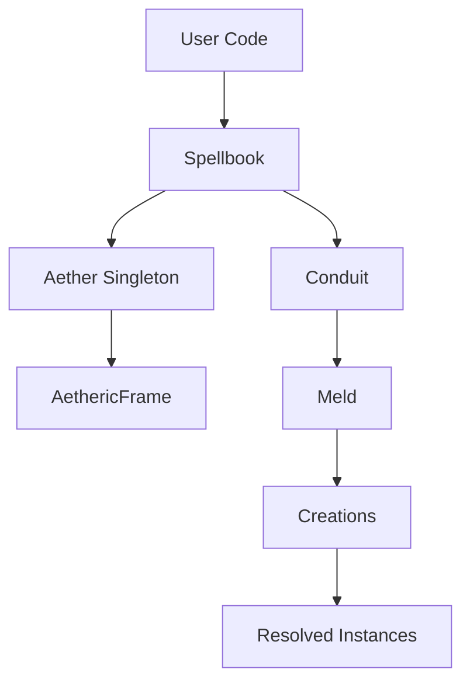
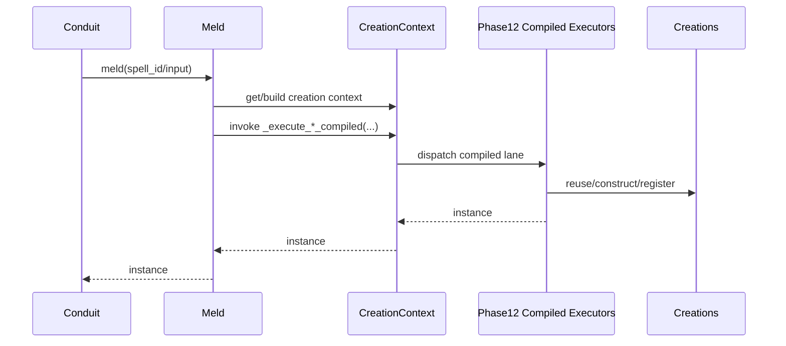
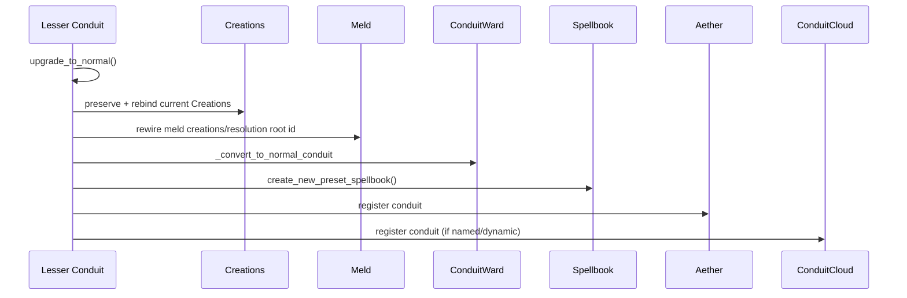

# Src Architecture (C4)

## Metadata
- Doc ID: ARCH-SRC-2026-01-17
- Status: in_progress
- Owner:
- Created: 2026-01-17
- Updated: 2026-02-14

## Table of Contents
- Metadata
- Scope and Intent
- Documentation Quality Standard
- DO NOT ASSUME / Unknowns Gate
- Unknowns
- Source Coverage and Evidence
- Glossary and Core Terms
- System Context (C4)
- System Boundary and External Interfaces
- Architecture Summary (C4)
- Entrypoints and Runtime Guardrails
- Boot and Configuration Sequence
- Spellbook Root Responsibilities
- Aether Global Singleton Responsibilities
- Aetheric Frame Responsibilities
- Conduit Lifecycle (Normal and Lesser)
- Binding and Registration Pipeline
- Resolution Styles and DI Shapes
- DI Resolution Contract (Spec)
- SpellCrafter and Validation Pipeline
- Resolution and Meld Pipeline
- Contracts, Policies, and Permissions
- Existence and Scoping Model
- Logging and Observability
- Ownership, Lifecycle, and Cleanup
- Operational Invariants
- Failure Modes and Error Paths
- Extension Points
- Data Flows and Sequences
- C3 and C2 Cross-Reference
- C1 Code Map (Core Only)
- Diagrams
- Information Sources
- Open Questions
- Context / Handoff Summary
- Appendix A: Deep Component Narratives (Core)
- Appendix B: Detailed Sequences and Data Flows
- Appendix C: Core File Inventory (Expanded)

## Scope and Intent
This document describes the Melder core architecture at the C4 level for
`src/melder`. It focuses on system boundaries, runtime entrypoints,
boot/configuration sequencing, and execution lifecycle for dependency
resolution and cleanup. It is intended to stand on its own after context
compaction.
Melder is framed here as a Dependency Graph Runtime (DGR) with DI-style
binding and resolution as a subset capability.

In scope (core runtime):
- Spellbook binding and conjure pipeline.
- Aether global singleton and per-frame state.
- Conduit runtime (normal and lesser), contracts, and policies.
- SpellCrafter phases and validation pipeline.
- Meld resolution runtime and Creations lifecycle manager.
- Control-plane state (SpellSystemStates, change control, incidents).
- Logging and cleanup contracts.

Out of scope:
- Tests and examples.
- JSON sidecar metadata files (`__*.json`).
- External docs beyond the codebase.

## Documentation Quality Standard
This document is durable context and must stand on its own.

Rules:
- No handwaving. Every claim is grounded in source evidence or marked as unknown.
- Entry points and boot sequences are explicit and ordered.
- Ownership, lifecycle, and cleanup ordering are explicit for core components.
- Invariants, failure modes, and concurrency constraints are stated.
- ASCII and Mermaid diagrams included for core flows.
- Evidence list updated when new sources are used.

## DO NOT ASSUME / Unknowns Gate
Rule: No Unverified Claims.
Any statement that is not directly supported by evidence must be treated as UNKNOWN.

Evidence means at least one of:
- A specific source file reference (preferred: file + symbol/method/class name).
- A citation to an explicit, already-verified artifact (e.g., a prior approved doc section).

If not evidenced => UNKNOWN.

UNKNOWN items must be explicitly labeled UNKNOWN (or added to the Unknowns section).
UNKNOWN items must be investigated by reading the relevant source(s).
If investigation cannot be completed (missing source access, ambiguity, or time),
the item must remain UNKNOWN and must not be promoted to fact.

No reasonable assumptions.
Do not infer behavior from naming, patterns, conventions, or typical frameworks.
Only the code/docs count.

When unsure:
- Mark it UNKNOWN.
- Identify the most likely evidence target (file + symbol).
- Investigate, then update the doc (or leave it UNKNOWN).

## Unknowns
This section is a living list of claims currently not backed by evidence.
Each item must include:
- What is unknown.
- Why it matters (impact).
- Where to investigate (file(s) + symbol(s)).
- Current status (uninvestigated / investigating / blocked).

- UNKNOWN: Producer call sites for advanced state flags
  `SpellState.contract_violation`, `SpellState.mutation_candidate`,
  `SpellState.mutation_quarantined`, and `SpellState.mutation_failed` are not
  verified in runtime code.
  Why it matters: These flags/reasons exist in DevOps state enums and are used
  for diagnostics/governance, but missing producers make state semantics
  ambiguous during incidents and mutation rollout.
  Clarification: SpellContract/MutationContract behavior is no longer unknown.
  SpellContract contract-unvalidated paths are evidenced in
  `src/melder/spellbook/spell_crafter/validation/strategies/contract_provider_presence_strategy.py`,
  `src/melder/spellbook/spell_crafter/spell_crafter.py`,
  `src/melder/aether/dev_ops/spell_system_states/spell_system_states.py`,
  `src/melder/aether/dev_ops/change_control_manager/change_control_manager.py`,
  `src/melder/aether/conduit/conduit_ward/conduit_ward.py`, and
  `src/melder/aether/conduit/meld/meld.py`.
  MutationContract handling is currently explicit Phase 4 blocking
  (`MUTATION_CONTRACT_DISABLED`) with mutation overlay change-reason wiring in
  `src/melder/spellbook/spell.py`.
  Where to investigate:
  `src/melder/aether/dev_ops/spell_system_states/spell_system_states.py`,
  `src/melder/aether/dev_ops/spell_system_states/spell_system_state.py`,
  `src/melder/spellbook/mutations/research/research.py`
  (`promote_spell_version`), and mutation node hooks in
  `src/melder/spellbook/mutations/research/*/node/*_mutation_node.py`.
  Current status: blocked (mutation systems partially on hold; follow-up stories:
  `STORY-2026-02-13-spellstate-advanced-flag-producers`,
  `STORY-2026-02-13-mutation-research-runtime-wiring`).

## Source Coverage and Evidence
Coverage summary (non-exhaustive):
- Package entrypoint and guardrails: `__init__.py`, `__melder_registration_guard__.py`.
- Spellbook + binding pipeline: `spellbook.py`, `bind.py`, `spell.py`, `spell_index.py`.
- Configuration and system state: `configuration.py`, `system_state.py`.
- SpellCrafter and validation: `spell_crafter.py`, `validation_system.py`,
  `spell_system_validation_system.py`.
- Resolution styles and DI descriptors: `spell_types.py`, `existence.py`,
  `parameter_di_shape.py`, `spell_map.py`, `spell_contract.py`, `mutation_contract.py`,
  `resolution_style_matrix.py`.
- Validation strategies: `circular_dependency_strategy.py`,
  `binding_resolution_cycle_strategy.py`, `cycle_detection_strategy.py`,
  `contract_graph_cycle_strategy.py`.
- Aether and frames: `aether.py`, `aetheric_frame.py`.
- Conduit runtime and contracts: `conduit.py`, `conduit_ward.py`, `policies.py`,
  `permissions.py`.
- Resolution runtime: `meld.py`, `creation_context.py`, `creations.py`, `creation.py`.
- Meld executor compilation/runtime: `phase12_no_overrides_executor.py`,
  `phase12_overrides_executor.py`, `resolution_frame.py`.
- Control plane: `spell_system_states.py`, `spell_system_state.py`,
  `spell_state.py`, `spell_state_change_reason.py`,
  `change_control_manager.py`, `dev_ops_manager.py`.
- Ownership transfer: `transfer_of_ownership.py`.
- Utilities: `cleanable.py`, `phase_scheduler.py`, `safe_logger.py`, `id_builder.py`.

Evidence list (non-exhaustive):
- `src/melder/__init__.py`
- `src/melder/__melder_registration_guard__.py`
- `src/melder/spellbook/spellbook.py:L45-L75,L2342-L2480,L2909-L3008`
- `src/melder/spellbook/spellbinder.py`
- `src/melder/spellbook/bind/bind.py`
- `src/melder/spellbook/bind/spell_index.py`
- `src/melder/spellbook/spell.py:L1010-L1187`
- `src/melder/spellbook/existence/existence.py`
- `src/melder/spellbook/spell_types/spell_types.py`
- `src/melder/spellbook/spell_crafter/spell_examiner/spell_requirements_finder/parameter_di_shape.py`
- `src/melder/spellbook/configuration/configuration.py`
- `src/melder/spellbook/configuration/system_state.py`
- `src/melder/spellbook/spell_crafter/spell_crafter.py:L131-L2383`
- `src/melder/spellbook/spell_crafter/validation/validation_system.py`
- `src/melder/spellbook/spell_crafter/validation/strategies/circular_dependency_strategy.py`
- `src/melder/spellbook/spell_crafter/validation/strategies/binding_resolution_cycle_strategy.py`
- `src/melder/spellbook/spell_crafter/validation/strategies/contract_provider_presence_strategy.py`
- `src/melder/spellbook/spell_crafter/system/spell_system_validation_system.py`
- `src/melder/spellbook/spell_crafter/system/validation/cycle_detection_strategy.py`
- `src/melder/spellbook/spell_crafter/system/validation/contract_graph_cycle_strategy.py`
- `src/melder/spellbook/mutations/mutation_research.py`
- `src/melder/aether/aether.py`
- `src/melder/aether/aetheric_frame.py`
- `src/melder/aether/conduit/conduit.py`
- `src/melder/aether/conduit/conduit_cluster.py`
- `src/melder/aether/conduit_cloud.py`
- `src/melder/aether/conduit/meld/meld.py:L220-L499`
- `src/melder/aether/conduit/meld/creation_context/creation_context.py:L109-L814`
- `src/melder/spellbook/spell_crafter/blueprints/phase12_no_overrides_executor.py`
- `src/melder/spellbook/spell_crafter/blueprints/phase12_overrides_executor.py`
- `src/melder/utilities/custom_exceptions/meld_execution_error.py:L4-L96`
- `src/melder/utilities/custom_exceptions/spellbook_validation_error.py:L1-L233`
- `src/melder/spellbook/spell_crafter/dag/resolution_frame/resolution_frame.py`
- `src/melder/aether/conduit/meld/contracts/spell_map.py`
- `src/melder/aether/conduit/meld/contracts/spell_contract.py`
- `src/melder/aether/conduit/meld/contracts/mutation_contract.py`
- `src/melder/aether/conduit/creations/creations.py`
- `src/melder/aether/conduit/creations/creation.py`
- `src/melder/aether/conduit/spell_space/spell_space.py`
- `src/melder/aether/conduit/conduit_ward/conduit_ward.py`
- `src/melder/aether/conduit/conduit_ward/transfer/transfer_of_ownership.py`
- `src/melder/aether/conduit/conduit_ward/policies/policies.py`
- `src/melder/aether/conduit/conduit_ward/permissions/permissions.py`
- `src/melder/aether/dev_ops/dev_ops_manager.py`
- `src/melder/aether/dev_ops/spell_system_states/spell_system_states.py`
- `src/melder/aether/dev_ops/spell_system_states/spell_system_state.py`
- `src/melder/aether/dev_ops/change_control_manager/change_control_manager.py`
- `src/melder/utilities/general_base/cleanable.py`
- `src/melder/utilities/helpers/id_builder.py`
- `src/melder/utilities/helpers/init_helpers.py`
- `src/melder/utilities/synchronization/phase_scheduler.py`
- `src/melder/utilities/logger/safe_logger.py`

## Glossary and Core Terms
- Aether: Global singleton that owns AethericFrames and global registries.
- AethericFrame: Per-frame container for conduits, registries, and dev-ops state.
- Dependency Graph Runtime (DGR): Runtime that builds and executes dependency
  graphs at resolution time, supports late binding via contracts/links, and
  enforces runtime validation gates before activation.
- Spellbook: User-facing binding and conjure surface for the DGR.
- Spell: Bound object metadata (spellframe, spell_id, existence, permissions).
- SpellIndex: Stable lineage key (ULID) with mutable version pointer.
- Conduit: Runtime scope and activation host for resolving spells via Meld.
- ConduitWard: Relationship manager for contracts, policies, and lineage links.
- Creations: Instance registry for a conduit; enforces existence semantics.
- SpellSpace: Scoped handle for unique_per_spell_space instances.
- SpellCrafter: Per-spell pipeline for requirements, graph, frame, validation.
- SpellSystemStates: Per-frame control plane for lineage topology and validity.
- ChangeControlManager: DevOps tracker for dirty roots and pending changes.
- Policies: Conduit link/visibility rules used in dynamic mode.
- Permissions: Spell access levels across conduits (read/create/block).
- SpellMap: Declarative DI placeholder for explicit spell/frame/binding targets.
- SpellContract: Late-bound contract socket for dynamic linking across conduits.
- MutationContract: Mutation socket descriptor with optional late-binding.
- ParameterDIShape: Phase 1 classification of how a parameter should resolve.

## System Context (C4)
Melder is a Dependency Graph Runtime embedded into user systems. User code
binds classes/functions/instances into a Spellbook, then conjures Conduits to
resolve instances via Meld. DI-style binding and resolution are a subset of
the runtime behavior. Dependencies include:
- Python runtime (warns if < 3.13 or if GIL is enabled).
- `ulid` for unique identifiers.
- Logging via SafeLogger (stdlib or channel logger).

## System Boundary and External Interfaces
External interfaces are Python APIs:
- `Spellbook.bind(...)` and `SpellBinder` fluent binding helpers.
- `Spellbook.conjure(...)` for building a root Conduit.
- `Conduit.meld(...)` for resolving instances.
- `Conduit.create_lesser_conduit(...)` for child scopes.
- `Conduit.link(...)` / `Conduit.sever_link(...)` for dynamic linking.
- `Configuration` properties and hooks.

External IO:
- Logging adapters (SafeLogger wraps stdlib or channel loggers).
- User-provided callables bound as spells.

## Architecture Summary (C4)
Melder runtime flow is layered:
1) Global state (Aether) owns per-frame registries and control-plane state.
2) Spellbooks bind spells, run structural/resolution phases, and conjure Conduits.
3) Conduits resolve spells via Meld and manage object lifecycles via Creations.

Spell registration uses Bind to reflect objects into SpellIndex + Spell.
SpellCrafter and PhaseScheduler run phases before Conduit creation.
ConduitWard and contracts govern cross-conduit sharing.
SpellSystemStates and ChangeControl track structural/resolution validity and dirty roots
used by Meld to gate execution and trigger revalidation.

## Entrypoints and Runtime Guardrails
- `melder/__init__.py` warns on Python < 3.13 and on GIL-enabled builds
  via `_detect_nogil_mode()`.
- `MelderRegistrationGuard` provides a sentinel to tag internal objects
  and block their registration as spells.
- `__melder_registration_guard__` is instantiated at import time and
  referenced by internal classes via `__melder_internal__`.

## Boot and Configuration Sequence
1) User constructs a `Spellbook`.
2) `Spellbook.__init__`:
   - Ensures the Aether frame exists (`Aether._ensure_frame`).
   - Initializes Configuration:
     - If Aether already has a config for the frame, adopts it.
     - If a config is provided and does not match frame, raises.
     - Otherwise creates a Configuration and loads defaults.
   - Initializes logging (SafeLogger, optional logger factory).
   - Initializes spell registries and SpellValidationSystem.
   - Pulls SpellSystemStates from the frame.
3) `Spellbook.conjure(...)`:
   - Validates and freezes Configuration.
   - Binds Configuration into Aether for the frame.
   - Runs phases 1-4 (requirements, symbolic graph, local frame, validation).
   - Runs foundational conduit phases 5-7 (root blueprints, system validation, change control).
   - Runs conduit plan phases 8-11 (occurrence, injection, patch maps, execution plan) when foundational phases report no resolution errors.
   - Constructs a normal Conduit and registers it in Aether.
   - Fires pre/activated/post hooks and wires ownership into spells.

## Spellbook Root Responsibilities
- Owns local spell registries and lookup maps.
- Maintains owned and contracted spell_id maps for O(1) resolution by current id.
- Binds spells using `Bind` and tracks version identifiers.
- Interfaces with Aether for shared configuration and spell registry updates.
- Runs SpellCrafter phases and validation before Conduit creation.
- Conjures a single Conduit per Spellbook instance.
- Provides a `SpellBinder` fluent adapter for binding.

## Aether Global Singleton Responsibilities
- Singleton root for all AethericFrames.
- Owns the default frame and a map of named frames.
- Maintains spell registries per conduit and version registries per frame.
- Binds Configuration to frames.
- Registers conduits and spell indices.
- Exposes ConduitCloud and ConduitCluster access via frame.

## Aetheric Frame Responsibilities
Each frame owns:
- Conduits (root conduits mapped by id).
- Spell registry per conduit and aggregated version registry.
- Conduit clusters for auto-sharing roots.
- ConduitCloud for dynamic named lookup.
- MutationResearch hub for lineage mutation sessions.
- SpellSystemStates registry and DevOpsManager.
- Configuration attached during Spellbook conjure.
- DevOpsManager is constructed per frame and owns ChangeControlManager + RiskManager for that frame. EVIDENCE: src/melder/aether/aetheric_frame.py:__init__ + src/melder/aether/dev_ops/dev_ops_manager.py:__init__.
- SpellSystemStates stores per-conduit resolution state keyed by conduit_id in addition to frame-wide structural state. EVIDENCE: src/melder/aether/dev_ops/spell_system_states/spell_system_states.py:__init__ + get_or_create_conduit_resolution_state.

## Conduit Lifecycle (Normal and Lesser)
Normal Conduits:
- Created by `Spellbook.conjure` with policy and mode.
- Register themselves and their spell indices in Aether.
- Own Creations, Meld runtime, and ConduitWard.
- Optionally register into ConduitCloud if dynamic and named.

Lesser Conduits:
- Created by `Conduit.create_lesser_conduit`.
- Inherit Spellbook and Configuration.
- Use `Creations` (same manager class as normal conduits); lesser behavior is driven by conduit state and root-lineage ids.
- Are linked into the parent's ConduitWard lineage tree.

Upgrades:
- `Conduit.upgrade_to_normal` converts a lesser conduit to normal in dynamic mode:
  transfers creations, rewires Meld, converts ward state, seeds resolution state,
  and registers into Aether/ConduitCloud.

## Binding and Registration Pipeline
Binding flow (local spell):
1) `Spellbook.bind` converts permissions and existence enums.
2) `Bind._bind_logic`:
   - Rejects modules and Protocols as concrete spells.
   - Uses SpellExaminer to build a binding profile.
   - Fingerprints the profile and constructs a SpellIndex.
   - Creates a Spell with metadata (existence, permissions, spellframe).
3) Spellbook attaches hooks and registers the spell into local maps.
4) SpellSystemStates registers the lineage and marks it dirty.
5) If a Conduit exists, ownership metadata is stamped and existing objects
   are registered into Creations.
6) If a Conduit exists, Spellbook registers the new SpellIndex in Aether for
   conduit-scoped version lookups.

## Resolution Styles and DI Shapes
Melder resolution behavior is composed from binding style, lifetime scope,
and per-parameter DI shapes.

Canonical matrix artifact:
- `src/melder/spellbook/resolution_style_matrix.py` is the owner-maintained
  source of truth for SpellType x Existence support policy.
- `ResolutionStyleMatrix.BINDING_FAMILY_POLICY` is canonical.
- `ResolutionStyleMatrix.MATRIX_BY_SPELL_TYPE` is an expanded projection from
  family policy, not an independent policy table.

Binding styles (SpellType = 14):
- Class-based spells: `SPELL`, `SPELL_WITH_SPELLFRAME`,
  `SPELL_WITH_BINDING_NAME`, `SPELL_WITH_BINDING_NAME_WITH_SPELLFRAME`.
- Method/function spells: `METHOD`, `METHOD_WITH_BINDING_NAME`,
  `METHOD_WITH_SPELLFRAME`, `METHOD_WITH_BINDING_NAME_WITH_SPELLFRAME`.
- Lambda methods: `LAMBDA_METHOD_WITH_BINDING_NAME`,
  `LAMBDA_METHOD_WITH_SPELLFRAME`,
  `LAMBDA_METHOD_WITH_BINDING_NAME_WITH_SPELLFRAME`.
- Existing creations: `EXISTING_CREATION`, `EXISTING_CREATION_WITH_SPELLFRAME`,
  `EXISTING_CREATION_WITH_BINDING_NAME_WITH_SPELLFRAME`.

Lifetime scopes (Existence = 6):
- `unique`, `unique_per_conduit`, `many`, `unique_per_conduit_cluster`,
  `unique_per_conduit_lineage`, `unique_per_spell_space`.

Constraints:
- Method/lambda spells must use `Existence.unique` (enforced in `Bind`).

Parameter DI shapes (Phase 1, `ParameterDIShape`):
- `IGNORE`, `PLAIN`, `SINGLE_BY_ANNOTATION`, `COLLECTION_BY_ANNOTATION`,
  `SPELLMAP_DEFAULT`, `SPELL_CONTRACT`, `MUTATION_CONTRACT`.

Declarative DI descriptors:
- `SpellMap` supports four explicit shapes:
  1) `SpellMap(MyService)` (concrete-type key).
  2) `SpellMap(ILogic)` (frame-type key).
  3) `SpellMap(MyService, spellframe=ILogic, binding_name="primary")`.
  4) `SpellMap(spell=None, spellframe=ILogic, binding_name="primary")`.
- `SpellContract` declares late-bound contract sockets for dynamic mode;
  linking conduits later supplies providers.
- `MutationContract` exposes early/late binding metadata via `late_binding`,
  but current Phase 4 validation blocks active use with
  `MUTATION_CONTRACT_DISABLED` while mutation systems are on hold.

## DI Resolution Contract (Spec)
This section records the approved DI resolution contract (19-item spec) for
Melder. It is the reference for `Conduit.meld`, `Meld.meld`, `SpellInputUtils`,
`SpellMap` semantics, and SpellCrafter resolution behavior. Where the spec
and current implementation differ, the gap is called out explicitly.

Spec overview (Sections A–H):
- Root meld entry modes:
  - By spell_id (string) and by spell object (class/function).
  - By Protocol/frame type and by binding_name for disambiguation.
  - Root-level `spell_override` payload (dict/list/tuple).
  - By SpellName string (logical name) using a `(frame_key, bind_key)` index.
- Constructor DI shapes:
  - Type-hint DI by concrete class and Protocol frame.
  - SpellMap defaults and SpellMap frame-only mode.
  - Explicit method/lambda injection only via SpellMap or root meld.
  - Existing instance spells resolved by frame type.
- Collection DI:
  - `list[FrameType]` returns all implementations in registration order.
  - No separate IIndex-like DI concept.
- SpellMap semantics:
  - SpellMap mirrors type-hint DI but allows explicit spellframe/binding.
  - Override payloads are passed directly as positional/keyword overrides.
- Spell eligibility and uniqueness:
  - Classes, callables, and existing objects are valid spell targets.
  - Existing-object spells must bind as `Existence.unique`.
  - Single DI requires exactly one provider for a frame/key; ambiguity is a
    build-time error with guidance to SpellMap or list DI.
- Deep scan:
  - Post-init SpellMap resolution is not planned; no deep scan pass is implemented.
- Existence vs resolution:
  - Resolution decides the spell id; Existence controls lifecycle/reuse.
- Spellframe types:
  - Protocols/interfaces for contract DI; strings for grouping categories.

Spec vs implementation notes:
- Spec cites 19 items but includes Sections G/H labeled Items 20–21; treat
  numbering as advisory and follow the content as authoritative.
- Decision: Post-init SpellMap deep scan is not planned; users should express
  dependencies via constructor DI (SpellMap defaults/type hints).
- Decision: Conduit.meld public contract supports spell_id, spell object,
  spellframe, and spell_name; docstrings updated to reflect this multi-entry API.
- Implementation: Phase 4 `DuplicateSpellNameStrategy` scans local + contracted
  spells by `spell_name` and raises `DUPLICATE_SPELL_NAME` errors to prevent
  name-based resolution ambiguity.
- Implementation: MutationContract sockets are blocked in Phase 4 with
  `MUTATION_CONTRACT_DISABLED` while mutation systems are on hold.

## SpellCrafter and Validation Pipeline
Phases 1-4 are structural and run before Conduit creation:
- Phase 1: Requirements extraction.
- Phase 2: Symbolic graph build.
- Phase 3: Local frame creation and dependency graph assembly.
- Phase 4: Validation via SpellValidationSystem strategies.

Dirty terminology guardrail for this pipeline:
- `SpellCrafter._phase8_11_codegen_ir_dirty` is a local IR-freshness bit
  ("phase8_11 export payload is stale"), not a runtime validity gate.
- This bit is set by phase8/9/10/11 artifact replacement and flushed by
  `_capture_phase8_11_codegen_ir_if_dirty()` before Phase 12 compile and on
  `codegen_ir` reads.
- Change-control dirty roots remain a separate system:
  `ChangeControlManager.is_root_dirty(conduit_id, root_id)` is the meld gate
  checked by `Meld._gated_validation_required(...)`.
- EVIDENCE:
  - `src/melder/spellbook/spell_crafter/spell_crafter.py:529-546`
  - `src/melder/spellbook/spell_crafter/spell_crafter.py:1966-1997`
  - `src/melder/spellbook/spell_crafter/spell_crafter.py:3513-3517`
  - `src/melder/spellbook/spell_crafter/spell_crafter.py:3579-3583`
  - `src/melder/spellbook/spell_crafter/spell_crafter.py:3647-3651`
  - `src/melder/spellbook/spell_crafter/spell_crafter.py:3780-3787`
  - `src/melder/aether/dev_ops/change_control_manager/change_control_manager.py:1403-1475`
  - `src/melder/aether/conduit/meld/meld.py:502-532`

PhaseScheduler coordinates these phases using worker threads and a shared
cancellation event; broken spells trigger SpellbookValidationError.

Phase 4 strategy coverage (non-exhaustive):
- Circular/self-dependency detection and dangling dependency checks.
- Resolution frame presence and duplicate spell name detection.
- Annotation/SpellMap shape validation and parameter policy enforcement.
- Contract provider presence checks (warnings in dynamic/late-binding cases).
- Binding-resolution cycle detection and callable profile hygiene.
- Existing-creation compatibility checks.

## Resolution and Meld Pipeline
Phases 5-11 are conduit-scoped and run after Phase 1-4:
- Phase 5: Root blueprint generation (root-only map for system validation plus
  per-spell blueprints for constructed spells).
- Phase 6: System validation via SpellSystemValidationSystem.
- Phase 7: Change control integration and cleanup of phase artifacts.
- Phase 8: Occurrence plan compilation for spells with attached blueprints.
- Phase 9: Injection plan compilation for spells with attached blueprints.
- Phase 10: Patch map compilation for spells with attached blueprints.
- Phase 11: Execution plan compilation for spells with attached blueprints.

Existing-creation spells bypass Phase 8-11 compilation because they already
have instances and do not require execution plans.

Meld runtime flow:
- Conduit delegates `meld(...)` to `Meld` and fires pre/post resolve hooks.
- Meld resolves the target Spell and chooses reuse vs instantiate based on Existence.
- Meld enforces structural/resolution validity and change-control gates before execution.
- CreationContext dispatches the compiled Phase 12 executor path:
  - no-overrides executor for plain meld calls,
  - override specialization executor for override/mutation paths.
- Phase 12 emitted executors perform reuse/construct/register directly against
  Creations per Existence rules.

Lazy validation at meld time:
- `Meld._ensure_lineage_resolvable` re-runs structural phases (1-4) when
  SpellSystemState validity is UNKNOWN or GATED, under the per-spell lock.
- If per-conduit resolution validity is UNKNOWN or GATED, it runs phases 5-11
  via `spell._spellbook._run_resolution_phases_for_target_spell(...)`.

## Contracts, Policies, and Permissions
- ConduitWard manages contracts between conduits and lineage links.
- Policies gate link behavior (default, whitelist_all, block_all, inbound_only, outbound_only).
- Permissions on each Spell (read/create/block) govern access by borrowers.
- ConduitCluster can auto-share root spell lineages among members. Sharing uses
  a cluster-scoped `root_spell_id` (`cluster:{name}:{owner_id}:{spell_id}`) so
  cluster teardown removes only cluster-created contracts, and defaults
  permissions to `spell.permissions` (fallback "create") with optional dependency
  linking.
- MutationContract usage is blocked by Phase 4 validation
  (`MUTATION_CONTRACT_DISABLED`) while mutation systems are on hold.
- Conduit link/sever operations fire `on_conduit_post_link` and
  `on_conduit_post_unlink` hooks when configured.
- `SpellContract` declares late-bound sockets in dynamic mode; conduit linking
  supplies providers and triggers revalidation (Phases 5-11).
- `MutationContract` descriptors remain defined but are currently blocked by
  Phase 4 validation (`MUTATION_CONTRACT_DISABLED`).
- Contract provider presence uses warnings for missing SpellContract providers;
  automatic-mode SpellContract sockets are errors. MutationContract sockets are
  blocked while mutation systems are on hold.
- Ownership transfer (`Conduit.transfer_spell_ownership`) migrates spell
  stewardship between conduits in dynamic mode, with optional creation moves,
  contract/cluster unsharing, and change-control gating.

## Existence and Scoping Model
Existence defines instance lifetimes:
- unique: per AethericFrame singleton.
- unique_per_conduit: per Conduit instance.
- many: new instance per meld.
- unique_per_conduit_cluster: registered via `Creations.add_creation` keyed by
  spell_id and shared across conduits via ConduitCluster contracts.
- unique_per_conduit_lineage: shared across lineage tree.
- unique_per_spell_space: scoped to a SpellSpace.

Creations manages instance storage and disposal for both normal and lesser conduits.
SpellSpace enforces active-scope semantics and supports reset/versioning.

## Logging and Observability
- SafeLogger wraps stdlib or channel loggers and is used across components.
- Spellbook upgrades Aether logger if configuration provides a factory.
- Conduit uses configuration to set dynamic/debug flags and logger.
- Cleanup and teardown use best-effort logging to avoid cascading failures.

## Ownership, Lifecycle, and Cleanup
- Cleanable defines the idempotent cleanup contract.
- Spellbook cleanup:
  - Cleans spells and SpellIndex keys.
  - Cleans configuration and validators.
  - Nulls references and cleans logger last.
- Conduit cleanup:
  - Fires hooks, tears down Meld, ConduitWard, and Creations.
  - Clears hooks and logger last.
- Aether cleanup:
  - Cleans frames, resets singleton state, and cleans logger.
- Creations cleanup:
  - Calls configured disposal methods; may raise ExceptionGroup.

## Operational Invariants
- Aether is a singleton with explicit reset for tests.
- Spellbook can conjure only one Conduit instance.
- Configuration must be frozen before Conduit creation.
- Existing-object spells must use `Existence.unique` for Creations registration.
- SpellIndex identity (ULID) is immutable; version pointer can change.
- `automatic=True` conjure only allows `Policies.default`.
- `automatic=False` conjure requires `system_state=dynamic`.
- SpellSpace can only meld when it is the active spellspace for a Conduit.
- Linking/severing conduits is only allowed in dynamic mode.
- Method/lambda spells must use `Existence.unique`.
- Ownership transfer is only allowed in dynamic mode.

## Failure Modes and Error Paths
- Duplicate binding keys or spell id collisions raise RuntimeError.
- Conjure raises SpellbookValidationError when broken spells exist.
- Meld raises SpellbookValidationError when spell validity is invalid/gated/disabled.
- ChangeControl blocks roots marked dirty for the active conduit (`is_root_dirty(conduit_id, root_id)`).
- SpellSpaceScopeError if a non-active SpellSpace is used for meld.
- Cleanup errors are logged; Creations may raise ExceptionGroup.
- Linking or severing in automatic mode raises RuntimeError.
- upgrade_to_normal raises RuntimeError when called in non-dynamic mode.
- SpellMap defaults that resolve to zero or multiple candidates raise RuntimeError.
- SpellContract/MutationContract require at least `spell` or `spellframe` (ValueError).
- Ownership transfer raises RuntimeError when dynamic mode is disabled.

## Extension Points
- Configuration hooks for conduit lifecycle and meld pipeline.
- Logger factory supplied via Configuration.
- Spellbook binding hooks (pre/activation/post).
- Dynamic Conduit policies and ConduitCluster auto-sharing.
- Validation strategies registered in SpellValidationSystem.

## Data Flows and Sequences
### Sequence: Import to Ready
1. `import melder`:
   - Runtime warnings for Python version and GIL mode.
   - `__melder_registration_guard__` singleton instantiated.

### Sequence: Spellbook Initialization
1. `Spellbook.__init__`:
   - `Aether._ensure_frame(aetheric_frame)`.
   - `_initialize_configuration` (adopt or create Configuration).
   - `_initialize_logging` (SafeLogger and optional factory).
   - Initialize registries, validators, and SpellSystemStates.

### Sequence: Bind Spell
1. `Spellbook.bind(...)`:
   - Enum conversion for permissions and existence.
   - `Bind._bind_logic` produces SpellIndex and Spell.
   - Spellbook registers spell maps and SpellSystemStates lineage.
   - If Conduit exists, stamps ownership and registers existing objects.

### Sequence: Conjure Conduit
1. `Spellbook.conjure(...)`:
   - Validate/freeze Configuration, bind to Aether.
   - Run phases 1-4, then conduit foundational phases 5-7.
   - Run conduit plan phases 8-11 only when foundational resolution has no errors.
   - Construct Conduit and register it with Aether.
   - Fire conjure hooks and wire Conduit into spells.

### Sequence: Meld Resolution
1. `Conduit.meld(...)`:
   - In dynamic mode, enforce CreationGate checks/ticketing; delegate to `Meld.meld(...)`.
2. `Meld.meld(...)`:
   - Resolve spell by id or (spellframe, binding).
   - Enforce structural/resolution validity gates and choose reuse vs instantiate.
3. `CreationContext` compiled execution:
   - Select no-hooks/hooks and no-overrides/overrides lanes.
   - Execute compiled Phase 12 path and return the resolved instance.
4. Creations registration/reuse occurs inside compiled execution per Existence.

### Sequence: Meld-Time Validation Gate
1. `Meld._ensure_lineage_resolvable(...)` checks SpellSystemState validity.
2. If validity is UNKNOWN/GATED:
   - Acquire `spell._lock` and run `spell.run_structural_phases()`.
   - Raise SpellbookValidationError if validity stays invalid/gated.
3. If per-conduit resolution validity is UNKNOWN/GATED:
   - Run `spell._spellbook._run_resolution_phases_for_target_spell(conduit_id, spell)`.
   - Raise SpellbookValidationError if validity stays invalid/gated.

### Sequence: Create Lesser Conduit
1. Parent Conduit fires pre-create hook.
2. Constructs lesser Conduit with same Spellbook/Configuration.
3. Wires root-lineage pointers (`_root_conduit_id`, `_meld._resolution_conduit_id`) and root-conduit ward reference.
4. Links lesser into ConduitWard lineage tree.
5. Fires activated and post-create hooks.

### Sequence: Upgrade Lesser to Normal
1. `Conduit.upgrade_to_normal(name, hooks)` checks dynamic mode and lesser state.
2. Preserves the existing `Creations` manager from the lesser conduit.
3. Rewires Meld/ward state for normal-conduit ownership using the preserved manager.
4. Rebinds lineage gates to the frame-level CreationGateController.
5. Seeds per-conduit resolution state from root conduit (if available).
6. Registers the conduit into Aether and ConduitCloud.
7. Registers per-conduit hooks (optional).

### Sequence: Link and Sever Conduits
1. `Conduit.link(target_conduit)`:
   - Requires dynamic mode and valid target.
   - Delegates to `ConduitWard._link` to establish contract.
   - Fires `on_conduit_post_link` hook on success.
2. `Conduit.sever_link(target_conduit)`:
   - Requires dynamic mode.
   - Delegates to `ConduitWard._sever_link` to remove contract.
   - Fires `on_conduit_post_unlink` hook on success.

### Sequence: Transfer Spell Ownership
1. `Conduit.transfer_spell_ownership(...)` validates dynamic mode.
2. `TransferOfOwnership.preflight()` captures borrowers, deps, creations.
3. `TransferOfOwnership.execute()`:
   - Marks lineage disabled (transfer_in_progress) and flips registries under lock.
   - Moves or tears down creations.
   - Unshares or repoints contracts/clusters.
   - Optionally transfers or dirties dependencies.
   - Marks lineage dirty/gated for revalidation.

### Sequence: Change-Control Revalidation
1. `ChangeControlManager.revalidate_dirty_roots(conduit_id, ...)`:
   - Copies dirty roots for the conduit and calls the registered revalidator outside the lock.
   - On success, clears dirty sets and resets monitor state for that conduit.
2. `Meld._gated_validation_required(...)` checks `is_root_dirty(conduit_id, root_id)` and raises `MeldExecutionError` for dirty roots.

### Sequence: SpellSpace Usage
1. `conduit.enter_spellspace()` creates and activates SpellSpace.
2. `SpellSpace.meld(...)` enforces active scope and delegates to Conduit.
3. `SpellSpace.reset()` clears spellspace-scoped instances and bumps version.

### Sequence: Cleanup
1. `Conduit.cleanup()` fires hooks, tears down Meld/Ward/Creations, logger last.
2. `Spellbook.cleanup()` clears spells, configuration, and validators.
3. `Aether.cleanup()` cleans frames and resets singleton state.

## C3 and C2 Cross-Reference
Detailed C3 and C2 component descriptions are maintained in:
- `context_compass/system_docs/src_components.md`

## C1 Code Map (Core Only)
Package root:
- `src/melder/__init__.py` - runtime warnings, version metadata.
- `src/melder/__melder_registration_guard__.py` - registration guard sentinel.

Spellbook and binding:
- `src/melder/spellbook/spellbook.py` - Spellbook core and conjure pipeline.
- `src/melder/spellbook/spellbinder.py` - fluent binding adapter.
- `src/melder/spellbook/bind/bind.py` - binding pipeline.
- `src/melder/spellbook/bind/spell_index.py` - lineage key with version pointer.
- `src/melder/spellbook/spell.py` - spell metadata and hooks.
- `src/melder/spellbook/existence/existence.py` - existence modes.
- `src/melder/spellbook/spell_types/spell_types.py` - spell type classification.

Configuration and hooks:
- `src/melder/spellbook/configuration/configuration.py` - properties, hooks, freeze.
- `src/melder/spellbook/configuration/system_state.py` - automatic vs dynamic.

SpellCrafter and validation:
- `src/melder/spellbook/spell_crafter/spell_crafter.py` - per-spell phase artifacts.
- `src/melder/spellbook/spell_crafter/validation/validation_system.py` - phase 4 validation.
- `src/melder/spellbook/spell_crafter/system/spell_system_validation_system.py` - phase 6 validation.
- `src/melder/spellbook/spell_crafter/spell_examiner/spell_requirements_finder/parameter_di_shape.py` - DI shape classification.

Aether and frames:
- `src/melder/aether/aether.py` - global singleton and frame registry.
- `src/melder/aether/aetheric_frame.py` - per-frame state and control plane.
- `src/melder/aether/conduit_cloud.py` - dynamic conduit registry.
- `src/melder/aether/conduit/conduit_cluster.py` - cluster auto-sharing.
- `src/melder/spellbook/mutations/mutation_research.py` - mutation research hub.

Conduit runtime:
- `src/melder/aether/conduit/conduit.py` - conduit lifecycle and meld facade.
- `src/melder/aether/conduit/conduit_state/conduit_state.py` - conduit state enum.
- `src/melder/aether/conduit/conduit_ward/conduit_ward.py` - contracts and lineage.
- `src/melder/aether/conduit/conduit_ward/policies/policies.py` - policy enum.
- `src/melder/aether/conduit/conduit_ward/permissions/permissions.py` - permission enum.
- `src/melder/aether/conduit/conduit_ward/transfer/transfer_of_ownership.py` - ownership transfer.

Resolution and creations:
- `src/melder/aether/conduit/meld/meld.py` - meld orchestration.
- `src/melder/aether/conduit/meld/creation_context/creation_context.py` - compiled execution lanes and runtime dispatch.
- `src/melder/aether/conduit/meld/contracts/spell_map.py` - SpellMap descriptor.
- `src/melder/aether/conduit/meld/contracts/spell_contract.py` - SpellContract descriptor.
- `src/melder/aether/conduit/meld/contracts/mutation_contract.py` - MutationContract descriptor.
- `src/melder/aether/conduit/creations/creations.py` - instance registry.
- `src/melder/aether/conduit/creations/creation.py` - creation wrapper + disposal metadata.
- `src/melder/aether/conduit/spell_space/spell_space.py` - spellspace scoping.

Control plane:
- `src/melder/aether/dev_ops/dev_ops_manager.py` - dev-ops hub.
- `src/melder/aether/dev_ops/spell_system_states/spell_system_states.py` - lineage registry.
- `src/melder/aether/dev_ops/spell_system_states/spell_system_state.py` - lineage state.
- `src/melder/aether/dev_ops/spell_system_states/spell_state.py` - lineage flags.
- `src/melder/aether/dev_ops/spell_system_states/spell_state_change_reason.py` - change reasons.
- `src/melder/aether/dev_ops/change_control_manager/change_control_manager.py` - change control.
- `src/melder/aether/dev_ops/risk_manager/risk_manager.py` - risk gating.

Utilities:
- `src/melder/utilities/general_base/cleanable.py` - cleanup contract.
- `src/melder/utilities/synchronization/phase_scheduler.py` - phase orchestration.
- `src/melder/utilities/logger/safe_logger.py` - logger adapter.
- `src/melder/utilities/helpers/id_builder.py` - id generation.
- `src/melder/utilities/helpers/init_helpers.py` - logger resolution.

## Diagrams
### ASCII Context Diagram (C4)
```
[User Code]
    |
    v
[Spellbook] -> [Aether (global)] -> [AethericFrame]
    |
    v
[Conduit] -> [Meld] -> [Creations]
    |
    v
[Resolved Instances]
```

### Mermaid Context Diagram (C4)


### ASCII Conjure Pipeline Diagram
```
[Spellbook.conjure]
  -> validate/freeze config
  -> bind config to Aether
  -> phases 1-4 (structural)
  -> phases 5-7 (foundational resolution)
  -> phases 8-11 (plan resolution, if no errors)
  -> Conduit() + hooks
  -> wire ownership into spells
```

### Mermaid Meld Flow


### Mermaid Conduit Upgrade


## Information Sources
- `README.md`
- `src/melder/__init__.py`
- `src/melder/__melder_registration_guard__.py`
- `src/melder/spellbook/spellbook.py`
- `src/melder/spellbook/spellbinder.py`
- `src/melder/spellbook/bind/bind.py`
- `src/melder/spellbook/bind/spell_index.py`
- `src/melder/spellbook/spell.py`
- `src/melder/spellbook/configuration/configuration.py`
- `src/melder/spellbook/existence/existence.py`
- `src/melder/spellbook/spell_types/spell_types.py`
- `src/melder/spellbook/resolution_style_matrix.py`
- `src/melder/spellbook/spell_crafter/spell_examiner/spell_requirements_finder/parameter_di_shape.py`
- `src/melder/spellbook/spell_crafter/spell_crafter.py`
- `src/melder/spellbook/spell_crafter/validation/validation_system.py`
- `src/melder/spellbook/spell_crafter/validation/strategies/circular_dependency_strategy.py`
- `src/melder/spellbook/spell_crafter/validation/strategies/duplicate_spell_name_strategy.py`
- `src/melder/spellbook/spell_crafter/validation/strategies/binding_resolution_cycle_strategy.py`
- `src/melder/spellbook/spell_crafter/validation/strategies/contract_provider_presence_strategy.py`
- `src/melder/spellbook/spell_crafter/system/spell_system_validation_system.py`
- `src/melder/spellbook/spell_crafter/system/validation/cycle_detection_strategy.py`
- `src/melder/spellbook/spell_crafter/system/validation/contract_graph_cycle_strategy.py`
- `src/melder/aether/aether.py`
- `src/melder/aether/aetheric_frame.py`
- `src/melder/aether/conduit/conduit.py`
- `src/melder/aether/conduit/conduit_cluster.py`
- `src/melder/aether/conduit/creations/creations.py`
- `src/melder/aether/conduit/meld/meld.py`
- `src/melder/aether/conduit/meld/creation_context/creation_context.py`
- `src/melder/spellbook/spell_crafter/blueprints/phase12_no_overrides_executor.py`
- `src/melder/spellbook/spell_crafter/blueprints/phase12_overrides_executor.py`
- `src/melder/aether/conduit/meld/contracts/spell_map.py`
- `src/melder/aether/conduit/meld/contracts/spell_contract.py`
- `src/melder/aether/conduit/meld/contracts/mutation_contract.py`
- `src/melder/spellbook/spell_crafter/dag/resolution_frame/resolution_frame.py`
- `src/melder/aether/conduit/conduit_ward/transfer/transfer_of_ownership.py`
- `src/melder/aether/dev_ops/spell_system_states/spell_system_states.py`
- `src/melder/aether/dev_ops/spell_system_states/spell_system_state.py`
- `src/melder/aether/dev_ops/spell_system_states/spell_state.py`
- `src/melder/aether/dev_ops/spell_system_states/spell_state_change_reason.py`
- `src/melder/aether/dev_ops/dev_ops_manager.py`
- `src/melder/aether/dev_ops/change_control_manager/change_control_manager.py`
- `src/melder/aether/dev_ops/risk_manager/risk_manager.py`

## Open Questions
- SpellContract and MutationContract are now evidenced, not unknown:
  SpellContract sockets are validated in Phase 4 (automatic mode -> error,
  missing provider -> warning), and contract-dependent revalidation is wired by
  `SpellSystemStates.mark_contract_dependents_dirty` callers plus meld-time
  resolution gating. MutationContract sockets are explicitly blocked in Phase 4
  with `MUTATION_CONTRACT_DISABLED`, while mutation overlays still emit
  `mutation_contract_set` / `mutation_contract_cleared` reasons via
  `Spell.apply_mutation_override` / `Spell.clear_mutation_override`.
- Remaining unknown: producer call sites for `SpellState.contract_violation`,
  `SpellState.mutation_candidate`, `SpellState.mutation_quarantined`, and
  `SpellState.mutation_failed` are still not present in current `src/melder`
  callsite sweeps.
  Follow-up stories:
  `STORY-2026-02-13-spellstate-advanced-flag-producers`,
  `STORY-2026-02-13-mutation-research-runtime-wiring`.
  Status: blocked (mutation systems partially on hold).

## Context / Handoff Summary
- Added DevOps scoping notes: DevOpsManager and ChangeControlManager are per-frame, per-conduit resolution state lives in SpellSystemStates, and RiskManager drives per-conduit gating.
- Added resolution-style inventory (SpellType + Existence + DI shapes),
  late-binding contract notes, lazy meld-time validation, and ownership transfer
  sequences with updated evidence.
- Deep scan is explicitly not planned; multi-entry meld contract remains
  documented and docstrings aligned.
- Clarified unique_per_conduit_cluster storage/sharing (owner Creations +
  ConduitCluster contracts) and removed the stale README entrypoint mismatch.
- Documented ConduitCluster cluster-scoped `root_spell_id` usage and default
  permission behavior during auto-sharing.
- Updated SpellContract automatic-mode validation to error and noted no deep
  scan references in `src/melder`.
- Marked MutationContract usage as blocked via Phase 4 validation while mutation
  systems are on hold.
- Reframed Melder as a Dependency Graph Runtime (DGR) and scoped DI-style
  binding/resolution as a subset capability.
- Documented Spellbook cleanup unregistering local lineages from SpellSystemStates. EVIDENCE: src/melder/spellbook/spellbook.py:_cleanup_spells
- Documented SpellSystemStates unregister notifying RiskManager to force validation gating. EVIDENCE: src/melder/aether/dev_ops/spell_system_states/spell_system_states.py:unregister_lineage
- Removed stale `meld_engine` references and updated source/evidence maps to
  Phase 12 generated executor artifacts (`phase12_no_overrides_executor.py`,
  `phase12_overrides_executor.py`) for the codegen-only runtime model.
- Documented optimization-wave runtime updates: meld front-door spell-id
  caching, inline creations-target dispatch in emitted Phase 12 executors, and
  route-matrix benchmark reporting (`warm_root`, `spellspace`, `override_args`,
  `override_targeted`, `mixed`) from
  `benchmarks/testing_other_di/run_codegen_benchmark_deltas.py`.
- Revalidated C4/C3 diagrams for the current codegen runtime: context/flow labels now
  model `Meld -> CreationContext -> compiled execution lanes` and conjure phase gating
  through plan phases 8-11.
- Revalidated Information Sources + Open Questions: replaced stale `meld_runtime.py`
  path with `creation_context.py`, and updated contract/mutation-flag unknowns to reflect
  current `contract_unvalidated` call paths.
- Resolved matrix source-of-truth ambiguity: `ResolutionStyleMatrix` now defines
  canonical family policy (`BINDING_FAMILY_POLICY`) and derived SpellType view
  (`MATRIX_BY_SPELL_TYPE`) with mapping/family drift checks in validation.

# Appendix A: Deep Component Narratives (Core)

## A1. Package Root and Runtime Guardrails
- `melder/__init__.py` sets version metadata and warns on Python < 3.13.
- `_detect_nogil_mode()` uses `sys._is_gil_enabled()` and warns if GIL is enabled.
- `MelderRegistrationGuard` is instantiated at import time.

## A2. MelderRegistrationGuard
- Singleton with a sentinel object used to tag internal classes via
  `__melder_internal__`.
- `assert_allowed` raises InternalRegistrationError if the sentinel is present.

## A3. Spellbook
- Public binding and conjure surface for the DGR.
- Owns spell registries and version caches.
- Runs structural and resolution phases before Conduit creation.
- Binds configuration into Aether and upgrades Aether logging when possible.
- Fires conjure hooks and wires Conduit ownership into spells.

## A4. Aether Singleton
- Singleton root for AethericFrames.
- Registers conduits, spell lineages, and configuration per frame.
- Maintains a version registry by refreshing from SpellIndex sets.

## A5. AethericFrame
- Per-frame container for:
  - Conduits and spell registries.
  - ConduitCloud and ConduitClusters.
  - MutationResearch and SpellSystemStates.
  - DevOpsManager and frame configuration.

## A6. Conduit (Normal and Lesser)
- Normal conduit registers into Aether and owns full Creations.
- Lesser conduits inherit Spellbook/Configuration and also use `Creations`;
  lesser behavior is driven by conduit state + root-lineage id wiring.
- ConduitWard manages contracts and lineage.
- Conduit can spawn lesser conduits, link to peers in dynamic mode, and
  can be upgraded to normal while preserving/rebinding its current Creations manager.

## A7. Bind, Spell, and SpellIndex
- Bind uses SpellExaminer to produce a binding profile and fingerprint.
- SpellIndex provides stable lineage key with mutable version pointer.
- Spell holds spell metadata, hooks, and references to SpellCrafter artifacts.

## A8. SpellCrafter and PhaseScheduler
- SpellCrafter owns per-spell artifacts across phases.
- PhaseScheduler coordinates multi-phase execution with cancellation.
- Broken spells raise SpellbookValidationError and block conjure.

## A9. Meld Runtime
- Meld resolves spells and enforces existence semantics via Creations.
- Validation/change-control gating is enforced in `Meld` before compiled execution.
- CreationContext compiled executor lanes perform actual construction/reuse/registration.

## A10. ConduitWard and Contracts
- ConduitWard owns the contract graph and lineage tree.
- Policies define dynamic linking behavior.
- Contracts update Spellbook contracted spell maps for cross-conduit sharing.

## A11. Creations and SpellSpace
- Creations stores instances by existence category and disposes on cleanup.
- SpellSpace provides a scoped context for unique_per_spell_space.

## A12. DevOps and SpellSystemStates
- SpellSystemStates tracks lineage validity, dependencies, and dirty sets.
- ChangeControlManager tracks pending changes and dirty roots.
- DevOpsManager aggregates incident and change-control tools.
- DevOpsManager and ChangeControlManager are per-frame; ConduitResolutionState is per-conduit via SpellSystemStates._resolution_by_conduit_id. EVIDENCE: src/melder/aether/aetheric_frame.py:__init__ + src/melder/aether/dev_ops/spell_system_states/spell_system_states.py:get_or_create_conduit_resolution_state.
- RiskManager tracks per-conduit risk and toggles Spellbook validation gating based on per-conduit validity changes. EVIDENCE: src/melder/aether/dev_ops/risk_manager/risk_manager.py:register_conduit + on_resolution_validity_change.
- SpellSystemStates.unregister_lineage notifies RiskManager with SpellValidity.cleaned to force validation gating for affected conduits. EVIDENCE: src/melder/aether/dev_ops/spell_system_states/spell_system_states.py:unregister_lineage

## A13. Logging Infrastructure
- SafeLogger wraps stdlib or channel loggers.
- InitHelpers resolve SafeLogger during early initialization.
- Spellbook upgrades Aether logger if configuration provides a factory.

# Appendix B: Detailed Sequences and Data Flows

## B1. Spellbook Initialization
1) `Spellbook.__init__` sets IDs and locks.
2) Ensures Aether frame exists and retrieves or creates Configuration.
3) Initializes SafeLogger using Configuration factory if available.
4) Initializes spell registries and SpellSystemStates.

## B2. Bind Sequence (Local Spell)
1) `Spellbook.bind` converts enums and delegates to `Bind._bind_logic`.
2) Bind validates target type, creates binding profile and SpellIndex.
3) Spellbook registers Spell and lookup keys.
4) SpellSystemStates registers lineage and marks it dirty.

## B3. Conjure Sequence (Normal Conduit)
1) Validate and freeze Configuration.
2) Bind Configuration to Aether frame.
3) Run phases 1-4; abort if any spells are broken.
4) Run phases 5-7 (foundational resolution) scoped to a new conduit id.
5) Run phases 8-11 (plan resolution) only when 5-7 reports no resolution errors.
6) Construct Conduit and register it into Aether.
7) Wire conduit ownership metadata into all spells.

## B4. Meld Sequence (Resolve Instance)
1) Conduit fires pre-resolve hooks and delegates to Meld.
2) Meld resolves spell identity and checks existence reuse rules.
3) Meld enforces structural/resolution validity and change-control gates.
4) Meld resolves/creates Spell-owned CreationContext and dispatches compiled execution lanes (`_execute_*_compiled`) that reuse/construct/register against Creations.
5) Conduit fires post-resolve hooks.

## B5. Meld-Time Validation Gate
1) `Meld._ensure_lineage_resolvable` checks SpellSystemState validity.
2) If validity is UNKNOWN/GATED:
   - `spell.run_structural_phases()` runs under the per-spell lock.
3) If per-conduit resolution validity is UNKNOWN/GATED:
   - `spell._spellbook._run_resolution_phases_for_target_spell(conduit_id, spell)` runs.

## B6. Lesser Conduit Creation
1) Parent Conduit fires pre-create hook.
2) Constructs lesser Conduit with inherited Spellbook/Configuration.
3) Wires root Creations and root conduit into lesser conduit.
4) Links lesser into ConduitWard lineage tree.
5) Fires activated and post-create hooks.

## B7. Upgrade to Normal Conduit
1) `upgrade_to_normal` verifies dynamic mode and lesser state.
2) Preserves/rebinds the current Creations manager to the upgraded conduit state.
3) Rewires Meld to the same Creations manager and converts ward state.
4) Seeds resolution state from former root conduit.
5) Registers conduit into Aether and ConduitCloud.

## B8. Link and Sever Conduits
1) `link(target)` verifies dynamic mode and delegates to ConduitWard.
2) On success, `on_conduit_post_link` hook fires.
3) `sever_link(target)` delegates to ConduitWard, then fires post-unlink hook.

## B9. Transfer Spell Ownership
1) `transfer_spell_ownership` preflights borrowers/deps/creations.
2) Marks lineage disabled (transfer_in_progress), flips registries under lock.
3) Moves/tears down creations and adjusts contracts/clusters.
4) Marks lineage dirty/gated for revalidation.

## B10. Change-Control Revalidation
1) `ChangeControlManager.revalidate_dirty_roots(conduit_id, ...)` calls the conduit revalidator and clears dirty sets for that conduit.
2) `Meld._gated_validation_required` checks `is_root_dirty(conduit_id, root_id)` and raises `MeldExecutionError` to gate execution when a root is dirty. EVIDENCE: src/melder/aether/conduit/meld/meld.py:_gated_validation_required + src/melder/aether/dev_ops/change_control_manager/change_control_manager.py:is_root_dirty.

## B11. Cleanup Sequence (Conduit + Spellbook + Aether)
1) Conduit cleanup fires hooks, tears down Meld/Ward/Creations, logger last.
2) Spellbook cleanup unregisters local lineages from SpellSystemStates, then clears spells, configuration, and validators. EVIDENCE: src/melder/spellbook/spellbook.py:_cleanup_spells
3) Aether cleanup cleans frames and resets singleton state.

# Appendix C: Core File Inventory (Expanded)

## C1. Package Root
- `src/melder/__init__.py`: runtime warnings, version metadata, guard instantiation.
- `src/melder/__melder_registration_guard__.py`: sentinel-based registration guard.

## C2. Spellbook and Binding
- `src/melder/spellbook/spellbook.py`: Spellbook core, conjure pipeline.
- `src/melder/spellbook/spellbinder.py`: fluent binding adapter.
- `src/melder/spellbook/bind/bind.py`: binding pipeline and validation.
- `src/melder/spellbook/bind/spell_index.py`: lineage keys and version tracking.
- `src/melder/spellbook/spell.py`: spell metadata and hooks.

## C3. Configuration and Existence
- `src/melder/spellbook/configuration/configuration.py`: configuration properties and hooks.
- `src/melder/spellbook/configuration/system_state.py`: dynamic vs automatic mode.
- `src/melder/spellbook/existence/existence.py`: lifecycle semantics.

## C4. SpellCrafter and Validation
- `src/melder/spellbook/spell_crafter/spell_crafter.py`: per-spell pipeline.
- `src/melder/spellbook/spell_crafter/validation/validation_system.py`: phase 4 validation.
- `src/melder/spellbook/spell_crafter/system/spell_system_validation_system.py`: system validation.

## C5. Aether and Conduits
- `src/melder/aether/aether.py`: global singleton and frame registry.
- `src/melder/aether/aetheric_frame.py`: per-frame state and dev-ops hubs.
- `src/melder/aether/conduit/conduit.py`: conduit runtime lifecycle.
- `src/melder/aether/conduit_cloud.py`: dynamic conduit registry.
- `src/melder/aether/conduit/conduit_cluster.py`: cluster sharing of spells.
- `src/melder/spellbook/mutations/mutation_research.py`: mutation research hub.

## C6. Resolution Runtime
- `src/melder/aether/conduit/meld/meld.py`: resolution orchestration.
- `src/melder/aether/conduit/meld/creation_context/creation_context.py`: compiled execution lanes and override specialization.
- `src/melder/aether/conduit/creations/creations.py`: instance registry.
- `src/melder/aether/conduit/creations/creation.py`: creation wrapper with disposal metadata.
- `src/melder/aether/conduit/spell_space/spell_space.py`: spellspace scoping.

## C7. Control Plane and Utilities
- `src/melder/aether/dev_ops/dev_ops_manager.py`: dev-ops hub.
- `src/melder/aether/dev_ops/spell_system_states/spell_system_states.py`: lineage state.
- `src/melder/aether/dev_ops/change_control_manager/change_control_manager.py`: change tracking.
- `src/melder/utilities/general_base/cleanable.py`: cleanup contract.
- `src/melder/utilities/synchronization/phase_scheduler.py`: phase orchestration.
- `src/melder/utilities/logger/safe_logger.py`: logging adapter.
- `src/melder/utilities/helpers/id_builder.py`: id generation.