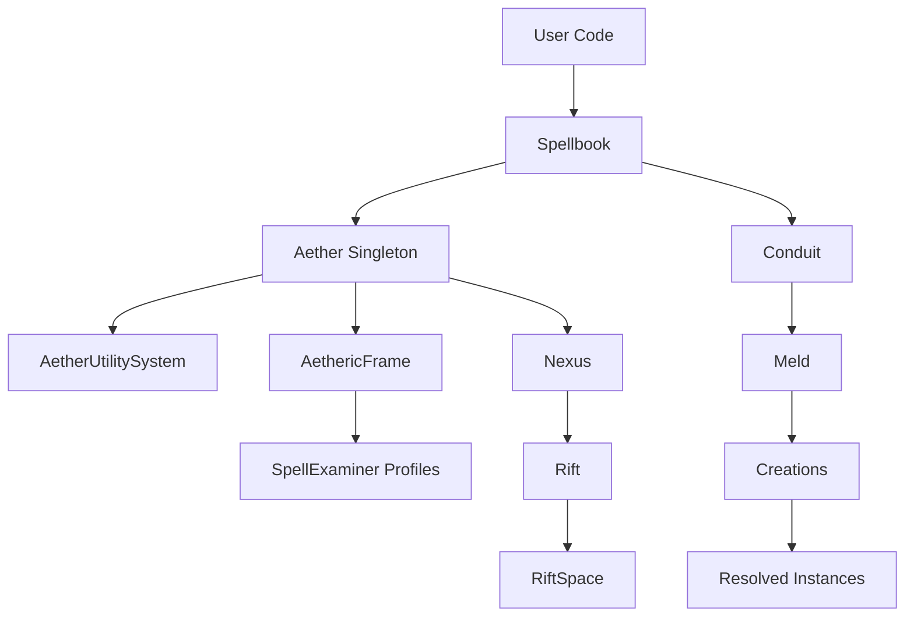
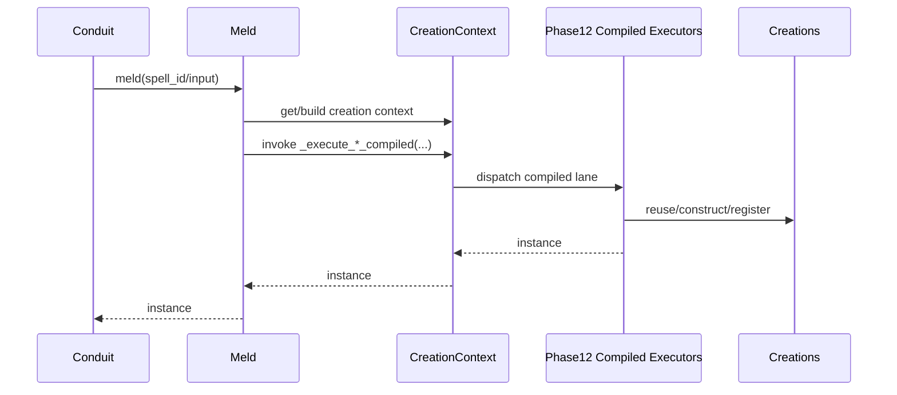
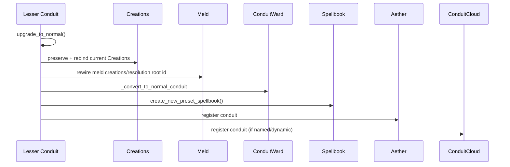

# Src Architecture (C4)

## Metadata
- Doc ID: ARCH-SRC-2026-01-17
- Status: in_progress
- Owner:
- Created: 2026-01-17
- Updated: 2026-08-02

## Scope and Intent
This document describes the Melder core architecture at the C4 level for
`src/melder`. It focuses on system boundaries, runtime entrypoints,
boot/configuration sequencing, and execution lifecycle for dependency
resolution and cleanup. It is intended to stand on its own after context
compaction.
Melder is framed here as a Dependency Graph Runtime (DGR) with DI-style
binding and resolution as a subset capability.

In scope (core runtime):
- Spellbook binding and conjure pipeline.
- Aether global singleton and per-frame state.
- Conduit runtime (normal and lesser), contracts, and policies.
- SpellCompiler phases and validation pipeline.
- Meld resolution runtime and Creations lifecycle manager.
- Control-plane state (SpellSystemStates, change control, incidents).
- Logging and cleanup contracts.

Out of scope:
- Tests and examples.
- JSON sidecar metadata files (`__*.json`).
- External docs beyond the codebase.

## Indexing

This document is AUTHORED. Nothing generates its prose. Its only generated
companion is `src_architecture_index.md`, rebuilt in the SAME pass as any edit:

```bash
python tools/system_documents/index_document.py \
    --doc system_docs/src_architecture.md
```

Consume it by slicing rather than reading this document whole:

```bash
python tools/system_documents/index_document.py \
    --doc system_docs/src_architecture.md --slice "<section name>"
```

### Verifying the `path:line` citations in this document

The index tool checks this document's own structure. It CANNOT check the
`path:line` citations in `EVIDENCE:` blocks, and those rot silently: the file
keeps existing, the citation keeps parsing, and it quietly points at the wrong
code. On 2026-08-02 an audit of the 81 citations across the two source documents
found SEVEN wrong - five pointing into `spell_compiler.py` at lines 1966-3787 of
a 693-line file (it had been decomposed into subpackages and the ranges were
never remapped), and two that were in bounds but landed nowhere near the symbol
they were cited for. Nothing had reported any of it.

Run this after any pass that touches source or citations:

```bash
python - <<'EOF'
import pathlib, re
CITE = re.compile(r"`?([a-z][A-Za-z0-9_/.]*\.py):(\d+)(?:\s*-\s*(\d+))?`?")
# Cited source paths are relative to the SOURCE-TREE root, which is not
# necessarily the directory you run this from. Walk up until `src/` appears, so
# the check works from the documentation root or the repository root.
here = pathlib.Path.cwd().resolve()
root = next((p for p in (here, *here.parents) if (p / "src").is_dir()), here)
docs = next(p for p in (pathlib.Path("system_docs"), pathlib.Path("."))
            if list(p.glob("src_*.md")))
for doc in docs.glob("src_*.md"):
    if doc.name.endswith("_index.md"):
        continue
    for i, line in enumerate(doc.read_text(encoding="utf-8").split("\n"), 1):
        for m in CITE.finditer(line):
            f = root / m.group(1)
            if not f.exists():
                print("MISSING", doc.name, i, m.group(0)); continue
            n = len(f.read_bytes().decode("utf-8", "replace").splitlines())
            s = int(m.group(2)); e = int(m.group(3) or m.group(2))
            if s < 1 or e > n or s > e:
                print("OUT OF BOUNDS", doc.name, i, m.group(0), "file has", n)
EOF
```

In-bounds is necessary, not sufficient. A range can sit inside the file and
still contain none of what it is cited for, which is how two of the seven
survived. For any citation you are relying on, open it and confirm the symbol is
actually there - and when you cite a function, cite its `def` line, because a
range that merely brushes past a definition reads as verified without being it.

Verify before trusting any range:

```bash
python tools/system_documents/index_document.py \
    --doc system_docs/src_architecture.md --check
```

Format rules the index depends on, and which this document obeys:
- exactly one H1 (the document title)
- the navigable unit is H2 `## <Concern>`, at consistent depth
- section names unique and stable - index rows are selected BY NAME
- NO container headings: every H2 here is a selectable concern, so there is no
  wrapper heading to select by mistake

An index records `line_count`, `content_sha256`, and `line_ending`. Insert one
line near the top and every range below it is wrong while the index still parses
and still returns content - the WRONG content, confidently. On mismatch: STOP,
regenerate, never eyeball an offset.

Spec: `agent_onboarding/default/engineer/skills/system_document_build.md`

## DO NOT ASSUME / Unknowns Gate
Rule: No Unverified Claims.
Any statement that is not directly supported by evidence must be treated as UNKNOWN.

Evidence means at least one of:
- A specific source file reference (preferred: file + symbol/method/class name).
- A citation to an explicit, already-verified artifact (e.g., a prior approved doc section).

If not evidenced => UNKNOWN.

UNKNOWN items must be explicitly labeled UNKNOWN (or added to the Unknowns section).
UNKNOWN items must be investigated by reading the relevant source(s).
If investigation cannot be completed (missing source access, ambiguity, or time),
the item must remain UNKNOWN and must not be promoted to fact.

No reasonable assumptions.
Do not infer behavior from naming, patterns, conventions, or typical frameworks.
Only the code/docs count.

When unsure:
- Mark it UNKNOWN.
- Identify the most likely evidence target (file + symbol).
- Investigate, then update the doc (or leave it UNKNOWN).

## Unknowns
This section is a living list of claims currently not backed by evidence.
Each item must include:
- What is unknown.
- Why it matters (impact).
- Where to investigate (file(s) + symbol(s)).
- Current status (uninvestigated / investigating / blocked).

- PERMANENTLY REMOVED. These do not exist in `src/melder` and their absence is
  intentional, so do not treat a failed search for them as a gap:
  `meld/contracts/mutation_contract.py` (`MutationContract`,
  `MUTATION_CONTRACT_DISABLED`); the `structure_profiles` subsystem; the
  `spell_examiner` AI-profile files (live profiles are `binding_profile.py`,
  `general_profile.py`, `detailed_profile.py`, and
  `spell_compiler/profiles/resolution_profile.py`); `rift_event_configuration.py`;
  `phase12_*_executor.py`; `MeldGate` / `MeldGateController` (superseded by
  `utilities/synchronization/creation_gate.py` and `creation_gate_controller.py`);
  `SpellCrafter` (renamed `SpellCompiler`); `Configuration` (renamed
  `SpellbookConfiguration`).
  The 2026-06-12 path/rename sweep that produced this list is COMPLETE. Its
  step-by-step narration was removed as settled history; git carries it.
  WHAT THE RE-VERIFICATION STAMP ACTUALLY COVERS - READ THIS BEFORE TRUSTING IT.
  This block previously read "re-verified 2026-07-25: every source path cited in
  this document resolves on disk and no renamed symbol survives as a live claim."
  The second half of that was NOT TRUE, and an audit on 2026-08-02 disproved it:
  five renamed or invented symbols were still being cited as live
  (`add_spell_into_spellindex` and `remove_spell_from_spellindex`, which are not
  Spellbook methods and never were; `_get_conjure_hook_map`;
  `_initialize_conduit_hooks`; `Meld._resolve_spell_for_live_creation_probe`),
  and nine `path:line` citations pointed at the wrong code, five of them into a
  693-line file at lines 1966-3787.
  A path sweep and a symbol sweep are DIFFERENT CHECKS. A path resolves whenever
  the file exists, which stays true through every rename INSIDE that file, so a
  green path sweep says nothing about whether the symbols are real. Both are now
  re-verified as of 2026-08-02 - paths via the graph join, symbols against an
  index of every `class` and `def` in `src/`, citations via the recipe under
  `## Indexing`. Do not widen a future stamp beyond what was actually run.

- UNKNOWN: Producer call sites for advanced state flags
  `SpellState.contract_violation`, `SpellState.mutation_candidate`,
  `SpellState.mutation_quarantined`, and `SpellState.mutation_failed` are not
  verified in runtime code.
  Why it matters: These flags/reasons exist in DevOps state enums and are used
  for diagnostics/governance, but missing producers make state semantics
  ambiguous during incidents and mutation rollout.
  Clarification: SpellContract behavior is no longer unknown. Its
  contract-unvalidated paths are evidenced in
  `src/melder/aether/spellbook/spell_compiler/validation/strategies/contract_provider_presence_strategy.py`,
  `src/melder/aether/spellbook/spell_compiler/spell_compiler.py`,
  `src/melder/aether/aetheric_frame/dev_ops/spell_system_states/spell_system_states.py`,
  `src/melder/aether/aetheric_frame/dev_ops/change_control_manager/change_control_manager.py`,
  `src/melder/aether/conduit/conduit_ward/conduit_ward.py`, and
  `src/melder/aether/conduit/meld/meld.py`.
  Where to investigate:
  `src/melder/aether/aetheric_frame/dev_ops/spell_system_states/spell_system_states.py`,
  `src/melder/aether/aetheric_frame/dev_ops/spell_system_states/spell_system_state.py`.
  SYNC NOTE (2026-07-11): the May MR skeleton (`research/**`, `promote_spell_version`,
  mutation node hooks) was deleted in the ResearchSet rebuild; producers for these
  flags now belong to the future MR runtime-seam slice (select/staged/promoted acts),
  not to any existing code path.
  Current status: blocked (producers await the MR runtime-seam slice; follow-up
  stories: `STORY-2026-02-13-spellstate-advanced-flag-producers`,
  `STORY-2026-02-13-mutation-research-runtime-wiring`).

## System Context (C4)
Melder is a Dependency Graph Runtime embedded into user systems. User code
binds classes/functions/instances into a Spellbook, then conjures Conduits to
resolve instances via Meld. DI-style binding and resolution are a subset of
the runtime behavior. The live system now also includes:
- a hidden substrate/utility layer (`Aether`, `AetherUtilitySystem`,
  `AethericFrame`)
- a public AR runtime surface (`Nexus`, `Rift`, `RiftSpace`)
- tooling/introspection layers centered on SpellExaminer profile builders

Dependencies include:
- Python runtime (warns if < 3.14 or if GIL is enabled; 3.14+ is the supported floor).
- `ulid` for unique identifiers.
- Logging via `InitHelpers` + `AetherUtilitySystem` + `SafeLogger`
  (channel resolver first, stdlib fallback second).

## Glossary and Core Terms
- Aether: Global singleton that owns AethericFrames and global registries.
- AethericFrame: Per-frame container for conduits, registries, and dev-ops state.
- Dependency Graph Runtime (DGR): Runtime that builds and executes dependency
  graphs at resolution time, supports late binding via contracts/links, and
  enforces runtime validation gates before activation.
- Spellbook: User-facing binding and conjure surface for the DGR.
- Spell: Bound object metadata (spellframe, spell_id, existence, permissions).
- SpellIndex: Stable index (ULID) that categorizes and targets spells and holds
  the active selected spell. Version history is owned by MutationResearch.
- Conduit: Runtime scope and activation host for resolving spells via Meld.
- ConduitWard: Relationship manager for contracts, policies, and lineage links.
- Creations: Instance registry for a conduit; enforces existence semantics.
- SpellSpace: Scoped handle for unique_per_spell_space instances.
- SpellCompiler: Per-spell pipeline for requirements, graph, frame, validation.
- SpellSystemStates: Per-frame control plane for lineage topology and validity.
- ChangeControlManager: DevOps tracker for dirty roots and pending changes.
- AetherUtilitySystem: Process-wide utility host for shared providers,
  currently logger resolver/fallback registration.
- Nexus: Public singleton AR root over hidden Aether substrate state.
- FrameDescriptorManager: Nexus-owned manager for frame-scoped descriptors,
  passive publication, and Nexus-managed frame-record ownership.
- FrameACLManager: Nexus-owned manager for frame-local ACL containers,
  profile registries, and frame-level ACL change fan-out.
- NexusFrameBuilder: fluent authored-frame builder created by
  `NexusFrameManager.begin(...)` to stage one Nexus-managed frame
  configuration before rooted creation.
- FrameACLBuilder: frame-local mutable ACL authoring surface that owns one
  active view/command/codegen draft session for a `FrameACLContainer`.
- Rift: Live AR runtime object that attaches to Nexus-managed frames and
  userland target frames.
- RiftSpace: Room/workspace object owned by a Rift.
- FrameLinkContract: Rift-local frame selection contract storing the selected
  view, command, and codegen ACL family names per frame.
- FrameViewer: Rift-backed public viewer host that reads current view
  projections on demand and requires explicit `frame_name` for frame-local
  operations.
- ViewMultiFrame / ViewFrame / ViewConduit / ViewSpell: on-demand viewer helper
  surfaces above the current Rift projection state.
- Workstation: Room-local strong/weak binding canvas for saved objects,
  attributes, methods, and one active target.
- CommandSystem: Room-local mediated command layer above the
  viewer/workstation split, specialized by room mode.
- CodegenSystem: room-owned internal codegen engine that builds transaction
  contexts, validates code, builds namespaces, compiles/executes code, and
  publishes codegen lifecycle events for one `CodegenRiftSpace`.
- StaticFrameViewer: Static-room viewer overlay that filters spell-facing
  query/projection paths down to already-live spell surfaces.
- SpellExaminer profile layer: registry-backed `general` and `detailed`
  examination profiles used for richer inspection over raw candidates and live
  spells.
- Aetheric Mediator Plane: standalone, NOT-YET-WIRED top-level transaction
  plane under `aether/aetheric_mediator/`. Serializes above-frame structural
  work by scope. Imports `melder.utilities` only, never `melder.aether`.
- Mediator: the aetheric plane's root - admission, per-identity sessions,
  strategy dispatch, outcome policy, and reporting in one object.
- ClaimTable: atomic all-or-nothing, mode-aware scope-claim table. A LEAF -
  it never calls another plane component, which is what makes the plane's
  lock order provably one-way.
- ClaimMode: `x` exclusive / `s` shared / `ix` intent. DevOps' vocabulary
  verbatim. `ix` is the hierarchical parent marker: hold `ix` on the parent
  and `x` on the child, and disjoint children proceed in parallel while a
  whole-parent `x` still excludes every one of them.
- ScopeKey / ScopePrefix: canonical builders and the closed namespace
  vocabulary (`world`, `frame:<name>`, `subsystem:<name>`) for plane scope
  keys. The hierarchy is expressed by MODE, not by key shape.
- OutcomePolicy: per-transaction failure posture - `UNWIND` (run inverses and
  raise) or `LEAVE_BROKEN` (run nothing, record a residue ledger for a
  repairing agent).
- Policies: Conduit link/visibility rules used in dynamic mode.
- Permissions: Spell access levels across conduits (read/create/block).
- SpellMap: Declarative DI placeholder for explicit spell/frame/binding targets.
- SpellContract: Late-bound contract socket for dynamic linking across conduits.
- Mutation override overlay: `Spell.apply_mutation_override(...)` /
  `clear_mutation_override()`, emitting the `mutation_contract_set` /
  `mutation_contract_cleared` change reasons.
- ParameterDIShape: Phase 1 classification of how a parameter should resolve.

RE-ABSORBED 2026-08-02. This section was moved to the patch lane during the
2026-08-01 recomposition on the reading that the Required Section Contract was a
whitelist. It is not - the instructions state it is a MINIMUM IN A FIXED RELATIVE
ORDER, and other sections are permitted and common. All 42 terms below were
verified against `src/` on re-absorption: every one resolves to a real class.
The 17 contract sections remain present and in contract order around it.

## System Boundary and External Interfaces
External interfaces are Python APIs:
- package-root hardcopy document objects:
  `__architecture__`, `__components__`, `__graph_network__`, and
  `__graph_details__`
- `Aether.create_configuration()`,
  `Aether.create_configuration_builder()`, `Aether.configure(...)`, and
  `Aether.activate(...)` for root logger-policy installation
- `Aether.attach_logger(...)` and `Aether.enable_logging(...)` for explicit
  post-boot root logger attachment or config-backed automatic logger enablement
- `Crystallizer.create_configuration()`, `configure(...)`, `activate(...)`,
  `deactivate()`, and `create_spell_crystal(...)` for crystallizer policy and
  spell-world manifest construction; profile/checkpoint facades
  (`create_profile`, `set_active_profile`, `describe_profile`,
  `list_profile_names`, `clear_profile`, `delete_profile`,
  `create_checkpoint`, `describe_checkpoint`, `checkpoint_replay_data`,
  `list_checkpoint_ids`, `load_checkpoint`, `flush_checkpoint`,
  `reload_cached_checkpoint`, `list_cached_checkpoint_ids`,
  `get_spell_crystal`) as the ONLY public
  surface over the buried persistence record; emit sink verbs (`emit`,
  `emit_spell_crystal`, `emit_spell_activity`, `emit_spell_removed`,
  `emit_spellbook_removed`, `emit_spell_index_removed`,
  `emit_contract_removed`, `emit_frame_removed`, `emit_nexus_state`,
  `emit_mutation_research_state`) are pushed by structural units at their
  own confirmation/teardown points and are NO-OPs while the crystallizer is
  inactive; `create_spell_index_crystal` / `create_contract_crystal` are
  the builder companions the seams emit through
- `Aether.mutation_research` as the access path to the hosted mutation root,
  plus `MutationResearch.create_configuration()`,
  `create_configuration_builder()`, `configure(...)`, `activate(...)`,
  `research_set(...)`, `create_research_set(...)`,
  `list_research_set_names()`, `describe_research_composition()`,
  `load_recorded_composition(...)`, `record_world_entry(...)`,
  `record_promotion(...)`, `residency_view(...)` (the query-time
  active/parked/stored join), `set_active_campaign(...)` /
  `clear_active_campaign()` / `active_campaign` (ambient stamp carried by
  every runtime auto-record), `diff_research(...)`,
  `create_diff_engine()`, and the foresight reads (2026-07-11 agent QoL
  kit): `source_view(...)` (recorded-first module text, live-disk fallback
  w/ drift marker), `impact_view(...)` (blast radius joined with research
  residency), `module_graph_view(...)` (walkable module world),
  `source_drift_view()` (full drift report), the crystal-well reads
  (2026-07-11 units-and-scales ruling): `module_view(...)` (the one-call
  module dossier: text labeled synthetic/user/live_disk, fingerprint,
  path, deps both ways, exports, drift), `part_view(...)` (one named
  top-level part's text/span/carrying module), `parts_view(...)` (the
  class-code inventory: every top-level part per module with full text)
  and `part_diff(...)`
  (unified part-text diff between versions over RECORDED material only,
  carrying its module-grain radius; diff material drinks BOTH recorded
  carriers - synthetic and user-retained - and never the live disk;
  whole-version diffs offer the grain CHOICE via three registered
  strategies: source/structural/parts),
  `preview_candidate(...)`
  (read-only candidate mock: AST analysis + would-be diff via
  `DiffEngine.diff_materials` + would-be radius; nothing executes, binds,
  or records), `synthesize_candidate(...)` (surgical composition through
  the owned `StructuralSynthesizer`: donor parts splice into the base root
  module + full preview; salvaged May lane), and the staged-ancestry mint
  seam (`stage_ancestry`/`clear_staged_ancestry`/`staged_ancestry`,
  campaign-pattern: the next fresh world entry mints the multi-parent
  node one-shot), and the composition reads (GroupedResearchNode ruling
  2026-07-11: `group_view` roster + behind drift, `group_diff_research`
  through the MIRRORED GroupDiffEngine ["members" strategy:
  lane-evidenced version_moved pairing], `group_impact_view` union
  member radii + internal/outbound split + CLOSURE + adjacency,
  `group_footprint_view` physical shadow + shared-module coupling,
  `group_drift_view` custody drift narrowed to the footprint,
  `group_history_view` the area's journal story, `compositions_of` the
  reverse lift [surfaced as `pinned_by_compositions` on spell
  residency]; `residency_view` is kind-aware - compositions answer
  "informational" with no custody/frame probes; POLYMORPHIC VERBS
  [2026-07-12]: the spell-grain reads themselves dispatch on node kind -
  source/parts/module_graph/module fan out per member, part_view
  roster-searches naming the carrying member, impact_view on a
  composition answers the group radius, diff_research routes two
  compositions through the members engine, code-grain verbs refuse
  compositions teach-grade; the emitted MutationResearchCrystal derives
  EXPLICIT DB-storable node rows for both families at construction, and
  MutationResearchConfiguration.activate() CARRIES the recorded
  composition forward - the docking-loop law); the returned `ResearchSet` carries the
  agent verb surface (`register_spell`, `register_group`/
  `recompose_group` [compositions = GroupedResearchNode, its OWN node
  type, purely informational, content-addressed over pinned members; a
  lane of group nodes is a subsystem's timeline], `create_lane` [typed via
  `LaneType` development/experiment/production/test; join gate armed by
  configuration `lane_type_enforcement`], `attach`/`detach`,
  `join`, `archive`, `walk`/`history`/`heads`, `campaign_view`,
  `snapshot_network`/`restore_network`); the spellbook's bind,
  bind_inactive, and notch confirmation points auto-record
  world-entry/staged/promoted events while the root is active. The USER
  surface is the Rift rooms (2026-07-11): codegen rooms carry the full
  34-command `research_*` family (14 record/organization/campaign incl.
  the research_recent cold-landing read + 9
  foresight incl. the crystal-well module/part reads and the codegen-only
  `research_preview` + 3 synthesis + 8 composition),
  capability rooms the twenty-one reads (seven record + eight foresight +
  six composition), both
  ADVERTISED via `list_supported_command_methods`, and
  `ViewSpell.describe_spell_research(...)` / `describe_spell_source(...)`
  annotate any visible spell with its research residency and recorded
  module source. The old `Conduit.get_mutation_research()` door is
  DELETED; as of 2026-07-12 (patch
  mutation_research_accessor_doors_2026_07_12) Spellbook and Conduit
  instead bind the world root at init and expose it through borrowed
  read-only `mutation_research` properties (frames still carry no
  mutation dimension)
- `Spellbook.bind(...)` and `SpellBinder` fluent binding helpers.
- `Spellbook.scan(...)` and `Scan.scan_module(...)` for deferred module
  registration through `scan_bind` metadata
- `Conduit.notch_spell(...)`, `Conduit.add_to_spell_index(...)`, and
  `Conduit.remove_from_spell_index(...)` for transaction-backed SpellIndex
  member switching, move-in, and move-out flows. THE CONDUIT ADMITS THE
  TRANSACTION - it calls `mediator.start_transaction(...)` ITSELF and calls into
  Spellbook inside the held window. Spellbook exposes no public verb here.
  THE CHAIN HAS THREE LAYERS, NOT TWO, and the middle one is easy to miss:
  `Conduit.<verb>` (public; opens and closes the transaction) ->
  `Spellbook._<verb>` (internal entry, called inside the window) ->
  `Spellbook._apply_<verb>` (the seam that mutates index membership).
  CORRECTED 2026-08-02: this document previously said the Conduit "delegates to
  the owning Spellbook, WHICH ADMITS the change-control transaction". It does
  not. That wording was inherited from the Conduit docstrings, which say the
  same thing and are also wrong - see `src/melder/aether/spellbook/spellbook.py:3684`, which states the
  opposite correctly. The code settles it.
  EVIDENCE:
  - src/melder/aether/conduit/conduit.py:4392, 4464 (`notch_spell`; starts the transaction)
  - src/melder/aether/conduit/conduit.py:4482, 4537 (`add_to_spell_index`; starts it)
  - src/melder/aether/conduit/conduit.py:4560, 4608 (`remove_from_spell_index`; starts it)
  - src/melder/aether/spellbook/spellbook.py:3655 (`_add_to_spell_index` entry)
  - src/melder/aether/spellbook/spellbook.py:3688 (`_apply_add_to_index` seam)
- `Spellbook.conjure(...)` for building a root Conduit.
- `Conduit.meld(...)` for resolving instances.
- `Conduit.create_lesser_conduit(...)` for child scopes.
- `Conduit.link(...)` / `Conduit.sever_link(...)` for dynamic linking.
- `SpellbookConfiguration` properties and hooks.
- `Nexus.configure(...)`, `Nexus.enable(...)`, `Nexus.create_rift(...)`,
  and `Nexus.create_rift_configuration(...)` for AR bootstrap.
- `Rift.get_nexus_frame(...)`, `Rift.create_nexus_frame(...)`, and the
  singular `Rift.space` / viewer helpers for live AR work.
  - Nexus-facing create/get paths both return rooted conduits, not frame
    objects.
  - `create_nexus_frame(...)` is strict-create and raises if the frame already
    exists.
  - `get_nexus_frame(...)` is the recovery path for existing managed frames.
- `SpellExaminer.create_profile(target, profile="general"|"detailed", ...)`
  for reflective profile generation.
- `ProtocolCrafter.craft_protocol_code(...)`,
  `craft_protocol_module_code_from_source_file(...)`, and
  `write_protocol_module_from_source_file(...)` for protocol generation and
  bounded interface-file maintenance.

External IO:
- Logging provider registration through `AetherUtilitySystem` and
  `SafeLogger`.
- `ProtocolCrafter` reads Python source files and can write generated protocol
  modules or append/remove bounded protocol blocks in interface files.
- User-provided callables bound as spells.

## Architecture Summary (C4)
Melder runtime flow is layered:
1) Global substrate (`Aether`) owns frames, conduit registries, and hidden
   process-wide support objects.
2) Utility and logging resolution (`AetherUtilitySystem`, `InitHelpers`,
   `SafeLogger`) provide system-wide logger/provider indirection.
3) Spellbooks bind spells, run structural/resolution phases, and conjure
   Conduits.
4) Conduits resolve spells via Meld and manage object lifecycles via
   Creations.
5) Public AR state (`Nexus`, `Rift`, `RiftSpace`) mediates live access into
   the Melder-owned object world.
6) Tooling/introspection layers centered on `SpellExaminer` build reflective
   profile views over live runtime truth.
7) Package-root hardcopy document and helper exports expose agent-facing
   `StaticSystemDocument` objects plus root configuration/protocol tooling
   without entering the runtime graph itself.

Spell registration uses Bind to reflect objects into SpellIndex + Spell.
SpellCompiler and PhaseScheduler run phases before Conduit creation.
ConduitWard and contracts govern cross-conduit sharing.
SpellSystemStates and ChangeControl track structural/resolution validity and dirty roots
used by Meld to gate execution and trigger revalidation.
SpellIndex member mutation is transaction-backed at the public CONDUIT surface
(not the Spellbook surface - the Conduit opens and closes the transaction) and
the member-store work is IMPLEMENTED behind the `_apply_notch`,
`_apply_add_to_index`, and `_apply_remove_from_index` seams, which execute
inside the held transaction window. Notch is currently OWNER-SIDE ONLY:
contracted borrowers are not fanned out, so a notch on a shared index does not
yet update borrowers' contracted maps.
EVIDENCE: src/melder/aether/spellbook/spellbook.py:3480-3520.

## Entrypoints and Runtime Guardrails
- `melder/__init__.py` warns on Python < 3.14 and on GIL-enabled builds
  via `_detect_nogil_mode()`.
- Registration of Melder internals as spells is blocked by `assert_allowed(candidate,
  context="bind")`, a module-level function in `bind.py`. There is NO guard class, no
  singleton, and no import-time guard construction; the check is a plain function over
  an imported frozenset. Instances resolve through `type(candidate)`, so binding an
  instance of an internal class is refused exactly like binding the class.
- Lookup is EXACT MATCH and does NOT walk the MRO. A user subclass of an internal
  class carries its own module and qualname, is absent from the manifest, and binds
  normally. This is an owner-accepted behavior change (2026-07-24): the retired
  `__melder_internal__` sentinel was read with `getattr` and therefore inherited, so
  tagging any user-extensible base silently made user subclasses unbindable.
- `INTERNAL_MANIFEST` is a `frozenset` of `(module, qualname)` pairs imported from the
  hand-written loader `melder._build_assets._bind_guard.bind_guard`, which re-exports it
  alongside `MANIFEST_VERSION`, `BUILT_FOR_VERSION` and `MANIFEST_ENTRY_COUNT` (582 at
  the current build). The TRUTH is the COMMITTED manifest
  `_bind_guard/manifest/bind_guard_manifest.py`; the loader hydrates it through a `.melc`
  under `__melder_cache__/__bind_guard__/` that is an ACCELERATOR and never the source.
  The manifest module is imported lazily on cache miss only, so a warm process never
  parses it. `_builder.py` is build-time only and is regenerated explicitly with
  `python src/melder/_build_assets/_build_asset_runner.py`.
- Guarding and exporting are ORTHOGONAL: the guard restricts REGISTRATION, never USE.
  Exported, user-constructible surfaces such as the custom exceptions, `SafeGuard`, and
  `ProtocolCrafter` remain importable and usable while being unbindable.
- The only live enforcement call site is
  `src/melder/aether/spellbook/bind/bind.py:364` -
  `assert_allowed(spell, context="bind")`, a direct call to the
  module-level function. Identity resolution is factored into the pure helper
  `_internal_identity_of(candidate)` in the same module.
- Enforcement is ONE module-level function; there is no guard object or proxy.
- THE TEST SEAM IS FAIL-LOUD. `test_bind.py` patches `bind.assert_allowed` directly at
  seven sites, and every one of those `monkeypatch.setattr` calls uses
  `raising=True`, so if the enforcement seam is ever renamed or moved again, the tests
  fail immediately instead of silently creating an attribute nothing reads. That matters
  because `test_bind.py` neutralizes the guard for its whole file via an autouse
  fixture; a silently-dead patch would let the real 582-entry manifest begin refusing
  binds mid-suite with no signal pointing back at the fixture. Preserve `raising=True`
  if these sites are ever touched.
- The guard is entirely absent from the package root: `melder/__init__.py` neither
  imports nor instantiates any guard, and exports no guard symbol.
- The first `Aether()` boot eagerly constructs hidden singleton support
  objects, including `AetherUtilitySystem`, `Crystallizer`, and `Nexus`.

## Boot and Configuration Sequence
1) First `Aether()` boot:
   - Creates hidden singleton support objects:
     `AetherUtilitySystem`, `Crystallizer`, and `Nexus`.
   - Starts with a null `SafeLogger` wrapper and no attached raw logger.
   - Requires a later explicit `attach_logger(...)` call to attach a real
     logger.
   - A live root-owned `AetherConfiguration` /
     `AetherConfigurationBuilder` lifecycle already exists through
     `Aether.create_configuration*()`, `configure(...)`, and `activate(...)`;
     it can enable automatic channel logger activation in the utility system,
     but that path is disabled by default.
2) User constructs a `Spellbook` or explicitly engages `Nexus`.
3) `Spellbook.__init__`:
   - Ensures the Aether frame exists (`Aether._ensure_frame`).
   - Initializes `SpellbookConfiguration`:
      - If Aether already has a frame-owned shared `SpellbookConfiguration`,
        adopts it.
      - If a config is provided and does not match frame, raises.
      - Otherwise creates a fresh `SpellbookConfiguration` and loads defaults.
   - Initializes logging through `InitHelpers` and
     `AetherUtilitySystem` (provider-backed channel logger first,
     explicit logger override or stdlib fallback second).
   - Initializes spell registries and SpellValidationSystem.
   - Pulls SpellSystemStates from the frame.
4) `Spellbook.conjure(...)`:
   - Opens a `ChangeTransactionType.CONJURE` transaction on the spellbook
     identity, then resolves the EFFECTIVE conjure mode via
     `_settle_or_inherit_conjure_mode(dynamic)` as it enters the transaction
     window (settle-then-inherit law, 2026-07-20): settle an unfrozen world
     when `dynamic=True` was asked, otherwise inherit the settled world's mode.
     A missing posture returns the caller's flag unchanged and defers to the
     honest refusal in `SpellbookCreationSystem.check_system_state`. The
     EFFECTIVE mode is then threaded down the whole chain - creation system,
     blueprint dynamic/automatic mode where the conduit's state is born, the
     conjure dynamic hint, the crystallizer config-discipline guard, and cloud
     registration. The transaction is ended in a `finally`.
   - Validates and freezes `SpellbookConfiguration`.
   - Binds `SpellbookConfiguration` into Aether for the frame.
   - Derives and binds `AethericFrameConfiguration` for narrow frame posture.
   - Runs phases 1-4 (requirements, symbolic graph, local frame, validation).
   - Runs foundational conduit phases 5-7 (root blueprints, system validation, change control).
   - Runs conduit plan phases 8-11 (occurrence, injection, patch maps, execution plan) when foundational phases report no resolution errors.
   - Constructs a normal Conduit and registers it in Aether.
   - Fires pre/activated/post hooks and wires ownership into spells.
5) `Nexus` AR path (when engaged):
   - `Nexus.configure(...)` installs frozen process-wide AR policy.
   - `Nexus.enable()` opens Rift creation.
   - `Nexus.create_rift_configuration()` builds a Rift config whose primary
     room posture is chosen through `space_type`.
   - `Nexus.create_rift(...)` creates a bare `Rift`, programs one primary room
     from `space_type`, and registers the live Rift without requiring an
     initial target frame.
   - `Rift.create_nexus_frame(...)` / `Nexus.create_nexus_frame_for_rift(...)`
     now use the normal public Spellbook API:
     - build the Spellbook-facing `SpellbookConfiguration`
     - construct a `Spellbook`
     - call `spellbook.conjure(name=<root_conduit_name>, dynamic=True)`
     - publish descriptor/ACL state from the rooted result
     - return the rooted conduit rather than the frame object
     - raise if the target Nexus-managed frame already exists
   - `Rift.create_frame_link(frame_name)` is the separate attachment step: it
     validates generic target-frame policy through `Nexus`, requires descriptor
     truth, delegates Nexus-managed frame authorization back through `Nexus`
     when the target frame is Nexus-managed, ensures the frame-name ACL contract
     exists, mutates the frame contract, and refreshes the owned-space viewer.

## Data Flows and Sequences
### Sequence: Import to Ready
1. `import melder`:
   - Runtime warnings for Python version and GIL mode.
   - `Aether()` boot runs eagerly from the package root.
   - No guard object is constructed at import. `INTERNAL_MANIFEST` is imported as a
     committed build asset the first time `bind.py` is imported.

### Sequence: Spellbook Initialization
1. `Spellbook.__init__`:
   - `Aether._ensure_frame(aetheric_frame)`.
   - `_initialize_configuration` (adopt or create `SpellbookConfiguration`).
   - `_initialize_logging` (SafeLogger and optional factory).
   - Initialize registries, validators, and SpellSystemStates.

### Sequence: Bind Spell
1. `Spellbook.bind(...)`:
   - Enum conversion for permissions and existence.
   - `Bind._bind_logic` produces SpellIndex and Spell.
   - Spellbook registers spell maps and SpellSystemStates lineage.
   - If Conduit exists, stamps ownership and registers existing objects.

### Sequence: Conjure Conduit
1. `Spellbook.conjure(...)`:
   - Validate/freeze `SpellbookConfiguration`, bind to Aether.
   - Run phases 1-4, then conduit foundational phases 5-7.
   - Run conduit plan phases 8-11 only when foundational resolution has no errors.
   - Live 8-11 mapping:
     - phase 8 analyzer
     - phase 9 processor
     - phase 10 planner
     - phase 11 codegen creation
   - Construct Conduit and register it with Aether.
   - Fire conjure hooks and wire Conduit into spells.

### Sequence: Meld Resolution
1. `Conduit.meld(...)`:
   - In dynamic mode, enforce CreationGate checks/ticketing; delegate to `Meld.meld(...)`.
2. `Meld.meld(...)`:
   - Resolve spell by id or (spellframe, binding).
   - Enforce structural/resolution validity gates and choose reuse vs instantiate.
3. `CreationContext` compiled execution:
   - Select no-hooks/hooks and no-overrides/overrides lanes.
   - Execute codegen-creation-backed runtime lanes and return the resolved instance.
4. Creations registration/reuse occurs inside compiled execution per Existence.

### Sequence: Meld-Time Validation Gate
1. `Meld._ensure_lineage_resolvable(...)` checks SpellSystemState validity.
2. If validity is UNKNOWN/GATED:
   - Acquire `spell._lock` and run `spell.run_structural_phases()`.
   - Raise SpellbookValidationError if validity stays invalid/gated.
3. If per-conduit resolution validity is UNKNOWN/GATED:
   - Run `spell._spellbook._run_resolution_phases_for_target_spell(conduit_id, spell)`.
   - Raise SpellbookValidationError if validity stays invalid/gated.

### Sequence: Create Lesser Conduit
1. Parent Conduit fires pre-create hook.
2. Constructs lesser Conduit with same Spellbook/`SpellbookConfiguration`.
3. Wires root-lineage pointers (`_root_conduit_id`, `_meld._resolution_conduit_id`) and root-conduit ward reference.
4. Links lesser into ConduitWard lineage tree.
5. Fires activated and post-create hooks.

### Sequence: Upgrade Lesser to Normal
1. `Conduit.upgrade_to_normal(name, hooks)` checks dynamic mode and lesser state.
2. Preserves the existing `Creations` manager from the lesser conduit.
3. Rewires Meld/ward state for normal-conduit ownership using the preserved manager.
4. Rebinds lineage gates to the frame-level CreationGateController.
5. Seeds per-conduit resolution state from root conduit (if available).
6. Registers the conduit into Aether and ConduitCloud.
7. Registers per-conduit hooks (optional).

### Sequence: Link and Sever Conduits
1. `Conduit.link(target_conduit)`:
   - Requires dynamic mode and valid target.
   - Delegates to `ConduitWard._link` to establish contract.
   - Fires `on_conduit_post_link` hook on success.
2. `Conduit.sever_link(target_conduit)`:
   - Requires dynamic mode.
   - Delegates to `ConduitWard._sever_link` to remove contract.
   - Fires `on_conduit_post_unlink` hook on success.

### Sequence: Transfer Spell Ownership
1. `Conduit.transfer_spell_ownership(...)` validates dynamic mode.
2. `TransferOfOwnership.preflight()` captures borrowers, deps, creations.
3. `TransferOfOwnership.execute()`:
   - Marks lineage disabled (transfer_in_progress) and flips registries under lock.
   - Moves or tears down creations.
   - Unshares or repoints contracts/clusters.
   - Optionally transfers or dirties dependencies.
   - Marks lineage dirty/gated for revalidation.

### Sequence: SpellIndex Mutation Entry
1. Caller targets one live SpellIndex member through `Conduit.notch_spell(...)`,
   `Conduit.add_to_spell_index(...)`, or `Conduit.remove_from_spell_index(...)`.
   The entry point is the Conduit; it delegates to its owning Spellbook.
2. Spellbook derives the binding key plus source/target SpellIndex metadata
   and starts the corresponding transaction family:
   `notch`, `add_to_index`, or `remove_from_index`.
3. The resolved transaction strategy seals the owning spellbook/conduit
   surfaces and the targeted binding key for the duration of the mutation.
4. Inside the held transaction window the Conduit calls the Spellbook's
   internal entry - `_notch_spell(...)`, `_add_to_spell_index(...)` or
   `_remove_from_spell_index(...)` - which in turn delegates the member-store
   work to `_apply_notch(...)`, `_apply_add_to_index(...)` or
   `_apply_remove_from_index(...)`. THE ENTRY AND THE SEAM ARE DIFFERENT
   METHODS; the entry is what the Conduit calls, the seam is what mutates.
5. The seams execute the member-store work inside that held window:
   - notch parks the outgoing active member, promotes the incoming parked
     member, repoints the index pointer and the framewide binding signature,
     and re-registers the index gated + dirty for lazy meld-time recompile;
   - add/remove are membership-only moves that leave the spell owned and
     inactive with its id-keyed state untouched; add destroys an emptied source
     index, remove mints a fresh inactive index instead of destroying anything.
6. KNOWN LIMITATION: notch fan-out to contracted borrowers is not implemented,
   so borrowers of a SHARED index keep stale contracted maps until the
   cross-conduit slice lands.
   EVIDENCE:
   - src/melder/aether/spellbook/spellbook.py:3480-3520
   - src/melder/aether/spellbook/spellbook.py:3653-3676
   - src/melder/aether/spellbook/spellbook.py:3828-3856

### Sequence: Change-Control Revalidation
1. `ChangeControlManager.revalidate_dirty_roots(conduit_id, ...)`:
   - Copies dirty roots for the conduit and calls the registered revalidator outside the lock.
   - On success, clears dirty sets and resets monitor state for that conduit.
2. `Meld._gated_validation_required(...)` checks `is_root_dirty(conduit_id, root_id)` and raises `MeldExecutionError` for dirty roots.

### Sequence: SpellSpace Usage
1. `conduit.enter_spellspace()` creates and activates SpellSpace.
2. `SpellSpace.meld(...)` enforces active scope and delegates to Conduit.
3. `SpellSpace.reset()` clears spellspace-scoped instances and bumps version.

### Sequence: Cleanup
`Cleanable` defines the idempotent cleanup contract every one of these
implements. THE RECURRING SHAPE IS THAT THE LOGGER GOES LAST - a type tears down
what it owns while it can still report a failure, and only then loses the ability
to report. Re-absorbed 2026-08-02 from the patch lane and extended from three
types to seven; each `cleanup()` was verified present on the class named.

1. `Conduit.cleanup()` fires hooks, tears down Meld, ConduitWard and Creations,
   clears hooks, logger last.
2. `Spellbook.cleanup()` cleans spells and SpellIndex keys, then configuration
   and validators, nulls references, logger last.
3. `Aether.cleanup()` cleans frames, resets singleton state, cleans logger.
4. `AetherUtilitySystem.cleanup()` clears the channel-resolver and
   default-logger providers and resets singleton state for tests.
5. `Nexus.cleanup()` cleans registered Rifts, Nexus frame records, logger state.
6. `Rift.cleanup()` cleans the one owned space, the owned config snapshot, the
   owned `RiftGate`, and engaged `FrameLinkContract` objects, then clears
   Rift-local metadata, logger last.
7. `Creations.cleanup()` calls the configured disposal methods and may raise
   `ExceptionGroup` - it is the one teardown here that AGGREGATES failures
   rather than stopping at the first, so a single bad object cannot strand the
   rest of the scope.

## Runtime Type Names (Concrete, No Interface Layer)
Re-absorbed 2026-08-02 from the patch lane; every class below was verified to
exist in `src/` and the enforcement citation was re-measured on the way in.

The runtime uses CONCRETE types on these surfaces. There is no `I*` interface
layer for them, so type against the concrete classes:
- `RiftEvent` - room-local event record
- `RiftMemory` - room-local memory record
- `CodegenValidationResult` - codegen validation verdict
- `CodegenExecutionResult` - codegen execution outcome
- `CodegenTransactionContext` - per-call codegen transaction context
- `Conduit` - conduit; link targets and rooted-creation returns

`Conduit.link(...)` performs a CONCRETE `isinstance(target_conduit, Conduit)`
check and raises `TypeError("Expected Conduit-compatible object, got {type}")`.
THIS IS NOT A STRUCTURAL CONTRACT AND CANNOT BE SATISFIED BY DUCK TYPING - a
conduit-shaped object that is not a `Conduit` subclass is rejected outright.
  EVIDENCE:
  - src/melder/aether/conduit/conduit.py:4341-4343 (the check and the raise -
    cited as :4342-4344 in the patch lane, which was off by one)
  - src/melder/nexus/nexus_frame_builder.py:254 (`create(...) -> Conduit`)
  - src/melder/nexus/rift/rift_space/event_system/rift_event.py
  - src/melder/nexus/rift/rift_space/memory_system/rift_memory.py
  - src/melder/nexus/rift/codegen_system/validation/codegen_validation_result.py
  - src/melder/nexus/rift/codegen_system/execution/codegen_execution_result.py
  - src/melder/nexus/rift/codegen_system/codegen_transaction_context.py

## Extension Points
Re-absorbed 2026-08-02 from the patch lane; every named seam verified present.
These are the ARCHITECTURE-LEVEL seams. Per-component extension points live in
each entry in `src_components.md`; this list is the set that crosses components.
- `SpellbookConfiguration` hooks for Conduit lifecycle and the Meld pipeline.
- Logger provider registration through `AetherUtilitySystem` and the hosted
  `InitHelpers` resolution path.
- Spellbook binding hooks (pre / activation / post).
- Dynamic Conduit policies and `ConduitCluster` auto-sharing.
- Validation strategies registered in `SpellValidationSystem`.

## Operational Invariants
- Aether is a process singleton enforced in `__new__` under a double-checked
  class-level guard on `_instance`, so concurrent first construction on a
  free-threaded interpreter yields one object rather than a race. Teardown is
  the mirror image and is IDENTITY-CHECKED, not unconditional: the singleton
  bookkeeping is only cleared when `Aether._instance is self`, so cleaning a
  stale instance cannot unseat the live one. Construction failure rolls the
  bookkeeping back for the same reason. The explicit reset exists so a test can
  get a fresh world; it is the only supported way to do so.
  EVIDENCE:
  - src/melder/aether/aether.py:100 (`_instance` class slot)
  - src/melder/aether/aether.py:114-118 (double-checked construction)
  - src/melder/aether/aether.py:201 (identity-checked teardown)
- A Spellbook conjures ONE root Conduit for its lifetime, tracked by the
  `_conjured` flag rather than by a lock, and read again at the Conduit
  ownership checks. The flag is deleted in `cleanup` along with the other
  slots, which is why a cleaned Spellbook cannot be re-conjured rather than
  merely refusing to be: the state that would answer the question is gone.
  EVIDENCE:
  - src/melder/aether/spellbook/spellbook.py:246 (`_conjured` initialised)
  - src/melder/aether/spellbook/spellbook.py:642 (ownership check reads it)
  - src/melder/aether/spellbook/spellbook.py:678 (deleted on cleanup)
- `SpellbookConfiguration` must be frozen before Conduit creation.
- Existing-object spells must use `Existence.unique` for Creations registration.
- SpellIndex identity (ULID) is immutable; the active selected spell it targets
  can change. Versions are owned by MutationResearch.
- `dynamic=False` conjure only allows `Policies.default`.
- SETTLE-THEN-INHERIT: THE CONDUIT INHERITS THE WORLD'S MODE. Conjure does not
  police the `dynamic` flag against the frame posture.
  - UNSETTLED world (frame posture still the unfrozen birth default):
    `conjure(dynamic=True)` SETTLES the world dynamic through the canonical
    `bind_frame_configuration` lifecycle, where the first bind freezes.
  - SETTLED world (posture frozen/explicit): every conjure INHERITS the world's
    mode and the flag is ignored. Dynamic-only operations (link, sever,
    transfer, upgrade, clusters) then fail at their OWN gates with their own
    errors, on purpose - that is where the constraint properly lives.
  - Settlement mutates the RETAINED frame-owned posture object in place
    (`with_system_state(dynamic)`) and rebinds the SAME object. It must never
    mint a parallel posture object: when `bind_frame_configuration` is handed a
    DIFFERENT object while the existing posture is unfrozen, it copies TWELVE
    attempted values onto the canonical posture - system_state, ai_native,
    rift_enabled, shared_framewide_spellbook_configuration, all six `disable_*`
    flags, and max_transaction_wait_time_in_seconds - and then calls
    `cleanup()` on the object it was handed. A fresh posture's default-`False`
    disable flags would therefore bulldoze every flag staged before conjure,
    and the donor object would be destroyed. Binding the SAME object skips that
    copy block entirely and goes straight to `freeze(..., origin_frame_name)`.
  - The gate is `SpellbookCreationSystem.check_system_state(spellbook, policy,
    dynamic)` - a STATIC method on the creation system, not on `Spellbook`. It
    still refuses when the frame posture is missing (RuntimeError naming policy
    and dynamic), and it still enforces that a NON-dynamic effective mode
    admits only `Policies.default`. Only the flag-vs-posture mismatch throw is
    gone, because the `dynamic` argument reaching it is now the EFFECTIVE mode
    resolved from the posture, which makes a mismatch structurally impossible.
  EVIDENCE:
  - src/melder/aether/spellbook/spellbook.py:5992-6032
    (`Spellbook._settle_or_inherit_conjure_mode`; in-place settle :6019-6031,
    effective-mode return :6032)
  - src/melder/aether/spellbook/spellbook.py:6148
    (`conjure` resolves the effective mode as it enters the transaction window,
    passing `dynamic=self._settle_or_inherit_conjure_mode(dynamic)`)
  - src/melder/aether/aetheric_frame/aetheric_frame.py:645-694
    (`bind_frame_configuration` unfrozen branch: the twelve-value copy plus
    `frame_configuration.cleanup()` on the donor, then freeze with
    `origin_frame_name`)
  - src/melder/aether/spellbook/spellbook_creation_system.py:1104-1150
    (`SpellbookCreationSystem.check_system_state`: missing-posture refusal and
    the non-dynamic default-policy-only rule)
- SpellSpace can only meld when it is the active spellspace for a Conduit.
- FOUR OPERATIONS ARE GATED ON DYNAMIC POSTURE AS A SET, not individually:
  linking, severing, ownership transfer, and lesser-to-normal upgrade. They
  share one rationale - an `automatic` world promises ONE SELF-CONTAINED GRAPH
  FIXED AT CONJURE, and each of these four rewires the graph after that point.
  Reading them as four unrelated rules invites "fixing" one in isolation, which
  breaks the promise the posture makes.
  THE FRAME IS THE ENFORCEMENT POINT, NOT THE SPELLBOOK. This is the ordering
  consequence that explains the boot sequence: frames are created BEFORE books
  precisely because the frame owns the dynamic gate that conjure's
  `check_system_state` reads. It is also why a restore must posture a frame
  before rebuilding its books, and why the crystallizer warns when a book's
  frame twin is missing from a bundle - without the frame there is nothing to
  ask.
  EVIDENCE:
  - src/melder/aether/spellbook/configuration/system_state.py:32-49
  - src/melder/aether/spellbook/spellbook_creation_system.py:1104-1150
- Method/lambda spells must use `Existence.unique`, because a method or lambda
  has no stable identity to share: two resolutions of a non-unique existence
  would have to return the same object, and there is no object to return until
  it is bound to an instance.
- Bare Rift creation does not require an initial target frame.
- Rift target attachment requires descriptor truth before the frame is accepted
  into the Rift frame contract.
- Static target attachment requires target-frame configuration with
  `rift_enabled=True`.
- Dynamic target attachment additionally requires `ai_native_enabled=True` and
  `system_state=dynamic`.
- `RiftSpaceType.capability` is a real broad-manual room posture now; it is
  no longer placeholder-only.
- `RiftSpace.event_system` is the room-local `RiftEvent` publication surface,
  not the same thing as a Rift-level event orchestrator.

## Failure Modes and Error Paths
- Duplicate binding keys or spell id collisions raise RuntimeError.
- Conjure raises SpellbookValidationError when broken spells exist.
- Meld raises SpellbookValidationError when spell validity is invalid/gated/disabled.
- ChangeControl blocks roots marked dirty for the active conduit (`is_root_dirty(conduit_id, root_id)`).
- SpellSpaceScopeError if a non-active SpellSpace is used for meld.
- `Nexus.create_rift(...)` fails when the Rift configuration is invalid, but it
  no longer requires an initial target frame.
- `Rift.create_frame_link(...)` rejects target frames that do not satisfy the AR
  eligibility policy for the Rift's chosen room type.
- `Rift.create_frame_link(...)` also fails when descriptor truth does not yet exist
  for the requested frame.
- `Rift.create_frame_link(...)` also fails when a Nexus-managed target frame is
  not accessible to the requesting Rift under the active Nexus frame topology.
- `Rift.get_nexus_frame(...)` raises when a requested managed frame is
  unavailable under the current Nexus frame mode.
- `Rift.create_nexus_frame(...)` raises when the requested managed frame
  already exists or creation is not valid under the current Nexus frame mode.
- Cleaning the returned root conduit for a Nexus-managed frame should collapse
  the frame when it was the last conduit, which then triggers Nexus-side
  manager/descriptor/ACL cleanup through the normal Aether frame detach path.
- `SpellExaminer.create_profile(...)` raises `ValueError` when the requested
  profile name is not registered.
- Cleanup errors are logged; Creations may raise ExceptionGroup.
- The four posture-gated operations all raise `RuntimeError` in automatic mode -
  linking, severing, `upgrade_to_normal`, and ownership transfer. They are
  listed separately below because they are separate call sites, but a reader
  diagnosing one should check the world's posture before checking the operation:
  a single posture setting explains all four at once, and it is the common
  cause.
- SpellMap defaults that resolve to zero or multiple candidates raise RuntimeError.
- SpellContract requires at least `spell` or `spellframe` (ValueError).
- Ownership transfer raises RuntimeError when dynamic mode is disabled (same
  posture gate as linking, severing and upgrade).

## Promoted Patch Decisions (re-absorbed 2026-08-02)

The four sections below were promoted out of COMPLETED patch lanes between
2026-07-07 and 2026-07-12, then moved to the recomposition patch lane on
2026-08-01 under the reading that the Required Section Contract was a whitelist.
It is not - it is a minimum in a fixed relative order - so they are back.

They are owner-ruled architecture decisions, not narrative, which is why they
belong in the canonical document rather than in a lane nobody reads. VERIFIED
BEFORE RE-ABSORPTION, not restored on faith: all 16 classes they name exist in
`src/` (`PersistenceSystem`, `AssetManagementSystem`, `CrystalLoaderSystem`,
`LoadAdmission`, `RestoreEngine`, `ImpactEngine`, `CrystallizerBootstrap`,
`RecordVersion`, `LoadGate`, `UserSourceIntegrityStrategy` among them), 10 of
the 11 verbs they name are real `def`s, and THE TWO APPARENT MISSES CONFIRM THE
TEXT RATHER THAN CONTRADICT IT - `BootMediator` is absent exactly because the
topology section records it was renamed to `LoadAdmission` on 2026-07-11, and
`refuse_on_blockers` is a keyword parameter on `RestoreEngine`, not a method,
which is what that section calls it. The `RecordVersion` "1.0.0" literal and the
`__crystallizer_cache__` folder name both appear in source.

### Persistence & Restore Architecture (promoted from patch restore_engine_2026_07_07 + successor lanes, 2026-07-07)


#### Canonical configuration/boot order (owner-ruled)
Aether|AetherUtilitySystem -> Crystallizer -> MutationResearch -> Nexus ->
AethericFrame -> Spellbook -> Conduit|Ward. The restore engine's stage
machine mirrors this order exactly; frames posture BEFORE books because
frames own the dynamic gate that conjure's check_system_state reads.

#### EMIT model invariants
- The crystallizer is a passive sink: structural units push twins at their
  configuration lock-in and pivotal runtime points; the sink never reaches
  into emitters. Bind owns structural emission; the ONLY sanctioned
  catch-up is the aether root at crystallizer activation (a single root
  emission, never a world walk), because the aether hosts its own recorder
  and legally precedes it.
- R-A covenant: crystallizer-off worlds stay byte-identical; recording
  changes no runtime behavior.
- Every snapshot is self-describing: the recorder's policy twin rides
  every sealed window.
- Records carry plain values only; callables appear as presence flags
  (logger resolvers, DB handlers) and reload as code-participation
  reports.

#### Restore invariants
- Checkpoint-shaped replay through PUBLIC verbs only - never raw map
  merges; the engine is a driver, not a surface.
- Never-rehydrate-ULIDs: fresh identities always; recorded ids live only
  in the report's translation map. Spell SHA256 ids are content-derived
  and stable, so custody replays by recorded id.
- All-or-nothing: any stage failure tears down every built unit in
  reverse order and re-raises with the cause chained.
- Re-emission is intended: the rebuilt world re-records itself into the
  fresh active profile as it comes up.
- Honesty ledger: everything unreplayable is a named shortfall (never
  silent) - hook callables, non-hydratable/synthetic bind targets
  (loader-chain M3 pending), cluster leader election, index
  subscriptions, MutationResearch.

#### Durability layering
Ledger (in-process, FIFO at max_persistence_crystals) -> local cache
(profile folders under __crystallizer_cache__, FIFO file cap at the same
limit) -> user DB via ExternalPersistenceManager callables (unbounded,
explicitly the user's opt-in and operational responsibility). Boot lane:
CrystallizerBootstrap composes activation, manager attach, cache reload,
remote pull with local re-store, chain-verification gating, and
newest-checkpoint restore into one fluent, single-use chain.


### Persistence Subsystem Topology (promoted from patch crystallizer_decomposition_2026_07_09, 2026-07-10)


The 2026-07-09/10 decomposition replaced the persistence god object with
the V3 subsystem model (canonical anchor:
artifacts/2026-07-09_crystallizer_philosophy_v3.md). Owner-run 614/614
across the crystallizer test tree validates it.

Crystallizer (thin facade, byte-compatible public surface)
├── persistence/PersistenceSystem      THE RECORD - profiles, journal,
│     checkpoint minting/retention, chain verify, feedstock
│     (cached_item_forms, detach_profile_chain), the insert sink.
│     In-process truth ONLY; calls nobody; constructs no engines.
├── asset_management/AssetManagementSystem   BYTES AT REST - owns
│     CrystallizerCache + ExternalPersistenceManager; flush =
│     seal-then-ship (cache write, FIFO retention at the record's live
│     cap, lenient upload leg - one feedstock pull, both legs);
│     reloads feed the record's sink; formation files live here.
└── crystal_loader_system/CrystalLoaderSystem   THE UNFOLD - owns
      LoadAdmission (LoadPlan -> gated engine -> scope adjudication;
      renamed from BootMediator 2026-07-11),
      RestoreEngine (refuse_on_blockers at the fold->preflight seam:
      blockers refuse BEFORE any replay, teach-grade), bootstrap_loader
      (thinned; old preflight-gate knob absorbed as a no-op), and
      durable last-load state (describe_last_load).

Shared surfaces: crystallizer/crystals/ is the package-level twin
vocabulary (carrier law: crystals carry results, never analyzers);
crystallizer/crystal_analysis/ is the shared analyzer service (custody
strategies with physical SHA256 fingerprints, fact strategies incl.
export_surface + topological load order, the relocated preflight set) -
consumed by SpellCrystal at bind and by the loader's admission, and
re-runnable over RETAINED payloads (the MutationResearch seam).

Laws: EDGE (acyclic - the record calls nobody; borrowers clean before
the record), LOCK (one-way facade -> subsystem -> record -> profile),
VERDICT (blockers refuse standard, warnings proceed + report; conduit/
frame-scoped loads adjudicate expected frame-posture warnings into the
additive "admission" view without rewriting raw findings). All prior
restore invariants (all-or-nothing, never-rehydrate-ULIDs, re-emission,
shortfall honesty, R-A covenant) are unchanged.


### V3 Horizon Architecture (promoted 2026-07-12 from six patch dirs; owner-run full-tree green)


- LAZY FRAMES + LOADGATE (Aether substrate): `import melder` builds ZERO
  frames - the first Spellbook births the frame it names; collapsed
  config falls back to a lazily created "default". One Aether-hosted
  LoadGate (constructed before any frame CAN exist, so mid-load-born
  frames inherit coverage) grants a crystallizer load exclusive
  system authority: acquire+drain at load start, mediator
  wait_for_passage at every NEW-ROOT transaction start (the loading
  thread passes free; joins never gate), release in finally. The gate
  reaches mediators via an additive ctor kwarg threaded frame ->
  DevOpsManager -> CCM -> TransactionMediator. Recorded frame postures
  now PROPAGATE their transaction wait bound into the live mediator at
  bind (the disable_* gates were already live-reads).
- LOAD SCOPES MATURE: formations COMPOSE into live worlds - detached-
  window retargeting (copy-on-write; single-frame law), host preflight
  in LoadAdmission (registry reads only; collisions are blockers that
  refuse pre-engine or downgrade to "skipped_existing"), engine skip
  lanes (unnamed conjure fallback; cluster reuse). Restore units:
  world, frame slice, conduit slice.
- PHYSICAL CUSTODY (opt-in): user-source TEXT rides the SpellCrystal
  beside the M3 synthetic sources; absent files rebuild through the
  synthetic module lane (live files always win; drift/tamper are
  preflight rows). Fresh pods rebuild user-file spells from the record
  alone.
- IMPACT VIEW: ImpactEngine turns the custody manifests into blast-
  radius answers (transitive reverse-import closure; source-drift
  report) behind one read seam (describe_spell_crystals) and one facade
  (analyze_impact). Read-only by law.
- EXTERNAL MESH: ONE generic callable quartet (store/fetch/list/delete,
  kind-partitioned) carries ANY mesh unit to the user's DB - legacy
  checkpoint handlers bridge to it; formations ship at save; an opt-in
  emission tap streams every recorded twin (payload captured BEFORE
  record - the thread-safety law - shipped after); melder-driven remote
  retention is opt-in via the delete lane. Callables-first stands: the
  record stores presence flags, never code.
- RECORD VERSIONING: RecordVersion "1.0.0" stamps every durable
  artifact (cached items, formation records, tap envelopes); readers
  gate on the MAJOR (newer refuses with the upgrade instruction;
  pre-versioning reads as 0.0.0 into the tolerance lanes). The twin
  describe() dict IS the interface: classes in, lossless JSON across
  the boundary.
- MR = BUILD STAGE: checkpointed worlds unfold WITH their research
  (reload verb -> hosted root -> folded-truth activation -> wholesale
  composition rebuild; disabled/cleaned/pre-Phase-B lanes honest;
  world-scope-only with expected_for_scope adjudication on formation
  loads).


### Three-Lane Tail (promoted 2026-07-11; owner-directed finish of the public_cloud_seams, source_drift_preflight, and spell_index_graft lanes)


- PUBLIC CLOUD SEAMS: cross-package cloud access is public-verb-only.
  AethericFrame.conduit_cloud (property) + ConduitCloud.has_cluster_name
  retire the two documented private seams; every crystallizer reader
  repointed; zero behavior change (same objects, same answers).
- SOURCE DRIFT PREFLIGHT (10th default row): every load re-hashes EVERY
  bind-time module fingerprint against disk, retention-agnostic - a
  restore ANNOUNCES working-tree divergence from the sealed world before
  building anything (drift/absent = warnings, never refusal);
  UserSourceIntegrityStrategy narrows to retained-text tamper only.
- SPELL-INDEX GRAFT: restore grain below the conduit slice - ONE index
  (members + custody + selection, parked members included) captured as
  a versioned dict and re-integrated into any LIVE conjured book through
  normal verbs only (bind creates the fresh index; bind_inactive parks;
  resident members refuse or skip - existing indexes are NEVER mutated).
  Retained-text worlds rebuild through the shared user_world_rebuild
  lane the engine also delegates to. Grafts are user-verb activity: no
  LoadGate, emissions re-record freely.


## C1 Code Map (Core Only)

Ranges are MEASURED, never estimated: `start_line`/`end_line` are the file's own
extent and `loc` is its line count, read from disk at `verified_at`. Every path
below resolved on that pass.

One previous entry - `src/melder/mutation_research/research_set/` - was a
DIRECTORY, which cannot carry a line range. It was EXPANDED into its 8 real
modules rather than given a plausible number, per the contract's rule that an
unverified range stays UNKNOWN instead of being invented.

`note` is descriptive text carried forward from the previous revision. The five
contract fields are the contract; the note is additional.


Package root:

- path: `src/melder/__init__.py`
  start_line: 1
  end_line: 260
  loc: 260
  verified_at: 2026-08-02T13:00:45Z
  note: runtime warnings, version metadata.
- path: `src/melder/_build_assets/_bind_guard/bind_guard.py`
  start_line: 1
  end_line: 96
  loc: 96
  verified_at: 2026-08-02T13:00:45Z
  note: hand-written loader publishing `INTERNAL_MANIFEST`; hydrates the
    committed manifest via an accelerator cache.
- path: `src/melder/_build_assets/_bind_guard/manifest/bind_guard_manifest.py`
  start_line: 1
  end_line: 633
  loc: 633
  verified_at: 2026-08-02T16:30:22Z
  note: GENERATED DURABLE BUILD ASSET holding `ENTRIES`; committed, do not
    edit by hand.
- path: `src/melder/_build_assets/_bind_guard/_builder.py`
  start_line: 1
  end_line: 368
  loc: 368
  verified_at: 2026-08-02T13:00:45Z
  note: package scanner and asset writer; build-time only, never imported at
    runtime.
- path: `src/melder/_build_assets/_build_asset_runner.py`
  start_line: 1
  end_line: 399
  loc: 399
  verified_at: 2026-08-02T13:00:45Z
  note: explicit regeneration entrypoint.
- path: `src/melder/system_document.py`
  start_line: 1
  end_line: 395
  loc: 395
  verified_at: 2026-08-02T16:30:22Z
  note: immutable hardcopy system-document carrier used by package-root
    agent-facing docs.
- path: `src/melder/__architecture__.py`
  start_line: 1
  end_line: 45
  loc: 45
  verified_at: 2026-08-02T16:30:22Z
  note: packaged architecture hardcopy export.
- path: `src/melder/__components__.py`
  start_line: 1
  end_line: 42
  loc: 42
  verified_at: 2026-08-02T16:30:22Z
  note: packaged components hardcopy export.
- path: `src/melder/__graph_network__.py`
  start_line: 1
  end_line: 56
  loc: 56
  verified_at: 2026-08-02T16:30:22Z
  note: packaged graph-network hardcopy export.
- path: `src/melder/__graph_details__.py`
  start_line: 1
  end_line: 49
  loc: 49
  verified_at: 2026-08-02T16:30:22Z
  note: packaged graph-details hardcopy export.

Spellbook and binding:

- path: `src/melder/aether/spellbook/spellbook.py`
  start_line: 1
  end_line: 6501
  loc: 6501
  verified_at: 2026-08-02T16:30:22Z
  note: Spellbook core and conjure pipeline.
- path: `src/melder/aether/spellbook/spellbinder.py`
  start_line: 1
  end_line: 870
  loc: 870
  verified_at: 2026-08-02T13:00:45Z
  note: fluent binding adapter.
- path: `src/melder/aether/spellbook/bind/bind.py`
  start_line: 1
  end_line: 876
  loc: 876
  verified_at: 2026-08-02T13:00:45Z
  note: binding pipeline.
- path: `src/melder/aether/spellbook/bind/scan.py`
  start_line: 1
  end_line: 373
  loc: 373
  verified_at: 2026-08-02T13:00:45Z
  note: deferred module scan and `scan_bind` metadata replay.
- path: `src/melder/aether/spellbook/bind/spell_index.py`
  start_line: 1
  end_line: 507
  loc: 507
  verified_at: 2026-08-02T13:00:45Z
  note: stable index that categorizes/targets spells and holds the active
    selected spell.
- path: `src/melder/aether/spellbook/spell.py`
  start_line: 1
  end_line: 1645
  loc: 1645
  verified_at: 2026-08-02T13:00:45Z
  note: spell metadata and hooks.
- path: `src/melder/aether/spellbook/existence/existence.py`
  start_line: 1
  end_line: 138
  loc: 138
  verified_at: 2026-08-02T13:00:45Z
  note: existence modes.
- path: `src/melder/aether/spellbook/spell_types/spell_types.py`
  start_line: 1
  end_line: 101
  loc: 101
  verified_at: 2026-08-02T13:00:45Z
  note: spell type classification.

Configuration and hooks:

- path: `src/melder/aether/aether_configuration.py`
  start_line: 1
  end_line: 771
  loc: 771
  verified_at: 2026-08-02T13:00:45Z
  note: root logger-policy configuration for Aether.
- path: `src/melder/aether/aether_configuration_builder.py`
  start_line: 1
  end_line: 289
  loc: 289
  verified_at: 2026-08-02T13:00:45Z
  note: fluent builder for Aether root configuration.
- path: `src/melder/crystallizer/configuration/crystallizer_configuration.py`
  start_line: 1
  end_line: 1063
  loc: 1063
  verified_at: 2026-08-02T13:00:45Z
  note: crystallizer root configuration surface.
- path: `src/melder/crystallizer/configuration/crystallizer_configuration_builder.py`
  start_line: 1
  end_line: 275
  loc: 275
  verified_at: 2026-08-02T13:00:45Z
  note: standalone builder for crystallizer root policy assembly.
- path: `src/melder/mutation_research/mutation_configuration.py`
  start_line: 1
  end_line: 659
  loc: 659
  verified_at: 2026-08-02T13:00:45Z
  note: mutation-research root configuration surface.
- path: `src/melder/mutation_research/mutation_configuration_builder.py`
  start_line: 1
  end_line: 335
  loc: 335
  verified_at: 2026-08-02T13:00:45Z
  note: fluent builder for mutation-research root configuration.
- path: `src/melder/aether/spellbook/configuration/spellbook_configuration.py`
  start_line: 1
  end_line: 1185
  loc: 1185
  verified_at: 2026-08-02T13:00:45Z
  note: properties, hooks, freeze.
- path: `src/melder/aether/spellbook/configuration/system_state.py`
  start_line: 1
  end_line: 54
  loc: 54
  verified_at: 2026-08-02T13:00:45Z
  note: automatic vs dynamic.

SpellCompiler and validation:

- path: `src/melder/aether/spellbook/spell_compiler/spell_compiler.py`
  start_line: 1
  end_line: 693
  loc: 693
  verified_at: 2026-08-02T13:00:45Z
  note: per-spell phase artifacts.
- path: `src/melder/aether/spellbook/spell_compiler/validation/validation_system.py`
  start_line: 1
  end_line: 350
  loc: 350
  verified_at: 2026-08-02T13:00:45Z
  note: phase 4 validation.
- path: `src/melder/aether/spellbook/spell_compiler/system/spell_system_validation_system.py`
  start_line: 1
  end_line: 268
  loc: 268
  verified_at: 2026-08-02T13:00:45Z
  note: phase 6 validation.
- path: `src/melder/aether/spellbook/spell_compiler/spell_requirements_finder/parameter_di_shape.py`
  start_line: 1
  end_line: 70
  loc: 70
  verified_at: 2026-08-02T13:00:45Z
  note: DI shape classification.

Aether and frames:

- path: `src/melder/aether/aether.py`
  start_line: 1
  end_line: 2057
  loc: 2057
  verified_at: 2026-08-02T13:00:45Z
  note: global singleton and frame registry.
- path: `src/melder/aether/aether_utility_system.py`
  start_line: 1
  end_line: 459
  loc: 459
  verified_at: 2026-08-02T13:00:45Z
  note: process-wide utility/logging provider host.
- path: `src/melder/crystallizer/crystallizer.py`
  start_line: 1
  end_line: 2922
  loc: 2922
  verified_at: 2026-08-02T13:00:45Z
  note: hosted crystallizer root owned by Aether (owns three same-rank
    children since the 2026-07-10 decomposition: the record, the asset system,
    and the loader - see "Persistence Subsystem Topology" below).
- path: `src/melder/crystallizer/crystals/spell_crystal.py`
  start_line: 1
  end_line: 1162
  loc: 1162
  verified_at: 2026-08-02T13:00:45Z
  note: bind-signature CARRIER for one spell version; delegates module-world
    analysis to crystal_analysis and carries the result (moved + slimmed,
    2026-07-10).
- path: `src/melder/crystallizer/synthetic_module.py`
  start_line: 1
  end_line: 1625
  loc: 1625
  verified_at: 2026-08-02T13:00:45Z
  note: live in-memory module embodiment for crystallized code.
- path: `src/melder/mutation_research/mutation_research.py`
  start_line: 1
  end_line: 3934
  loc: 3934
  verified_at: 2026-08-02T13:00:45Z
  note: hosted mutation-research root owned by Aether (ResearchSet registry +
    composition emission; the old conduit/frame facades are GONE, 2026-07-11).
  (directory description carried forward) the formal research record: ResearchSet facade, ResearchLane, ResearchNode, TransitionEntry, ResearchJournal, ResidenceRegistry, NetworkVersioner. NOTE: this text described the DIRECTORY entry `src/melder/mutation_research/research_set/`, which was expanded into the eight modules below because a directory cannot carry a line range.
- path: `src/melder/mutation_research/research_set/grouped_research_node.py`
  start_line: 1
  end_line: 488
  loc: 488
  verified_at: 2026-08-02T13:00:45Z
  note: expanded from the directory entry `src/melder/mutation_research/research_set/`
- path: `src/melder/mutation_research/research_set/network_versioner.py`
  start_line: 1
  end_line: 458
  loc: 458
  verified_at: 2026-08-02T13:00:45Z
  note: expanded from the directory entry `src/melder/mutation_research/research_set/`
- path: `src/melder/mutation_research/research_set/research_journal.py`
  start_line: 1
  end_line: 430
  loc: 430
  verified_at: 2026-08-02T13:00:45Z
  note: expanded from the directory entry `src/melder/mutation_research/research_set/`
- path: `src/melder/mutation_research/research_set/research_lane.py`
  start_line: 1
  end_line: 988
  loc: 988
  verified_at: 2026-08-02T13:00:45Z
  note: expanded from the directory entry `src/melder/mutation_research/research_set/`
- path: `src/melder/mutation_research/research_set/research_node.py`
  start_line: 1
  end_line: 412
  loc: 412
  verified_at: 2026-08-02T13:00:45Z
  note: expanded from the directory entry `src/melder/mutation_research/research_set/`
- path: `src/melder/mutation_research/research_set/research_set.py`
  start_line: 1
  end_line: 2645
  loc: 2645
  verified_at: 2026-08-02T13:00:45Z
  note: expanded from the directory entry `src/melder/mutation_research/research_set/`
- path: `src/melder/mutation_research/research_set/residence_registry.py`
  start_line: 1
  end_line: 407
  loc: 407
  verified_at: 2026-08-02T13:00:45Z
  note: expanded from the directory entry `src/melder/mutation_research/research_set/`
- path: `src/melder/mutation_research/research_set/transition_entry.py`
  start_line: 1
  end_line: 551
  loc: 551
  verified_at: 2026-08-02T13:00:45Z
  note: expanded from the directory entry `src/melder/mutation_research/research_set/`
- path: `src/melder/aether/aetheric_frame/aetheric_frame.py`
  start_line: 1
  end_line: 1119
  loc: 1119
  verified_at: 2026-08-01T19:12:00Z
  note: per-frame state and control plane.

Aetheric mediator plane (BUILT, NOT WIRED - nothing constructs these):

- path: `src/melder/aether/aetheric_mediator/mediator.py`
  start_line: 1
  end_line: 881
  loc: 881
  verified_at: 2026-08-02T13:00:45Z
  note: plane root; the object Aether is intended to hold.
- path: `src/melder/aether/aetheric_mediator/claim_table.py`
  start_line: 1
  end_line: 714
  loc: 714
  verified_at: 2026-08-02T13:00:45Z
  note: atomic mode-aware scope-claim table (leaf).
- path: `src/melder/aether/aetheric_mediator/admission_orchestrator.py`
  start_line: 1
  end_line: 329
  loc: 329
  verified_at: 2026-08-02T13:00:45Z
  note: serialized admission decision point.
- path: `src/melder/aether/aetheric_mediator/transaction_session.py`
  start_line: 1
  end_line: 819
  loc: 819
  verified_at: 2026-08-02T13:00:45Z
  note: live transaction span, joins, inverses, outcome policy.
- path: `src/melder/aether/aetheric_mediator/information_registry.py`
  start_line: 1
  end_line: 472
  loc: 472
  verified_at: 2026-08-02T13:00:45Z
  note: fact baselines plus live activity indexes.
- path: `src/melder/aether/aetheric_mediator/strategy_builder.py`
  start_line: 1
  end_line: 213
  loc: 213
  verified_at: 2026-08-02T13:00:45Z
  note: transaction type to strategy class registry.
- path: `src/melder/aether/aetheric_mediator/transaction_strategy.py`
  start_line: 1
  end_line: 193
  loc: 193
  verified_at: 2026-08-02T13:00:45Z
  note: the per-family dispatch ABC; owns scope proportionality.
- path: `src/melder/aether/aetheric_mediator/identity.py`
  start_line: 1
  end_line: 333
  loc: 333
  verified_at: 2026-08-02T13:00:45Z
  note: claimant identity; caller-owned, borrowed by the plane.
- path: `src/melder/aether/aetheric_mediator/claim_mode.py`
  start_line: 1
  end_line: 174
  loc: 174
  verified_at: 2026-08-02T13:00:45Z
  note: claim vocabulary and the static compatibility matrix.
- path: `src/melder/aether/aetheric_mediator/scope_keys.py`
  start_line: 1
  end_line: 171
  loc: 171
  verified_at: 2026-08-02T13:00:45Z
  note: canonical scope-key builders over the `ScopePrefix` vocabulary.
- path: `src/melder/aether/aetheric_mediator/transaction_type.py`
  start_line: 1
  end_line: 78
  loc: 78
  verified_at: 2026-08-02T13:00:45Z
  note: closed transaction vocabulary (PROVISIONAL membership).
- path: `src/melder/aether/aetheric_mediator/transaction_request.py`
  start_line: 1
  end_line: 576
  loc: 576
  verified_at: 2026-08-02T13:00:45Z
  note: frozen pre-admission record plus the value-only metadata guard.
- path: `src/melder/aether/aetheric_mediator/staged_transaction.py`
  start_line: 1
  end_line: 334
  loc: 334
  verified_at: 2026-08-02T13:00:45Z
  note: post-admission record consumed by commit hooks and reporting.
- path: `src/melder/aether/aetheric_mediator/admission_result.py`
  start_line: 1
  end_line: 311
  loc: 311
  verified_at: 2026-08-02T13:00:45Z
  note: admission verdict; evidence, never a bare bool.
- path: `src/melder/nexus/nexus.py`
  start_line: 1
  end_line: 3421
  loc: 3421
  verified_at: 2026-08-02T13:00:45Z
  note: public AR singleton root.
- path: `src/melder/nexus/frame_descriptor_manager.py`
  start_line: 1
  end_line: 806
  loc: 806
  verified_at: 2026-08-02T13:00:45Z
  note: frame-scoped descriptor and canonical-record owner.
- path: `src/melder/nexus/frame_acl_manager.py`
  start_line: 1
  end_line: 814
  loc: 814
  verified_at: 2026-08-02T13:00:45Z
  note: frame-local ACL container and profile manager.
- path: `src/melder/nexus/nexus_frame_manager.py`
  start_line: 1
  end_line: 1185
  loc: 1185
  verified_at: 2026-08-02T13:00:45Z
  note: Nexus-managed frame registry and topology owner.
- path: `src/melder/nexus/nexus_frame_builder.py`
  start_line: 1
  end_line: 268
  loc: 268
  verified_at: 2026-08-02T13:00:45Z
  note: fluent authored-frame builder for Nexus-managed frames.
- path: `src/melder/nexus/rift/rift.py`
  start_line: 1
  end_line: 1151
  loc: 1151
  verified_at: 2026-08-02T13:00:45Z
  note: live Rift runtime object.
- path: `src/melder/nexus/rift/frame_link/frame_link_contract.py`
  start_line: 1
  end_line: 238
  loc: 238
  verified_at: 2026-08-02T13:00:45Z
  note: per-frame ACL selection contract for one Rift/frame pair.
- path: `src/melder/nexus/rift/frame_link/frame_link.py`
  start_line: 1
  end_line: 231
  loc: 231
  verified_at: 2026-08-02T13:00:45Z
  note: Rift-local frame-link wrapper over the contract surface.
- path: `src/melder/nexus/rift/rift_gate/rift_gate.py`
  start_line: 1
  end_line: 411
  loc: 411
  verified_at: 2026-08-02T13:00:45Z
  note: per-Rift admission/drain gate.
- path: `src/melder/nexus/rift/rift_gate_controller/rift_gate_controller.py`
  start_line: 1
  end_line: 333
  loc: 333
  verified_at: 2026-08-02T13:00:45Z
  note: Nexus-owned coordinator for per-Rift gates.
- path: `src/melder/nexus/rift/frame_viewer/frame_viewer.py`
  start_line: 1
  end_line: 6649
  loc: 6649
  verified_at: 2026-08-02T13:00:45Z
  note: Rift-backed public viewer host.
- path: `src/melder/nexus/rift/frame_viewer/view_multiframe.py`
  start_line: 1
  end_line: 3134
  loc: 3134
  verified_at: 2026-08-02T13:00:45Z
  note: cross-frame descriptor viewer helper.
- path: `src/melder/nexus/rift/frame_viewer/view_frame.py`
  start_line: 1
  end_line: 2647
  loc: 2647
  verified_at: 2026-08-02T13:00:45Z
  note: frame-local viewer helper.
- path: `src/melder/nexus/rift/frame_viewer/view_conduit.py`
  start_line: 1
  end_line: 1929
  loc: 1929
  verified_at: 2026-08-02T13:00:45Z
  note: conduit-local viewer helper.
- path: `src/melder/nexus/rift/frame_viewer/view_spell.py`
  start_line: 1
  end_line: 3092
  loc: 3092
  verified_at: 2026-08-02T13:00:45Z
  note: spell-local viewer helper.
- path: `src/melder/nexus/rift/frame_viewer/static_frame_viewer.py`
  start_line: 1
  end_line: 340
  loc: 340
  verified_at: 2026-08-02T13:00:45Z
  note: static-room viewer overlay.
- path: `src/melder/nexus/rift/rift_space/rift_space.py`
  start_line: 1
  end_line: 990
  loc: 990
  verified_at: 2026-08-02T13:00:45Z
  note: base room/workspace object.
- path: `src/melder/nexus/rift/rift_space/event_system/rift_event_system.py`
  start_line: 1
  end_line: 290
  loc: 290
  verified_at: 2026-08-02T13:00:45Z
  note: room-local event publication system.
- path: `src/melder/nexus/rift/rift_space/event_system/rift_event.py`
  start_line: 1
  end_line: 166
  loc: 166
  verified_at: 2026-08-02T13:00:45Z
  note: immutable room-local event object.
- path: `src/melder/nexus/rift/rift_space/static_rift_space.py`
  start_line: 1
  end_line: 142
  loc: 142
  verified_at: 2026-08-02T13:00:45Z
  note: static room type.
- path: `src/melder/nexus/rift/rift_space/codegen_rift_space.py`
  start_line: 1
  end_line: 176
  loc: 176
  verified_at: 2026-08-02T13:00:45Z
  note: codegen room type.
- path: `src/melder/nexus/rift/rift_space/capability_rift_space.py`
  start_line: 1
  end_line: 148
  loc: 148
  verified_at: 2026-08-02T13:00:45Z
  note: broad manual non-codegen room type.
- path: `src/melder/nexus/rift/rift_space/workstation.py`
  start_line: 1
  end_line: 945
  loc: 945
  verified_at: 2026-08-02T13:00:45Z
  note: room-local binding canvas.
- path: `src/melder/nexus/rift/rift_space/memory_system/rift_memory_system.py`
  start_line: 1
  end_line: 435
  loc: 435
  verified_at: 2026-08-02T13:00:45Z
  note: room-local memory sequencing and callback hub.
- path: `src/melder/nexus/rift/rift_space/memory_system/rift_memory.py`
  start_line: 1
  end_line: 135
  loc: 135
  verified_at: 2026-08-02T13:00:45Z
  note: immutable room-memory record object.
- path: `src/melder/nexus/rift/command_system/command_system.py`
  start_line: 1
  end_line: 1655
  loc: 1655
  verified_at: 2026-08-02T13:00:45Z
  note: shared room-local command surface.
- path: `src/melder/nexus/rift/command_system/static_command_system.py`
  start_line: 1
  end_line: 680
  loc: 680
  verified_at: 2026-08-02T13:00:45Z
  note: static command posture.
- path: `src/melder/nexus/rift/command_system/capability_command_system.py`
  start_line: 1
  end_line: 1655
  loc: 1655
  verified_at: 2026-08-02T13:00:45Z
  note: capability command posture.
- path: `src/melder/nexus/rift/command_system/codegen_command_system.py`
  start_line: 1
  end_line: 1937
  loc: 1937
  verified_at: 2026-08-02T13:00:45Z
  note: codegen command posture.
- path: `src/melder/nexus/acl/builder/frame_acl_builder.py`
  start_line: 1
  end_line: 773
  loc: 773
  verified_at: 2026-08-02T13:00:45Z
  note: frame-local family draft/commit surface over view, command, and
    codegen ACL chains.
- path: `src/melder/nexus/rift/codegen_system/codegen_system.py`
  start_line: 1
  end_line: 537
  loc: 537
  verified_at: 2026-08-02T13:00:45Z
  note: internal codegen engine root owned by codegen rooms.
- path: `src/melder/nexus/rift/codegen_system/codegen_transaction_context.py`
  start_line: 1
  end_line: 293
  loc: 293
  verified_at: 2026-08-02T13:00:45Z
  note: per-call transaction context for validation/execution.
- path: `src/melder/nexus/rift/codegen_system/namespace/codegen_namespace_builder.py`
  start_line: 1
  end_line: 211
  loc: 211
  verified_at: 2026-08-02T13:00:45Z
  note: live namespace builder for codegen transactions.
- path: `src/melder/nexus/rift/codegen_system/namespace/codegen_namespace_configuration.py`
  start_line: 1
  end_line: 366
  loc: 366
  verified_at: 2026-08-02T13:00:45Z
  note: namespace policy/configuration payload.
- path: `src/melder/nexus/rift/codegen_system/validation/codegen_validator.py`
  start_line: 1
  end_line: 277
  loc: 277
  verified_at: 2026-08-02T13:00:45Z
  note: orchestrated codegen validation surface.
- path: `src/melder/nexus/rift/codegen_system/validation/codegen_validation_result.py`
  start_line: 1
  end_line: 310
  loc: 310
  verified_at: 2026-08-02T13:00:45Z
  note: validator-owned result object.
- path: `src/melder/nexus/rift/codegen_system/validation/codegen_validation_reporter.py`
  start_line: 1
  end_line: 103
  loc: 103
  verified_at: 2026-08-02T13:00:45Z
  note: public payload formatter for validation results.
- path: `src/melder/nexus/rift/codegen_system/execution/codegen_compiler.py`
  start_line: 1
  end_line: 102
  loc: 102
  verified_at: 2026-08-02T13:00:45Z
  note: compile step for accepted codegen requests.
- path: `src/melder/nexus/rift/codegen_system/execution/codegen_executor.py`
  start_line: 1
  end_line: 127
  loc: 127
  verified_at: 2026-08-02T13:00:45Z
  note: execution step for compiled codegen requests.
- path: `src/melder/nexus/rift/codegen_system/execution/codegen_execution_result.py`
  start_line: 1
  end_line: 355
  loc: 355
  verified_at: 2026-08-02T13:00:45Z
  note: executor-owned result object.
- path: `src/melder/nexus/rift/codegen_system/observability/codegen_monitor.py`
  start_line: 1
  end_line: 182
  loc: 182
  verified_at: 2026-08-02T13:00:45Z
  note: room-local codegen event publisher/monitor.
- path: `src/melder/nexus/rift/codegen_system/observability/codegen_event_publisher.py`
  start_line: 1
  end_line: 248
  loc: 248
  verified_at: 2026-08-02T13:00:45Z
  note: room-event publisher for codegen lifecycle signals.
- path: `src/melder/aether/aetheric_frame/conduit_cloud.py`
  start_line: 1
  end_line: 877
  loc: 877
  verified_at: 2026-08-02T13:00:45Z
  note: dynamic conduit registry.
- path: `src/melder/aether/conduit/conduit_cluster.py`
  start_line: 1
  end_line: 1344
  loc: 1344
  verified_at: 2026-08-02T13:00:45Z
  note: cluster auto-sharing.

Introspection and tooling:

- path: `src/melder/aether/spellbook/spell_compiler/spell_examiner/spell_examiner.py`
  start_line: 1
  end_line: 242
  loc: 242
  verified_at: 2026-08-02T13:00:45Z
  note: registry-backed `general` / `detailed` profile facade.
- path: `src/melder/aether/spellbook/spell_compiler/spell_examiner/profiles/general_profile.py`
  start_line: 1
  end_line: 190
  loc: 190
  verified_at: 2026-08-02T13:00:45Z
  note: general spell profile.
- path: `src/melder/aether/spellbook/spell_compiler/spell_examiner/profiles/detailed_profile.py`
  start_line: 1
  end_line: 592
  loc: 592
  verified_at: 2026-08-02T13:00:45Z
  note: detailed spell profile.
- path: `src/melder/aether/spellbook/spell_compiler/profiles/resolution_profile.py`
  start_line: 1
  end_line: 515
  loc: 515
  verified_at: 2026-08-02T13:00:45Z
  note: resolution profile.

Conduit runtime:

- path: `src/melder/aether/conduit/conduit.py`
  start_line: 1
  end_line: 6214
  loc: 6214
  verified_at: 2026-08-02T16:30:22Z
  note: conduit lifecycle and meld facade.
- path: `src/melder/aether/conduit/conduit_state/conduit_state.py`
  start_line: 1
  end_line: 94
  loc: 94
  verified_at: 2026-08-02T13:00:45Z
  note: conduit state enum.
- path: `src/melder/aether/conduit/conduit_ward/conduit_ward.py`
  start_line: 1
  end_line: 3746
  loc: 3746
  verified_at: 2026-08-01T19:12:00Z
  note: contracts and lineage.
- path: `src/melder/aether/conduit/conduit_ward/policies/policies.py`
  start_line: 1
  end_line: 75
  loc: 75
  verified_at: 2026-08-02T13:00:45Z
  note: policy enum.
- path: `src/melder/aether/conduit/conduit_ward/permissions/permissions.py`
  start_line: 1
  end_line: 65
  loc: 65
  verified_at: 2026-08-02T13:00:45Z
  note: permission enum.
- path: `src/melder/aether/conduit/conduit_ward/transfer/transfer_of_ownership.py`
  start_line: 1
  end_line: 1998
  loc: 1998
  verified_at: 2026-08-02T13:00:45Z
  note: ownership transfer.

Resolution and creations:

- path: `src/melder/aether/conduit/meld/meld.py`
  start_line: 1
  end_line: 1560
  loc: 1560
  verified_at: 2026-08-02T13:00:45Z
  note: meld orchestration.
- path: `src/melder/aether/conduit/meld/creation_context/creation_context.py`
  start_line: 1
  end_line: 309
  loc: 309
  verified_at: 2026-08-02T13:00:45Z
  note: compiled execution lanes and runtime dispatch.
- path: `src/melder/aether/conduit/meld/contracts/spell_map.py`
  start_line: 1
  end_line: 344
  loc: 344
  verified_at: 2026-08-02T13:00:45Z
  note: SpellMap descriptor.
- path: `src/melder/aether/conduit/meld/contracts/spell_contract.py`
  start_line: 1
  end_line: 343
  loc: 343
  verified_at: 2026-08-02T13:00:45Z
  note: SpellContract descriptor.
- path: `src/melder/aether/conduit/creations/creations.py`
  start_line: 1
  end_line: 615
  loc: 615
  verified_at: 2026-08-02T13:00:45Z
  note: instance registry.
- path: `src/melder/aether/conduit/creations/conduit_creations.py`
  start_line: 1
  end_line: 133
  loc: 133
  verified_at: 2026-08-02T13:00:45Z
  note: conduit/root specialization seam over the generic creations store.
- path: `src/melder/aether/conduit/spell_space/spell_space.py`
  start_line: 1
  end_line: 489
  loc: 489
  verified_at: 2026-08-02T13:00:45Z
  note: spellspace scoping.

Control plane:

- path: `src/melder/aether/aetheric_frame/dev_ops/dev_ops_manager.py`
  start_line: 1
  end_line: 568
  loc: 568
  verified_at: 2026-08-02T13:00:45Z
  note: dev-ops hub.
- path: `src/melder/aether/aetheric_frame/dev_ops/devops_information_registry.py`
  start_line: 1
  end_line: 1775
  loc: 1775
  verified_at: 2026-08-02T13:00:45Z
  note: frame-local topology and transaction mirror.
- path: `src/melder/aether/aetheric_frame/dev_ops/spell_system_states/spell_system_states.py`
  start_line: 1
  end_line: 1509
  loc: 1509
  verified_at: 2026-08-02T13:00:45Z
  note: lineage registry.
- path: `src/melder/aether/aetheric_frame/dev_ops/spell_system_states/spell_system_state.py`
  start_line: 1
  end_line: 676
  loc: 676
  verified_at: 2026-08-02T13:00:45Z
  note: lineage state.
- path: `src/melder/aether/aetheric_frame/dev_ops/spell_system_states/spell_state.py`
  start_line: 1
  end_line: 75
  loc: 75
  verified_at: 2026-08-02T13:00:45Z
  note: lineage flags.
- path: `src/melder/aether/aetheric_frame/dev_ops/spell_system_states/spell_state_change_reason.py`
  start_line: 1
  end_line: 99
  loc: 99
  verified_at: 2026-08-02T13:00:45Z
  note: change reasons.
- path: `src/melder/aether/aetheric_frame/dev_ops/change_control_manager/change_control_manager.py`
  start_line: 1
  end_line: 1679
  loc: 1679
  verified_at: 2026-08-02T13:00:45Z
  note: change control.
- path: `src/melder/aether/aetheric_frame/dev_ops/risk_manager/risk_manager.py`
  start_line: 1
  end_line: 655
  loc: 655
  verified_at: 2026-08-02T13:00:45Z
  note: risk gating.

Utilities:

- path: `src/melder/utilities/general_base/cleanable.py`
  start_line: 1
  end_line: 301
  loc: 301
  verified_at: 2026-08-02T13:00:45Z
  note: cleanup contract.
- path: `src/melder/utilities/synchronization/phase_scheduler.py`
  start_line: 1
  end_line: 988
  loc: 988
  verified_at: 2026-08-02T13:00:45Z
  note: phase orchestration.
- path: `src/melder/utilities/logger/safe_logger.py`
  start_line: 1
  end_line: 699
  loc: 699
  verified_at: 2026-08-02T13:00:45Z
  note: logger adapter.
- path: `src/melder/utilities/ai_native_support_tools/protocol_crafter.py`
  start_line: 1
  end_line: 2710
  loc: 2710
  verified_at: 2026-08-02T13:00:45Z
  note: protocol generation and bounded interface-file maintenance utility.
- path: `src/melder/utilities/helpers/id_builder.py`
  start_line: 1
  end_line: 172
  loc: 172
  verified_at: 2026-08-01T19:12:00Z
  note: id generation.
- path: `src/melder/utilities/helpers/init_helpers.py`
  start_line: 1
  end_line: 145
  loc: 145
  verified_at: 2026-08-02T13:00:45Z
  note: logger resolution.


Non-path notes carried forward from the previous revision:
- Registration refusal itself lives in `src/melder/aether/spellbook/bind/bind.py`

## Diagrams
### ASCII Context Diagram (C4)
```
[User Code]
    |
    v
[Spellbook] -> [Aether (global)] -> [AethericFrame] -> [SpellExaminer Profiles]
    |               |
    |               +--> [AetherUtilitySystem]
    |               +--> [Nexus] -> [Rift] -> [RiftSpace]
    |
    v
[Conduit] -> [Meld] -> [Creations]
    |
    v
[Resolved Instances]
```

### Mermaid Context Diagram (C4)


### ASCII Conjure Pipeline Diagram
```
[Spellbook.conjure]
  -> validate/freeze config
  -> bind config to Aether
  -> phases 1-4 (structural)
  -> phases 5-7 (foundational resolution)
  -> phases 8-11 (plan resolution, if no errors)
  -> Conduit() + hooks
  -> wire ownership into spells
```

### Mermaid Meld Flow


### Mermaid Conduit Upgrade


## Information Sources
- `README.md`
- `src/melder/__init__.py`
- `src/melder/_build_assets/_bind_guard/manifest/bind_guard_manifest.py`
- `src/melder/system_document.py`
- `src/melder/__architecture__.py`
- `src/melder/__components__.py`
- `src/melder/__graph_network__.py`
- `src/melder/__graph_details__.py`
- `src/melder/aether/aether_configuration.py`
- `src/melder/aether/aether_configuration_builder.py`
- `src/melder/aether/spellbook/spellbook.py`
- `src/melder/aether/spellbook/spellbinder.py`
- `src/melder/aether/spellbook/bind/bind.py`
- `src/melder/aether/spellbook/bind/scan.py`
- `src/melder/aether/spellbook/bind/spell_index.py`
- `src/melder/aether/aetheric_frame/dev_ops/change_control_manager/transaction_manager/strategies/add_to_index_transaction_strategy.py`
- `src/melder/aether/aetheric_frame/dev_ops/change_control_manager/transaction_manager/strategies/remove_from_index_transaction_strategy.py`
- `src/melder/aether/aetheric_frame/dev_ops/change_control_manager/transaction_manager/strategies/notch_transaction_strategy.py`
- `src/melder/aether/spellbook/spell.py`
- `src/melder/aether/spellbook/configuration/spellbook_configuration.py`
- `src/melder/aether/spellbook/existence/existence.py`
- `src/melder/aether/spellbook/spell_types/spell_types.py`
- `src/melder/aether/spellbook/resolution_style_matrix.py`
- `src/melder/aether/spellbook/spell_compiler/spell_requirements_finder/parameter_di_shape.py`
- `src/melder/aether/spellbook/spell_compiler/spell_compiler.py`
- `src/melder/aether/spellbook/spell_compiler/validation/validation_system.py`
- `src/melder/aether/spellbook/spell_compiler/validation/strategies/circular_dependency_strategy.py`
- `src/melder/aether/spellbook/spell_compiler/validation/strategies/duplicate_spell_name_strategy.py`
- `src/melder/aether/spellbook/spell_compiler/validation/strategies/binding_resolution_cycle_strategy.py`
- `src/melder/aether/spellbook/spell_compiler/validation/strategies/contract_provider_presence_strategy.py`
- `src/melder/aether/spellbook/spell_compiler/system/spell_system_validation_system.py`
- `src/melder/aether/spellbook/spell_compiler/system/validation/cycle_detection_strategy.py`
- `src/melder/aether/spellbook/spell_compiler/system/validation/contract_graph_cycle_strategy.py`
- `src/melder/aether/aether.py`
- `src/melder/aether/aetheric_frame/aetheric_frame.py`
- `src/melder/aether/aetheric_mediator/mediator.py`
- `src/melder/aether/aetheric_mediator/claim_table.py`
- `src/melder/aether/aetheric_mediator/claim_mode.py`
- `src/melder/aether/aetheric_mediator/admission_orchestrator.py`
- `src/melder/aether/aetheric_mediator/admission_result.py`
- `src/melder/aether/aetheric_mediator/identity.py`
- `src/melder/aether/aetheric_mediator/information_registry.py`
- `src/melder/aether/aetheric_mediator/scope_keys.py`
- `src/melder/aether/aetheric_mediator/staged_transaction.py`
- `src/melder/aether/aetheric_mediator/strategy_builder.py`
- `src/melder/aether/aetheric_mediator/transaction_request.py`
- `src/melder/aether/aetheric_mediator/transaction_session.py`
- `src/melder/aether/aetheric_mediator/transaction_strategy.py`
- `src/melder/aether/aetheric_mediator/transaction_type.py`
- `src/melder/nexus/nexus.py`
- `src/melder/nexus/frame_descriptor_manager.py`
- `src/melder/nexus/frame_acl_manager.py`
- `src/melder/nexus/nexus_frame_manager.py`
- `src/melder/nexus/nexus_frame_builder.py`
- `src/melder/nexus/acl/builder/frame_acl_builder.py`
- `src/melder/nexus/rift/rift.py`
- `src/melder/nexus/rift/frame_link/frame_link_contract.py`
- `src/melder/nexus/rift/frame_link/frame_link.py`
- `src/melder/nexus/rift/rift_gate/rift_gate.py`
- `src/melder/nexus/rift/rift_gate_controller/rift_gate_controller.py`
- `src/melder/nexus/rift/rift_space/codegen_rift_space.py`
- `src/melder/nexus/rift/rift_space/memory_system/rift_memory_system.py`
- `src/melder/nexus/rift/rift_space/memory_system/rift_memory.py`
- `src/melder/nexus/rift/codegen_system/codegen_system.py`
- `src/melder/nexus/rift/codegen_system/codegen_transaction_context.py`
- `src/melder/nexus/rift/codegen_system/namespace/codegen_namespace_builder.py`
- `src/melder/nexus/rift/codegen_system/namespace/codegen_namespace_configuration.py`
- `src/melder/nexus/rift/codegen_system/validation/codegen_validator.py`
- `src/melder/nexus/rift/codegen_system/validation/codegen_validation_result.py`
- `src/melder/nexus/rift/codegen_system/validation/codegen_validation_reporter.py`
- `src/melder/nexus/rift/codegen_system/execution/codegen_compiler.py`
- `src/melder/nexus/rift/codegen_system/execution/codegen_executor.py`
- `src/melder/nexus/rift/codegen_system/execution/codegen_execution_result.py`
- `src/melder/nexus/rift/codegen_system/observability/codegen_monitor.py`
- `src/melder/nexus/rift/codegen_system/observability/codegen_event_publisher.py`
- `src/melder/nexus/rift/frame_viewer/static_frame_viewer.py`
- `src/melder/nexus/rift/rift_space/rift_space.py`
- `src/melder/nexus/rift/rift_space/event_system/rift_event_system.py`
- `src/melder/nexus/rift/rift_space/event_system/rift_event.py`
- `src/melder/nexus/rift/rift_space/static_rift_space.py`
- `src/melder/nexus/rift/rift_space/codegen_rift_space.py`
- `src/melder/nexus/rift/rift_space/capability_rift_space.py`
- `src/melder/nexus/rift/rift_space/workstation.py`
- `src/melder/nexus/rift/command_system/command_system.py`
- `src/melder/nexus/rift/command_system/static_command_system.py`
- `src/melder/nexus/rift/command_system/capability_command_system.py`
- `src/melder/nexus/rift/command_system/codegen_command_system.py`
- `src/melder/aether/conduit/conduit.py`
- `src/melder/aether/conduit/conduit_cluster.py`
- `src/melder/aether/conduit/creations/creations.py`
- `src/melder/aether/conduit/meld/meld.py`
- `src/melder/aether/conduit/meld/creation_context/creation_context.py`
- `src/melder/aether/spellbook/spell_compiler/spell_compiler_artifact.py`
- `src/melder/aether/spellbook/spell_compiler/codegen_creation_system/codegen_creation_system.py`
- `src/melder/aether/conduit/meld/contracts/spell_map.py`
- `src/melder/aether/conduit/meld/contracts/spell_contract.py`
- `src/melder/aether/spellbook/spell_compiler/dag/resolution_frame/resolution_frame.py`
- `src/melder/aether/conduit/conduit_ward/transfer/transfer_of_ownership.py`
- `src/melder/aether/aetheric_frame/dev_ops/spell_system_states/spell_system_states.py`
- `src/melder/aether/aetheric_frame/dev_ops/spell_system_states/spell_system_state.py`
- `src/melder/aether/aetheric_frame/dev_ops/spell_system_states/spell_state.py`
- `src/melder/aether/aetheric_frame/dev_ops/spell_system_states/spell_state_change_reason.py`
- `src/melder/aether/aetheric_frame/dev_ops/dev_ops_manager.py`
- `src/melder/aether/aetheric_frame/dev_ops/change_control_manager/change_control_manager.py`
- `src/melder/aether/aetheric_frame/dev_ops/risk_manager/risk_manager.py`
- `src/melder/aether/spellbook/spell_compiler/spell_examiner/spell_examiner.py`
- `src/melder/aether/spellbook/spell_compiler/spell_examiner/profiles/general_profile.py`
- `src/melder/aether/spellbook/spell_compiler/spell_examiner/profiles/detailed_profile.py`
- `src/melder/aether/spellbook/spell_compiler/profiles/resolution_profile.py`
- `src/melder/utilities/ai_native_support_tools/protocol_crafter.py`

## Context / Handoff Summary

WHAT CHANGED (2026-08-01): this document was RECOMPOSED to the Required Section
Contract in `src_architecture_instructions.md`. It now carries exactly the 17
contract sections, in contract order, and nothing else.

- `## Indexing` was ADDED; it did not exist.
- `## Data Flows and Sequences` MOVED UP to its contract position, ahead of
  `## Operational Invariants`. It previously sat after `## Failure Modes`.
- `## C1 Code Map (Core Only)` was REBUILT with the contract's five fields per
  entry - `path`, `start_line`, `end_line`, `loc`, `verified_at` - measured from
  disk, never estimated. One entry was a DIRECTORY and was expanded into its 8
  real modules rather than given a plausible range.
- `## Table of Contents` was REMOVED. The generated index replaces it; a
  hand-maintained contents list is a second addressing surface that drifts.
- 34 non-contract H2 sections were MOVED, NOT DELETED, to
  `system_docs/patches/active/system_doc_recompose_2026_08_01/component_material_for_migration.md`.
  They are component-level deep dives - per-subsystem Responsibilities sections,
  the glossary, pipeline narratives, and four promoted-patch blocks - which the
  instructions name as an anti-pattern in THIS document. Four of them had
  headings WRAPPED ACROSS TWO PHYSICAL LINES, which produces one-line index
  fragments; they were unwrapped on the way out.

WHAT CHANGED (2026-08-02): CONFORMED to the revised
`src_architecture_instructions.md`. One defect class was found here, and it was
invisible to every structural check in the Quality Gate.

- ALL 134 C1 RANGES WERE OFF BY ONE and are now REMEASURED. The previous pass
  measured `end_line` as the length of `text.split(newline)`, which counts a
  phantom line after the file's final newline. `src/melder/__init__.py` was
  documented as ending at 261; it ends at 260. `loc` was inflated by one on
  every entry. 131 of 134 were wrong - the three that were right are the files
  that happen to lack a trailing newline, which is why the error looked like
  noise rather than a pattern. Every entry now carries a range measured with
  `splitlines()` and a fresh `verified_at`.
- Join re-verified by strict parse rather than assumed: 134 cited paths, 0
  unresolved against `src_graph_index.md`.
- Scored 85/100 (band B) against
  `design_engineer/policies/system_document_quality_rubric.md`. The weak
  criterion is Mirror agreement, 2/5: `tests_architecture.md` is 13 days stale
  and its index is stale with it.

DEPTH PASS (2026-08-02): `## Operational Invariants` and `## Failure Modes and
Error Paths` were deepened where they asserted a rule without the mechanism that
enforces it or the failure it prevents.

- The Aether singleton invariant now names the double-checked `__new__` guard
  and, more importantly, the IDENTITY-CHECKED teardown: singleton bookkeeping is
  cleared only when `Aether._instance is self`, so cleaning a stale instance
  cannot unseat the live one.
- The four posture-gated operations - linking, severing, ownership transfer and
  lesser-to-normal upgrade - are now stated AS ONE SET with their shared
  rationale, because reading them as four unrelated rules invites fixing one in
  isolation and breaking the promise `automatic` posture makes. The
  frame-before-book boot ordering is recorded there as the consequence it is.
- Scored 89.5/100 (band B), up from 85.

PATCH LANE CLOSED (2026-08-02). The recomposition lane went 1,887 -> 644 lines
and no block in it is undecided. Into this document came four promoted patch
decision blocks under `## Promoted Patch Decisions`, the `Runtime Type Names`
and `Extension Points` sections, and an extended `### Sequence: Cleanup` that
now covers seven types rather than three. Everything re-absorbed was verified
against source first; everything kept out carries a written reason in the lane.
The document is 21 H2 sections with all 17 contract sections still in order.

WHAT REMAINS UNKNOWN: the entries in `## Unknowns` are unchanged and still
blocked by design - the advanced `SpellState` flag producers belong to the
MutationResearch runtime-seam slice.

WHERE THE NEXT READER SHOULD START: the `src_components.md` pass. The migration
file above is its input. UNTIL THAT PASS LANDS, the component-level material it
holds is in NEITHER canonical document. That is a real coverage gap; it is
deliberate, bounded, and recorded here rather than left to be discovered.

The graph pass follows. `src_graph.json` and `readable_src_graph.json` are the
RETIRED artifacts; the replacement is `src_graph.md` + `src_graph_index.md` per
`agent_onboarding/default/engineer/skills/src_graph_generation.md`.


### Carried forward from the previous revision (2026-07-25)

This is the prior handoff summary, PRESERVED VERBATIM. The recomposition above
replaced it, and replacing it would have silently destroyed the decision record
it carries - which is the more valuable half of a handoff summary.

STATE: This document describes the Melder core as it stands on 2026-07-25, after the
internal-bind guard replacement and the package-wide sweep that accompanied it. Every
source path cited here was verified to resolve on that date, and no renamed or removed
symbol survives as a live claim.

DECISIONS CURRENTLY IN FORCE, and the sections that carry them:
- Melder is framed as a Dependency Graph Runtime; DI-style binding and resolution are a
  SUBSET capability, not the whole model. See Architecture Summary.
- Internal-bind refusal is one module-level function over a committed manifest, exact
  match, no MRO inheritance. See Entrypoints and Runtime Guardrails.
- Conjure follows settle-then-inherit: the conduit inherits the world's mode rather than
  policing the caller's flag. See Operational Invariants.
- Structural mutation is admitted through one moded scope-acquisition gate. See
  Contracts, Policies, and Permissions plus the components doc's admission plane.
- The crystallizer is a passive sink; recording never changes runtime behaviour
  (the R-A covenant). See Persistence & Restore Architecture.

OPEN: one unknown remains - producer call sites for the advanced `SpellState` flags
(`contract_violation`, `mutation_candidate`, `mutation_quarantined`, `mutation_failed`).
It is blocked by design: those producers belong to the MutationResearch runtime-seam
slice, which is deliberately deferred. See Unknowns and Open Questions.

VOLATILE AREAS, most likely to drift first: the guard/manifest surface (it moved twice
in one day on 2026-07-25), the crystallizer subsystem split, and the MutationResearch
composition vocabulary. Re-verify those against source before relying on them.

NOTE ON THIS SECTION: it previously held a 20-entry changelog of edits made TO this
document, plus a 2026-07-07 marker recording that its tail had been lost to a mid-write
truncation predating recoverable git history. Both were replaced on 2026-07-25 with the
state-and-next-steps summary the template specifies; the edit history lives in git.