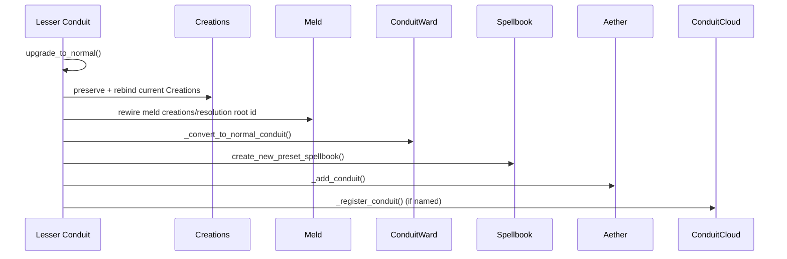
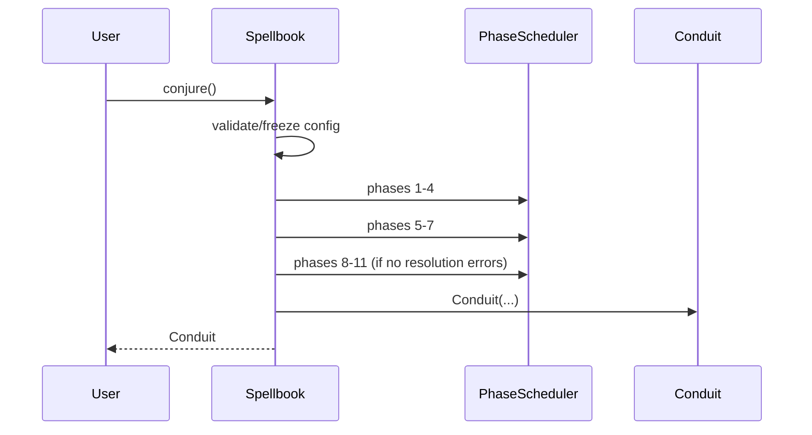
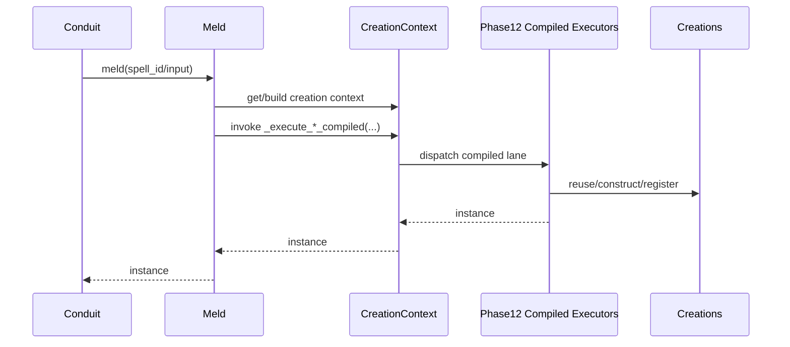
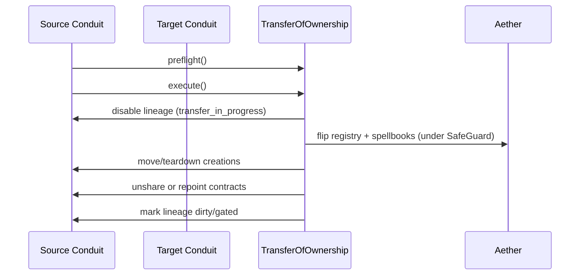



# Src Components (C3/C2/C1)

## Metadata
- Doc ID: COMP-SRC-2026-01-17
- Status: in_progress
- Owner:
- Created: 2026-01-17
- Updated: 2026-07-25

## Scope
This document defines C3 components, C2 subcomponents, and C1 code references
for the Melder core platform (`src/melder`). It complements
`context_compass/system_docs/src_architecture.md` by providing component-level
responsibilities, contracts, and relationships.
Melder is framed here as a Dependency Graph Runtime (DGR) with DI-style
binding and resolution as a subset capability.

Out of scope:
- Tests and example docs.
- JSON sidecar metadata files (`__*.json`).

## Documentation Quality Standard
This document is treated as durable context. It must be deep enough to recover
system understanding from a blank slate without handwaving.

Required rules:
- No handwaving. Every claim must be grounded in source evidence or marked as UNKNOWN.
- Explicit entrypoints and method-level call flows for core behavior.
- Explicit ownership, lifecycle, and cleanup order for components.
- Explicit invariants, failure modes, and concurrency constraints.
- ASCII and Mermaid diagrams for core flows.
- Update the information sources list when new files are used.

## DO NOT ASSUME / Unknowns Gate
Rule: No Unverified Claims.
Any statement that is not directly supported by evidence must be treated as UNKNOWN.

Evidence means at least one of:
- A specific source file reference (preferred: file + symbol/method/class name).
- A citation to an explicit, already-verified artifact (e.g., a prior approved doc section).

If not evidenced => UNKNOWN.

UNKNOWN items must be explicitly labeled UNKNOWN (or added to the Unknowns section).
UNKNOWN items must be investigated by reading the relevant source(s).
If investigation cannot be completed (missing source access, ambiguity, or time),
the item must remain UNKNOWN and must not be promoted to fact.

No reasonable assumptions.
Do not infer behavior from naming, patterns, conventions, or typical frameworks.
Only the code/docs count.

When unsure:
- Mark it UNKNOWN.
- Identify the most likely evidence target (file + symbol).
- Investigate, then update the doc (or leave it UNKNOWN).

## Unknowns
This section is a living list of claims currently not backed by evidence.
Each item must include:
- What is unknown.
- Why it matters (impact).
- Where to investigate (file(s) + symbol(s)).
- Current status (uninvestigated / investigating / blocked).

- PERMANENTLY REMOVED. These do not exist in `src/melder` and their absence is
  intentional, so do not treat a failed search for them as a gap:
  the runtime `MutationContract` descriptor and `MUTATION_CONTRACT_DISABLED`; the
  `structure_profiles` subsystem; the `spell_examiner` AI-profile files (current
  profiles are `binding_profile.py`, `general_profile.py`, `detailed_profile.py`,
  `spell_compiler/profiles/resolution_profile.py`); `rift_event_configuration.py`;
  `phase12_*_executor.py`; `creations/creation.py` (the `Creation` wrapper -
  `conduit_creations.py` is now the conduit/root specialization seam);
  `MeldGate` / `MeldGateController` (superseded by
  `utilities/synchronization/creation_gate.py` and `creation_gate_controller.py`);
  `meld_context/` (superseded by `creation_context/`); `SpellCrafter` (renamed
  `SpellCompiler`); `Configuration` (renamed `SpellbookConfiguration`).
  The 2026-06-12 path/rename sweep that produced this list is COMPLETE and was
  re-verified 2026-07-25: every source path cited in this document resolves on disk
  and no renamed symbol survives as a live claim. Its step-by-step narration was
  removed as settled history; git carries it.
- ARTIFACT OWNERSHIP, phases 8-11 (a live contract, not sweep bookkeeping):
  `SpellCompilerArtifact` is the spell-scoped OWNER of `_occurrence_graph_analysis`,
  `_occurrence_order_analysis`, `_occurrence_instance_analysis`,
  `_occurrence_contract_analysis`, `_spell_codegen_model`, `_spell_codegen_plan`,
  `_spell_codegen_creation`, `_codegen_ir`, and `_phase8_11_codegen_ir_dirty`.
  `SpellAnalyzer`, `SpellArtifactProcessor`, `SpellCodegenPlanner`, and
  `CodegenCreationSystem` PUBLISH INTO those slots rather than owning them, so read a
  phase's output from the artifact, not from the system that produced it.

- UNKNOWN: Producer call sites for advanced mutation/contract state flags
  (`SpellState.contract_violation`, `SpellState.mutation_candidate`,
  `SpellState.mutation_quarantined`, `SpellState.mutation_failed`) remain
  unresolved in runtime code.
  Why it matters: Without explicit producers, mutation/contract diagnostics and
  policy gating can drift from actual runtime behavior.
  Clarification: SpellContract/MutationContract descriptor behavior is already
  evidenced and no longer unknown. SpellContract contract-unvalidated wiring is
  present via Phase 4 + `mark_contract_dependents_dirty` call paths; and
  MutationContract sockets are explicitly blocked in Phase 4 with
  `MUTATION_CONTRACT_DISABLED`, while mutation overlays still emit
  `mutation_contract_set` / `mutation_contract_cleared` through
  `Spell.apply_mutation_override` and `Spell.clear_mutation_override`.
  Evidence from current sweep (SYNC NOTE 2026-07-11): the May MR skeleton that
  carried the placeholder hooks (`research/**` with `SpellMutationNode`,
  `CreationMutationNode`, `Research.promote_spell_version`) was DELETED in the
  ResearchSet rebuild; no code path produces these flags today, by design.
  Producers belong to the future MR runtime-seam slice (select/staged/promoted
  acts over the notch/bind_inactive seams).
  Where to investigate:
  `src/melder/aether/aetheric_frame/dev_ops/spell_system_states/spell_system_states.py`,
  `src/melder/aether/aetheric_frame/dev_ops/spell_system_states/spell_state.py`,
  `src/melder/aether/aetheric_frame/dev_ops/spell_system_states/spell_state_change_reason.py`.
  Follow-up stories:
  `STORY-2026-02-13-spellstate-advanced-flag-producers`,
  `STORY-2026-02-13-mutation-research-runtime-wiring`.
  Current status: blocked (producers await the MR runtime-seam slice).

## Table of Contents
- Metadata
- Scope
- Documentation Quality Standard
- DO NOT ASSUME / Unknowns Gate
- Unknowns
- Table of Contents
- Component Template
- C3 Components Catalog
- C2 Subcomponents Catalog
- Method-Level Call Flows (C1)
- C1 Code Map (Core)
- Diagrams
- Information Sources
- DI Resolution Contract Notes (Spec vs Implementation)
- Open Questions
- Context / Handoff Summary

## Component Template
Each component entry includes:
- Purpose
- Responsibilities
- Inputs
- Outputs
- Owned State
- Lifecycle/Cleanup
- Concurrency/Threading
- Invariants/Guarantees
- Failure Modes
- Observability
- Extension Points
- Key Files (C1)

## C3 Components Catalog

### Component: Public API and Runtime Guardrails
Purpose:
- Provide the package entrypoint and import-time guardrails.

Responsibilities:
- Warn on Python < 3.14 and on GIL-enabled builds (3.14+ is the supported floor).
- Boot `Aether()` eagerly from the package root.
- Expose package metadata and version string.

Inputs:
- Python runtime version and `sys._is_gil_enabled()`.

Outputs:
- UserWarning messages.

Owned State:
- Package metadata (`__version__`, `__author__`, `__license__`, `__description__`).

Lifecycle/Cleanup:
- Executes at import time; no explicit cleanup.

Concurrency/Threading:
- Import-time only.

Invariants/Guarantees:
- No registration-guard object is constructed at package import; the package root
  neither imports nor exports any guard symbol.
- Runtime warnings are emitted but do not block execution.

Failure Modes:
- Runtime guardrails are warning-only for Python version / GIL mode checks.
- Registration refusal is not raised from here; it belongs to the bind pipeline.

Observability:
- Warnings via `warnings.warn`.
- Guard-block failures are surfaced as `InternalRegistrationError` exceptions in
  guarded bind paths.

Extension Points:
- None.

Key Files (C1):
- `src/melder/__init__.py`

### Component: Packaged Hardcopy Documents And Public Helper Exports
Purpose:
- Expose the package-root agent/document surfaces and opt-in helper/config
  utilities that ship alongside the runtime.

Responsibilities:
- Instantiate the package-root hardcopy document objects:
  `__architecture__`, `__components__`, `__graph_network__`, and
  `__graph_details__`.
- Provide the immutable `StaticSystemDocument` carrier used by those exports.
- Export root configuration helpers:
  `AetherConfiguration` and `AetherConfigurationBuilder`.
- Export the public `ProtocolCrafter` helper for protocol generation and
  bounded interface-file maintenance.

Inputs:
- Minified JSON hardcopy payload strings for packaged document modules.
- Public helper/config class implementations wired into `melder.__all__`.

Outputs:
- Package-root `StaticSystemDocument` objects for agent-facing hardcopy access.
- Public helper/config class exports available from the top-level package.

Owned State:
- Module-level `StaticSystemDocument` singletons in the packaged doc modules.

Lifecycle/Cleanup:
- Hardcopy document exports are immutable after import and define no cleanup
  contract.
- Helper/config objects own their own cleanup only when callers instantiate
  them.

Concurrency/Threading:
- Hardcopy exports are import-time objects only.
- Exported helpers use their own instance locks when instantiated.

Invariants/Guarantees:
- Package-root hardcopy docs remain queryable without conjuring a conduit.
- The current packaged hardcopy payloads are placeholder markdown/json
  carriers, not live regenerated architecture snapshots.
- Public helper/config exports do not mutate runtime state merely by being
  imported from `melder`.

Failure Modes:
- Invalid hardcopy JSON would fail import of the packaged doc module.
- Helper/config misuse fails when the helper/config instance is used, not at
  package export time.

Observability:
- `render_json()` / `render_markdown()` on the hardcopy document objects.
- Class-level agent-purpose strings on the packaged document modules.

Extension Points:
- Replacing placeholder hardcopy payloads with real packaged system docs.
- Expanding root configuration policy beyond logger activation.
- Extending protocol generation/file-maintenance helpers.

Key Files (C1):
- `src/melder/system_document.py`
- `src/melder/__architecture__.py`
- `src/melder/__components__.py`
- `src/melder/__graph_network__.py`
- `src/melder/__graph_details__.py`
- `src/melder/aether/aether_configuration.py`
- `src/melder/aether/aether_configuration_builder.py`
- `src/melder/utilities/ai_native_support_tools/protocol_crafter.py`

### Component: Spellbook Core (Binding and Conjure)
Purpose:
- Provide the primary binding and conjure surface for the DGR.

Responsibilities:
- Manage configuration lifecycle and logger initialization.
- Register spells into local maps and spell-id caches.
- Maintain spell_id maps for O(1) spell_id resolution.
- Start transaction-backed SpellIndex mutation flows:
  `notch_spell(...)`, `add_spell_into_spellindex(...)`, and
  `remove_spell_from_spellindex(...)`.
- Run phase pipelines before conjure.
- Conjure exactly one Conduit per Spellbook instance.
- Provide SpellBinder fluent adapter.
- Scan user-supplied modules for `scan_bind` metadata and bind spells.

Inputs:
- User spell objects, configuration inputs, policy/automatic flags.
- Module objects passed to `scan(...)`.

Outputs:
- Spell IDs from `bind()`.
- Spell ID lists from `scan(...)`.
- SpellIndex mutation transaction results from `notch_spell(...)`,
  `add_spell_into_spellindex(...)`, and `remove_spell_from_spellindex(...)`.
- Conduit instances from `conjure()`.

Owned State:
- Spell registries (`_spells`, `_lookup_spells`, `_contracted_spells`).
- Spell_id maps (`_spells_by_id`, `_contracted_spells_by_id`).
- Spell-id caches (`_spell_ids`, `_contracted_spell_ids`).
- `_spell_validator`, `_spell_system_states`.
- `_configuration`, `_configuration_locked`.
- `_conduit`, `_conjured`, `_bind`.

Lifecycle/Cleanup:
- `SpellbookConfiguration` is validated/frozen before conjure.
- Cleanup is idempotent, unregisters local lineages from SpellSystemStates, and clears spells, configuration, validators, and logger. EVIDENCE: src/melder/aether/spellbook/spellbook.py:_cleanup_spells

Concurrency/Threading:
- Internal RLock guards most mutable operations.

Invariants/Guarantees:
- Conjure allowed once per Spellbook instance.
- `SpellbookConfiguration` must be frozen before Conduit creation.
- Existing-object spells are registered into Creations on conjure/bind.

Failure Modes:
- `SpellbookValidationError` when Phase 1-4 produces broken spells.
- RuntimeError for duplicate spell ids or lookup key collisions.
- RuntimeError from the SpellIndex multi-member seams when their ownership /
  activity preconditions are violated: notching a spell that is not parked in
  `_inactive_spells`; adding onto an index this spellbook does not own; moving
  or separating a spell that is still ACTIVE (it must be notched away first);
  separating a spell that is the SOLE member of its source index (use
  `cleanup_spell` to dispose it instead).
  EVIDENCE:
  - src/melder/aether/spellbook/spellbook.py:3480-3520 (`_apply_notch`)
  - src/melder/aether/spellbook/spellbook.py:3653-3676 (`_apply_add_to_index`)
  - src/melder/aether/spellbook/spellbook.py:3828-3856 (`_apply_remove_from_index`)

Observability:
- Logs via SafeLogger in Spellbook and related components.

Extension Points:
- Conduit lifecycle hooks pulled from `SpellbookConfiguration`.
- Spell-level hooks (pre, activation, post).
- SpellBinder fluent binding surface.

Key Files (C1):
- `src/melder/aether/spellbook/spellbook.py`
- `src/melder/aether/spellbook/spellbinder.py`
- `src/melder/aether/spellbook/bind/scan.py`

### Component: Binding Pipeline (Bind, Spell, SpellIndex)
Purpose:
- Convert user objects into registered spell metadata with stable index identities.

Responsibilities:
- Build binding profiles via SpellExaminer.
- Compute fingerprints and create SpellIndex entries (the stable index that categorizes and targets spells).
- Determine canonical SpellType from binding profile + name/spellframe.
- Enforce Protocol and module binding constraints.
- Reject module and Protocol concrete binding targets while allowing class,
  callable, and existing-object bindings under profile/existence rules.
- Enforce existence constraints for method/lambda spells.
- Construct Spell objects with metadata and hooks.

Inputs:
- Spell object, spellframe, binding name, existence, permissions.

Outputs:
- Spell and SpellIndex instances.

Owned State:
- SpellIndex: immutable ULID index that holds the active selected spell; versions owned by MutationResearch.
- Spell: metadata, hooks, dependency placeholders, ownership fields.

Lifecycle/Cleanup:
- SpellIndex and Spell are Cleanable and null references on cleanup.

Concurrency/Threading:
- SpellIndex and Spell use RLock to protect mutation and cleanup.

Invariants/Guarantees:
- SpellIndex hash identity is stable and never changes.
- Protocols cannot be bound as concrete spells.
- Method/lambda spells must use `Existence.unique`.
- SpellType classification is stable for a given binding profile + metadata.
- Resolution style policy is maintained in
  `src/melder/aether/spellbook/resolution_style_matrix.py`, where
  `BINDING_FAMILY_POLICY` is canonical and SpellType rows are derived.

Failure Modes:
- TypeError for invalid binding targets or protocol misuse.
- ValueError for invalid bindings (existence rules, binding name conflicts).
- ValueError if method/lambda spells are bound with non-unique existence.

Observability:
- Errors surfaced via exceptions and Spellbook logger.

Extension Points:
- Binding profile strategies in SpellExaminer.

Key Files (C1):
- `src/melder/aether/spellbook/bind/bind.py`
- `src/melder/aether/spellbook/bind/spell_index.py`
- `src/melder/aether/spellbook/spell.py`
- `src/melder/aether/spellbook/spell_types/spell_types.py`
- `src/melder/aether/spellbook/resolution_style_matrix.py`

### Component: DI Descriptors and Contract Sockets
Purpose:
- Provide declarative DI placeholders and contract sockets for spell parameters.

Responsibilities:
- SpellMap encodes explicit DI intent and optional override payloads (dict/list/tuple).
- SpellMap supports concrete spell, spellframe, and frame-only forms and supplies canonical keys via SpellInputUtils.
- SpellContract declares late-bound sockets to be satisfied via conduit links.
- Legacy mutation-socket classifications are still recognized by validation,
  but no live `MutationContract` descriptor class remains in `src/melder`.
- ParameterDIShape classification drives Phase 1 socket interpretation.

Inputs:
- Spell/frame/binding identifiers and optional override payloads (dict/list/tuple).
- Legacy mutation-socket classification metadata interpreted through
  `ParameterDIShape.MUTATION_CONTRACT`.

Outputs:
- Canonical keys (frame_key, binding_key) and lookup triplets consumed by SpellCompiler and validators.

Owned State:
- SpellMap/SpellContract fields (spell, spellframe, binding_name, override).

Lifecycle/Cleanup:
- Cleanable descriptors; cleanup clears overrides and references.

Concurrency/Threading:
- No internal locks; immutable intent objects after construction.

Invariants/Guarantees:
- At least one of `spell` or `spellframe` must be provided.
- Binding names are normalized for case-insensitive matching and default to `__default__` when omitted.
- SpellMap preserves override payloads as provided; when `None`, no override is attached.
- SpellContract is intended for dynamic mode usage; legacy mutation-socket
  classifications are only preserved so validation can block them explicitly.

Failure Modes:
- ValueError when both `spell` and `spellframe` are None.
- `ContractProviderPresenceStrategy.validate` emits errors for SpellContract
  sockets in automatic mode; emits warnings for missing SpellContract providers;
  emits errors for invalid or ambiguous SpellContract defaults.
- `ContractProviderPresenceStrategy.validate` emits
  `MUTATION_CONTRACT_DISABLED` errors for legacy mutation-socket paths while
  mutation systems are on hold.

Observability:
- Exceptions on invalid construction; validation issues reported in Phase 4.

Extension Points:
- None (descriptor types are not intended for subclassing).

Key Files (C1):
- `src/melder/aether/conduit/meld/contracts/spell_map.py`
- `src/melder/aether/conduit/meld/contracts/spell_contract.py`
- `src/melder/aether/spellbook/spell_compiler/spell_requirements_finder/parameter_di_shape.py`

### Component: Spellbook Configuration and System State
Purpose:
- Provide the validated, freezable `SpellbookConfiguration` surface for one
  spellbook/runtime context.

Responsibilities:
- Maintain configuration properties and hook registry.
- Validate required properties and freeze mutation.
- Provide configuration flags consumed by the logger provider path and AR
  eligibility rules (`system_state`, `ai_native_enabled`,
  `rift_enabled`).
- Control system_state (automatic vs dynamic).

Inputs:
- Property values and hook registrations.

Outputs:
- Frozen configuration and hook maps.

Owned State:
- `_properties`, `available_properties`, `_idempotent_keys`.
- `_hooks`.

Lifecycle/Cleanup:
- `freeze()` locks property mutations.
- Cleanup clears properties and hooks.

Concurrency/Threading:
- RLock guards property and hook mutations.

Invariants/Guarantees:
- Idempotent properties can be set once only.
- Frozen configuration cannot be modified.

Failure Modes:
- RuntimeError when cleaned/frozen configuration is mutated.
- ValueError when required properties are missing or semantically invalid.
- TypeError for invalid key/factory/hook input types.
- KeyError for unknown property lookup requests.

Observability:
- Exception-based reporting; no internal logging.

Extension Points:
- Additional properties and hook names.

Key Files (C1):
- `src/melder/aether/spellbook/configuration/spellbook_configuration.py`
- `src/melder/aether/spellbook/configuration/system_state.py`

### Component: Aether Singleton (Global Runtime)
Purpose:
- Global singleton for all frames and shared registries.

Responsibilities:
- Create and manage AethericFrames.
- Bind configuration to frames.
- Own one optional Aether root configuration and expose
  create/builder/install/activate helpers that apply root logger policy into
  `AetherUtilitySystem`.
- Expose explicit post-boot logger control through `attach_logger(...)` and
  `enable_logging(...)`.
- Lazily host the process-wide `MutationResearch` singleton root above
  frame-local runtime state.
- Register conduits and spell lineages.
- Provide selected-spell registry for spell ids.
- Privately host singleton support roots for utility logging, crystallizer
  policy/activation, and Nexus AR behavior.

Inputs:
- Conduit objects, SpellIndex sets, `SpellbookConfiguration`, and optional
  `AetherConfiguration`.

Outputs:
- Frame-level registries and lookups plus applied root logger-provider policy
  in `AetherUtilitySystem`.

Owned State:
- `_aetheric_frames`, `_default_frame`, `_logger`, `_aether_utility_system`,
  `_crystallizer`, `_mutation_research`, `_nexus`.
- Singleton state (`_instance`, `_initialized`, `_lock`).

Lifecycle/Cleanup:
- `cleanup()` tears down frames and resets singleton state.

Concurrency/Threading:
- Class-level RLock guards singleton initialization and updates.

Invariants/Guarantees:
- One Aether instance per interpreter.
- Default frame exists when needed.

Failure Modes:
- ValueError for missing frames, duplicate registry entries, or not-found lookups.
- TypeError for invalid input types (e.g., non-string frame names).
- RuntimeError when singleton/frame registries are cleaned or unavailable.

Observability:
- Logs via SafeLogger.

Extension Points:
- Additional frame behaviors or registries.

Key Files (C1):
- `src/melder/aether/aether.py`
- `src/melder/aether/aether_configuration.py`
- `src/melder/aether/aether_configuration_builder.py`
- `src/melder/crystallizer/crystallizer.py`
- `src/melder/mutation_research/mutation_research.py`

### Component: AethericFrame Services
Purpose:
- Per-frame container for conduits, registries, and control-plane services.

Responsibilities:
- Track conduits and spell registries.
- Maintain selected-spell registry.
- Own the frame-local DevopsInformationRegistry that mirrors topology and
  transaction state for reporting and strategy resolution.
- Provide ConduitCloud for named conduit lookup (dynamic mode).
- Provide ConduitCluster for auto-sharing roots.
- Own SpellSystemStates and DevOpsManager.
- Frames carry NO mutation-research dimension (owner ruling 2026-07-06, frame
  half unchanged). REVERSED for conduits/spellbooks 2026-07-12 (patch
  mutation_research_accessor_doors_2026_07_12): Spellbook and Conduit bind the
  Aether-hosted world root at init (crystallizer pattern) and expose it through
  one borrowed read-only `mutation_research` property each; research is still
  declared through that one world root and its `ResearchSet` surface only.

Inputs:
- Conduit objects and SpellIndex sets.

Outputs:
- Registry state and DevOps services.

Owned State:
- `_conduits`, `_spell_registry`, `_selected_spell_registry`.
- `_devops_information_registry`, `_conduit_cloud`, `_conduit_clusters`.
- `_spell_system_states`, `_dev_ops_manager`.
- `_configuration` (bound by Spellbook), `_frame_configuration`.

Lifecycle/Cleanup:
- Cleanup cascades to conduits, clusters, cloud, and control plane.

Concurrency/Threading:
- Frame-level RLock.

Invariants/Guarantees:
- One DevopsInformationRegistry, SpellSystemStates, and DevOpsManager per
  frame.

Failure Modes:
- Cleanup is best-effort; errors are suppressed to complete teardown.

Observability:
- Minimal internal logging; relies on caller logs.

Extension Points:
- Additional per-frame services.

Key Files (C1):
- `src/melder/aether/aetheric_frame/aetheric_frame.py`
- `src/melder/aether/aetheric_frame/conduit_cloud.py`
- `src/melder/aether/conduit/conduit_cluster.py`

### Component: Crystallizer Root, Persistence Record, And Module-World Surfaces
Purpose:
- Provide the hosted crystallizer policy root, the passive persistence RECORD
  (digital-twin custody of the configured world), and the retained/live module
  world surfaces used for crystallized spell loading and activation.

Responsibilities:
- Own configured/activated crystallizer policy at the hosted root.
- Act as the passive emission sink: structural units PUSH twins/custody at
  their own confirmation points; every sink verb is a NO-OP while inactive.
- Own the persistence RECORD (`PersistenceSystem`): named profiles with one
  ACTIVE emission target ("default" guaranteed) and a shared checkpoint
  ledger of `PersistenceCrystal` snapshot artifacts. Since the 2026-07-10
  decomposition the `CrystallizerCache` is owned by `AssetManagementSystem`,
  not the record (see the dated Subsystem Decomposition section below).
- Mirror spell lifecycle into the record: custody births at bind
  (active/staged locations), moves at park/promote, LEAVES at true removal;
  book/frame death evicts whole subtrees; Nexus/MR flip a
  `RecordedUnitState` switch (enabled/disabled/cleaned) with twins retained.
- Record index MEMBERSHIP as a first-class twin (`SpellIndexCrystal`:
  owner edge, selection, member SHAs) - re-snapshotted at bind/staging,
  notch (post-repoint), disposal, index moves, and transfer; evicted at
  index destruction.
- Record inter-conduit RELATIONSHIPS (`ContractCrystal`: both endpoints +
  per-side Detail/IndexDetail projections incl. permissions, direction,
  and live subscription heads) - emitted at link, re-snapshotted through
  the eight public contract verbs and the notch/destroy fan-outs, evicted
  at sever (`_remove_contract` choke point); `ConduitCrystal.link_targets`
  carries each conduit's OUTBOUND (initiated) link edges.
- Record CLUSTER topology (`ClusterCrystal`: cluster/frame identities,
  member conduit ids, elected leader, shared lineage entries) - emitted
  from the cluster's own state mutators via the configuration-precedent
  singleton pull (clusters have no crystallizer-bearing parent); evicted
  at live cluster deletion and swept by frame death.
- Seal incremental checkpoints: manual (`create_checkpoint`) and automatic
  (emit-driven cadence, `checkpoint_interval_minutes`), with FIFO ledger
  dropout at `max_persistence_crystals`.
- Sweep a mid-flight-activated live world into the record
  (`_catch_up_live_world`, shared-spellbook deduped).
- Build `SpellCrystal` manifests from live spells; the L3 crystal ALSO
  absorbs the bind signature (spell/binding/spellframe/existence/permissions
  names, spellbook parent edge, derived `rebindability`).
- Hold source-classification + checkpoint policy in
  `CrystallizerConfiguration` (`with_defaults()` = complete easy mode; only
  `user_source_root_paths` is hard-required).
- Use `SyntheticModule` as the live in-memory module embodiment; on park,
  optionally unpublish a spell's synthetic root module
  (`remove_inactive_synthmodules`, default False).

Inputs:
- Optional `CrystallizerConfiguration`.
- Twin emissions from configurations at their true-activation points
  (Spellbook/Frame/Aether/MR/Nexus configs) and from config-less objects
  (root Conduit at init; Spell custody at bind).
- Removal/lifecycle events from the owning teardown seams (spellbook
  `cleanup_and_remove_spell`/`cleanup_spell`/`_cleanup_components`, frame
  `cleanup`, Nexus `enable/disable/cleanup`, MR
  `activate/deactivate/cleanup`).
- Live `Spell` objects passed to `create_spell_crystal(...)`.

Outputs:
- Hosted crystallizer configured/activated state.
- The recorded world: profile describe dicts, custody lookups
  (`get_spell_crystal`), checkpoint ids/metadata (facades return names and
  dicts ONLY - the persistence model never escapes the root).
- `PersistenceCrystal.to_cached_item()`/`from_cached_item()` detached cache
  payloads (real round trip; storage itself is the persistence epic).
- `SpellCrystal` loader-facing manifests; `SyntheticModule` runtime modules.

Owned State:
- `Crystallizer`: `_configuration`, `_configured`, `_activated`, `_aether`,
  `_persistence_system`, `_asset_management_system`,
  `_crystal_loader_system` (the three post-decomposition children),
  `_checkpoint_interval_seconds`, `_last_automatic_checkpoint_monotonic`.
- `PersistenceSystem`: `_profiles_by_name`, `_active_profile_name`,
  `_checkpoint_crystals_by_id` (ULID-keyed; lexicographic = chronological),
  `_max_persistence_crystals`. No cache slot since the S3 decomposition:
  disk custody lives on `AssetManagementSystem`.
- `PersistenceProfile`: flat level maps (frames by name, books/conduits by
  id, spell custody split active/inactive by spell SHA), three singleton
  twins, `_nexus_state`/`_mutation_research_state` switches, the emission
  journal + checkpoint mark.
- Twin family (pure-data, `describe()`-detached): `AetherCrystal`,
  `AethericFrameCrystal`, `SpellbookCrystal`, `ConduitCrystal`,
  `NexusCrystal`, `MutationResearchCrystal`, `SpellCrystal` (L3; the whole
  family lives at package level in `crystallizer/crystals/` since the S2
  move).

Lifecycle/Cleanup:
- `Crystallizer` is a hosted singleton root owned by `Aether`; frames are
  cleaned BEFORE it in full teardown, so eviction seams always fire against
  a live record (or skip via the lifecycle-evidenced gates).
- Replace-on-emit: a displaced twin/custody crystal is CLEANED; runtime
  holders must fetch fresh per use (never retain long-lived references).
- `clear_profile` resets one profile's content, journal, mark, and state
  switches in place; `delete_profile` guards "default", falls selection
  back, and its sealed ledger crystals SURVIVE deletion.
- `PersistenceCrystal` wipe = cleanup (reload from cache is the recovery).

Concurrency/Threading:
- Instance `RLock` discipline at every level; one-way lock order
  (spellbook/frame/nexus/MR -> crystallizer -> persistence system ->
  profile); the cadence ticker stamps under the crystallizer lock and seals
  outside it (stamp advances BEFORE sealing - no hot-loop on failure).
- `SyntheticModule` uses registry locking for importlib-facing paths.

Invariants/Guarantees:
- The crystallizer root starts unconfigured and inactive; every sink verb
  and profile/checkpoint facade requires activation.
- The record is DYNAMIC-LANE positioned: bind custody is gated
  `activated AND _is_dynamic_posture()`; automatic frames emit nothing;
  crystallizer-off worlds are byte-identical (R-A covenant).
- The conjure configuration-discipline guard refuses a dynamic conjure over
  binds that ran while the spellbook configuration was mutable (recorded
  worlds are never born config-incoherent).
- Runtime ULIDs are emitted, never rehydrated, and normalized out of seal
  fingerprints (restore mints fresh identities via translation map).
- Aether/Crystallizer have NO state switch by design: the record dies with
  them and could never report their teardown.

Failure Modes:
- `Crystallizer.configure(...)` rejects reconfiguration while active.
- `create_spell_crystal(...)`/`get_spell_crystal(...)`/facades raise when
  not activated; unknown profile/checkpoint names raise `KeyError`;
  `emit(...)` of an unsupported twin type raises `TypeError`.
- `load_checkpoint` is LIVE (RestoreEngine, 2026-07-07) and MEDIATED since
  the 2026-07-10 decomposition: it routes through
  `CrystalLoaderSystem`/`LoadAdmission` with blocker-refusing admission
  (see the dated sections below). `CrystallizerCache` is REAL and
  asset-owned: atomic JSON per checkpoint ULID under
  `__crystallizer_cache__` ({profile}/ scoped); misses raise a teach-grade
  `KeyError`; `flush_checkpoint(id|None=all)` / `reload_cached_checkpoint`
  (insert-if-absent, no retention on reload) /
  `list_cached_checkpoint_ids` remain the byte-compatible facade lane; the
  user-DB seam is the asset-owned `ExternalPersistenceManager`.

Observability:
- `describe_profile`/`describe_checkpoint`/`list_*` facades expose the whole
  record as detached dicts, ids, and counts.
- Checkpoint payload special-cases keep replay truthful: removal tombstones
  (`spell_removed`/`spellbook_removed`/`frame_removed`), activity
  current-truth, and state-switch values.

Extension Points:
- Storage adapter behind `CrystallizerCache` (persistence epic P1-P6).
- Restore engine consuming checkpoint replay (bootstrap epic).
- Loader chain / dependency-ordered unfold (parent epic M3).

Key Files (C1):
- `src/melder/crystallizer/crystallizer.py`
- `src/melder/crystallizer/configuration/crystallizer_configuration.py`
- `src/melder/crystallizer/configuration/crystallizer_configuration_builder.py`
- `src/melder/crystallizer/persistence/persistence_system.py`
- `src/melder/crystallizer/persistence/persistence_profile.py`
- `src/melder/crystallizer/persistence/persistence_crystal.py`
- `src/melder/crystallizer/asset_management/asset_management_system.py`
- `src/melder/crystallizer/asset_management/crystallizer_cache.py`
- `src/melder/crystallizer/crystal_loader_system/` (crystal_loader_system.py,
  load_admission.py, load_plan.py, restore_engine.py, bootstrap_loader.py)
- `src/melder/crystallizer/crystal_analysis/` (crystal_analyzer.py,
  crystal_analysis_result.py, custody/, strategies/, preflight/)
- `src/melder/crystallizer/crystals/recorded_unit_state.py`
- `src/melder/crystallizer/crystals/spell_crystal.py` (package-level since
  the S2 move; carrier-slimmed in S1)
- `src/melder/crystallizer/crystals/` (aether / aetheric_frame /
  spellbook / conduit / nexus / mutation_research twins, plus
  `spell_index_crystal.py` membership map, `contract_crystal.py`
  relationship map, and `cluster_crystal.py` cluster map)
- `src/melder/crystallizer/synthetic_module.py`

### Component: AR Runtime Surface (Nexus, Rift, RiftSpace)
Purpose:
- Provide the live AR-facing access layer into the Melder-owned object world.

Responsibilities:
- Expose `Nexus` as the public singleton root for Rift-domain behavior.
- Own process-wide AR configuration, Rift registry state, and Nexus-managed
  frame policy.
- Own `FrameDescriptorManager` for frame-scoped descriptors, passive
  frame/conduit/spell publication, and Nexus-managed frame-record state.
- Own `FrameACLManager` for frame-local ACL container creation, profile
  registries, chain access, and frame-level ACL change fan-out.
- Surface `NexusFrameBuilder` from `NexusFrameManager.begin(...)` so Nexus
  frame authoring is an explicit builder-owned flow instead of manager-only
  prose.
- Enforce process-wide Rift creation/direct-access policy plus target-frame,
  Nexus-frame, and active-Rift budget checks.
- Compile frame-scoped projection sets from descriptor truth plus selected ACL
  family names.
- Fan out ACL-driven projection refresh to the impacted live Rifts for one
  changed-frame batch, with the single-frame ACL callback delegating to the
  same batch path.
- Create and register bare `Rift` objects with finalized per-Rift config snapshots.
- Program one primary room from `RiftConfiguration.space_type`.
- Enforce Nexus frame topology rules (`single`, `indexed`,
  `one_per_workspace`) and target-frame eligibility for static vs codegen AR.
- Keep Nexus-frame creation explicit rather than auto-provisioned.
- Route Nexus-facing managed creation through the normal public Spellbook API
  instead of direct frame-first config injection.
- Return rooted conduits from Nexus/Rift-facing managed creation and recovery,
  not frame objects.
- Keep `create_*` strict:
  - creation raises when the target managed frame already exists
  - recovery stays on `get_*`
- Constrain raw `NexusFrameManager` creation by mode:
  - `single`
    - only the canonical shared frame name may be created directly
  - `indexed`
    - explicit named direct creation remains allowed
  - `one_per_workspace`
    - raw direct manager creation is rejected because the path carries no Rift
      owner identity
- Make rooted Nexus creation defaulted and caller-nameable:
  - root conduit is created by default
  - caller may override the root conduit name
  - current default root conduit name is `"root"`
- Let `Rift` own exactly one primary room, explicit frame targeting,
  Nexus-frame access, current projection registry state, and projection-driven
  asset application.
- Let `Rift` own per-frame `FrameLinkContract` state plus per-Rift refresh
  orchestration over that contract set and current projection-driven asset
  refresh.
- Let `RiftSpace` own room-local metadata, attached durable asset state
  (Rift-backed `FrameViewer`, workstation, command system), one room-local
  event system, and one room-local memory system.
- Let `CodegenRiftSpace` own one internal `CodegenSystem` and attach it to the
  room-owned `CodegenCommandSystem` during room initialization.
- Let `RiftSpace` compose one room-local `Workstation`, one room-local
  `CommandSystem`, one room-local event system, and one room-local memory
  system above the descriptor/viewer path.
- Let `RiftSpace` build the durable Rift-backed viewer asset during room init.
- Let static rooms host `StaticFrameViewer` directly so the spell-facing viewer
  surface stays live-only while still reading current Rift projection truth.

Inputs:
- Nexus configuration and Rift configuration/profile templates.
- Rift creation requests and later explicit frame-target requests.
- per-frame ACL family changes from frame-local ACL containers.
- Static, capability, or codegen room posture.

Outputs:
- Live `Rift` objects.
- Programmed primary room instances.
- frame-scoped `FrameProjectionSet` objects for targeted frames.
- Nexus-managed frame references and frame-name listings.
- Registered room/workspace objects.

Owned State:
- `Nexus`: `_configuration`, `_configured`, `_enabled`, `_rifts_by_id`,
  `_rift_ids_by_name`, `_rift_profiles_by_name`,
  `_next_default_rift_number`, `_frame_manager`,
  `_rift_gate_controller`, `_target_frame_ref_counts`,
  `_frame_descriptor_manager`, and `_frame_acl_manager`.
- `Rift`: config snapshot, one owned `_space`, `_is_registered`,
  `_is_active`, local metadata, one `FrameLinkContract` per engaged target
  frame carrying per-frame ACL family selection, one `RiftGate`, and the
  current `FrameProjectionSet` registry.
- `RiftSpace`: room id/name/kind, room metadata, attached `FrameViewer`, one
  room-local event system, one room-local memory system, workstation, and
  command system.
- `CodegenRiftSpace`: the base room-owned state above, plus one owned
  `_codegen_system`.

Lifecycle/Cleanup:
- `Nexus` is singleton, boot-hosted by `Aether`, and may remain inert until
  configured/enabled.
- `Rift` cleanup clears the owned space, config snapshot, `RiftGate`,
  frame-link contracts, projection registry, metadata, and then logger state.
- `RiftSpace` cleanup clears room-local state and its event system.

Concurrency/Threading:
- `Nexus` and `Rift` use per-instance `RLock` for cleanup and multi-step
  state mutation.
- `RiftSpace` now owns an `RLock` and uses it for grouped room mutation and
  cleanup.

Invariants/Guarantees:
- `Nexus` is the only intended public root for Rift-domain work.
- `Aether` still owns actual `AethericFrame` objects; `Nexus` owns policy and
  frame records only.
- One frame-local ACL container exists per frame when the ACL subsystem is
  provisioned.
- Each frame-local ACL container now owns separate named version chains for:
  - view
  - command
  - codegen
- `Rift` frame-link ACL selection is same-name and fixed per frame link:
  `view`, `command`, and `codegen` all resolve to the attached `frame_name`.
- When the frame-name contract does not yet exist, `Rift.create_frame_link(...)`
  materializes that same-name contract from the current default ACL snapshot
  before refreshing projections.
- `single` mode is behaviorally shared across Rifts even though the enum name
  still uses the older `single` label.
- Bare Rift creation does not require an initial target frame.
- `Rift.create_frame_link(...)` requires descriptor truth before the target frame is
  accepted into the frame contract or the viewer path.
- `Nexus` does not build live viewers anymore.
- `RiftSpace` no longer manages projection state directly.
- `Rift` applies projection state to the hosted viewer and command assets.
- `FrameViewer` no longer stores a local projection registry or default-frame
  state; it reads current view projections from `Rift` on demand.
- `ViewMultiFrame`, `ViewFrame`, `ViewConduit`, and `ViewSpell` are helper
  surfaces built on demand over the current viewer/Rift contract instead of a
  profile-owned or cached-bound helper system.
- Codegen AR requires `rift_enabled=True`,
  `ai_native_enabled=True`, and `system_state=dynamic`.
- Current room-mode matrix:
  - `static`
    - static viewer overlay
    - weak-by-default workstation
    - no topology mutation
    - no direct create-path spell activation
    - live-only spell-facing retrieval and status helpers
  - `capability`
    - broad manual runtime/object access
    - strong-by-default workstation
    - no codegen
    - lower Melder frame truth still wins
  - `codegen`
    - keeps a selected runtime-helper subset rather than capability parity
    - owns one internal `CodegenSystem` under `CodegenRiftSpace`
    - routes public validate/execute requests through `CodegenCommandSystem`
      into that engine
    - emits full-source codegen room-memory records for top-level validation
      and execution actions
- `Workstation` owns separate strong/weak object, attribute, and method stores
  plus one active target binding.
- `CommandSystem` is the shared room-local command base for infrastructure,
  shared runtime/query helpers, and workstation-target execution.
- `CapabilityCommandSystem` owns conduit discovery, the link/contract-topology
  helper surface, the broad manual-runtime topology surface, and direct spell-
  activation/reuse helpers.
- `StaticCommandSystem` owns live-only spell retrieval, reuse-only spell
  activation, and static spell-status helpers.
- `CodegenCommandSystem` keeps the selected slim runtime-helper surface,
  attaches one room-owned `CodegenSystem`, delegates
  `validate_codegen(...)` / `execute_codegen(...)` into that engine, and emits
  full-source codegen memory records.
- `CodegenSystem` owns the internal transaction, validation, namespace,
  compile/exec, and monitor collaborators beneath the room command facade.
- When the room-local memory system has registered callbacks, one top-level
  successful public command call emits one `RiftMemory` record through that
  system.
- ACL-driven projection refresh is config-backed:
  - `projection_refresh_gate_enabled`
  - `projection_refresh_gate_timeout_seconds`
  - `projection_refresh_gate_poll_interval_seconds`
  with default-on RiftGate drain behavior around the refresh.

Failure Modes:
- Unconfigured or disabled `Nexus` operations fail fast.
- Rift creation or direct-access requests fail when Nexus policy gates,
  required tokens, or configured budgets reject them.
- `Rift` creation fails when configuration is invalid.
- `Rift.create_frame_link(...)` fails when target-frame eligibility rules are not met.
- `Rift.create_frame_link(...)` fails when descriptor truth is missing for the
  requested frame.
- Requested Nexus frame access fails when the request violates the current
  frame-mode policy.
- `Rift.on_nexus_frame_disposed(...)` is still a placeholder seam and does not
  yet push a real Rift-level event orchestration layer.

Observability:
- `Nexus` and `Rift` log lifecycle events through the provider-based
  `SafeLogger` path.

Extension Points:
- Rift profile templates on `Nexus`.
- Future Rift-level event orchestration layer.
- Future richer workspace/context contract above `RiftSpace`.

Key Files (C1):
- `src/melder/nexus/nexus.py`
- `src/melder/nexus/frame_descriptor_manager.py`
- `src/melder/nexus/frame_acl_manager.py`
- `src/melder/nexus/nexus_frame_manager.py`
- `src/melder/nexus/nexus_frame_builder.py`
- `src/melder/nexus/rift/frame_link/frame_link_contract.py`
- `src/melder/nexus/rift/frame_link/frame_link.py`
- `src/melder/nexus/rift/rift_gate/rift_gate.py`
- `src/melder/nexus/rift/rift_gate_controller/rift_gate_controller.py`
- `src/melder/nexus/rift/frame_viewer/frame_viewer.py`
- `src/melder/nexus/rift/frame_viewer/view_multiframe.py`
- `src/melder/nexus/rift/frame_viewer/view_frame.py`
- `src/melder/nexus/rift/frame_viewer/view_conduit.py`
- `src/melder/nexus/rift/frame_viewer/view_spell.py`
- `src/melder/nexus/rift/rift.py`
- `src/melder/nexus/rift/frame_viewer/static_frame_viewer.py`
- `src/melder/nexus/rift/rift_space/rift_space.py`
- `src/melder/nexus/rift/rift_space/event_system/rift_event_system.py`
- `src/melder/nexus/rift/rift_space/event_system/rift_event.py`
- `src/melder/nexus/rift/rift_space/static_rift_space.py`
- `src/melder/nexus/rift/rift_space/codegen_rift_space.py`
- `src/melder/nexus/rift/rift_space/capability_rift_space.py`
- `src/melder/nexus/rift/rift_space/workstation.py`
- `src/melder/nexus/rift/rift_space/memory_system/rift_memory_system.py`
- `src/melder/nexus/rift/rift_space/memory_system/rift_memory.py`
- `src/melder/nexus/rift/command_system/command_system.py`
- `src/melder/nexus/rift/command_system/static_command_system.py`
- `src/melder/nexus/rift/command_system/capability_command_system.py`
- `src/melder/nexus/rift/command_system/codegen_command_system.py`
- `src/melder/nexus/rift/codegen_system/codegen_system.py`
- `src/melder/nexus/acl/builder/frame_acl_builder.py`
- `src/melder/nexus/rift/codegen_system/codegen_transaction_context.py`
- `src/melder/nexus/rift/codegen_system/namespace/codegen_namespace_builder.py`
- `src/melder/nexus/rift/codegen_system/namespace/codegen_namespace_configuration.py`
- `src/melder/nexus/rift/codegen_system/validation/codegen_validator.py`
- `src/melder/nexus/rift/codegen_system/validation/codegen_validation_result.py`
- `src/melder/nexus/rift/codegen_system/validation/codegen_validation_reporter.py`
- `src/melder/nexus/rift/codegen_system/execution/codegen_compiler.py`
- `src/melder/nexus/rift/codegen_system/execution/codegen_executor.py`
- `src/melder/nexus/rift/codegen_system/execution/codegen_execution_result.py`
- `src/melder/nexus/rift/codegen_system/observability/codegen_monitor.py`
- `src/melder/nexus/rift/codegen_system/observability/codegen_event_publisher.py`
- `src/melder/nexus/configuration/nexus_frame_mode.py`
- `src/melder/nexus/configuration/rift_space_type.py`

### Component: Codegen Internal Engine
Purpose:
- Provide the room-owned internal codegen runtime beneath the public command
  facade.

Responsibilities:
- Build per-call `CodegenTransactionContext` objects.
- Resolve optional `CodegenProjection` state from the owning `Rift`.
- Build default namespace configuration and live codegen namespaces.
- Validate generated Python before execution.
- Compile accepted code and execute it against the built namespace.
- Publish validation/execution lifecycle events through the room event system.

Inputs:
- generated Python `code`
- target `frame_name`
- room-owned `Rift` and `CodegenRiftSpace`

Outputs:
- `CodegenValidationResult` (returned as the second element of a
  `Tuple[CodegenTransactionContext, CodegenValidationResult]` from
  `validate_codegen_request(...)`)
- `CodegenExecutionResult` (returned as the second element of a
  `Tuple[CodegenTransactionContext, CodegenExecutionResult]` from
  `execute_codegen_request(...)`)
- shared `CodegenTransactionContext` (the FIRST element of both tuples - the
  context is returned alongside the verdict, not separately)
  EVIDENCE: src/melder/nexus/rift/codegen_system/codegen_system.py:261,:296
- public validation payloads through the reporter

Owned State:
- `CodegenSystem`: `_validator`, `_validation_reporter`,
  `_namespace_builder`, `_compiler`, `_executor`, `_monitor`
- `CodegenTransactionContext`: frame name, code, code hash, optional
  projection, namespace configuration, optional namespace, and metadata

Lifecycle/Cleanup:
- `CodegenSystem` is owned by `CodegenRiftSpace`.
- cleanup is idempotent, lock-disciplined, and cascades into the owned
  monitor before references are nulled.

Concurrency/Threading:
- `CodegenSystem` uses an instance `RLock` around validate/execute flows.

Invariants/Guarantees:
- validation runs before execution on the execute path
- namespace building happens only after accepted validation
- room-memory emission stays on `CodegenCommandSystem`, not the engine root

Failure Modes:
- empty code or frame names raise `ValueError`
- rejected validation returns a validation-failed execution result without
  compile/exec
- missing projection support degrades to `None` projection instead of failing
  transaction construction

Observability:
- `CodegenMonitor` publishes validation/execution lifecycle events through the
  room event system

Extension Points:
- richer namespace strategies
- additional validation strategies
- expanded monitor/reporter policy

Key Files (C1):
- `src/melder/nexus/rift/codegen_system/codegen_system.py`
- `src/melder/nexus/rift/codegen_system/codegen_transaction_context.py`
- `src/melder/nexus/rift/codegen_system/namespace/codegen_namespace_builder.py`
- `src/melder/nexus/rift/codegen_system/namespace/codegen_namespace_configuration.py`
- `src/melder/nexus/rift/codegen_system/validation/codegen_validator.py`
- `src/melder/nexus/rift/codegen_system/validation/codegen_validation_result.py`
- `src/melder/nexus/rift/codegen_system/validation/codegen_validation_reporter.py`
- `src/melder/nexus/rift/codegen_system/execution/codegen_compiler.py`
- `src/melder/nexus/rift/codegen_system/execution/codegen_executor.py`
- `src/melder/nexus/rift/codegen_system/execution/codegen_execution_result.py`
- `src/melder/nexus/rift/codegen_system/observability/codegen_monitor.py`
- `src/melder/nexus/rift/codegen_system/observability/codegen_event_publisher.py`

### Component: Nexus Descriptor And ACL Managers
Purpose:
- Own the frame-scoped descriptor publication and ACL registry layers beneath
  the public `Nexus` facade.

Responsibilities:
- `FrameDescriptorManager` owns `frame_name -> FrameDescriptor`.
- Refresh frame posture and frame-handle cache before passive publication.
- Publish and remove frame, conduit, and spell records.
- Own Nexus-managed frame-record lookup, creation, enumeration, and counts.
- `FrameACLManager` owns `frame_name -> FrameACLContainer`.
- Create frame-local ACL containers on demand, expose profile registries, and
  propagate frame-level ACL change callbacks back through `Nexus`.
- `FrameACLContainer` owns one `FrameACLBuilder`, and that builder owns the
  active family draft workflow for view/command/codegen revisions.

Inputs:
- Frame names, Aether frame handles, Spellbook/Conduit/Spell publication
  requests, and frame-scoped ACL selection/change requests.

Outputs:
- Updated `FrameDescriptor` aggregates, published canonical records, and
  frame-local ACL containers.

Owned State:
- `FrameDescriptorManager`: `_frame_descriptors_by_name`, hidden Aether
  reference, posture cache, and publication helpers.
- `FrameACLManager`: `_frame_acl_containers_by_name`,
  `_frame_acl_profiles_by_name`, and one manager-owned
  `FrameACLProfileBuilder`.

Lifecycle/Cleanup:
- Both managers are owned by `Nexus`.
- Cleanup is idempotent and cascades into owned descriptors, containers, and
  profile registries before dropping manager-owned mappings.

Concurrency/Threading:
- Both managers serialize multi-step mutation through one instance `RLock`.

Invariants/Guarantees:
- `FrameDescriptorManager` is the sole owner of the descriptor registry.
- `FrameACLManager` is the sole owner of the frame ACL container registry.
- `Nexus` remains the public facade; frame-scoped mutation lives behind the
  managers.

Failure Modes:
- Publication short-circuits when a frame is not Rift-enabled/publishable.
- Required frame/container lookups raise when callers target missing state.

Observability:
- Runtime effects are visible through the descriptor and ACL surfaces consumed
  by `Rift` and the viewer path.

Extension Points:
- Wider descriptor payload families.
- Additional frame-local ACL profile families and compiled access projections.

Key Files (C1):
- `src/melder/nexus/frame_descriptor_manager.py`
- `src/melder/nexus/frame_acl_manager.py`
- `src/melder/nexus/frame_descriptor/`
- `src/melder/nexus/acl/`

### Component: RiftSpace Workstation And Command Surface
Purpose:
- Provide the room-local binding canvas and mediated command surface above the
  descriptor/viewer path.

Responsibilities:
- `Workstation` stores strong/weak object, attribute, and method bindings by
  name.
- Track one active target binding and support target cleanup/call behavior.
- Emit weak-binding collection events back into the owning room event system.
- `CommandSystem` resolves selected viewer targets into records or runtime
  objects subject to room-mode and compiled ACL rules.
- Expose shared spell lookup, shared runtime/query helpers, and
  workstation-target execution helpers.
- Leave room-only topology mutation, room-only link/contract-topology
  traversal, room-only spell activation/reuse commands, and room-only conduit
  discovery to room-specific command subclasses.
- `CodegenCommandSystem` owns the room-facing codegen validate/execute seams
  and delegates real validation/execution work into the attached
  `CodegenSystem`.
- Bind command results back into the workstation when requested.
- Emit one `RiftMemory` record for one successful top-level public command
  call when the room-local memory system has registered callbacks.
- Emit full-source codegen memory metadata for top-level codegen validation and
  execution actions.
- Let static/capability/codegen subclasses narrow or widen the shared command
  posture without forking the whole API surface.

Inputs:
- Viewer-projected records and frame names.
- Room-local workstation bindings and optional result-binding requests.

Outputs:
- Retrieved records/runtime objects, runtime mutations, status/query payloads,
  and optional workstation-bound command results.

Owned State:
- `Workstation`: strong/weak binding stores, active target name/store,
  default weak-ref posture, and optional event publisher.
- `CommandSystem`: owning room reference, workstation reference, one stable
  command-system id, and one nested public-command call-depth counter used to
  suppress duplicate memory emission from internal command-to-command calls.
- `CodegenCommandSystem`: the base command-system state above plus one
  attached `_codegen_system` reference.

Lifecycle/Cleanup:
- Both objects are owned by `RiftSpace`.
- `Workstation.cleanup()` clears binding stores but does not cleanup stored
  objects automatically.
- `CommandSystem.cleanup()` drops only command-system-owned references.

Concurrency/Threading:
- `Workstation` and `CommandSystem` each use an instance `RLock`.

Invariants/Guarantees:
- `Workstation` never fabricates new runtime objects; it stores room-local
  bindings only.
- `CommandSystem` gates runtime access before bind and leaves already-bound
  workstation objects outside post-bind ACL policing.
- `StaticCommandSystem` denies topology mutation and direct `meld(...)`.
- `CapabilityCommandSystem` now owns the broad manual-runtime posture, while
  `CodegenCommandSystem` owns a selected slim runtime-helper posture plus the
  room-facing delegation boundary into `CodegenSystem` instead of inheriting
  the full capability surface.
- Research surface (2026-07-11): `CodegenCommandSystem` owns the FULL
  `research_*` command family (seven record reads: walk/history/heads/
  residency/diff [structural default]/campaign_view/recent [the
  cold-landing newest-window read; group_history additionally takes a
  campaign= narrow - the WHERE x WHEN join]; five organization
  verbs: create_lane [now typed]/attach/detach/join/archive; two campaign
  verbs: set/clear; nine foresight commands - see next bullet; three
  synthesis verbs: research_synthesize/research_stage_ancestry/
  research_clear_staged_ancestry; eight composition commands
  (GroupedResearchNode ruling 2026-07-11): research_group_register/
  research_group_recompose organization + research_group_view/
  research_group_diff/research_group_impact/research_group_footprint/
  research_group_drift/research_group_history reads - 34 commands
  total); `CapabilityCommandSystem` owns the twenty-one reads ONLY
  (seven record reads + eight foresight reads + six composition reads);
  static rooms own none. All ride
  `_entered_command_action` + the room lock, and reach the Aether-hosted
  MutationResearch root through `_require_live_mutation_research()` - a
  non-constructing peek that refuses teach-grade while research is absent
  or inactive. DISCOVERABILITY LAW (2026-07-11): the full research family
  is ADVERTISED in both rooms' `list_supported_command_methods`
  presentation tuples (an agent asking a room "what can you do" learns
  the research surface exists; the earlier invisible-precedent was a
  mistake and is corrected).
- Foresight surface (2026-07-11, agent QoL kit): `research_source`
  (recorded module text first, live-disk fallback with drift marker,
  honest text_unavailable), `research_impact` (blast radius joined with
  research residency AND lifted to composition grain - every radius names
  the current GroupedResearchNode subsystems it touches under
  `affected_compositions`; exactly one center per call), `research_module_graph`
  (walkable module world: deps, local reverse edges, exports, load order),
  `research_source_drift` (full recorded-vs-disk report), the crystal-well
  reads (owner ruling 2026-07-11, units-and-scales 4.1): `research_module`
  (the module DOSSIER - text labeled synthetic/user/live_disk,
  fingerprint, path, deps both ways, export surface, drift in ONE call),
  `research_part` (one named top-level function/class's text + span +
  carrying module; present-tense resolution), `research_parts` (the
  class-code INVENTORY: every top-level part per module with full text -
  no names needed up front), `research_part_diff`
  (unified text diff of one named part between two versions - RECORDED
  material only per the comparison law - carrying its module-grain blast
  radius automatically), and - CODEGEN ROOMS ONLY, it takes code -
  `research_preview` (the read-only candidate mock: AST defines/import
  roots, would-be source + structural diff via
  `DiffEngine.diff_materials`, would-be radius, plus an optional
  frame-scoped `validate_codegen` verdict when `frame_name` is given;
  nothing executes, binds, or records). Custody-unavailable refuses LOUD
  (RuntimeError) on the reads; preview parse errors answer honestly.
  COMPARISON LAWS (2026-07-11): diff material drinks BOTH recorded
  carriers (synthetic first, user-retained fills gaps - string AND
  structural diffs speak the FULL module, physical or synthetic) and
  NEVER the live disk (both sides would read the same present-day file
  and lie about both versions); impact stays module-grain (a part's
  honest radius IS its module's radius). GRAIN CHOICE (owner ruling
  2026-07-11): the whole-version diff offers THREE registered strategies
  and the agent picks - "source" (whole-module text), "structural" (AST
  shape reports), "parts" (PartDiffStrategy: per-class/function code -
  added/removed parts WITH full text, changed parts as unified diffs,
  module-body residue compared as its own region); preview_candidate
  composes all three.

Failure Modes:
- Strong/weak binding misuse raises instead of silently degrading storage mode.
- Denied runtime actions fail fast.

Observability:
- Weak-binding collection can publish room-local events.
- Command methods surface explicit errors for denied or ambiguous access.

Extension Points:
- Additional room-local command helpers.
- Richer event-queue consumers and room-local automation policies.

Key Files (C1):
- `src/melder/nexus/rift/rift_space/rift_space.py`
- `src/melder/nexus/rift/rift_space/workstation.py`
- `src/melder/nexus/rift/command_system/command_system.py`
- `src/melder/nexus/rift/command_system/static_command_system.py`
- `src/melder/nexus/rift/command_system/capability_command_system.py`
- `src/melder/nexus/rift/command_system/codegen_command_system.py`
- `src/melder/nexus/rift/rift_space/event_system/rift_event_system.py`
- `src/melder/nexus/rift/rift_space/event_system/rift_event.py`

### Component: Conduit Runtime (Normal and Lesser)
Purpose:
- Execution scope for resolving spells and managing object lifecycles.

Responsibilities:
- Register normal conduits into Aether and ConduitCloud.
- Own one `ConduitCreations` registry for conduit/root-scoped live objects.
- Own one `ConduitMeld` front door for conduit-scoped runtime resolution.
- Own one `CreationGate` registered through the frame-owned
  `CreationGateController`.
- Own one `SpellSpacePool` for request-local spellspace surfaces and one
  `ConduitPool` for lesser-conduit reuse.
- Manage ConduitWard and hook wiring.
- Create lesser conduits and manage lineage trees.
- Upgrade lesser conduits to normal in dynamic mode by preserving/rebinding the
  current Creations manager and rewiring Meld/ConduitWard state.
- Manage peer link/sever flows and fire conduit hooks on success.
- Transfer spell ownership between conduits in dynamic mode.
- Gate meld execution per conduit via `CreationGate` and register gates in the
  lineage `CreationGateController` for bulk enable/disable and close-and-drain.

Inputs:
- Spellbook, `SpellbookConfiguration`, policy and dynamic flags, optional logger.
- Optional name/hooks for `upgrade_to_normal`.
- Target conduit for `link(...)` / `sever_link(...)`.
- Target conduit and transfer options for `transfer_spell_ownership(...)`.

Outputs:
- Resolved instances via `meld()`.
- Boolean link/sever results.
- Ownership transfer preflight summary (dict).

Owned State:
- `_creations` (`ConduitCreations`), `_meld` (`ConduitMeld`),
  `_conduit_ward`, `_conduit_hooks`.
- `_meld_gate` (per-conduit gate) and `_meld_gate_controller` registry.
- `_spellspace_stack`, `_spellspace_registry`, `_spellspace_pool`,
  `_conduit_pool`.
- Conduit metadata (`_id`, `_name`, `_automatic`, `_aetheric_frame`).

Lifecycle/Cleanup:
- Cleanup fires hooks, tears down Meld, ConduitWard, Creations, then logger.
- Upgrade rewires Creations/Meld and converts ConduitWard lineage state.

Concurrency/Threading:
- Internal RLock guards conduit operations.
- `CreationGate` uses an internal RLock and Event to block/unblock meld calls
  and a per-gate ticket deque for active meld tracking and close-and-drain.

Invariants/Guarantees:
- Normal conduits register with Aether; lesser conduits do not.
- Lesser conduits cannot have names.
- Existing-object spells must be Existence.unique when registered into Creations.
- `upgrade_to_normal` requires dynamic mode and a lesser conduit state.
- `link` and `sever_link` are only allowed in dynamic mode.
- `upgrade_to_normal` rewires Meld to the currently owned Creations manager.
- Ownership transfer is only allowed in dynamic mode.
- The caller-facing meld door for a conduit is always `ConduitMeld`.
- Spellspace-local request work is routed through `SpellSpaceMeld`, not
  through the conduit front door.

Failure Modes:
- RuntimeError for invalid policies, missing root conduits, or illegal operations.
- RuntimeError if `upgrade_to_normal` is called in non-dynamic mode or on a non-lesser conduit.
- RuntimeError if `link`/`sever_link` is called in non-dynamic mode.
- TypeError if `link` target is not a `Conduit`. This is a CONCRETE isinstance
  check, not a structural one: a conduit-shaped object that is not a `Conduit`
  subclass is rejected with "Expected Conduit-compatible object, got {type}".
  EVIDENCE: src/melder/aether/conduit/conduit.py:4342-4344.
- RuntimeError if `link` target lacks a valid creation context.
- RuntimeError if `transfer_spell_ownership` is called in non-dynamic mode.
- Meld calls block while the local `CreationGate` is disabled.

Observability:
- Logs via SafeLogger.

Extension Points:
- Per-conduit hooks via `SpellbookConfiguration`.
- Dynamic policies and ConduitCloud registration.

Key Files (C1):
- `src/melder/aether/conduit/conduit.py`
- `src/melder/utilities/synchronization/creation_gate.py`
- `src/melder/utilities/synchronization/creation_gate_controller.py`

### Component: ConduitWard and Contracts
Purpose:
- Control-plane manager for conduit contracts and lineage links.

Responsibilities:
- Maintain contract graph and linking indices.
- Manage parent/child (lesser) lineage tree.
- Apply policy rules for contract creation.
- Update Spellbook contracted maps when links change.
- Convert lesser lineage state to normal during conduit upgrade.

Inputs:
- Conduit objects, policies, and SpellIndex sets.

Outputs:
- Contract state and contracted spell visibility.

Owned State:
- `_contracts`, `_initiated_index`, `_received_index`.
- `_lesser_conduits`, `_parent_conduit`, `_root_conduit`.
- `_policy` and `_dynamic` flags.

Lifecycle/Cleanup:
- Cleanup severs contracts and cleans lesser conduits.

Concurrency/Threading:
- Internal RLock; contract creation uses ordered locking (per docstring).

Invariants/Guarantees:
- Ward owns and cleans all lesser conduits it links.
- Peer links require dynamic mode and normal conduits.
- LINKS ARE SAME-FRAME ONLY. `_link` refuses when
  `self._conduit._aetheric_frame_name != target_conduit._aetheric_frame_name`.
  EVIDENCE: src/melder/aether/conduit/conduit_ward/conduit_ward.py:708-721.
- `_link` IS IDEMPOTENT: when a contract with the target already exists it
  returns True without creating a second one.
- `_convert_to_normal_conduit` requires ALL of: the conduit is `lesser`, the
  environment is DYNAMIC, a parent link exists, and it has NO lesser children.
  On success it repoints `_root_conduit` to itself and resets `_policy` to
  `Policies.default`.
  EVIDENCE: src/melder/aether/conduit/conduit_ward/conduit_ward.py:527-580.

Failure Modes:
- RuntimeError for invalid policy or state transitions.
- RuntimeError for self-linking, linking lesser conduits, or policy-gated links.
- RuntimeError for cross-frame link attempts.
- RuntimeError if `_sever_link` finds no contract to remove.
- `_link` GUARD ORDER is lesser -> self -> cross-frame -> dynamic -> policy, so
  the FIRST violated guard is the one that reports. Linking to a lesser conduit
  in an automatic world raises the lesser-conduit error, NOT the dynamic-mode
  error - relevant when asserting on messages in tests.
- `_link` HAS A NON-RAISING FAILURE PATH: a target that is neither `normal` nor
  `lesser` (for example `pooled_lesser` or `cleaned`) is logged and returns
  FALSE rather than raising. Callers that only guard against exceptions will
  read that as a successful no-op.
- `_convert_to_normal_conduit` serves its two remaining failure conditions -
  no parent link, and lesser children still attached - from ONE `else` branch,
  and both raise the same message: "No parent conduit link found. Cannot
  convert to normal conduit. Unknown error". The preceding log line
  ("missing parent link or children present") distinguishes them; the raised
  message does not.
  EVIDENCE: src/melder/aether/conduit/conduit_ward/conduit_ward.py:572-579.

Concurrency detail:
- Ordered two-ward locking covers BOTH creation and severing. `_sever_link`
  takes `SafeGuard(self._lock, target_conduit._conduit_ward._lock)` before it
  looks for the contract.
  EVIDENCE: src/melder/aether/conduit/conduit_ward/conduit_ward.py:974.

Observability:
- Logs via SafeLogger.

Extension Points:
- Policies and contract detail types.

Key Files (C1):
- `src/melder/aether/conduit/conduit_ward/conduit_ward.py`
- `src/melder/aether/conduit/conduit_ward/policies/policies.py`
- `src/melder/aether/conduit/conduit_ward/permissions/permissions.py`

### Component: Creations and SpellSpace
Purpose:
- Instance lifecycle registry for Conduits and scoped spellspaces.

Responsibilities:
- Track live objects in `_creations`.
- Track cleanup-only disposal metadata in `_disposable_creations`.
- Store unique entries as `spell_id -> object`.
- Store many entries as `spell_id -> list[object]`.
- Dispose tracked entries during cleanup using only the detached disposable
  metadata registry.
- Provide SpellSpace scoping for unique_per_spell_space.
- `ConduitCreations` acts as the conduit/root specialization seam over the
  generic scoped `Creations` store.
- Preserve/rebind the active creations manager during lesser-to-normal upgrade.

Inputs:
- Instances created by Meld.

Outputs:
- Stored instances and cleanup errors (ExceptionGroup).

Owned State:
- `_creations`
- `_disposable_creations`
- owner/scope ids

Lifecycle/Cleanup:
- Cleanup detaches both registries first, disposes through
  `_disposable_creations`, then drops the live field surface.
- SpellSpace cleanup resets scope and unregisters from owner.

Concurrency/Threading:
- RLock guarding instance maps.

Invariants/Guarantees:
- Creations is used by both normal and lesser conduits; behavior is driven by
  conduit state and root-lineage wiring.
- `ConduitCreations` uses the conduit id as both owner id and scope id.
- Disposal uses declared per-object method-name lists and does not wrap the
  live runtime store in a second `Creation.value` carrier.

Failure Modes:
- ExceptionGroup raised if any disposal errors occur.
- SpellSpaceScopeError if scope is misused.
- RuntimeError if conduit state is missing during Creations initialization.

Observability:
- Logs errors during cleanup and disposal attempts.

Extension Points:
- Disposal method names in `SpellbookConfiguration`.

Key Files (C1):
- `src/melder/aether/conduit/creations/creations.py`
- `src/melder/aether/conduit/creations/conduit_creations.py`
- `src/melder/aether/conduit/spell_space/spell_space.py`

### Component: Meld Resolution Runtime
Purpose:
- Resolve and instantiate spells within a Conduit.

Responsibilities:
- Provide a shared abstract `Meld` core for lookup, validation, lazy
  recompilation, and creation-context dispatch.
- `ConduitMeld` owns conduit-front-door runtime routing.
- `SpellSpaceMeld` owns spellspace-front-door runtime routing.
- Resolve spells by spell_id or by normalized (spell/spellframe/binding_name) keys.
- Support root entry modes: spell_name (logical name), spell object, spellframe, or spell_id string.
- Normalize per-call `spell_override` payloads (dict/list/tuple) into runtime-friendly maps.
- Expose no-create live-creation probes that reuse meld lookup semantics:
  `has_live_creation(...)` and `describe_live_creation_status(...)`.
- Enforce reuse vs instantiate based on Existence, including EXISTING_CREATION spells returning stored objects.
- Select creations container by Existence: shared lifetimes (unique, unique_per_conduit_cluster,
  unique_per_conduit_lineage) use `spell._owner_creations`; per-conduit lifetimes
  (unique_per_conduit, many, unique_per_spell_space) use caller creations.
- Apply hooks and register instances into Creations.
- Enforce spell validity and change-control gates.
- Gate execution when ChangeControlManager marks a root dirty (if available).
- Perform lazy structural/resolution validation when validity is UNKNOWN or GATED.
- Build spell-bound `CreationContext` instances through
  `CreationContextBuilder`, which now consumes the compiler-owned
  `_spell_codegen_creation` handoff for constructed spells.

Inputs:
- Spellbook maps and spell identifiers (`spell_name`, `spell`, `spellframe`, `binding_name`).
- Optional `spell_override` payloads (dict/list/tuple).

Outputs:
- Constructed instances.
- Live-creation presence/status results without construction.

Owned State:
- Shared `Meld` core owns:
  - spellbook lookup references
  - input-resolution cache
  - change-control-manager cache
  - optional compiler-system helper
- `ConduitMeld` adds the conduit-owned creations registry reference.
- `SpellSpaceMeld` adds:
  - spellspace object
  - spellspace-local creations
  - owner-conduit creations
  - spellspace and owner-conduit ids

Lifecycle/Cleanup:
- Cleanup clears spellbook references and CreationContext caches.

Concurrency/Threading:
- Internal RLock guards Meld operations.

Invariants/Guarantees:
- At least one of `spell_name`, `spell`, or `spellframe` is required to resolve a target.
- `spell` as a string is treated as a spell_id; `spell_name` is treated as a logical name key.
- `spell_name` without an explicit spell/spellframe resolves via SpellInputUtils name normalization.
- The live-creation probe mirrors the same spell-resolution path as `meld(...)`
  but stops before construction.
- EXISTING_CREATION spells bypass the runtime and return the stored object.
- Constructed spells expect `_spell_codegen_creation` to exist before
  `CreationContextBuilder` builds their runtime context.
- `ConduitMeld` rejects `requires_spellspace_request` lineages because the
  conduit door cannot fabricate a request-local spellspace scope.
- `SpellSpaceMeld` is the only runtime door that may satisfy
  `unique_per_spell_space` request-local storage directly.
- Spells must be validated and not broken before execution.
- Change control may block dirty roots.
- Change-control checks are best-effort; failures to access change control do not block.
- Gated validity triggers Phase 1-4 and Phase 5-11 reruns under spell lock.

Failure Modes:
- ValueError when no identity inputs are provided.
- KeyError when a spell_id or lookup key cannot be resolved.
- TypeError when `spell_override` has an unsupported shape.
- RuntimeError for missing runtime state or EXISTING_CREATION spells without a backing instance.
- SpellSpaceScopeError for unique_per_spell_space without an active spellspace.
- MeldExecutionError for invalid spell state or dirty root gating.
- HookExecutionError for hook failures.

Observability:
- Exceptions and SafeLogger errors.

Extension Points:
- Hook maps from `SpellbookConfiguration`.

Key Files (C1):
- `src/melder/aether/conduit/meld/meld.py`
- `src/melder/aether/conduit/meld/conduit_meld.py`
- `src/melder/aether/conduit/meld/spellspace_meld.py`
- `src/melder/aether/conduit/conduit.py`
- `src/melder/aether/conduit/meld/creation_context/creation_context.py`

### Component: SpellCompiler and Validation Pipeline
Purpose:
- Compile per-spell artifacts and validate correctness before resolution.

Responsibilities:
- Build requirements, symbolic graph, and local frames.
- Classify ParameterDIShape for constructor sockets (single, collection, SpellMap, contracts).
- Resolve SpellMap defaults and single/collection DI targets during Phase 3 graph construction.
- Produce foundational phase-1-to-phase-7 truth that the substituted live
  phase-8-to-phase-11 systems consume.
- The live post-phase-7 mapping is now:
  - phase 8 `SpellAnalyzer`
  - phase 9 `SpellArtifactProcessor`
  - phase 10 `SpellCodegenPlanner`
  - phase 11 `CodegenCreationSystem`
- Existing-creation spells bypass the live phase-8-to-phase-11 group.
- Track `SpellCompilerArtifact._phase8_11_codegen_ir_dirty` as a spell-local export
  freshness bit for phase8_11 IR snapshot updates.
- Run validation strategies and record results.
- Clean per-phase artifacts after resolution phases.
- Register ChangeControlManager revalidator and rebuild component-of index.
- Execute Phase 4 structural strategies (circular/self-dependency, SpellMap shape,
  contract provider presence, binding resolution cycles, parameter policy).
- Execute Phase 6 system strategies (cycle detection, graph consistency,
  root reachability/coverage, contract graph cycles, root viability/scale).

Inputs:
- Spell objects and spellbook registries.

Outputs:
- Validation results and foundational rooted artifacts on Spell.
- Analyzer/model/plan/creation artifacts are later published onto
  `SpellCompilerArtifact` by the substituted live phases 8-11.

Owned State:
- Per-spell artifacts (requirements, symbolic graph, resolution frame).
- Validation results, root blueprints, and occurrence plans.

Lifecycle/Cleanup:
- Cleanup clears phase artifacts and detaches from Spell.

Concurrency/Threading:
- Internal RLock; PhaseScheduler coordinates parallel work items.

Invariants/Guarantees:
- Phase artifacts are keyed by `spell_index.selected_spell_id`.
- Broken spells halt conjure via SpellbookValidationError.
- Single-annotation DI resolves to exactly one class/creation spell (methods/lambdas excluded).
- Collection DI (list[FrameType]) can resolve zero or more spells, including methods/lambdas.
- SpellMap defaults must resolve to exactly one candidate.
- `phase8_11` IR dirty state means "refresh export payload before read/compile",
  not "runtime root requires revalidation."

Failure Modes:
- Validation errors captured in SpellValidationResult and SpellbookValidationError.
- RuntimeError when single-annotation DI resolves to zero or multiple candidates.
- RuntimeError when SpellMap defaults resolve to zero or multiple candidates.

Observability:
- Errors surfaced via exceptions and logger in Spellbook.

Extension Points:
- Custom validation strategies registered in SpellValidationSystem.

Key Files (C1):
- `src/melder/aether/spellbook/spell_compiler/spell_compiler.py`
- `src/melder/aether/spellbook/spell_compiler/validation/validation_system.py`
- `src/melder/aether/spellbook/spell_compiler/system/spell_system_validation_system.py`

### Component: DevOps Control Plane
Purpose:
- Track lineage validity, per-conduit resolution validity, dirty roots, and pending changes.

Responsibilities:
- Maintain SpellSystemStates registry, SpellSystemState entries, and per-conduit ConduitResolutionState.
- Track dirty roots and pending changes in ChangeControlManager.
- Aggregate incident/change control in DevOpsManager.
- Revalidate dirty roots via registered callback outside the lock.
- DevOpsManager and ChangeControlManager are per-frame; per-conduit resolution validity lives in SpellSystemStates._resolution_by_conduit_id. EVIDENCE: src/melder/aether/aetheric_frame/aetheric_frame.py:__init__ + src/melder/aether/aetheric_frame/dev_ops/spell_system_states/spell_system_states.py:get_or_create_conduit_resolution_state.
- RiskManager tracks per-conduit risk and toggles Spellbook validation gating. EVIDENCE: src/melder/aether/aetheric_frame/dev_ops/risk_manager/risk_manager.py:register_conduit + on_resolution_validity_change.

Inputs:
- SpellIndex/Spell registrations and dependency updates.
- Conduit ids, per-conduit validity updates, and system diagnostics (Phases 5-11).

Outputs:
- Lineage validity and dirty-root state used by Meld gates.
- Per-conduit resolution validity and diagnostics surfaced by SpellSystemStates.

Owned State:
- `SpellSystemStates` indexes, dirty sets, and `_resolution_by_conduit_id`.
- `ConduitResolutionState` validity maps, diagnostics, and dirty flags.
- `ChangeControlManager` pending changes and dirty roots.
- `DevOpsManager` incident and change control managers.
- `RiskManager` per-conduit risk sets and spellbook gating state. EVIDENCE: src/melder/aether/aetheric_frame/dev_ops/risk_manager/risk_manager.py:__init__ + _conduit_states.

Lifecycle/Cleanup:
- Cleanup is idempotent and releases references.

Concurrency/Threading:
- RLocks guard state mutations.

Invariants/Guarantees:
- Registering a lineage marks it dirty.
- Dirty roots for a conduit can block Meld execution.
- `revalidate_dirty_roots(conduit_id, ...)` returns early without dirty roots or a revalidator for that conduit.
- Successful revalidation clears dirty roots and disables monitoring for that conduit.
- DevOps dirty roots are conduit-scoped revalidation state and are separate from
  SpellCompilerArtifact `phase8_11` IR freshness dirty tracking.

Failure Modes:
- ValueError for invalid or missing ids.
- RuntimeError when SpellSystemStates is cleaned/unavailable for state access.

Observability:
- Exceptions; minimal internal logging.

Extension Points:
- Revalidation hooks in ChangeControlManager.

Key Files (C1):
- `src/melder/aether/aetheric_frame/dev_ops/dev_ops_manager.py`
- `src/melder/aether/aetheric_frame/dev_ops/devops_information_registry.py`
- `src/melder/aether/aetheric_frame/dev_ops/spell_system_states/spell_system_states.py`
- `src/melder/aether/aetheric_frame/dev_ops/spell_system_states/spell_system_state.py`
- `src/melder/aether/aetheric_frame/dev_ops/spell_system_states/conduit_resolution_state.py`
- `src/melder/aether/aetheric_frame/dev_ops/change_control_manager/change_control_manager.py`

### Component: Transaction Admission Plane (Scope Acquisition)
Purpose:
- Serialize structural mutations (bind, link, cluster_link,
  transfer_ownership, unlink) through one cheap scope-acquisition gate so
  non-overlapping work proceeds in parallel and only true overlap waits.

Responsibilities:
- `TransactionMediator` is the front door: identity-validated transaction
  ingress, same-thread nested joins, root-session ownership, scope-local
  pending (wait-and-retry admission bounded by
  `max_transaction_wait_time_in_seconds`), and commit/abort finalization.
- `ChangeControlEmbargoManager` is the moded lock table: claim records carry
  `ClaimMode` (`x` exclusive / `s` shared / `ix` intent), acquisition is
  atomic all-or-nothing with `(scope_key, holder, mode)` blocking evidence,
  release wakes waiters, cleanup notifies waiters so nothing hangs.
  EVIDENCE: src/melder/aether/aetheric_frame/dev_ops/change_control_manager/embargo_manager/embargo_manager.py:ClaimMode + try_acquire + release_owner.
- `ChangeControlOrchestrator.admit_request` is one acquisition under the
  admission lock; the legacy in-flight conflict scan is retired and
  `ChangeControlConflictManager` is no longer consulted at admission.
  EVIDENCE: src/melder/aether/aetheric_frame/dev_ops/change_control_manager/orchestrator/orchestrator.py:admit_request.
- Requests may carry per-scope claim modes
  (`ChangeControlTransactionRequest.scope_claims`); unspecified keys default
  to exclusive, preserving pre-mode semantics.
- `TransactionStrategy.apply_commit_delta(...)` runs between the session
  commit pipeline and orchestrator commit, while scopes are still held; the
  base default stamps `DevopsFactRecord` baselines (family, region,
  reporter, generation) into `DevopsInformationRegistry` so information
  strategies can skip re-derivation when all changes since the baseline
  flowed through the plane.
  EVIDENCE: src/melder/aether/aetheric_frame/dev_ops/change_control_manager/transaction_manager/transaction_mediator.py:_apply_strategy_commit_delta + src/melder/aether/aetheric_frame/dev_ops/devops_information_registry.py:report_fact.
- `TransactionStrategyBuilder` is the registry-backed dispatch seam for the
  built-in transaction families. The current builder registers:
  `bind`, `link`, `unlink`, `cluster_link`, `transfer_ownership`,
  `add_to_index`, `remove_from_index`, and `notch`, then resolves the
  strategy class for `build_start_plan(...)`, `on_start(...)`, `on_end(...)`,
  and `apply_commit_delta(...)`.
- `unlink` is a full mediated transaction (`UnlinkTransactionStrategy`):
  `Conduit.sever_link` self-admits it (admit -> ward sever -> commit), and
  `ConduitWard._remove_contract` re-resolves the borrowing side's SpellContract
  consumers on a whole-link sever so the next meld revalidates (existing
  creations rebuild lazily; nothing is torn down eagerly).
  EVIDENCE: src/melder/aether/conduit/conduit.py:sever_link + begin_transaction(unlink branch); src/melder/aether/conduit/conduit_ward/conduit_ward.py:_remove_contract.

Invariants/Guarantees:
- Admission cost is O(requested scopes) dict operations under one lock.
- Disjoint claim sets admit in parallel; `s`/`s` and `ix`/`ix` coexist on
  one scope; `x` excludes everything (static matrix).
- One admitted request owns exactly one root session; cross-thread re-begin
  of a hosted request fails fast naming the owning thread.
- Scope-wait timeout raises with blocking scope keys and holder request ids.
- Readers (meld paths) never enter this plane; they remain protected by
  validity gating that commits trigger.

Failure Modes:
- RuntimeError on scope-wait timeout (with holder evidence) and on
  non-waitable admission denial.
- Commit-delta failures poison the session abort path like commit-hook
  failures.

Admission Vocabulary:
- Scope KEYS are the admission vocabulary; scope HASHES are advisory
  identity evidence and carry no claims. Hash-only roots admit
  independently even when their hashes overlap.
- Same-thread session reuse is per-identity: the same identity re-begins
  into its session, while a different identity on the same thread opens its
  own root session.
  EVIDENCE: tests/integration/melder/aether/test_aether_integration_change_control_transactions.py:test_change_control_scope_hash_only_roots_admit_independently.
- `queue_competing_root_transactions` is fully removed (config ctor/slot/
  property/fluent setter, frame merge, CCM wiring, mediator ctor/configure/
  describe). Root admission policy has exactly one knob:
  `max_transaction_wait_time_in_seconds`. SYNC NOTE 2026-06-12 (patch lane
  `devops_info_catalog_and_queue_removal_2026_06_12`).

Family Claim Modes (landed 2026-06-14):
- Strategies emit per-family `scope_claims`. Owning spellbooks are claimed `ix`
  (intent), not `x`, so additive piece-work (link/bind/cluster) coexists on a
  spellbook while a whole-spellbook `x` claim (transfer) is still excluded:
  - link: `ix` each owning spellbook; participant conduits/wards `x`.
  - bind: `ix` owning spellbook (+ `ix` each affected cluster post-conjure);
    conduit/ward `x` (the conjure owns them).
  - cluster_link: `ix` each member spellbook; cluster + conduits + wards `x`.
  - transfer_ownership: already `x` on every scope (no override needed).
  - unlink (sever): mirrors link -- `ix` spellbooks, `x` conduits/wards.
  EVIDENCE: src/melder/aether/aetheric_frame/dev_ops/change_control_manager/transaction_manager/strategies/{link,bind,cluster_link,unlink}_transaction_strategy.py.
- Relational commit deltas: NOT NEEDED (chosen final design: eager, not lazy).
  The provider->borrower link mirror (`ConduitWard._add_spell_to_contract` ->
  `register_provider_conduit` -> `register_conduit_link`; sever via
  `_remove_contract` -> `unregister_provider_conduit`) and the cluster-membership
  mirror (`ConduitCluster.add/remove_member` ->
  `register/unregister_cluster_membership`) are maintained EAGERLY at the
  mutation site, now race-safe under the transaction's held claims. Base
  `apply_commit_delta` still stamps fact baselines, so freshness truth is
  written without per-family delta overrides.

Key Files (C1):
- `src/melder/aether/aetheric_frame/dev_ops/change_control_manager/transaction_manager/transaction_mediator.py`
- `src/melder/aether/aetheric_frame/dev_ops/change_control_manager/embargo_manager/embargo_manager.py`
- `src/melder/aether/aetheric_frame/dev_ops/change_control_manager/orchestrator/orchestrator.py`
- `src/melder/aether/aetheric_frame/dev_ops/change_control_manager/transaction_manager/transaction_manager.py`
- `src/melder/aether/aetheric_frame/dev_ops/change_control_manager/transaction_manager/strategies/transaction_strategy.py`
- `src/melder/aether/aetheric_frame/dev_ops/change_control_manager/transaction_manager/strategies/transaction_strategy_builder.py`
- `src/melder/aether/aetheric_frame/dev_ops/change_control_manager/transaction_manager/strategies/bind_transaction_strategy.py`
- `src/melder/aether/aetheric_frame/dev_ops/change_control_manager/transaction_manager/strategies/link_transaction_strategy.py`
- `src/melder/aether/aetheric_frame/dev_ops/change_control_manager/transaction_manager/strategies/unlink_transaction_strategy.py`
- `src/melder/aether/aetheric_frame/dev_ops/change_control_manager/transaction_manager/strategies/cluster_link_transaction_strategy.py`
- `src/melder/aether/aetheric_frame/dev_ops/change_control_manager/transaction_manager/strategies/transfer_ownership_transaction_strategy.py`
- `src/melder/aether/aetheric_frame/dev_ops/change_control_manager/transaction_manager/strategies/add_to_index_transaction_strategy.py`
- `src/melder/aether/aetheric_frame/dev_ops/change_control_manager/transaction_manager/strategies/remove_from_index_transaction_strategy.py`
- `src/melder/aether/aetheric_frame/dev_ops/change_control_manager/transaction_manager/strategies/notch_transaction_strategy.py`
- `src/melder/aether/aetheric_frame/dev_ops/devops_information_registry.py`
- `tests/unit/melder/aether/dev_ops/change_control_manager/test_scope_acquisition.py`

### Component: DevOps Information Strategies
Purpose:
- Caller-paid, registry-only information checks: live activity views, change
  impact sets, frame rollups, and the registry's own consistency audit, each
  with a uniform freshness verdict built from fact-record baselines.

Responsibilities:
- `DevopsInformationStrategyBuilder` registers the default catalog at
  construction and counts successful executions per normalized name
  (`get_execution_count` / `list_execution_counts`); later registrations
  under the same name override defaults.
- Catalog (`src/melder/aether/aetheric_frame/dev_ops/information_strategies/`):
  - `transaction_activity_view`: live transaction ids along one axis
    (identity_kind+identity_id | scope_key | transaction_type).
  - `cluster_fanout`: membership fan-out for one conduit (siblings unioned
    across its clusters) or one cluster (member roster).
  - `transfer_blast_radius`: full relational impact set for transferring one
    conduit (owning spellbook, siblings, borrowers, providers, clusters).
  - `frame_operational_view`: one-shot frame rollup (population by kind,
    ownership/link/cluster shape, transaction pressure by type, fact
    coverage by family).
  - `registry_consistency_audit`: symmetry audit over every bidirectional
    map and transaction reverse index; any asymmetry is evidence a write
    bypassed the transaction plane.
- `InformationFreshnessInspector` centralizes the staleness vocabulary:
  `normalize_region` folds "scope:" keys onto fact-record region form;
  `build_freshness_view` returns per-region baselines/ages and, when the
  caller passes `max_age_in_seconds`, `stale_regions` plus a `fresh`
  verdict. This implements the control-plane economy: check the baseline
  first, re-derive only when cold or stale.
- `DevopsInformationRegistry.snapshot_relationship_maps()` (additive)
  returns all forward/reverse maps copied under one lock acquisition with
  identity tuple keys rendered "kind:id"; strategies stay on public API.

Invariants/Guarantees:
- Strategies are static-execute classes resolved by normalized name; results
  are detached ids-only payloads (no live object references).
- Nothing in the runtime invokes the catalog automatically; execution is
  caller-paid by design.
- Failed executions do not increment builder counters.

Known Deferred Work (patch lane `devops_info_catalog_and_queue_removal_2026_06_12`):
- Live-runtime-truth reconciliation probes (verifying mirrored maps against
  real runtime objects) await probe contracts on runtime classes.
- Audit sampling cadence (who schedules audits, how often) is policy left to
  callers.

Key Files (C1):
- `src/melder/aether/aetheric_frame/dev_ops/devops_information_strategy_builder.py`
- `src/melder/aether/aetheric_frame/dev_ops/information_strategies/information_strategy_support.py`
- `src/melder/aether/aetheric_frame/dev_ops/information_strategies/transaction_activity_view_strategy.py`
- `src/melder/aether/aetheric_frame/dev_ops/information_strategies/cluster_fanout_strategy.py`
- `src/melder/aether/aetheric_frame/dev_ops/information_strategies/transfer_blast_radius_strategy.py`
- `src/melder/aether/aetheric_frame/dev_ops/information_strategies/frame_operational_view_strategy.py`
- `src/melder/aether/aetheric_frame/dev_ops/information_strategies/registry_consistency_audit_strategy.py`
- `tests/unit/melder/aether/dev_ops/test_devops_information_strategies.py`

### Component: Logging and Initialization Helpers
Purpose:
- Provide the process-wide logging provider host plus the adapter and helper
  functions that route runtime logging through it.

Responsibilities:
- Host one process-wide channel-logger resolver and one default stdlib logger
  fallback in `AetherUtilitySystem`.
- Wrap stdlib or channel loggers in `SafeLogger`.
- Route explicit post-boot logger attachment through
  `InitHelpers.resolve_safe_logger(...)`.
- Route provider-backed channel logger acquisition through
  `InitHelpers.resolve_channel_logger(...)`.
- Gate automatic channel logger activation behind Aether-owned configuration so
  the provider path can no-op by default.

Inputs:
- Logger instances, logger-like channel objects, registrant metadata, and
  provider registration callables.

Outputs:
- SafeLogger instances.

Owned State:
- `AetherUtilitySystem` owns the registered resolver and default fallback
  logger.
- `SafeLogger` holds the wrapped logger reference and level data.

Lifecycle/Cleanup:
- `AetherUtilitySystem` cleanup clears provider registrations and resets
  singleton state for tests.
- `SafeLogger` cleanup releases the wrapped logger reference.

Concurrency/Threading:
- SafeLogger uses no explicit locking; underlying logger handles threading.

Invariants/Guarantees:
- SafeLogger never raises during init for None logger.
- Provider-backed logger lookup falls back to the registered stdlib logger
  before finally falling back to a silent SafeLogger.

Failure Modes:
- TypeError if logger/provider types are unsupported.

Observability:
- SafeLogger routes messages with or without masking.

Extension Points:
- Channel logger resolver registration.
- Default stdlib logger fallback registration.

Key Files (C1):
- `src/melder/aether/aether_utility_system.py`
- `src/melder/utilities/logger/safe_logger.py`
- `src/melder/utilities/helpers/init_helpers.py`

### Component: Spell Examination Profiles
Purpose:
- Provide reflective examination profiles for raw candidates and bound spell
  runtime surfaces.

Responsibilities:
- Build `general` and `detailed` examination profiles through
  `SpellExaminer`.
- Build binding and resolution profiles through the registered strategy layer.
- Add class and callable inspection payloads on the detailed path.
- Expose registry-driven profile creation by stable profile name.

Inputs:
- Raw candidate objects for binding inspection.
- Registered `Spell` objects for resolution-backed profile generation.

Outputs:
- `SpellBindingProfile`
- `SpellResolutionProfile`
- `SpellGeneralProfile`
- `SpellDetailedProfile`
- `ClassProfile`
- `MethodProfile`

Owned State:
- `SpellExaminer` owns the builder registry for named profile creation.
- Emitted profile objects own their nested binding, resolution, and inspector
  payloads.

Lifecycle/Cleanup:
- `SpellExaminer` is lightweight and registry-backed rather than long-lived
  frame state.
- The profile objects are cleanable and release nested profile payloads on
  cleanup.

Concurrency/Threading:
- `SpellExaminer` resolves a named builder and delegates synchronously.
- Profile building reads live spell state when a bound `Spell` is supplied but
  does not mutate runtime ownership.

Invariants/Guarantees:
- The built-in default profile names are `general` and `detailed`.
- `create_profile(...)` does not reinterpret the target or enforce a concrete
  return type beyond whatever the resolved builder emits.
- Binding and resolution remain distinct nested layers inside the emitted
  profile objects.

Failure Modes:
- `SpellExaminer.create_profile(...)` raises `ValueError` when the requested
  profile name is not registered.
- Builder or inspector failures bubble from the resolved builder path.

Observability:
- These layers are primarily introspection/tooling surfaces and do not define
  a separate logging stack.

Extension Points:
- `register_profile_builder(...)` for new named examination views.
- Future richer inspection payloads on top of the existing general/detailed
  contract.

Key Files (C1):
- `src/melder/aether/spellbook/spell_compiler/spell_examiner/spell_examiner.py`
- `src/melder/aether/spellbook/spell_compiler/spell_examiner/profiles/general_profile.py`
- `src/melder/aether/spellbook/spell_compiler/spell_examiner/profiles/detailed_profile.py`
- `src/melder/aether/spellbook/spell_compiler/spell_examiner/profiles/binding_profile.py`
- `src/melder/aether/spellbook/spell_compiler/profiles/resolution_profile.py`
- `src/melder/aether/spellbook/spell_compiler/spell_examiner/inspectors/profiles/class_profile.py`
- `src/melder/aether/spellbook/spell_compiler/spell_examiner/inspectors/profiles/method_profile.py`

### Component: PhaseScheduler and UnitOfWork Orchestration
Purpose:
- Coordinate multi-phase execution across spells.

Responsibilities:
- Register phases with factories producing UnitOfWork.
- Manage worker threads and a shared cancellation signal.
- Enforce phase barriers and timeouts.

Inputs:
- Spellbook and `SpellbookConfiguration`.

Outputs:
- Phase results (UnitOfWork sequences).

Owned State:
- Worker threads, queue, cancellation signal.
- Phase registry and order.

Lifecycle/Cleanup:
- Cleanup cancels workers, joins threads, and clears registries.

Concurrency/Threading:
- Dedicated worker threads and shared queue.

Invariants/Guarantees:
- One-shot usage; cleaned scheduler is unusable.

Failure Modes:
- PhaseTimeoutError or PhaseExecutionError on failures.

Observability:
- Exceptions raised to caller.

Extension Points:
- Additional phases or alternative UnitOfWork factories.

Key Files (C1):
- `src/melder/utilities/synchronization/phase_scheduler.py`

## C2 Subcomponents Catalog

### Subcomponent: Runtime Warning Guardrails
Parent Component: Public API and Runtime Guardrails
Purpose:
- Warn on unsupported Python versions and GIL mode.
Contract/Interface:
- `warnings.warn` used for soft warnings.
Data Structures:
- None.
Concurrency/Threading:
- Import-time only.
Key Files (C1):
- `src/melder/__init__.py`

### Subcomponent: Registration Refusal (Internal-Bind Manifest)
Parent Component: Binding Pipeline (Bind, Spell, SpellIndex)
Purpose:
- Block Melder-internal classes from being bound as spells, by exact identity rather
  than by an inherited tag.
Contract/Interface:
- `assert_allowed(candidate, context="bind")` is a MODULE-LEVEL FUNCTION in `bind.py`.
  It raises `InternalRegistrationError` when the candidate's `(module, qualname)` is in
  `INTERNAL_MANIFEST`. There is no guard class and no singleton.
- `_internal_identity_of(candidate)` is the pure helper resolving the lookup key.
  Classes answer for themselves; instances answer through `type(candidate)`. Its
  `getattr` defaults are deliberate and are NOT the defensive introspection the repo
  bans: `candidate` is arbitrary USER input whose attribute contract is not visible to
  us, which is the documented polymorphic/external exception. A target missing either
  attribute degrades to an empty string and simply misses the manifest.
- Enforcement is ONE module-level function; there is no guard object or proxy.
- TEST SEAM: `test_bind.py` patches `bind.assert_allowed` directly at seven sites, all
  with `raising=True`, so renaming or moving the seam fails LOUD instead of silently
  creating an attribute nothing reads. That matters because an autouse fixture
  neutralizes the guard for the whole file; a silently-dead patch would let the real
  577-entry manifest start refusing binds mid-suite with no signal. Preserve
  `raising=True` if these sites are ever touched.
Data Structures:
- `INTERNAL_MANIFEST`: `FrozenSet[Tuple[str, str]]` of `(module, qualname)` pairs,
  imported from `melder._build_assets._init_manifest.internal_manifest`.
- That module is a GENERATED DURABLE BUILD ASSET carrying `BUILT_FOR_VERSION` and
  `MANIFEST_ENTRY_COUNT` (577 at the current build). It is committed, not built at
  import: there is no loader, no first-import scan, and no cache-write fallback.
  Regeneration is explicit via `python build_scripts/build_internal_manifest.py`.
Semantics:
- EXACT MATCH, NO INHERITANCE. Listing `Cleanable` blocks `Cleanable` itself; a user
  subclass carries its own module and qualname, is absent from the manifest, and binds
  normally. This is the property that permits the blanket "guard every class in the
  package" rule with no curated exclusion list.
- ACCEPTED BEHAVIOR CHANGE (owner ruling 2026-07-24): user subclasses of internal
  classes are now BINDABLE. The retired `__melder_internal__` sentinel was read via
  `getattr`, which walks the MRO, so a tag on any user-extensible base made user
  subclasses unbindable. That forced a hand-curated classification across 329 files
  where one missed stamp produced a bindable internal.
- Guarding and exporting are ORTHOGONAL: the guard restricts REGISTRATION, never USE.
Concurrency/Threading:
- Stateless. Enforcement is lock-free: a frozenset membership test on an immutable
  module-level object, so it adds no contention to bind.
Enforcement Surface:
- Exactly one live call site: `bind.py:363  assert_allowed(spell, context="bind")`.
Key Files (C1):
- `src/melder/aether/spellbook/bind/bind.py` (`assert_allowed`,
  `_internal_identity_of`)
- `src/melder/_build_assets/_init_manifest/internal_manifest.py` (GENERATED, committed)
- `src/melder/_build_assets/_init_manifest/_builder.py` (build-time only)
- `build_scripts/build_internal_manifest.py`

### Subcomponent: Packaged Hardcopy Document Modules
Parent Component: Packaged Hardcopy Documents And Public Helper Exports
Purpose:
- Publish immutable package-root hardcopy system-document objects for
  agent-facing architecture/component/graph queries.
Contract/Interface:
- `StaticSystemDocument.render_json()`
- `StaticSystemDocument.render_markdown()`
Data Structures:
- Module-level `StaticSystemDocument` singletons.
Concurrency/Threading:
- Import-time only; no mutable shared runtime state.
Key Files (C1):
- `src/melder/system_document.py`
- `src/melder/__architecture__.py`
- `src/melder/__components__.py`
- `src/melder/__graph_network__.py`
- `src/melder/__graph_details__.py`

### Subcomponent: ProtocolCrafter Utility
Parent Component: Packaged Hardcopy Documents And Public Helper Exports
Purpose:
- Generate protocol code and maintain bounded protocol blocks in interface
  files.
Contract/Interface:
- `craft_protocol_code(...)`
- `craft_protocol_module_code_from_source_file(...)`
- `write_protocol_module_from_source_file(...)`
Data Structures:
- Instance-local protocol-crafter id and lock.
Concurrency/Threading:
- Instance `RLock` groups generation and file-update operations.
Key Files (C1):
- `src/melder/utilities/ai_native_support_tools/protocol_crafter.py`

### Subcomponent: Aether Root Configuration Assembly
Parent Component: Aether Singleton (Global Runtime)
Purpose:
- Build, install, and activate the root logger-policy configuration that
  Aether applies into `AetherUtilitySystem`.
Contract/Interface:
- `create_configuration()`
- `create_configuration_builder()`
- `configure(...)`
- `activate(...)`
Data Structures:
- Installed `AetherConfiguration` plus the one-shot
  `AetherConfigurationBuilder`.
Concurrency/Threading:
- Aether instance lock around configuration install/activation paths.
Key Files (C1):
- `src/melder/aether/aether.py`
- `src/melder/aether/aether_configuration.py`
- `src/melder/aether/aether_configuration_builder.py`

### Subcomponent: Scan-Bind Module Scanner
Parent Component: Spellbook Core (Binding and Conjure)
Purpose:
- Replay `scan_bind` metadata from one module into `Spellbook.bind(...)`.
Contract/Interface:
- `Spellbook.scan(...)`
- `Scan.scan_module(...)`
Data Structures:
- Frozen `ScanBindMetadata` payloads attached under `__melder_scan_bind__`.
Concurrency/Threading:
- Delegates actual binding synchronization to the owning Spellbook.
Key Files (C1):
- `src/melder/aether/spellbook/bind/scan.py`
- `src/melder/aether/spellbook/spellbook.py`

### Subcomponent: Spellbook Configuration Initialization
Parent Component: Spellbook Core (Binding and Conjure)
Purpose:
- Initialize `SpellbookConfiguration` by adopting a frame-owned shared config
  or creating a new one.
Contract/Interface:
- `_initialize_configuration()` sets `_configuration` and `_configuration_locked`.
Data Structures:
- `SpellbookConfiguration` properties and hook maps.
Concurrency/Threading:
- RLock in Spellbook and `SpellbookConfiguration`.
Key Files (C1):
- `src/melder/aether/spellbook/spellbook.py`

### Subcomponent: Spellbook Conjure Pipeline
Parent Component: Spellbook Core (Binding and Conjure)
Purpose:
- Run phases 1-4 plus conduit resolution phases 5-11 (with 8-11 gated on
  foundational success), then build a Conduit and wire ownership into spells.
Contract/Interface:
- `conjure(policy, dynamic, name, conduit_logger)`.
Data Structures:
- PhaseScheduler units and spell registries.
Concurrency/Threading:
- Spellbook lock + PhaseScheduler workers.
Key Files (C1):
- `src/melder/aether/spellbook/spellbook.py`
- `src/melder/utilities/synchronization/phase_scheduler.py`

### Subcomponent: Spellbook Binding Pipeline
Parent Component: Binding Pipeline (Bind, Spell, SpellIndex)
Purpose:
- Register a spell and update local maps and SpellSystemStates.
Contract/Interface:
- `Spellbook.bind(...)` and `Bind._bind_logic(...)`.
Data Structures:
- SpellIndex, Spell, lookup maps.
Concurrency/Threading:
- RLocks in Spellbook, Bind, and SpellIndex.
Key Files (C1):
- `src/melder/aether/spellbook/spellbook.py`
- `src/melder/aether/spellbook/bind/bind.py`

### Subcomponent: SpellIndex (Spell Index / Categorization)
Parent Component: Binding Pipeline (Bind, Spell, SpellIndex)
Purpose:
- Provide a stable index that categorizes and targets spells and holds the
  active selected spell. Version history is owned by MutationResearch.
Contract/Interface:
- `SpellIndex.selected_spell_id` and `SpellIndex.update(...)`.
Data Structures:
- ULID index id and the active selected spell id.
Concurrency/Threading:
- RLock protecting selected-spell updates.
Key Files (C1):
- `src/melder/aether/spellbook/bind/spell_index.py`

### Subcomponent: SpellIndex Mutation Surface
Parent Component: Binding Pipeline (Bind, Spell, SpellIndex)
Purpose:
- Expose the current public Spellbook seams for SpellIndex active-member
  switching and member movement between indices.
Contract/Interface:
- `notch_spell(...)` starts the `notch` transaction and delegates the current
  member-store switch to `_apply_notch(...)`.
- `add_spell_into_spellindex(...)` starts the `add_to_index` transaction and
  delegates the move-in to `_apply_add_to_index(...)`.
- `remove_spell_from_spellindex(...)` starts the `remove_from_index`
  transaction and delegates the split to `_apply_remove_from_index(...)`.
Data Structures:
- Transaction metadata carrying spellbook/conduit ids, binding key, member id,
  and source/target SpellIndex ids.
Behavior:
- `_apply_notch(...)` swaps which member is ACTIVE using the active/inactive park
  machinery: park the outgoing active spell off the four active owned maps
  (`_deactivate_owned_spell`) and tear down its creation context so the door
  epoch bumps and the warm fast-door cannot serve the stale spell; promote the
  incoming spell out of `_inactive_spells` (`_reactivate_owned_spell`); repoint
  the index pointer (`SpellIndex.update`); repoint the framewide binding
  signature old -> new active id; re-register the index structurally gated +
  dirty so meld-time revalidation recompiles lazily on next resolve.
- `_apply_add_to_index(...)` and `_apply_remove_from_index(...)` are
  MEMBERSHIP-ONLY moves: the spell stays owned and inactive, so its id-keyed
  state (`_inactive_spells`, `_spell_ids`, id pools, Nexus record, fast-door,
  Creations) travels untouched. Add destroys the source index when it empties;
  remove never destroys - it mints a fresh inactive index for the separated
  spell and leaves the source with its remaining members.
- KNOWN LIMITATION (current slice boundary, not a defect): notch is OWNER-SIDE
  ONLY. Contracted borrowers are not fanned out, so a notch on a SHARED index
  does not yet update borrowers' contracted maps. Cross-conduit fan-out under
  the same seal is the next slice.
Concurrency/Threading:
- Public entrypoints use the Spellbook lock and the transaction mediator; the
  seams then run INSIDE the held transaction window (owning spellbook INTENT +
  binding key EXCLUSIVE for notch; source and target surfaces EXCLUSIVE for the
  membership moves), which is what makes the choreography race-safe.
Key Files (C1):
- `src/melder/aether/spellbook/spellbook.py`
- `src/melder/aether/aetheric_frame/dev_ops/change_control_manager/transaction_manager/strategies/add_to_index_transaction_strategy.py`
- `src/melder/aether/aetheric_frame/dev_ops/change_control_manager/transaction_manager/strategies/remove_from_index_transaction_strategy.py`
- `src/melder/aether/aetheric_frame/dev_ops/change_control_manager/transaction_manager/strategies/notch_transaction_strategy.py`

### Subcomponent: Parameter DI Shape Classification
Parent Component: DI Descriptors and Contract Sockets
Purpose:
- Classify constructor parameters into DI shapes (single, collection, SpellMap, contracts).
Contract/Interface:
- `ParameterDIShape` enumeration and Phase 1 requirements capture.
Data Structures:
- `ParameterDIShape` values attached to SpellRequirements.
Concurrency/Threading:
- No internal locks; classification occurs under SpellCompiler orchestration.
Key Files (C1):
- `src/melder/aether/spellbook/spell_compiler/spell_requirements_finder/parameter_di_shape.py`

### Subcomponent: SpellMap Descriptor
Parent Component: DI Descriptors and Contract Sockets
Purpose:
- Declare explicit DI targets with optional override payloads.
Contract/Interface:
- `SpellMap.lookup_triplet` and `SpellMap.canonical_key`.
Data Structures:
- `(spell, spellframe, binding_name)` tuple and override payload.
Concurrency/Threading:
- No internal lock.
Key Files (C1):
- `src/melder/aether/conduit/meld/contracts/spell_map.py`

### Subcomponent: SpellContract and Legacy Mutation-Socket Semantics
Parent Component: DI Descriptors and Contract Sockets
Purpose:
- Describe the live SpellContract descriptor plus the retained validation-only
  semantics for the removed mutation-socket family.
Contract/Interface:
- `SpellContract.lookup_triplet` and `canonical_key`.
- Legacy mutation-socket classifications are currently blocked by Phase 4
  validation (`MUTATION_CONTRACT_DISABLED`) while mutation systems are on
  hold.
Data Structures:
- SpellContract keys and optional override payloads, plus validation-side
  mutation-socket classification handling.
Concurrency/Threading:
- No internal lock.
Key Files (C1):
- `src/melder/aether/conduit/meld/contracts/spell_contract.py`
- `src/melder/aether/spellbook/spell_compiler/spell_requirements_finder/parameter_di_shape.py`
- `src/melder/aether/spellbook/spell_compiler/validation/strategies/contract_provider_presence_strategy.py`

### Subcomponent: SpellbookConfiguration Freeze and Validation
Parent Component: Spellbook Configuration and System State
Purpose:
- Validate required properties and freeze `SpellbookConfiguration`.
Contract/Interface:
- `freeze()` (which internally calls `validate()` before locking).
Data Structures:
- Property map and idempotent keys.
Concurrency/Threading:
- RLock guards property mutation and freeze.
Key Files (C1):
- `src/melder/aether/spellbook/configuration/spellbook_configuration.py`

### Subcomponent: PhaseScheduler Pipeline
Parent Component: PhaseScheduler and UnitOfWork Orchestration
Purpose:
- Run phases with worker pool, barrier timeout, and cancellation.
Contract/Interface:
- `register_phase` and `run_all_phases`.
Data Structures:
- Worker threads and shared queue.
Concurrency/Threading:
- Dedicated worker threads, cancellation signal.
Key Files (C1):
- `src/melder/utilities/synchronization/phase_scheduler.py`

### Subcomponent: SpellCompiler Phase Artifacts
Parent Component: SpellCompiler and Validation Pipeline
Purpose:
- Build per-spell requirements, symbolic graphs, and resolution frames.
Contract/Interface:
- `SpellCompilerArtifact.cleanup_phase_artifacts()` and phase methods.
Data Structures:
- Requirements, symbolic graph, resolution frame, validation results.
- RootResolutionBlueprint uses a PathRegistry (PathId interning) and DagIndex
  (SocketRef stores param_path_id) for Phase 5/8 path handling.
- `_phase8_11_codegen_ir_dirty` tracks whether exported phase8_11 IR must be
  recaptured before `codegen_ir` reads or codegen-creation compile work.
Concurrency/Threading:
- SpellCompilerArtifact RLock; PhaseScheduler creates UnitOfWork.
Key Files (C1):
- `src/melder/aether/spellbook/spell_compiler/spell_compiler.py`
- `src/melder/aether/spellbook/spell_compiler/blueprints/root_resolution_blueprint.py`
- `src/melder/aether/spellbook/spell_compiler/dag/dag_index.py`

### Subcomponent: Spell Validation Strategies
Parent Component: SpellCompiler and Validation Pipeline
Purpose:
- Run structural validation strategies (Phase 4).
Contract/Interface:
- `SpellValidationSystem.validate_spell(...)`.
Data Structures:
- Strategy registry and validation results.
Concurrency/Threading:
- RLock on strategy registry.
Key Files (C1):
- `src/melder/aether/spellbook/spell_compiler/validation/validation_system.py`

### Subcomponent: System Validation (Phase 6)
Parent Component: SpellCompiler and Validation Pipeline
Purpose:
- Validate Phase 5 artifacts at system level and update resolution validity.
Contract/Interface:
- `SpellSystemValidationSystem.validate(...)`.
Data Structures:
- Root blueprints and diagnostics.
Concurrency/Threading:
- No internal locking; caller-managed.
Key Files (C1):
- `src/melder/aether/spellbook/spell_compiler/system/spell_system_validation_system.py`

### Subcomponent: Change-Control Revalidation Wiring
Parent Component: SpellCompiler and Validation Pipeline
Purpose:
- Rebuild component-of index and register revalidation callback for dirty roots.
Contract/Interface:
- `ChangeControlManager.rebuild_component_of(conduit_id, ...)` and `set_revalidator(conduit_id, ...)`.
- Component-of rebuild uses **owned roots only** (filtered from Phase 5 root blueprints). EVIDENCE: src/melder/aether/spellbook/spell_compiler/spell_compiler.py:run_phase_root_blueprints + _filter_root_blueprints_to_owned.
- Revalidation wiring consumes ChangeControlManager dirty roots and is not
  driven by `SpellCompilerArtifact._phase8_11_codegen_ir_dirty`.
Data Structures:
- Root blueprint DAGs from Phase 5.
Concurrency/Threading:
- Compiler-phase orchestration plus ChangeControlManager lock in
  `rebuild_component_of`.
Key Files (C1):
- `src/melder/aether/spellbook/spell_compiler/spell_compiler.py`
- `src/melder/aether/aetheric_frame/dev_ops/change_control_manager/change_control_manager.py`

### Subcomponent: Aether Frame Registry
Parent Component: Aether Singleton (Global Runtime)
Purpose:
- Ensure and retrieve AethericFrames and bind configuration.
Contract/Interface:
- `_ensure_frame`, `_bind_configuration`, `_get_configuration`.
Data Structures:
- `_aetheric_frames` map and `_default_frame`.
Concurrency/Threading:
- Aether singleton class lock for instance creation and Aether instance lock for
  frame registry operations.
Key Files (C1):
- `src/melder/aether/aether.py`

### Subcomponent: Conduit Normal Initialization
Parent Component: Conduit Runtime (Normal and Lesser)
Purpose:
- Register a normal conduit in Aether and register spell indices.
Contract/Interface:
- `_configure_conduit_state()` and `_add_spells_to_aether()`.
Data Structures:
- Aether frame registry and spell registry.
Concurrency/Threading:
- Conduit lock and Aether lock.
Key Files (C1):
- `src/melder/aether/conduit/conduit.py`

### Subcomponent: Lesser Conduit Creation
Parent Component: Conduit Runtime (Normal and Lesser)
Purpose:
- Spawn a lesser conduit and link it into the lineage tree.
Contract/Interface:
- `create_lesser_conduit(...)`.
Data Structures:
- ConduitWard lineage maps and Creations delegation.
Concurrency/Threading:
- Parent conduit lock.
Key Files (C1):
- `src/melder/aether/conduit/conduit.py`

### Subcomponent: Conduit Upgrade to Normal
Parent Component: Conduit Runtime (Normal and Lesser)
Purpose:
- Convert a lesser conduit into a normal conduit in dynamic mode.
Contract/Interface:
- `upgrade_to_normal(name, hooks)`; preserves/rebinds the current `Creations`
  manager, rewires Meld, calls `ConduitWard._convert_to_normal_conduit`, and
  calls `Spellbook.create_new_preset_spellbook`.
Data Structures:
- Current `Creations` manager rebound to upgraded conduit state.
- Snapshot of root conduit resolution state (if available).
Concurrency/Threading:
- Conduit lock with ConduitWard lock during conversion.
Key Files (C1):
- `src/melder/aether/conduit/conduit.py`
- `src/melder/aether/conduit/creations/creations.py`
- `src/melder/aether/conduit/creations/conduit_creations.py`
- `src/melder/aether/conduit/conduit_ward/conduit_ward.py`
- `src/melder/aether/spellbook/spellbook.py`

### Subcomponent: Conduit Link and Sever
Parent Component: Conduit Runtime (Normal and Lesser)
Purpose:
- Establish or sever peer link contracts between normal conduits.
Contract/Interface:
- `link(...)` and `sever_link(...)` delegate to ConduitWard `_link`/`_sever_link`,
  which create or remove Spellbook link contracts.
Data Structures:
- Contract maps and inbound/outbound indices.
Concurrency/Threading:
- Conduit lock and SafeGuard ordering in ConduitWard.
Key Files (C1):
- `src/melder/aether/conduit/conduit.py`
- `src/melder/aether/conduit/conduit_ward/conduit_ward.py`
- `src/melder/aether/spellbook/spellbook.py`

### Subcomponent: Conduit Hook Wiring
Parent Component: Conduit Runtime (Normal and Lesser)
Purpose:
- Pull hook map from `SpellbookConfiguration` and attach to Conduit and Meld.
Contract/Interface:
- `_initialize_conduit_hooks()` and `_get_conjure_hook_map()`.
Data Structures:
- Hook map keyed by spellbook id.
Concurrency/Threading:
- Conduit lock.
Key Files (C1):
- `src/melder/aether/conduit/conduit.py`
- `src/melder/aether/spellbook/spellbook.py`

### Subcomponent: ConduitWard Contract Graph
Parent Component: ConduitWard and Contracts
Purpose:
- Create and manage contracts and link indices.
Contract/Interface:
- `_link`, `_sever_link`, `_remove_contract`.
Data Structures:
- Contract map and inbound/outbound indexes.
Concurrency/Threading:
- Ward lock and ordered locking during contract creation.
Key Files (C1):
- `src/melder/aether/conduit/conduit_ward/conduit_ward.py`

### Subcomponent: ConduitWard Conversion
Parent Component: ConduitWard and Contracts
Purpose:
- Convert a lesser conduit's lineage state to normal during upgrade.
Contract/Interface:
- `_convert_to_normal_conduit()`.
Data Structures:
- Parent/root conduit references and policy state.
Concurrency/Threading:
- ConduitWard lock.
Key Files (C1):
- `src/melder/aether/conduit/conduit_ward/conduit_ward.py`

### Subcomponent: Ownership Transfer
Parent Component: ConduitWard and Contracts
Purpose:
- Transfer spell stewardship between conduits in dynamic mode.
Contract/Interface:
- `Conduit.transfer_spell_ownership(...)` and `_transfer_spell_ownership(...)`.
Data Structures:
- Preflight summaries (borrowers, dependencies, creations) and rollback snapshots.
Concurrency/Threading:
- SafeGuard around source/target conduit locks during registry flips.
Key Files (C1):
- `src/melder/aether/conduit/conduit.py`
- `src/melder/aether/conduit/conduit_ward/conduit_ward.py`
- `src/melder/aether/conduit/conduit_ward/transfer/transfer_of_ownership.py`

### Subcomponent: ConduitCluster Auto-Sharing
Parent Component: AethericFrame Services
Purpose:
- Auto-share spell roots among cluster members.
- Shareable roots are filtered to `Existence.unique_per_conduit_cluster` via
  `ConduitCluster._get_shareable_spells`.
Contract/Interface:
- `handle_join`, `handle_leave`, `share_to_borrower`.
- `share_to_borrower` calls `Conduit.add_spell_to_contract` with permissions from
  `spell.permissions` (defaults to "create" if missing) and dependency linking
  controlled by `auto_link_dependencies`.
- `share_to_borrower` uses a cluster-scoped `root_spell_id`
  (`cluster:{name}:{owner_id}:{spell_id}`) so cluster teardown removes only
  cluster-created contracts.
Data Structures:
- `members` set and `shared_spells` map.
Concurrency/Threading:
- Cluster lock.
Key Files (C1):
- `src/melder/aether/conduit/conduit_cluster.py`

### Subcomponent: ConduitCloud Registry
Parent Component: AethericFrame Services
Purpose:
- Registry for named conduits in dynamic mode.
Contract/Interface:
- `get_conduit`, `_register_conduit`, `_unregister_conduit`.
Data Structures:
- `_registry` map.
Concurrency/Threading:
- RLock.
Key Files (C1):
- `src/melder/aether/aetheric_frame/conduit_cloud.py`

### Subcomponent: Crystallizer Root
Parent Component: Crystallizer Root And Module-World Surfaces
Purpose:
- Hold crystallizer policy and build retained module-world manifests from live
  spells.
Contract/Interface:
- `create_configuration()`, `configure(...)`, `activate(...)`, `deactivate()`
- `create_spell_crystal(...)`
Data Structures:
- Installed `CrystallizerConfiguration` plus configured/activated state.
Concurrency/Threading:
- Singleton lock for construction and instance `RLock` for lifecycle changes.
Key Files (C1):
- `src/melder/crystallizer/crystallizer.py`
- `src/melder/crystallizer/configuration/crystallizer_configuration.py`
- `src/melder/crystallizer/configuration/crystallizer_configuration_builder.py`

### Subcomponent: SpellCrystal Manifest
Parent Component: Crystallizer Root And Module-World Surfaces
Purpose:
- Carry the retained module/classification/dependency manifest for one
  concrete spell (custody-twin CARRIER since the 2026-07-10 S1 slimming).
Contract/Interface:
- Constructed from one live `Spell` plus crystallizer source-root policy.
- Delegates the module-world walk to a single-use `CrystalAnalyzer` and
  carries the returned `CrystalAnalysisResult` (V3 carrier law).
- Exposes root module identity, module/path inventories, classification
  buckets, direct-dependency maps, physical SHA256 fingerprints, export
  surfaces, and topological module load order via delegating properties.
Data Structures:
- `_analysis` (one carried `CrystalAnalysisResult`; the pre-decomposition
  per-map slots were absorbed into it).
Concurrency/Threading:
- Instance `RLock`.
Key Files (C1):
- `src/melder/crystallizer/crystals/spell_crystal.py`
- `src/melder/crystallizer/crystal_analysis/crystal_analyzer.py`

### Subcomponent: SyntheticModule Runtime
Parent Component: Crystallizer Root And Module-World Surfaces
Purpose:
- Provide the live in-memory module embodiment and importlib publication path
  for crystallized source.
Contract/Interface:
- `create_module_for_spec(...)`, `build_registered_spec(...)`,
- `exec_registered_module(...)`, and explicit registration/publication helpers.
Data Structures:
- Class-level synthetic import registry plus per-module source/dependency
  metadata.
Concurrency/Threading:
- Class-level registry lock plus instance `RLock`.
Key Files (C1):
- `src/melder/crystallizer/synthetic_module.py`
- `src/melder/crystallizer/crystal_loader_system/restore_engine.py` (the M3
  synthetic-module rebuild consumer; `crystal_loader/bootstrap_manifest.py`
  is gone since the 2026-07-10 decomposition)

### Subcomponent: MutationResearch Root (ResearchSet Registry)
Parent Component: Aether Singleton (Global Runtime)
Purpose:
- Own the formal research declaration record over the live spell world from
  the Aether-hosted singleton root (2026-07-11 rebuild; the May session model
  and its conduit/frame facades are GONE).
Contract/Interface:
- `Aether.mutation_research`
- `create_configuration()`, `create_configuration_builder()`,
  `configure(...)`, `activate(...)`, `deactivate()`
- `research_set(name="default")`, `create_research_set(name)`,
  `list_research_set_names()`
- `describe_research_composition()` (the MutationResearchCrystal twin feed)
- `load_recorded_composition(...)` (hydration seam; registry replaced
  wholesale, guaranteed `default` set recreated when absent)
- Foresight reads (2026-07-11): `source_view(spell_id, module_name=None)`
  (recorded-first module text - synthetic always, user when retained;
  live-disk fallback through the recorded path with a drift marker vs the
  sealed fingerprint; honest `text_unavailable`/`unknown_module`),
  `impact_view(spell_id=|module_name=, set_name)` (crystallizer
  `analyze_impact` radius JOINED with research residency per affected
  spell: declared/lane/state/campaign), `module_graph_view(spell_id)`
  (single-crystal walkable world incl. LOCAL reverse import edges),
  `source_drift_view()` (no-args full drift passthrough), and
  `preview_candidate(code, against_spell_id=None, module_name=None)`
  (read-only candidate mock: sha + AST defines/import roots, would-be
  source + structural diffs via `DiffEngine.diff_materials` with the
  candidate keyed to the against-spell's root module, would-be radius).
  Custody-unavailable = LOUD RuntimeError (the caller asked for recorded
  truth); candidate parse errors answer honestly, never raise.
- Surgical synthesis + ancestry mint (2026-07-11, salvaged May lane):
  `synthesize_candidate(base_spell_id, donor_spell_id, take_functions=,
  take_classes=, stage_ancestry=, set_name=)` composes one candidate from
  two recorded root-module texts through the owned `StructuralSynthesizer`
  (AST line-splice: same-named parts replace, new parts append, decorators
  travel; unknown selections refuse loudly; parse errors honest) and runs
  the composed text through the full `preview_candidate` against the base.
  The MINT half is the ambient staged-ancestry seam (campaign-pattern):
  `stage_ancestry(parents)` / `clear_staged_ancestry()` / `staged_ancestry`
  - the next FRESH world entry consumes the stamp ONE-SHOT and mints the
  multi-parent node (`record_world_entry` carries parent_spell_ids end to
  end with register_spell's residence validation; rediscoveries re-stage
  the stamp untouched, because identical content re-entering is not the
  synthesized candidate arriving).
- Lane-type policy (2026-07-11, salvaged May lane): configuration key
  `lane_type_enforcement` (bool, default False; reload-lane backfill-safe)
  propagates to every set at activation, hydration, and set creation
  (`set_lane_type_enforcement`); when armed, a type-mixing join requires
  force=True. The vocabulary itself (`LaneType`:
  development/experiment/production/test) is always available.
- `_emit_research_composition()` is the package's ONLY crystallizer
  touchpoint: sets call it through their injected `on_mutation` callback
  after every mutating verb (replace-on-emit; NO-OP while the root is
  inactive or the crystallizer records nothing).
Data Structures:
- `_research_sets_by_name` map (set name -> ResearchSet; `default`
  guaranteed at init).
Concurrency/Threading:
- RLock plus a dedicated emission RLock (`_emission_lock`, BUG-031 2026-07-18);
  one-way lock order is emission -> root -> set -> crystallizer.
- `_emit_research_composition` serializes its whole read-and-publish body under the
  emission lock; `create_research_set` and `load_recorded_composition` take emission
  BEFORE root (set constructors fire `on_mutation` while the root lock is held), so a
  concurrent emission can no longer publish a torn or stale registry around
  hydration/creation.
  EVIDENCE: src/melder/mutation_research/mutation_research.py:590,668,3380
Key Files (C1):
- `src/melder/mutation_research/mutation_research.py`
- `src/melder/mutation_research/mutation_configuration.py`
- `src/melder/mutation_research/mutation_configuration_builder.py`
- `src/melder/mutation_research/synthesis/structural_synthesizer.py`

### Subcomponent: MutationResearch ResearchSet Package
Parent Component: Aether Singleton (Global Runtime)
Purpose:
- Hold one research network as the graph of candidate runtime futures:
  full-object version records organized into lanes, forward-only history,
  and a version-controlled organization (drawn from git, deliberately NOT
  git - no merge/rebase/checkout machinery exists).
Contract/Interface:
- `ResearchSet` facade: `register_spell` (world-entry declaration; the SHA is
  simultaneously the custody `SpellCrystal` id), `create_lane` (optionally
  anchored), `attach`/`detach` (ancestry organization only), `join`
  (divergence-aware finisher; clean fast-forward auto, anything else needs
  `force=True`; `collapse=True` moves tip-only; source lane goes terminal),
  `archive` (default lane never archives), `walk`/`history`/`heads`,
  `snapshot_network`/`restore_network` (organization rewinds; the journal
  NEVER does), `describe_composition()`/`from_payload()` (persistence seam).
- `ResearchLane`: open -> joined | archived; ordered nodes; anchor;
  set-internal `_detach_nodes` powers join transfer. GOVERNANCE
  (single-residence law, BUG-048 2026-07-18): lanes are handed out LIVE as read
  surfaces - every lane mutator is set-internal (`_add_node` / `_detach_nodes` /
  `_set_anchor` / `_mark_joined` / `_mark_archived`), so residence claims, the
  journal, snapshots, and persistence emission cannot be bypassed through a
  publicly returned lane object; public state change flows through set verbs ONLY.
  EVIDENCE: src/melder/mutation_research/research_set/research_lane.py:386-592 Lane TYPE vocabulary (2026-07-11,
  salvaged May classification): `LaneType` enum
  (development/experiment/production/test) - names stay freeform, the type
  is the policy word; freeform lanes default `experiment`, the guaranteed
  default lane is `development`; the type rides describe/from_payload
  (back-compat: pre-vocabulary payloads hydrate by that same rule),
  lane_created journal metadata, history/residency/impact join rows, and
  the room `research_create_lane(lane_type=)` command. The ONLY policy
  hook is the set's join gate (armed via `lane_type_enforcement`): a
  type-mixing join then needs the same force=True supersede the
  divergence law uses.
- `ResearchNode`: immutable reference-based record (spell_id + module_source_sha256 +
  parent ancestry; multi-parent = codegen-workshop composition).
- `GroupedResearchNode` (2026-07-11 owner ruling: its OWN node type, never
  an optional field on ResearchNode; duplication between the families
  accepted - both first-class): immutable COMPOSITION record pinning
  member spell_ids by reference; identity = content-addressed sha256 over
  the canonical (deduped, sorted) member list (identical roster = same
  identity = rediscovery); parent_group_ids = composition ancestry (own
  namespace); PURELY INFORMATIONAL (no custody crystal, no gating, never
  executes); payloads carry node_type="group" (untagged = spell node,
  back-compat by absence) + recorded-id integrity check on hydration. A
  lane of group nodes is a subsystem's timeline; lanes carry both
  families through the module-level `node_identity()` dispatch; journal
  acts group_registered/group_recomposed (composition sha in to_spell_id,
  roster+ancestry in metadata); set verbs register_group (members must be
  resident - the parents law) and recompose_group (iterate-and-add: new
  node into the SAME lane, parents=[previous]); ROOT facades
  register_group/recompose_group apply the AMBIENT CAMPAIGN stamp (parity
  law: compositions through the root stamp like runtime auto-records;
  explicit wins; rooms route through the facades), stamped compositions
  appear in campaign_view nodes beside stamped spells, and spell-grain
  custody reads pointed at a composition id refuse TEACH-GRADE (naming
  the grain + the composition reads) via _get_spell_crystal_for_read
  instead of a raw custody KeyError. POLYMORPHIC VERBS (2026-07-12 owner
  correction - one vocabulary, no redirects): the ORDINARY spell-grain
  verbs dispatch on node kind - source_view/parts_view/module_graph_view/
  module_view FAN OUT per member, part_view roster-searches first-hit
  naming the carrying member, impact_view on a composition id answers the
  group radius, diff_research on two compositions routes through the
  members engine (mixed pair refuses - no shared grain), part_diff sides
  accept composition ids (verdict names left/right members); only the
  code-grain verbs (preview-against, synthesize) refuse composition ids,
  teaching the member descent. Grouped behavior = the
  MIRRORED strategy system: group_diff/ package (GroupDiffEngine +
  GroupDiffStrategy + default MemberDiffStrategy "members": added/removed
  members + LANE-EVIDENCED version_moved pairing - never guessed) beside
  diff/. Root reads: group_view (roster + behind drift vs member lane
  tips), group_diff_research, group_impact_view (union member radii,
  internal/outbound split, CLOSURE fraction, affected_compositions
  adjacency lift), group_footprint_view (the physical shadow: union of
  member module worlds, shared-module coupling map, honest
  custody-less members), group_drift_view (the full custody drift report
  NARROWED to the footprint, counts recomputed over the subsystem),
  group_history_view (journal events touching the subsystem lane, the
  pinned members, or the members' lanes - the area's story in journal
  order), and compositions_of (the REVERSE LIFT: which current lane-tip
  compositions pin a spell; surfaced on every spell's residency_view as
  `pinned_by_compositions`); residency_view is kind-aware (group =
  runtime "informational", no custody/frame probes). Twin/bootloader:
  compositions ride lane payloads through the twin, snapshots, restore,
  and load_recorded_composition unchanged; the MRCompositionStrategy
  preflight dispatches on node_type (group identities join residence
  agreement; pinned members absent from residence warn as drift).
  EXPLICIT TWIN OBJECTS (2026-07-12 owner ruling): MutationResearchCrystal
  derives flat, value-typed, DB-storable rows for BOTH node families
  (`research_nodes` / `grouped_research_nodes`, each row carrying its
  set/lane context) from the composition AT CONSTRUCTION - blob and
  objects structurally cannot disagree; describe() carries both; storage
  handlers map the lists straight to tables; hydration keeps reading the
  composition. DOCKING-LOOP LAW (2026-07-12 live-bug fix, caught by the
  zero-mock rebirth test): MutationResearchConfiguration.activate()
  CARRIES the recorded composition FORWARD into its twin - replace-on-emit
  would otherwise wipe the record moments before virgin hydration reads
  it (config activation necessarily precedes root activation); the
  configuration owns only its property payload.
- `TransitionEntry`/`TransitionAct`: immutable world-entry events
  (lane_created/registered/staged/promoted/attached/detached/joined/
  archived/restored; NO rollback acts by design).
- Runtime-seam verbs (2026-07-11): `record_world_entry` (idempotent; the
  spellbook bind/bind_inactive seams call it on every dynamic-lane world
  entry once the root is active - rediscovery is a quiet None) and
  `record_promotion` (journal-only notch record; undeclared targets are
  declared first at the root facade). Spellbook side:
  `_record_research_world_entry` / `_record_research_promotion` peek the
  Aether-hosted root WITHOUT constructing it and no-op unless it is live.
- Residency + campaign (2026-07-11): root `residency_view(spell_id)` performs
  the query-time join the model promises - declared truth (residence + lane),
  runtime truth (frame scan via `find_index_for_spell`; selected member ->
  `active`, unselected member -> `parked`), custody probe (`stored`;
  dead/inactive crystallizer -> honest None) - a TOTAL read (only an empty id
  refuses). Root `set_active_campaign`/`clear_active_campaign`/
  `active_campaign` stamp every runtime auto-record until cleared (explicit
  stamps win); `ResearchSet.campaign_view(campaign)` gathers stamped nodes +
  events in DECLARATION ORDER (journal-driven; deterministic - lane-order
  iteration was a ULID same-millisecond tie-break flake, fixed).
- Persistence extras (2026-07-11): the composition payload carries the
  NetworkVersioner undo ring (`"network_versioner"` key), so
  `restore_network` reaches pre-death organization states after hydration or
  engine reload; the twin journal window stays bounded at 200 (owner P1
  precedent; full history rides the checkpoint sequence). `restored` journal
  events carry the snapshot address in `metadata["snapshot_address"]`.
- Threadsafety (2026-07-11, no-GIL hardening; emission hop added 2026-07-18,
  BUG-031): lock order is one-way
  spellbook -> emission -> root -> set -> child/crystallizer; every set verb notifies
  AFTER releasing its lock (no AB-BA against the root->set emission read).
  Failure compensation closes the two real races: a refused `add_node` after
  a residence claim rolls the claim back (private `_rollback_claim`; the
  public no-release law stands), and a mid-loop join refusal restores ALL
  detached nodes to the still-open source in original order (residence
  transfers only after every add). Proven by an 8-thread stress run: 960
  identities, 61 lanes, gapless journal, residence exactly equal to lane
  holdings.
- USER SURFACE (2026-07-11): the Rift rooms - CodegenCommandSystem owns the
  full 34-command `research_*` family (14 record/organization/campaign
  incl. the research_recent cold-landing read + 9
  foresight incl. the crystal-well module/part reads and the codegen-only
  `research_preview` + 3 synthesis + 8 composition:
  research_group_register/recompose/view/diff/impact/footprint/drift/
  history),
  CapabilityCommandSystem the twenty-one reads (seven record + eight
  foresight + six composition),
  `ViewSpell.describe_spell_research` / `describe_spell_source` annotate
  visible spells with research residency and recorded module source, and
  `Conduit.get_mutation_research()` is DELETED (2026-07-12: replaced by the
  borrowed `Conduit.mutation_research` / `Spellbook.mutation_research`
  accessor doors returning the world root - patch
  mutation_research_accessor_doors_2026_07_12). Both rooms ADVERTISE the
  family through `list_supported_command_methods` (discoverability law).
- `ResearchJournal`: monotonic append-only; bounded describe window;
  `from_payload` continues minting without sequence reuse.
- `ResidenceRegistry`: SINGLE RESIDENCE invariant - one SHA lives in exactly
  ONE lane network-wide, permanently; claim collisions raise the rediscovery
  signal naming the holding lane; no release verb exists.
- `NetworkVersioner`: content-addressed (canonical-JSON SHA256) organization
  snapshots with dedupe and a FIFO retention ring.
Data Structures:
- Per set: lanes by id + name index, one journal, one residence partition,
  one snapshot ring, one optional `on_mutation` callback.
Concurrency/Threading:
- Instance RLock per structure; entries/nodes are immutable value objects.
Key Files (C1):
- `src/melder/mutation_research/research_set/research_set.py`
- `src/melder/mutation_research/research_set/research_lane.py`
- `src/melder/mutation_research/research_set/research_node.py`
- `src/melder/mutation_research/research_set/transition_entry.py`
- `src/melder/mutation_research/research_set/research_journal.py`
- `src/melder/mutation_research/research_set/residence_registry.py`
- `src/melder/mutation_research/research_set/network_versioner.py`

### Subcomponent: MutationResearch Configuration
Parent Component: Aether Singleton (Global Runtime)
Purpose:
- Hold mutation-research-wide policy before the hosted root is activated.
Contract/Interface:
- `set_property(...)`, `with_defaults()`, `with_unrestricted_module_mutations(...)`,
- `validate()`, `freeze()`, `finalize()`, `activate()`
Data Structures:
- `_properties`, `available_properties`, `_frozen`, `_activated`.
Concurrency/Threading:
- Instance `RLock`.
Key Files (C1):
- `src/melder/mutation_research/mutation_configuration.py`

### Subcomponent: MutationResearch Configuration Builder
Parent Component: Aether Singleton (Global Runtime)
Purpose:
- Own one mutable mutation-research configuration during assembly and hand it
  off through one-shot builder calls.
Contract/Interface:
- `with_defaults()`, `with_unrestricted_module_mutations(...)`,
- `build()`, `finalize()`, `activate()`
Data Structures:
- `_configuration`, `_id`.
Concurrency/Threading:
- Instance `RLock`.
Key Files (C1):
- `src/melder/mutation_research/mutation_configuration_builder.py`

### Subcomponent: Meld Execution Flow
Parent Component: Meld Resolution Runtime
Purpose:
- Resolve spells by id or normalized key, execute hooks, and register instances.
Contract/Interface:
- `Meld.meld(spell_name=..., spell=..., spellframe=..., binding_name=..., spell_override=...)`.
Data Structures:
- Spellbook lookup maps and creation manager.
Concurrency/Threading:
- Meld RLock.
Key Files (C1):
- `src/melder/aether/conduit/meld/meld.py`

### Subcomponent: Meld Runtime Gating
Parent Component: Meld Resolution Runtime
Purpose:
- Enforce spell validity and change-control gating before execution.
Contract/Interface:
- `Meld._ensure_lineage_resolvable(...)` and `Meld._gated_validation_required(...)`.
Data Structures:
- SpellSystemStates lineage validity and change-control dirty-root state.
Concurrency/Threading:
- RLock.
Key Files (C1):
- `src/melder/aether/conduit/meld/meld.py`
- `src/melder/aether/aetheric_frame/dev_ops/change_control_manager/change_control_manager.py`

### Subcomponent: Creations Disposal Pipeline
Parent Component: Creations and SpellSpace
Purpose:
- Dispose instances across all existence categories in order.
Contract/Interface:
- `Creations.cleanup()`.
Data Structures:
- Existence maps for unique/many/scope.
Concurrency/Threading:
- RLock.
Key Files (C1):
- `src/melder/aether/conduit/creations/creations.py`
- `src/melder/aether/conduit/creations/conduit_creations.py`

### Subcomponent: LesserCreations Transfer
Parent Component: Creations and SpellSpace
Purpose:
- Historical transfer slot retained for continuity; current runtime performs
  in-place Creations rebinding during conduit upgrade.
Contract/Interface:
- `Conduit.upgrade_to_normal(...)` rebinding of the current `Creations`
  manager (`_conduit`, `_conduit_state`) and meld rewiring.
Data Structures:
- Current `Creations` manager references carried across lesser->normal state change.
Concurrency/Threading:
- Conduit lock during upgrade.
Key Files (C1):
- `src/melder/aether/conduit/conduit.py`
- `src/melder/aether/conduit/creations/creations.py`

### Subcomponent: SpellSpace Scope Gate
Parent Component: Creations and SpellSpace
Purpose:
- Enforce spellspace activation for unique_per_spell_space.
Contract/Interface:
- `SpellSpace.meld()` checks active scope and delegates to Conduit.
Data Structures:
- SpellSpace id and version counter.
Concurrency/Threading:
- No explicit lock; owner Conduit lock used upstream.
Key Files (C1):
- `src/melder/aether/conduit/spell_space/spell_space.py`

### Subcomponent: SpellSystemStates Registry
Parent Component: DevOps Control Plane
Purpose:
- Track lineage validity, dependencies, dirty sets, and per-conduit resolution state.
Contract/Interface:
- `register_lineage`, `update_dependencies`, `consume_dirty_lineages`.
- `get_or_create_conduit_resolution_state`, `set_conduit_spell_validity`,
  `record_conduit_diagnostics`.
- `unregister_lineage` removes lineage state and notifies RiskManager with
  SpellValidity.cleaned to force validation gating. EVIDENCE: src/melder/aether/aetheric_frame/dev_ops/spell_system_states/spell_system_states.py:unregister_lineage.
Scope:
- Per-frame structural state with per-conduit resolution state keyed by conduit_id. EVIDENCE: src/melder/aether/aetheric_frame/dev_ops/spell_system_states/spell_system_states.py:__init__ + get_or_create_conduit_resolution_state.
Data Structures:
- `_states_by_index_id`, `_dirty_lineages`, `_resolution_by_conduit_id`.
Concurrency/Threading:
- RLock.
Key Files (C1):
- `src/melder/aether/aetheric_frame/dev_ops/spell_system_states/spell_system_states.py`

### Subcomponent: Conduit Resolution State
Parent Component: DevOps Control Plane
Purpose:
- Track per-conduit resolution validity and diagnostics for Phases 5-11.
Contract/Interface:
- `get_spell_validity`, `set_spell_validity`, `get_root_validity`, `set_root_validity`,
  `record_diagnostics`, `mark_dirty`, `clear_dirty`.
Data Structures:
- `_spell_validity`, `_root_validity`, `_diagnostics`, `_dirty`,
  `_last_validated_at`, `_last_change_reason`, `_initial_validity`.
Concurrency/Threading:
- RLock.
Key Files (C1):
- `src/melder/aether/aetheric_frame/dev_ops/spell_system_states/conduit_resolution_state.py`

### Subcomponent: ChangeControl Dirty Roots
Parent Component: DevOps Control Plane
Purpose:
- Track pending changes and dirty roots for revalidation.
Contract/Interface:
- `register_pending_change`, `is_root_dirty(conduit_id, root_id)`, `revalidate_dirty_roots(conduit_id, ...)`.
Scope:
- Per-conduit dirty roots and component-of mapping keyed by conduit_id within a frame. EVIDENCE: src/melder/aether/aetheric_frame/dev_ops/change_control_manager/change_control_manager.py:__init__ + rebuild_component_of.
Data Structures:
- `_pending_changes`, `_dirty_roots_by_conduit`, `_component_of_by_conduit`.
Concurrency/Threading:
- RLock.
Key Files (C1):
- `src/melder/aether/aetheric_frame/dev_ops/change_control_manager/change_control_manager.py`

### Subcomponent: Change-Control Revalidation
Parent Component: DevOps Control Plane
Purpose:
- Invoke revalidator for dirty roots and clear dirty flags on success.
Contract/Interface:
- `revalidate_dirty_roots(conduit_id, ...)` and `is_root_dirty(conduit_id, root_id)`.
Scope:
- Conduit-scoped revalidator invoked by ChangeControlManager; meld gating reads
  `is_root_dirty(conduit_id, root_id)` in `Meld._gated_validation_required`
  via the Aether change-control manager. EVIDENCE:
  src/melder/aether/conduit/meld/meld.py:_gated_validation_required +
  src/melder/aether/aether.py:_get_change_control_manager.
Data Structures:
- Dirty roots/spells and component-of maps keyed by conduit_id.
Concurrency/Threading:
- ChangeControlManager lock; revalidator called outside lock.
Key Files (C1):
- `src/melder/aether/aetheric_frame/dev_ops/change_control_manager/change_control_manager.py`

### Subcomponent: Transaction Strategy Registry
Parent Component: Transaction Admission Plane (Scope Acquisition)
Purpose:
- Resolve one transaction kind into the concrete strategy class that owns its
  planning and local start/end behavior.
Contract/Interface:
- `register_strategy(...)`, `resolve(...)`
- `build_start_plan(...)`, `on_start(...)`, `on_end(...)`,
  `apply_commit_delta(...)`
Data Structures:
- `_strategies_by_transaction_name`
- borrowed `ChangeControlTransactionManager` and `DevopsInformationRegistry`
Concurrency/Threading:
- Read-only during normal runtime use after default registration.
Key Files (C1):
- `src/melder/aether/aetheric_frame/dev_ops/change_control_manager/transaction_manager/strategies/transaction_strategy_builder.py`
- `src/melder/aether/aetheric_frame/dev_ops/change_control_manager/transaction_manager/strategies/transaction_strategy.py`

### Subcomponent: Transaction Strategy Families
Parent Component: Transaction Admission Plane (Scope Acquisition)
Purpose:
- Provide the concrete family-specific planning rules for structural mutation
  transactions admitted by the mediator.
Contract/Interface:
- `BindTransactionStrategy`: pre/post-conjure bind planning
- `LinkTransactionStrategy`: conduit-link planning
- `UnlinkTransactionStrategy`: sever-link planning
- `ClusterLinkTransactionStrategy`: cluster share/unshare planning
- `TransferOwnershipTransactionStrategy`: ownership-transfer planning
- `AddToIndexTransactionStrategy`: move spell into target index
- `RemoveFromIndexTransactionStrategy`: split spell out to fresh index
- `NotchTransactionStrategy`: intra-index active-member switch
Data Structures:
- family-specific normalized metadata, scope-key sets, scope-claim tuples,
  and affected-identity sets
Concurrency/Threading:
- Static class methods only; strategy execution borrows mediator-held
  collaborators.
Key Files (C1):
- `src/melder/aether/aetheric_frame/dev_ops/change_control_manager/transaction_manager/strategies/bind_transaction_strategy.py`
- `src/melder/aether/aetheric_frame/dev_ops/change_control_manager/transaction_manager/strategies/link_transaction_strategy.py`
- `src/melder/aether/aetheric_frame/dev_ops/change_control_manager/transaction_manager/strategies/unlink_transaction_strategy.py`
- `src/melder/aether/aetheric_frame/dev_ops/change_control_manager/transaction_manager/strategies/cluster_link_transaction_strategy.py`
- `src/melder/aether/aetheric_frame/dev_ops/change_control_manager/transaction_manager/strategies/transfer_ownership_transaction_strategy.py`
- `src/melder/aether/aetheric_frame/dev_ops/change_control_manager/transaction_manager/strategies/add_to_index_transaction_strategy.py`
- `src/melder/aether/aetheric_frame/dev_ops/change_control_manager/transaction_manager/strategies/remove_from_index_transaction_strategy.py`
- `src/melder/aether/aetheric_frame/dev_ops/change_control_manager/transaction_manager/strategies/notch_transaction_strategy.py`

### Subcomponent: SafeLogger Adapter
Parent Component: Logging and Initialization Helpers
Purpose:
- Normalize logging for stdlib and channel loggers.
Contract/Interface:
- `SafeLogger.debug/info/warning/error/critical`.
Data Structures:
- `_logger`, `_level`, `_level_name`.
Concurrency/Threading:
- No internal lock.
Key Files (C1):
- `src/melder/utilities/logger/safe_logger.py`

### Subcomponent: AetherUtilitySystem Provider Host
Parent Component: Logging and Initialization Helpers
Purpose:
- Hold the process-wide logger provider registrations used by runtime objects.
Contract/Interface:
- `register_channel_logger_resolver`, `register_default_logger`,
  `resolve_safe_logger`, `resolve_channel_logger`.
Data Structures:
- `_channel_logger_resolver`, `_default_logger`.
Concurrency/Threading:
- Singleton lock plus instance `RLock`.
Key Files (C1):
- `src/melder/aether/aether_utility_system.py`

### Subcomponent: Nexus Frame Registry and Access Policy
Parent Component: AR Runtime Surface (Nexus, Rift, RiftSpace)
Purpose:
- Realize Nexus-managed frames and enforce shared/indexed/one-per-workspace
  access policy.
Contract/Interface:
- `get_nexus_frame_for_rift`, `create_nexus_frame_for_rift`,
  `list_accessible_nexus_frame_names`.
Data Structures:
- `_frame_manager`, `_rifts_by_id`, `_rift_ids_by_name`,
  `_rift_profiles_by_name`, and `_target_frame_ref_counts`.
Invariants/Guarantees:
- Rift creation itself is frame-free.
- Nexus-managed frames are realized only through explicit frame access/create
  requests, with topology policy applied at request time.
- Nexus-facing managed create/get paths return the rooted conduit for the
  frame, not the frame object.
- `create_nexus_frame_for_rift(...)` is strict-create and raises when the
  resolved target frame already exists.
- `get_nexus_frame_for_rift(...)` is the recovery path for existing managed
  frames.
- Nexus-facing creation uses `Spellbook(...).conjure(...)` to realize the
  frame/workspace instead of injecting configuration straight into the frame
  and rooting it later.
- Raw `NexusFrameManager` creation follows the same mode contract:
  - `single` allows only the canonical shared frame name
  - `indexed` allows explicit named direct creation
  - `one_per_workspace` rejects direct manager creation in favor of the
    Rift-scoped create path
Concurrency/Threading:
- `Nexus` instance `RLock`.
Key Files (C1):
- `src/melder/nexus/nexus.py`
- `src/melder/nexus/nexus_frame_manager.py`
- `src/melder/nexus/configuration/nexus_frame_mode.py`

### Subcomponent: NexusFrameBuilder Authored Frame Surface
Parent Component: AR Runtime Surface (Nexus, Rift, RiftSpace)
Purpose:
- stage one Nexus-managed frame configuration through a fluent builder-owned
  surface before rooted creation
Contract/Interface:
- `NexusFrameManager.begin(frame_name)` returns `NexusFrameBuilder`
- `build()` returns one detached `NexusFrameConfiguration`
- `create()` delegates manager-owned rooted realization and returns `Conduit`
  (concrete; annotated `-> Conduit`).
  EVIDENCE: src/melder/nexus/nexus_frame_builder.py:255.
Invariants/Guarantees:
- defaults to `dynamic + ai_native_enabled + rift_enabled`
- root conduit defaults to `"root"` unless explicitly overridden
Key Files (C1):
- `src/melder/nexus/nexus_frame_builder.py`
- `src/melder/nexus/nexus_frame_manager.py`

### Subcomponent: Frame Descriptor Publication Manager
Parent Component: Nexus Descriptor And ACL Managers
Purpose:
- Own frame-scoped descriptor aggregates and canonical record publication.
Contract/Interface:
- `_get_or_create_frame_descriptor`, `_refresh_frame_posture_cache`,
  `_publish_frame_record`, `_publish_conduit_record`, `_publish_spell_record`,
  and corresponding remove helpers.
Data Structures:
- `_frame_descriptors_by_name`, `FrameDescriptor`, `FrameRecord`,
  `ConduitRecord`, `SpellRecord`.
Concurrency/Threading:
- Manager instance `RLock`.
Key Files (C1):
- `src/melder/nexus/frame_descriptor_manager.py`

### Subcomponent: Frame ACL Manager
Parent Component: Nexus Descriptor And ACL Managers
Purpose:
- Own frame-local ACL containers and profile registries.
Contract/Interface:
- `_ensure_frame_acl_container`, container/profile lookup helpers, and
  frame-level ACL change callback fan-out through `Nexus`.
Data Structures:
- `_frame_acl_containers_by_name`, `_frame_acl_profiles_by_name`,
  `FrameACLContainer`.
Concurrency/Threading:
- Manager instance `RLock`.
Key Files (C1):
- `src/melder/nexus/frame_acl_manager.py`

### Subcomponent: Frame ACL Builder Surface
Parent Component: Nexus Descriptor And ACL Managers
Purpose:
- own one active family-draft session across view, command, or codegen ACL
  chains for a frame-local container
Contract/Interface:
- `begin_view_change(...)`
- `begin_command_change(...)`
- `begin_codegen_change(...)`
- `apply_frame_acl_profile(...)`
- `load_json_configuration_string(...)`
- `commit_change()` / `discard_change()`
Invariants/Guarantees:
- at most one draft session is active at a time
- final install is delegated to the owning `FrameACLContainer`
Key Files (C1):
- `src/melder/nexus/acl/builder/frame_acl_builder.py`

### Subcomponent: Rift Single Space And Event Seam
Parent Component: AR Runtime Surface (Nexus, Rift, RiftSpace)
Purpose:
- Own the one primary room, per-frame contract set, per-Rift gate, and the
  refresh orchestration that keeps Rift-owned projection state and hosted room
  assets in sync.
Contract/Interface:
- `space`, `list_assigned_frame_names`, `get_selected_contract_names(...)`,
  `create_frame_link(...)`, `refresh_runtime_projections(...)`, `get_frame_viewer()`,
  and `event_configuration`.
Data Structures:
- one owned `_space`, `_is_registered`, `_is_active`, `_metadata`, one
  `FrameLinkContract` per engaged frame, one `RiftGate`, plus the room-local
  `_event_configuration`.
Concurrency/Threading:
- `Rift` uses an `RLock`; `RiftSpace` also now owns an `RLock` because it
  manages attached viewer state, event-system state, memory-system state,
  workstation state, and command-system state.
Key Files (C1):
- `src/melder/nexus/rift/rift.py`
- `src/melder/nexus/rift/rift_space/rift_space.py`
- `src/melder/nexus/rift/rift_space/event_system/rift_event_system.py`
- `src/melder/nexus/rift/rift_space/event_system/rift_event.py`
- `src/melder/nexus/rift/rift_space/static_rift_space.py`
- `src/melder/nexus/rift/rift_space/codegen_rift_space.py`
- `src/melder/nexus/rift/rift_space/capability_rift_space.py`

### Subcomponent: RiftSpace Workstation
Parent Component: RiftSpace Workstation And Command Surface
Purpose:
- Store room-local strong/weak bindings and one active target.
Contract/Interface:
- `bind_object`, `bind_attribute`, `bind_method`, `set_target`,
  `cleanup_target`, and `call_target`.
Data Structures:
- Strong/weak object, attribute, and method stores plus target name/store.
Concurrency/Threading:
- Workstation instance `RLock`.
Key Files (C1):
- `src/melder/nexus/rift/rift_space/workstation.py`

### Subcomponent: Rift-Backed Frame Viewer Surface
Parent Component: AR Runtime Surface (Nexus, Rift, RiftSpace)
Purpose:
- Expose descriptor-host and frame-local viewer behavior over current
  Rift-owned view projections.
Contract/Interface:
- `FrameViewer` holds one borrowed `Rift` reference and resolves current
  `ViewProjection` objects on demand.
- `ViewMultiFrame` owns cross-frame descriptor inventory and comparison logic.
- `ViewFrame`, `ViewConduit`, and `ViewSpell` provide frame-local helper
  surfaces.
- `ViewSpell.describe_spell_research(...)` (2026-07-11) joins viewer truth
  with the research record: identity read -> spell_id -> non-constructing
  `Aether._instance` peek -> residency payload (declared/lane/runtime/
  custody) stamped `research_available=True`, or an honest
  `research_available=False` / `mutation_research_not_active` payload -
  viewing a spell never fails on research state.
- Frame-local operations require explicit `frame_name`; there is no
  default-frame routing contract.
Data Structures:
- viewer id, borrowed Rift reference, and on-demand helper instances.
Concurrency/Threading:
- `FrameViewer` and the frame-local helpers use instance `RLock` discipline.
Key Files (C1):
- `src/melder/nexus/rift/frame_viewer/frame_viewer.py`
- `src/melder/nexus/rift/frame_viewer/view_multiframe.py`
- `src/melder/nexus/rift/frame_viewer/view_frame.py`
- `src/melder/nexus/rift/frame_viewer/view_conduit.py`
- `src/melder/nexus/rift/frame_viewer/view_spell.py`
- `src/melder/nexus/rift/frame_viewer/static_frame_viewer.py`

### Subcomponent: RiftSpace Command System
Parent Component: RiftSpace Workstation And Command Surface
Purpose:
- Mediate frame-scoped runtime-object access and workstation-target execution,
  while room-specific subclasses own non-shared public commands.
Contract/Interface:
- Shared base:
  spell lookup helpers, runtime/query helpers, and
  `execute_target_method(...)`.
- Capability-owned:
  conduit discovery, link/contract-topology helpers, topology helpers, plus
  `meld(...)` and `meld_existing_spell(...)`.
- Static-owned:
  live-only spell retrieval, `meld_existing_spell(...)`, and static
  spell-status helpers.
Data Structures:
- Owning room reference and room-local workstation reference.
Concurrency/Threading:
- Command-system instance `RLock`.
Key Files (C1):
- `src/melder/nexus/rift/command_system/command_system.py`
- `src/melder/nexus/rift/command_system/static_command_system.py`
- `src/melder/nexus/rift/command_system/capability_command_system.py`
- `src/melder/nexus/rift/command_system/codegen_command_system.py`

### Subcomponent: CodegenSystem Internal Engine
Parent Component: Codegen Internal Engine
Purpose:
- own transaction construction plus validator, namespace, compiler, executor,
  and monitor collaborators for one codegen room
Contract/Interface:
- `validate_codegen_request(...)`
- `execute_codegen_request(...)`
- `_build_transaction_context(...)`
- `_build_namespace(...)`
Invariants/Guarantees:
- validation precedes execution
- namespace is built only after accepted validation
Key Files (C1):
- `src/melder/nexus/rift/codegen_system/codegen_system.py`
- `src/melder/nexus/rift/rift_space/codegen_rift_space.py`

### Subcomponent: SpellExaminer Profile Registry
Parent Component: Spell Examination Profiles
Purpose:
- Resolve named profile builders and emit cleanable general/detailed spell
  examination profiles.
Contract/Interface:
- `register_profile_builder`, `list_profile_builder_names`, `create_profile`.
Data Structures:
- Builder registry plus emitted
  `SpellGeneralProfile` / `SpellDetailedProfile` objects.
Concurrency/Threading:
- Synchronous builder dispatch only; no independent worker model.
Key Files (C1):
- `src/melder/aether/spellbook/spell_compiler/spell_examiner/spell_examiner.py`
- `src/melder/aether/spellbook/spell_compiler/spell_examiner/profiles/general_profile.py`
- `src/melder/aether/spellbook/spell_compiler/spell_examiner/profiles/detailed_profile.py`

## Method-Level Call Flows (C1)
These flows describe concrete method sequences for core behaviors.

### Flow: Import -> Runtime Guardrails
1. `import melder`:
   - `Aether()` is booted eagerly from the package root.
   - `melder/__init__.py` checks Python version and warns if < 3.14.
   - `_detect_nogil_mode()` calls `sys._is_gil_enabled()` and warns if GIL on.
   - No guard object is constructed. `INTERNAL_MANIFEST` is imported as a committed
     build asset the first time `bind.py` is imported.

### Flow: Spellbook Init -> SpellbookConfiguration and Logging
1. `Spellbook.__init__`:
   - Ensures Aether frame exists via `_ensure_frame`.
   - `_initialize_configuration` adopts or creates `SpellbookConfiguration`.
   - `_initialize_logging` resolves SafeLogger through
     `InitHelpers` + `AetherUtilitySystem`.
   - Initializes registries and SpellValidationSystem.

### Flow: Aether Boot -> Utility Host, Crystallizer, and Nexus
1. `Aether.__init__`:
   - Seeds a null SafeLogger.
   - Creates `AetherUtilitySystem`.
   - Creates or recovers the hosted `Crystallizer`.
   - Creates or recovers `Nexus`.
   - Does not attach a real logger during boot; later logger attachment is
     explicit through `attach_logger(...)`.
   - Automatic channel logger activation remains disabled until Aether-owned
     config enables it.

### Flow: Nexus.create_rift -> Frame Policy -> Rift Registration
1. `Nexus.create_rift(...)`:
   - Clones/consumes a finalized `RiftConfiguration`.
   - Constructs a bare `Rift` with one primary room from `space_type`.
   - Registers the live Rift in Nexus without requiring an initial target frame.
2. `Rift.create_frame_link(frame_name)`:
   - Validates target-frame policy and room-type eligibility through `Nexus`.
   - Requires descriptor truth for the requested frame.
   - Delegates Nexus-managed frame authorization back through `Nexus` when the
     target frame is Nexus-managed.
   - Ensures the frame-name ACL contract exists for the frame.
   - Updates the frame contract and synchronizes the durable room-owned viewer.

### Flow: Codegen Room Init -> Attach Internal Engine
1. `CodegenRiftSpace.__init__(...)` delegates base room setup to `RiftSpace`.
2. `CodegenRiftSpace` constructs one owned `CodegenSystem`.
3. `CodegenRiftSpace` attaches that engine to the room-owned
   `CodegenCommandSystem`.
4. Later room-facing validate/execute commands reuse the attached engine.

### Flow: Frame ACL Family Revision -> Viewer Refresh
1. One view/command/codegen family chain inside the frame ACL container
   advances or changes current selection.
2. The frame ACL container emits a frame-level ACL change callback.
3. `FrameACLManager` forwards that through `Nexus`.
4. `Nexus` finds impacted Rifts by checking whether the changed frame is
   present in each Rift's assigned frame-contract set.
5. By default, `NexusConfiguration` enables RiftGate-controlled refresh:
   - disable the impacted Rift gates
   - wait for in-flight tickets to drain
   - delegate the single-frame callback into the batch refresh primitive
   - refresh each impacted Rift once for its changed-frame subset
    - apply the refreshed projection state to the durable room viewer and
      room-owned command assets
   - reopen the impacted Rift gates
   The same config owns the drain timeout and poll interval.
6. Each impacted `Rift` asks `Nexus` for one refreshed multi-frame projection
   subset, merges it into the Rift-owned projection registry once, and then
   applies the refreshed projection state to its hosted viewer and command
   assets.

### Flow: FrameDescriptorManager Passive Publication
1. `Nexus` or a runtime publisher delegates frame/conduit/spell publication.
2. `FrameDescriptorManager` refreshes frame posture and frame-handle cache.
3. The manager publishes or replaces the canonical frame/conduit/spell record
   inside the owned `FrameDescriptor`.
4. Removal helpers delete canonical records without mutating the Rift registry.

### Flow: RiftSpace Workstation Bind -> Target -> Call
1. `Workstation.bind_object(...)`, `bind_attribute(...)`, or `bind_method(...)`
   stores one binding using explicit or default strong/weak mode.
2. `set_target(...)` marks one stored binding as the active target.
3. `call_target(...)` invokes the current callable target and may bind the
   result back into the workstation.
4. `cleanup_target(...)` acts only on the current target and then clears target
   selection.

### Flow: RiftSpace Command Surface -> Runtime Operation
1. `CommandSystem` resolves frame-scoped records and compiled command ACL state
   through the room-owned command projection.
2. The shared base command layer returns shared records/runtime objects or
   executes one shared target/workstation operation.
3. Room-specific command subclasses own any extra runtime operations that do
   not belong to every room, including conduit discovery on capability and the
   static spell-status/reuse surface on static.
4. Optional results are rebound into the workstation through `_bind_result(...)`
   when the caller requests room-local persistence.

### Flow: Codegen Command -> Engine Delegation -> Memory Emission
1. `CodegenCommandSystem.validate_codegen(...)` or `execute_codegen(...)`
   validates inputs and enters the room action-hook scope.
2. The command facade begins one command action and acquires the RiftGate
   ticket.
3. The facade requires the attached `CodegenSystem` and delegates into
   `validate_codegen_request(...)` or `execute_codegen_request(...)`.
4. `CodegenSystem` builds the transaction context and, on the execute path,
   validates before building the namespace and compiling/executing code.
5. The command facade unregisters the RiftGate ticket and emits the
   full-source codegen room-memory record when room memory is enabled.

### Flow: Bind Spell -> SpellIndex and SpellSystemStates
1. `Spellbook.bind(...)`:
   - Converts permissions and existence enums.
   - Calls `Bind._bind_logic` to create SpellIndex and Spell.
   - Attaches hooks and registers local lookup keys.
   - Registers lineage in SpellSystemStates (marks dirty).
   - If Conduit exists, stamps ownership and registers existing objects into Creations.

### Flow: Conjure -> Phases -> Conduit
1. `Spellbook.conjure(...)`:
   - Validates and freezes `SpellbookConfiguration`.
   - Binds `SpellbookConfiguration` to Aether frame.
   - Runs phases 1-4 via PhaseScheduler.
   - Runs phases 5-7 via PhaseScheduler (foundational conduit resolution).
   - Runs phases 8-11 via PhaseScheduler only when phases 5-7 report no
     resolution errors.
   - Live 8-11 output contract:
     - phase 8 `_occurrence_graph_analysis`
     - phase 9 `_spell_codegen_model`
     - phase 10 `_spell_codegen_plan`
     - phase 11 `_spell_codegen_creation`
   - Constructs a normal Conduit and registers it with Aether.
   - Fires pre/activated/post hooks and wires Conduit into spells.

### Flow: Conduit.meld -> Meld -> CreationContext -> Creations
1. `Conduit.meld(...)` validates identity inputs, fires pre-resolve hook, and delegates to Meld.
2. `Meld.meld(...)` normalizes `spell_override` (dict/list/tuple) into a map.
3. `Meld._resolve_spell(...)` resolves by spell_id (string `spell`) or by lookup key derived from `spell_name`/`spellframe`/`binding_name` via SpellInputUtils.
4. `Meld` gates validity (`_ensure_lineage_resolvable`) and executes pre-cast hooks.
5. Meld resolves or creates the instance (reuse via Creations; otherwise
   `CreationContextBuilder` consumes `_spell_codegen_creation` and returns a
   spell-bound `CreationContext` for class/method/lambda spells).
6. Creations registers newly created instances per Existence semantics.
7. `Conduit.meld(...)` fires post-resolve hook.

### Flow: Conduit.has_live_creation -> Meld Probe
1. `Conduit.has_live_creation(...)` or `describe_live_creation_status(...)`
   delegates to the owned `Meld` component.
2. `Meld._resolve_spell_for_live_creation_probe(...)` resolves the spell the
   same way `meld(...)` would.
3. `Meld._describe_spell_live_creation_status(...)` inspects live runtime
   storage only and returns presence/scope/count information without creating
   anything.

### Flow: SpellMap Default Resolution (Phase 3)
1. SpellRequirementsFinder classifies a parameter default `SpellMap` as `ParameterDIShape.SPELLMAP_DEFAULT`.
2. `CompilerPhase3._resolve_spellmap_default(...)` prefers an explicit `spell`
   target, then frame+binding lookup by iterating Spellbook `_spell_id_pool`.
3. Zero candidates raises RuntimeError; multiple candidates raise RuntimeError with disambiguation guidance.
4. The single resolved spell becomes the dependency target in the local resolution frame.

### Flow: Collection DI (list[FrameType])
1. SpellRequirementsFinder classifies `list[FrameType]` as `ParameterDIShape.COLLECTION_BY_ANNOTATION`.
2. `CompilerPhase3._resolve_collection_by_annotation(...)` scans all spells and
   matches the frame annotation (methods/lambdas allowed).
3. The resulting candidate map (possibly empty) is injected as the collection dependency.

### Flow: Meld-Time Validation Gate
1. `Meld._ensure_lineage_resolvable(...)` checks SpellSystemState validity.
2. If validity is UNKNOWN/GATED:
   - `spell.run_structural_phases()` executes under the per-spell lock.
3. If per-conduit resolution validity is UNKNOWN/GATED:
   - `spell._spellbook._run_resolution_phases_for_target_spell(conduit_id, spell)` executes.

### Flow: Create Lesser Conduit
1. `Conduit.create_lesser_conduit(...)` fires pre-create hook.
2. Constructs lesser Conduit with inherited Spellbook/`SpellbookConfiguration`.
3. Wires root Creations and root conduit into lesser conduit.
4. Links lesser into ConduitWard lineage tree.
5. Fires activated and post-create hooks.

### Flow: Upgrade Lesser Conduit -> Normal
1. `Conduit.upgrade_to_normal(name, hooks)` checks dynamic mode and lesser state.
2. Snapshots root conduit resolution state (if available).
3. Sets state to normal, assigns name, and initializes conduit hooks.
4. Rebinds the current `Creations` manager to the upgraded conduit state.
5. Rewires Meld to use the same `Creations` manager with updated resolution conduit id.
7. `ConduitWard._convert_to_normal_conduit()` detaches parent link and resets policy.
8. `Spellbook.create_new_preset_spellbook()` rebuilds spellbook internals.
9. Seeds conduit resolution state from the former root (best-effort).
10. Registers conduit in Aether and ConduitCloud (if named).
11. Registers upgrade-supplied hooks (if provided).

### Flow: Link Conduits (Dynamic)
1. `Conduit.link(target)` validates dynamic mode and target validity.
2. `ConduitWard._link(target)` enforces policy and avoids self/lesser links.
3. `ConduitWard._create_new_contract` uses SafeGuard to lock both wards.
4. Each Spellbook creates a link contract bucket.
5. `Conduit` fires `on_conduit_post_link` hooks on success.

### Flow: Sever Conduit Link (Dynamic)
1. `Conduit.sever_link(target)` validates dynamic mode.
2. `ConduitWard._sever_link(target)` removes the contract or raises if absent.
3. Each Spellbook severs its link contract bucket.
4. `Conduit` fires `on_conduit_post_unlink` hooks on success.

### Flow: Change-Control Revalidation
1. `CompilerPhase5` rebuilds `ChangeControlManager` component-of index for a
   conduit using owned roots only.
2. `CompilerPhase5` and `CompilerPhase7` register a conduit revalidator via
   `set_revalidator(conduit_id, ...)`.
3. `ChangeControlManager.revalidate_dirty_roots(conduit_id, ...)` copies dirty roots
   for that conduit and calls the revalidator outside the lock.
4. On success, dirty roots/spells are cleared and monitoring is disabled for that conduit.
5. `Meld` gates execution via `_gated_validation_required` +
   `is_root_dirty(conduit_id, root_id)`.

### Flow: Transfer Spell Ownership (Dynamic)
1. `Conduit.transfer_spell_ownership(...)` validates dynamic mode.
2. `TransferOfOwnership.preflight()` enumerates borrowers/deps/creations.
3. `TransferOfOwnership.execute()`:
   - Marks lineage disabled (transfer_in_progress).
   - Flips registries/spellbooks under SafeGuard lock.
   - Moves or tears down creations and adjusts contracts/clusters.
   - Marks lineage dirty/gated for revalidation.

### Flow: SpellSpace Scoped Meld
1. `conduit.enter_spellspace()` creates and activates a SpellSpace.
2. `SpellSpace.meld(...)` verifies it is the active scope.
3. Delegates to `Conduit.meld(...)` for resolution.
4. `SpellSpace.reset()` clears spellspace-scoped instances and increments version.

### Flow: SpellExaminer.create_profile -> General/Detailed Profile
1. `SpellExaminer.create_profile(target, profile=...)` resolves the named
   builder from the current registry.
2. The builder constructs the binding-side profile from the raw candidate or
   bound spell.
3. When the target is a live `Spell`, the profile completes with resolution
   data.
4. The `detailed` builder adds class and callable inspector payloads on top of
   the general profile contract.

### Mermaid: Conduit Upgrade

### Mermaid: Conjure Pipeline

### Mermaid: Meld Runtime

### Mermaid: Ownership Transfer

## C1 Code Map (Full Package Inventory)

Generated from source on 2026-07-25 by AST walk over `src/melder`, one entry per
module (`__init__.py` excluded). Purpose text is taken from the module's own
self-description in priority order: module docstring, then `__agent_purpose__`,
then the first class docstring. Nothing here is inferred from a filename; modules
carrying none of those three are listed UNKNOWN rather than guessed, per the
Unknowns Gate. Paths are repo-relative and are exempt from the line-width cap as
unbreakable tokens (`configuration_standards.md`).

REGENERATION: this section is a derived inventory. Re-walk the package rather
than hand-editing entries, so it cannot drift silently from source.

Module count: 550 (excluding `__init__.py`).

**Package root** - 9 modules

- `src/melder/__architecture__.py` - Packaged hardcopy runtime object for Melder architecture documentation
- `src/melder/__author__.py` - Author metadata exposed at the top-level Melder package surface
- `src/melder/__components__.py` - Packaged hardcopy runtime object for Melder components documentation
- `src/melder/__description__.py` - Short package description exposed by the top-level Melder package
- `src/melder/__graph_details__.py` - Packaged hardcopy runtime object for future Melder graph-details documentation
- `src/melder/__graph_network__.py` - Packaged hardcopy runtime object for future Melder graph-network documentation
- `src/melder/__license__.py` - License metadata exposed by the top-level Melder package
- `src/melder/__version__.py` - Version metadata exposed by the top-level Melder package
- `src/melder/system_document.py` - Top-level hardcopy system document object for agent-facing Melder surfaces

**_build_assets/ - generated durable build assets** - 2 modules

- `src/melder/_build_assets/_init_manifest/_builder.py` - Internal-bind manifest scanner and durable asset builder
- `src/melder/_build_assets/_init_manifest/internal_manifest.py` - GENERATED DURABLE BUILD ASSET - DO NOT EDIT MANUALLY

**__melder_cache__/ - runtime cache surfaces** - 1 modules

- `src/melder/__melder_cache__/__melder_cache__.py`
  This module serves as a cache for Melder-related data and functions

**aether/ - substrate, spellbook, conduit, dev-ops control plane** - 295 modules

- `src/melder/aether/aether.py` - The global singleton root
- `src/melder/aether/aether_configuration.py` - Root logger-activation policy for AetherUtilitySystem
- `src/melder/aether/aether_configuration_builder.py` - Fluent one-shot builder for AetherConfiguration
- `src/melder/aether/aether_utility_system.py` - Process-wide utility host for Aether-owned helper systems
- `src/melder/aether/aetheric_frame/aetheric_frame.py` - Manage one isolated runtime frame within `Aether`
- `src/melder/aether/aetheric_frame/aetheric_frame_configuration.py`
  Narrow frame posture (system_state, ai_native_enabled, rift_enabled, and the disable_* change...
- `src/melder/aether/aetheric_frame/conduit_cloud.py` - Frame-scoped discovery and cluster facade
- `src/melder/aether/aetheric_frame/dev_ops/change_control_manager/change_control_manager.py`
  Change-control registry for an Aetheric Frame
- `src/melder/aether/aetheric_frame/dev_ops/change_control_manager/conflict_manager/conflict_manager.py`
  Conflict detector for scope overlap between change-control requests
- `src/melder/aether/aetheric_frame/dev_ops/change_control_manager/embargo_manager/embargo_manager.py`
  Claim modes for scope-key acquisition
- `src/melder/aether/aetheric_frame/dev_ops/change_control_manager/orchestrator/orchestrator.py`
  Serialized control-plane coordinator for change-control requests
- `src/melder/aether/aetheric_frame/dev_ops/change_control_manager/orchestrator/staged_mutation.py`
  Immutable record describing a staged change-control mutation
- `src/melder/aether/aetheric_frame/dev_ops/change_control_manager/transaction_manager/strategies/add_spell_or_index_to_contract_transaction_strategy.py`
  Add-spell-or-index-to-contract transaction resolver (grant/borrow across a link)
- `src/melder/aether/aetheric_frame/dev_ops/change_control_manager/transaction_manager/strategies/add_to_index_transaction_strategy.py`
  Add-to-index transaction resolver (move a spell into a target index)
- `src/melder/aether/aetheric_frame/dev_ops/change_control_manager/transaction_manager/strategies/bind_transaction_strategy.py`
  Bind-family transaction resolver
- `src/melder/aether/aetheric_frame/dev_ops/change_control_manager/transaction_manager/strategies/cluster_join_transaction_strategy.py`
  Cluster-join transaction resolver (DevOps scope isolation only)
- `src/melder/aether/aetheric_frame/dev_ops/change_control_manager/transaction_manager/strategies/cluster_leave_transaction_strategy.py`
  Cluster-leave transaction resolver (DevOps scope isolation only)
- `src/melder/aether/aetheric_frame/dev_ops/change_control_manager/transaction_manager/strategies/cluster_link_transaction_strategy.py`
  Cluster-owned share/unshare transaction resolver
- `src/melder/aether/aetheric_frame/dev_ops/change_control_manager/transaction_manager/strategies/conjure_transaction_strategy.py`
  Conjure transaction resolver (spellbook -> root conduit genesis)
- `src/melder/aether/aetheric_frame/dev_ops/change_control_manager/transaction_manager/strategies/elect_conduit_cluster_leader_transaction_strategy.py`
  Elect-cluster-leader transaction resolver (concurrency envelope only)
- `src/melder/aether/aetheric_frame/dev_ops/change_control_manager/transaction_manager/strategies/link_transaction_strategy.py`
  Link transaction resolver
- `src/melder/aether/aetheric_frame/dev_ops/change_control_manager/transaction_manager/strategies/notch_transaction_strategy.py`
  Notch transaction resolver (intra-index active-spell repoint)
- `src/melder/aether/aetheric_frame/dev_ops/change_control_manager/transaction_manager/strategies/remove_from_index_transaction_strategy.py`
  Remove-from-index transaction resolver (move a spell out to a fresh index)
- `src/melder/aether/aetheric_frame/dev_ops/change_control_manager/transaction_manager/strategies/remove_spell_or_index_from_contract_transaction_strategy.py`
  Remove-spell-or-index-from-contract transaction resolver (release across a link)
- `src/melder/aether/aetheric_frame/dev_ops/change_control_manager/transaction_manager/strategies/transaction_strategy.py`
  Abstract base for transaction strategy classes
- `src/melder/aether/aetheric_frame/dev_ops/change_control_manager/transaction_manager/strategies/transaction_strategy_builder.py`
  Transaction-strategy registry for live change-control resolution
- `src/melder/aether/aetheric_frame/dev_ops/change_control_manager/transaction_manager/strategies/transfer_ownership_transaction_strategy.py`
  Ownership-transfer transaction resolver (DevOps scope isolation only)
- `src/melder/aether/aetheric_frame/dev_ops/change_control_manager/transaction_manager/strategies/unelect_conduit_cluster_leader_transaction_strategy.py`
  Unelect-cluster-leader transaction resolver (freeze envelope; no domain effect)
- `src/melder/aether/aetheric_frame/dev_ops/change_control_manager/transaction_manager/strategies/unlink_transaction_strategy.py`
  Unlink (sever-link) transaction resolver
- `src/melder/aether/aetheric_frame/dev_ops/change_control_manager/transaction_manager/transaction_manager.py`
  Transaction-bookkeeping root for change-control admission
- `src/melder/aether/aetheric_frame/dev_ops/change_control_manager/transaction_manager/transaction_mediator.py`
  Frame-local live transaction session mediator
- `src/melder/aether/aetheric_frame/dev_ops/change_control_manager/transaction_manager/transaction_session.py`
  Live transaction session rooted at one admitted change-control request
- `src/melder/aether/aetheric_frame/dev_ops/change_control_manager/transaction_request/transaction_request.py`
  Change-control transaction types
- `src/melder/aether/aetheric_frame/dev_ops/conduit_lineage_gate_ops.py`
  Narrow conduit-lineage creation-gate facade for coordinated strategies
- `src/melder/aether/aetheric_frame/dev_ops/dev_ops_manager.py`
  Frame-level ownership root for DevOps and admission-control subsystems
- `src/melder/aether/aetheric_frame/dev_ops/devops_identity.py`
  Frame-local dev-ops identity surface for runtime objects
- `src/melder/aether/aetheric_frame/dev_ops/devops_information_registry.py`
  Aetheric frame dev-ops information registry
- `src/melder/aether/aetheric_frame/dev_ops/devops_information_strategy.py`
  Abstract base for DevOps information strategies
- `src/melder/aether/aetheric_frame/dev_ops/devops_information_strategy_builder.py`
  Registry-backed resolver for DevOps information strategies
- `src/melder/aether/aetheric_frame/dev_ops/incident_manager/incident.py`
  Mutable incident record with controlled status transitions
- `src/melder/aether/aetheric_frame/dev_ops/incident_manager/incident_manager.py`
  Frame-local registry of `Incident` records
- `src/melder/aether/aetheric_frame/dev_ops/incident_manager/incident_severity.py`
  Severity classification for incidents recorded by `IncidentManager`
- `src/melder/aether/aetheric_frame/dev_ops/incident_manager/incident_status.py` - Lifecycle status for an `Incident`
- `src/melder/aether/aetheric_frame/dev_ops/information_strategies/cluster_fanout_strategy.py`
  Registry-backed cluster fan-out view for one conduit or one cluster
- `src/melder/aether/aetheric_frame/dev_ops/information_strategies/frame_operational_view_strategy.py`
  Frame-wide operational rollup of the mirrored DevOps state
- `src/melder/aether/aetheric_frame/dev_ops/information_strategies/information_strategy_support.py`
  Shared freshness math for DevOps information strategies
- `src/melder/aether/aetheric_frame/dev_ops/information_strategies/registry_consistency_audit_strategy.py`
  Internal symmetry audit over the registry's mirrored relationship maps
- `src/melder/aether/aetheric_frame/dev_ops/information_strategies/transaction_activity_view_strategy.py`
  Registry-backed view of live transaction activity along one axis
- `src/melder/aether/aetheric_frame/dev_ops/information_strategies/transfer_blast_radius_strategy.py`
  Registry-backed impact set for transferring one conduit's ownership
- `src/melder/aether/aetheric_frame/dev_ops/risk_manager/risk_manager.py` - Per-conduit bucket of risk-tracking state
- `src/melder/aether/aetheric_frame/dev_ops/spell_system_states/conduit_resolution_state.py`
  Per-conduit resolution validity container
- `src/melder/aether/aetheric_frame/dev_ops/spell_system_states/spell_state.py`
  Fine-grained state flags for a spell index
- `src/melder/aether/aetheric_frame/dev_ops/spell_system_states/spell_state_change_reason.py`
  Last event that *changed* the state of an index
- `src/melder/aether/aetheric_frame/dev_ops/spell_system_states/spell_system_state.py`
  System-level state for a single spell index: topology, validity, and flags
- `src/melder/aether/aetheric_frame/dev_ops/spell_system_states/spell_system_states.py`
  Per-frame registry for all SpellSystemState instances
- `src/melder/aether/aetheric_frame/dev_ops/spell_system_states/spell_validity.py`
  Coarse validity gate used for both structural and resolution state
- `src/melder/aether/aetheric_frame/lookup_container.py`
  Frame-wide, thread-safe registry of ACTIVE binding-signature lookups
- `src/melder/aether/conduit/conduit.py` - The runtime scope you hold after conjure
- `src/melder/aether/conduit/conduit_cluster.py`
  A membership group of conduits with TWO INDEPENDENT LAYERS: leaderless spell-sharing (the cor...
- `src/melder/aether/conduit/conduit_pool.py` - Root-conduit-owned elastic pool scaffold for reusable lesser conduits
- `src/melder/aether/conduit/conduit_state/conduit_state.py` - Lifecycle classification for a conduit instance
- `src/melder/aether/conduit/conduit_ward/conduit_ward.py`
  Control-plane for a single Conduit: contracts, index, and policy
- `src/melder/aether/conduit/conduit_ward/contract/contract.py` - Bidirectional contract between two conduit wards
- `src/melder/aether/conduit/conduit_ward/contract/contract_types/contract_types.py`
  Perspective label for a `Detail` stored inside one side of a `Contract`
- `src/melder/aether/conduit/conduit_ward/contract/detail_reason.py` - Why one `Detail` entry exists inside a contract
- `src/melder/aether/conduit/conduit_ward/contract/details.py` - Spell-level permission entry stored inside a Contract
- `src/melder/aether/conduit/conduit_ward/permissions/permissions.py`
  Capability ceiling for a lineage: read (resolve/inspect only), create (creation-capable, impl...
- `src/melder/aether/conduit/conduit_ward/policies/policies.py`
  Ward contracting mode: default, whitelist_all, block_all, inbound_only, outbound_only
- `src/melder/aether/conduit/conduit_ward/transfer/transfer_of_ownership.py`
  Control-plane helper that migrates a spell lineage between conduit owners
- `src/melder/aether/conduit/creations/cluster_creations.py`
  Facade over a cluster's elected-leader live creation store
- `src/melder/aether/conduit/creations/conduit_creations.py` - Conduit-owned live creation registry
- `src/melder/aether/conduit/creations/creations.py` - Scoped live creation registry
- `src/melder/aether/conduit/meld/conduit_meld.py` - Concrete conduit-facing meld front door
- `src/melder/aether/conduit/meld/contracts/spell_contract.py`
  Declares a LATE-BOUND dependency hole for dynamic conduit linking
- `src/melder/aether/conduit/meld/contracts/spell_map.py` - Declarative DI descriptor for normal in-graph resolution
- `src/melder/aether/conduit/meld/creation_context/creation_context.py` - Spell-bound runtime executor context
- `src/melder/aether/conduit/meld/creation_context/creation_context_builder.py`
  Build spell-bound `CreationContext` objects from phase-11 creation inputs
- `src/melder/aether/conduit/meld/creation_context/creation_context_factory.py`
  Produce spell-shaped `CreationContext` instances
- `src/melder/aether/conduit/meld/meld.py` - ## Meld: Spell Activation and Dependency Resolution
- `src/melder/aether/conduit/meld/overrides/spell_overrider.py` - Precedence tiers for spell-override target specs
- `src/melder/aether/conduit/meld/spellspace_meld.py` - Concrete spellspace-facing meld front door
- `src/melder/aether/conduit/spell_space/spell_space.py` - Explicit request scope for Existence.unique_per_spell_space
- `src/melder/aether/conduit/spell_space/spell_space_pool.py` - Elastic pool for reusable `SpellSpace` objects
- `src/melder/aether/conduit/spell_space/spell_space_thread_state.py`
  Per-thread spellspace storage for one `SpellSpaceThreadState`
- `src/melder/aether/spellbook/bind/bind.py`
  Spellbook registration gateway for classes, callables, and concrete objects
- `src/melder/aether/spellbook/bind/scan.py` - Frozen payload describing how a decorated object should be bound later
- `src/melder/aether/spellbook/bind/spell_index.py`
  The stable lineage identity (immutable ULID) pointing at a mutable selected spell
- `src/melder/aether/spellbook/configuration/spellbook_configuration.py`
  Rich per-book configuration: typed properties, idempotent keys, and the Meld/Conduit/Link/Con...
- `src/melder/aether/spellbook/configuration/system_state.py`
  Runtime posture: automatic (fixed graph, safer) or dynamic (rewiring allowed)
- `src/melder/aether/spellbook/existence/existence.py`
  Declares instance lifetime at bind: unique (per frame), unique_per_conduit, many, unique_per_...
- `src/melder/aether/spellbook/resolution_style_matrix.py` - Canonical resolution-style support matrix for Melder
- `src/melder/aether/spellbook/spell.py` - One registered binding: identity, existence, permissions, spellframe, hooks
- `src/melder/aether/spellbook/spell_compiler/artifact_processor/data/spell_injection_analysis.py`
  Processor-owned parameter source descriptor
- `src/melder/aether/spellbook/spell_compiler/artifact_processor/data/spell_occurrence_contract_analysis.py`
  Processor-owned occurrence contract-routing artifact
- `src/melder/aether/spellbook/spell_compiler/artifact_processor/data/spell_occurrence_instance_analysis.py`
  Processor-owned occurrence instance/sharedness artifact
- `src/melder/aether/spellbook/spell_compiler/artifact_processor/data/spell_occurrence_order_analysis.py`
  Processor-owned occurrence-order artifact
- `src/melder/aether/spellbook/spell_compiler/artifact_processor/data/spell_override_targeting_analysis.py`
  Processor-owned override target row
- `src/melder/aether/spellbook/spell_compiler/artifact_processor/data/spell_runtime_analysis.py`
  Processor-owned runtime spell record
- `src/melder/aether/spellbook/spell_compiler/artifact_processor/spell_artifact_processor.py`
  Processor facade over compiler artifact truth
- `src/melder/aether/spellbook/spell_compiler/artifact_processor/spell_artifact_processor_strategy.py`
  One artifact-processing strategy contract
- `src/melder/aether/spellbook/spell_compiler/artifact_processor/spell_artifact_processor_strategy_builder.py`
  Registry holder for processor strategies
- `src/melder/aether/spellbook/spell_compiler/artifact_processor/spell_codegen_model.py`
  Processor-owned codegen model for one spell
- `src/melder/aether/spellbook/spell_compiler/artifact_processor/strategies/spell_existence_occurrence_processor_strategy.py`
  Publish phase-8 existence-occurrence truth onto the processor model
- `src/melder/aether/spellbook/spell_compiler/artifact_processor/strategies/spell_injection_processor_strategy.py`
  Fit the injection section of `SpellCodegenModel`
- `src/melder/aether/spellbook/spell_compiler/artifact_processor/strategies/spell_occurrence_contract_processor_strategy.py`
  Fit the occurrence contract-routing section of `SpellCodegenModel`
- `src/melder/aether/spellbook/spell_compiler/artifact_processor/strategies/spell_occurrence_instance_processor_strategy.py`
  Fit the occurrence instance/sharedness section of `SpellCodegenModel`
- `src/melder/aether/spellbook/spell_compiler/artifact_processor/strategies/spell_occurrence_order_processor_strategy.py`
  Fit the occurrence-order section of `SpellCodegenModel`
- `src/melder/aether/spellbook/spell_compiler/artifact_processor/strategies/spell_override_targeting_processor_strategy.py`
  Fit the override-targeting section of `SpellCodegenModel`
- `src/melder/aether/spellbook/spell_compiler/artifact_processor/strategies/spell_runtime_processor_strategy.py`
  Fit the runtime spell section of `SpellCodegenModel`
- `src/melder/aether/spellbook/spell_compiler/blueprints/root_resolution_blueprint.py`
  Phase 5 rooted deep-DAG artifact for one spell
- `src/melder/aether/spellbook/spell_compiler/codegen_creation_system/codegen_creation/spell_codegen_creation.py`
  Artifact-owned codegen creation container
- `src/melder/aether/spellbook/spell_compiler/codegen_creation_system/codegen_creation/spell_codegen_creation_cache.py`
  Reloadable cache helper for phase-11 `SpellCodegenCreation` assets
- `src/melder/aether/spellbook/spell_compiler/codegen_creation_system/codegen_creation_discovery_system/codegen_creation_discovery.py`
  Discovery result for one codegen-creation selection pass
- `src/melder/aether/spellbook/spell_compiler/codegen_creation_system/codegen_creation_discovery_system/codegen_creation_discovery_strategy.py`
  One phase-11 discovery strategy contract
- `src/melder/aether/spellbook/spell_compiler/codegen_creation_system/codegen_creation_discovery_system/codegen_creation_discovery_strategy_builder.py`
  Registry holder for phase-11 discovery strategies
- `src/melder/aether/spellbook/spell_compiler/codegen_creation_system/codegen_creation_discovery_system/codegen_creation_discovery_system.py`
  Select the best current codegen creation strategy for one model/plan pair
- `src/melder/aether/spellbook/spell_compiler/codegen_creation_system/codegen_creation_discovery_system/strategies/fallback_no_overrides_codegen_creation_discovery_strategy.py`
  Fallback phase-11 discovery strategy
- `src/melder/aether/spellbook/spell_compiler/codegen_creation_system/codegen_creation_discovery_system/strategies/generalized_cache_codegen_creation_discovery_strategy.py`
  Phase-11 discovery strategy for the generalized_cache family
- `src/melder/aether/spellbook/spell_compiler/codegen_creation_system/codegen_creation_discovery_system/strategies/generalized_codegen_creation_discovery_strategy.py`
  Default generalized phase-11 discovery strategy
- `src/melder/aether/spellbook/spell_compiler/codegen_creation_system/codegen_creation_discovery_system/strategies/many_only_codegen_creation_discovery_strategy.py`
  Phase-11 discovery strategy for many-only plan-family output
- `src/melder/aether/spellbook/spell_compiler/codegen_creation_system/codegen_creation_discovery_system/strategies/solo_codegen_creation_discovery_strategy.py`
  Phase-11 discovery strategy for solo plan-family output
- `src/melder/aether/spellbook/spell_compiler/codegen_creation_system/codegen_creation_system.py`
  Codegen creation facade over artifact-owned model and plan truth
- `src/melder/aether/spellbook/spell_compiler/codegen_creation_system/shared_assets/codegen_creation_family_step.py`
  Shared internal step contract for codegen-creation families
- `src/melder/aether/spellbook/spell_compiler/codegen_creation_system/shared_assets/codegen_creation_schema_helpers.py`
  Shared phase-11 helper surface for codegen-creation families
- `src/melder/aether/spellbook/spell_compiler/codegen_creation_system/shared_assets/creation_runtime_door_compiler.py`
  UNKNOWN - no module docstring, `__agent_purpose__`, or class docstring
- `src/melder/aether/spellbook/spell_compiler/codegen_creation_system/shared_assets/manifest_creation_cache.py`
  Shared cross-family manifest cache envelope
- `src/melder/aether/spellbook/spell_compiler/codegen_creation_system/spell_codegen_strategy.py`
  One codegen creation strategy contract
- `src/melder/aether/spellbook/spell_compiler/codegen_creation_system/spell_codegen_strategy_builder.py`
  Registry holder for codegen creation strategies
- `src/melder/aether/spellbook/spell_compiler/codegen_creation_system/strategies/fallback_no_overrides/fallback_no_overrides_codegen_creation_strategy.py`
  Fallback public phase-11 strategy for no-overrides-only creation output
- `src/melder/aether/spellbook/spell_compiler/codegen_creation_system/strategies/generalized/artifacts/spell_override_targeting_codegen_creation.py`
  Specificity ranking for override target matches
- `src/melder/aether/spellbook/spell_compiler/codegen_creation_system/strategies/generalized/compilers/generalized_cache_runtime_rows_SCRATCH.py`
  UNKNOWN - no module docstring, `__agent_purpose__`, or class docstring
- `src/melder/aether/spellbook/spell_compiler/codegen_creation_system/strategies/generalized/compilers/generalized_manifest_no_overrides_compiler.py`
  Family-owned no-overrides lane compiler for the generalized family
- `src/melder/aether/spellbook/spell_compiler/codegen_creation_system/strategies/generalized/compilers/generalized_manifest_overrides_runtime.py`
  Family-owned override runtime for generalized, with process-wide shape caches
- `src/melder/aether/spellbook/spell_compiler/codegen_creation_system/strategies/generalized/compilers/generalized_no_overrides_codegen_creation_compiler.py`
  UNKNOWN - no module docstring, `__agent_purpose__`, or class docstring
- `src/melder/aether/spellbook/spell_compiler/codegen_creation_system/strategies/generalized/compilers/generalized_overrides_codegen_creation_compiler.py`
  UNKNOWN - no module docstring, `__agent_purpose__`, or class docstring
- `src/melder/aether/spellbook/spell_compiler/codegen_creation_system/strategies/generalized/compilers/generalized_runtime_library.py`
  Quarantined import manifest for the generalized family
- `src/melder/aether/spellbook/spell_compiler/codegen_creation_system/strategies/generalized/compilers/generalized_runtime_rows.py`
  Slotted runtime step rows for the generalized family
- `src/melder/aether/spellbook/spell_compiler/codegen_creation_system/strategies/generalized/generalized_codegen_creation_state.py`
  Family-local mutable state for the generalized creation strategy
- `src/melder/aether/spellbook/spell_compiler/codegen_creation_system/strategies/generalized/generalized_codegen_creation_strategy.py`
  Manifest-first phase-11 family for generalized planner output
- `src/melder/aether/spellbook/spell_compiler/codegen_creation_system/strategies/generalized/generalized_creation_cache.py`
  Cache codec for the generalized codegen-creation family
- `src/melder/aether/spellbook/spell_compiler/codegen_creation_system/strategies/generalized/generalized_manifest_state.py`
  Family-local mutable state for the generalized creation strategy
- `src/melder/aether/spellbook/spell_compiler/codegen_creation_system/strategies/generalized/hydration/generalized_binding_resolver.py`
  Binding resolvers for the generalized codegen-creation family
- `src/melder/aether/spellbook/spell_compiler/codegen_creation_system/strategies/generalized/hydration/generalized_hydrator.py`
  Single executor hydrator for the generalized codegen-creation family
- `src/melder/aether/spellbook/spell_compiler/codegen_creation_system/strategies/generalized/manifest/generalized_manifest.py`
  Manifest builder for the generalized codegen-creation family
- `src/melder/aether/spellbook/spell_compiler/codegen_creation_system/strategies/generalized/steps/generalized_finalize_creation_context_step.py`
  Generalized family final output step
- `src/melder/aether/spellbook/spell_compiler/codegen_creation_system/strategies/generalized/steps/generalized_lazy_door_step.py`
  Lazy-door publication step for the generalized family
- `src/melder/aether/spellbook/spell_compiler/codegen_creation_system/strategies/generalized/steps/generalized_manifest_step.py`
  Manifest build step for the generalized family
- `src/melder/aether/spellbook/spell_compiler/codegen_creation_system/strategies/generalized/steps/generalized_no_overrides_codegen_creation_step.py`
  Generalized family no-overrides executor build step
- `src/melder/aether/spellbook/spell_compiler/codegen_creation_system/strategies/generalized/steps/generalized_overrides_codegen_creation_step.py`
  Generalized family overrides packaging step
- `src/melder/aether/spellbook/spell_compiler/codegen_creation_system/strategies/many_only/artifacts/spell_override_targeting_codegen_creation.py`
  Specificity ranking for override target matches
- `src/melder/aether/spellbook/spell_compiler/codegen_creation_system/strategies/many_only/compilers/many_only_no_overrides_codegen_creation_compiler.py`
  Many-only compiler-local creations target kind labels
- `src/melder/aether/spellbook/spell_compiler/codegen_creation_system/strategies/many_only/compilers/many_only_overrides_codegen_creation_compiler.py`
  UNKNOWN - no module docstring, `__agent_purpose__`, or class docstring
- `src/melder/aether/spellbook/spell_compiler/codegen_creation_system/strategies/many_only/hydration/many_only_hydrator.py`
  Single executor hydrator for the many_only codegen-creation family
- `src/melder/aether/spellbook/spell_compiler/codegen_creation_system/strategies/many_only/manifest/many_only_manifest.py`
  Manifest builder for the many_only codegen-creation family
- `src/melder/aether/spellbook/spell_compiler/codegen_creation_system/strategies/many_only/many_only_codegen_creation_helpers.py`
  Many-only-local phase-11 helper surface
- `src/melder/aether/spellbook/spell_compiler/codegen_creation_system/strategies/many_only/many_only_codegen_creation_state.py`
  Family-local mutable state for the many-only creation strategy
- `src/melder/aether/spellbook/spell_compiler/codegen_creation_system/strategies/many_only/many_only_codegen_creation_strategy.py`
  Manifest-first phase-11 family for many-only planner output
- `src/melder/aether/spellbook/spell_compiler/codegen_creation_system/strategies/many_only/many_only_creation_cache.py`
  Cache codec for the many_only codegen-creation family
- `src/melder/aether/spellbook/spell_compiler/codegen_creation_system/strategies/many_only/steps/many_only_finalize_creation_context_step.py`
  Many-only family final output step
- `src/melder/aether/spellbook/spell_compiler/codegen_creation_system/strategies/many_only/steps/many_only_lazy_door_step.py`
  Lazy-door publication step for the many_only family
- `src/melder/aether/spellbook/spell_compiler/codegen_creation_system/strategies/many_only/steps/many_only_manifest_step.py`
  Manifest build step for the many_only family
- `src/melder/aether/spellbook/spell_compiler/codegen_creation_system/strategies/many_only/steps/many_only_no_overrides_codegen_creation_step.py`
  Many-only family no-overrides executor build step
- `src/melder/aether/spellbook/spell_compiler/codegen_creation_system/strategies/many_only/steps/many_only_overrides_codegen_creation_step.py`
  Many-only family overrides packaging step
- `src/melder/aether/spellbook/spell_compiler/codegen_creation_system/strategies/solo/compilers/solo_no_overrides_codegen_creation_compiler.py`
  UNKNOWN - no module docstring, `__agent_purpose__`, or class docstring
- `src/melder/aether/spellbook/spell_compiler/codegen_creation_system/strategies/solo/compilers/solo_overrides_codegen_creation_compiler.py`
  UNKNOWN - no module docstring, `__agent_purpose__`, or class docstring
- `src/melder/aether/spellbook/spell_compiler/codegen_creation_system/strategies/solo/hydration/solo_hydrator.py`
  Single executor hydrator for the solo codegen-creation family
- `src/melder/aether/spellbook/spell_compiler/codegen_creation_system/strategies/solo/manifest/solo_manifest.py`
  Manifest builder for the solo codegen-creation family
- `src/melder/aether/spellbook/spell_compiler/codegen_creation_system/strategies/solo/solo_codegen_creation_state.py`
  Family-local mutable state for the solo creation strategy
- `src/melder/aether/spellbook/spell_compiler/codegen_creation_system/strategies/solo/solo_codegen_creation_strategy.py`
  Manifest-first phase-11 family for solo planner output
- `src/melder/aether/spellbook/spell_compiler/codegen_creation_system/strategies/solo/solo_creation_cache.py`
  Cache codec for the solo codegen-creation family
- `src/melder/aether/spellbook/spell_compiler/codegen_creation_system/strategies/solo/steps/solo_creation_context_setup_step.py`
  Solo family setup step
- `src/melder/aether/spellbook/spell_compiler/codegen_creation_system/strategies/solo/steps/solo_lazy_door_step.py`
  Lazy-door publication step for the solo family
- `src/melder/aether/spellbook/spell_compiler/codegen_creation_system/strategies/solo/steps/solo_manifest_step.py`
  Manifest build step for the solo family
- `src/melder/aether/spellbook/spell_compiler/codegen_creation_system/strategies/solo/steps/solo_no_overrides_codegen_creation_step.py`
  Solo family no-overrides executor build step
- `src/melder/aether/spellbook/spell_compiler/codegen_creation_system/strategies/solo/steps/solo_overrides_codegen_creation_step.py`
  Solo family overrides executor build step
- `src/melder/aether/spellbook/spell_compiler/codegen_planner/codegen_plan_discovery_system/codegen_plan_discovery.py`
  Phase-10 discovery result: selected_strategy_id, plan_family_id, candidate_codegen_style_ids...
- `src/melder/aether/spellbook/spell_compiler/codegen_planner/codegen_plan_discovery_system/codegen_plan_discovery_strategy.py`
  ABC for phase-10 discovery strategies: strategy_id + discover(SpellCodegenModel) -> Optional[...
- `src/melder/aether/spellbook/spell_compiler/codegen_planner/codegen_plan_discovery_system/codegen_plan_discovery_strategy_builder.py`
  Registry of phase-10 discovery strategies keyed by strategy_id (registration order = discover...
- `src/melder/aether/spellbook/spell_compiler/codegen_planner/codegen_plan_discovery_system/codegen_plan_discovery_system.py`
  Phase-10 discovery facade: iterates its owned CodegenPlanDiscoveryStrategyBuilder's strategie...
- `src/melder/aether/spellbook/spell_compiler/codegen_planner/codegen_plan_discovery_system/strategies/generalized_codegen_plan_discovery_strategy.py`
  Default catch-all phase-10 discovery strategy: always claims, selecting the generalized_codeg...
- `src/melder/aether/spellbook/spell_compiler/codegen_planner/codegen_plan_discovery_system/strategies/many_only_codegen_plan_discovery_strategy.py`
  Phase-10 discovery strategy: claims a model with >1 visible spell where ALL are Existence.man...
- `src/melder/aether/spellbook/spell_compiler/codegen_planner/codegen_plan_discovery_system/strategies/solo_codegen_plan_discovery_strategy.py`
  Phase-10 discovery strategy: claims a single-visible-spell model (selecting the generalized_s...
- `src/melder/aether/spellbook/spell_compiler/codegen_planner/data/many_only_codegen_plan.py`
  Many-only lane variant labels
- `src/melder/aether/spellbook/spell_compiler/codegen_planner/data/spell_generalized_codegen_lane_plan.py`
  Planner-owned generalized lane variant labels
- `src/melder/aether/spellbook/spell_compiler/codegen_planner/spell_codegen_plan.py`
  Planner-owned codegen plan container for one spell
- `src/melder/aether/spellbook/spell_compiler/codegen_planner/spell_codegen_plan_strategy.py`
  One codegen-plan shaping strategy contract
- `src/melder/aether/spellbook/spell_compiler/codegen_planner/spell_codegen_plan_strategy_builder.py`
  Registry holder for codegen-plan strategies
- `src/melder/aether/spellbook/spell_compiler/codegen_planner/spell_codegen_planner.py`
  Planner facade over artifact-owned model truth
- `src/melder/aether/spellbook/spell_compiler/codegen_planner/strategies/spell_generalized_codegen_plan_strategy.py`
  Generalized model-native codegen-plan strategy
- `src/melder/aether/spellbook/spell_compiler/codegen_planner/strategies/spell_generalized_many_only_codegen_plan_strategy.py`
  Many-only category planner strategy
- `src/melder/aether/spellbook/spell_compiler/codegen_planner/strategies/spell_generalized_solo_codegen_plan_strategy.py`
  Solo category planner strategy
- `src/melder/aether/spellbook/spell_compiler/codegen_planner/strategies/spell_many_only_codegen_plan_strategy.py`
  Standalone many-only phase-10 planner strategy
- `src/melder/aether/spellbook/spell_compiler/dag/dag_index.py`
  Interns param-path segments into stable integer PathIds so Phase-5/8 builds compare and exten...
- `src/melder/aether/spellbook/spell_compiler/dag/dag_node.py`
  A node in the resolution DAG: a keyed unit of work with dependency/dependent DagNode sets and...
- `src/melder/aether/spellbook/spell_compiler/dag/directed_acyclic_work_graph.py`
  Minimal DAG of DagNodes keyed by id: add_node/add_dependency (+ bulk), topological_sort, topo...
- `src/melder/aether/spellbook/spell_compiler/dag/resolution_frame/resolution_frame.py`
  Per-meld resolution state: caller overrides, per-node results, and per-node errors keyed by n...
- `src/melder/aether/spellbook/spell_compiler/dag/socket_kind.py`
  Phase-3 DAG edge classifier: NORMAL (regular DI socket) vs SPELL_CONTRACT (late-bound provide...
- `src/melder/aether/spellbook/spell_compiler/dag/target_spec.py`
  Override-targeting mode: PATH (a>b>c param path), UNIQUE (*name), BROADCAST (**name)
- `src/melder/aether/spellbook/spell_compiler/executor_code_cache.py` - Process-wide compiled-executor code-object cache
- `src/melder/aether/spellbook/spell_compiler/executor_factory_cache.py`
  Process-wide compiled-executor *factory* cache
- `src/melder/aether/spellbook/spell_compiler/phases/compiler_phase_1.py` - Compiler phase 1 surface
- `src/melder/aether/spellbook/spell_compiler/phases/compiler_phase_10.py`
  Live compiler phase-10 wrapper over `SpellCodegenPlanner`
- `src/melder/aether/spellbook/spell_compiler/phases/compiler_phase_11.py`
  Live compiler phase-11 wrapper over `CodegenCreationSystem`
- `src/melder/aether/spellbook/spell_compiler/phases/compiler_phase_2.py` - Compiler phase 2 surface
- `src/melder/aether/spellbook/spell_compiler/phases/compiler_phase_3.py` - Compiler phase 3 surface
- `src/melder/aether/spellbook/spell_compiler/phases/compiler_phase_4.py` - Compiler phase 4 surface
- `src/melder/aether/spellbook/spell_compiler/phases/compiler_phase_5.py` - Compiler phase 5 surface
- `src/melder/aether/spellbook/spell_compiler/phases/compiler_phase_6.py` - Compiler phase 6 surface
- `src/melder/aether/spellbook/spell_compiler/phases/compiler_phase_7.py` - Compiler phase 7 surface
- `src/melder/aether/spellbook/spell_compiler/phases/compiler_phase_8.py`
  Live compiler phase-8 wrapper over `SpellAnalyzer`
- `src/melder/aether/spellbook/spell_compiler/phases/compiler_phase_9.py`
  Live compiler phase-9 wrapper over `SpellArtifactProcessor`
- `src/melder/aether/spellbook/spell_compiler/phases/shared_compiler_executions.py`
  Shared static execution helper surface for compiler phases
- `src/melder/aether/spellbook/spell_compiler/phases/utility.py`
  Shared static generic helper surface for compiler phases
- `src/melder/aether/spellbook/spell_compiler/profiles/resolution_profile.py`
  Symbolic dependency-graph node: node_id, kind, metadata bag
- `src/melder/aether/spellbook/spell_compiler/spell_analyzer/data/spell_existence_occurrence_analysis.py`
  One Phase-8 value row: spell_id + its Existence + has_disposal_methods
- `src/melder/aether/spellbook/spell_compiler/spell_analyzer/data/spell_occurrence_graph_analysis.py`
  Phase-8 occurrence-graph artifact: owns the expanded occurrence_graph and cheap metrics (occu...
- `src/melder/aether/spellbook/spell_compiler/spell_analyzer/spell_analyzer.py`
  Phase-8 analyzer orchestrator: runs registered analyzer strategies (resolved from its owned S...
- `src/melder/aether/spellbook/spell_compiler/spell_analyzer/spell_analyzer_strategy.py`
  ABC contract for analyzer strategies: strategy_id + analyze(spell, artifact, analysis_pass_ca...
- `src/melder/aether/spellbook/spell_compiler/spell_analyzer/spell_analyzer_strategy_builder.py`
  Registry of analyzer strategies keyed by strategy_id: load_defaults / get_strategy / get_stra...
- `src/melder/aether/spellbook/spell_compiler/spell_analyzer/strategies/spell_occurrence_graph_analyzer_strategy.py`
  Phase-8 occurrence-graph builder strategy: turns Phase-5 rooted blueprint + live topology int...
- `src/melder/aether/spellbook/spell_compiler/spell_compiler.py`
  Compiler-owned facade over the extracted spell compiler phase surfaces
- `src/melder/aether/spellbook/spell_compiler/spell_compiler_artifact.py` - Spell-scoped compiler artifact container
- `src/melder/aether/spellbook/spell_compiler/spell_compiler_system.py`
  Compiler-owned orchestration surface for spell compilation phases
- `src/melder/aether/spellbook/spell_compiler/spell_examiner/inspectors/class_inspector.py`
  Inspect a class object and emit a structured, tool-ready inventory
- `src/melder/aether/spellbook/spell_compiler/spell_examiner/inspectors/inspector_utility.py`
  Shared low-level helpers for the spell examiner inspector layer
- `src/melder/aether/spellbook/spell_compiler/spell_examiner/inspectors/method_inspector.py`
  Inspect a callable object and emit a structured, tool-ready record
- `src/melder/aether/spellbook/spell_compiler/spell_examiner/inspectors/profiles/class_profile.py`
  Structured, IDE-friendly representation of ClassInspector output
- `src/melder/aether/spellbook/spell_compiler/spell_examiner/inspectors/profiles/method_profile.py`
  Structured, IDE-friendly representation of MethodInspector output
- `src/melder/aether/spellbook/spell_compiler/spell_examiner/profiles/binding_profile.py`
  High-level classification of what is being bound
- `src/melder/aether/spellbook/spell_compiler/spell_examiner/profiles/detailed_profile.py`
  Purpose: Represent the richer detailed spell profile as a superset of general
- `src/melder/aether/spellbook/spell_compiler/spell_examiner/profiles/general_profile.py`
  Purpose: Represent the normal combined spell profile in a lifecycle-aware form
- `src/melder/aether/spellbook/spell_compiler/spell_examiner/spell_examiner.py`
  Purpose: Act as the registry-backed front door for spell-examination profiles
- `src/melder/aether/spellbook/spell_compiler/spell_examiner/strategies/binding_profile_strategy.py`
  Strategy for producing **binding profiles** from raw user objects
- `src/melder/aether/spellbook/spell_compiler/spell_examiner/strategies/resolution_profile_strategy.py`
  Strategy for producing **SpellResolutionProfile** instances from fully formed Spell objects
- `src/melder/aether/spellbook/spell_compiler/spell_requirements_finder/parameter_di_shape.py`
  Phase-1 enum classifying how one parameter wants to be satisfied: IGNORE / PLAIN / SINGLE_BY_...
- `src/melder/aether/spellbook/spell_compiler/spell_requirements_finder/spell_parameter_requirements.py`
  Phase-1 descriptor for ONE constructor parameter: name, position, kind, annotation, default...
- `src/melder/aether/spellbook/spell_compiler/spell_requirements_finder/spell_requirements.py`
  Phase-1 per-spell requirements artifact: identity (spell_id, type, existence, spellframe, bin...
- `src/melder/aether/spellbook/spell_compiler/spell_requirements_finder/spell_requirements_finder.py`
  Phase-1 driver: inspects one Spell's callable, resolves annotations, classifies each paramete...
- `src/melder/aether/spellbook/spell_compiler/symbolic_graph/spell_symbolic_dependency.py`
  Phase-2 symbolic socket for ONE constructor parameter: spell_id, param_name, position, di_sha...
- `src/melder/aether/spellbook/spell_compiler/symbolic_graph/spell_symbolic_graph.py`
  Phase-2 per-spell symbolic graph: the set of SpellSymbolicDependency edges (one per construct...
- `src/melder/aether/spellbook/spell_compiler/system/spell_system_adjacency_builder.py`
  Builder for: class:`SpellSystemAdjacencySnapshot`
- `src/melder/aether/spellbook/spell_compiler/system/spell_system_adjacency_snapshot.py`
  Frame-wide structural view of SpellSystemStates
- `src/melder/aether/spellbook/spell_compiler/system/spell_system_index.py`
  Internal Version-id keyed system index for a frame (Phase 5+)
- `src/melder/aether/spellbook/spell_compiler/system/spell_system_node.py`
  Internal Version-id keyed system view of a single spell for Phases 5–7
- `src/melder/aether/spellbook/spell_compiler/system/spell_system_root_blueprint_builder.py`
  Phase-5 structural builder
- `src/melder/aether/spellbook/spell_compiler/system/spell_system_validation_state.py`
  Frame-level system validation verdict
- `src/melder/aether/spellbook/spell_compiler/system/spell_system_validation_system.py`
  Orchestrates system-level validation strategies over Phase 5 artifacts and Phase 4 outcomes
- `src/melder/aether/spellbook/spell_compiler/system/system_diagnostic.py`
  Severity bucket for system-level validation diagnostics
- `src/melder/aether/spellbook/spell_compiler/system/validation/broken_spell_in_dag_strategy.py`
  Guard that broken Phase 4 spells do not silently survive into root DAGs
- `src/melder/aether/spellbook/spell_compiler/system/validation/contract_graph_cycle_strategy.py`
  Guard that contract-only edges do not introduce cycles outside the normal DAG
- `src/melder/aether/spellbook/spell_compiler/system/validation/contracted_version_drift_strategy.py`
  Guard that the visible system index does not drift onto stale lineage versions
- `src/melder/aether/spellbook/spell_compiler/system/validation/cycle_detection_strategy.py`
  Guard that the frame-level dependency graph remains acyclic
- `src/melder/aether/spellbook/spell_compiler/system/validation/dependency_type_sanity_strategy.py`
  Guard against unexpected callable-style dependency types in the system graph
- `src/melder/aether/spellbook/spell_compiler/system/validation/empty_collection_strategy.py`
  Mode-scoped guard for required collection sockets with zero providers
- `src/melder/aether/spellbook/spell_compiler/system/validation/graph_consistency_strategy.py`
  Guard that rooted blueprint DAGs and the frame-level index describe the same dependency edges
- `src/melder/aether/spellbook/spell_compiler/system/validation/identity_mixing_strategy.py`
  Guard that dependency edges stay on version ids rather than lineage ids
- `src/melder/aether/spellbook/spell_compiler/system/validation/index_coverage_strategy.py`
  Guard that the Phase 5 index and rooted blueprints describe the same node set
- `src/melder/aether/spellbook/spell_compiler/system/validation/index_dependency_sanity_strategy.py`
  Guard that every dependency edge recorded in `SpellSystemIndex` points to a real node
- `src/melder/aether/spellbook/spell_compiler/system/validation/lineage_alignment_strategy.py`
  Guard that root-blueprint lineage metadata agrees with the system index
- `src/melder/aether/spellbook/spell_compiler/system/validation/lineage_version_conflict_strategy.py`
  Guard that one root DAG does not mix multiple versions of the same lineage
- `src/melder/aether/spellbook/spell_compiler/system/validation/missing_phase4_strategy.py`
  Guard that every spell appearing in a root DAG has a Phase 4 result
- `src/melder/aether/spellbook/spell_compiler/system/validation/ownership_consistency_strategy.py`
  Guard that a lineage does not claim conflicting conduit ownership
- `src/melder/aether/spellbook/spell_compiler/system/validation/root_coverage_strategy.py`
  Guard that root designation stays aligned between blueprints and the index
- `src/melder/aether/spellbook/spell_compiler/system/validation/root_lineage_conflict_strategy.py`
  Guard that one lineage does not fan out into multiple structural roots
- `src/melder/aether/spellbook/spell_compiler/system/validation/root_reachability_strategy.py`
  Guard that each root blueprint is a true root-reachable DAG
- `src/melder/aether/spellbook/spell_compiler/system/validation/root_scale_limit_strategy.py`
  Guard root DAG size against configured operational scale limits
- `src/melder/aether/spellbook/spell_compiler/system/validation/root_viability_strategy.py`
  Collapse existing root-affecting errors into one root-viability verdict
- `src/melder/aether/spellbook/spell_compiler/system/validation/scope_ordering_strategy.py`
  Guard lifecycle-scope ordering across dependency edges
- `src/melder/aether/spellbook/spell_compiler/system/validation/socket_ref_sanity_strategy.py`
  Guard that blueprint socket references and `DagIndex` stay perfectly aligned
- `src/melder/aether/spellbook/spell_compiler/system/validation/strategy_base.py`
  Contract for one Phase 6 system-validation strategy
- `src/melder/aether/spellbook/spell_compiler/system/validation/topology_dependency_mismatch_strategy.py`
  Guard that Phase 3 local topology sockets agree with index-level edges
- `src/melder/aether/spellbook/spell_compiler/system/validation/visibility_gap_strategy.py`
  Guard that spellbook visibility filtering has not silently amputated needed dependencies from...
- `src/melder/aether/spellbook/spell_compiler/topology/spell_local_topology.py`
  Phase-3 immutable per-spell socket descriptor: spell_id, param_name, position, socket_kind, i...
- `src/melder/aether/spellbook/spell_compiler/validation/spell_validation_context.py`
  Phase-4 per-spell validation context handed to each strategy: the spell, spellbook, and the P...
- `src/melder/aether/spellbook/spell_compiler/validation/spell_validation_issue.py`
  One Phase-4 validation finding: severity ('error'|'warning'), code, message, optional source...
- `src/melder/aether/spellbook/spell_compiler/validation/spell_validation_result.py`
  Aggregate Phase-4 result for one spell version: spell_id, spell_name, the full issues list, p...
- `src/melder/aether/spellbook/spell_compiler/validation/strategies/annotation_shape_guard_strategy.py`
  Phase-4 strategy: rejects unsupported collection DI annotation shapes
- `src/melder/aether/spellbook/spell_compiler/validation/strategies/binding_resolution_cycle_strategy.py`
  Phase-4 strategy: builds a binding-KEY adjacency graph from the pool's Phase-1 requirements (...
- `src/melder/aether/spellbook/spell_compiler/validation/strategies/callable_profile_hygiene_strategy.py`
  Phase-4 strategy: checks the spell target matches its binding profile and kind - class spells...
- `src/melder/aether/spellbook/spell_compiler/validation/strategies/circular_dependency_strategy.py`
  Phase-4 strategy: DFS over the spellbook-wide dependency adjacency (pass-cached) from the cur...
- `src/melder/aether/spellbook/spell_compiler/validation/strategies/contract_provider_presence_strategy.py`
  Phase-4 strategy for SPELL_CONTRACT sockets: errors CONTRACT_IN_AUTOMATIC_MODE (contracts nee...
- `src/melder/aether/spellbook/spell_compiler/validation/strategies/dangling_dependency_strategy.py`
  Phase-4 strategy: checks every id in spell.dependencies exists in the owning Spellbook's _spe...
- `src/melder/aether/spellbook/spell_compiler/validation/strategies/duplicate_spell_name_strategy.py`
  Phase-4 strategy: collects visible spells sharing a spell_name (pass-cached) and emits DUPLIC...
- `src/melder/aether/spellbook/spell_compiler/validation/strategies/existing_creation_compatibility_strategy.py`
  Phase-4 strategy for existing-creation spells: errors if there is no bound instance, existenc...
- `src/melder/aether/spellbook/spell_compiler/validation/strategies/parameter_policy_strategy.py`
  Phase-4 strategy: enforces DI policy on parameters - no variadic DI, single/collection DI mus...
- `src/melder/aether/spellbook/spell_compiler/validation/strategies/required_holes_strategy.py`
  Phase-4 strategy: emits a REQUIRED_HOLE warning per PLAIN, default-less parameter - a hole Me...
- `src/melder/aether/spellbook/spell_compiler/validation/strategies/resolution_frame_presence_strategy.py`
  Phase-4 structural gate: emits MISSING_RESOLUTION_FRAME (error) when Phase 3 produced no reso...
- `src/melder/aether/spellbook/spell_compiler/validation/strategies/self_validation_strategy.py`
  Phase-4 strategy: emits one SELF_DEPENDENCY error if a spell's dependency list contains its o...
- `src/melder/aether/spellbook/spell_compiler/validation/strategies/spell_validation_strategy.py`
  Base class for Phase-4 validation strategies: implement validate(context) to inspect one spel...
- `src/melder/aether/spellbook/spell_compiler/validation/strategies/spellmap_shape_validation_strategy.py`
  Phase-4 strategy for SPELLMAP_DEFAULT params: errors on missing / invalid SpellMap or a Spell...
- `src/melder/aether/spellbook/spell_compiler/validation/validation_system.py`
  Phase-4 registry+runner: auto-registers the built-in SpellValidationStrategy set, runs them i...
- `src/melder/aether/spellbook/spell_types/spell_types.py`
  Canonical runtime binding-family classification for bound spells
- `src/melder/aether/spellbook/spellbinder.py` - Fluent alternative to Spellbook.bind(...)
- `src/melder/aether/spellbook/spellbook.py` - The binding authority
- `src/melder/aether/spellbook/spellbook_creation_system.py` - Internal conjure orchestration system for Spellbook

**nexus/ - AR runtime surface** - 122 modules

- `src/melder/nexus/acl/builder/frame_acl_builder.py` - FrameACLBuilder runtime object
- `src/melder/nexus/acl/builder/frame_acl_codegen_builder.py` - FrameACLCodegenBuilder runtime object
- `src/melder/nexus/acl/builder/frame_acl_command_builder.py` - FrameACLCommandBuilder runtime object
- `src/melder/nexus/acl/builder/frame_acl_view_builder.py` - FrameACLViewBuilder runtime object
- `src/melder/nexus/acl/configurations/frame_acl_codegen_configuration.py` - FrameACLCodegenConfiguration runtime object
- `src/melder/nexus/acl/configurations/frame_acl_command_configuration.py` - FrameACLCommandConfiguration runtime object
- `src/melder/nexus/acl/configurations/frame_acl_view_configuration.py` - FrameACLViewConfiguration runtime object
- `src/melder/nexus/acl/configurations/profiles/builder/frame_acl_profile_builder.py`
  Minimal profile surface needed by the generic registry helpers
- `src/melder/nexus/acl/configurations/profiles/codegen/frame_acl_codegen_profile.py`
  FrameACLCodegenProfile runtime object
- `src/melder/nexus/acl/configurations/profiles/codegen/frame_acl_codegen_profile_builder.py`
  FrameACLCodegenProfileBuilder runtime object
- `src/melder/nexus/acl/configurations/profiles/codegen/full_access_profile.py`
  Build the reusable `full_access` codegen profile
- `src/melder/nexus/acl/configurations/profiles/codegen/hybrid_profile.py` - Build the reusable `hybrid` codegen profile
- `src/melder/nexus/acl/configurations/profiles/codegen/permissive_profile.py`
  Build the reusable `permissive` codegen profile
- `src/melder/nexus/acl/configurations/profiles/codegen/precision.py` - Build the reusable `precision` codegen profile
- `src/melder/nexus/acl/configurations/profiles/codegen/safe_profile.py` - Build the reusable `safe` codegen profile
- `src/melder/nexus/acl/configurations/profiles/codegen/stdlib_import_sets.py`
  UNKNOWN - no module docstring, `__agent_purpose__`, or class docstring
- `src/melder/nexus/acl/configurations/profiles/command/frame_acl_command_profile.py`
  FrameACLCommandProfile runtime object
- `src/melder/nexus/acl/configurations/profiles/command/frame_acl_command_profile_builder.py`
  FrameACLCommandProfileBuilder runtime object
- `src/melder/nexus/acl/configurations/profiles/command/hybrid_profile.py` - Build the reusable `hybrid` command profile
- `src/melder/nexus/acl/configurations/profiles/command/permissive_profile.py`
  Build the reusable `permissive` command profile
- `src/melder/nexus/acl/configurations/profiles/command/precision.py` - Build the reusable `precision` command profile
- `src/melder/nexus/acl/configurations/profiles/command/safe_profile.py` - Build the reusable `safe` command profile
- `src/melder/nexus/acl/configurations/profiles/frame_acl_profile.py` - FrameACLProfile runtime object
- `src/melder/nexus/acl/configurations/profiles/rules/frame_acl_rule.py` - FrameACLRule runtime object
- `src/melder/nexus/acl/configurations/profiles/rules/frame_acl_ruleset.py` - FrameACLRuleSet runtime object
- `src/melder/nexus/acl/configurations/profiles/view/frame_acl_view_profile.py` - FrameACLViewProfile runtime object
- `src/melder/nexus/acl/configurations/profiles/view/frame_acl_view_profile_builder.py`
  FrameACLViewProfileBuilder runtime object
- `src/melder/nexus/acl/configurations/profiles/view/hybrid_profile.py` - Build the reusable `hybrid` view profile
- `src/melder/nexus/acl/configurations/profiles/view/permissive_profile.py`
  Build the reusable `permissive` view profile
- `src/melder/nexus/acl/configurations/profiles/view/precision.py` - Build the reusable `precision` view profile
- `src/melder/nexus/acl/configurations/profiles/view/safe_profile.py` - Build the reusable `safe` view profile
- `src/melder/nexus/acl/frame_acl_compiled_access_surface.py` - CompiledFrameACLAccessSurface runtime object
- `src/melder/nexus/acl/frame_acl_compiler.py` - FrameACLCompiler runtime object
- `src/melder/nexus/acl/frame_acl_configuration.py` - FrameACLConfiguration runtime object
- `src/melder/nexus/acl/frame_acl_configuration_chain.py` - FrameACLConfigurationChain runtime object
- `src/melder/nexus/acl/frame_acl_container.py` - FrameACLContainer runtime object
- `src/melder/nexus/acl/validator/compatibility/frame_acl_set_compatibility_report.py`
  FrameACLSetCompatibilityReport runtime object
- `src/melder/nexus/acl/validator/compatibility/frame_acl_set_compatibility_validator.py`
  FrameACLSetCompatibilityValidator runtime object
- `src/melder/nexus/acl/validator/frame_acl_validator.py` - FrameACLValidator runtime object
- `src/melder/nexus/acl/validator/profiles/codegen/precision_strategy.py`
  UNKNOWN - no module docstring, `__agent_purpose__`, or class docstring
- `src/melder/nexus/acl/validator/profiles/codegen/safe_strategy.py`
  UNKNOWN - no module docstring, `__agent_purpose__`, or class docstring
- `src/melder/nexus/acl/validator/profiles/command/precision_strategy.py`
  UNKNOWN - no module docstring, `__agent_purpose__`, or class docstring
- `src/melder/nexus/acl/validator/profiles/command/safe_strategy.py`
  UNKNOWN - no module docstring, `__agent_purpose__`, or class docstring
- `src/melder/nexus/acl/validator/profiles/common.py`
  UNKNOWN - no module docstring, `__agent_purpose__`, or class docstring
- `src/melder/nexus/acl/validator/profiles/view/precision_strategy.py`
  UNKNOWN - no module docstring, `__agent_purpose__`, or class docstring
- `src/melder/nexus/acl/validator/profiles/view/safe_strategy.py`
  UNKNOWN - no module docstring, `__agent_purpose__`, or class docstring
- `src/melder/nexus/configuration/nexus_configuration.py`
  Process-wide AR policy: creation/access gates, frame topology mode, target-frame restrictions...
- `src/melder/nexus/configuration/nexus_frame_mode.py`
  Frame topology: single (one shared), indexed (named, shared by name), one_per_workspace (priv...
- `src/melder/nexus/configuration/rift_access_mode.py` - System-level policy for direct Rift retrieval
- `src/melder/nexus/configuration/rift_configuration.py`
  Per-Rift settings, chiefly space_type which fixes the room posture for the Rift's life
- `src/melder/nexus/configuration/rift_creation_mode.py` - System-level policy for Rift creation/programming
- `src/melder/nexus/configuration/rift_space_type.py`
  Room posture, chosen ONCE at Rift creation: static (live-only, no mutation), capability (broa...
- `src/melder/nexus/configuration/rift_validation_mode.py` - Validation posture for Rift codegen/runtime execution
- `src/melder/nexus/frame_acl_manager.py` - FrameACLManager runtime object
- `src/melder/nexus/frame_descriptor/conduit_descriptor_payload.py` - Descriptor-safe published conduit payload
- `src/melder/nexus/frame_descriptor/conduit_record.py` - Canonical Nexus record for one published conduit
- `src/melder/nexus/frame_descriptor/frame_descriptor.py` - FrameDescriptor runtime object
- `src/melder/nexus/frame_descriptor/frame_descriptor_payload.py` - Descriptor-safe published frame payload
- `src/melder/nexus/frame_descriptor/frame_record.py` - Canonical Nexus record for one AR-publishable frame
- `src/melder/nexus/frame_descriptor/spell_descriptor_payload.py` - Descriptor-safe published spell payload
- `src/melder/nexus/frame_descriptor/spell_record.py` - Canonical Nexus record for one published spell
- `src/melder/nexus/frame_descriptor_manager.py` - FrameDescriptorManager runtime object
- `src/melder/nexus/nexus.py` - The PUBLIC AR root over the hidden Aether substrate
- `src/melder/nexus/nexus_frame_builder.py` - Fluent authored-frame builder for Nexus-managed frames
- `src/melder/nexus/nexus_frame_configuration.py` - Authored frame configuration for one Nexus-managed frame
- `src/melder/nexus/nexus_frame_manager.py` - Authoring and topology facade for Nexus-managed frames
- `src/melder/nexus/rift/codegen_system/codegen_system.py` - Root codegen orchestration object
- `src/melder/nexus/rift/codegen_system/codegen_transaction_context.py` - Per-call codegen transaction context
- `src/melder/nexus/rift/codegen_system/execution/codegen_compiler.py` - Internal compile stage for codegen execution
- `src/melder/nexus/rift/codegen_system/execution/codegen_execution_result.py`
  Execution-layer result for one codegen request
- `src/melder/nexus/rift/codegen_system/execution/codegen_executor.py`
  Owner of governed code execution for one codegen request
- `src/melder/nexus/rift/codegen_system/namespace/codegen_control_surface.py`
  Runtime wrapper for the `codegen` namespace object
- `src/melder/nexus/rift/codegen_system/namespace/codegen_namespace.py` - Live namespace payload for one codegen request
- `src/melder/nexus/rift/codegen_system/namespace/codegen_namespace_builder.py` - Builder for live codegen namespaces
- `src/melder/nexus/rift/codegen_system/namespace/codegen_namespace_configuration.py`
  Namespace exposure policy for one codegen request
- `src/melder/nexus/rift/codegen_system/namespace/strategies/codegen_builtins_strategy.py`
  Namespace exposure strategy for Python builtins
- `src/melder/nexus/rift/codegen_system/namespace/strategies/codegen_command_strategy.py`
  Namespace exposure strategy for the room-facing command surface
- `src/melder/nexus/rift/codegen_system/namespace/strategies/codegen_control_strategy.py`
  Namespace exposure strategy for the room-owned codegen object
- `src/melder/nexus/rift/codegen_system/namespace/strategies/codegen_room_objects_strategy.py`
  Namespace exposure strategy for stable room/runtime objects
- `src/melder/nexus/rift/codegen_system/namespace/strategies/codegen_target_strategy.py`
  Namespace exposure strategy for the current room target
- `src/melder/nexus/rift/codegen_system/namespace/strategies/codegen_workstation_strategy.py`
  Namespace exposure strategy for the room-local workstation
- `src/melder/nexus/rift/codegen_system/observability/codegen_event_publisher.py`
  Room-event publisher for codegen lifecycle signals
- `src/melder/nexus/rift/codegen_system/observability/codegen_monitor.py`
  Thin room-event monitor for codegen lifecycle publication
- `src/melder/nexus/rift/codegen_system/validation/codegen_validation_reporter.py` - Validation payload/report formatter
- `src/melder/nexus/rift/codegen_system/validation/codegen_validation_result.py`
  Validation-layer result for one codegen request
- `src/melder/nexus/rift/codegen_system/validation/codegen_validator.py`
  Root validation orchestrator for one codegen request
- `src/melder/nexus/rift/codegen_system/validation/strategies/codegen_ast_structure_strategy.py`
  Structural AST validation strategy
- `src/melder/nexus/rift/codegen_system/validation/strategies/codegen_attribute_access_strategy.py`
  Attribute-access validation strategy
- `src/melder/nexus/rift/codegen_system/validation/strategies/codegen_builtin_policy_strategy.py`
  Builtins-policy validation strategy
- `src/melder/nexus/rift/codegen_system/validation/strategies/codegen_import_policy_strategy.py`
  Import-policy validation strategy
- `src/melder/nexus/rift/codegen_system/validation/strategies/codegen_name_resolution_strategy.py`
  Name-resolution validation strategy
- `src/melder/nexus/rift/codegen_system/validation/strategies/codegen_recursive_control_strategy.py`
  Recursive-codegen validation strategy
- `src/melder/nexus/rift/codegen_system/validation/strategies/codegen_reflection_policy_strategy.py`
  Reflection-policy validation strategy
- `src/melder/nexus/rift/command_system/capability_command_system.py` - Capability-room command surface
- `src/melder/nexus/rift/command_system/codegen_command_system.py` - Codegen-room command surface
- `src/melder/nexus/rift/command_system/command_system.py`
  Room-local shared command infrastructure plus common read/target helpers
- `src/melder/nexus/rift/command_system/static_command_system.py` - Static-room command surface
- `src/melder/nexus/rift/frame_link/frame_link.py` - Internal FrameLink placeholder
- `src/melder/nexus/rift/frame_link/frame_link_contract.py` - Internal FrameLinkContract object
- `src/melder/nexus/rift/frame_viewer/frame_viewer.py`
  Public Rift-backed viewer host for frame, conduit, spell, and descriptor reads
- `src/melder/nexus/rift/frame_viewer/static_frame_viewer.py`
  Static-room viewer overlay that filters spell-facing surfaces to live-only
- `src/melder/nexus/rift/frame_viewer/view_action_hooks.py`
  UNKNOWN - no module docstring, `__agent_purpose__`, or class docstring
- `src/melder/nexus/rift/frame_viewer/view_conduit.py` - Conduit-scoped helper surface for one selected frame view
- `src/melder/nexus/rift/frame_viewer/view_frame.py` - Frame-local helper surface for one selected view projection
- `src/melder/nexus/rift/frame_viewer/view_multiframe.py`
  Multi-frame descriptor helper for the Rift-backed viewer surface
- `src/melder/nexus/rift/frame_viewer/view_spell.py` - Spell-scoped helper surface for one selected frame view
- `src/melder/nexus/rift/projection/codegen_projection.py` - Consumer-shaped codegen projection for one targeted frame
- `src/melder/nexus/rift/projection/command_projection.py` - Consumer-shaped command projection for one targeted frame
- `src/melder/nexus/rift/projection/frame_projection_set.py`
  Owned set of consumer-shaped projections for one targeted frame
- `src/melder/nexus/rift/projection/view_projection.py` - Consumer-shaped view projection for one targeted frame
- `src/melder/nexus/rift/rift.py` - One live AR connection
- `src/melder/nexus/rift/rift_gate/rift_gate.py` - Generic gate primitive for coordinating Rift-scoped operations
- `src/melder/nexus/rift/rift_gate_controller/rift_gate_controller.py`
  Central registry and control plane for `RiftGate` instances
- `src/melder/nexus/rift/rift_space/capability_rift_space.py` - CapabilityRiftSpace runtime object
- `src/melder/nexus/rift/rift_space/codegen_rift_space.py`
  The codegen room type - a room that owns an internal CodegenSystem for validate/execute-code...
- `src/melder/nexus/rift/rift_space/event_system/rift_event.py`
  One immutable room event - type, ids, payload, and timestamp fixed at creation - delivered to...
- `src/melder/nexus/rift/rift_space/event_system/rift_event_system.py`
  The room-local event publisher a RiftSpace owns: it registers callbacks and builds/emits Rift...
- `src/melder/nexus/rift/rift_space/memory_system/rift_memory.py`
  One immutable executed-step record of a room action - frame, action, step/epoch counters, met...
- `src/melder/nexus/rift/rift_space/memory_system/rift_memory_system.py`
  The room's memory-sequencing hub: it owns the step/epoch counters and shared metadata and min...
- `src/melder/nexus/rift/rift_space/rift_space.py`
  The base room/workspace a Rift hosts - it owns the viewer, workstation, command system, and t...
- `src/melder/nexus/rift/rift_space/static_rift_space.py`
  The static (lower-risk) room type - live-only, read-shaped, no topology mutation or create-pa...
- `src/melder/nexus/rift/rift_space/workstation.py`
  The room-local binding canvas (space.workstation): save objects, attribute and method binding...

**crystallizer/ - persistence record, assets, loader** - 59 modules

- `src/melder/crystallizer/asset_management/adapters/sqlite_mesh_adapter.py`
  First-party SQLite provider for the external persistence mesh
- `src/melder/crystallizer/asset_management/asset_management_system.py`
  Bytes-at-rest custody for the crystallizer (V3 asset_management identity)
- `src/melder/crystallizer/asset_management/crystallizer_cache.py`
  Local filesystem custody for checkpoint cached-items and formations
- `src/melder/crystallizer/asset_management/external_persistence_manager.py` - Your DB seam
- `src/melder/crystallizer/asset_management/external_persistence_manager_configuration.py`
  Registers the mesh callables: with_store_handler / with_fetch_handler / with_list_units_handl...
- `src/melder/crystallizer/asset_management/mesh_interface_contract.py`
  Static authority describing the external persistence mesh interface
- `src/melder/crystallizer/configuration/crystallizer_configuration.py` - Capture and durability policy
- `src/melder/crystallizer/configuration/crystallizer_configuration_builder.py`
  Fluent one-shot builder for CrystallizerConfiguration
- `src/melder/crystallizer/crystal_analysis/crystal_analysis_result.py`
  Value-only carrier for one crystal analysis pass
- `src/melder/crystallizer/crystal_analysis/crystal_analyzer.py`
  Standalone crystal analyzer: custody dispatch + single-pass fact extraction
- `src/melder/crystallizer/crystal_analysis/custody/binary_unknown_custody_strategy.py`
  Fallback custody strategy for unresolvable and non-source module targets
- `src/melder/crystallizer/crystal_analysis/custody/site_package_custody_strategy.py`
  Custody strategy for site-package (installed distribution) modules
- `src/melder/crystallizer/crystal_analysis/custody/source_custody_strategy.py`
  Authority-class custody contract for crystal analysis
- `src/melder/crystallizer/crystal_analysis/custody/synthetic_custody_strategy.py`
  Custody strategy for synthetic (crystallizer-born) modules
- `src/melder/crystallizer/crystal_analysis/custody/user_source_custody_strategy.py`
  Custody strategy for user-source (file-backed, policy-rooted) modules
- `src/melder/crystallizer/crystal_analysis/impact_engine.py`
  Blast-radius view over the custody manifests (S3 impact engine)
- `src/melder/crystallizer/crystal_analysis/physical_source_cache.py`
  Process-wide stat-guarded physical-source fingerprint cache
- `src/melder/crystallizer/crystal_analysis/preflight/cluster_membership_strategy.py`
  Detect cluster members missing from the bundle
- `src/melder/crystallizer/crystal_analysis/preflight/configuration_loss_strategy.py`
  Surface configuration facts a record can never fully rebuild
- `src/melder/crystallizer/crystal_analysis/preflight/contract_peer_strategy.py`
  Detect contracts whose endpoints are not both in the bundle
- `src/melder/crystallizer/crystal_analysis/preflight/frame_posture_strategy.py`
  Detect books whose frame posture is missing from the bundle
- `src/melder/crystallizer/crystal_analysis/preflight/hydration_strategy.py`
  Detect custody that cannot rebuild its bind target
- `src/melder/crystallizer/crystal_analysis/preflight/link_integrity_strategy.py`
  Detect conduit link targets missing from the bundle
- `src/melder/crystallizer/crystal_analysis/preflight/mutation_research_composition_strategy.py`
  Verify the folded MR composition's internal agreement before rebuild
- `src/melder/crystallizer/crystal_analysis/preflight/persistence_analysis_strategy.py`
  One analysis pass over a persistence payload bundle
- `src/melder/crystallizer/crystal_analysis/preflight/persistence_analyzer.py`
  Strategy-driven bootload pre-flight for persistence payload bundles
- `src/melder/crystallizer/crystal_analysis/preflight/source_drift_strategy.py`
  Compare every bind-time fingerprint against the live disk at load
- `src/melder/crystallizer/crystal_analysis/preflight/synthetic_source_integrity_strategy.py`
  Verify recorded synthetic module sources against their SHA256
- `src/melder/crystallizer/crystal_analysis/preflight/user_source_integrity_strategy.py`
  Verify retained user-module sources and detect on-disk drift (S2)
- `src/melder/crystallizer/crystal_analysis/strategies/base_strategy.py`
  Fact-strategy contract and per-module context for crystal analysis
- `src/melder/crystallizer/crystal_analysis/strategies/dependency_view_strategy.py`
  Fact strategy for the topological module load order (S1 NEW capability)
- `src/melder/crystallizer/crystal_analysis/strategies/export_surface_strategy.py`
  Fact strategy for module export surfaces (S1 NEW capability)
- `src/melder/crystallizer/crystal_analysis/strategies/from_import_statement_strategy.py` - Fact strategy for `from 
- `src/melder/crystallizer/crystal_analysis/strategies/import_statement_strategy.py`
  Fact strategy for plain `import x` statements
- `src/melder/crystallizer/crystal_loader_system/bootstrap_loader.py`
  Fluent single-use pod-boot chain: activate, attach the external manager, reload cache, pull r...
- `src/melder/crystallizer/crystal_loader_system/crystal_loader_system.py`
  The unfold owner: durable load state over the mediated boot pipeline
- `src/melder/crystallizer/crystal_loader_system/graft_runner.py`
  The spell-index graft runner (spell_index_graft 2026-07-12)
- `src/melder/crystallizer/crystal_loader_system/load_admission.py`
  The small admission plane for load transactions (owner design, 2026-07-09; renamed BootMediat...
- `src/melder/crystallizer/crystal_loader_system/load_plan.py`
  Declarative load plan for one mediated boot transaction (V3 unfold identity)
- `src/melder/crystallizer/crystal_loader_system/restore_engine.py` - Detached outcome record for one restore run
- `src/melder/crystallizer/crystal_loader_system/user_world_rebuild.py`
  Shared user-world rebuild lane (spell_index_graft 2026-07-12 follow-up)
- `src/melder/crystallizer/crystallizer.py` - The persistence facade
- `src/melder/crystallizer/crystals/aether_crystal.py` - Pure-data digital twin of the Aether root's configured surface
- `src/melder/crystallizer/crystals/aetheric_frame_crystal.py`
  Pure-data digital twin of one AethericFrame's configured surface
- `src/melder/crystallizer/crystals/cluster_crystal.py` - Digital twin of one frame-local ConduitCluster
- `src/melder/crystallizer/crystals/conduit_crystal.py`
  Pure-data digital twin of one ROOT conduit's structural surface
- `src/melder/crystallizer/crystals/contract_crystal.py`
  Digital twin of one ward Contract: the record's relationship map
- `src/melder/crystallizer/crystals/crystallizer_crystal.py`
  Pure-data digital twin of the crystallizer's own configured surface
- `src/melder/crystallizer/crystals/mutation_research_crystal.py`
  Pure-data digital twin of the MutationResearch root's configured surface
- `src/melder/crystallizer/crystals/nexus_crystal.py` - Pure-data digital twin of the Nexus root's configured surface
- `src/melder/crystallizer/crystals/recorded_unit_state.py`
  Recorded lifecycle state for singleton units the record tracks by state-switch instead of evi...
- `src/melder/crystallizer/crystals/spell_crystal.py`
  Loader-facing module dependency manifest for one concrete spell version
- `src/melder/crystallizer/crystals/spell_index_crystal.py`
  Digital twin of one live SpellIndex: the record's membership map
- `src/melder/crystallizer/crystals/spellbook_crystal.py`
  Pure-data digital twin of one Spellbook's configured + binding surface
- `src/melder/crystallizer/persistence/persistence_crystal.py`
  One sealed checkpoint: the snapshot artifact of a profile's segment
- `src/melder/crystallizer/persistence/persistence_profile.py`
  One recorded world: the flat, level-mapped twin store for a single profile
- `src/melder/crystallizer/persistence/persistence_system.py`
  The crystallizer's RECORD: profiles and the checkpoint ledger
- `src/melder/crystallizer/persistence/record_version.py`
  Record schema versioning for the persistence mesh (owner ruling 2026-07-12: "keep version con...
- `src/melder/crystallizer/synthetic_module.py` - Loader bridge from importlib into the `SyntheticModule` registry

**mutation_research/ - research record and diff engines** - 20 modules

- `src/melder/mutation_research/diff/diff_engine.py`
  Computes derived diffs over RECORDED custody material - never the live disk
- `src/melder/mutation_research/diff/diff_strategy.py`
  Base contract for one derived-diff computation over version material
- `src/melder/mutation_research/diff/strategies/part_diff_strategy.py`
  Part-grain text comparison between two version materials
- `src/melder/mutation_research/diff/strategies/source_diff_strategy.py`
  Per-module source comparison between two version materials
- `src/melder/mutation_research/diff/strategies/structural_diff_strategy.py`
  AST-level structural comparison between two version materials
- `src/melder/mutation_research/group_diff/group_diff_engine.py`
  Strategy-dispatched derived-diff computation over composition material
- `src/melder/mutation_research/group_diff/group_diff_strategy.py`
  Base contract for one derived-diff computation over COMPOSITION material
- `src/melder/mutation_research/group_diff/strategies/member_diff_strategy.py`
  Roster comparison between two composition materials
- `src/melder/mutation_research/mutation_configuration.py` - Research-root policy
- `src/melder/mutation_research/mutation_configuration_builder.py`
  Fluent one-shot builder for MutationResearchConfiguration; ownership transfers at build()/fin...
- `src/melder/mutation_research/mutation_research.py` - The research root, reached through Aether
- `src/melder/mutation_research/research_set/grouped_research_node.py`
  One immutable COMPOSITION record inside a research lane
- `src/melder/mutation_research/research_set/network_versioner.py`
  Content-addressed version control for the graph network itself
- `src/melder/mutation_research/research_set/research_journal.py`
  Set-level monotonic append-only log of world-entry events
- `src/melder/mutation_research/research_set/research_lane.py` - Lifecycle state of one research lane
- `src/melder/mutation_research/research_set/research_node.py` - One immutable version record inside a research lane
- `src/melder/mutation_research/research_set/research_set.py`
  One research network - lanes, journal, residence partition
- `src/melder/mutation_research/research_set/residence_registry.py`
  Single-residence partition map for one research set
- `src/melder/mutation_research/research_set/transition_entry.py`
  World-entry act vocabulary for the mutation-research journal
- `src/melder/mutation_research/synthesis/structural_synthesizer.py`
  AST-guided source composition over two recorded version texts

**utilities/ - shared primitives and helpers** - 42 modules

- `src/melder/utilities/ai_native_support_tools/protocol_crafter.py`
  Generates @runtime_checkable Protocol code from a class/object (craft_protocol_code) and main...
- `src/melder/utilities/caching_system/caching_system.py`
  Per-conduit on-disk payload cache (one .melc marshal bundle per frame_name/conduit_name); ups...
- `src/melder/utilities/custom_exceptions/dead_reference_error.py`
  Raised when a weak-reference target is requested after collection; catch it (it subclasses Re...
- `src/melder/utilities/custom_exceptions/empty_error.py`
  The contextless empty-container signal; catch it when an operation required at least one item
- `src/melder/utilities/custom_exceptions/hook_execution_error.py`
  Raised when a user lifecycle hook (pre_cast/activation/post_cast) raises during meld; read or...
- `src/melder/utilities/custom_exceptions/internal_registration_error.py`
  Raised by the registration guard when bind() is handed a Melder internal; catch it to detect...
- `src/melder/utilities/custom_exceptions/meld_execution_error.py`
  The single 'resolution failed' signal from the Meld runtime; start at inner for the real caus...
- `src/melder/utilities/custom_exceptions/operation_cancelled_error.py`
  Raised when a unit of work observes cooperative cancellation; catch it distinctly from real f...
- `src/melder/utilities/custom_exceptions/phase_execution_error.py`
  Raised when units of work in a conjure phase raise; read the full errors list (the message tr...
- `src/melder/utilities/custom_exceptions/phase_scheduler_error.py`
  Base type for PhaseScheduler failures; catch it to mean 'the conjure phase pipeline aborted'...
- `src/melder/utilities/custom_exceptions/phase_timeout_error.py`
  Raised when a conjure phase exceeds its barrier timeout; phase_name + timeout_ms locate it
- `src/melder/utilities/custom_exceptions/spell_space_scope_error.py`
  Raised when a unique_per_spell_space spell is resolved with no active SpellSpace, or a SpellS...
- `src/melder/utilities/custom_exceptions/spellbook_validation_error.py`
  The build-time 'your graph is broken' error from conjure/meld; the message carries Phase 4/6...
- `src/melder/utilities/data_structures/weak_data_structures/weak_concurrent_dict.py`
  Dict with STRONG keys and WEAK values - putting an object in never keeps it alive, so use it...
- `src/melder/utilities/data_structures/weak_data_structures/weak_concurrent_list.py`
  Ordered container holding elements WEAKLY - it never keeps its contents alive
- `src/melder/utilities/data_structures/weak_data_structures/weak_concurrent_set.py`
  Set holding members WEAKLY - membership is a question about lifetime, since a member nothing...
- `src/melder/utilities/data_structures/weak_data_structures/weak_ref_node.py`
  Weak-reference cell with GC notification - the element type inside every weak container
- `src/melder/utilities/general_base/abstract_elastic_pool.py` - Base elastic object pool
- `src/melder/utilities/general_base/cleanable.py` - Base cleanup contract
- `src/melder/utilities/general_base/sync.py` - Base mix-in for thread-safe value wrappers
- `src/melder/utilities/helpers/class_surface_ast_describer.py`
  Shared AST-backed class-surface describer for agent-facing object introspection
- `src/melder/utilities/helpers/class_wraps.py` - UNKNOWN - no module docstring, `__agent_purpose__`, or class docstring
- `src/melder/utilities/helpers/general_helpers.py`
  Static namespace for coercing raw strings into enum members at API boundaries
- `src/melder/utilities/helpers/id_builder.py` - Static namespace for building dotted lineage ids
- `src/melder/utilities/helpers/init_helpers.py` - Static seam every runtime constructor uses to obtain a logger
- `src/melder/utilities/helpers/package.py` - A lightweight, thread-safe wrapper around a callable (sync or coroutine)
- `src/melder/utilities/helpers/ulid_factory.py` - Minimal internal ULID generator
- `src/melder/utilities/interfaces/ichannellogger.py`
  Purpose: Describe the channel-logger shape structurally, so the runtime can accept any confor...
- `src/melder/utilities/interfaces/icleanable.py` - Protocol definition for Cleanable
- `src/melder/utilities/logger/safe_logger.py`
  One logging surface over channel loggers, stdlib loggers, or nothing at all
- `src/melder/utilities/synchronization/cancellation_event_signal.py` - Read-only view of a shared cancellation flag
- `src/melder/utilities/synchronization/counter_switch.py`
  Three-state coordination latch: 0=idle, 1=pending (a leader claimed it), >=2=open
- `src/melder/utilities/synchronization/creation_gate.py` - Per-conduit admission gate for creation work
- `src/melder/utilities/synchronization/creation_gate_controller.py`
  Frame-owned registry of CreationGates across two scopes: conduit gates (indexed root->conduit...
- `src/melder/utilities/synchronization/fast_switch.py`
  Cheapest possible boolean/counter primitive, backed by deque ticket count
- `src/melder/utilities/synchronization/load_gate.py` - Process-wide exclusive load authority
- `src/melder/utilities/synchronization/phase_latch.py` - Phase completion barrier for PhaseScheduler
- `src/melder/utilities/synchronization/phase_scheduler.py` - Persistent multi-phase runner
- `src/melder/utilities/synchronization/safeguard.py` - Deadlock-safe multi-lock acquisition
- `src/melder/utilities/synchronization/sync_weak_ref.py`
  Thread-safe non-owning weak-ref cell with CAS/swap and phantom on-collect (get/try_get/is_ali...
- `src/melder/utilities/synchronization/ticket_flag.py`
  Depth-counting flag: truthy while at least one ticket is held, and truthy writes STACK
- `src/melder/utilities/synchronization/unit_of_work.py` - One runnable unit bound to a callable, exposed as a Future

UNKNOWN entries: 17 of 550.

HISTORICAL NOTE: this section previously held two entries plus a 2026-07-07
tail-repair marker recording that its remainder was lost to a mid-write
truncation predating recoverable git history. It was rebuilt in full on
2026-07-25 under TASK-2026-07-25-c1-code-map-restore, and regenerated the same
day after the guard/manifest relocation sweep moved and removed modules.
## Crystallizer Persistence & Restore (promoted from patch
## restore_engine_2026_07_07 + successor lanes, 2026-07-07)

Ownership hierarchy (owner-ruled; CURRENT as of the 2026-07-10 subsystem
decomposition - see the dated section at the end of this block):
`Crystallizer` owns THREE same-rank children - `PersistenceSystem` (the
record: profiles + checkpoint ledger, in-process truth ONLY),
`AssetManagementSystem` (bytes at rest: `CrystallizerCache`, formation
files, and the `ExternalPersistenceManager` DB seam), and
`CrystalLoaderSystem` (the unfold: LoadAdmission gating (renamed from
BootMediator 2026-07-11) + RestoreEngine +
durable load state). The twin vocabulary lives at package level
(`crystallizer/crystals/`) and `crystal_analysis/` is the shared analyzer
service. Users talk to `Crystallizer` facades only.

### Record model (EMIT)
- Twins are pure-data crystals (aether, crystallizer, nexus,
  mutation_research, frame, spellbook, conduit, spell_index, contract,
  cluster, spell custody) recorded replace-on-emit into the ACTIVE
  PersistenceProfile with an insertion-ordered journal (sequence, kind, key).
- Emission factors: configuration activation/freeze is each unit's emission
  moment. Three re-entry seams cover legally pre-frozen configurations
  (spellbook conjure re-freeze, nexus enable, aether root catch-up at
  crystallizer activation - the aether structurally precedes its recorder).
  AetherUtilitySystem mutation verbs re-emit the root twin so post-activation
  logger-policy flips never drift from the record.
- EVERY snapshot is self-describing (owner ruling): the crystallizer's own
  policy twin re-emits into each seal's window (`_emit_policy_twin`, direct
  record to keep the cadence ticker out of seal paths), so one cached
  crystal names the recording policy that made it.
- Capture (`capture_segment_since`): full current twins for identities
  journaled since the mark; spell custody payloads annotate
  `custody_location`; tombstone kinds carry synthetic removal payloads;
  state switches (nexus/MR) journal their flips.
- SpellCrystal carries the full bind signature (module coordinates,
  spellframe NAME, existence/permissions names, disposal_method_names,
  profile_family) - content-derived SHA256 ids are STABLE across restore.

### Checkpoints, cache, retention
- `create_checkpoint` seals the delta window into a PersistenceCrystal
  (ULID id; per-profile checkpoint_number minted highest+1 - count-based
  minting duplicated under FIFO dropout and was fixed). Ledger retention =
  `max_persistence_crystals` (FIFO dropout).
- `verify_checkpoint_chain(profile)` - read-only fold-safety verdicts:
  intact / truncated_prefix / broken / empty, with break evidence rows and
  empty-window tolerance; full-dropout restarts detected via the first
  retained window's start.
- CrystallizerCache: profile-scoped layout
  `__crystallizer_cache__/{profile}/{checkpoint_id}.json` (atomic
  tmp+replace; legacy flat paths tolerated on read);
  `enforce_cache_retention` FIFO-caps cached files at the checkpoint limit
  on every flush (no DB emitter -> bounded disk; deeper durability is the
  user's DB opt-in).
- `reload_checkpoint_from_cache` (one id) and `reload_profile_from_cache`
  (whole profile, insert-if-absent, idempotent) - a profile's cache folder
  IS its portable form.

### Restore (RestoreEngine, all-or-nothing)
- `load_checkpoint(id)`: the target's same-profile chain detaches under the
  system lock; the single-use engine runs OUTSIDE it (replay re-enters the
  emit path). Fold = oldest-first, later-wins per (kind, key), tombstones
  mirror live eviction match rules, custody routes on custody_location;
  journal-without-payload folds to an honesty shortfall, never silently.
- Canonical stage order (owner-ruled boot order):
  aether_configuration -> crystallizer_policy (boot-time report) ->
  mutation_research (report; excluded from restore) -> nexus (reload verb +
  public enable + lifecycle replay) -> frames (posture bind BEFORE books;
  frames own the dynamic gate) -> books/binds/conjure/staged/selections ->
  links -> clusters -> contracts LAST (borrower-called naming the owning
  side; details live in the lineage owner's map under both labels).
- Fresh identities always (old->new in the report's identity map; spell
  SHAs never translate). Failure = reverse-order teardown + chained
  RuntimeError. Shortfall ledger reports everything unreplayable (hooks,
  non-hydratable targets, cluster leadership, index subscriptions, MR).

### Configuration reload lanes (owner law: recorded truth, never defaults)
- Every configuration has a JSON-payload load-and-freeze reload verb:
  SpellbookConfiguration.load_recorded_dictionary,
  AethericFrameConfiguration.from_recorded_posture,
  AetherConfiguration.from_recorded_payload,
  NexusConfiguration.load_recorded_dictionary (enum-name/collection forms
  round-trip), CrystallizerConfiguration.load_recorded_dictionary.
  Recorded values win; backfill is per-key REPORTED; callables record as
  presence flags and reload as code_participation reports; verbs seal on
  return.

### ExternalPersistenceManager (the DB opt-in)
- module asset_management/external_persistence_manager.py; ASSET-OWNED
  since the S3 decomposition (custody moved from the crystallizer root
  into AssetManagementSystem). Separate ExternalPersistenceManagerConfiguration
  carries USER callables (upload/download/list) + upload_on_flush /
  strict_uploads knobs; callables-first by owner decision (no SQLAlchemy in
  core; users own their SQL bootstrap and secrets; a first-party adapter
  package may PROVIDE callables later).
- Both flush paths ship local-cache-first then upload (lenient default:
  failures count into upload_failure_count and never break the seal lane).
- `reload_profile_from_external` = manager download_profile -> system
  insert_cached_items (generic insert-if-absent sink).

### CrystallizerBootstrap (the pod-restart lane)
- src/melder/crystallizer/crystal_loader_system/bootstrap_loader.py
  (moved in S4): single-use fluent builder composing ONLY facades:
  activate (defaults or supplied config) -> attach manager -> local cache
  reload (fresh-ever pods legally boot empty) -> remote pull + re-flush
  into the local cache -> chain-verify gate (broken REFUSES) ->
  load_checkpoint on the newest profile ULID -> report. Its old
  with_preflight_gate knob is an accepted no-op: blocker refusal is
  STANDARD admission now (the engine gate; see the decomposition section).

## Subsystem Decomposition (promoted from patch
## crystallizer_decomposition_2026_07_09, 2026-07-10)

Canonical design anchor: artifacts/2026-07-09_crystallizer_philosophy_v3.md
(the V3 subsystem model). Owner-run validation: 614/614 across the whole
crystallizer test tree.

### The five identities (code-real paths)
- `crystallizer/crystals/` - the twin VOCABULARY at package level (S2):
  every twin + spell_crystal.py + recorded_unit_state.py. CARRIER LAW:
  crystals carry recorded truth and analysis RESULTS; they never own
  analyzers, strategy maps, or walk logic. SpellCrystal slimmed 1684->1030
  lines in S1: its constructor keeps identity/bind-signature capture and
  DELEGATES analysis to a single-use CrystalAnalyzer, storing the returned
  CrystalAnalysisResult (11 properties + describe() read the carried
  result; describe() preserves every pre-decomposition key and adds
  physical_module_fingerprints, export_surfaces, module_load_order, and
  the two AST maps).
- `crystallizer/crystal_analysis/` - the shared analyzer service (S1):
  crystal_analyzer.py (walk owner; analyze_spell_root for live spells,
  analyze_payload for RETAINED payloads - the MR re-analysis seam),
  crystal_analysis_result.py (value-only carrier), custody/ (per-authority
  strategies: synthetic text+SHA custody, user_source SHA256 FINGERPRINTS
  at bind = on-disk drift detection, site_package path law, binary/unknown
  honest leaves), strategies/ (fact passes: import/from-import extraction
  with byte-order parity to the historical extractor, export_surface NEW,
  dependency_view topological load order NEW), preflight/ (the 7 restore
  strategies + PersistenceAnalyzer, relocated).
- `crystallizer/persistence/` - the RECORD, ledger only (S3/S4):
  persistence_system.py + persistence_profile.py + persistence_crystal.py.
  Verbs: profiles, twins/journal, checkpoint minting, retention, chain
  verify, cached_item_form/forms (flush feedstock), insert_cached_items
  (the sink), capture_formation_record, detach_profile_chain (loader
  feedstock). The record touches NO disk, NO DB, and constructs NO
  engines; it calls nobody (edge law).
- `crystallizer/asset_management/` - bytes at rest (S3):
  asset_management_system.py (borrows the record; owns crystallizer_cache
  .py + external_persistence_manager(.py|_configuration.py)). FLUSH
  CONTRACT: seal (ledger) then ship - cache write, FIFO retention at the
  record's LIVE cap, then the lenient upload leg (ONE feedstock pull
  serves both legs; the old Crystallizer upload hook is absorbed).
  Reloads (cache/remote) land in the record's insert sink; formation
  FILES store/load/list here.
- `crystallizer/crystal_loader_system/` - the unfold (S4):
  crystal_loader_system.py (the owner; durable last-load state via
  describe_last_load), load_admission.py (plan_checkpoint_load /
  plan_formation_load with the canonical-kind-order window minting moved
  from the ledger / execute_plan / scope adjudication), load_plan.py
  (declarative: scope world|conduit|frame, per-kind key counts,
  inspectable before activation), restore_engine.py (moved; gained
  refuse_on_blockers), bootstrap_loader.py.

### Admission (the verdict law, S4)
Every mediated load runs plan -> map -> verdict -> execute -> remember.
The gate lives INSIDE the engine at the fold->preflight seam (the only
place owning authoritative FOLDED truth - zero fold duplication): with
refuse_on_blockers=True (every mediated load), a "blockers" verdict
raises a teach-grade RuntimeError naming the rows BEFORE any replay.
Warnings proceed and ride the report. LoadAdmission then ADJUDICATES per
scope: conduit/frame loads reclassify the scope-blind frame_posture
warnings to "expected_for_scope" in the additive "admission" payload view
{"scope","verdict","reclassified"} - raw preflight findings are never
rewritten. Facade payloads are byte-compatible supersets (the "admission"
key is additive). Proven live: the M3 boot-boundary fixture carrying a
placeholder SHA was refused by the synthetic_source_integrity blocker
until the fixture computed its real fingerprint.

### Cross-subsystem laws
- EDGE LAW (acyclic): anything imports crystals/; analysis reads
  crystals; loader reads record + invokes analysis; assets read record +
  call its sink; the record calls nobody.
- LOCK LAW: one-way (facade -> subsystem -> record -> profile); no
  subsystem-to-subsystem lock nesting; borrowers clean BEFORE the record
  (crystallizer cleanup order: loader -> assets -> record).
- Twin-kind honesty: adding a twin kind still touches record AND loader
  (record/replay are duals) - pay it via checklist, not topology claims.
- describe boundary: the record's describe() carries NO disk truth; the
  Crystallizer facade re-enriches cached_checkpoint_count from the asset
  system.

## V3 Horizon Iteration (promoted 2026-07-12 from six patch dirs:
## aether_lazy_frames_and_load_gate_2026_07_11,
## crystallizer_v3_horizon_2026_07_11, crystallizer_s2_user_source_
## retention_2026_07_11, crystallizer_s3_impact_engine_2026_07_11,
## crystallizer_external_mesh_2026_07_12, mr_restore_build_stage_2026_07_11)

Owner-run validation: full 3.14t tree green (9702 tests) plus two
--last-failed passes; every lane closed with acceptance walks (see the
completed epics/stories of 2026-07-11/12).

### Lazy frames + the Aether LoadGate (owner substrate rulings)
- `import melder` creates ZERO AethericFrames (the eager default-frame
  construction is deleted): the first Spellbook births the frame it
  names via `_ensure_frame` (spellbook.py:229, get-or-create is the
  INTENDED semantic); a collapsed configuration falls back to "default"
  via `_ensure_default_frame`, which now lazily CREATES (recreate-after-
  individual-clean matches named-frame semantics; `_ensure_frame`'s
  existing branch repairs a drifted default pointer). check_cleaned
  still refuses torn-down singletons.
- utilities/synchronization/load_gate.py - LoadGate (Cleanable):
  exclusive one-load-at-a-time acquire(label)/release();
  wait_for_passage(timeout) passes the HOLDER thread free and parks
  foreign threads (teach-grade timeout names the holding load); cleanup
  = terminal open with None TOMBSTONES (documented: parked waiters must
  re-check after waking, so no del posture on the holder slots).
- Aether hosts the gate BEFORE any frame can exist +
  acquire_load_authority(label, drain_timeout)/release_load_authority()
  (drain re-snapshots live frames per slice and counts mediator
  sessions; failed acquisition releases the gate). The gate threads
  frame -> DevOpsManager -> CCM -> TransactionMediator as an additive
  load_gate kwarg (None = ungated); the mediator checks wait_for_passage
  at BOTH new-root ingresses (begin_transaction pre-build - covers
  start_transaction and the strategy starter - and begin_frame
  pre-lock); joins never gate. NOTE: CCM.transaction_mediator is an
  accessor METHOD, not a property. The loader wraps both load verbs in
  authority spans ("the loading thread has all control").
- Posture propagation: bind_frame_configuration's two LANDING branches
  call AethericFrame._propagate_transaction_wait_posture, routing the
  canonical posture's max_transaction_wait_time_in_seconds through
  mediator.configure() - closes the captured-once-at-ctor gap (under
  lazy frames every restore rebinds posture onto a default-postured
  frame). The disable_* gates were already live-reads and needed
  nothing.

### S1 load-scope maturity (formations compose into LIVE worlds)
- LoadPlan: additive target_frame_name/skip_existing slots.
- LoadAdmission: borrows aether (None = bare-record);
  plan_formation_load(..., target_frame_name, skip_existing) rewrites
  frame identity COPY-ON-WRITE in the detached window only (frame twin
  re-key + journal frame rows + book/cluster frame_name edges;
  multi-frame windows refuse - formations are single-frame slices);
  _preflight_host reads the frame REGISTRY (never _ensure_frame - a
  probe must not birth the frame it checks): frame_missing=info,
  posture_conflict=warning, conduit/cluster name collisions=blockers via
  the PUBLIC cloud probes has_conduit_name / has_cluster_name (the
  documented _conduit_clusters private seam was retired by the
  public_cloud_seams lane, 2026-07-12 - see the three-lane section
  at the end of this doc);
  execute_plan refuses host blockers PRE-ENGINE or downgrades them to
  "skipped_existing" under the skip flag; admission view gains the
  additive "host" key.
- Engine skip lanes (skip_existing): taken conduit name -> conjure
  name=None + shortfall "conduit_name_taken_built_unnamed" (safe: names
  are never replay resolution keys); existing cluster -> REUSED, members
  join + shortfall "cluster_existed_members_joined".
- Facade restore_formation gains both params;
  compose_frame_subtree/compose_conduit_subtree DELETED (zero callers;
  capture_formation_slice is the shipped composer; NOTE marker in
  persistence_profile.py records the ruling).

### S2 physical custody (opt-in user-source TEXT retention)
- CrystallizerConfiguration.retain_user_sources (schema bool, default
  False = byte-identical pre-S2 record) threads Crystallizer ->
  SpellCrystal -> CrystalAnalyzer. Harvest: base
  SourceCustodyStrategy.harvest_payload defaults None;
  UserSourceCustodyStrategy overrides ({source_text, source_sha256,
  module_path, is_package} via the existing read+fingerprint helpers);
  the analyzer walk harvests beside the M3 synthetic harvest;
  CrystalAnalysisResult.user_module_sources rides describe() and
  analyze_payload re-folds it.
- Restore: RestoreEngine._rebuild_user_world - ABSENT files only (THE
  LIVE FILE ALWAYS WINS; sys.modules skip; dot-depth order), rebuilt
  through the SyntheticModule lifecycle (normal-verbs law; binding
  sentinel "user_source_retained"), shortfall
  "user_module_rebuilt_synthetic_from_retained_source", single import
  retry via _import_qualified_target.
- Preflight: hydration downgrades absent-module blockers to info when
  text is retained; UserSourceIntegrityStrategy: NARROWED (2026-07-12,
  source_drift_preflight lane) to record self-consistency only -
  retained-text sha mismatch = BLOCKER (tamper). Live-file drift moved
  wholesale to the dedicated SourceDriftStrategy (see the three-lane
  section at the end of this doc); CRLF-safe read_text law unchanged.

### S3 impact engine (blast radius over the manifests)
- Read seam: PersistenceProfile.describe_spell_crystals() (BOTH custody
  maps + additive "custody_state"; detached payloads only) + system
  passthrough.
- crystal_analysis/impact_engine.py - ImpactEngine: construction builds
  module->carrying-spells + module->importers reverse indexes +
  fingerprint/path maps; verbs spells_touching_module,
  blast_radius_of_module (transitive closure; honest unknown_module),
  blast_radius_of_spell (spell_id vocabulary; a spell change IS its root
  module changing), describe_source_drift (CRLF-safe re-hash ->
  unchanged|drifted|absent|unreadable + radius per non-unchanged),
  describe. Documented thread-confined: immutable post-construction.
- Facade Crystallizer.analyze_impact(module_name|spell_id|neither) -
  one question per call (both = ValueError); engine built + cleaned per
  invocation.

### External mesh lane + record versioning
- Generic kind-partitioned callables on the manager configuration:
  with_store_handler(kind, profile, unit_id, payload) /
  with_fetch_handler(kind, unit_id) / with_list_units_handler(kind,
  profile) / with_delete_handler(kind, unit_id) /
  with_stream_emissions(bool). LEGACY BRIDGE: the checkpoint verbs fall
  back to the generic lanes (upload->store_unit("checkpoint"),
  download->fetch_unit, profile list->list_units) - one handler set
  serves the whole mesh. WRITE-LANE GATES WIDENED in lockstep: validate()
  AND upload_enabled accept (upload_handler OR store_handler);
  read-only configs must disable upload_on_flush explicitly.
- Manager: store_unit lenient + store_failure_count (strict_uploads
  re-raises); fetch/list loud-refuse; delete_unit STRICT (a half-run
  retention pass must not lie). Formations ship local-then-remote at
  store_formation; reload_formations_from_external mirrors the
  checkpoint reload; apply_external_retention(profile, cap) ULID-sorted
  oldest-first deletes (facade cap defaults to
  max_persistence_crystals - the local FIFO's knob).
- EMISSION TAP (opt-in): every recorded twin streams a delta row
  {record_version, crystal_kind, payload} under a fresh event ULID.
  THREAD-SAFETY LAW: the payload captures BEFORE record() (replace-on-
  emit means a concurrent same-kind emit may clean the twin
  mid-describe) and ships AFTER (local truth leads the mirror);
  lenient + counted; untapped worlds pay one property read.
- persistence/record_version.py - RecordVersion (static authority,
  CURRENT "1.0.0", key "record_version"): stamps to_cached_item,
  capture_formation_record, and tap envelopes; check_readable refuses
  NEWER-major artifacts at from_cached_item (covers cache + external
  reloads) and load_formation_record; absent stamps read "0.0.0"
  (pre-versioning = oldest, always readable). MAJOR breaks shape, MINOR
  adds keys, PATCH documents.
- Interface contract: a twin IS the interface - emit consumes the
  object, the mesh ships its describe() dict, and that dict crosses
  JSON losslessly (proven over the family + the full
  class->json->class rehydration loop).

### MR restore build stage (twin-over handoff, executed)
- MutationResearchConfiguration.load_recorded_dictionary (reload-lane
  law; seals via activate() - the config's emission factor AND root
  activation's hard gate).
- _replay_mutation_research = BUILD stage on the canonical slot: no
  twin = NO-OP; folded "cleaned" = honest shortfall; else reload verb
  (per-key shortfalls) -> Aether()._get_mutation_research() (hosted
  accessor; an ALREADY-ACTIVE root deactivates first - live-world loads
  under the LoadGate; both acts recorded) ->
  activate(hydrate_from_record=False) (engine owns FOLDED truth) ->
  load_recorded_composition; pre-Phase-B = config-only +
  "composition_not_recorded_pre_phase_b"; "disabled" later-wins =
  activate-then-deactivate. Both first_cut shortfalls RETIRED.
- MRCompositionStrategy (9th default preflight row; the MR root now
  rides the engine preflight bundle): blockers ONLY on unparseable
  shapes (composition/set/organization/lanes/residence); warnings on
  organization/residence disagreement; spell_id vocabulary (2026-07-11
  sweep) with pre-sweep payloads tolerated as ONE named
  "pre_vocabulary_sweep_payload" warning. LoadAdmission reclassifies
  its findings expected_for_scope on conduit/frame loads (MR is a
  world-scope root).

## Three-Lane Tail (promoted 2026-07-11 from patch dirs
## public_cloud_seams_2026_07_12, source_drift_preflight_2026_07_12,
## spell_index_graft_2026_07_12; owner-directed finish)

### Public cloud seams (access-spelling law; zero behavior change)
- AethericFrame.conduit_cloud (check_cleaned property,
  aetheric_frame.py:411) + ConduitCloud.has_cluster_name(name)
  (lock-guarded membership read mirroring has_conduit_name,
  conduit_cloud.py:379). Every crystallizer reader repointed: engine
  cluster-replay + conjure skip lanes, admission _preflight_host conduit
  and cluster checks. Grep-proven zero private cloud reads remain
  crystallizer-side; the retired seam comments carry NOTE markers.
  LAW: cross-package cloud access is public-verb-only.

### Source drift at load-time preflight (10th default row)
- preflight/source_drift_strategy.py - SourceDriftStrategy
  ("source_drift"): EVERY bind-time physical_module_fingerprints entry
  with a recorded module_to_path re-hashes against disk at load,
  RETENTION-AGNOSTIC (retention-OFF worlds no longer restore blind).
  Absent file = honest warning (import may still resolve via sys.path);
  sha differs (CRLF-safe read_text) = warning
  "user_source_drifted_since_seal"; unreadable = info; unchanged =
  silent; (module, path) pairs deduplicate across crystals. Drift is
  notice, never refusal. The DEFAULT PREFLIGHT SET is now 10 rows:
  link_integrity, contract_peer, hydration, configuration_loss,
  cluster_membership, frame_posture, synthetic_source_integrity,
  user_source_integrity (tamper-only), mutation_research_composition,
  source_drift.

### Spell-index graft lane (restore grain below the conduit slice)
- Capture: PersistenceProfile.capture_index_graft(index_id) (:783) +
  system passthrough (:456) - versioned record {record_version,
  graft_kind:"spell_index", index_id, index_payload (twin describe),
  members {spell_id: {payload, custody_state}},
  members_without_custody}. Storage is the user's choice (plain dict;
  mesh or formations both carry it).
- Restore: crystal_loader_system/graft_runner.py - GraftRunner
  (single-use, Cleanable): RecordVersion gate + graft_kind refusal ->
  unconjured-host refusal (public Spellbook.conduit accessor,
  spellbook.py:5412) -> per-member overlap rule via
  host_frame.find_index_for_spell (resident member REFUSES by default;
  skip_resident=True skips + shortfall
  "member_resident_in_host_skipped"; existing indexes are NEVER
  mutated - fresh-index-only law) -> hydration via the import lane with
  failure->rebuild->retry through the shared user_world_rebuild lane ->
  selected member binds ACTIVE (bind creates the fresh index + selects)
  -> parked members conduit.bind_inactive onto it -> detached report
  {status, live_index_id, members_bound, members_parked,
  skipped_resident, shortfalls, identity}. NO LoadGate: grafts are
  user-verb activity (per-verb transactions), not world replays.
  Emissions free: bind/bind_inactive auto-record (re-recording
  covenant).
- Shared rebuild lane: crystal_loader_system/user_world_rebuild.py -
  rebuild_absent_user_modules(spell_id, crystal, on_built,
  on_shortfall): live-file-wins, sys.modules skip, dot-depth
  parents-first, SyntheticModule lifecycle, honest shortfalls. The
  engine's _rebuild_user_world DELEGATES via callbacks (identical
  built-stack + report semantics); GraftRunner uses a no-op on_built.
  The rebuild laws live in exactly one place.
- Facades: Crystallizer.capture_index_graft (:621) / graft_index
  (:647) (activation-gated; live-object facade per create_spell_crystal
  precedent).
