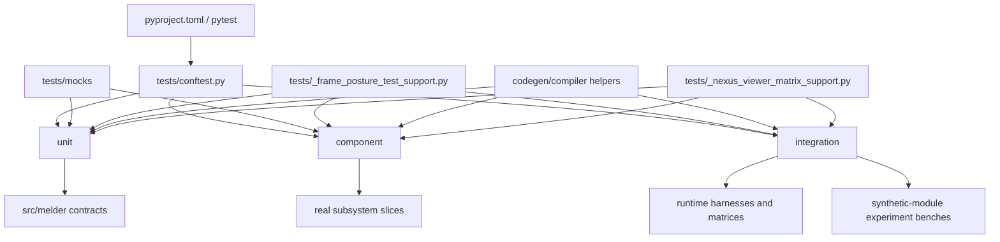

# Tests Architecture (C4)

## Metadata
- Doc ID: ARCH-TESTS-2026-01-22
- Status: in_progress
- Owner:
- Created: 2026-01-22
- Updated: 2026-06-13

## Scope and Intent
This document describes the tests architecture (C4) for `tests/` and how it
maps to `src/`. It is intended to stand on its own after context compaction.

The current test system is not one undifferentiated pytest pile. It is a
three-tier suite with shared bootstrap and shared runtime harness layers:
- `unit/`
- `component/`
- `integration/`

The suite also includes:
- shared top-level helpers in `tests/`
- deterministic fixture/mocks under `tests/mocks/`

## Indexing
This document is AUTHORED. Its only generated companion is
`tests_architecture_index.md`, rebuilt in the SAME pass as any edit:

```bash
python tools/system_documents/index_document.py \
    --doc system_docs/tests_architecture.md
```

Consume it by slicing rather than reading this document whole, and verify before
trusting a range:

```bash
python tools/system_documents/index_document.py \
    --doc system_docs/tests_architecture.md --slice "<section name>"
python tools/system_documents/index_document.py \
    --doc system_docs/tests_architecture.md --check
```

The index was STALE for an extended period before 2026-08-02 - 115 recorded lines
against a live 386 - which means every range it offered was wrong while still
parsing and still returning content. On mismatch: regenerate, never eyeball an
offset.

### Verifying the cited test paths and ranges in this document

THIS SIDE HAS NO GRAPH. `src_graph_index.md` is built from the source tree, so
every source-side citation gets a free resolution check and NOTHING here does.
A renamed or deleted test file leaves a citation that still parses and points
nowhere, and a range that drifts inside a file that still exists is invisible
even to an existence check. That is why the instructions require ranges to be
REMEASURED every pass rather than carried forward.

Run this after any pass that touches the test tree or this document:

```bash
python - <<'EOF'
import pathlib, re

here = pathlib.Path.cwd().resolve()
root = next((p for p in (here, *here.parents) if (p / "tests").is_dir()), here)
docs = next(p for p in (pathlib.Path("system_docs"), pathlib.Path("."))
            if list(p.glob("tests_*.md")))

CITE = re.compile(r"`?((?:tests|src)/[A-Za-z0-9_/.]*\.py):(\d+)(?:\s*-\s*(\d+))?`?")
PATH = re.compile(r"`((?:tests|src)/[^`]+\.py)`")

for doc in docs.glob("tests_*.md"):
    if doc.name.endswith("_index.md"):
        continue
    text = doc.read_text(encoding="utf-8")

    # 1. every cited path exists. Globs are statements about a set, not
    #    citations, so they are skipped rather than reported.
    for i, line in enumerate(text.split("\n"), 1):
        for p in PATH.findall(line):
            if "*" in p or "?" in p:
                continue
            if not (root / p).exists():
                print("MISSING", doc.name, i, p)

    # 2. every path:line range is in bounds
    for i, line in enumerate(text.split("\n"), 1):
        for m in CITE.finditer(line):
            f = root / m.group(1)
            if not f.exists():
                continue
            n = len(f.read_bytes().decode("utf-8", "replace").splitlines())
            s = int(m.group(2)); e = int(m.group(3) or m.group(2))
            if s < 1 or e > n or s > e:
                print("OUT OF BOUNDS", doc.name, i, m.group(0), "file has", n)

    # 3. every C1 record's end_line still matches the file on disk. This is the
    #    check that catches drift, and the one nothing else here can do.
    cur = None
    for i, line in enumerate(text.split("\n"), 1):
        m = re.match(r"^- path: `([^`]+)`", line)
        if m:
            cur = m.group(1); continue
        if cur:
            m2 = re.match(r"^\s+end_line:\s*(\d+)", line)
            if m2:
                f = root / cur
                if f.exists():
                    n = len(f.read_bytes().decode("utf-8", "replace").splitlines())
                    if int(m2.group(1)) != n:
                        print("STALE RANGE", doc.name, i, cur, m2.group(1), "->", n)
                cur = None
EOF
```

Measured ranges in this repository go stale FAST - a re-verification on 2026-08-03
found sixteen source-side ranges that had been green earlier the same day. A
range here is true as of its `verified_at` stamp and no longer.

## DO NOT ASSUME / Unknowns Gate
Rule: No Unverified Claims.
Any statement that is not directly supported by evidence must be treated as UNKNOWN.

Evidence means at least one of:
- A specific source file reference.
- A citation to an explicit, already-verified artifact.

If not evidenced => UNKNOWN.

UNKNOWN items must remain explicitly marked until the relevant source is read.

## Unknowns
- UNKNOWN: external CI shard/split behavior is not documented here.
  Why it matters: a future reader may otherwise assume the local pytest layout
  is the whole execution topology.
  Local evidence boundary: this checkout has no in-repo `.github/` workflow
  config, so there is no local CI topology to cite here.
  Where to investigate: external CI configuration outside this checkout.
  Current status: blocked on external evidence.

## System Context (C4)
The test system's actors and boundary, which are NOT the runtime's:

- ACTOR: a developer or CI runner invoking `pytest`, or `python -m pytest`. The
  root `tests/conftest.py` exists partly to make those two invocations behave
  identically - see `## Boot and Configuration Sequence`.
- SYSTEM: the pytest process, its collected test modules, the shared support
  modules at `tests/*.py`, the three `conftest.py` scopes, and the mock and
  experimentation trees.
- SUBJECT UNDER TEST: `src/melder`, imported from the local workspace rather
  than an installed distribution.
- EXTERNAL: none by design. No declared marker implies network or external IO,
  and the `component` marker is explicitly defined as "no external IO".

The test system therefore has ONE inbound edge (the runner), ONE outbound edge
(imports of `src/melder`), and no third-party service boundary to describe.

## System Boundary and External Interfaces
Primary test entrypoint:
- pytest, configured through `[tool.pytest.ini_options]` in `pyproject.toml`

Verified test-runner configuration:
- `testpaths = ["tests"]`
- `norecursedirs` excludes, VERIFIED against `pyproject.toml` on 2026-08-02 (the
  previous list named `codex`, `codex_agent_2` and `codex_agent_3`, none of
  which appear in the file - it was labelled "Verified" while being wrong):
  (These are LITERAL VALUES from `norecursedirs`, not references to anything.
  One of them happens to be a directory name that also appears elsewhere in this
  repository; it is listed because pytest excludes it, and removing it from this
  list would make the list wrong.)
  - `benchmarks`
  - `Plans`
  - `context_compass`
  - `UX_and_AIX_experiences`
  - `performance_hunt`
  - `profiles`
  - `build_scripts`
  - `.venv`
  - `.venv_new`
  - `__pycache__`
  - `__melder_cache__`

Declared markers (the ONLY suite-wide markers; everything else is a pytest
built-in such as `parametrize`, `xfail`, `skip`):
- `integration` - wires multiple real components together
- `component` - a small slice of real wiring, no external IO

Bootstrap entrypoint:
- `tests/conftest.py`
  - resolves project root
  - prepends `src/` to `sys.path` when present

Representative runtime-heavy entry fixtures:
- `fresh_singletons` / similar autouse fixtures in:
  - `tests/unit/melder/aether/test_rift_runtime_contracts.py`
  - `tests/integration/melder/aether/test_nexus_frame_surface_projection_integration.py`
  - `tests/integration/melder/aether/test_nexus_viewer_extended_surface_integration_matrix.py`
  - `tests/integration/melder/aether/rift/test_static_rift_json_testbench_integration.py`
  - `tests/integration/melder/aether/rift/test_capability_rift_json_testbench_integration.py`

## Architecture Summary (C4)
The test system is a pytest-driven mirror of the runtime’s architectural
boundaries.

At the top level:
1. pytest discovers tests from `tests/`.
2. `tests/conftest.py` injects `src/` into `sys.path` so the suite runs
   against the local workspace code rather than an installed package.
3. test files are organized into three tiers:
   - `unit`: isolated contract checks over classes/functions/subsystems
   - `component`: small real slices of wiring with limited collaborators
   - `integration`: real runtime stacks and multi-object behavioral matrices
4. shared helpers in `tests/` build common descriptor/viewer/runtime fixtures,
   frame-posture configuration helpers, compiler/codegen helpers, and other
   reusable runtime setup surfaces.
5. mock modules under `tests/mocks/` supply deterministic spellbook/scan-bind
   fixtures and crystallizer harness surfaces.
6. experimentation benches under `tests/experimentation/` provide reusable
   synthetic-module scenario runners that crystallizer component/integration
   tests consume indirectly.

The test tree broadly mirrors the production tree:
- `tests/unit/melder/aether`, `crystallizer`, `mutation_research`,
  `spellbook`, and `utilities`
- `tests/component/melder/aether`, `crystallizer`, `mutation_research`,
  `spellbook`, and `utilities`
- `tests/integration/melder/aether`, `conduit`, `crystallizer`,
  `live_sim`, `multithreading`, `mutation_research`, and `spellbook`

The most important recent integration addition is the dedicated
`tests/integration/melder/aether/rift/` harness layer:
- `StaticRiftJsonBench` builds a real static-room runtime stack.
- `CapabilityRiftJsonBench` builds a real capability-room runtime stack.
- the static bench drives a 100-row request matrix and 25 deterministic
  turn-script scenarios.
- the capability bench drives request and multistep turn-script scenarios over
  the live capability room.

## Entrypoints and Runtime Guardrails
- `pytest` is the only entrypoint, configured entirely through
  `[tool.pytest.ini_options]` in `pyproject.toml`. There is no `pytest.ini`,
  `tox.ini` or `setup.cfg` in this repository, so that block is the single
  source of runner truth.
- GUARDRAIL - IMPORT PATH: the root conftest inserts BOTH `src/` and the project
  root into `sys.path`. The second insertion is the non-obvious one: the tests
  tree is a NAMESPACE PACKAGE with no `__init__.py` anywhere, so
  `import tests.mocks...` and the `tests/_*_support` modules resolve only when
  the project root is importable. `python -m pytest` gets that free from the
  cwd; a bare `pytest` does not.
- GUARDRAIL - SCOPE: `testpaths` pins collection to `tests/`, and
  `norecursedirs` keeps benchmark, planning, experience and build trees out of
  collection even though they contain Python.
- GUARDRAIL - SINGLETON RESET: runtime-heavy tests reset singleton state rather
  than inheriting it. `Aether` is a process singleton, so without this a test
  file would silently depend on whichever file ran before it.

## Boot and Configuration Sequence
1. `pytest` reads `[tool.pytest.ini_options]` from `pyproject.toml`;
   `testpaths` and `norecursedirs` fix what is collectable before any test
   module is imported.
2. Root `tests/conftest.py` runs at collection time and performs the two
   `sys.path` insertions above, guarding each with a membership test so a
   repeated invocation cannot duplicate an entry.
   EVIDENCE: tests/conftest.py:1-22
3. Scoped conftests apply beneath their directories, and there are only THREE
   in the tree - the root, `tests/integration/melder/live_sim/conftest.py`
   (29 lines, providing `reset_aether_singleton_for_live_sim`), and
   `tests/unit/melder/aether/conduit/conftest.py` (444 lines, the largest by an
   order of magnitude, providing `fresh_singletons`, `configuration_automatic`,
   `configuration_dynamic` and the spellbook/aether/dev-ops stubs).
   That asymmetry is the shape of the harness: conduit tests need a rebuilt
   world per test, and almost nothing else does.
4. Collected modules import `melder` from the workspace `src/`.
5. Per-file and per-fixture setup builds the runtime objects a test needs;
   teardown cleans them and resets singleton state.

## Data Flows and Sequences
### Flow: Standard Pytest Run
1. pytest starts from `pyproject.toml` and targets `tests/`.
2. `tests/conftest.py` prepends `src/` to `sys.path`.
3. collected tests import local `melder` code.
4. file-local fixtures reset singleton runtime state when the suite touches
   `Aether`, `Nexus`, `Spellbook`, `Conduit`, or viewer singletons.
5. tests build local fixtures/harnesses, execute assertions, then cleanup or
   reset singleton state.

### Flow: Viewer/ACL Matrix Fixture Path
1. `_nexus_viewer_matrix_support.py` builds descriptor fixtures,
   compiled ACL surfaces, and `FrameViewer` instances.
2. unit/component/integration viewer tests reuse those fixtures to avoid
   re-encoding descriptor and ACL setup inline.

### Flow: Static/Capability Rift Bench Path
1. harness support module constructs real runtime objects:
   `Aether`, `Spellbook`, `Conduit`, `Nexus`, `Rift`, room, viewer, command,
   and workstation.
2. request driver accepts JSON-like payloads:
   - `surface`
   - `method`
   - `args`
   - `kwargs`
3. placeholder resolution maps manifest/object/turn references into live ids
   and runtime objects.
4. parametrized integration tests assert matrix expectations and cleanup the
   harness.

## Operational Invariants
- The suite is source-tree first: tests run against `src/` from the local
  workspace.
- The repo uses explicit tier directories instead of a single flat test bucket.
- Runtime-heavy tests actively reset singleton state; they do not assume one
  test file can inherit another test’s live runtime.
- Component tests are intended to sit between unit and integration and use
  small real slices plus selective stubbing, per `tests/component/INFO.MD`.
- The static Rift bench is intentionally real-runtime, not pure mocks.
- The capability Rift bench is intentionally real-runtime, not pure mocks.

## Source Coverage and Evidence
Direct evidence used in this pass:
- `pyproject.toml`
- `tests/conftest.py`
- `tests/_frame_posture_test_support.py`
- `tests/_codegen_system_support.py`
- `tests/component/INFO.MD`
- `tests/_nexus_viewer_matrix_support.py`
- `tests/component/melder/spellbook/compiler_test_helpers.py`
- `tests/component/melder/spellbook/spell_compiler_runtime_test_support.py`
- `tests/experimentation/unittest_synthetic_module_edge_cases_testbench.py`
- `tests/experimentation/physical_to_synthetic_module_swap_semantics_testbench.py`
- `tests/integration/melder/aether/test_nexus_frame_surface_projection_integration.py`
- `tests/integration/melder/aether/test_nexus_viewer_extended_surface_integration_matrix.py`
- `tests/integration/melder/aether/rift/static_rift_json_testbench_support.py`
- `tests/integration/melder/aether/rift/capability_rift_json_testbench_support.py`
- `tests/integration/melder/aether/rift/test_static_rift_json_testbench_integration.py`
- `tests/integration/melder/aether/rift/test_capability_rift_json_testbench_integration.py`
- `tests/unit/melder/aether/test_nexus.py`
- `tests/unit/melder/aether/test_rift_runtime_contracts.py`
- `tests/unit/melder/aether/test_workstation.py`
- `tests/unit/melder/aether/test_command_system_direct.py`
- direct filesystem inventory over `tests/`

Current Python test inventory from direct filesystem count:
- `unit/`: 334 `.py` files
- `component/`: 81 `.py` files
- `integration/`: 88 `.py` files
- `mocks/`: 42 `.py` files

## Core Responsibilities
- Unit tests validate class- and method-level runtime contracts.
- Component tests validate small, real slices of wiring without requiring a
  full end-to-end stack.
- Integration tests validate real runtime stacks, cross-object behavior, and
  matrix-style scenario coverage.
- Shared support modules build deterministic descriptors, viewers, and room
  harnesses so integration tests do not duplicate setup logic.
- Frame-posture support centralizes automatic/dynamic runtime configuration
  helpers reused across spellbook, conduit, crystallizer, and
  mutation-research tests.
- Codegen/compiler support centralizes namespace doubles, event/memory doubles,
  and compiler-phase runner helpers reused across codegen-system and spell
  compiler test lanes.
- Experimentation benches provide reusable synthetic-module and importlib
  scenario runners for crystallizer tests without inlining large scenario
  graphs into the test files themselves.
- Mock modules provide deterministic fixture classes/modules for spellbook,
  scan/bind, and protocol-oriented test cases.

## C3 Components Overview
- Runner and path bootstrap
  Purpose: start pytest from the repo and resolve imports against `src/`.
- Shared support and matrix fixtures
  Purpose: provide reusable runtime support surfaces including
  descriptor/viewer fixtures, frame-posture helpers, compiler/codegen helpers,
  and experimentation benches.
- Unit suite
  Purpose: validate isolated contracts across `aether`, `crystallizer`,
  `mutation_research`, `spellbook`, and `utilities`.
- Component suite
  Purpose: validate small real slices across `aether`, `crystallizer`,
  `mutation_research`, `spellbook`, and `utilities`.
- Integration suite
  Purpose: validate real runtime wiring across `aether`, `rift`, `conduit`,
  `crystallizer`, `live_sim`, `multithreading`, `mutation_research`, and
  `spellbook`.
- Mock corpus
  Purpose: provide deterministic helper modules/classes for spellbook/scan-bind
  tests and crystallizer harness-backed cases.

## C2 Subcomponents Overview
- `tests/conftest.py`
  Purpose: shared import/bootstrap hook.
- `tests/_frame_posture_test_support.py`
  Purpose: shared automatic/dynamic frame-posture helper surface used across
  runtime-heavy spellbook, conduit, crystallizer, and mutation-research tests.
- `tests/_codegen_system_support.py`
  Purpose: shared codegen-system doubles and helper builders for compiler and
  codegen test lanes.
- `tests/_nexus_viewer_matrix_support.py`
  Purpose: shared descriptor + compiled ACL + viewer fixture builder.
- `tests/component/melder/spellbook/compiler_test_helpers.py`
  Purpose: shared current-surface compiler phase runner helpers for spellbook
  compiler component and compatibility tests.
- `tests/component/melder/spellbook/spell_compiler_runtime_test_support.py`
  Purpose: shared runtime reset and phase-runner helpers for spell compiler
  component/integration tests.
- `tests/integration/melder/aether/rift/static_rift_json_testbench_support.py`
  Purpose: reusable static-room real-runtime harness and JSON dispatch layer.
- `tests/integration/melder/aether/rift/capability_rift_json_testbench_support.py`
  Purpose: reusable capability-room real-runtime harness and JSON dispatch layer.
- `tests/experimentation/*`
  Purpose: reusable synthetic-module and importlib scenario runners consumed by
  crystallizer component/integration tests.
- `tests/unit/melder/aether/*`
  Purpose: dense coverage for Nexus/Rift/ACL/workstation/descriptor/runtime
  contracts.
- `tests/component/melder/aether/*`
  Purpose: small real slices over descriptor, ACL, viewer, and conduit/dev_ops
  boundaries.
- `tests/integration/melder/aether/*`
  Purpose: real runtime projection, ACL chain/compiler, passive ingest, and
  AR integration matrices.
- `tests/integration/melder/aether/rift/*`
  Purpose: room-mode JSON request and multistep turn-script benches.

## Open Questions
- Whether any external CI system shards or subsets the suite beyond the local
  pytest entrypoint; no in-repo CI workflow evidence exists in this checkout.
- Whether a formal marker taxonomy should exist for larger integration lanes;
  no marker taxonomy was evidenced in `pyproject.toml` during this pass.

## Failure Modes and Error Paths
- IMPORT-PATH FAILURE: invoking a bare `pytest` from a directory where the
  project root is not importable breaks `tests.mocks` and `tests/_*_support`
  imports. The root conftest is what prevents this, and it is the single point
  where that protection lives.
- SINGLETON BLEED: a runtime-heavy test that does not reset `Aether`, `Nexus`
  or `Spellbook` state leaves the next test running against a world it did not
  build. The failure surfaces in an unrelated test file, which is what makes it
  expensive - the reset fixtures exist to stop it.
- COLLECTION DRIFT: a new top-level tree containing Python that is not added to
  `norecursedirs` is collected silently. It does not error; it just runs.
- HARNESS DRIFT (the one nothing catches): this document and
  `tests_components.md` cite TEST paths, and there is NO graph on this side to
  join against. A renamed or deleted test file leaves a citation that still
  parses and points nowhere. Existence must be checked explicitly; see
  `## Indexing` and the recipe in `tests_components_instructions.md`.

## C1 Code Map (Core Only)
Core is the deduplicated union of every `Key Files (C1)` list in
`tests_components.md`, plus the harness surfaces this document names as
entrypoints. Every range below was MEASURED from disk on 2026-08-02, not carried
forward - there is no graph on this side to join against, so nothing else would
have caught a stale range.

The previous version of this section was a bare path list with no ranges, no LOC
and no timestamps, and it included a DIRECTORY (`tests/mocks/spellbook/`), which
carries no evidence and cannot be remeasured. The directory was expanded into its
constituent files.

- path: `pyproject.toml`
  start_line: 1
  end_line: 239
  loc: 239
  verified_at: 2026-08-02T15:15:48Z
- path: `tests/conftest.py`
  start_line: 1
  end_line: 22
  loc: 22
  verified_at: 2026-08-02T15:15:48Z
- path: `tests/_frame_posture_test_support.py`
  start_line: 1
  end_line: 263
  loc: 263
  verified_at: 2026-08-02T15:15:48Z
- path: `tests/component/INFO.MD`
  start_line: 1
  end_line: 17
  loc: 17
  verified_at: 2026-08-02T15:15:48Z
- path: `tests/_nexus_viewer_matrix_support.py`
  start_line: 1
  end_line: 638
  loc: 638
  verified_at: 2026-08-02T15:15:48Z
- path: `tests/experimentation/unittest_synthetic_module_edge_cases_testbench.py`
  start_line: 1
  end_line: 868
  loc: 868
  verified_at: 2026-08-02T15:15:48Z
- path: `tests/experimentation/physical_to_synthetic_module_swap_semantics_testbench.py`
  start_line: 1
  end_line: 920
  loc: 920
  verified_at: 2026-08-02T15:15:48Z
- path: `tests/integration/melder/aether/test_nexus_frame_surface_projection_integration.py`
  start_line: 1
  end_line: 215
  loc: 215
  verified_at: 2026-08-02T15:15:48Z
- path: `tests/integration/melder/aether/test_nexus_viewer_extended_surface_integration_matrix.py`
  start_line: 1
  end_line: 586
  loc: 586
  verified_at: 2026-08-02T15:15:48Z
- path: `tests/integration/melder/aether/rift/static_rift_json_testbench_support.py`
  start_line: 1
  end_line: 606
  loc: 606
  verified_at: 2026-08-02T15:15:48Z
- path: `tests/integration/melder/aether/rift/capability_rift_json_testbench_support.py`
  start_line: 1
  end_line: 487
  loc: 487
  verified_at: 2026-08-02T15:15:48Z
- path: `tests/integration/melder/aether/rift/test_static_rift_json_testbench_integration.py`
  start_line: 1
  end_line: 935
  loc: 935
  verified_at: 2026-08-02T15:15:48Z
- path: `tests/integration/melder/aether/rift/test_capability_rift_json_testbench_integration.py`
  start_line: 1
  end_line: 1148
  loc: 1148
  verified_at: 2026-08-02T15:15:48Z
- path: `tests/unit/melder/aether/test_nexus.py`
  start_line: 1
  end_line: 6350
  loc: 6350
  verified_at: 2026-08-02T15:15:48Z
- path: `tests/unit/melder/aether/test_rift_runtime_contracts.py`
  start_line: 1
  end_line: 454
  loc: 454
  verified_at: 2026-08-02T15:15:48Z
- path: `tests/unit/melder/aether/test_workstation.py`
  start_line: 1
  end_line: 282
  loc: 282
  verified_at: 2026-08-02T15:15:48Z
- path: `tests/unit/melder/aether/test_command_system_direct.py`
  start_line: 1
  end_line: 457
  loc: 457
  verified_at: 2026-08-02T15:15:48Z
- path: `tests/mocks/spellbook/contract_classes.py`
  start_line: 1
  end_line: 425
  loc: 425
  verified_at: 2026-08-02T15:15:48Z
- path: `tests/mocks/spellbook/core_classes.py`
  start_line: 1
  end_line: 245
  loc: 245
  verified_at: 2026-08-02T15:15:48Z
- path: `tests/mocks/spellbook/deep_layers.py`
  start_line: 1
  end_line: 1255
  loc: 1255
  verified_at: 2026-08-02T15:15:48Z
- path: `tests/mocks/spellbook/factories.py`
  start_line: 1
  end_line: 174
  loc: 174
  verified_at: 2026-08-02T15:15:48Z
- path: `tests/mocks/spellbook/protocols.py`
  start_line: 1
  end_line: 74
  loc: 74
  verified_at: 2026-08-02T15:15:48Z
- path: `tests/mocks/spellbook/scan_bind_module_bad_metadata.py`
  start_line: 1
  end_line: 28
  loc: 28
  verified_at: 2026-08-02T15:15:48Z
- path: `tests/mocks/spellbook/scan_bind_module_core.py`
  start_line: 1
  end_line: 98
  loc: 98
  verified_at: 2026-08-02T15:15:48Z
- path: `tests/mocks/spellbook/scan_bind_module_duplicate.py`
  start_line: 1
  end_line: 59
  loc: 59
  verified_at: 2026-08-02T15:15:48Z
- path: `tests/mocks/spellbook/scan_bind_module_empty.py`
  start_line: 1
  end_line: 25
  loc: 25
  verified_at: 2026-08-02T15:15:48Z
- path: `tests/mocks/spellbook/scan_bind_module_lambda.py`
  start_line: 1
  end_line: 42
  loc: 42
  verified_at: 2026-08-02T15:15:48Z
- path: `tests/mocks/spellbook/scan_bind_module_lambda_invalid.py`
  start_line: 1
  end_line: 14
  loc: 14
  verified_at: 2026-08-02T15:15:48Z
- path: `tests/mocks/spellbook/scan_bind_module_reexport.py`
  start_line: 1
  end_line: 8
  loc: 8
  verified_at: 2026-08-02T15:15:48Z
- path: `tests/mocks/spellbook/scan_bind_module_wrapped.py`
  start_line: 1
  end_line: 123
  loc: 123
  verified_at: 2026-08-02T15:15:48Z

## Diagrams
### ASCII Diagram (C4)
```text
[pytest / pyproject]
        |
        v
[tests/conftest.py path bootstrap]
        |
        v
[unit/] [component/] [integration/]
   |         |             |
   |         |             +--> [real runtime harnesses]
   |         |             +--> [viewer/ACL matrices]
   |         |             +--> [synthetic-module experiment benches]
   |         |
   |         +--> [small real slices]
   |
   +--> [isolated contract checks]

[frame-posture support] and [codegen/compiler helpers] feed runtime-heavy lanes
[shared helpers + mocks] feed all three tiers
```

### Mermaid Diagram (C4)


## Information Sources
- `pyproject.toml`
- `tests/conftest.py`
- `tests/_frame_posture_test_support.py`
- `tests/_codegen_system_support.py`
- `tests/component/INFO.MD`
- `tests/_nexus_viewer_matrix_support.py`
- `tests/component/melder/spellbook/compiler_test_helpers.py`
- `tests/component/melder/spellbook/spell_compiler_runtime_test_support.py`
- `tests/integration/melder/aether/test_nexus_frame_surface_projection_integration.py`
- `tests/integration/melder/aether/test_nexus_viewer_extended_surface_integration_matrix.py`
- `tests/integration/melder/aether/rift/static_rift_json_testbench_support.py`
- `tests/integration/melder/aether/rift/capability_rift_json_testbench_support.py`
- `tests/integration/melder/aether/rift/test_static_rift_json_testbench_integration.py`
- `tests/integration/melder/aether/rift/test_capability_rift_json_testbench_integration.py`
- `tests/unit/melder/aether/test_nexus.py`
- `tests/unit/melder/aether/test_rift_runtime_contracts.py`
- `tests/unit/melder/aether/test_workstation.py`
- `tests/unit/melder/aether/test_command_system_direct.py`
- direct filesystem inventory of `tests/`

## Context / Handoff Summary

RECOMPOSED 2026-08-02 to the Required Section Contract - which is
`src_architecture.md`'s contract name for name, because the pair must stay
navigable by the same query.

- Five sections RENAMED to contract names (`C4 Architecture Summary` ->
  `Architecture Summary (C4)`, `External Interfaces and Entry Points` ->
  `System Boundary and External Interfaces`, `Data Flows and Lifecycle` ->
  `Data Flows and Sequences`, `Invariants and Guarantees` ->
  `Operational Invariants`, `C1 Code Map (Key Paths)` ->
  `C1 Code Map (Core Only)`).
- Four sections ADDED because they did not exist: `## Indexing`,
  `## System Context (C4)`, `## Boot and Configuration Sequence`,
  `## Failure Modes and Error Paths`.
- `## C1 Code Map (Core Only)` REBUILT: 30 entries, each with path, range, LOC
  and `verified_at` measured from disk. The previous version was a bare path
  list with no ranges at all, and it contained a DIRECTORY entry
  (`tests/mocks/spellbook/`) which carries no evidence and cannot be
  remeasured; it was expanded into its constituent files.
- ONE FALSE "VERIFIED" CLAIM CORRECTED. The runner section listed
  `norecursedirs` as excluding `codex`, `codex_agent_2` and `codex_agent_3`
  under the heading "Verified test-runner configuration". None of those three
  appears in `pyproject.toml`. The real list is now recorded, and the two
  declared markers (`integration`, `component`) were undocumented entirely.
- `## Table of Contents` and `## Documentation Quality Standard` MOVED, NOT
  DELETED, to the recomposition patch lane, each superseded by a named
  authority. Until re-absorbed they live in neither canonical document.
The test system is now mapped as a real three-tier pytest suite with shared
runtime reset, shared matrix fixtures, and dedicated static/capability AR
integration harnesses. The next highest-value doc gap is deeper per-component
coverage inside `tests_components.md` and any external CI/sharding
documentation.
