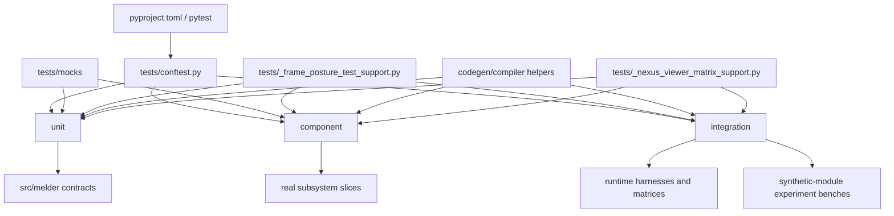

# Tests Architecture (C4)

## Metadata
- Doc ID: ARCH-TESTS-2026-01-22
- Status: in_progress
- Owner:
- Created: 2026-01-22
- Updated: 2026-06-13

## Scope and Intent
This document describes the tests architecture (C4) for `tests/` and how it
maps to `src/`. It is intended to stand on its own after context compaction.

The current test system is not one undifferentiated pytest pile. It is a
three-tier suite with shared bootstrap and shared runtime harness layers:
- `unit/`
- `component/`
- `integration/`

The suite also includes:
- shared top-level helpers in `tests/`
- deterministic fixture/mocks under `tests/mocks/`

## Documentation Quality Standard
This document is durable context and must stand on its own.

Rules:
- No handwaving. Every claim is grounded in source evidence or marked as unknown.
- Test entrypoints and runtime reset flow are explicit.
- Tier boundaries are described in terms of what is actually in the repo.
- Shared harnesses and support layers are named directly.
- Evidence list is updated when new files are used.

## DO NOT ASSUME / Unknowns Gate
Rule: No Unverified Claims.
Any statement that is not directly supported by evidence must be treated as UNKNOWN.

Evidence means at least one of:
- A specific source file reference.
- A citation to an explicit, already-verified artifact.

If not evidenced => UNKNOWN.

UNKNOWN items must remain explicitly marked until the relevant source is read.

## Unknowns
- UNKNOWN: external CI shard/split behavior is not documented here.
  Why it matters: a future reader may otherwise assume the local pytest layout
  is the whole execution topology.
  Local evidence boundary: this checkout has no in-repo `.github/` workflow
  config, so there is no local CI topology to cite here.
  Where to investigate: external CI configuration outside this checkout.
  Current status: blocked on external evidence.

## Table of Contents
- Scope and Intent
- Documentation Quality Standard
- DO NOT ASSUME / Unknowns Gate
- Unknowns
- Source Coverage and Evidence
- C4 Architecture Summary
- External Interfaces and Entry Points
- Core Responsibilities
- Data Flows and Lifecycle
- Invariants and Guarantees
- C3 Components Overview
- C2 Subcomponents Overview
- C1 Code Map (Key Paths)
- Diagrams
- Information Sources
- Open Questions
- Context / Handoff Summary

## Source Coverage and Evidence
Direct evidence used in this pass:
- `pyproject.toml`
- `tests/conftest.py`
- `tests/_frame_posture_test_support.py`
- `tests/_codegen_system_support.py`
- `tests/component/INFO.MD`
- `tests/_nexus_viewer_matrix_support.py`
- `tests/component/melder/spellbook/compiler_test_helpers.py`
- `tests/component/melder/spellbook/spell_compiler_runtime_test_support.py`
- `tests/experimentation/unittest_synthetic_module_edge_cases_testbench.py`
- `tests/experimentation/physical_to_synthetic_module_swap_semantics_testbench.py`
- `tests/integration/melder/aether/test_nexus_frame_surface_projection_integration.py`
- `tests/integration/melder/aether/test_nexus_viewer_extended_surface_integration_matrix.py`
- `tests/integration/melder/aether/rift/static_rift_json_testbench_support.py`
- `tests/integration/melder/aether/rift/capability_rift_json_testbench_support.py`
- `tests/integration/melder/aether/rift/test_static_rift_json_testbench_integration.py`
- `tests/integration/melder/aether/rift/test_capability_rift_json_testbench_integration.py`
- `tests/unit/melder/aether/test_nexus.py`
- `tests/unit/melder/aether/test_rift_runtime_contracts.py`
- `tests/unit/melder/aether/test_workstation.py`
- `tests/unit/melder/aether/test_command_system_direct.py`
- direct filesystem inventory over `tests/`

Current Python test inventory from direct filesystem count:
- `unit/`: 334 `.py` files
- `component/`: 81 `.py` files
- `integration/`: 88 `.py` files
- `mocks/`: 42 `.py` files

## C4 Architecture Summary
The test system is a pytest-driven mirror of the runtime’s architectural
boundaries.

At the top level:
1. pytest discovers tests from `tests/`.
2. `tests/conftest.py` injects `src/` into `sys.path` so the suite runs
   against the local workspace code rather than an installed package.
3. test files are organized into three tiers:
   - `unit`: isolated contract checks over classes/functions/subsystems
   - `component`: small real slices of wiring with limited collaborators
   - `integration`: real runtime stacks and multi-object behavioral matrices
4. shared helpers in `tests/` build common descriptor/viewer/runtime fixtures,
   frame-posture configuration helpers, compiler/codegen helpers, and other
   reusable runtime setup surfaces.
5. mock modules under `tests/mocks/` supply deterministic spellbook/scan-bind
   fixtures and crystallizer harness surfaces.
6. experimentation benches under `tests/experimentation/` provide reusable
   synthetic-module scenario runners that crystallizer component/integration
   tests consume indirectly.

The test tree broadly mirrors the production tree:
- `tests/unit/melder/aether`, `crystallizer`, `mutation_research`,
  `spellbook`, and `utilities`
- `tests/component/melder/aether`, `crystallizer`, `mutation_research`,
  `spellbook`, and `utilities`
- `tests/integration/melder/aether`, `conduit`, `crystallizer`,
  `live_sim`, `multithreading`, `mutation_research`, and `spellbook`

The most important recent integration addition is the dedicated
`tests/integration/melder/aether/rift/` harness layer:
- `StaticRiftJsonBench` builds a real static-room runtime stack.
- `CapabilityRiftJsonBench` builds a real capability-room runtime stack.
- the static bench drives a 100-row request matrix and 25 deterministic
  turn-script scenarios.
- the capability bench drives request and multistep turn-script scenarios over
  the live capability room.

## External Interfaces and Entry Points
Primary test entrypoint:
- pytest, configured through `[tool.pytest.ini_options]` in `pyproject.toml`

Verified test-runner configuration:
- `testpaths = ["tests"]`
- `norecursedirs` excludes:
  - `benchmarks`
  - `Plans`
  - `codex`
  - `codex_agent_2`
  - `codex_agent_3`
  - virtualenv/cache directories

Bootstrap entrypoint:
- `tests/conftest.py`
  - resolves project root
  - prepends `src/` to `sys.path` when present

Representative runtime-heavy entry fixtures:
- `fresh_singletons` / similar autouse fixtures in:
  - `tests/unit/melder/aether/test_rift_runtime_contracts.py`
  - `tests/integration/melder/aether/test_nexus_frame_surface_projection_integration.py`
  - `tests/integration/melder/aether/test_nexus_viewer_extended_surface_integration_matrix.py`
  - `tests/integration/melder/aether/rift/test_static_rift_json_testbench_integration.py`
  - `tests/integration/melder/aether/rift/test_capability_rift_json_testbench_integration.py`

## Core Responsibilities
- Unit tests validate class- and method-level runtime contracts.
- Component tests validate small, real slices of wiring without requiring a
  full end-to-end stack.
- Integration tests validate real runtime stacks, cross-object behavior, and
  matrix-style scenario coverage.
- Shared support modules build deterministic descriptors, viewers, and room
  harnesses so integration tests do not duplicate setup logic.
- Frame-posture support centralizes automatic/dynamic runtime configuration
  helpers reused across spellbook, conduit, crystallizer, and
  mutation-research tests.
- Codegen/compiler support centralizes namespace doubles, event/memory doubles,
  and compiler-phase runner helpers reused across codegen-system and spell
  compiler test lanes.
- Experimentation benches provide reusable synthetic-module and importlib
  scenario runners for crystallizer tests without inlining large scenario
  graphs into the test files themselves.
- Mock modules provide deterministic fixture classes/modules for spellbook,
  scan/bind, and protocol-oriented test cases.

## Data Flows and Lifecycle
### Flow: Standard Pytest Run
1. pytest starts from `pyproject.toml` and targets `tests/`.
2. `tests/conftest.py` prepends `src/` to `sys.path`.
3. collected tests import local `melder` code.
4. file-local fixtures reset singleton runtime state when the suite touches
   `Aether`, `Nexus`, `Spellbook`, `Conduit`, or viewer singletons.
5. tests build local fixtures/harnesses, execute assertions, then cleanup or
   reset singleton state.

### Flow: Viewer/ACL Matrix Fixture Path
1. `_nexus_viewer_matrix_support.py` builds descriptor fixtures,
   compiled ACL surfaces, and `FrameViewer` instances.
2. unit/component/integration viewer tests reuse those fixtures to avoid
   re-encoding descriptor and ACL setup inline.

### Flow: Static/Capability Rift Bench Path
1. harness support module constructs real runtime objects:
   `Aether`, `Spellbook`, `Conduit`, `Nexus`, `Rift`, room, viewer, command,
   and workstation.
2. request driver accepts JSON-like payloads:
   - `surface`
   - `method`
   - `args`
   - `kwargs`
3. placeholder resolution maps manifest/object/turn references into live ids
   and runtime objects.
4. parametrized integration tests assert matrix expectations and cleanup the
   harness.

## Invariants and Guarantees
- The suite is source-tree first: tests run against `src/` from the local
  workspace.
- The repo uses explicit tier directories instead of a single flat test bucket.
- Runtime-heavy tests actively reset singleton state; they do not assume one
  test file can inherit another test’s live runtime.
- Component tests are intended to sit between unit and integration and use
  small real slices plus selective stubbing, per `tests/component/INFO.MD`.
- The static Rift bench is intentionally real-runtime, not pure mocks.
- The capability Rift bench is intentionally real-runtime, not pure mocks.

## C3 Components Overview
- Runner and path bootstrap
  Purpose: start pytest from the repo and resolve imports against `src/`.
- Shared support and matrix fixtures
  Purpose: provide reusable runtime support surfaces including
  descriptor/viewer fixtures, frame-posture helpers, compiler/codegen helpers,
  and experimentation benches.
- Unit suite
  Purpose: validate isolated contracts across `aether`, `crystallizer`,
  `mutation_research`, `spellbook`, and `utilities`.
- Component suite
  Purpose: validate small real slices across `aether`, `crystallizer`,
  `mutation_research`, `spellbook`, and `utilities`.
- Integration suite
  Purpose: validate real runtime wiring across `aether`, `rift`, `conduit`,
  `crystallizer`, `live_sim`, `multithreading`, `mutation_research`, and
  `spellbook`.
- Mock corpus
  Purpose: provide deterministic helper modules/classes for spellbook/scan-bind
  tests and crystallizer harness-backed cases.

## C2 Subcomponents Overview
- `tests/conftest.py`
  Purpose: shared import/bootstrap hook.
- `tests/_frame_posture_test_support.py`
  Purpose: shared automatic/dynamic frame-posture helper surface used across
  runtime-heavy spellbook, conduit, crystallizer, and mutation-research tests.
- `tests/_codegen_system_support.py`
  Purpose: shared codegen-system doubles and helper builders for compiler and
  codegen test lanes.
- `tests/_nexus_viewer_matrix_support.py`
  Purpose: shared descriptor + compiled ACL + viewer fixture builder.
- `tests/component/melder/spellbook/compiler_test_helpers.py`
  Purpose: shared current-surface compiler phase runner helpers for spellbook
  compiler component and compatibility tests.
- `tests/component/melder/spellbook/spell_compiler_runtime_test_support.py`
  Purpose: shared runtime reset and phase-runner helpers for spell compiler
  component/integration tests.
- `tests/integration/melder/aether/rift/static_rift_json_testbench_support.py`
  Purpose: reusable static-room real-runtime harness and JSON dispatch layer.
- `tests/integration/melder/aether/rift/capability_rift_json_testbench_support.py`
  Purpose: reusable capability-room real-runtime harness and JSON dispatch layer.
- `tests/experimentation/*`
  Purpose: reusable synthetic-module and importlib scenario runners consumed by
  crystallizer component/integration tests.
- `tests/unit/melder/aether/*`
  Purpose: dense coverage for Nexus/Rift/ACL/workstation/descriptor/runtime
  contracts.
- `tests/component/melder/aether/*`
  Purpose: small real slices over descriptor, ACL, viewer, and conduit/dev_ops
  boundaries.
- `tests/integration/melder/aether/*`
  Purpose: real runtime projection, ACL chain/compiler, passive ingest, and
  AR integration matrices.
- `tests/integration/melder/aether/rift/*`
  Purpose: room-mode JSON request and multistep turn-script benches.

## C1 Code Map (Key Paths)
- `pyproject.toml`
- `tests/conftest.py`
- `tests/_frame_posture_test_support.py`
- `tests/component/INFO.MD`
- `tests/_nexus_viewer_matrix_support.py`
- `tests/experimentation/unittest_synthetic_module_edge_cases_testbench.py`
- `tests/experimentation/physical_to_synthetic_module_swap_semantics_testbench.py`
- `tests/integration/melder/aether/test_nexus_frame_surface_projection_integration.py`
- `tests/integration/melder/aether/test_nexus_viewer_extended_surface_integration_matrix.py`
- `tests/integration/melder/aether/rift/static_rift_json_testbench_support.py`
- `tests/integration/melder/aether/rift/capability_rift_json_testbench_support.py`
- `tests/integration/melder/aether/rift/test_static_rift_json_testbench_integration.py`
- `tests/integration/melder/aether/rift/test_capability_rift_json_testbench_integration.py`
- `tests/unit/melder/aether/test_nexus.py`
- `tests/unit/melder/aether/test_rift_runtime_contracts.py`
- `tests/unit/melder/aether/test_workstation.py`
- `tests/unit/melder/aether/test_command_system_direct.py`
- `tests/mocks/spellbook/`

## Diagrams
### ASCII Diagram (C4)
```text
[pytest / pyproject]
        |
        v
[tests/conftest.py path bootstrap]
        |
        v
[unit/] [component/] [integration/]
   |         |             |
   |         |             +--> [real runtime harnesses]
   |         |             +--> [viewer/ACL matrices]
   |         |             +--> [synthetic-module experiment benches]
   |         |
   |         +--> [small real slices]
   |
   +--> [isolated contract checks]

[frame-posture support] and [codegen/compiler helpers] feed runtime-heavy lanes
[shared helpers + mocks] feed all three tiers
```

### Mermaid Diagram (C4)


## Information Sources
- `pyproject.toml`
- `tests/conftest.py`
- `tests/_frame_posture_test_support.py`
- `tests/_codegen_system_support.py`
- `tests/component/INFO.MD`
- `tests/_nexus_viewer_matrix_support.py`
- `tests/component/melder/spellbook/compiler_test_helpers.py`
- `tests/component/melder/spellbook/spell_compiler_runtime_test_support.py`
- `tests/integration/melder/aether/test_nexus_frame_surface_projection_integration.py`
- `tests/integration/melder/aether/test_nexus_viewer_extended_surface_integration_matrix.py`
- `tests/integration/melder/aether/rift/static_rift_json_testbench_support.py`
- `tests/integration/melder/aether/rift/capability_rift_json_testbench_support.py`
- `tests/integration/melder/aether/rift/test_static_rift_json_testbench_integration.py`
- `tests/integration/melder/aether/rift/test_capability_rift_json_testbench_integration.py`
- `tests/unit/melder/aether/test_nexus.py`
- `tests/unit/melder/aether/test_rift_runtime_contracts.py`
- `tests/unit/melder/aether/test_workstation.py`
- `tests/unit/melder/aether/test_command_system_direct.py`
- direct filesystem inventory of `tests/`

## Open Questions
- Whether any external CI system shards or subsets the suite beyond the local
  pytest entrypoint; no in-repo CI workflow evidence exists in this checkout.
- Whether a formal marker taxonomy should exist for larger integration lanes;
  no marker taxonomy was evidenced in `pyproject.toml` during this pass.

## Context / Handoff Summary
The test system is now mapped as a real three-tier pytest suite with shared
runtime reset, shared matrix fixtures, and dedicated static/capability AR
integration harnesses. The next highest-value doc gap is deeper per-component
coverage inside `tests_components.md` and any external CI/sharding
documentation.
