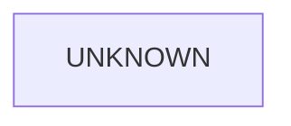

# Tests Architecture (C4)

## Metadata
- Doc ID: ARCH-TESTS-2026-01-22
- Status: draft
- Owner:
- Created: 2026-01-22
- Updated: 2026-01-22

## Scope and Intent
This document describes the tests architecture (C4) for `tests/` and how it
maps to `src/`. It is intentionally conservative and will not assert behavior
without evidence.

## Documentation Quality Standard
This document is durable context and must stand on its own.

Rules:
- No handwaving. Every claim is grounded in source evidence or marked as unknown.
- Entry points and test execution flow must be explicit and ordered.
- Ownership, lifecycle, and cleanup ordering are explicit for test systems.
- Invariants and failure modes are stated.
- ASCII and Mermaid diagrams included for core flows.
- Evidence list updated when new sources are used.

## DO NOT ASSUME / Unknowns Gate
Rule: No Unverified Claims.
Any statement that is not directly supported by evidence must be treated as UNKNOWN.

Evidence means at least one of:
- A specific source file reference (preferred: file + symbol/method/class name).
- A citation to an explicit, already-verified artifact (e.g., a prior approved doc section).

If not evidenced => UNKNOWN.

UNKNOWN items must be explicitly labeled UNKNOWN (or added to the Unknowns section).
UNKNOWN items must be investigated by reading the relevant source(s).
If investigation cannot be completed (missing source access, ambiguity, or time),
the item must remain UNKNOWN and must not be promoted to fact.

No reasonable assumptions.
Do not infer behavior from naming, patterns, conventions, or typical frameworks.
Only the code/docs count.

When unsure:
- Mark it UNKNOWN.
- Identify the most likely evidence target (file + symbol).
- Investigate, then update the doc (or leave it UNKNOWN).

## Unknowns
This section is a living list of claims currently not backed by evidence.
Each item must include:
- What is unknown.
- Why it matters (impact).
- Where to investigate (file(s) + symbol(s)).
- Current status (uninvestigated / investigating / blocked).

## Table of Contents
- Scope and Intent
- Documentation Quality Standard
- DO NOT ASSUME / Unknowns Gate
- Unknowns
- C4 Architecture Summary
- External Interfaces and Entry Points
- Core Responsibilities
- Data Flows and Lifecycle
- Invariants and Guarantees
- C3 Components Overview
- C2 Subcomponents Overview
- C1 Code Map (Key Paths)
- Diagrams
- Information Sources
- Open Questions
- Context / Handoff Summary

## C4 Architecture Summary
UNKNOWN: Tests architecture is not yet mapped to src boundaries.

## External Interfaces and Entry Points
UNKNOWN: Test runner and entrypoint expectations not yet verified.

## Core Responsibilities
UNKNOWN: Test suite responsibilities are not yet inventoried.

## Data Flows and Lifecycle
UNKNOWN: Test lifecycle, setup/teardown, and orchestration flow not yet verified.

## Invariants and Guarantees
UNKNOWN: Test invariants and guarantees not yet identified.

## C3 Components Overview
UNKNOWN: Test components are not yet cataloged. See `context_compass/system_docs/tests_components.md` once populated.

## C2 Subcomponents Overview
UNKNOWN: Test subcomponents are not yet cataloged. See `context_compass/system_docs/tests_components.md` once populated.

## C1 Code Map (Key Paths)
UNKNOWN: Test code map not yet enumerated.

## Diagrams
### ASCII Diagram (C4)
```
UNKNOWN
```

### Mermaid Diagram (C4)


## Information Sources
- `tests/`

## Open Questions
- What are the test suite boundaries and how do they map to src subsystems?
  - Why it matters: required for C3/C2 alignment.
  - Where to investigate: `tests/` tree and matching `src/` modules.
  - Status: uninvestigated.
- What is the authoritative test runner and baseline test style?
  - Why it matters: affects entrypoints and lifecycle.
  - Where to investigate: `pyproject.toml`, `tests/` fixtures, and CI configs.
  - Status: uninvestigated.

## Context / Handoff Summary
Created tests architecture skeleton with Unknowns Gate. Content pending evidence-based investigation.


