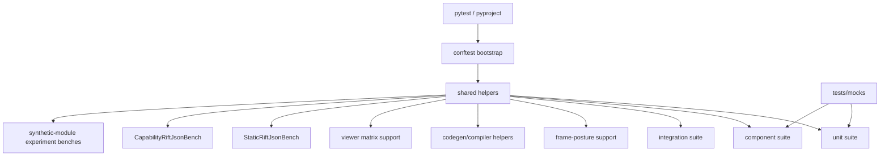

# Tests Components (C3/C2/C1)

## Metadata
- Doc ID: COMP-TESTS-2026-01-22
- Status: in_progress
- Owner:
- Created: 2026-01-22
- Updated: 2026-06-13

## Scope
This document defines C3 components, C2 subcomponents, and C1 code references
for tests under `tests/`. It complements
`context_compass/system_docs/tests_architecture.md` by describing the actual
test components and the shared support layers they use.

## Documentation Quality Standard
This document is treated as durable context. It must be deep enough to recover
system understanding from a blank slate without handwaving.

Required rules:
- No vague summaries. Every claim must be grounded in source evidence or marked as unknown.
- Explicit entrypoints and method-level call flows for important test behavior.
- Explicit ownership and cleanup for shared harnesses.
- Tier boundaries must match the real test tree.

## DO NOT ASSUME / Unknowns Gate
Rule: No Unverified Claims.
Any statement that is not directly supported by evidence must be treated as UNKNOWN.

If not evidenced => UNKNOWN.

## Unknowns
- UNKNOWN: external CI ownership of suite partitioning/sharding is still not
  documented here.
  Why it matters: test components may be executed in smaller CI groups than
  the local tree implies.
  Local evidence boundary: this checkout has no in-repo `.github/` workflow
  config, so there is no local CI topology to cite here.
  Where to investigate: external CI configuration outside this checkout.
  Current status: blocked on external evidence.

## Table of Contents
- Scope
- Documentation Quality Standard
- DO NOT ASSUME / Unknowns Gate
- Unknowns
- Component Template
- C3 Components Catalog
- C2 Subcomponents Catalog
- Method-Level Call Flows (C1)
- C1 Code Map (Key Paths)
- Diagrams
- Information Sources
- Open Questions
- Context / Handoff Summary

## Component Template
Each component entry includes:
- Purpose
- Responsibilities
- Inputs
- Outputs
- Owned State
- Lifecycle/Cleanup
- Concurrency/Threading
- Invariants/Guarantees
- Failure Modes
- Observability
- Extension Points
- Key Files (C1)

## C3 Components Catalog

### Component: Pytest Runner And Path Bootstrap
Purpose:
- Start the suite from the repo root and bind test imports to `src/`.

Responsibilities:
- Define pytest collection roots through `pyproject.toml`.
- Exclude non-test worktrees and generated/cache directories.
- Prepend `src/` to `sys.path` through `tests/conftest.py`.

Inputs:
- `pyproject.toml`
- local repo filesystem layout

Outputs:
- consistent import path for local `melder` code
- stable pytest collection root at `tests/`

Owned State:
- path/bootstrap logic only; no long-lived runtime state

Lifecycle/Cleanup:
- bootstrap happens at pytest startup/import time

Concurrency/Threading:
- no explicit threading concerns

Invariants/Guarantees:
- local tests target local `src/`
- `codex*` worktrees are excluded from pytest recursion by config

Failure Modes:
- broken path bootstrap would cause import failure or wrong-package import

Observability:
- visible through pytest import/collection behavior

Extension Points:
- future pytest options or marker config in `pyproject.toml`

Key Files (C1):
- `pyproject.toml`
- `tests/conftest.py`

### Component: Shared Test Support And Matrix Fixtures
Purpose:
- Provide reusable runtime support surfaces so tests do not duplicate
  descriptor/viewer fixtures, frame-posture helpers, compiler/codegen helpers,
  and experimentation setup inline.

Responsibilities:
- Build descriptor/compiled-surface/viewer fixtures for viewer and ACL tests.
- Provide reusable frame-posture configuration helpers for runtime-heavy
  spellbook, conduit, crystallizer, and mutation-research tests.
- Provide reusable codegen/compiler doubles and phase-runner helpers for
  codegen-system and spell compiler test lanes.
- Provide reusable static and capability room integration benches.
- Provide reusable synthetic-module and importlib experiment runners that the
  crystallizer component/integration tests wrap as stable cases.
- Resolve manifest placeholders and turn-script references for JSON-driven
  integration tests.

Inputs:
- descriptor payload builders
- compiled ACL surface builders
- runtime objects (`Aether`, `Spellbook`, `Conduit`, `Nexus`, `Rift`)

Outputs:
- `FrameViewer` fixtures
- real room harnesses
- manifest-driven JSON dispatch helpers

Owned State:
- bench-local runtime objects and manifests

Lifecycle/Cleanup:
- harnesses explicitly cleanup owned spellbooks/conduits/rifts

Concurrency/Threading:
- no independent worker model; relies on runtime objects under test

Invariants/Guarantees:
- support modules are deterministic and fixture-oriented, not production code
- the static/capability benches are real-runtime, not pure mocks

Failure Modes:
- stale singleton state if reset fixtures are bypassed
- broken placeholder resolution if manifest/turn paths drift

Observability:
- visible through parametrized matrix and turn-script test results

Extension Points:
- new room-mode benches
- additional viewer/ACL matrix builders

Key Files (C1):
- `tests/_frame_posture_test_support.py`
- `tests/_codegen_system_support.py`
- `tests/_nexus_viewer_matrix_support.py`
- `tests/component/melder/spellbook/compiler_test_helpers.py`
- `tests/component/melder/spellbook/spell_compiler_runtime_test_support.py`
- `tests/integration/melder/aether/rift/static_rift_json_testbench_support.py`
- `tests/integration/melder/aether/rift/capability_rift_json_testbench_support.py`
- `tests/experimentation/unittest_synthetic_module_edge_cases_testbench.py`
- `tests/experimentation/physical_to_synthetic_module_swap_semantics_testbench.py`

### Component: Unit Test Suite
Purpose:
- Validate isolated contracts for runtime classes, descriptors, ACL surfaces,
  spellbook internals, and utilities.

Responsibilities:
- Cover `melder/aether`, `melder/crystallizer`,
  `melder/mutation_research`, `melder/spellbook`, and
  `melder/utilities`.
- Exercise direct API and lifecycle/error-path behavior.
- Reset singleton runtime surfaces around runtime-heavy files.

Inputs:
- local runtime classes and helper fixtures

Outputs:
- direct contract assertions with minimal external wiring

Owned State:
- test-local fixtures only

Lifecycle/Cleanup:
- many files use autouse singleton resets for `Aether`, `Nexus`,
  `AetherUtilitySystem`, and viewer-related globals

Concurrency/Threading:
- includes direct unit coverage for synchronization and lock-oriented helpers

Invariants/Guarantees:
- unit tests stay close to class/method behavior
- they are the densest tier in the suite by file count

Failure Modes:
- singleton leakage and fixture coupling if reset discipline is lost

Observability:
- visible through direct pytest failures on contract mismatch

Extension Points:
- new subsystem-level direct contract tests

Key Files (C1):
- `tests/unit/melder/aether/`
- `tests/unit/melder/crystallizer/`
- `tests/unit/melder/mutation_research/`
- `tests/unit/melder/spellbook/`
- `tests/unit/melder/utilities/`

### Component: Component Test Suite
Purpose:
- Exercise small, real slices of the system where unit tests are too narrow
  and full integration would be too expensive.

Responsibilities:
- use real core objects
- stub or mock external collaborators where needed
- validate internal contracts that span multiple objects

Inputs:
- small real runtime slices
- controlled fake/stub collaborators

Outputs:
- slice-level behavioral assertions

Owned State:
- test-local slices and stubs

Lifecycle/Cleanup:
- follows the same singleton reset discipline when runtime objects are involved

Concurrency/Threading:
- no dedicated parallel harness layer; tests run through real objects under
  pytest control

Invariants/Guarantees:
- tier intent is explicitly documented in `tests/component/INFO.MD`

Failure Modes:
- component tests drift into unit-style internals or full integration sprawl

Observability:
- visible through component-slice regressions

Extension Points:
- new slice tests for cross-object seams

Key Files (C1):
- `tests/component/INFO.MD`
- `tests/component/melder/aether/`
- `tests/component/melder/crystallizer/`
- `tests/component/melder/mutation_research/`
- `tests/component/melder/spellbook/`
- `tests/component/melder/utilities/`

### Component: Integration Runtime Suite
Purpose:
- Validate real runtime wiring across Melder subsystems and AR surfaces.

Responsibilities:
- build real Spellbook/Conduit/Nexus/Rift stacks
- exercise descriptor projection and viewer matrices
- exercise room-mode harnesses and JSON-like request drivers
- cover additional integration lanes for conduit, crystallizer, live_sim,
  multithreading, mutation_research, and spellbook behavior

Inputs:
- real runtime objects
- shared bench support

Outputs:
- end-to-end or near-end-to-end behavioral assertions

Owned State:
- harness-local runtime objects and manifests

Lifecycle/Cleanup:
- runtime-heavy files reset singleton surfaces and cleanup harness-owned
  objects explicitly

Concurrency/Threading:
- includes dedicated integration directories for multithreading-related lanes

Invariants/Guarantees:
- integration tests use real runtime stacks rather than hand-built shallow mocks

Failure Modes:
- expensive or flaky runtime setup if singleton/reset discipline drifts

Observability:
- matrix and harness failures expose multi-object regressions

Extension Points:
- new room-mode benches
- new subsystem integration lanes

Key Files (C1):
- `tests/integration/melder/aether/`
- `tests/integration/melder/aether/rift/`
- `tests/integration/melder/conduit/`
- `tests/integration/melder/crystallizer/`
- `tests/integration/melder/live_sim/`
- `tests/integration/melder/multithreading/`
- `tests/integration/melder/mutation_research/`
- `tests/integration/melder/spellbook/`

### Component: Mock Fixture Corpus
Purpose:
- Provide deterministic helper modules, classes, scan-bind fixtures, and
  crystallizer harness surfaces for tests that should not depend on ad hoc
  inline mock object definitions.

Responsibilities:
- host spellbook-oriented helper classes/modules
- host crystallizer fixture packages and synthetic-module harnesses
- support scan/bind import and duplicate/reexport cases

Inputs:
- imported by unit/component/integration tests

Outputs:
- stable fake modules, helper classes, and crystallizer test harness packages

Owned State:
- static fixture modules only

Lifecycle/Cleanup:
- normal Python module import lifecycle

Concurrency/Threading:
- no dedicated threading behavior

Invariants/Guarantees:
- mocks are repo-local and deterministic

Failure Modes:
- drift between fixture modules and the import/use cases they support

Observability:
- scan/bind and spellbook tests fail when mock modules drift

Extension Points:
- new deterministic fixture modules for new scan/bind or spellbook cases

Key Files (C1):
- `tests/mocks/crystallizer/`
- `tests/mocks/spellbook/`

## C2 Subcomponents Catalog

### Subcomponent: `conftest.py` Path Bootstrap
Parent Component: Pytest Runner And Path Bootstrap
Purpose:
- prepend `src/` to `sys.path` for test execution
Contract/Interface:
- project-root and `src/` path insertion
Key Files (C1):
- `tests/conftest.py`

### Subcomponent: Frame Posture Test Support
Parent Component: Shared Test Support And Matrix Fixtures
Purpose:
- centralize automatic/dynamic frame-posture configuration helpers reused
  across runtime-heavy test lanes
Contract/Interface:
- applies default frame posture to `SpellbookConfiguration` objects for test
  setup without duplicating posture boilerplate in each test file
Key Files (C1):
- `tests/_frame_posture_test_support.py`

### Subcomponent: Nexus Viewer Matrix Support
Parent Component: Shared Test Support And Matrix Fixtures
Purpose:
- build descriptor, compiled ACL surface, and `FrameViewer` fixtures
Contract/Interface:
- `build_descriptor`, `build_surface`, `build_viewer`,
  `build_multi_frame_viewer`
Key Files (C1):
- `tests/_nexus_viewer_matrix_support.py`

### Subcomponent: Static Rift JSON Bench
Parent Component: Shared Test Support And Matrix Fixtures
Purpose:
- build a real static-room harness with JSON-like request and turn-script
  dispatch
Contract/Interface:
- `StaticRiftJsonBench`
- manifest/object/turn placeholder resolution
Key Files (C1):
- `tests/integration/melder/aether/rift/static_rift_json_testbench_support.py`
- `tests/integration/melder/aether/rift/test_static_rift_json_testbench_integration.py`

### Subcomponent: Capability Rift JSON Bench
Parent Component: Shared Test Support And Matrix Fixtures
Purpose:
- build a real capability-room harness with JSON-like request and turn-script
  dispatch
Contract/Interface:
- `CapabilityRiftJsonBench`
- manifest and saved-turn placeholder resolution
Key Files (C1):
- `tests/integration/melder/aether/rift/capability_rift_json_testbench_support.py`
- `tests/integration/melder/aether/rift/test_capability_rift_json_testbench_integration.py`

### Subcomponent: Synthetic Module Experiment Benches
Parent Component: Shared Test Support And Matrix Fixtures
Purpose:
- provide reusable synthetic-module and importlib scenario runners consumed by
  crystallizer component/integration tests
Contract/Interface:
- stable experiment functions wrapped as component/integration cases instead of
  re-encoding synthetic graphs inside the test files
Key Files (C1):
- `tests/experimentation/unittest_synthetic_module_edge_cases_testbench.py`
- `tests/experimentation/physical_to_synthetic_module_swap_semantics_testbench.py`

### Subcomponent: Compiler And Codegen Test Helpers
Parent Component: Shared Test Support And Matrix Fixtures
Purpose:
- provide reusable doubles and phase-runner helpers for codegen-system and
  spell compiler test lanes
Contract/Interface:
- namespace/event/memory doubles for codegen tests plus helper functions that
  drive compiler phases through the supported compiler-system surfaces
Key Files (C1):
- `tests/_codegen_system_support.py`
- `tests/component/melder/spellbook/compiler_test_helpers.py`
- `tests/component/melder/spellbook/spell_compiler_runtime_test_support.py`

### Subcomponent: Aether/Nexus/Rift Unit Cluster
Parent Component: Unit Test Suite
Purpose:
- cover AR-facing runtime contracts, descriptors, ACLs, room surfaces, and
  related manager classes
Key Files (C1):
- `tests/unit/melder/aether/test_nexus.py`
- `tests/unit/melder/aether/test_rift_runtime_contracts.py`
- `tests/unit/melder/aether/test_workstation.py`
- `tests/unit/melder/aether/test_command_system_direct.py`

### Subcomponent: Crystallizer Unit Cluster
Parent Component: Unit Test Suite
Purpose:
- cover the hosted crystallizer root, configuration builder, spell-crystal
  graph extraction, and synthetic-module import/materialization behavior
Key Files (C1):
- `tests/unit/melder/crystallizer/test_crystallizer.py`
- `tests/unit/melder/crystallizer/test_crystallizer_configuration.py`
- `tests/unit/melder/crystallizer/test_spell_crystal.py`
- `tests/unit/melder/crystallizer/test_synthetic_module.py`

### Subcomponent: MutationResearch Unit Cluster
Parent Component: Unit Test Suite
Purpose:
- cover the mutation-research root/configuration surface, session management,
  and placeholder mutation-conduit/frame cleanup guards
Key Files (C1):
- `tests/unit/melder/mutation_research/test_mutation_research_root.py`
- `tests/unit/melder/mutation_research/test_mutation_research_root_matrix.py`

### Subcomponent: Spellbook Runtime And Binding Unit Cluster
Parent Component: Unit Test Suite
Purpose:
- cover spellbook runtime/binding/configuration surfaces such as bind,
  scan-bind, spell state, spellbook creation-system behaviors, caching
  verification, and snapshot-style helpers
Key Files (C1):
- `tests/unit/melder/spellbook/test_spellbook.py`
- `tests/unit/melder/spellbook/test_spell.py`
- `tests/unit/melder/spellbook/test_scan_bind.py`
- `tests/unit/melder/spellbook/test_spellbinder.py`
- `tests/unit/melder/spellbook/test_cache_runtime_verification.py`
- `tests/unit/melder/spellbook/configuration/test_configuration.py`
- `tests/unit/melder/spellbook/bind/test_bind.py`
- `tests/unit/melder/spellbook/bind/test_spell_index.py`

### Subcomponent: Spellbook Compiler Unit Cluster
Parent Component: Unit Test Suite
Purpose:
- cover current-surface `spell_compiler` classes and the retained legacy
  `spell_crafter` compatibility subtree that still anchors many low-level DAG,
  validation, topology, and system tests
Key Files (C1):
- `tests/unit/melder/spellbook/spell_compiler/test_spell_compiler_system.py`
- `tests/unit/melder/spellbook/spell_compiler/test_spell_compiler.py`
- `tests/unit/melder/spellbook/spell_compiler/support/compiler_test_support.py`
- `tests/unit/melder/spellbook/spell_compiler/phases/test_compiler_phase_1.py`
- `tests/unit/melder/spellbook/spell_compiler/phases/test_shared_compiler_executions.py`
- `tests/unit/melder/spellbook/spell_crafter/validation/test_validation_system.py`
- `tests/unit/melder/spellbook/spell_crafter/dag/test_dag_index.py`
- `tests/unit/melder/spellbook/spell_crafter/system/test_spell_system_validation_system.py`

### Subcomponent: Aether Component Cluster
Parent Component: Component Test Suite
Purpose:
- validate descriptor/ACL/viewer and conduit/dev_ops slices with real objects
Key Files (C1):
- `tests/component/melder/aether/test_frame_descriptor_manager_component.py`
- `tests/component/melder/aether/test_frame_acl_component.py`
- `tests/component/melder/aether/test_nexus_viewer_extended_surface_component_matrix.py`

### Subcomponent: Crystallizer Component Cluster
Parent Component: Component Test Suite
Purpose:
- validate spell-crystal and synthetic-module graph extraction against real
  physical or mixed module graphs
Key Files (C1):
- `tests/component/melder/crystallizer/test_spell_crystal_component.py`
- `tests/component/melder/crystallizer/test_synthetic_module_component.py`

### Subcomponent: MutationResearch Component Cluster
Parent Component: Component Test Suite
Purpose:
- validate the Aether-owned mutation-research root and placeholder
  mutation-conduit/frame surfaces against live spellbook and conduit state
Key Files (C1):
- `tests/component/melder/mutation_research/test_mutation_research_root_component.py`

### Subcomponent: Spellbook Runtime And Binding Component Cluster
Parent Component: Component Test Suite
Purpose:
- validate spellbook runtime/binding/configuration surfaces as small real
  slices, including caching, spell index behavior, conduit-definition posture,
  and spellbook contract/bind behavior
Key Files (C1):
- `tests/component/melder/spellbook/test_spellbook_component_bind.py`
- `tests/component/melder/spellbook/test_spellbook_component_configuration.py`
- `tests/component/melder/spellbook/test_spellbook_component_configuration_core.py`
- `tests/component/melder/spellbook/test_spellbook_component_contracts.py`
- `tests/component/melder/spellbook/test_spellbook_component_spell_index.py`
- `tests/component/melder/spellbook/test_spellbook_component_spellbook.py`
- `tests/component/melder/spellbook/test_spellbook_component_caching_system.py`

### Subcomponent: Spellbook Compiler Component Cluster
Parent Component: Component Test Suite
Purpose:
- validate current-surface spell compiler flows and the retained legacy
  `spell_crafter` compatibility subtree through real spellbook/component
  slices and shared compiler helpers
Key Files (C1):
- `tests/component/melder/spellbook/test_spell_compiler_component_system.py`
- `tests/component/melder/spellbook/compiler_test_helpers.py`
- `tests/component/melder/spellbook/spell_compiler_runtime_test_support.py`
- `tests/component/melder/spellbook/spell_compiler/test_spell_codegen_pipeline_component.py`
- `tests/component/melder/spellbook/spell_compiler/test_generalized_cache_creation_component.py`
- `tests/component/melder/spellbook/spell_crafter/system/test_spellbook_component_spell_system.py`
- `tests/component/melder/spellbook/spell_crafter/dag/test_spellbook_component_dag_local_frame.py`
- `tests/component/melder/spellbook/spell_crafter/validation/test_spellbook_component_validation_system.py`

### Subcomponent: Aether Integration Cluster
Parent Component: Integration Runtime Suite
Purpose:
- validate real Nexus projection, viewer matrices, passive ingest, ACL chain,
  and AR integration behavior
Key Files (C1):
- `tests/integration/melder/aether/test_nexus_frame_surface_projection_integration.py`
- `tests/integration/melder/aether/test_nexus_viewer_extended_surface_integration_matrix.py`
- `tests/integration/melder/aether/test_frame_acl_chain_integration.py`

### Subcomponent: Crystallizer Integration Cluster
Parent Component: Integration Runtime Suite
Purpose:
- validate real bound-spell crystallization and synthetic-module import
  behavior across hosted crystallizer integration cases
Key Files (C1):
- `tests/integration/melder/crystallizer/test_spell_crystal_integration.py`
- `tests/integration/melder/crystallizer/test_synthetic_module_integration.py`

### Subcomponent: MutationResearch Integration Cluster
Parent Component: Integration Runtime Suite
Purpose:
- validate shared Aether-owned mutation-research behavior and live frame
  service wiring across dynamic integration frames
Key Files (C1):
- `tests/integration/melder/mutation_research/test_mutation_research_root_integration.py`

### Subcomponent: Spellbook Integration Cluster
Parent Component: Integration Runtime Suite
Purpose:
- validate end-to-end spellbook runtime behavior plus current-surface compiler
  integration flows across binding, resolution, existence, contracts, hooks,
  public API, scan-bind, and compiler-system execution
Key Files (C1):
- `tests/integration/melder/spellbook/test_spellbook_integration_core.py`
- `tests/integration/melder/spellbook/test_spellbook_integration_scan_bind.py`
- `tests/integration/melder/spellbook/test_spellbook_integration_resolution_contract.py`
- `tests/integration/melder/spellbook/test_spellbook_integration_public_api.py`
- `tests/integration/melder/spellbook/test_spellbook_integration_spell_crafter.py`
- `tests/integration/melder/spellbook/test_spell_compiler_system_integration.py`

### Subcomponent: Mock Spellbook Fixtures
Parent Component: Mock Fixture Corpus
Purpose:
- provide fake classes/modules for scan/bind and spellbook behavior
Key Files (C1):
- `tests/mocks/spellbook/core_classes.py`
- `tests/mocks/spellbook/contract_classes.py`
- `tests/mocks/spellbook/scan_bind_module_core.py`

### Subcomponent: Mock Crystallizer Harnesses
Parent Component: Mock Fixture Corpus
Purpose:
- provide deterministic spell-crystal and synthetic-module harness data for
  crystallizer unit/component/integration graph cases
Key Files (C1):
- `tests/mocks/crystallizer/spell_crystal_harness.py`
- `tests/mocks/crystallizer/synthetic_module_harness.py`

## Method-Level Call Flows (C1)

### Flow: Pytest Bootstrap
1. pytest starts from `pyproject.toml`.
2. collection is rooted at `tests/`.
3. `tests/conftest.py` prepends `src/` to `sys.path`.
4. tests import local `melder` modules from the workspace.

### Flow: Runtime-Heavy Singleton Reset
1. autouse fixture resets `AetherUtilitySystem`, `Nexus`, and `Aether`
   singleton state.
2. some files also rebind `Spellbook._aether`, `Conduit._aether`, and viewer
   class-level `_aether` references.
3. test builds runtime fixtures.
4. fixture teardown resets the same singleton surfaces again.

### Flow: Viewer Matrix Fixture Build
1. helper builds one `FrameDescriptor`.
2. helper builds one compiled ACL surface.
3. helper creates one `FrameViewer` around those fixtures.
4. unit/component/integration tests drive viewer methods over the same shared
   support shape.

### Flow: Static Rift JSON Bench
1. harness builds `Aether`, `Spellbook`, root + lesser `Conduit`, `Nexus`,
   `Rift`, `StaticRiftSpace`, viewer, command system, and workstation.
2. harness exposes a JSON-like dispatcher.
3. request matrix and turn-script tests drive the live room.
4. harness cleanup tears down owned runtime objects.

### Flow: Capability Rift JSON Bench
1. harness builds two Spellbooks/conduits plus one capability Rift stack.
2. harness exposes the same JSON-like surface concept over capability-room
   behavior.
3. request matrix and turn-script tests drive the live capability room.
4. harness cleanup tears down owned runtime objects.

## C1 Code Map (Key Paths)
- `pyproject.toml`
- `tests/conftest.py`
- `tests/_frame_posture_test_support.py`
- `tests/component/INFO.MD`
- `tests/_nexus_viewer_matrix_support.py`
- `tests/experimentation/unittest_synthetic_module_edge_cases_testbench.py`
- `tests/experimentation/physical_to_synthetic_module_swap_semantics_testbench.py`
- `tests/integration/melder/aether/test_nexus_frame_surface_projection_integration.py`
- `tests/integration/melder/aether/test_nexus_viewer_extended_surface_integration_matrix.py`
- `tests/integration/melder/aether/rift/static_rift_json_testbench_support.py`
- `tests/integration/melder/aether/rift/capability_rift_json_testbench_support.py`
- `tests/integration/melder/aether/rift/test_static_rift_json_testbench_integration.py`
- `tests/integration/melder/aether/rift/test_capability_rift_json_testbench_integration.py`
- `tests/unit/melder/aether/test_nexus.py`
- `tests/unit/melder/aether/test_rift_runtime_contracts.py`
- `tests/unit/melder/aether/test_workstation.py`
- `tests/unit/melder/aether/test_command_system_direct.py`
- `tests/mocks/spellbook/`

## Diagrams
### ASCII Component Diagram (C3/C2)
```text
[pytest + pyproject]
        |
        v
[conftest bootstrap]
        |
        v
[shared helpers] ----> [unit suite]
        |              [component suite]
        |              [integration suite]
        |
        +--> [frame-posture support]
        +--> [codegen/compiler helpers]
        +--> [viewer matrix support]
        +--> [static Rift bench]
        +--> [capability Rift bench]
        +--> [synthetic-module experiment benches]

[mocks] feed spellbook and crystallizer test lanes
```

### Mermaid Component Diagram (C3/C2)


## Information Sources
- `pyproject.toml`
- `tests/conftest.py`
- `tests/_frame_posture_test_support.py`
- `tests/_codegen_system_support.py`
- `tests/component/INFO.MD`
- `tests/_nexus_viewer_matrix_support.py`
- `tests/component/melder/spellbook/compiler_test_helpers.py`
- `tests/component/melder/spellbook/spell_compiler_runtime_test_support.py`
- `tests/experimentation/unittest_synthetic_module_edge_cases_testbench.py`
- `tests/experimentation/physical_to_synthetic_module_swap_semantics_testbench.py`
- `tests/integration/melder/aether/test_nexus_frame_surface_projection_integration.py`
- `tests/integration/melder/aether/test_nexus_viewer_extended_surface_integration_matrix.py`
- `tests/integration/melder/aether/rift/static_rift_json_testbench_support.py`
- `tests/integration/melder/aether/rift/capability_rift_json_testbench_support.py`
- `tests/integration/melder/aether/rift/test_static_rift_json_testbench_integration.py`
- `tests/integration/melder/aether/rift/test_capability_rift_json_testbench_integration.py`
- `tests/unit/melder/crystallizer/test_crystallizer.py`
- `tests/unit/melder/mutation_research/test_mutation_research_root.py`
- `tests/component/melder/crystallizer/test_spell_crystal_component.py`
- `tests/component/melder/mutation_research/test_mutation_research_root_component.py`
- `tests/integration/melder/crystallizer/test_spell_crystal_integration.py`
- `tests/integration/melder/mutation_research/test_mutation_research_root_integration.py`
- `tests/mocks/crystallizer/spell_crystal_harness.py`
- `tests/mocks/crystallizer/synthetic_module_harness.py`
- `tests/unit/melder/aether/test_nexus.py`
- `tests/unit/melder/aether/test_rift_runtime_contracts.py`
- `tests/unit/melder/aether/test_workstation.py`
- `tests/unit/melder/aether/test_command_system_direct.py`
- direct filesystem inventory of `tests/`

## Open Questions
- Whether future external CI/docs should describe a formal marker taxonomy or
  shard map; no in-repo CI workflow evidence exists in this checkout.
- Whether the mocks directory needs its own canonical component doc later as
  scan/bind coverage grows.

## Context / Handoff Summary
The tests layer is now mapped as a real multi-tier system with reusable
support/harness components. The most important recent addition is the
static/capability Rift JSON bench layer, which makes AR room-mode behavior
re-enterable from docs instead of only from code and board history.
