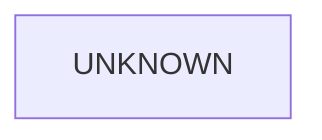

# Tests Components (C3/C2/C1)

## Metadata
- Doc ID: COMP-TESTS-2026-01-22
- Status: draft
- Owner:
- Created: 2026-01-22
- Updated: 2026-01-22

## Scope
This document defines C3 components, C2 subcomponents, and C1 code references
for tests under `tests/`. It is intentionally conservative and will not assert
behavior without evidence.

## Documentation Quality Standard
This document is treated as durable context. It must be deep enough to recover
system understanding from a blank slate without handwaving.

Required rules:
- No vague summaries. Every claim must be grounded in source evidence or marked as unknown.
- Explicit entrypoints and method-level call flows for core test behavior.
- Explicit ownership, lifecycle, and cleanup order for test components.
- Explicit invariants, failure modes, and concurrency constraints.
- ASCII and Mermaid diagrams for core flows.
- Update the information sources list when new files are used.

## DO NOT ASSUME / Unknowns Gate
Rule: No Unverified Claims.
Any statement that is not directly supported by evidence must be treated as UNKNOWN.

Evidence means at least one of:
- A specific source file reference (preferred: file + symbol/method/class name).
- A citation to an explicit, already-verified artifact (e.g., a prior approved doc section).

If not evidenced => UNKNOWN.

UNKNOWN items must be explicitly labeled UNKNOWN (or added to the Unknowns section).
UNKNOWN items must be investigated by reading the relevant source(s).
If investigation cannot be completed (missing source access, ambiguity, or time),
the item must remain UNKNOWN and must not be promoted to fact.

No reasonable assumptions.
Do not infer behavior from naming, patterns, conventions, or typical frameworks.
Only the code/docs count.

When unsure:
- Mark it UNKNOWN.
- Identify the most likely evidence target (file + symbol).
- Investigate, then update the doc (or leave it UNKNOWN).

## Unknowns
This section is a living list of claims currently not backed by evidence.
Each item must include:
- What is unknown.
- Why it matters (impact).
- Where to investigate (file(s) + symbol(s)).
- Current status (uninvestigated / investigating / blocked).

## Table of Contents
- Scope
- Documentation Quality Standard
- DO NOT ASSUME / Unknowns Gate
- Unknowns
- Component Template
- C3 Components Catalog
- C2 Subcomponents Catalog
- Method-Level Call Flows (C1)
- C1 Code Map (Key Paths)
- Diagrams
- Information Sources
- Open Questions
- Context / Handoff Summary

## Component Template
Each component entry includes:
- Purpose
- Responsibilities
- Inputs
- Outputs
- Owned State
- Lifecycle/Cleanup
- Concurrency/Threading
- Invariants/Guarantees
- Failure Modes
- Observability
- Extension Points
- Key Files (C1)

## C3 Components Catalog
UNKNOWN: Test components are not yet cataloged.

## C2 Subcomponents Catalog
UNKNOWN: Test subcomponents are not yet cataloged.

## Method-Level Call Flows (C1)
UNKNOWN: Core test call flows are not yet documented.

## C1 Code Map (Key Paths)
UNKNOWN: Test code map not yet enumerated.

## Diagrams
### ASCII Component Diagram (C3/C2)
```
UNKNOWN
```

### Mermaid Component Diagram (C3/C2)


## Information Sources
- `tests/`

## Open Questions
- What are the test component boundaries and how do they map to src subsystems?
  - Why it matters: required for C3/C2 alignment.
  - Where to investigate: `tests/` tree and matching `src/` modules.
  - Status: uninvestigated.
- What are the core test entrypoints and fixtures?
  - Why it matters: defines lifecycle and ownership for setup/teardown.
  - Where to investigate: `tests/` fixtures and config files.
  - Status: uninvestigated.

## Context / Handoff Summary
Created tests components skeleton with Unknowns Gate. Content pending evidence-based investigation.