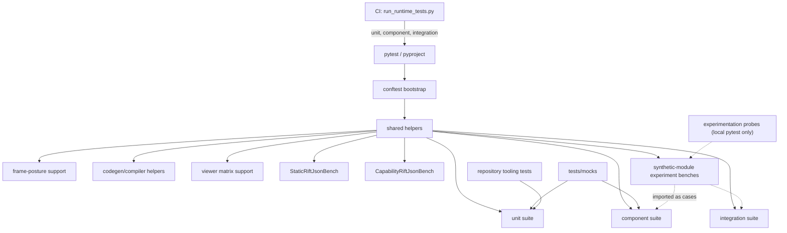

# Tests Components (C3/C2/C1)

## Metadata
- Doc ID: COMP-TESTS-2026-01-22
- Status: in_progress
- Owner:
- Created: 2026-01-22
- Updated: 2026-10-05

## Scope
This document defines C3 components, C2 subcomponents, and C1 code references
for tests under `tests/`. It complements `tests_architecture`, which owns the
layer boundaries, by describing the test components inside them, the shared
support layers they use, and the behaviour each surface protects.

Covered: the three pytest tiers CI runs (`unit`, `component`, `integration`); the
repository-tooling trees under `tests/unit/` that test the CI scripts and support
tools rather than `melder`; the locally collected experimentation tree and the
opt-in profiling scripts; the mock corpus; and the CI driver that runs the tiers.

## Documentation Quality Standard
This document is treated as durable context. It must be deep enough to recover
system understanding from a blank slate without handwaving.

Required rules:
- No vague summaries. Every claim must be grounded in source evidence or marked as unknown.
- Explicit entrypoints and method-level call flows for important test behavior.
- Explicit ownership and cleanup for shared harnesses.
- Tier boundaries must match the real test tree.

## Indexing
This document is AUTHORED. Its only generated companion is its index
(`tests_components_index`), rebuilt in the SAME pass as any edit by the
documentation tooling that maintains these documents. The commands live with that
tooling, not here: this document ships with the code and the tooling does not.

The navigable unit is the H3 `### Component: <Name>` entry.
`## C3 Components Catalog` is a CONTAINER - it indexes as a range spanning every
component beneath it, so select a component, never the catalog.

Consume it by slicing a named section rather than reading it whole, and verify the
index proof (line count, line ending, content hash) before trusting a range.

This index was STALE for an extended period before 2026-08-02 - 140 recorded lines
against a live 767 - so every range it returned was wrong while still parsing.
Regenerate on mismatch; never eyeball an offset.

### Verifying the cited test paths and ranges in this document

THIS SIDE HAS NO GRAPH. `src_graph_index.md` is built from the source tree, so
every source-side citation gets a free resolution check and NOTHING here does.
A renamed or deleted test file leaves a citation that still parses and points
nowhere, and a range that drifts inside a file that still exists is invisible
even to an existence check. That is why the instructions require ranges to be
REMEASURED every pass rather than carried forward.

Run this after any pass that touches the test tree or this document:

```bash
python - <<'EOF'
import pathlib, re

here = pathlib.Path.cwd().resolve()
root = next((p for p in (here, *here.parents) if (p / "tests").is_dir()), here)
docs = next(p for p in (pathlib.Path("system_docs"), pathlib.Path("."))
            if list(p.glob("tests_*.md")))

CITE = re.compile(r"`?((?:tests|src)/[A-Za-z0-9_/.]*\.py):(\d+)(?:\s*-\s*(\d+))?`?")
PATH = re.compile(r"`((?:tests|src)/[^`]+\.py)`")

for doc in docs.glob("tests_*.md"):
    if doc.name.endswith("_index.md"):
        continue
    text = doc.read_text(encoding="utf-8")

    # 1. every cited path exists. Globs are statements about a set, not
    #    citations, so they are skipped rather than reported.
    for i, line in enumerate(text.split("\n"), 1):
        for p in PATH.findall(line):
            if "*" in p or "?" in p:
                continue
            if not (root / p).exists():
                print("MISSING", doc.name, i, p)

    # 2. every path:line range is in bounds
    for i, line in enumerate(text.split("\n"), 1):
        for m in CITE.finditer(line):
            f = root / m.group(1)
            if not f.exists():
                continue
            n = len(f.read_bytes().decode("utf-8", "replace").splitlines())
            s = int(m.group(2)); e = int(m.group(3) or m.group(2))
            if s < 1 or e > n or s > e:
                print("OUT OF BOUNDS", doc.name, i, m.group(0), "file has", n)

    # 3. every C1 record's end_line still matches the file on disk. This is the
    #    check that catches drift, and the one nothing else here can do.
    cur = None
    for i, line in enumerate(text.split("\n"), 1):
        m = re.match(r"^- path: `([^`]+)`", line)
        if m:
            cur = m.group(1); continue
        if cur:
            m2 = re.match(r"^\s+end_line:\s*(\d+)", line)
            if m2:
                f = root / cur
                if f.exists():
                    n = len(f.read_bytes().decode("utf-8", "replace").splitlines())
                    if int(m2.group(1)) != n:
                        print("STALE RANGE", doc.name, i, cur, m2.group(1), "->", n)
                cur = None
EOF
```

Measured ranges in this repository go stale FAST - a re-verification on 2026-08-03
found sixteen source-side ranges that had been green earlier the same day. A
range here is true as of its `verified_at` stamp and no longer.

## DO NOT ASSUME / Unknowns Gate
Rule: No Unverified Claims.
Any statement that is not directly supported by evidence must be treated as UNKNOWN.

If not evidenced => UNKNOWN.

## Unknowns
- RESOLVED 2026-09-26 (was UNKNOWN: external CI ownership of suite
  partitioning/sharding, blocked while the checkout had no in-repo `.github/`
  workflow config). CI is in the repository and does not shard: each OS/Python
  cell runs `tests/unit`, `tests/component` and `tests/integration` in one pytest
  process through `.github/scripts/run_runtime_tests.py`. See
  `### Component: Pytest Runner And Path Bootstrap`.
- RESOLVED 2026-10-05 (was UNKNOWN: which Python releases a given CI run tested, because
  the matrix was discovered per run). The tree records them: one manifest per exact
  release under `.github/python/tests/` (3.14.0 through 3.14.8) builds the matrix with no
  network lookup, so "passes in CI" names exactly the manifests at that commit.
- UNKNOWN: whether six tracked `bundle.json` files under
  tests/unit/melder/utilities/_caching_system_tmp_load_*/ are fixtures or leftovers.
  Why it matters: no test references those directories, so they are dead
  fixtures or committed droppings of the cwd-relative cache tests.
  Where to investigate: `tests/unit/melder/utilities/test_caching_system.py` history.
  Current status: raised to the owner; not changed.
- UNKNOWN: whether the 140 tracked `.py` files under
  tests/experimentation/_physical_to_synth_swap_tmp/ and
  tests/experimentation/_synthetic_edge_tmp/ should be in the repository.
  Why it matters: they are case packages the two synthetic-module benches write
  (50 of the tree's 57 `__init__.py` files). The benches create a fresh suffixed or
  uuid-named directory per case, so no run reads the tracked copies back; they only
  inflate the tree and its file counts.
  EVIDENCE:
  - tests/experimentation/physical_to_synthetic_module_swap_semantics_testbench.py:109-123
  - tests/experimentation/unittest_synthetic_module_edge_cases_testbench.py:62-65
  Where to investigate: the two benches' teardown and the commits that added the
  directories.
  Current status: raised to the owner; not changed.

## Table of Contents
- Scope
- Documentation Quality Standard
- Indexing
- DO NOT ASSUME / Unknowns Gate
- Unknowns
- Component Template
- C3 Components Catalog
- C2 Subcomponents Catalog
- Method-Level Call Flows (C1)
- C1 Code Map (Core)
- Diagrams
- Information Sources
- Open Questions
- Context / Handoff Summary

## Component Template
Each component entry includes:
- Purpose
- Responsibilities
- Protects (added 2026-09-26: the behaviour a regression in this surface breaks,
  so an entry cannot describe a harness without naming what it guards; C2
  clusters carry the same line)
- Inputs
- Outputs
- Owned State
- Lifecycle/Cleanup
- Concurrency/Threading
- Invariants/Guarantees
- Failure Modes
- Observability
- Extension Points
- Key Files (C1)

## C3 Components Catalog

### Component: Pytest Runner And Path Bootstrap
Purpose:
- Start the suite from the repo root and bind test imports to `src/`; in CI, run
  the three tiers on a verified free-threaded interpreter.

Responsibilities:
- Define collection through `[tool.pytest.ini_options]` in `pyproject.toml`:
  `testpaths = ["tests"]`, a `norecursedirs` list (`benchmarks`, `Plans`,
  `context_compass`, `UX_and_AIX_experiences`, `performance_hunt`, `profiles`,
  `build_scripts`, `.venv`, `.venv_new`, `__pycache__`, `__melder_cache__`) and the
  two declared markers `integration` and `component`.
- Prepend `src/` and the project root to `sys.path` through `tests/conftest.py`;
  the second lets `import tests.mocks...` and the `tests/_*_support` modules
  resolve under a bare `pytest`, not only under `python -m pytest`.
- In CI, `run_runtime_tests.py` `main` runs `tests/unit`, `tests/component` and
  `tests/integration` in one `pytest.main` call with a JUnit report, adding
  `--cov=melder --cov-branch` into one XML only when `--coverage-report` is given.

Protects:
- that tests import the workspace `src/`, never an installed `melder`
- that a CI result comes from a 3.14+ free-threaded build with the GIL off for the
  whole run: `require_free_threading` raises before `pytest.main` and again after
  it, so an import or plugin that re-enabled the GIL fails the run
- that the driver's exit code is pytest's exit code, never masked by reporting

Inputs:
- `pyproject.toml`; the local filesystem layout
- CI: `--report` (JUnit path), optional `--coverage-report`, and `PYTHON_GIL=0`,
  which the workflow sets for the test process

Outputs:
- one import path for local `melder` code; collection rooted at `tests/`
- CI: JUnit XML on every run; coverage XML when requested

Owned State:
- two `sys.path` entries, each inserted only when absent; no runtime state

Lifecycle/Cleanup:
- bootstrap runs once when pytest imports the root conftest; the CI runtime check
  runs in the same process before and after `pytest.main`

Concurrency/Threading:
- no threads of its own; the driver's contract is the process's threading posture
  (free-threaded build, GIL disabled), not test concurrency

Invariants/Guarantees:
- local tests target local `src/`
- collection never enters a `norecursedirs` tree; the list names no `codex*` entry
  (an earlier revision of this entry claimed worktrees were excluded - they are not)
- CI never shards: one pytest process per OS/Python cell runs all three tiers, and
  `tests/experimentation/` is not among them

Failure Modes:
- broken path bootstrap: import failure or a wrong-package import
- `RuntimeError` from the driver naming the required runtime (3.14+ free-threaded,
  `PYTHON_GIL=0`), before or after the run
- a new top-level tree with Python that is not in `norecursedirs` is collected
  silently

Observability:
- pytest import/collection output; the JUnit report of each CI cell

Extension Points:
- markers or options in `pyproject.toml`; tier arguments in the driver

Key Files (C1):
- `pyproject.toml`
- `tests/conftest.py`
- `.github/scripts/run_runtime_tests.py`
- `.github/workflows/test-runtime.yml`

### Component: Shared Test Support And Matrix Fixtures
Purpose:
- Provide reusable runtime support surfaces so tests do not duplicate
  descriptor/viewer fixtures, frame-posture helpers, compiler/codegen helpers,
  and experimentation setup inline.

Responsibilities:
- Build descriptor/compiled-surface/viewer fixtures for viewer and ACL tests.
- Provide reusable frame-posture configuration helpers for runtime-heavy
  spellbook, conduit, crystallizer, and mutation-research tests.
- Provide reusable codegen/compiler doubles and phase-runner helpers for
  codegen-system and spell compiler test lanes.
- Provide reusable static and capability room integration benches.
- Provide reusable synthetic-module and importlib experiment runners that the
  crystallizer component/integration tests wrap as stable cases.
- Resolve manifest placeholders and turn-script references for JSON-driven
  integration tests.

Protects:
- that viewer and ACL tests at all three tiers assert against one descriptor and
  compiled-surface shape: `_nexus_viewer_matrix_support.py` is imported by 38 unit,
  18 component and 6 integration files, so a projection change fails every tier
  together instead of drifting in one
- that static and capability room behaviour is proven on real runtime stacks (the
  Rift JSON benches), not on mocks
- that every annotation in `src/melder` stays evaluable on 3.14
  (`_annotation_audit_support.py`, enforced by
  `tests/unit/melder/test_annotation_integrity.py`)

Inputs:
- descriptor payload builders
- compiled ACL surface builders
- runtime objects (`Aether`, `Spellbook`, `Conduit`, `Nexus`, `Rift`)

Outputs:
- `FrameViewer` fixtures
- real room harnesses
- manifest-driven JSON dispatch helpers

Owned State:
- bench-local runtime objects and manifests

Lifecycle/Cleanup:
- harnesses explicitly cleanup owned spellbooks/conduits/rifts

Concurrency/Threading:
- no independent worker model; relies on runtime objects under test

Invariants/Guarantees:
- support modules are deterministic and fixture-oriented, not production code
- the static/capability benches are real-runtime, not pure mocks

Failure Modes:
- stale singleton state if reset fixtures are bypassed
- broken placeholder resolution if manifest/turn paths drift

Observability:
- visible through parametrized matrix and turn-script test results

Extension Points:
- new room-mode benches
- additional viewer/ACL matrix builders

Key Files (C1):
- `tests/_frame_posture_test_support.py`
- `tests/_codegen_system_support.py`
- `tests/_nexus_viewer_matrix_support.py`
- `tests/_annotation_audit_support.py`
- `tests/component/melder/spellbook/compiler_test_helpers.py`
- `tests/component/melder/spellbook/spell_compiler_runtime_test_support.py`
- `tests/integration/melder/aether/rift/static_rift_json_testbench_support.py`
- `tests/integration/melder/aether/rift/capability_rift_json_testbench_support.py`
- `tests/experimentation/unittest_synthetic_module_edge_cases_testbench.py`
- `tests/experimentation/physical_to_synthetic_module_swap_semantics_testbench.py`

### Component: Unit Test Suite
Purpose:
- Validate isolated contracts for runtime classes, descriptors, ACL surfaces,
  spellbook internals, utilities, the package-root surface and build assets; in
  three separate trees, the repository tooling that qualifies and ships the package.

Responsibilities:
- Cover `melder/aether`, `melder/crystallizer`, `melder/mutation_research`,
  `melder/spellbook`, `melder/utilities` and `melder/build_assets`, plus nine
  package-root modules directly under tests/unit/melder/.
- Cover repository tooling that is not `melder`: the CI scripts under `.github/scripts/`
  (`github_workflows`), the LLM support bundle builder (`llm_support`) and the
  architecture-docs tool (`architecture_and_design`).
- Exercise direct API and lifecycle/error-path behavior.
- Reset singleton runtime surfaces around runtime-heavy files, and boot a fresh
  `Aether()` after each reset.

Protects:
- per-class contracts - returns, raises and cleanup - so a regression fails beside
  the class that caused it rather than inside a stack test
- the package-root contract: every `__all__` name resolves to its concrete-path
  object, internal classes stay unbindable, the version and build-asset stamps
  agree (see `### Subcomponent: Package Root Unit Cluster`)
- the release gates in the CI scripts: fail-closed routing, candidate and source
  identity, distribution contents, the free-threaded runtime gate (see
  `### Subcomponent: Repository Tooling Unit Cluster`)
- race fixes, as deterministic stand-ins for the concurrent writer (see
  `### Flow: Concurrent-Writer Stand-In`)

Inputs:
- local runtime classes and helper fixtures; `MagicMock` collaborators where the
  unit is one class (the conduit conftest stubs the Spellbook, Aether, DevOps
  manager, conduit cloud and frame around real `Conduit` objects)
- CI scripts loaded by file path through `tests/unit/github_workflows/conftest.py`,
  without booting Melder

Outputs:
- direct contract assertions with minimal external wiring

Owned State:
- test-local fixtures only, except twelve `CachingSystem` tests that write cwd-relative
  tests/unit/melder/utilities/_caching_system_tmp_* directories which survive runs
  (TREE ARTIFACTS in `tests_architecture`)

Lifecycle/Cleanup:
- runtime-heavy files use autouse fixtures that reset `AetherUtilitySystem`, `Nexus`
  and `Aether`, then boot `Aether()` and bind it to `Spellbook._aether`, both before
  and after each test (`tests/unit/melder/aether/conduit/conftest.py:65-85`); a reset
  alone boots nothing (see `### Flow: Singleton Reset And Re-Boot`)

Concurrency/Threading:
- direct coverage of the synchronization primitives (creation gate and controller,
  load gate, phase scheduler, latches, switches, weak concurrent containers);
  `test_abstract_elastic_pool_multithreaded.py` runs threads against the pool; a
  race in larger code is pinned by a stand-in, not by threads

Invariants/Guarantees:
- unit tests stay close to class/method behavior
- the densest tier: 468 `test_*.py` modules among 471 `.py` files
- CI-script tests never import `melder`; each script is loaded as a standalone module

Failure Modes:
- singleton leakage, or a SINGLETON VOID (a reset without a re-boot), makes a test
  pass alone and fail after another file
- stale cwd-relative cache directories survive between runs

Observability:
- direct pytest failures on contract mismatch

Extension Points:
- new subsystem-level direct contract tests; a new CI script gets a loader fixture
  in the github_workflows conftest

Key Files (C1):
- `tests/unit/melder/aether/conduit/conftest.py`
- The aether tree carries 186 `test_*.py` modules beneath these; they are the
  CONTENT of this component rather than its key surfaces, and are counted here
  rather than cited so the core set stays a set an agent can verify.
- No harness or support module of its own; the 46 test_*.py modules in
  tests/unit/melder/crystallizer/ depend only on the shared surfaces at tests/ and the scoped
  conftests named in `tests_architecture.md`. Paths in this bullet are written
  WITHOUT backticks because they are directories - descriptive, never citations.
- No harness or support module of its own; the 20 test_*.py modules in
  tests/unit/melder/mutation_research/ depend only on the shared surfaces at tests/ and the scoped
  conftests named in `tests_architecture.md`. Paths in this bullet are written
  WITHOUT backticks because they are directories - descriptive, never citations.
- `tests/unit/melder/spellbook/spell_compiler/support/compiler_test_support.py`
- The spellbook tree carries 142 `test_*.py` modules beneath these; they are the
  CONTENT of this component rather than its key surfaces, and are counted here
  rather than cited so the core set stays a set an agent can verify.
- No harness or support module of its own; the 52 test_*.py modules in
  tests/unit/melder/utilities/ depend only on the shared surfaces at tests/ and the scoped
  conftests named in `tests_architecture.md`. Paths in this bullet are written
  WITHOUT backticks because they are directories - descriptive, never citations.
- The 3 test_*.py modules in tests/unit/melder/build_assets/ and the 9 package-root
  modules directly under tests/unit/melder/ are cited in their C2 clusters.
- `tests/unit/github_workflows/conftest.py`
- The repository-tooling trees carry 10 `test_*.py` modules (github_workflows 8,
  llm_support 1, architecture_and_design 1), cited in their C2 cluster.

### Component: Component Test Suite
Purpose:
- Exercise small, real slices of the system where unit tests are too narrow
  and full integration would be too expensive.

Responsibilities:
- use real core objects
- stub or mock external collaborators where needed
- validate internal contracts that span multiple objects

Protects:
- seams inside one subsystem, with real objects: descriptor/ACL publication and
  cleanup, crystallizer graph extraction over real module graphs, the
  mutation-research root on a real Aether, bind/configuration/contract/cache
  behavior of a real Spellbook, compiler phases through real conjures (key-set
  plans, cache restage, spell ids across two interpreters), creation-gate drains
  and load-gate/scheduler composition
- the agent text reader against the real packaged documents rather than generated
  fixtures (`test_agent_text_reader_component.py`)

Inputs:
- small real runtime slices
- controlled fake/stub collaborators

Outputs:
- slice-level behavioral assertions

Owned State:
- test-local slices and stubs; component cache tests write under the package
  directory (TREE ARTIFACTS in `tests_architecture`)

Lifecycle/Cleanup:
- follows the same singleton reset-and-re-boot discipline when runtime objects are
  involved

Concurrency/Threading:
- no parallel harness layer of its own; the synchronization component files start
  threads to prove that a gate drain waits for tickets in flight
  (`tests/component/melder/utilities/synchronization/test_creation_gate_component.py`)

Invariants/Guarantees:
- tier intent is explicitly documented in `tests/component/INFO.MD`: real core
  objects, stubbed external boundaries, deterministic, contract-level assertions
- 149 `test_*.py` modules among 151 `.py` files

Failure Modes:
- component tests drift into unit-style internals or full integration sprawl

Observability:
- visible through component-slice regressions

Extension Points:
- new slice tests for cross-object seams

Key Files (C1):
- `tests/component/INFO.MD`
- No harness or support module of its own; the 65 test_*.py modules in
  tests/component/melder/aether/ depend only on the shared surfaces at tests/ and the scoped
  conftests named in `tests_architecture.md`. Paths in this bullet are written
  WITHOUT backticks because they are directories - descriptive, never citations.
- No harness or support module of its own; the 7 test_*.py modules in
  tests/component/melder/crystallizer/ depend only on the shared surfaces at tests/ and the scoped
  conftests named in `tests_architecture.md`. Paths in this bullet are written
  WITHOUT backticks because they are directories - descriptive, never citations.
- No harness or support module of its own; the 1 test_*.py modules in
  tests/component/melder/mutation_research/ depend only on the shared surfaces at tests/ and the scoped
  conftests named in `tests_architecture.md`. Paths in this bullet are written
  WITHOUT backticks because they are directories - descriptive, never citations.
- `tests/component/melder/spellbook/compiler_test_helpers.py`
- `tests/component/melder/spellbook/spell_compiler_runtime_test_support.py`
- The spellbook tree carries 72 `test_*.py` modules beneath these; they are the
  CONTENT of this component rather than its key surfaces, and are counted here
  rather than cited so the core set stays a set an agent can verify.
- No harness or support module of its own; the 4 test_*.py modules in
  tests/component/melder/utilities/ depend only on the shared surfaces at tests/ and the scoped
  conftests named in `tests_architecture.md`. Paths in this bullet are written
  WITHOUT backticks because they are directories - descriptive, never citations.

### Component: Integration Runtime Suite
Purpose:
- Validate real runtime wiring across Melder subsystems and AR surfaces.

Responsibilities:
- build real Spellbook/Conduit/Nexus/Rift stacks
- exercise descriptor projection and viewer matrices
- exercise room-mode harnesses and JSON-like request drivers
- cover additional integration lanes for conduit, crystallizer, live_sim,
  multithreading, mutation_research, and spellbook behavior

Protects:
- behaviour that only exists once several real subsystems are wired: meld through
  the real front door across linked and clustered conduits, scope ordering and
  existence across lineages and SpellSpaces, contracts and ownership transfer,
  disposal order at scoped teardown, Nexus projection after passive publication,
  and room behaviour driven through the Rift benches
- the concurrency claims the unit tier cannot make: link/contract churn under
  concurrent melds, the meld lock order (shapes that deadlocked before the
  per-slot build locks), and thread-safe lazy loading of the packaged documents
  (see `### Subcomponent: Multithreading Integration Cluster`)
- a whole application bootstrapped the way a user would, automatic and dynamic
  (see `### Subcomponent: Live Sim Integration Cluster`)

Inputs:
- real runtime objects
- shared bench support

Outputs:
- end-to-end or near-end-to-end behavioral assertions

Owned State:
- harness-local runtime objects and manifests

Lifecycle/Cleanup:
- runtime-heavy files reset singleton surfaces and cleanup harness-owned
  objects explicitly

Concurrency/Threading:
- the multithreading directory drives real threads: orchestrated mutation lanes
  against concurrent meld workers, lock-order shapes run in child processes under
  gate timeouts with a `subprocess.run(timeout=...)` backstop, and sixteen-thread
  races on first lazy loads; the conduit concurrency file stresses
  concurrent melds across four linked conduits

Invariants/Guarantees:
- integration tests use real runtime stacks rather than hand-built shallow mocks
- 149 `test_*.py` modules among 156 `.py` files; the others are benches and the
  live-sim application

Failure Modes:
- expensive or flaky runtime setup if singleton/reset discipline drifts
- a rare race shows as an intermittent multithreading failure; it is pinned by a
  deterministic stand-in at the unit tier, not by rerunning this suite

Observability:
- matrix and harness failures expose multi-object regressions

Extension Points:
- new room-mode benches
- new subsystem integration lanes

Key Files (C1):
- `tests/integration/melder/aether/rift/capability_rift_json_testbench_support.py`
- `tests/integration/melder/aether/rift/codegen_rift_json_testbench_support.py`
- `tests/integration/melder/aether/rift/static_rift_json_testbench_support.py`
- The aether tree carries 38 `test_*.py` modules beneath these; they are the
  CONTENT of this component rather than its key surfaces, and are counted here
  rather than cited so the core set stays a set an agent can verify.
- The rift tree (inside the aether tree) carries 3 `test_*.py` modules over the
  same three benches; they are counted here rather than cited.
- No harness or support module of its own; the 36 test_*.py modules in
  tests/integration/melder/conduit/ depend only on the shared surfaces at tests/ and the scoped
  conftests named in `tests_architecture.md`. Paths in this bullet are written
  WITHOUT backticks because they are directories - descriptive, never citations.
- No harness or support module of its own; the 15 test_*.py modules in
  tests/integration/melder/crystallizer/ depend only on the shared surfaces at tests/ and the scoped
  conftests named in `tests_architecture.md`. Paths in this bullet are written
  WITHOUT backticks because they are directories - descriptive, never citations.
- `tests/integration/melder/live_sim/bootstrap.py`
- `tests/integration/melder/live_sim/conftest.py`
- `tests/integration/melder/live_sim/interfaces/protocols.py`
- `tests/integration/melder/live_sim/mini_application/application.py`
- The live_sim tree carries 2 `test_*.py` modules beneath these; they are the
  CONTENT of this component rather than its key surfaces, and are counted here
  rather than cited so the core set stays a set an agent can verify.
- No harness or support module of its own; the 5 test_*.py modules in
  tests/integration/melder/multithreading/ depend only on the shared surfaces at tests/ and the scoped
  conftests named in `tests_architecture.md`. Paths in this bullet are written
  WITHOUT backticks because they are directories - descriptive, never citations.
- No harness or support module of its own; the 2 test_*.py modules in
  tests/integration/melder/mutation_research/ depend only on the shared surfaces at tests/ and the scoped
  conftests named in `tests_architecture.md`. Paths in this bullet are written
  WITHOUT backticks because they are directories - descriptive, never citations.
- No harness or support module of its own; the 48 test_*.py modules in
  tests/integration/melder/spellbook/ depend only on the shared surfaces at tests/ and the scoped
  conftests named in `tests_architecture.md`. Paths in this bullet are written
  WITHOUT backticks because they are directories - descriptive, never citations.

### Component: Mock Fixture Corpus
Purpose:
- Provide deterministic helper modules, classes, scan-bind fixtures, and
  crystallizer harness surfaces for tests that should not depend on ad hoc
  inline mock object definitions.

Responsibilities:
- host spellbook-oriented helper classes/modules
- host crystallizer fixture packages and synthetic-module harnesses
- support scan/bind import and duplicate/reexport cases

Protects:
- scan-bind refusals and edge cases against modules of fixed shape (corrupt
  `scan_bind` metadata, duplicates, an empty module, lambdas, re-exports, wrapped
  callables)
- crystallizer module-graph extraction against one fixed physical package
  (`spell_crystal_demo_pkg`), which `spell_crystal_harness.py` imports under a known
  prefix so the expected targets, dependencies and kinds are stable

Inputs:
- imported by unit/component/integration tests

Outputs:
- stable fake modules, helper classes, and crystallizer test harness packages

Owned State:
- static fixture modules only

Lifecycle/Cleanup:
- normal Python module import lifecycle

Concurrency/Threading:
- no dedicated threading behavior

Invariants/Guarantees:
- mocks are repo-local and deterministic

Failure Modes:
- drift between fixture modules and the import/use cases they support

Observability:
- scan/bind and spellbook tests fail when mock modules drift

Extension Points:
- new deterministic fixture modules for new scan/bind or spellbook cases

Key Files (C1):
- `tests/mocks/crystallizer/spell_crystal_demo_pkg/__init__.py`
- `tests/mocks/crystallizer/spell_crystal_demo_pkg/api/__init__.py`
- `tests/mocks/crystallizer/spell_crystal_demo_pkg/api/feature.py`
- `tests/mocks/crystallizer/spell_crystal_demo_pkg/api/surface.py`
- `tests/mocks/crystallizer/spell_crystal_demo_pkg/branch/__init__.py`
- `tests/mocks/crystallizer/spell_crystal_demo_pkg/branch/aggregate.py`
- `tests/mocks/crystallizer/spell_crystal_demo_pkg/branch/leaf_a.py`
- `tests/mocks/crystallizer/spell_crystal_demo_pkg/branch/leaf_b.py`
- `tests/mocks/crystallizer/spell_crystal_demo_pkg/deep/__init__.py`
- `tests/mocks/crystallizer/spell_crystal_demo_pkg/deep/level1/__init__.py`
- `tests/mocks/crystallizer/spell_crystal_demo_pkg/deep/level1/level2/__init__.py`
- `tests/mocks/crystallizer/spell_crystal_demo_pkg/deep/level1/level2/provider.py`
- `tests/mocks/crystallizer/spell_crystal_demo_pkg/deep/level1/provider.py`
- `tests/mocks/crystallizer/spell_crystal_demo_pkg/nested/__init__.py`
- `tests/mocks/crystallizer/spell_crystal_demo_pkg/nested/provider.py`
- `tests/mocks/crystallizer/spell_crystal_demo_pkg/nested/reexport.py`
- `tests/mocks/crystallizer/spell_crystal_demo_pkg/root.py`
- `tests/mocks/crystallizer/spell_crystal_demo_pkg/root_api_feature.py`
- `tests/mocks/crystallizer/spell_crystal_demo_pkg/root_api_surface.py`
- `tests/mocks/crystallizer/spell_crystal_demo_pkg/root_branch.py`
- `tests/mocks/crystallizer/spell_crystal_demo_pkg/root_deep.py`
- `tests/mocks/crystallizer/spell_crystal_demo_pkg/root_duplicate.py`
- `tests/mocks/crystallizer/spell_crystal_demo_pkg/root_multibranch.py`
- `tests/mocks/crystallizer/spell_crystal_demo_pkg/root_package_import.py`
- `tests/mocks/crystallizer/spell_crystal_demo_pkg/root_reexport.py`
- `tests/mocks/crystallizer/spell_crystal_demo_pkg/root_with_synthetic.py`
- `tests/mocks/crystallizer/spell_crystal_demo_pkg/shared.py`
- `tests/mocks/crystallizer/spell_crystal_harness.py`
- `tests/mocks/crystallizer/synthetic_module_harness.py`
- `tests/mocks/spellbook/contract_classes.py`
- `tests/mocks/spellbook/core_classes.py`
- `tests/mocks/spellbook/deep_layers.py`
- `tests/mocks/spellbook/factories.py`
- `tests/mocks/spellbook/protocols.py`
- `tests/mocks/spellbook/scan_bind_module_bad_metadata.py`
- `tests/mocks/spellbook/scan_bind_module_core.py`
- `tests/mocks/spellbook/scan_bind_module_duplicate.py`
- `tests/mocks/spellbook/scan_bind_module_empty.py`
- `tests/mocks/spellbook/scan_bind_module_lambda.py`
- `tests/mocks/spellbook/scan_bind_module_lambda_invalid.py`
- `tests/mocks/spellbook/scan_bind_module_reexport.py`
- `tests/mocks/spellbook/scan_bind_module_wrapped.py`

### Component: Experimentation And Profiling Trees (Local Only)
Purpose:
- Hold the experiments, probes and benches that informed design decisions, plus
  opt-in profiling scripts, outside the three tiers CI runs.

Responsibilities:
- `tests/experimentation/`: 33 `test_*.py` experiment and probe modules (cache and
  meld parity probes, lineage and SpellSpace experiments, performance
  comparisons) and bench modules; a local `pytest` collects the test modules
- supply the two synthetic-module benches that component and integration
  crystallizer tests import as stable cases (see
  `### Subcomponent: Synthetic Module Experiment Benches`)
- `tests/experiments/cprofile_testing/`: crystallizer and mutation-research
  profiling scripts; their `pytest_profile_*.py` wrappers are named to avoid
  default discovery and run only when passed explicitly

Protects:
- nothing CI enforces. The probes record measured answers to design questions; a
  probe that starts failing means the question's answer changed, which is worth
  reading but is not a regression gate

Inputs:
- the local runtime; for the profiling scripts, a size argument such as `small`

Outputs:
- pytest results locally; profiling timings and `.prof`/`.txt` files under
  `results/`, ignored by that directory's own `.gitignore`

Owned State:
- case packages the synthetic-module benches write under their own directory
  (see `## Unknowns` for the tracked copies)

Lifecycle/Cleanup:
- the benches remove their case directories in teardown with
  `shutil.rmtree(..., ignore_errors=True)`, so a removal that fails leaves the
  directory behind without a signal; a new case always gets a fresh directory name

Concurrency/Threading:
- several experiments measure thread behavior (cross-thread SpellSpace scope,
  atomic counters); none is a gate

Invariants/Guarantees:
- not in CI: the driver runs only the three tiers, and `tests/experiments/` holds
  no module matching default discovery
- 196 `.py` files in `tests/experimentation/`, 140 of them generated case packages

Failure Modes:
- a probe written for older behavior fails after a deliberate change; update or
  retire the probe rather than the runtime

Observability:
- local pytest output; profiling scripts print their timings

Extension Points:
- new probe modules; new profiling tiers in the profiling harness

Key Files (C1):
- `tests/experimentation/unittest_synthetic_module_edge_cases_testbench.py`
- `tests/experimentation/physical_to_synthetic_module_swap_semantics_testbench.py`
- `tests/experiments/cprofile_testing/profile_harness.py`
- The 33 `test_*.py` modules in tests/experimentation/ are counted here rather than
  cited; they are this component's content.

## C2 Subcomponents Catalog

### Subcomponent: `conftest.py` Path Bootstrap
Parent Component: Pytest Runner And Path Bootstrap
Purpose:
- prepend `src/` to `sys.path` for test execution
Contract/Interface:
- project-root and `src/` path insertion
Key Files (C1):
- `tests/conftest.py`

### Subcomponent: Frame Posture Test Support
Parent Component: Shared Test Support And Matrix Fixtures
Purpose:
- centralize automatic/dynamic frame-posture configuration helpers reused
  across runtime-heavy test lanes
Contract/Interface:
- applies default frame posture to `SpellbookConfiguration` objects for test
  setup without duplicating posture boilerplate in each test file
Key Files (C1):
- `tests/_frame_posture_test_support.py`

### Subcomponent: Nexus Viewer Matrix Support
Parent Component: Shared Test Support And Matrix Fixtures
Purpose:
- build descriptor, compiled ACL surface, and `FrameViewer` fixtures
Contract/Interface:
- `build_descriptor`, `build_surface`, `build_viewer`,
  `build_multi_frame_viewer`
Key Files (C1):
- `tests/_nexus_viewer_matrix_support.py`

### Subcomponent: Annotation Integrity Audit Support
Parent Component: Shared Test Support And Matrix Fixtures
Purpose:
- locate annotations in a source tree that raise when Python 3.14 evaluates them: a string literal
  used as a `|` operand (`"Conduit" | None`) or a name no scope binds, even under `TYPE_CHECKING`
  (added 2026-09-26)
Contract/Interface:
- `AnnotationAudit(src_root, package, static=..., dynamic=...).run().findings()` returns
  `AnnotationFinding` rows (`kind`, `path`, `line`, `owner`, `detail`); kinds `STRING_IN_UNION`,
  `UNDEFINED_NAME`, `UNPARSEABLE_STRING`, `EVAL_ERROR`, plus `IMPORT_ERROR` / `TC_IMPORT_ERROR` when a
  module or one of its `TYPE_CHECKING` imports cannot be loaded
- `StaticAnnotationAudit` parses source only; `DynamicAnnotationAudit` imports every module, binds
  its own `TYPE_CHECKING` imports and evaluates every annotation owner in VALUE format, so it mutates
  module globals and runs in a separate process through the command-line entry point
- guard: `tests/unit/melder/test_annotation_integrity.py` asserts zero static and dynamic findings
  for `src/melder`, checks both passes against a seeded control package, and pins the string-union
  shapes that raise on every observed 3.14 build (a `typing.Union` operand is build-dependent: it
  raised on 3.14.0rc2 and wraps the string in a ForwardRef on 3.14.7)
Key Files (C1):
- `tests/_annotation_audit_support.py`
- `tests/unit/melder/test_annotation_integrity.py`

### Subcomponent: Static Rift JSON Bench
Parent Component: Shared Test Support And Matrix Fixtures
Purpose:
- build a real static-room harness with JSON-like request and turn-script
  dispatch
Contract/Interface:
- `StaticRiftJsonBench`
- manifest/object/turn placeholder resolution
Key Files (C1):
- `tests/integration/melder/aether/rift/static_rift_json_testbench_support.py`
- `tests/integration/melder/aether/rift/test_static_rift_json_testbench_integration.py`

### Subcomponent: Capability Rift JSON Bench
Parent Component: Shared Test Support And Matrix Fixtures
Purpose:
- build a real capability-room harness with JSON-like request and turn-script
  dispatch
Contract/Interface:
- `CapabilityRiftJsonBench`
- manifest and saved-turn placeholder resolution
Key Files (C1):
- `tests/integration/melder/aether/rift/capability_rift_json_testbench_support.py`
- `tests/integration/melder/aether/rift/test_capability_rift_json_testbench_integration.py`

### Subcomponent: Synthetic Module Experiment Benches
Parent Component: Shared Test Support And Matrix Fixtures
Purpose:
- provide reusable synthetic-module and importlib scenario runners consumed by
  crystallizer component/integration tests
Contract/Interface:
- stable experiment functions wrapped as component/integration cases instead of
  re-encoding synthetic graphs inside the test files
Key Files (C1):
- `tests/experimentation/unittest_synthetic_module_edge_cases_testbench.py`
- `tests/experimentation/physical_to_synthetic_module_swap_semantics_testbench.py`

### Subcomponent: Compiler And Codegen Test Helpers
Parent Component: Shared Test Support And Matrix Fixtures
Purpose:
- provide reusable doubles and phase-runner helpers for codegen-system and
  spell compiler test lanes
Contract/Interface:
- namespace/event/memory doubles for codegen tests plus helper functions that
  drive compiler phases through the supported compiler-system surfaces
Key Files (C1):
- `tests/_codegen_system_support.py`
- `tests/component/melder/spellbook/compiler_test_helpers.py`
- `tests/component/melder/spellbook/spell_compiler_runtime_test_support.py`

### Subcomponent: Aether/Nexus/Rift Unit Cluster
Parent Component: Unit Test Suite
Purpose:
- cover AR-facing runtime contracts, descriptors, ACLs, room surfaces, and
  related manager classes
Protects:
- Nexus singleton and cold-start rules (a Nexus needs an Aether and publishes no
  singleton before one), Rift creation gated on an enabled Nexus and creation
  permission, projection refresh through the Rift gate barrier
- Rift constructor and frame-link guardrails, one primary space, idempotent cleanup
  that re-checks the cleaned flag under its lock; workstation binding and target
  guardrails; command-system lookups (conduit ids resolve through Aether's live lookup and a
  missing runtime frame keeps its frame error), and one room memory per top-level public call
- the value snapshot the four root configurations expose (`get_configuration_dictionary()`, 0.2.8212): exact
  properties, independence, equality, lifecycle states and the cleaned refusal
- the Aether reload lane carrying the spell-id regime (0.2.8213): a recorded per-frame regime reloads frozen,
  an absent one keeps the default and is reported missing
- the configuration read accessors (0.2.8208): `SpellbookConfiguration.aether_frame` ("default" when omitted,
  a named frame round-trips) and `frozen` (False until `freeze()` or `finalize()`), the posture's `frozen`
  (its builders refuse once it reads True), reads that change nothing, and the cleaned refusal
Key Files (C1):
- `tests/unit/melder/aether/test_nexus.py`
- `tests/unit/melder/aether/test_root_configuration_value_snapshots.py` (root configuration snapshots, 2026-09-30)
- `tests/unit/melder/aether/test_configuration_read_accessors.py` (configuration read accessors, 2026-09-29)
- `tests/unit/melder/aether/test_rift_runtime_contracts.py`
- `tests/unit/melder/aether/test_workstation.py`
- `tests/unit/melder/aether/test_command_system_direct.py`

### Subcomponent: Aetheric Mediator Lifecycle Unit Cluster
Parent Component: Unit Test Suite
Purpose:
- verify owner-driven mediator/session teardown and public cleaned-state boundaries
Protects:
- repeated sequential cleanup remains harmless for the plane and its owned components
- a session cleans its owned request and staged records, preserves the borrowed holder and never
  runs inverse callbacks merely because it is being cleaned
- public inspection, mutation and record access begun after cleanup raise the cleaned-state error
Lifecycle boundary (owner clarified 2026-09-28):
- teardown is serialized by the owner after use stops; a public entry check is not a lifetime lease
  against destruction by another caller. Eight simultaneous cleanup calls are outside this contract.
Key Files (C1):
- `tests/unit/melder/aether/aetheric_mediator/test_aetheric_mediator_unit.py`

### Subcomponent: Crystallizer Unit Cluster
Parent Component: Unit Test Suite
Purpose:
- cover the hosted crystallizer root, configuration builder, spell-crystal
  graph extraction, and synthetic-module import/materialization behavior
Protects:
- the crystallizer as an Aether-hosted singleton that refuses a first init without
  Aether and activates only with an activated configuration
- spell crystals recording unknown import targets instead of skipping them
- synthetic modules that materialize, import nested package graphs, re-execute
  updated source on reload, allow a benign import cycle and surface a bad one
- per-frame spell worlds (0.2.8213-0.2.8214): the crystal's custody key (the bare id by default,
  "<id>@<frame>" per frame, the key statics, the facade reading the regime); two frames' copies coexisting in
  the record, with lookups, activity, removal, segment payloads and index grafts addressing one copy; the facade
  verbs needing the frame under per-frame ids and ignoring it otherwise; the retarget re-key; the impact read by
  payload id; restore stage 1 (install, both shortfalls, the missing key, the refusal) and per-Book translation
Key Files (C1):
- `tests/unit/melder/crystallizer/test_crystallizer.py`
- `tests/unit/melder/crystallizer/test_crystallizer_configuration.py`
- `tests/unit/melder/crystallizer/test_spell_crystal.py`
- `tests/unit/melder/crystallizer/test_synthetic_module.py`
- `tests/unit/melder/crystallizer/crystal_loader_system/test_restore_spell_id_regime.py` (2026-09-30)

### Subcomponent: MutationResearch Unit Cluster
Parent Component: Unit Test Suite
Purpose:
- cover the mutation-research root/configuration surface, session management,
  and placeholder mutation-conduit/frame cleanup guards
Protects:
- configuration defaults and a value-typed payload; a guaranteed default research
  set and unique set names; composition emission only while active
- activation that hydrates an untouched registry from the record and never
  clobbers live research; idempotent world-entry recording
Key Files (C1):
- `tests/unit/melder/mutation_research/test_mutation_research_root.py`
- `tests/unit/melder/mutation_research/test_mutation_research_root_matrix.py`

### Subcomponent: Spellbook Runtime And Binding Unit Cluster
Parent Component: Unit Test Suite
Purpose:
- cover spellbook runtime/binding/configuration surfaces such as bind,
  scan-bind, spell state, spellbook creation-system behaviors, caching
  verification, and snapshot-style helpers
Protects:
- bind refusals: modules, Protocols bound as spells, existing objects and callables
  without `unique` existence, unnamed lambdas; binding-profile hashing, including
  fingerprints with no memory address in them
- Spell hooks, mutation override and cleanup; SpellIndex hash/equality stability
  and its context manager; scan-bind of marked objects; configuration defaults,
  freeze and disposal priority; conjure cache-path classification and emission
- the target pass's dependency flags (0.2.8215): an owned, resolvable dependency with no plan and no published
  context is flagged `resolution_required` once (door epoch bumped, written under its own spell lock, ids
  sorted), and only when the pass succeeds; own plans, published contexts, existing creations, non-resolvable
  or borrowed spells, the target and already-flagged spells are left alone. The deferred lane that reads the
  flag is pinned in the aether tree's `test_meld.py`: a spell that is neither an existing creation nor its
  Phase 5 root runs the full target pass and must read resolution-valid; a failed pass re-flags and re-raises
Key Files (C1):
- `tests/unit/melder/spellbook/test_spellbook.py`
- `tests/unit/melder/spellbook/test_spell.py`
- `tests/unit/melder/spellbook/test_scan_bind.py`
- `tests/unit/melder/spellbook/test_spellbinder.py`
- `tests/unit/melder/spellbook/test_cache_runtime_verification.py`
- `tests/unit/melder/spellbook/configuration/test_configuration.py`
- `tests/unit/melder/spellbook/bind/test_bind.py`
- `tests/unit/melder/spellbook/bind/test_spell_index.py`
- `tests/unit/melder/spellbook/bind/test_stable_spell_fingerprint.py` (address-free fingerprints, 2026-09-26)
- `tests/unit/melder/spellbook/test_spellbook_creation_system_dependency_flags.py` (target-pass flags, 2026-09-30)

### Subcomponent: Spellbook Compiler Unit Cluster
Parent Component: Unit Test Suite
Purpose:
- cover current-surface `spell_compiler` classes and the retained legacy
  `spell_crafter` compatibility subtree that still anchors many low-level DAG,
  validation, topology, and system tests
Protects:
- the compiler system's owned surfaces and phase delegation; Phase 1 building once
  and honouring cancellation; the phase 2-5 codegen IR shape and deterministic
  signature hashing; the validation-strategy registry and Phase-6 validity gating
- key-set plan lowering (`test_site_plan_lowering.py`): demand, placement, guard
  order, call shape and unresolved inputs
- copied pool reads (`test_compiler_pool_snapshot_reads.py`): Phases 3, 5 and 6 and
  the Phase-8 walk survive a pool that grows while iterated, and Phase 5 skips an
  entry with no registered state (see `### Flow: Concurrent-Writer Stand-In`)
- the door-held root (0.2.73): the normal plan of a `unique_per_conduit` or
  spellspace root does not take the slot guard its route door already holds;
  every other site and plan keeps its guard (`test_site_plan_door_held_root.py`)
- canonical address collisions (2026-09-28): same-name entries at distinct addresses remain valid;
  case/default aliases and different display names at one address still collide, with identical
  results through fresh and pass-cached validation (`test_duplicate_spell_name_strategy.py`).
Key Files (C1):
- `tests/unit/melder/spellbook/spell_compiler/test_spell_compiler_system.py`
- `tests/unit/melder/spellbook/spell_compiler/test_spell_compiler.py`
- `tests/unit/melder/spellbook/spell_compiler/support/compiler_test_support.py`
- `tests/unit/melder/spellbook/spell_compiler/phases/test_compiler_phase_1.py`
- `tests/unit/melder/spellbook/spell_compiler/phases/test_shared_compiler_executions.py`
- `tests/unit/melder/spellbook/spell_crafter/validation/test_validation_system.py`
- `tests/unit/melder/spellbook/spell_crafter/dag/test_dag_index.py` (PathRegistry only since 2026-09-26)
- `tests/unit/melder/spellbook/spell_crafter/system/test_spell_system_validation_system.py`
- `tests/unit/melder/spellbook/spell_compiler/shared_assets/test_site_plan_lowering.py` (key-set plans, 2026-09-26)
- `tests/unit/melder/spellbook/spell_compiler/phases/test_compiler_pool_snapshot_reads.py`
- `tests/unit/melder/spellbook/spell_compiler/shared_assets/test_site_plan_door_held_root.py`
- `tests/unit/melder/spellbook/spell_crafter/validation/strategies/test_duplicate_spell_name_strategy.py`

### Subcomponent: Package Root Unit Cluster
Parent Component: Unit Test Suite
Purpose:
- cover what `import melder` publishes and pins: the root surface, the metadata
  modules, the internal registration guard, the annotation guard and the packaged
  system documents
Protects:
- every `__all__` name resolving on the root to the concrete-path object (identity,
  not equality), user-held surfaces and catchable errors reaching the root, and
  internal depths such as `ConduitWard` staying off it
- one version truth: `__version__` is the metadata literal, generated build assets
  are stamped for it, and `py.typed` ships beside the package
- internal classes refused by bind through the manifest (the test sets up its own
  world; see `### Flow: Singleton Reset And Re-Boot`)
- the system-document views: construction imports nothing deferred, slices are
  exact, refusal never reads as empty, graph walks terminate on cycles, and search,
  impact and cite stay index-shaped
Key Files (C1):
- `tests/unit/melder/test_package_public_surface.py`
- `tests/unit/melder/test_package_version_metadata.py`
- `tests/unit/melder/test_package_author_metadata.py`
- `tests/unit/melder/test_package_description_metadata.py`
- `tests/unit/melder/test_package_license_metadata.py`
- `tests/unit/melder/test_melder_registration_guard.py`
- `tests/unit/melder/test_annotation_integrity.py`
- `tests/unit/melder/test_system_documents.py`
- `tests/unit/melder/test_system_document_view.py`

### Subcomponent: Build Assets Unit Cluster
Parent Component: Unit Test Suite
Purpose:
- cover the build-time asset runner and its builders (agent metadata, system
  documents) without importing `melder`
Protects:
- refusal above all: `--check` fails on a version change, a hand-edited artifact,
  a missing artifact, a schema drift or an empty asset root, reports every stale
  asset, and propagates its exit code
- byte-deterministic rendering, and source fingerprints that ignore checkout line
  endings
- the system-documents builder transcribing the source index rather than
  re-deriving ranges, refusing an index without its proof, and catching a one-byte
  edit by digest
Key Files (C1):
- `tests/unit/melder/build_assets/test_build_asset_runner.py`
- `tests/unit/melder/build_assets/test_system_documents_builder.py`
- `tests/unit/melder/build_assets/test_agent_metadata_builder.py`

### Subcomponent: Utilities Unit Cluster
Parent Component: Unit Test Suite
Purpose:
- cover the utility layer class by class: synchronization primitives, weak and
  pooled data structures, custom exceptions, helpers, the logger adapter, the
  caching system and the agent text reader
Protects:
- gate semantics the runtime depends on: creation gate and controller state and
  drains; load-gate holder rules (one labelled holder, the holder passes free,
  foreign threads wait); phase-scheduler failure semantics (fail-fast, timeout,
  cancellation); latches and switches
- exception texts users read, above all the conjure validation report layout
  (`test_spellbook_validation_error.py`)
- `SignatureReflection` output for `TYPE_CHECKING`-only names; creation-cache
  persistence round trips; exact line accounting in the agent text reader
- the Cleanable cleanup contexts (0.2.8203): `using_cleanup()` and `async_using_cleanup()` clean up at
  most once and let the cleanup error propagate, chained to the block's error
Key Files (C1):
- `tests/unit/melder/utilities/synchronization/test_creation_gate.py`
- `tests/unit/melder/utilities/synchronization/test_creation_gate_controller.py`
- `tests/unit/melder/utilities/synchronization/test_load_gate.py`
- `tests/unit/melder/utilities/synchronization/test_phase_scheduler.py`
- `tests/unit/melder/utilities/custom_exceptions/test_spellbook_validation_error.py`
- `tests/unit/melder/utilities/helpers/test_signature_reflection.py`
- `tests/unit/melder/utilities/test_caching_system.py`
- `tests/unit/melder/utilities/ai_native_support_tools/test_agent_text_reader.py`
- `tests/unit/melder/utilities/data_structures/test_abstract_elastic_pool_multithreaded.py`
- `tests/unit/melder/utilities/general_base/test_cleanable_cleanup_contexts.py`

### Subcomponent: Repository Tooling Unit Cluster
Parent Component: Unit Test Suite
Purpose:
- cover tooling that is not `melder`: the CI scripts under `.github/scripts/`, the
  LLM support bundle builder and the architecture-docs tool; each is loaded by path
  (or from its own package) and never boots Melder
Protects:
- fail-closed CI policy: forged or stage-skipping routes refused, every mandatory
  job required, publication only for the live candidate with a resolved release
  tag, and the runtime guard checking actual free threading
- candidate and source qualification: identical trees across merge SHAs, no fallback
  to an older green run, bounded waits and API reads, immutable uploads
- distribution contents (wheel and sdist members, versions, the PEP 561 marker) and
  reproducible sdist normalization; workflow wiring checked on parsed YAML
- the LLM bundle builder's deterministic build/check lifecycle and explicit
  opt-in for untracked files; the architecture-docs tool's manifest, link, anchor
  and render-hash checks
Key Files (C1):
- `tests/unit/github_workflows/conftest.py`
- `tests/unit/github_workflows/test_ci_policy.py`
- `tests/unit/github_workflows/test_workflow_contracts.py`
- `tests/unit/github_workflows/test_candidate_publication.py`
- `tests/unit/github_workflows/test_source_qualification.py`
- `tests/unit/github_workflows/test_python_runtime_matrix.py`
- `tests/unit/github_workflows/test_distributions.py`
- `tests/unit/github_workflows/test_checkout_identity.py`
- `tests/unit/github_workflows/test_sdist_normalization.py`
- `tests/unit/llm_support/test_builder.py`
- `tests/unit/architecture_and_design/test_architecture_docs_tool.py`

### Subcomponent: Aether Component Cluster
Parent Component: Component Test Suite
Purpose:
- validate descriptor/ACL/viewer and conduit/dev_ops slices with real objects
Protects:
- the descriptor manager keeping frame, conduit and spell records coherent; one ACL
  container per descriptor creation flow, cleaned on frame detach even without
  managed-frame state; the extended viewer surface matrix
- scope exits (0.2.8203): `with conduit:` disposes (a lesser pooled with its objects disposed, a root torn
  down, the block's error kept), `enter_lesser_conduit`, children-first pool return, finish-then-raise on
  every exit, idempotent soft cleanup (two cleanups, one pool entry), and the SpellSpace lease flag (a kept
  handle refuses meld and purge; a space released or destroyed inside its own block exits cleanly)
- root configuration guards: Aether's sealed spell-id regime refusing another regime once a frame exists
  (0.2.8209), and an active Nexus refusing another configuration until deactivated (0.2.8210)
- the spell-id regime in force (`Aether.process_wide_unique_spell_ids`, 0.2.8213): process-wide on a fresh
  Aether, the installed configuration's value before the first frame, the sealed value after it (frozen
  defaults when no configuration was installed), and the cleaned refusal
- injected dependencies (0.2.8215): a provider bound after conjure and first built as a consumer's dependency
  melds directly afterwards - the instance its scope holds for unique_per_conduit and unique, a new one for
  many - in named and unnamed lessers, on the root, in sibling lessers (isolated), on a root holding a spell
  at conjure, with system caching cold and warm, and through the SpellSpace door; provider-first and
  bind-before-conjure controls
Key Files (C1):
- `tests/component/melder/aether/test_frame_descriptor_manager_component.py`
- `tests/component/melder/aether/test_frame_acl_component.py`
- `tests/component/melder/aether/test_nexus_viewer_extended_surface_component_matrix.py`
- `tests/component/melder/aether/conduit/test_conduit_component_scope_exit_dispose.py`
- `tests/component/melder/aether/conduit/test_spellspace_component_lease_release.py`
- `tests/component/melder/aether/test_aether_sealed_regime_guard_component.py` (sealed regime, 2026-09-30)
- `tests/component/melder/aether/test_nexus_active_reconfiguration_guard_component.py` (active Nexus, 2026-09-30)
- `tests/component/melder/aether/test_aether_spell_id_regime_property_component.py` (regime in force, 2026-09-30)
- `tests/component/melder/aether/conduit/test_conduit_component_injected_provider_direct_meld.py` (2026-09-30)

### Subcomponent: Crystallizer Component Cluster
Parent Component: Component Test Suite
Purpose:
- validate spell-crystal and synthetic-module graph extraction against real
  physical or mixed module graphs
Protects:
- graph extraction (module targets, direct dependencies, kind mapping, paths)
  over real module graphs; the bench cases executing repeatably and leaving
  `sys.modules` and the meta path clean
Key Files (C1):
- `tests/component/melder/crystallizer/test_spell_crystal_component.py`
- `tests/component/melder/crystallizer/test_synthetic_module_component.py`

### Subcomponent: MutationResearch Component Cluster
Parent Component: Component Test Suite
Purpose:
- validate the Aether-owned mutation-research root and placeholder
  mutation-conduit/frame surfaces against live spellbook and conduit state
Protects:
- the Aether-owned root reachable from a real conduit, its default set ready on a
  real Aether, and the configuration/activation matrix
Key Files (C1):
- `tests/component/melder/mutation_research/test_mutation_research_root_component.py`

### Subcomponent: Spellbook Runtime And Binding Component Cluster
Parent Component: Component Test Suite
Purpose:
- validate spellbook runtime/binding/configuration surfaces as small real
  slices, including caching, spell index behavior, conduit-definition posture,
  and spellbook contract/bind behavior
Protects:
- bind metadata, Protocol member enforcement and detailed profiles; configuration
  adoption and refusal against the frame; contracted-spell maps and peer
  collisions; SpellIndex version tracking; cache-gate posture stamps
- the conduit cache bundle rebuilt from each non-full-hit conjure, and spell ids
  that agree across two fresh interpreters
- a dynamic conjure refused by the recorded-world configuration discipline leaving its frame unsettled, and
  the predicted conjure mode agreeing with settlement for every posture and flag (0.2.8211)
Key Files (C1):
- `tests/component/melder/spellbook/test_spellbook_component_bind.py`
- `tests/component/melder/spellbook/test_spellbook_component_configuration.py`
- `tests/component/melder/spellbook/test_spellbook_component_configuration_core.py`
- `tests/component/melder/spellbook/test_spellbook_component_contracts.py`
- `tests/component/melder/spellbook/test_spellbook_component_spell_index.py`
- `tests/component/melder/spellbook/test_spellbook_component_spellbook.py`
- `tests/component/melder/spellbook/test_spellbook_component_caching_system.py`
- `tests/component/melder/spellbook/test_conjure_cache_restage.py` (bundle rebuilt per non-full-hit conjure, 2026-09-26)
- `tests/component/melder/spellbook/test_spell_id_process_stability.py` (spell ids in two fresh interpreters, 2026-09-26)
- `tests/component/melder/spellbook/test_conjure_refusal_leaves_frame_unsettled_component.py` (refusal before settlement, 2026-09-30)

### Subcomponent: Spellbook Compiler Component Cluster
Parent Component: Component Test Suite
Purpose:
- validate current-surface spell compiler flows and the retained legacy
  `spell_crafter` compatibility subtree through real spellbook/component
  slices and shared compiler helpers
Protects:
- phase 3-7 records through the compiler system and direct structural phases that
  match the system surfaces; real codegen processor and planner outputs;
  generalized-family discovery routing
- key-set plans through real conjures: a supplied dependency and its subtree are
  never built, three of five supplied parts build only the other two, positional
  payloads, collection members, stored shared sites
Key Files (C1):
- `tests/component/melder/spellbook/test_spell_compiler_component_system.py`
- `tests/component/melder/spellbook/compiler_test_helpers.py`
- `tests/component/melder/spellbook/spell_compiler_runtime_test_support.py`
- `tests/component/melder/spellbook/spell_compiler/test_spell_codegen_pipeline_component.py`
- `tests/component/melder/spellbook/spell_compiler/test_generalized_cache_creation_component.py`
- `tests/component/melder/spellbook/spell_crafter/system/test_spellbook_component_spell_system.py`
- `tests/component/melder/spellbook/spell_crafter/dag/test_spellbook_component_dag_local_frame.py`
- `tests/component/melder/spellbook/spell_crafter/validation/test_spellbook_component_validation_system.py`
- `tests/component/melder/spellbook/test_spellbook_component_override_key_set_plans.py` (key-set plans, 2026-09-26)

### Subcomponent: Utilities Component Cluster
Parent Component: Component Test Suite
Purpose:
- validate synchronization pieces composed with real collaborators and the agent
  text reader against the real packaged documents
Protects:
- a creation-gate controller drain waiting for tickets in flight; the load gate
  and phase scheduler composed so a parallel restore runs behind held load
  authority; the scheduler's inter-phase guarantees
- the text reader's line accounting on real documents, not generated fixtures
Key Files (C1):
- `tests/component/melder/utilities/synchronization/test_creation_gate_component.py`
- `tests/component/melder/utilities/synchronization/test_load_gate_scheduler_cohort_component.py`
- `tests/component/melder/utilities/synchronization/test_phase_scheduler_pipeline_component.py`
- `tests/component/melder/utilities/test_agent_text_reader_component.py`

### Subcomponent: Aether Integration Cluster
Parent Component: Integration Runtime Suite
Purpose:
- validate real Nexus projection, viewer matrices, passive ingest, ACL chain,
  and AR integration behavior
Protects:
- Rift frame viewers after passive publication; the extended viewer method matrix
  through both Nexus and Rift; the ACL chain provisioned on publish, advanced and
  rolled back after conjure, and removed on frame detach; Aether's conduit lookups over real
  scopes - named lessers by name at any depth, anonymous and nested lessers by id, roots through
  the root-named lookups, returned scopes absent, frame-naming errors and the frame-string TypeError
  (0.2.79 regression for named lessers looking absent from Aether)
- Aether's frame lookups (0.2.8208): on a fresh world no lookup creates a frame or installs or freezes the
  configuration; a Spellbook's frame is found as the same object; the listing follows creation order and is a
  snapshot; a cleaned frame is absent everywhere; the not-found message and its ERROR log line; non-string and
  cleaned-Aether refusals; listing and lookups while other threads create and clean frames; the frame's shared
  configuration (None without sharing, the bound object with it, the one the next Book adopts) and
  `Conduit.spellbook` for roots, lessers, a torn-down root and an upgraded lesser
Key Files (C1):
- `tests/integration/melder/aether/test_nexus_frame_surface_projection_integration.py`
- `tests/integration/melder/aether/test_nexus_viewer_extended_surface_integration_matrix.py`
- `tests/integration/melder/aether/test_frame_acl_chain_integration.py`
- `tests/integration/melder/aether/test_aether_named_lesser_lookup.py`
- `tests/integration/melder/aether/test_aether_frame_lookups.py` (frame lookups and read accessors, 2026-09-29)

### Subcomponent: Crystallizer Integration Cluster
Parent Component: Integration Runtime Suite
Purpose:
- validate real bound-spell crystallization and synthetic-module import
  behavior across hosted crystallizer integration cases
Protects:
- crystallization of really bound spells (root module name and kind, targets,
  direct dependencies, describe snapshot) and the synthetic-module cases through
  the hosted crystallizer
- restores into live worlds: a world whose first frame sealed the Aether regime (0.2.8209), and a live active
  Nexus replaced by the recorded policy through deactivate-first, recorded "disabled" included (0.2.8210)
- per-frame spell worlds (0.2.8213-0.2.8214): the Aether twin recording the regime through configuration
  activation and the utility re-emission; one class bound in two frames restoring both tenants under per-frame
  ids; distinct classes restoring per-frame; a process-wide world keeping bare custody keys; a process-wide host
  refusing a same-class per-frame record; removal in one frame keeping the other frame's custody
Key Files (C1):
- `tests/integration/melder/crystallizer/test_spell_crystal_integration.py`
- `tests/integration/melder/crystallizer/test_synthetic_module_integration.py`
- `tests/integration/melder/crystallizer/test_restore_sealed_aether_regime_integration.py` (2026-09-30)
- `tests/integration/melder/crystallizer/test_restore_over_active_nexus_integration.py` (2026-09-30)
- `tests/integration/melder/crystallizer/test_crystallizer_aether_twin_integration.py` (2026-09-30)
- `tests/integration/melder/crystallizer/test_restore_per_frame_spell_worlds_integration.py` (2026-09-30)

### Subcomponent: MutationResearch Integration Cluster
Parent Component: Integration Runtime Suite
Purpose:
- validate shared Aether-owned mutation-research behavior and live frame
  service wiring across dynamic integration frames
Protects:
- one Aether-owned root shared across frames and returned by dynamic conduits;
  bound spell ids registering into the default set; dynamic binds auto-declaring
  research; the residency view joining live runtime; research lines surviving a
  composition round trip
Key Files (C1):
- `tests/integration/melder/mutation_research/test_mutation_research_root_integration.py`

### Subcomponent: Spellbook Integration Cluster
Parent Component: Integration Runtime Suite
Purpose:
- validate end-to-end spellbook runtime behavior plus current-surface compiler
  integration flows across binding, resolution, existence, contracts, hooks,
  public API, scan-bind, and compiler-system execution
Protects:
- configuration shared and locked across named frames; conjure registration and
  cleanup; scan-bind order and refusals (re-exports, duplicates, rescans); meld by
  id, name, class, Protocol or string spellframe, forward-reference type hints and
  collection DI; read-only public mappings; compiler phases followed by a meld
- qualified same-named classes (2026-09-28): real conjure and repeated meld by id/address return the
  exact registered types in automatic and dynamic frames. Discoverable twins permit conjure but
  retain direct-meld refusal; genuine case-normalized address conflicts still fail at bind.
  Contracted validation tests verify independent owner/borrower bindings and validity after unlink.
Key Files (C1):
- `tests/integration/melder/spellbook/test_spellbook_integration_core.py`
- `tests/integration/melder/spellbook/test_spellbook_integration_scan_bind.py`
- `tests/integration/melder/spellbook/test_spellbook_integration_resolution_contract.py`
- `tests/integration/melder/spellbook/test_spellbook_integration_public_api.py`
- `tests/integration/melder/spellbook/test_spellbook_integration_spell_crafter.py`
- `tests/integration/melder/spellbook/test_spell_compiler_system_integration.py`
- `tests/integration/melder/spellbook/test_spellbook_qualified_same_name_regressions.py`
- `tests/integration/melder/spellbook/test_spellbook_integration_validation_system.py`

### Subcomponent: Conduit Integration Cluster
Parent Component: Integration Runtime Suite
Purpose:
- validate conduits through the real meld front door: lineage, clusters,
  SpellSpaces, links, contracts, lifecycle and teardown
Protects:
- existence semantics across lineages, clusters and SpellSpaces (including scope
  ordering and structural resolution alignment), and SpellSpace isolation across
  threads
- link and contract transactions (a standalone add admits its own transaction;
  clearing a contract keeps the link), ownership transfer end to end, and
  automatic-mode refusal of dynamic APIs
- teardown: idempotent cleanup that blocks meld, and dependents disposed before
  their dependencies; a failing disposal method no longer skips the object's later methods
  (0.2.80); conduit cleanup and a SpellSpace exit finish and then raise the failures as one
  ExceptionGroup (0.2.8203)
- door-held first builds (0.2.73): concurrent first melds of one root, on one
  conduit or in one shared SpellSpace, construct it and its dependency once
Key Files (C1):
- `tests/integration/melder/conduit/test_conduit_integration_concurrency.py`
- `tests/integration/melder/conduit/test_conduit_integration_lifecycle.py`
- `tests/integration/melder/conduit/test_conduit_integration_links_contracts.py`
- `tests/integration/melder/conduit/test_conduit_integration_existence.py`
- `tests/integration/melder/conduit/test_conduit_integration_scope_resolution_alignment.py`
- `tests/integration/melder/conduit/test_conduit_integration_spellspace_scope_safety.py`
- `tests/integration/melder/conduit/test_conduit_integration_disposal_ordering.py`
- `tests/integration/melder/conduit/test_conduit_integration_disposal_failures.py`
- `tests/integration/melder/conduit/test_conduit_integration_transfer_ownership.py`
- `tests/integration/melder/conduit/test_ordered_disposal_runtime.py`
- `tests/integration/melder/conduit/test_conduit_integration_door_held_first_build.py`

### Subcomponent: Multithreading Integration Cluster
Parent Component: Integration Runtime Suite
Purpose:
- run real threads against real runtime stacks and shared documents
Protects:
- link, bind and contract churn under concurrent meld workers, with orchestrated
  mutation lanes and mid-run cleanup
- the meld lock order: shapes that deadlocked while doors held the store lock now
  complete, each in its own child interpreter with a timeout backstop
- thread-safe first loads, private cursors and consistent search, walk and impact
  results on the packaged system documents and the agent text reader
- deterministic index publication (2026-09-28): an Event pauses the first mapping constructor while
  another public lookup runs; all four views must return complete data. A failing mapping constructor
  must propagate its error and permit a successful retry. Existing simultaneous-load tests remain.
- a contract mutation inside a meld's resolution pass (0.2.8227): a link sever or an uncontract is forced to
  finish just before the Phase 9 contract or runtime processor (the two that raised RuntimeError on a pool
  miss); the meld must raise SpellbookValidationError, never PhaseExecutionError, and the consumer melds again
  once the contract returns
Key Files (C1):
- `tests/integration/melder/multithreading/test_multithreading_link_bind_contract_features.py`
- `tests/integration/melder/multithreading/test_contract_mutation_during_meld_resolution_integration.py`
- `tests/integration/melder/multithreading/test_multithreading_spell_system_states.py`
- `tests/integration/melder/multithreading/test_multithreading_meld_lock_order_deadlock.py`
- `tests/integration/melder/multithreading/test_multithreading_system_document_view.py`
- `tests/integration/melder/multithreading/test_multithreading_agent_text_reader.py`

### Subcomponent: Live Sim Integration Cluster
Parent Component: Integration Runtime Suite
Purpose:
- bootstrap a small application the way a user would, in automatic and dynamic
  mode, and meld its root
Protects:
- automatic bootstrap resolving the application with interface-typed
  dependencies; dynamic bootstrap contracting owner dependencies into linked
  conduits before the application resolves
Key Files (C1):
- `tests/integration/melder/live_sim/bootstrap.py`
- `tests/integration/melder/live_sim/conftest.py`
- `tests/integration/melder/live_sim/test_live_sim_automatic.py`
- `tests/integration/melder/live_sim/test_live_sim_dynamic.py`

### Subcomponent: Mock Spellbook Fixtures
Parent Component: Mock Fixture Corpus
Purpose:
- provide fake classes/modules for scan/bind and spellbook behavior
Key Files (C1):
- `tests/mocks/spellbook/core_classes.py`
- `tests/mocks/spellbook/contract_classes.py`
- `tests/mocks/spellbook/scan_bind_module_core.py`

### Subcomponent: Mock Crystallizer Harnesses
Parent Component: Mock Fixture Corpus
Purpose:
- provide deterministic spell-crystal and synthetic-module harness data for
  crystallizer unit/component/integration graph cases
- the harness spell double carries `aetheric_frame = "default"`, which SpellCrystal reads for its custody key
  (0.2.8214)
Key Files (C1):
- `tests/mocks/crystallizer/spell_crystal_harness.py`
- `tests/mocks/crystallizer/synthetic_module_harness.py`

## Method-Level Call Flows (C1)

### Flow: Pytest Bootstrap
1. pytest starts from `pyproject.toml`.
2. collection is rooted at `tests/`.
3. `tests/conftest.py` prepends `src/` to `sys.path`.
4. tests import local `melder` modules from the workspace.

### Flow: Singleton Reset And Re-Boot
1. an autouse fixture calls `AetherUtilitySystem._reset_singleton_for_tests()`,
   `Nexus._reset_singleton_for_tests()` and `Aether._reset_singleton_for_tests()`.
   A reset cleans and forgets the instance; it boots nothing.
2. the fixture boots `Aether()`, which builds the Nexus and the other hosted
   roots, and binds it to the class-level references its tests use. Three exist in
   src: `Spellbook._aether` (a `ClassVar`), `CommandSystem._aether` and
   `StaticFrameViewer._aether`. `Conduit` has no class-level `_aether`, so the
   `Conduit._aether = ...` lines many test files carry set an attribute nothing
   reads.
3. test builds runtime fixtures.
4. teardown repeats steps 1-2; `tests/unit/melder/aether/conduit/conftest.py:65-85`
   is the model. A teardown that stops after step 1 leaves no world, and the next
   file's `Spellbook()` raises "Nexus must be initialized with an Aether instance".
   `tests/unit/melder/test_system_document_view.py:51-84` did that until
   2026-09-26 (its teardown now ends by booting); the registration-guard file now
   boots its own world (`tests/unit/melder/test_melder_registration_guard.py:22-45`).

### Flow: Viewer Matrix Fixture Build
1. helper builds one `FrameDescriptor`.
2. helper builds one compiled ACL surface.
3. helper creates one `FrameViewer` around those fixtures.
4. unit/component/integration tests drive viewer methods over the same shared
   support shape.

### Flow: Static Rift JSON Bench
1. harness builds `Aether`, `Spellbook`, root + lesser `Conduit`, `Nexus`,
   `Rift`, `StaticRiftSpace`, viewer, command system, and workstation.
2. harness exposes a JSON-like dispatcher.
3. request matrix and turn-script tests drive the live room.
4. harness cleanup tears down owned runtime objects.

### Flow: Capability Rift JSON Bench
1. harness builds two Spellbooks/conduits plus one capability Rift stack.
2. harness exposes the same JSON-like surface concept over capability-room
   behavior.
3. request matrix and turn-script tests drive the live capability room.
4. harness cleanup tears down owned runtime objects.

### Flow: CI Runtime Qualification
1. the workflow sets `PYTHON_GIL: "0"` and runs `run_runtime_tests.py` with
   `--report` and `--coverage-report` (`.github/workflows/test-runtime.yml:70-73`).
2. `main` parses its arguments, imports pytest and calls
   `require_free_threading(sys.version_info, Py_GIL_DISABLED, sys._is_gil_enabled())`,
   which raises `RuntimeError` unless the process is 3.14+, free-threaded and
   running with the GIL off.
3. `pytest.main(["-q", "tests/unit", "tests/component", "tests/integration",
   "--junitxml=..."])`, plus `--cov=melder --cov-branch --cov-report=xml:...` when
   a coverage report was requested.
4. `require_free_threading` runs again on the same process, then `main` returns
   pytest's exit code unchanged.
   EVIDENCE: .github/scripts/run_runtime_tests.py:10-50

### Flow: Concurrent-Writer Stand-In
1. the regression builds a real Spellbook, binds `PoolConfig`, `PoolRepository` and
   `PoolService`, and conjures, so every compiler pass has a real graph.
2. it replaces `spellbook._spell_id_pool` with `_GrowsWhileIterated`, a dict whose
   `items`/`values`/`keys`/iteration insert one entry after yielding the first,
   which is what a live iteration sees when another thread binds; its `copy()`
   returns the entries as they were, as a real pool's copy does.
3. each test runs one pass - a structural rerun, Phase 5 local, Phases 5 and 6
   frame-wide, the Phase-8 walk - and asserts the pass completes (and, for Phase 5,
   that an entry with no registered state is left out). On source that iterates the
   live pool they fail as the race did: "dictionary changed size during iteration",
   "requires a live SpellSystemState", or a Phase-8 walk that returns None.
   EVIDENCE:
   - tests/unit/melder/spellbook/spell_compiler/phases/test_compiler_pool_snapshot_reads.py:51-103
   - tests/unit/melder/spellbook/spell_compiler/phases/test_compiler_pool_snapshot_reads.py:148-235

## C1 Code Map (Core)
- path: `tests/unit/melder/aether/aetheric_mediator/test_aetheric_mediator_unit.py`
  start_line: 1
  end_line: 1147
  loc: 1147
  verified_at: 2026-09-28T11:31:18Z
  note: mediator contracts including owner-driven cleanup, owned records and public use-after-clean guards.

- path: `tests/integration/melder/spellbook/test_spellbook_qualified_same_name_regressions.py`
  start_line: 1
  end_line: 131
  loc: 131
  verified_at: 2026-09-28T01:11:03Z
  note: frame-isolated automatic/dynamic qualified-name regressions and real collision controls.

Core is the DEDUPLICATED UNION OF EVERY `Key Files (C1)` LIST in the catalogs
above - 206 paths - and nothing else. Change a component's key files and this set
follows; if the two ever disagree, this section is wrong, not the catalog.

WHAT COUNTS AS A KEY FILE ON THIS SIDE. A test component's key files are its
HARNESS AND SUPPORT SURFACES - conftests, benches, mock packages, shared
builders - not every `test_*.py` module beneath it. The 766 test modules of the
three CI tiers (and the 33 experimentation modules) are the component's CONTENT;
they are counted in each entry rather than cited, because a
core set that lists the entire tree is not a set anyone can verify, which is the
whole reason the contract narrows it.

Every range was RE-MEASURED from disk on 2026-09-26 (first measured 2026-08-02);
each entry's `verified_at` is the pass that measured it. THIS SIDE HAS NO GRAPH TO JOIN
AGAINST - `src_graph_index.md` is built from the source tree, so nothing will
ever tell you a test path here has rotted. Existence is checked explicitly and
ranges are remeasured every pass rather than carried forward.

The previous version of this section was a bare 18-path list titled
`C1 Code Map (Key Paths)`: no ranges, no LOC, no timestamps, a DIRECTORY entry
that cannot be remeasured, and it was NOT the union of the Key Files lists.


- path: `tests/conftest.py`
  start_line: 1
  end_line: 22
  loc: 22
  verified_at: 2026-09-26T22:11:36Z
- path: `tests/_frame_posture_test_support.py`
  start_line: 1
  end_line: 263
  loc: 263
  verified_at: 2026-09-26T22:11:36Z
- path: `tests/_codegen_system_support.py`
  start_line: 1
  end_line: 248
  loc: 248
  verified_at: 2026-09-26T22:11:36Z
- path: `tests/_nexus_viewer_matrix_support.py`
  start_line: 1
  end_line: 638
  loc: 638
  verified_at: 2026-09-26T22:11:36Z
- path: `tests/_annotation_audit_support.py`
  start_line: 1
  end_line: 628
  loc: 628
  verified_at: 2026-09-26T22:11:36Z
- path: `tests/unit/melder/test_annotation_integrity.py`
  start_line: 1
  end_line: 224
  loc: 224
  verified_at: 2026-09-26T22:11:36Z
- path: `tests/component/melder/spellbook/compiler_test_helpers.py`
  start_line: 1
  end_line: 231
  loc: 231
  verified_at: 2026-09-26T22:11:36Z
- path: `tests/component/melder/spellbook/spell_compiler_runtime_test_support.py`
  start_line: 1
  end_line: 114
  loc: 114
  verified_at: 2026-09-26T22:11:36Z
- path: `tests/integration/melder/aether/rift/static_rift_json_testbench_support.py`
  start_line: 1
  end_line: 606
  loc: 606
  verified_at: 2026-09-26T22:11:36Z
- path: `tests/integration/melder/aether/rift/capability_rift_json_testbench_support.py`
  start_line: 1
  end_line: 487
  loc: 487
  verified_at: 2026-09-26T22:11:36Z
- path: `tests/experimentation/unittest_synthetic_module_edge_cases_testbench.py`
  start_line: 1
  end_line: 868
  loc: 868
  verified_at: 2026-09-26T22:11:36Z
- path: `tests/experimentation/physical_to_synthetic_module_swap_semantics_testbench.py`
  start_line: 1
  end_line: 920
  loc: 920
  verified_at: 2026-09-26T22:11:36Z
- path: `tests/unit/melder/aether/conduit/conftest.py`
  start_line: 1
  end_line: 445
  loc: 445
  verified_at: 2026-09-26T22:11:36Z
- path: `tests/unit/melder/spellbook/spell_compiler/support/compiler_test_support.py`
  start_line: 1
  end_line: 55
  loc: 55
  verified_at: 2026-09-26T22:11:36Z
- path: `tests/component/INFO.MD`
  start_line: 1
  end_line: 17
  loc: 17
  verified_at: 2026-09-26T22:11:36Z
- path: `tests/integration/melder/aether/rift/codegen_rift_json_testbench_support.py`
  start_line: 1
  end_line: 443
  loc: 443
  verified_at: 2026-09-26T22:11:36Z
- path: `tests/integration/melder/live_sim/bootstrap.py`
  start_line: 1
  end_line: 375
  loc: 375
  verified_at: 2026-09-26T22:11:36Z
- path: `tests/integration/melder/live_sim/conftest.py`
  start_line: 1
  end_line: 28
  loc: 28
  verified_at: 2026-09-26T22:11:36Z
- path: `tests/integration/melder/live_sim/interfaces/protocols.py`
  start_line: 1
  end_line: 34
  loc: 34
  verified_at: 2026-09-26T22:11:36Z
- path: `tests/integration/melder/live_sim/mini_application/application.py`
  start_line: 1
  end_line: 132
  loc: 132
  verified_at: 2026-09-26T22:11:36Z
- path: `tests/mocks/crystallizer/spell_crystal_demo_pkg/__init__.py`
  start_line: 1
  end_line: 3
  loc: 3
  verified_at: 2026-09-26T22:11:36Z
- path: `tests/mocks/crystallizer/spell_crystal_demo_pkg/api/__init__.py`
  start_line: 1
  end_line: 3
  loc: 3
  verified_at: 2026-09-26T22:11:36Z
- path: `tests/mocks/crystallizer/spell_crystal_demo_pkg/api/feature.py`
  start_line: 1
  end_line: 15
  loc: 15
  verified_at: 2026-09-26T22:11:36Z
- path: `tests/mocks/crystallizer/spell_crystal_demo_pkg/api/surface.py`
  start_line: 1
  end_line: 13
  loc: 13
  verified_at: 2026-09-26T22:11:36Z
- path: `tests/mocks/crystallizer/spell_crystal_demo_pkg/branch/__init__.py`
  start_line: 1
  end_line: 3
  loc: 3
  verified_at: 2026-09-26T22:11:36Z
- path: `tests/mocks/crystallizer/spell_crystal_demo_pkg/branch/aggregate.py`
  start_line: 1
  end_line: 15
  loc: 15
  verified_at: 2026-09-26T22:11:36Z
- path: `tests/mocks/crystallizer/spell_crystal_demo_pkg/branch/leaf_a.py`
  start_line: 1
  end_line: 15
  loc: 15
  verified_at: 2026-09-26T22:11:36Z
- path: `tests/mocks/crystallizer/spell_crystal_demo_pkg/branch/leaf_b.py`
  start_line: 1
  end_line: 15
  loc: 15
  verified_at: 2026-09-26T22:11:36Z
- path: `tests/mocks/crystallizer/spell_crystal_demo_pkg/deep/__init__.py`
  start_line: 1
  end_line: 3
  loc: 3
  verified_at: 2026-09-26T22:11:36Z
- path: `tests/mocks/crystallizer/spell_crystal_demo_pkg/deep/level1/__init__.py`
  start_line: 1
  end_line: 3
  loc: 3
  verified_at: 2026-09-26T22:11:36Z
- path: `tests/mocks/crystallizer/spell_crystal_demo_pkg/deep/level1/level2/__init__.py`
  start_line: 1
  end_line: 3
  loc: 3
  verified_at: 2026-09-26T22:11:36Z
- path: `tests/mocks/crystallizer/spell_crystal_demo_pkg/deep/level1/level2/provider.py`
  start_line: 1
  end_line: 15
  loc: 15
  verified_at: 2026-09-26T22:11:36Z
- path: `tests/mocks/crystallizer/spell_crystal_demo_pkg/deep/level1/provider.py`
  start_line: 1
  end_line: 13
  loc: 13
  verified_at: 2026-09-26T22:11:36Z
- path: `tests/mocks/crystallizer/spell_crystal_demo_pkg/nested/__init__.py`
  start_line: 1
  end_line: 3
  loc: 3
  verified_at: 2026-09-26T22:11:36Z
- path: `tests/mocks/crystallizer/spell_crystal_demo_pkg/nested/provider.py`
  start_line: 1
  end_line: 15
  loc: 15
  verified_at: 2026-09-26T22:11:36Z
- path: `tests/mocks/crystallizer/spell_crystal_demo_pkg/nested/reexport.py`
  start_line: 1
  end_line: 7
  loc: 7
  verified_at: 2026-09-26T22:11:36Z
- path: `tests/mocks/crystallizer/spell_crystal_demo_pkg/root.py`
  start_line: 1
  end_line: 21
  loc: 21
  verified_at: 2026-09-26T22:11:36Z
- path: `tests/mocks/crystallizer/spell_crystal_demo_pkg/root_api_feature.py`
  start_line: 1
  end_line: 13
  loc: 13
  verified_at: 2026-09-26T22:11:36Z
- path: `tests/mocks/crystallizer/spell_crystal_demo_pkg/root_api_surface.py`
  start_line: 1
  end_line: 13
  loc: 13
  verified_at: 2026-09-26T22:11:36Z
- path: `tests/mocks/crystallizer/spell_crystal_demo_pkg/root_branch.py`
  start_line: 1
  end_line: 15
  loc: 15
  verified_at: 2026-09-26T22:11:36Z
- path: `tests/mocks/crystallizer/spell_crystal_demo_pkg/root_deep.py`
  start_line: 1
  end_line: 15
  loc: 15
  verified_at: 2026-09-26T22:11:36Z
- path: `tests/mocks/crystallizer/spell_crystal_demo_pkg/root_duplicate.py`
  start_line: 1
  end_line: 17
  loc: 17
  verified_at: 2026-09-26T22:11:36Z
- path: `tests/mocks/crystallizer/spell_crystal_demo_pkg/root_multibranch.py`
  start_line: 1
  end_line: 17
  loc: 17
  verified_at: 2026-09-26T22:11:36Z
- path: `tests/mocks/crystallizer/spell_crystal_demo_pkg/root_package_import.py`
  start_line: 1
  end_line: 13
  loc: 13
  verified_at: 2026-09-26T22:11:36Z
- path: `tests/mocks/crystallizer/spell_crystal_demo_pkg/root_reexport.py`
  start_line: 1
  end_line: 15
  loc: 15
  verified_at: 2026-09-26T22:11:36Z
- path: `tests/mocks/crystallizer/spell_crystal_demo_pkg/root_with_synthetic.py`
  start_line: 1
  end_line: 22
  loc: 22
  verified_at: 2026-09-26T22:11:36Z
- path: `tests/mocks/crystallizer/spell_crystal_demo_pkg/shared.py`
  start_line: 1
  end_line: 15
  loc: 15
  verified_at: 2026-09-26T22:11:36Z
- path: `tests/mocks/crystallizer/spell_crystal_harness.py`
  start_line: 1
  end_line: 771
  loc: 771
  verified_at: 2026-09-30T18:35:14Z
- path: `tests/mocks/crystallizer/synthetic_module_harness.py`
  start_line: 1
  end_line: 531
  loc: 531
  verified_at: 2026-09-26T22:11:36Z
- path: `tests/mocks/spellbook/contract_classes.py`
  start_line: 1
  end_line: 425
  loc: 425
  verified_at: 2026-09-26T22:11:36Z
- path: `tests/mocks/spellbook/core_classes.py`
  start_line: 1
  end_line: 245
  loc: 245
  verified_at: 2026-09-26T22:11:36Z
- path: `tests/mocks/spellbook/deep_layers.py`
  start_line: 1
  end_line: 1255
  loc: 1255
  verified_at: 2026-09-26T22:11:36Z
- path: `tests/mocks/spellbook/factories.py`
  start_line: 1
  end_line: 174
  loc: 174
  verified_at: 2026-09-26T22:11:36Z
- path: `tests/mocks/spellbook/protocols.py`
  start_line: 1
  end_line: 74
  loc: 74
  verified_at: 2026-09-26T22:11:36Z
- path: `tests/mocks/spellbook/scan_bind_module_bad_metadata.py`
  start_line: 1
  end_line: 28
  loc: 28
  verified_at: 2026-09-26T22:11:36Z
- path: `tests/mocks/spellbook/scan_bind_module_core.py`
  start_line: 1
  end_line: 98
  loc: 98
  verified_at: 2026-09-26T22:11:36Z
- path: `tests/mocks/spellbook/scan_bind_module_duplicate.py`
  start_line: 1
  end_line: 59
  loc: 59
  verified_at: 2026-09-26T22:11:36Z
- path: `tests/mocks/spellbook/scan_bind_module_empty.py`
  start_line: 1
  end_line: 25
  loc: 25
  verified_at: 2026-09-26T22:11:36Z
- path: `tests/mocks/spellbook/scan_bind_module_lambda.py`
  start_line: 1
  end_line: 42
  loc: 42
  verified_at: 2026-09-26T22:11:36Z
- path: `tests/mocks/spellbook/scan_bind_module_lambda_invalid.py`
  start_line: 1
  end_line: 14
  loc: 14
  verified_at: 2026-09-26T22:11:36Z
- path: `tests/mocks/spellbook/scan_bind_module_reexport.py`
  start_line: 1
  end_line: 8
  loc: 8
  verified_at: 2026-09-26T22:11:36Z
- path: `tests/mocks/spellbook/scan_bind_module_wrapped.py`
  start_line: 1
  end_line: 123
  loc: 123
  verified_at: 2026-09-26T22:11:36Z
- path: `tests/integration/melder/aether/rift/test_static_rift_json_testbench_integration.py`
  start_line: 1
  end_line: 935
  loc: 935
  verified_at: 2026-09-26T22:11:36Z
- path: `tests/integration/melder/aether/rift/test_capability_rift_json_testbench_integration.py`
  start_line: 1
  end_line: 1148
  loc: 1148
  verified_at: 2026-09-26T22:11:36Z
- path: `tests/unit/melder/aether/test_nexus.py`
  start_line: 1
  end_line: 6377
  loc: 6377
  verified_at: 2026-09-30T00:31:41Z
- path: `tests/unit/melder/aether/test_root_configuration_value_snapshots.py`
  start_line: 1
  end_line: 197
  loc: 197
  verified_at: 2026-09-30T00:31:41Z
- path: `tests/unit/melder/aether/test_configuration_read_accessors.py`
  start_line: 1
  end_line: 80
  loc: 80
  verified_at: 2026-10-01T10:23:50Z
- path: `tests/unit/melder/aether/test_rift_runtime_contracts.py`
  start_line: 1
  end_line: 458
  loc: 458
  verified_at: 2026-09-26T22:11:36Z
- path: `tests/unit/melder/aether/test_workstation.py`
  start_line: 1
  end_line: 282
  loc: 282
  verified_at: 2026-09-26T22:11:36Z
- path: `tests/unit/melder/aether/test_command_system_direct.py`
  start_line: 1
  end_line: 483
  loc: 483
  verified_at: 2026-09-27T11:46:59Z
- path: `tests/unit/melder/crystallizer/test_crystallizer.py`
  start_line: 1
  end_line: 198
  loc: 198
  verified_at: 2026-09-30T18:35:14Z
- path: `tests/unit/melder/crystallizer/test_crystallizer_configuration.py`
  start_line: 1
  end_line: 124
  loc: 124
  verified_at: 2026-09-26T22:11:36Z
- path: `tests/unit/melder/crystallizer/test_spell_crystal.py`
  start_line: 1
  end_line: 438
  loc: 438
  verified_at: 2026-09-30T18:35:14Z
- path: `tests/unit/melder/crystallizer/test_synthetic_module.py`
  start_line: 1
  end_line: 363
  loc: 363
  verified_at: 2026-09-26T22:11:36Z
- path: `tests/unit/melder/crystallizer/crystal_loader_system/test_restore_spell_id_regime.py`
  start_line: 1
  end_line: 234
  loc: 234
  verified_at: 2026-09-30T18:35:14Z
- path: `tests/unit/melder/mutation_research/test_mutation_research_root.py`
  start_line: 1
  end_line: 944
  loc: 944
  verified_at: 2026-09-26T22:11:36Z
- path: `tests/unit/melder/mutation_research/test_mutation_research_root_matrix.py`
  start_line: 1
  end_line: 138
  loc: 138
  verified_at: 2026-09-26T22:11:36Z
- path: `tests/unit/melder/spellbook/test_spellbook.py`
  start_line: 1
  end_line: 5249
  loc: 5249
  verified_at: 2026-09-26T22:11:36Z
- path: `tests/unit/melder/spellbook/test_spell.py`
  start_line: 1
  end_line: 1505
  loc: 1505
  verified_at: 2026-09-26T22:11:36Z
- path: `tests/unit/melder/spellbook/test_scan_bind.py`
  start_line: 1
  end_line: 334
  loc: 334
  verified_at: 2026-09-26T22:11:36Z
- path: `tests/unit/melder/spellbook/test_spellbinder.py`
  start_line: 1
  end_line: 432
  loc: 432
  verified_at: 2026-09-26T22:11:36Z
- path: `tests/unit/melder/spellbook/test_cache_runtime_verification.py`
  start_line: 1
  end_line: 608
  loc: 608
  verified_at: 2026-09-26T22:11:36Z
- path: `tests/unit/melder/spellbook/configuration/test_configuration.py`
  start_line: 1
  end_line: 610
  loc: 610
  verified_at: 2026-09-26T22:11:36Z
- path: `tests/unit/melder/spellbook/bind/test_bind.py`
  start_line: 1
  end_line: 1879
  loc: 1879
  verified_at: 2026-09-26T22:11:36Z
- path: `tests/unit/melder/spellbook/bind/test_spell_index.py`
  start_line: 1
  end_line: 296
  loc: 296
  verified_at: 2026-09-26T22:11:36Z
- path: `tests/unit/melder/spellbook/spell_compiler/test_spell_compiler_system.py`
  start_line: 1
  end_line: 402
  loc: 402
  verified_at: 2026-09-26T22:11:36Z
- path: `tests/unit/melder/spellbook/spell_compiler/test_spell_compiler.py`
  start_line: 1
  end_line: 150
  loc: 150
  verified_at: 2026-09-26T22:11:36Z
- path: `tests/unit/melder/spellbook/spell_compiler/phases/test_compiler_phase_1.py`
  start_line: 1
  end_line: 147
  loc: 147
  verified_at: 2026-09-26T22:11:36Z
- path: `tests/unit/melder/spellbook/spell_compiler/phases/test_shared_compiler_executions.py`
  start_line: 1
  end_line: 65
  loc: 65
  verified_at: 2026-09-26T22:11:36Z
- path: `tests/unit/melder/spellbook/spell_crafter/validation/test_validation_system.py`
  start_line: 1
  end_line: 1314
  loc: 1314
  verified_at: 2026-09-26T22:11:36Z
- path: `tests/unit/melder/spellbook/spell_crafter/dag/test_dag_index.py`
  start_line: 1
  end_line: 55
  loc: 55
  verified_at: 2026-09-26T22:11:36Z
- path: `tests/unit/melder/spellbook/spell_crafter/system/test_spell_system_validation_system.py`
  start_line: 1
  end_line: 742
  loc: 742
  verified_at: 2026-09-26T22:11:36Z
- path: `tests/component/melder/aether/test_frame_descriptor_manager_component.py`
  start_line: 1
  end_line: 156
  loc: 156
  verified_at: 2026-09-26T22:11:36Z
- path: `tests/component/melder/aether/test_frame_acl_component.py`
  start_line: 1
  end_line: 74
  loc: 74
  verified_at: 2026-09-26T22:11:36Z
- path: `tests/component/melder/aether/test_nexus_viewer_extended_surface_component_matrix.py`
  start_line: 1
  end_line: 188
  loc: 188
  verified_at: 2026-09-26T22:11:36Z
- path: `tests/component/melder/aether/conduit/test_conduit_component_scope_exit_dispose.py`
  start_line: 1
  end_line: 394
  loc: 394
  verified_at: 2026-09-27T23:41:28Z
- path: `tests/component/melder/aether/conduit/test_spellspace_component_lease_release.py`
  start_line: 1
  end_line: 317
  loc: 317
  verified_at: 2026-09-27T23:41:28Z
- path: `tests/component/melder/aether/test_aether_sealed_regime_guard_component.py`
  start_line: 1
  end_line: 121
  loc: 121
  verified_at: 2026-09-30T00:31:41Z
- path: `tests/component/melder/aether/test_nexus_active_reconfiguration_guard_component.py`
  start_line: 1
  end_line: 160
  loc: 160
  verified_at: 2026-09-30T00:31:41Z
- path: `tests/component/melder/aether/test_aether_spell_id_regime_property_component.py`
  start_line: 1
  end_line: 88
  loc: 88
  verified_at: 2026-09-30T18:35:14Z
- path: `tests/component/melder/aether/conduit/test_conduit_component_injected_provider_direct_meld.py`
  start_line: 1
  end_line: 286
  loc: 286
  verified_at: 2026-09-30T20:10:45Z
- path: `tests/component/melder/crystallizer/test_spell_crystal_component.py`
  start_line: 1
  end_line: 135
  loc: 135
  verified_at: 2026-09-26T22:11:36Z
- path: `tests/component/melder/crystallizer/test_synthetic_module_component.py`
  start_line: 1
  end_line: 163
  loc: 163
  verified_at: 2026-09-26T22:11:36Z
- path: `tests/component/melder/mutation_research/test_mutation_research_root_component.py`
  start_line: 1
  end_line: 159
  loc: 159
  verified_at: 2026-09-26T22:11:36Z
- path: `tests/component/melder/spellbook/test_spellbook_component_bind.py`
  start_line: 1
  end_line: 582
  loc: 582
  verified_at: 2026-09-26T22:11:36Z
- path: `tests/component/melder/spellbook/test_spellbook_component_configuration.py`
  start_line: 1
  end_line: 408
  loc: 408
  verified_at: 2026-09-26T22:11:36Z
- path: `tests/component/melder/spellbook/test_spellbook_component_configuration_core.py`
  start_line: 1
  end_line: 251
  loc: 251
  verified_at: 2026-09-26T22:11:36Z
- path: `tests/component/melder/spellbook/test_spellbook_component_contracts.py`
  start_line: 1
  end_line: 749
  loc: 749
  verified_at: 2026-09-26T22:11:36Z
- path: `tests/component/melder/spellbook/test_spellbook_component_spell_index.py`
  start_line: 1
  end_line: 46
  loc: 46
  verified_at: 2026-09-26T22:11:36Z
- path: `tests/component/melder/spellbook/test_spellbook_component_spellbook.py`
  start_line: 1
  end_line: 1705
  loc: 1705
  verified_at: 2026-09-26T22:11:36Z
- path: `tests/component/melder/spellbook/test_spellbook_component_caching_system.py`
  start_line: 1
  end_line: 675
  loc: 675
  verified_at: 2026-09-26T22:11:36Z
- path: `tests/component/melder/spellbook/test_spell_compiler_component_system.py`
  start_line: 1
  end_line: 798
  loc: 798
  verified_at: 2026-09-26T22:11:36Z
- path: `tests/component/melder/spellbook/spell_compiler/test_spell_codegen_pipeline_component.py`
  start_line: 1
  end_line: 157
  loc: 157
  verified_at: 2026-09-26T22:11:36Z
- path: `tests/component/melder/spellbook/spell_compiler/test_generalized_cache_creation_component.py`
  start_line: 1
  end_line: 76
  loc: 76
  verified_at: 2026-09-26T22:11:36Z
- path: `tests/component/melder/spellbook/spell_crafter/system/test_spellbook_component_spell_system.py`
  start_line: 1
  end_line: 292
  loc: 292
  verified_at: 2026-09-26T22:11:36Z
- path: `tests/component/melder/spellbook/spell_crafter/dag/test_spellbook_component_dag_local_frame.py`
  start_line: 1
  end_line: 231
  loc: 231
  verified_at: 2026-09-26T22:11:36Z
- path: `tests/component/melder/spellbook/spell_crafter/validation/test_spellbook_component_validation_system.py`
  start_line: 1
  end_line: 324
  loc: 324
  verified_at: 2026-09-30T00:32:11Z
- path: `tests/integration/melder/aether/test_nexus_frame_surface_projection_integration.py`
  start_line: 1
  end_line: 215
  loc: 215
  verified_at: 2026-09-26T22:11:36Z
- path: `tests/integration/melder/aether/test_nexus_viewer_extended_surface_integration_matrix.py`
  start_line: 1
  end_line: 620
  loc: 620
  verified_at: 2026-09-26T22:11:36Z
- path: `tests/integration/melder/aether/test_frame_acl_chain_integration.py`
  start_line: 1
  end_line: 283
  loc: 283
  verified_at: 2026-09-26T22:11:36Z
- path: `tests/integration/melder/aether/test_aether_named_lesser_lookup.py`
  start_line: 1
  end_line: 145
  loc: 145
  verified_at: 2026-09-27T11:46:59Z
- path: `tests/integration/melder/aether/test_aether_frame_lookups.py`
  start_line: 1
  end_line: 275
  loc: 275
  verified_at: 2026-10-01T10:23:50Z
- path: `tests/integration/melder/crystallizer/test_spell_crystal_integration.py`
  start_line: 1
  end_line: 215
  loc: 215
  verified_at: 2026-09-26T22:11:36Z
- path: `tests/integration/melder/crystallizer/test_restore_sealed_aether_regime_integration.py`
  start_line: 1
  end_line: 121
  loc: 121
  verified_at: 2026-09-30T00:31:41Z
- path: `tests/integration/melder/crystallizer/test_restore_over_active_nexus_integration.py`
  start_line: 1
  end_line: 136
  loc: 136
  verified_at: 2026-09-30T00:31:41Z
- path: `tests/integration/melder/crystallizer/test_crystallizer_aether_twin_integration.py`
  start_line: 1
  end_line: 145
  loc: 145
  verified_at: 2026-09-30T18:35:14Z
- path: `tests/integration/melder/crystallizer/test_restore_per_frame_spell_worlds_integration.py`
  start_line: 1
  end_line: 295
  loc: 295
  verified_at: 2026-09-30T18:35:14Z
- path: `tests/integration/melder/crystallizer/test_synthetic_module_integration.py`
  start_line: 1
  end_line: 142
  loc: 142
  verified_at: 2026-09-26T22:11:36Z
- path: `tests/integration/melder/mutation_research/test_mutation_research_root_integration.py`
  start_line: 1
  end_line: 251
  loc: 251
  verified_at: 2026-09-26T22:11:36Z
- path: `tests/integration/melder/spellbook/test_spellbook_integration_core.py`
  start_line: 1
  end_line: 1459
  loc: 1459
  verified_at: 2026-09-26T22:11:36Z
- path: `tests/integration/melder/spellbook/test_spellbook_integration_scan_bind.py`
  start_line: 1
  end_line: 522
  loc: 522
  verified_at: 2026-09-26T22:11:36Z
- path: `tests/integration/melder/spellbook/test_spellbook_integration_resolution_contract.py`
  start_line: 1
  end_line: 1968
  loc: 1968
  verified_at: 2026-09-26T22:11:36Z
- path: `tests/integration/melder/spellbook/test_spellbook_integration_public_api.py`
  start_line: 1
  end_line: 259
  loc: 259
  verified_at: 2026-09-26T22:11:36Z
- path: `tests/integration/melder/spellbook/test_spellbook_integration_spell_crafter.py`
  start_line: 1
  end_line: 970
  loc: 970
  verified_at: 2026-09-26T22:11:36Z
- path: `tests/integration/melder/spellbook/test_spell_compiler_system_integration.py`
  start_line: 1
  end_line: 587
  loc: 587
  verified_at: 2026-09-26T22:11:36Z

- path: `tests/unit/melder/spellbook/spell_compiler/shared_assets/test_site_plan_lowering.py`
  start_line: 1
  end_line: 1179
  loc: 1179
  verified_at: 2026-09-26T22:11:36Z
- path: `tests/component/melder/spellbook/test_spellbook_component_override_key_set_plans.py`
  start_line: 1
  end_line: 476
  loc: 476
  verified_at: 2026-09-26T22:11:36Z
- path: `pyproject.toml`
  start_line: 1
  end_line: 246
  loc: 246
  verified_at: 2026-09-30T00:32:11Z
- path: `.github/scripts/run_runtime_tests.py`
  start_line: 1
  end_line: 54
  loc: 54
  verified_at: 2026-09-26T22:11:36Z
- path: `.github/workflows/test-runtime.yml`
  start_line: 1
  end_line: 195
  loc: 195
  verified_at: 2026-10-05T23:15:37Z
- path: `tests/unit/github_workflows/conftest.py`
  start_line: 1
  end_line: 73
  loc: 73
  verified_at: 2026-09-26T22:11:36Z
- path: `tests/experiments/cprofile_testing/profile_harness.py`
  start_line: 1
  end_line: 176
  loc: 176
  verified_at: 2026-09-26T22:11:36Z
- path: `tests/unit/melder/spellbook/bind/test_stable_spell_fingerprint.py`
  start_line: 1
  end_line: 257
  loc: 257
  verified_at: 2026-09-26T22:11:36Z
- path: `tests/unit/melder/spellbook/test_spellbook_creation_system_dependency_flags.py`
  start_line: 1
  end_line: 283
  loc: 283
  verified_at: 2026-09-30T20:10:45Z
- path: `tests/unit/melder/spellbook/spell_compiler/phases/test_compiler_pool_snapshot_reads.py`
  start_line: 1
  end_line: 235
  loc: 235
  verified_at: 2026-09-26T22:11:36Z
- path: `tests/unit/melder/test_package_public_surface.py`
  start_line: 1
  end_line: 352
  loc: 352
  verified_at: 2026-09-26T22:11:36Z
- path: `tests/unit/melder/test_package_version_metadata.py`
  start_line: 1
  end_line: 113
  loc: 113
  verified_at: 2026-09-26T22:11:36Z
- path: `tests/unit/melder/test_package_author_metadata.py`
  start_line: 1
  end_line: 18
  loc: 18
  verified_at: 2026-09-26T22:11:36Z
- path: `tests/unit/melder/test_package_description_metadata.py`
  start_line: 1
  end_line: 19
  loc: 19
  verified_at: 2026-09-26T22:11:36Z
- path: `tests/unit/melder/test_package_license_metadata.py`
  start_line: 1
  end_line: 16
  loc: 16
  verified_at: 2026-09-26T22:11:36Z
- path: `tests/unit/melder/test_melder_registration_guard.py`
  start_line: 1
  end_line: 69
  loc: 69
  verified_at: 2026-09-26T22:11:36Z
- path: `tests/unit/melder/test_system_documents.py`
  start_line: 1
  end_line: 263
  loc: 263
  verified_at: 2026-09-26T22:11:36Z
- path: `tests/unit/melder/test_system_document_view.py`
  start_line: 1
  end_line: 1049
  loc: 1049
  verified_at: 2026-09-26T22:11:36Z
- path: `tests/unit/melder/build_assets/test_build_asset_runner.py`
  start_line: 1
  end_line: 716
  loc: 716
  verified_at: 2026-09-26T22:11:36Z
- path: `tests/unit/melder/build_assets/test_system_documents_builder.py`
  start_line: 1
  end_line: 994
  loc: 994
  verified_at: 2026-09-26T22:11:36Z
- path: `tests/unit/melder/build_assets/test_agent_metadata_builder.py`
  start_line: 1
  end_line: 437
  loc: 437
  verified_at: 2026-09-26T22:11:36Z
- path: `tests/unit/melder/utilities/synchronization/test_creation_gate.py`
  start_line: 1
  end_line: 515
  loc: 515
  verified_at: 2026-09-26T22:11:36Z
- path: `tests/unit/melder/utilities/synchronization/test_creation_gate_controller.py`
  start_line: 1
  end_line: 665
  loc: 665
  verified_at: 2026-09-26T22:11:36Z
- path: `tests/unit/melder/utilities/synchronization/test_load_gate.py`
  start_line: 1
  end_line: 630
  loc: 630
  verified_at: 2026-09-26T22:11:36Z
- path: `tests/unit/melder/utilities/synchronization/test_phase_scheduler.py`
  start_line: 1
  end_line: 629
  loc: 629
  verified_at: 2026-09-26T22:11:36Z
- path: `tests/unit/melder/utilities/custom_exceptions/test_spellbook_validation_error.py`
  start_line: 1
  end_line: 326
  loc: 326
  verified_at: 2026-09-26T22:11:36Z
- path: `tests/unit/melder/utilities/helpers/test_signature_reflection.py`
  start_line: 1
  end_line: 221
  loc: 221
  verified_at: 2026-09-26T22:11:36Z
- path: `tests/unit/melder/utilities/test_caching_system.py`
  start_line: 1
  end_line: 662
  loc: 662
  verified_at: 2026-09-26T22:11:36Z
- path: `tests/unit/melder/utilities/ai_native_support_tools/test_agent_text_reader.py`
  start_line: 1
  end_line: 581
  loc: 581
  verified_at: 2026-09-26T22:11:36Z
- path: `tests/unit/melder/utilities/data_structures/test_abstract_elastic_pool_multithreaded.py`
  start_line: 1
  end_line: 243
  loc: 243
  verified_at: 2026-09-26T22:11:36Z
- path: `tests/unit/melder/utilities/general_base/test_cleanable_cleanup_contexts.py`
  start_line: 1
  end_line: 114
  loc: 114
  verified_at: 2026-09-27T23:41:28Z
- path: `tests/unit/github_workflows/test_ci_policy.py`
  start_line: 1
  end_line: 633
  loc: 633
  verified_at: 2026-10-05T23:15:37Z
- path: `tests/unit/github_workflows/test_workflow_contracts.py`
  start_line: 1
  end_line: 848
  loc: 848
  verified_at: 2026-10-05T23:15:37Z
- path: `tests/unit/github_workflows/test_candidate_publication.py`
  start_line: 1
  end_line: 357
  loc: 357
  verified_at: 2026-09-26T22:11:36Z
- path: `tests/unit/github_workflows/test_source_qualification.py`
  start_line: 1
  end_line: 432
  loc: 432
  verified_at: 2026-10-05T23:15:37Z
- path: `tests/unit/github_workflows/test_python_runtime_matrix.py`
  start_line: 1
  end_line: 477
  loc: 477
  verified_at: 2026-10-05T23:15:37Z
- path: `tests/unit/github_workflows/test_distributions.py`
  start_line: 1
  end_line: 185
  loc: 185
  verified_at: 2026-09-26T22:11:36Z
- path: `tests/unit/github_workflows/test_checkout_identity.py`
  start_line: 1
  end_line: 130
  loc: 130
  verified_at: 2026-09-26T22:11:36Z
- path: `tests/unit/github_workflows/test_sdist_normalization.py`
  start_line: 1
  end_line: 86
  loc: 86
  verified_at: 2026-09-26T22:11:36Z
- path: `tests/unit/llm_support/test_builder.py`
  start_line: 1
  end_line: 376
  loc: 376
  verified_at: 2026-09-26T22:11:36Z
- path: `tests/unit/architecture_and_design/test_architecture_docs_tool.py`
  start_line: 1
  end_line: 278
  loc: 278
  verified_at: 2026-09-26T22:11:36Z
- path: `tests/component/melder/spellbook/test_conjure_cache_restage.py`
  start_line: 1
  end_line: 204
  loc: 204
  verified_at: 2026-09-26T22:11:36Z
- path: `tests/component/melder/spellbook/test_spell_id_process_stability.py`
  start_line: 1
  end_line: 111
  loc: 111
  verified_at: 2026-09-26T22:11:36Z
- path: `tests/component/melder/spellbook/test_conjure_refusal_leaves_frame_unsettled_component.py`
  start_line: 1
  end_line: 148
  loc: 148
  verified_at: 2026-09-30T00:31:41Z
- path: `tests/component/melder/utilities/synchronization/test_creation_gate_component.py`
  start_line: 1
  end_line: 303
  loc: 303
  verified_at: 2026-09-26T22:11:36Z
- path: `tests/component/melder/utilities/synchronization/test_load_gate_scheduler_cohort_component.py`
  start_line: 1
  end_line: 368
  loc: 368
  verified_at: 2026-09-26T22:11:36Z
- path: `tests/component/melder/utilities/synchronization/test_phase_scheduler_pipeline_component.py`
  start_line: 1
  end_line: 180
  loc: 180
  verified_at: 2026-09-26T22:11:36Z
- path: `tests/component/melder/utilities/test_agent_text_reader_component.py`
  start_line: 1
  end_line: 290
  loc: 290
  verified_at: 2026-09-26T22:11:36Z
- path: `tests/integration/melder/conduit/test_conduit_integration_concurrency.py`
  start_line: 1
  end_line: 1738
  loc: 1738
  verified_at: 2026-09-26T22:11:36Z
- path: `tests/integration/melder/conduit/test_conduit_integration_lifecycle.py`
  start_line: 1
  end_line: 669
  loc: 669
  verified_at: 2026-09-26T22:11:36Z
- path: `tests/integration/melder/conduit/test_conduit_integration_links_contracts.py`
  start_line: 1
  end_line: 758
  loc: 758
  verified_at: 2026-09-26T22:11:36Z
- path: `tests/integration/melder/conduit/test_conduit_integration_existence.py`
  start_line: 1
  end_line: 406
  loc: 406
  verified_at: 2026-09-26T22:11:36Z
- path: `tests/integration/melder/conduit/test_conduit_integration_scope_resolution_alignment.py`
  start_line: 1
  end_line: 709
  loc: 709
  verified_at: 2026-09-26T22:11:36Z
- path: `tests/integration/melder/conduit/test_conduit_integration_spellspace_scope_safety.py`
  start_line: 1
  end_line: 330
  loc: 330
  verified_at: 2026-09-26T22:11:36Z
- path: `tests/integration/melder/conduit/test_conduit_integration_disposal_ordering.py`
  start_line: 1
  end_line: 342
  loc: 342
  verified_at: 2026-09-26T22:11:36Z
- path: `tests/integration/melder/conduit/test_conduit_integration_disposal_failures.py`
  start_line: 1
  end_line: 142
  loc: 142
  verified_at: 2026-09-27T23:41:28Z
- path: `tests/integration/melder/conduit/test_conduit_integration_transfer_ownership.py`
  start_line: 1
  end_line: 154
  loc: 154
  verified_at: 2026-09-26T22:11:36Z
- path: `tests/integration/melder/conduit/test_ordered_disposal_runtime.py`
  start_line: 1
  end_line: 129
  loc: 129
  verified_at: 2026-09-26T22:11:36Z
- path: `tests/integration/melder/multithreading/test_multithreading_link_bind_contract_features.py`
  start_line: 1
  end_line: 1069
  loc: 1069
  verified_at: 2026-09-26T22:11:36Z
- path: `tests/integration/melder/multithreading/test_multithreading_spell_system_states.py`
  start_line: 1
  end_line: 959
  loc: 959
  verified_at: 2026-09-26T22:11:36Z
- path: `tests/integration/melder/multithreading/test_multithreading_meld_lock_order_deadlock.py`
  start_line: 1
  end_line: 540
  loc: 540
  verified_at: 2026-09-26T22:11:36Z
- path: `tests/integration/melder/multithreading/test_multithreading_system_document_view.py`
  start_line: 1
  end_line: 415
  loc: 415
  verified_at: 2026-09-28T09:42:05Z
  note: deterministic partial-publication/retry regressions plus concurrent lazy-load and query contracts.
- path: `tests/integration/melder/multithreading/test_multithreading_agent_text_reader.py`
  start_line: 1
  end_line: 359
  loc: 359
  verified_at: 2026-09-26T22:11:36Z
- path: `tests/integration/melder/live_sim/test_live_sim_automatic.py`
  start_line: 1
  end_line: 48
  loc: 48
  verified_at: 2026-09-26T22:11:36Z
- path: `tests/integration/melder/live_sim/test_live_sim_dynamic.py`
  start_line: 1
  end_line: 82
  loc: 82
  verified_at: 2026-09-26T22:11:36Z

- path: `tests/unit/melder/spellbook/spell_compiler/shared_assets/test_site_plan_door_held_root.py`
  start_line: 1
  end_line: 357
  loc: 357
  verified_at: 2026-09-26T22:15:16Z
- path: `tests/integration/melder/conduit/test_conduit_integration_door_held_first_build.py`
  start_line: 1
  end_line: 324
  loc: 324
  verified_at: 2026-09-26T22:15:16Z
- path: `tests/integration/melder/spellbook/test_spellbook_integration_validation_system.py`
  start_line: 1
  end_line: 1797
  loc: 1797
  verified_at: 2026-09-30T18:35:14Z
- path: `tests/unit/melder/spellbook/spell_crafter/validation/strategies/test_duplicate_spell_name_strategy.py`
  start_line: 1
  end_line: 553
  loc: 553
  verified_at: 2026-09-30T18:35:14Z

## Diagrams
### ASCII Component Diagram (C3/C2)
```text
[CI: test-runtime.yml -> run_runtime_tests.py]   (free-threaded gate before + after)
        |
        v
[pytest + pyproject]
        |
        v
[conftest bootstrap]
        |
        v
[shared helpers] ----> [unit suite]
        |              [component suite]
        |              [integration suite]
        |
        +--> [frame-posture support]
        +--> [codegen/compiler helpers]
        +--> [viewer matrix support]
        +--> [static Rift bench]
        +--> [capability Rift bench]
        +--> [synthetic-module experiment benches]

[mocks] feed spellbook and crystallizer test lanes
[unit/github_workflows, llm_support, architecture_and_design] test repository tooling
[experimentation + experiments/cprofile_testing] local only; CI never runs them
```

### Mermaid Component Diagram (C3/C2)

```mermaid
graph TD
  CI["CI: run_runtime_tests.py"] -->|"unit, component, integration"| P
  P["pytest / pyproject"] --> C["conftest bootstrap"]
  C --> SH["shared helpers"]
  SH --> U["unit suite"]
  SH --> CP["component suite"]
  SH --> I["integration suite"]
  SH --> FP["frame-posture support"]
  SH --> CG["codegen/compiler helpers"]
  SH --> VM["viewer matrix support"]
  SH --> SR["StaticRiftJsonBench"]
  SH --> CR["CapabilityRiftJsonBench"]
  SH --> EX["synthetic-module experiment benches"]
  M["tests/mocks"] --> U
  M --> CP
  EX -.->|"imported as cases"| CP
  EX -.-> I
  RT["repository tooling tests"] --> U
  LOC["experimentation probes (local pytest only)"] -.-> EX
```

## Information Sources
- `tests/unit/melder/aether/aetheric_mediator/test_aetheric_mediator_unit.py`
- `tests/integration/melder/spellbook/test_spellbook_qualified_same_name_regressions.py`
- `tests/unit/melder/spellbook/spell_crafter/validation/strategies/test_duplicate_spell_name_strategy.py`
- `pyproject.toml`
- `tests/conftest.py`
- `.github/scripts/run_runtime_tests.py`
- `.github/workflows/test-runtime.yml`
- `tests/unit/github_workflows/conftest.py`
- `tests/unit/melder/aether/conduit/conftest.py`
- `tests/unit/melder/test_system_document_view.py`
- `tests/unit/melder/test_melder_registration_guard.py`
- `tests/unit/melder/spellbook/spell_compiler/phases/test_compiler_pool_snapshot_reads.py`
- `tests/experiments/cprofile_testing/README.md`
- `src/melder/aether/spellbook/spellbook.py` (`Spellbook._aether`, the one `ClassVar` Aether cache)
- `src/melder/nexus/rift/command_system/command_system.py` (`CommandSystem._aether`)
- `src/melder/nexus/rift/frame_viewer/static_frame_viewer.py` (`StaticFrameViewer._aether`)
- module docstrings and test names of every file cited in a `Protects:` line (read 2026-09-26)
- `tests/_annotation_audit_support.py`
- `tests/unit/melder/test_annotation_integrity.py`
- `tests/_frame_posture_test_support.py`
- `tests/_codegen_system_support.py`
- `tests/component/INFO.MD`
- `tests/_nexus_viewer_matrix_support.py`
- `tests/component/melder/spellbook/compiler_test_helpers.py`
- `tests/component/melder/spellbook/spell_compiler_runtime_test_support.py`
- `tests/experimentation/unittest_synthetic_module_edge_cases_testbench.py`
- `tests/experimentation/physical_to_synthetic_module_swap_semantics_testbench.py`
- `tests/integration/melder/aether/test_nexus_frame_surface_projection_integration.py`
- `tests/integration/melder/aether/test_nexus_viewer_extended_surface_integration_matrix.py`
- `tests/integration/melder/aether/rift/static_rift_json_testbench_support.py`
- `tests/integration/melder/aether/rift/capability_rift_json_testbench_support.py`
- `tests/integration/melder/aether/rift/test_static_rift_json_testbench_integration.py`
- `tests/integration/melder/aether/rift/test_capability_rift_json_testbench_integration.py`
- `tests/unit/melder/crystallizer/test_crystallizer.py`
- `tests/unit/melder/mutation_research/test_mutation_research_root.py`
- `tests/component/melder/crystallizer/test_spell_crystal_component.py`
- `tests/component/melder/mutation_research/test_mutation_research_root_component.py`
- `tests/integration/melder/crystallizer/test_spell_crystal_integration.py`
- `tests/integration/melder/mutation_research/test_mutation_research_root_integration.py`
- `tests/mocks/crystallizer/spell_crystal_harness.py`
- `tests/mocks/crystallizer/synthetic_module_harness.py`
- `tests/unit/melder/aether/test_nexus.py`
- `tests/unit/melder/aether/test_rift_runtime_contracts.py`
- `tests/unit/melder/aether/test_workstation.py`
- `tests/unit/melder/aether/test_command_system_direct.py`
- `tests/integration/melder/aether/test_aether_named_lesser_lookup.py`
- `tests/integration/melder/aether/test_aether_frame_lookups.py`
- `tests/unit/melder/aether/test_configuration_read_accessors.py`
- direct filesystem inventory of `tests/`

## Open Questions
- ANSWERED 2026-09-26 (was: whether future external CI/docs should describe a
  formal marker taxonomy or shard map; no in-repo CI workflow evidence existed).
  CI is in the repository and runs no shards; tiers are selected by directory,
  not by the declared `integration` and `component` markers.
- Whether the tracked generated packages under tests/experimentation/ and the six
  `bundle.json` leftovers should leave the repository (see `## Unknowns`).
- Whether the mocks directory needs its own canonical component doc later as
  scan/bind coverage grows.

## Context / Handoff Summary

2026-10-05 manifest-driven CI (no notch): the per-run Python matrix unknown is resolved - the test manifests
in `.github/python/tests/` name every release CI runs. The two CI test files this change rewrote,
`test_workflow_contracts.py` and `test_python_runtime_matrix.py`, carry remeasured C1 extents; the other
github_workflows extents were not remeasured in this pass.

2026-10-01 frame lookups and read accessors (0.2.8208, documented now): the two files that landed with them
join their clusters - the noncreating frame lookups with the frame and conduit reads (integration) and the
configuration read accessors (unit) - and the C1 core set (206 paths). Tier counts re-counted, unchanged.

2026-09-30 injected dependencies (0.2.8215): two new files - the first direct meld of a dependency bound after
conjure, across scopes, lifetimes, caching and the SpellSpace door (component), and the target pass's
dependency flags (unit) - plus deferred-lane rows in the aether tree's `test_meld.py` (four new; four existing
rows now make their spell a Phase 5 root). The C1 core set gains the two key files (204 paths). The tier
counts are remeasured: several had not followed earlier lanes' new files (unit, component and integration
totals and the aether, crystallizer, spellbook, utilities and conduit trees).

2026-09-30 per-frame spell worlds (0.2.8213-0.2.8214): three new files - the regime-in-force read (component),
restore stage 1's regime branches and per-Book translation (unit), and per-frame worlds recorded and restored in
fresh worlds (integration) - plus the regime rows in the existing Aether twin integration file. New rows in the
reload-lane, persistence profile and system, record-sink, spell-crystal, impact and retarget unit files; seven
custody stubs gained `custody_key` (the profile stub also takes a frame) and two spell doubles `aetheric_frame`,
which the record now reads. The C1 core set gains the four key files and 2 catalog key files it had
missed before this pass, so it is the union again (202 paths); touched extents are measured.

2026-09-30 root configuration guards (0.2.8209-0.2.8212): six new files - root configuration value snapshots
(unit), the sealed Aether regime and the active-Nexus refusal (component), the conjure refusal before
settlement with its prediction table (component), and restores into live worlds over a sealed regime and over
an active Nexus (integration). Two `test_nexus.py` rows that re-activated the live Nexus with another policy as
setup now deactivate it first; what they assert is unchanged. The test-file extents are measured.

2026-09-28 mediator teardown contract: retired the session and component tests that required eight
callers to destroy one object simultaneously. Coverage now verifies owner-serialized, repeatable
teardown, session-owned records, borrowed-holder survival and public entry rejection after cleanup.
Runtime cleanup and lock handling are unchanged; entry checks do not confer a lifetime lease.

2026-09-28 document index: eight deterministic regressions cover concurrent reads during key-map
construction and recovery after a failed construction, across all four shipped views. The original
mixed index/text/adjacency contention test is retained; readiness claims no longer treat two writes as atomic.

2026-09-28 qualified-name validation: strategy unit tests compare canonical addresses, including
case/default normalization and pass caching. Public integration regressions verify exact classes after
conjure in both postures, discovery-only twins and genuine address refusal. Contracted tests now require
distinct addresses to remain valid before and after unlink. The two Fault-A xfails are regular regressions.

2026-09-27 scope exits (0.2.8203): `test_conduit_component_scope_exit_dispose.py` and
`test_spellspace_component_lease_release.py` joined the Aether Component Cluster (`with conduit:` as a
dispose scope, finish-then-raise exits, children-first pool return, idempotent soft cleanup, the SpellSpace
lease flag), and `test_cleanable_cleanup_contexts.py` the Utilities Unit Cluster (cleanup contexts let errors
propagate). `test_conduit_integration_disposal_failures.py` now expects conduit cleanup to raise its disposal
failures after finishing (remeasured, 142 lines); the rewritten lock and root `with` tests sit in files this
map keeps below cluster level (`test_conduit_lifecycle.py`, `test_conduit_integration_public_api.py`).

2026-09-27 disposal failures (0.2.80): `test_conduit_integration_disposal_failures.py` joined the Conduit
Integration Cluster (real conduit cleanup and managed SpellSpace exit run every disposal method after one
fails). The unit regression `test_creations_disposal_failure_aggregation_regression.py` and the updated
creations and component purge tests sit in files this map keeps below cluster level.

2026-09-27 conduit lookup coverage (0.2.79): `test_aether_named_lesser_lookup.py` joined the Aether Integration
Cluster (named lessers by name, anonymous and nested lessers by id, root-named lookups, returned scopes, frame
errors); the Aether/Nexus/Rift Unit Cluster's command-system lookups now resolve through Aether's live lookup.
Unit coverage of the lookup family, the Cloud listing and the snapshot ward walk sits in files this map keeps
below cluster level (`test_aether.py`, `test_conduit_cloud.py`, `test_conduit_ward.py`).

REFRESHED 2026-09-26 (paired with the `tests_architecture` refresh). Every C3 entry
and every test C2 cluster now carries a `Protects:` line naming the behaviour it
guards, read from the tests' own docstrings and names. New: the CI driver in the
runner component, an Experimentation And Profiling Trees component (local only),
C2 clusters for the package root, build assets, utilities (unit and component),
repository tooling, conduit, multithreading and live-sim lanes, and the CI and
concurrent-writer flows. Corrected: the `codex*` exclusion claim (no such entry),
the singleton-reset flow (a reset boots nothing; three class-level Aether caches;
`Conduit._aether` assignments are inert), and every tree count. The index commands
moved out of `## Indexing` (portability rule). melder_2's two 0.2.73 tests (door-held
first builds) are included. C1 ranges remeasured and the core
set rebuilt as the union of the Key Files lists. Open: the per-run CI matrix, the
tracked generated experimentation packages and the six `bundle.json` leftovers.
Next to map: the conduit integration lane per file, and the aether unit tree (183
modules) below cluster level.

2026-09-26 compiler pool reads: `test_compiler_pool_snapshot_reads.py` joined the
Spellbook Compiler Unit Cluster (see `### Flow: Concurrent-Writer Stand-In`).

2026-09-26 override site-plan lane: `test_site_plan_lowering.py` (key-set plan lowering and runtime
contracts: demand, placement and misses, guard order, call shape, unresolved inputs, disposal lists, lock-free
hits) joined the Spellbook Compiler Unit Cluster and `test_spellbook_component_override_key_set_plans.py`
(override and normal melds through real conjures, fresh and cached, both plan families) the Spellbook Compiler
Component Cluster. `test_dag_index.py` now covers `PathRegistry` only. Tests of retired code (SpellOverrider,
DagIndex targeting, the socket-reference sanity strategy, the old override and normal emitters) are gone. Stale
C1 ranges across this map were re-measured.

2026-09-26 spell-id stability and cache restage tests: address-free fingerprint unit contracts, a
two-interpreter id check and fresh-world cache sequences (provider change, live-set bundle, full hit,
function provider) joined the Spellbook runtime/binding clusters.

2026-09-26 annotation integrity guard: `tests/_annotation_audit_support.py` (static AST pass plus a
subprocess dynamic pass) and `tests/unit/melder/test_annotation_integrity.py` keep every annotation in
`src/melder` evaluable once its `TYPE_CHECKING` imports are bound. Added to Shared Test Support and the
C1 Code Map; measured on the device tree it reports zero findings.

RECOMPOSED 2026-08-02 to the Required Section Contract.

- `## Indexing` ADDED; it did not exist. Both test indexes had been STALE for an
  extended period - 115 recorded lines against a live 386 here, 140 against 767
  there - so every range they offered was wrong while still parsing.
- `## C1 Code Map (Key Paths)` RENAMED to `## C1 Code Map (Core)` and REBUILT as
  118 measured entries. It is now exactly the deduplicated union of every
  `Key Files (C1)` list; it previously named 18 paths, had no ranges, and was
  not the union of anything.
- TWENTY DIRECTORY CITATIONS removed from `Key Files (C1)`. They covered whole
  trees - one named a directory holding 181 test modules - and a directory
  carries no range and cannot be remeasured. WHAT REPLACED THEM IS THE POINT: a
  test component's key files are its HARNESS AND SUPPORT SURFACES (conftests,
  benches, mock packages, shared builders), not its 638 `test_*.py` modules.
  The modules are the component's CONTENT and are now counted per entry rather
  than cited, because a core set that lists the entire tree is not a set anyone
  can verify.
- Directory paths that remain in prose are written WITHOUT backticks, so a
  citation checker cannot mistake a description for a claim.
The tests layer is now mapped as a real multi-tier system with reusable
support/harness components. The most important recent addition is the
static/capability Rift JSON bench layer, which makes AR room-mode behavior
re-enterable from docs instead of only from code and board history.
