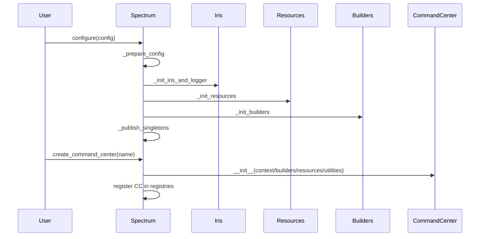
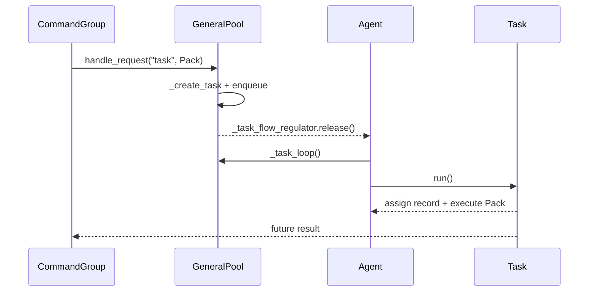
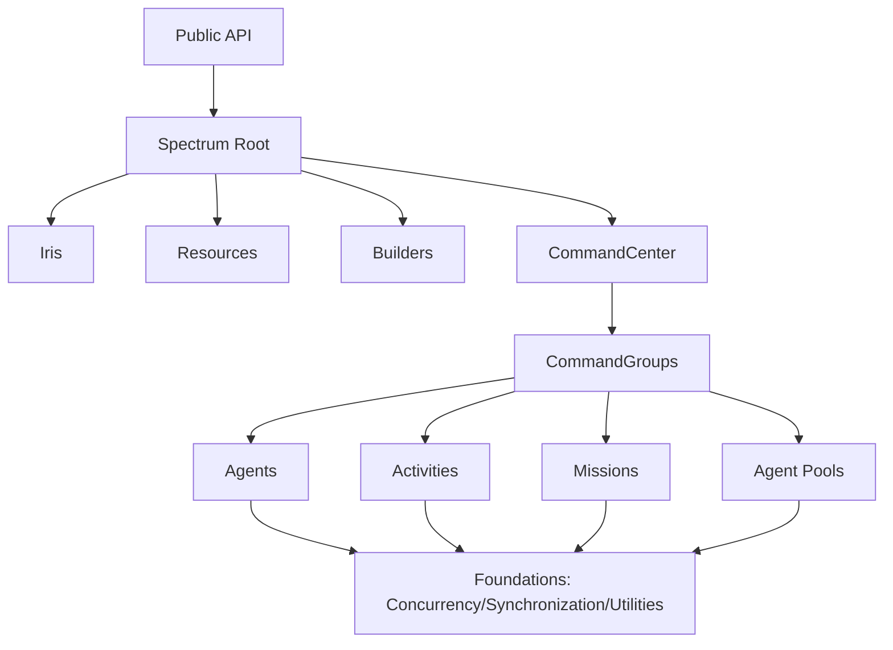
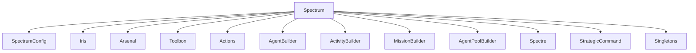
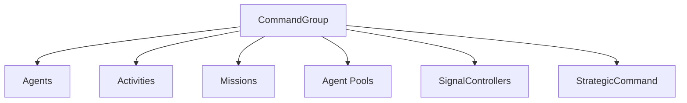
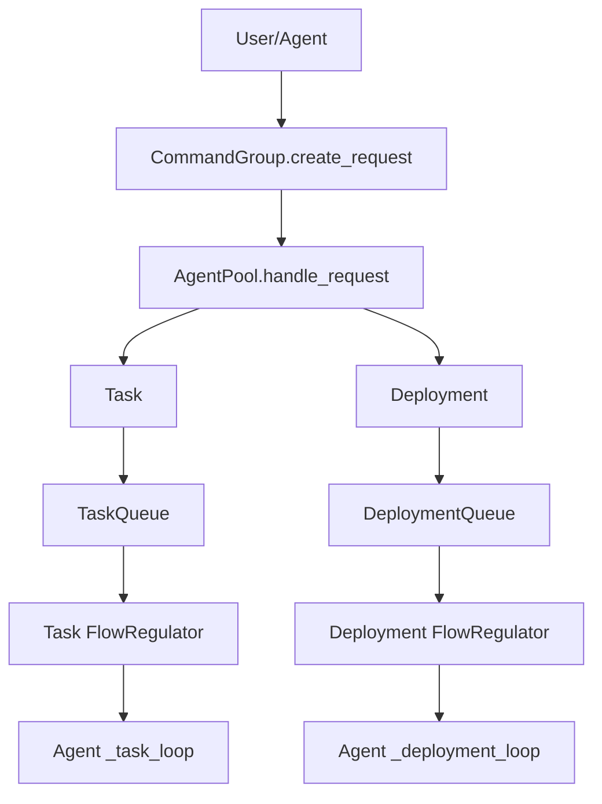

# Src Components (C3/C2/C1)

## Metadata
- Doc ID: COMP-SRC-2026-01-17
- Status: current
- Owner:
- Created: 2026-01-17
- Updated: 2026-01-17

## Scope
This document defines C3 components, C2 subcomponents, and C1 code references
for the CommandOps core platform (`src/command_ops`). It complements
`codex_todo/architecture/src_architecture.md` by providing component-level
responsibilities, contracts, and relationships.

Out of scope:
- Peripheral tools not required to understand core behavior.
- Tests (see `codex_todo/components/tests_components.md`).

## Documentation Quality Standard
This document is treated as durable context. It must be deep enough to recover
system understanding from a blank slate without handwaving.

Required rules:
- No vague summaries. Every claim must be grounded in source evidence or marked as unknown.
- Explicit entrypoints and method-level call flows for core behavior.
- Explicit ownership, lifecycle, and cleanup order for components.
- Explicit invariants, failure modes, and concurrency constraints.
- ASCII and Mermaid diagrams for core flows.
- Update the information sources list when new files are used.

## Table of Contents
- Documentation Quality Standard
- Component Template
- C3 Components Catalog
- C2 Subcomponents Catalog
- C1 Code Map (Core)
- Diagrams
- Information Sources
- Open Questions
- Context / Handoff Summary

## Component Template
Each component entry includes:
- Purpose
- Responsibilities
- Inputs
- Outputs
- Owned State
- Lifecycle/Cleanup
- Concurrency/Threading
- Invariants/Guarantees
- Failure Modes
- Observability
- Extension Points
- Key Files (C1)

## C3 Components Catalog

### Component: Public API and Runtime Guardrails
Purpose:
- Provide the import-time boundary and public API export surface.
- Enforce runtime guardrails before any other modules are used.

Responsibilities:
- Enforce Python >= 3.13 runtime (raise RuntimeError if too old).
- Enforce free-threaded build via `_detect_nogil_mode()` (uses `sys._is_gil_enabled()`; RuntimeError if GIL on).
- Assemble the public surface by importing concurrency structures, sync types, synchronization primitives, and utilities.
- Construct the global `spectrum = Spectrum()` singleton at import time.
- Export `__version__`, `__author__`, and OS_NAME metadata.

Inputs:
- Python runtime version.
- GIL mode from `sys._is_gil_enabled()` (heuristic).

Outputs:
- Exported symbols and global `spectrum` instance.
- Updated `__version__` (adds `-dev` when DEBUG_MODE is True).

Owned State:
- Module-level `spectrum` instance.
- `DEBUG_MODE`, `__version__`, `__author__`, OS_NAME exports.

Lifecycle/Cleanup:
- Module import triggers guardrails and singleton creation.
- Spectrum cleanup resets singleton state; module globals remain.

Concurrency/Threading:
- No explicit locks in module scope; Spectrum enforces singleton safety internally.

Invariants/Guarantees:
- Import fails if Python < 3.13 or GIL enabled.
- `spectrum` exists after import and is singleton-backed.

Failure Modes:
- RuntimeError on invalid Python version.
- RuntimeError on GIL-enabled build.

Observability:
- Errors raised at import time, no logger.

Extension Points:
- None; this is a static boundary.

Key Files (C1):
- `src/command_ops/__init__.py`

### Component: Spectrum Root and Bootstrapping
Purpose:
- Root singleton for configuring and building CommandOps core.

Responsibilities:
- Enforce singleton identity (`__new__` double-checked locking).
- Validate and freeze SpectrumConfig (`ensure_fully_configured`).
- Initialize Iris logging fabric and create Spectrum's ChannelLogger.
- Create shared resources (Arsenal, Toolbox, Actions).
- Create shared builders (AgentBuilder, ActivityBuilder, MissionBuilder, AgentPoolBuilder, Spectre, StrategicCommand).
- Publish system-wide singletons (ContextConfig, Utilities, Builders, Resources).
- Create and register CommandCenter instances in name and id registries.
- Orchestrate full system cleanup with ordered teardown phases.

Inputs:
- SpectrumConfig (optional) or builder instance.
- CommandCenterConfig (optional) for `create_command_center`.

Outputs:
- Published singletons and CommandCenters.
- Global registries keyed by name and ULID id.

Owned State:
- `_id`, `_lock`, `_cfg`, `_environment`, `_agentic_mode`, `_configured`.
- Resource and builder instances.
- CommandCenter registries `_command_centers` (name) and `_all_command_centers` (id).
- Iris instance and Spectrum ChannelLogger.

Lifecycle/Cleanup:
- Configured exactly once via `configure()`; `_check_configured()` gates usage.
- Cleanup Phase 1 (under lock): CommandCenter cleanup, singleton cleanup, component cleanup.
- Cleanup Phase 2 (outside lock): null refs, Iris cleanup, lock cleanup, logger last.
- Resets singleton class flags and `_instance` back to None.

Concurrency/Threading:
- Uses an internal RLock (AgenticRLock or threading.RLock) to guard configure and registry operations.

Invariants/Guarantees:
- `configure()` can only run once; subsequent calls raise RuntimeError.
- Singletons publish only after `_configured` is True.
- CommandCenter names must be unique.

Failure Modes:
- Reconfiguration raises RuntimeError.
- Duplicate CommandCenter name raises ValueError.
- Creating a CommandCenter before configure raises RuntimeError.

Observability:
- Registers with Iris and logs configuration/cleanup events.

Extension Points:
- Customize SpectrumConfig, IrisConfig, and ArsenalConfig.

Key Files (C1):
- `src/command_ops/command_center/spectrum/spectrum.py`

### Component: Spectrum Configuration Objects
Purpose:
- Provide typed configuration surfaces for Spectrum, CommandCenter, Iris, and Arsenal.

Responsibilities:
- SpectrumConfig: builder/finalizer that freezes once configured.
- IrisConfig: configure logging channels, dispatch/archiver behavior, formatter options, and handlers.
- CommandCenterConfig: define group limits, maintenance pool naming, external controller, and loggers.
- ArsenalConfig: hold connector factories and agentic mode.

Inputs:
- User-provided configuration values and chainable setters.

Outputs:
- Validated, frozen config objects with `check_configuration()` enforcement.

Owned State:
- SpectrumConfig `_frozen` and `configured` flags.
- IrisConfig toggles (enabled, dispatch mode, archive settings, user handlers).
- CommandCenterConfig defaults (limits, names, templates).
- ArsenalConfig connector_factories ConcurrentDict.

Lifecycle/Cleanup:
- Config objects are Cleanable and null references on cleanup.
- SpectrumConfig freezes after `ensure_fully_configured()`.

Concurrency/Threading:
- No locks; configured before use (thread-safe by construction after freeze).

Invariants/Guarantees:
- SpectrumConfig `ensure_fully_configured` requires ArsenalConfig and IrisConfig.
- Frozen configs reject mutation via `_check_frozen`.
- CommandCenterConfig validates limits and naming on init and setters.

Failure Modes:
- Missing configuration fields raise ValueError.
- Modifying frozen SpectrumConfig raises RuntimeError.
- Invalid ArsenalConfig factories (non-callable) raise ValueError.

Observability:
- Errors raised directly (no logger).

Extension Points:
- Use fluent setters to construct config (`set_*`, `with_*`, `configure`).

Key Files (C1):
- `src/command_ops/command_center/spectrum/configurations/spectrum.py`
- `src/command_ops/command_center/spectrum/configurations/command_center.py`
- `src/command_ops/command_center/spectrum/configurations/iris.py`
- `src/command_ops/command_center/spectrum/configurations/arsenal.py`

### Component: Iris Logging Fabric
Purpose:
- Provide centralized logging with channels, policies, viewer, and archiver support.

Responsibilities:
- Initialize formatter/context filter, default channel, and IrisPolicy.
- Register registrants and produce ChannelLogger instances.
- Create and manage IrisChannel instances (MemoryHandler + optional stream mirror).
- Apply IrisPolicy routing and enable/disable rules.
- Provide IrisViewer for in-memory access and query.
- Support archiving strategies and dispatch modes via IrisChannel.

Inputs:
- IrisConfig values (enabled, default channel name, capacity, dispatch mode, archive strategy).
- Registrant registration requests (`register` and `_internal_register`).

Outputs:
- ChannelLogger instances and routed log events.
- In-memory log records and optional archive batches.

Owned State:
- `_channels`, `_registrants`, `_subscriptions`.
- `_policy`, `_viewer`, `_formatter`, `_context_filter`.
- Default channel name, message capacity, and archive defaults.

Lifecycle/Cleanup:
- Created by Spectrum and cleaned by Spectrum cleanup.
- Cleanup order: registrants -> channels -> viewer -> subscriptions -> policy -> internal locks/logger.

Concurrency/Threading:
- Internal lock, ConcurrentDict, and ConcurrentList.
- Archiver OFFLOAD uses bounded queue with drop-oldest behavior.

Invariants/Guarantees:
- Default channel created at init (`_setup_default_channel`).
- Policy and viewer attach to Iris logger after `_init_self_logger`.
- Channel registration attaches MemoryHandler capacity and optional stream mirror.

Failure Modes:
- Misconfigured archiver (CALLBACK without handler) raises ValueError.
- Cleanup swallows exceptions to complete teardown.

Observability:
- Iris logs to its own ChannelLogger.

Extension Points:
- Register custom channels and archivers.
- Configure IrisPolicy and IrisViewer query behavior.

Key Files (C1):
- `src/command_ops/command_center/spectrum/iris/iris.py`
- `src/command_ops/command_center/spectrum/iris/iris_channel.py`
- `src/command_ops/command_center/spectrum/iris/channel_logger.py`
- `src/command_ops/command_center/spectrum/iris/iris_policy.py`
- `src/command_ops/command_center/spectrum/iris/iris_viewer.py`

### Component: Spectrum Resources (Arsenal, Toolbox, Actions)
Purpose:
- Provide shared resource registries for connectors, tools, and actions.

Responsibilities:
- Arsenal manages connector factories, live connectors, and service APIs.
- Toolbox manages tool class registry and builds stateless tool instances.
- Actions manages action registry and command-style facades.
- Enforce base-type validation (BaseConnector, BaseTool, Action).

Inputs:
- ArsenalConfig connector factories (Pack-wrapped factories).
- Tool and action registrations.
- Requests to build tools, connectors, and action instances.

Outputs:
- Connector/tool/action instances and registries.
- Service APIs published for discovery via Arsenal.

Owned State:
- Arsenal: connector factories, live connector cache, live services registry.
- Toolbox: tool registry.
- Actions: action registry and default action set.

Lifecycle/Cleanup:
- Cleaned by SpectrumResources and Spectrum cleanup.
- Arsenal cleanup cascades to connectors, factories, and registered services.
- Toolbox/Actions cleanup clears registries, locks, then logger last.

Concurrency/Threading:
- Internal locks and ConcurrentDict registries.
- Arsenal `get_connector` uses double-checked locking for cached connectors.

Invariants/Guarantees:
- Registered connectors are created via Pack factories and initialized with Arsenal.
- Toolbox only accepts BaseTool subclasses.
- Actions registry only accepts Action subclasses.

Failure Modes:
- Missing connector factory raises KeyError.
- Invalid tool/action class raises TypeError.
- Connector factory must be Pack-verified; invalid Pack raises TypeError.

Observability:
- Dedicated Iris loggers per resource manager.

Extension Points:
- Register connectors, tools, actions.
- Publish mission-backed services via `BaseService` and `register_service`.

Key Files (C1):
- `src/command_ops/command_center/spectrum/arsenal/arsenal.py`
- `src/command_ops/command_center/spectrum/toolbox/toolbox.py`
- `src/command_ops/command_center/spectrum/actions/actions.py`

### Component: Spectrum Builders
Purpose:
- Provide shared registries for core object construction.

Responsibilities:
- Maintain registries for agents, activities, missions, pools.
- Maintain registry for mind/thoughtstream templates (Spectre).
- Maintain strategy registry for StrategicCommand (scope + command type).
- Enforce template validity and provide build_* APIs.

Inputs:
- Template and class registrations.
- Build requests from CommandCenter/CommandGroup.

Outputs:
- Built objects via build_* methods and strategy execution.

Owned State:
- ConcurrentDict registries per builder.
- Structured template objects (AgentTemplate, MindTemplate, ThoughtStreamTemplate).

Lifecycle/Cleanup:
- Cleaned by SpectrumBuilders or Spectrum cleanup.
- Builders cascade cleanup to template objects and registries.

Concurrency/Threading:
- Internal locks and ConcurrentDict registries.

Invariants/Guarantees:
- AgentBuilder registers `general` template with task/deployment tags.
- Spectre registers default mind (`puppet_mind`) and thoughtstream (asyncio).

Failure Modes:
- Invalid registration raises TypeError.
- Duplicate template names raise ValueError.

Observability:
- Builders log via Iris channel loggers.

Extension Points:
- Register additional templates and strategies.

Key Files (C1):
- `src/command_ops/command_center/agents/agent_builder.py`
- `src/command_ops/command_center/activity/builder.py`
- `src/command_ops/command_center/mission/builder.py`
- `src/command_ops/command_center/agent_pools/agent_pool_builder.py`
- `src/command_ops/command_center/agents/spectre/spectre.py`
- `src/command_ops/command_center/strategic_command/strategic_command.py`

### Component: Spectrum Singletons
Purpose:
- Provide system-wide access to builders, resources, utilities, and context.

Responsibilities:
- Enforce publication and access rules.
- Provide safe accessors and availability checks (`is_available`, `get_instance`).
- Hold references to Spectrum-owned dependencies (resources/builders/utilities).

Inputs:
- Spectrum and dependency instances at publish time.

Outputs:
- Singleton access via get_instance.

Owned State:
- `_instance`, `_initialized` class flags.
- Class-level `_lock` (AgenticRLock or threading.Lock).
- References to dependencies.

Lifecycle/Cleanup:
- Published only by Spectrum.
- Cleaned and unpublished via cleanup (null refs, reset flags).

Concurrency/Threading:
- Class-level lock for publish/unpublish.

Invariants/Guarantees:
- Access before publication raises RuntimeError.
- Publish requires Spectrum configured flag to be True.

Failure Modes:
- Duplicate publication raises ValueError.

Observability:
- Logs on cleanup using Iris loggers.

Extension Points:
- None; managed by Spectrum.

Key Files (C1):
- `src/command_ops/command_center/spectrum/system_wide_tools/context_config.py`
- `src/command_ops/command_center/spectrum/system_wide_tools/utilities.py`
- `src/command_ops/command_center/spectrum/system_wide_tools/builders.py`
- `src/command_ops/command_center/spectrum/system_wide_tools/resources.py`

### Component: CommandCenter Orchestration
Purpose:
- Coordinate groups and enforce system-level agent constraints.

Responsibilities:
- Create CommandGroups and manage registry.
- Create maintenance group and pool on init (using config names and templates).
- Integrate with external SignalController (register/unregister + notify).
- Manage cleanup tracker and global agent counters.
- Provide command map for SignalController (group, registry, strategy APIs).

Inputs:
- CommandCenterConfig and Spectrum singletons (builders/resources/utilities).

Outputs:
- CommandGroup instances and maintenance pool.
- SignalController command surface via `_get_object_details`.

Owned State:
- `_command_groups` registry (ConcurrentDict).
- `_maintenance_group` and maintenance pool reference.
- `_cleanup_tracker` (AgentCleanupTracker).
- `_total_agent_count` and `_max_size` (SyncInt).

Lifecycle/Cleanup:
- Created by Spectrum; maintenance group is created immediately.
- Cleanup order: groups -> tracker -> core refs -> lock -> logger last.

Concurrency/Threading:
- AgenticRLock or RLock guarding create/remove/group operations.

Invariants/Guarantees:
- Maintenance group exists after init.
- `create_command_group` enforces total max agents.

Failure Modes:
- External SignalController registration can fail (logged, continues).
- Duplicate group names raise ValueError.
- Removing maintenance/default groups is denied.

Observability:
- Logs lifecycle events and external controller notifications.

Extension Points:
- Custom configs and external controller integration.

Key Files (C1):
- `src/command_ops/command_center/command_center.py`

### Component: CommandGroup Container
Purpose:
- Provide a scope for agents, pools, activities, missions.

Responsibilities:
- Manage registries for agents, pools, activities, missions, and signal controllers.
- Create agent pools via AgentPoolBuilder; optionally pre-populate pools.
- Create agents via AgentBuilder and register them with pools/activities/missions.
- Submit work to pools (`create_request`, `create_requests`) with tag validation.
- Provide resource access facades (Arsenal, Toolbox, Actions).
- Delegate strategy execution to StrategicCommand.

Inputs:
- CommandCenter reference and group config.

Outputs:
- Work submissions, agent/pool/activity/mission lifecycle operations.

Owned State:
- `_agents`, `_agent_pools`, `_activities`, `_missions`.
- `_signal_controllers` and `_strategic_command` reference.
- `_agent_count`, `_group_max_agents` counters.

Lifecycle/Cleanup:
- Cleaned by shutting down members and clearing registries.
- Maintenance pool reference is nullified last.

Concurrency/Threading:
- AgenticRLock or RLock guarding registry and lifecycle operations.

Invariants/Guarantees:
- create_request validates pool and tags and verifies Pack work callables.
- Agent creation enforces group and total limits.

Failure Modes:
- Missing pool or invalid tags raise ValueError.
- Unknown group names raise KeyError.

Observability:
- Logs lifecycle changes and strategy execution.

Extension Points:
- Custom strategies via StrategicCommand.

Key Files (C1):
- `src/command_ops/command_center/command_group.py`

### Component: Agents
Purpose:
- Provide thread-based workers with memory and state.

Responsibilities:
- Manage state transitions and cleanup for long-lived threads.
- Execute jobs via OperationalMemory/Operations.
- Participate in activities and missions (register/deregister).
- Track public/private inventories and metadata.
- Maintain Spectre mind and thoughtstream access.

Inputs:
- CommandGroup and AgentPool references.
- Mind template name and pool metadata.

Outputs:
- Work execution and state transitions.
- Task/Deployment participation and records.

Owned State:
- Spectre mind, OperationalMemory, and focus state.
- Registered activities/missions.
- Public/private inventories and metadata.
- Agent state, tags, and desired transitions.

Lifecycle/Cleanup:
- Cleaned by clearing registrations, inventories, mind, and operational memory.
- General agent run uses `_life_loop` and triggers cleanup on exit.

Concurrency/Threading:
- AgenticRLock or RLock.
- Agents are daemon threads; run entrypoint is subclass-specific.

Invariants/Guarantees:
- Agent is a daemon thread.
- Cleaned agents cannot be reused.
- Private inventory access requires caller validation.

Failure Modes:
- Invalid transitions or misuse of cleaned agent raise errors.
- `delegate_to_pool`/`delegate_to_group` raises if no pool/group available.

Observability:
- Logs through Iris.

Extension Points:
- Subclass Agent for custom behavior (override run/self_check/pause).

Key Files (C1):
- `src/command_ops/command_center/agents/agent_types/agent.py`
- `src/command_ops/command_center/agents/agent_types/general.py`

### Component: Spectre Mind System
Purpose:
- Provide registry and construction of minds and thoughtstreams.

Responsibilities:
- Register mind and thoughtstream templates.
- Create mind instances for agents and register by agent id.
- Create thoughtstreams for a given mind.
- Track active minds and template metadata.

Inputs:
- Template registrations and agent context.

Outputs:
- Mind and thoughtstream instances and template metadata.

Owned State:
- Mind registry, thoughtstream registry, mind instances.
- Default template set (puppet_mind, asyncio_thoughtstream).

Lifecycle/Cleanup:
- Cleaned by clearing registries and references.
- Minds are cleaned by their owning agents; Spectre only drops registry refs.

Concurrency/Threading:
- AgenticRLock or RLock.

Invariants/Guarantees:
- Default mind and thoughtstream templates registered.
- Each agent id can only be bound to one mind instance.

Failure Modes:
- Invalid template registration raises TypeError.
- Creating a mind for an agent with existing mind raises ValueError.

Observability:
- Logs through Iris.

Extension Points:
- Register custom minds and thoughtstreams.

Key Files (C1):
- `src/command_ops/command_center/agents/spectre/spectre.py`
- `src/command_ops/command_center/agents/spectre/minds/base_mind.py`

### Component: OperationalMemory and Operations
Purpose:
- Manage agent capabilities and focus constraints.

Responsibilities:
- Register jobs, tools, and actions (Pack-wrapped jobs).
- Provide focus profiles that constrain capabilities (allowed jobs/tools/actions).
- Delegate execution to Operations engine and track call stack.
- Save/restore focus profiles and memory snapshots.

Inputs:
- Agent reference and capability registrations.

Outputs:
- Execution of jobs, tools, and actions.
- Call stack traces and focus state.

Owned State:
- `_all_jobs`, `_all_tools`, `_all_actions`.
- `_saved_memories`, `_saved_focuses`, `_current_focus_name`.
- Operations engine with `_stack` of execution trace.

Lifecycle/Cleanup:
- Cleaned by cleaning registries and Operations engine.
- Operations cleanup clears stack then null refs and logger.

Concurrency/Threading:
- AgenticRLock or RLock.
- Operations uses ConcurrentStack for execution trace.

Invariants/Guarantees:
- Jobs stored as Pack objects.
- Focus sets operations views to filtered dictionaries.

Failure Modes:
- Missing job/tool/action raises KeyError.
- Operations errors logged; can re-raise if requested.

Observability:
- Logs through Iris.

Extension Points:
- Register new jobs/tools/actions.
- Add new focus profiles for constrained execution.

Key Files (C1):
- `src/command_ops/command_center/agents/utilities/operational_memory.py`

### Component: Activities
Purpose:
- Provide tactical work units managed by CommandGroup.

Responsibilities:
- Maintain status and lifecycle gates (pause/start).
- Track agents and metadata.
- Register/unregister with SignalController.
- Enforce min/max agent constraints.

Inputs:
- Activity configuration and metadata.

Outputs:
- Activity state transitions and results.

Owned State:
- `_status`, `_pause_gate`, `_start_gate`, `_registered_agents`.
- `_metadata` and `_tags`.

Lifecycle/Cleanup:
- Cleaned by unregistering and clearing registries.
- Cleanup clears gates and registries, then lock, then logger.

Concurrency/Threading:
- AgenticRLock or RLock.

Invariants/Guarantees:
- min_agents must not exceed max_agents.
- Reset only allowed when not RUNNING or PAUSED.

Failure Modes:
- Invalid agent tag checks raise ValueError or TypeError.

Observability:
- Logs through Iris.

Extension Points:
- Register custom activity subclasses.

Key Files (C1):
- `src/command_ops/command_center/activity/base.py`
- `src/command_ops/command_center/activity/general.py`

### Component: Missions
Purpose:
- Provide strategic workflows orchestrating activities.

Responsibilities:
- Manage mission status and lifecycle gates.
- Register activities and agents.
- Orchestrate activity deployment (SequentialOrchestratorMission).
- Optionally publish mission service APIs via Arsenal.

Inputs:
- Mission configuration and workflow steps.

Outputs:
- Mission state transitions and results.

Owned State:
- `_registered_activities`, `_registered_agents`, `_status`.
- `_pause_gate`, `_start_gate`, `_metadata`.

Lifecycle/Cleanup:
- Cleaned by cleaning activities and agents.
- Mission cleanup unregisters from SignalController and CommandGroup.

Concurrency/Threading:
- AgenticRLock or RLock.

Invariants/Guarantees:
- Sequential orchestrator uses one orchestrator agent (single assignment gate).
- `execute_mission` halts on failed activity and marks mission FAILED.

Failure Modes:
- Activity failure triggers mission failure.
- Orchestrator assignment is denied when already assigned.

Observability:
- Logs through Iris.

Extension Points:
- Register custom mission subclasses.

Key Files (C1):
- `src/command_ops/command_center/mission/base.py`
- `src/command_ops/command_center/mission/sequential_orchestrator.py`

### Component: Agent Pools
Purpose:
- Manage groups of agents and dispatch work.

Responsibilities:
- Track agent membership and jobs.
- Provide `handle_request` routing for tasks and deployments.
- Maintain task/deployment queues and flow regulators.
- Onboard agents into pool-specific loops and focus profile.
- Manage PerformanceOps and maintenance callbacks in GeneralPool.

Inputs:
- Work requests from CommandGroup (Pack work callables).

Outputs:
- Task and Deployment objects.
- Agent loop scheduling via FlowRegulator.

Owned State:
- Job registry, queues, flow regulators.
- Agent sets by role (task/deployment/sleep) and counts.
- Records ledger for agent work.

Lifecycle/Cleanup:
- Cleaned by flagging agents and clearing queues.
- Flow regulators released to wake waiters before teardown.

Concurrency/Threading:
- AgenticRLock or RLock.
- FlowRegulator and AgenticLock for deployment offer coordination.

Invariants/Guarantees:
- Work callables must be Pack verified.
- Request types restricted to pool-supported types.

Failure Modes:
- Tag mismatch raises ValueError.
- Unknown request type raises NotImplementedError.

Observability:
- Logs through Iris.

Extension Points:
- Register custom pool subclasses.

Key Files (C1):
- `src/command_ops/command_center/agent_pools/base.py`
- `src/command_ops/command_center/agent_pools/general.py`

### Component: Work Objects (Task and Deployment)
Purpose:
- Represent work items as Future-like objects.

Responsibilities:
- Track status and results.
- Provide hooks and timeout handling.
- Manage agent assignment (Deployment) and per-agent completion tracking.
- Record audit trail via Record and WorkStatus.

Inputs:
- Pack work callables and metadata.

Outputs:
- Future results and status transitions.
- Record updates and agent completion markers.

Owned State:
- Status enum, metadata, hook lists.
- Record object and stopwatch for timeout tracking.
- Assigned agent set for Deployment.

Lifecycle/Cleanup:
- Cleaned by clearing hooks and records.
- Task/Deployment cleanup is idempotent and clears Pack references.

Concurrency/Threading:
- AgenticRLock or RLock.

Invariants/Guarantees:
- Pack verification required for work callables.
- Task uses `set_running_or_notify_cancel` to gate execution.

Failure Modes:
- Timeout transitions to failure state.
- Attempting to run coroutine without loop raises RuntimeError.

Observability:
- No internal logger; pool logs surrounding events.

Extension Points:
- Customize work_type metadata and hooks.

Key Files (C1):
- `src/command_ops/command_center/agent_pools/task/task.py`
- `src/command_ops/command_center/agent_pools/deployment/deployment.py`

### Component: StrategicCommand
Purpose:
- Provide strategy registry for deployment and task routing.

Responsibilities:
- Register default strategies by scope (command_center/command_group) and type.
- Execute strategies by scope and command type.
- Provide a single entry point for CommandGroup execute_strategy.

Inputs:
- Strategy class registrations and execution kwargs.

Outputs:
- Strategy results.

Owned State:
- Nested registry by scope and command type.

Lifecycle/Cleanup:
- Cleaned by clearing registries.

Concurrency/Threading:
- AgenticRLock or RLock.

Invariants/Guarantees:
- Strategy class must subclass BaseStrategy.

Failure Modes:
- Invalid scope or type raises errors.

Observability:
- Logs through Iris.

Extension Points:
- Register custom strategies.

Key Files (C1):
- `src/command_ops/command_center/strategic_command/strategic_command.py`

### Component: Concurrency Foundations
Purpose:
- Provide thread-safe data structures and sync types.

Responsibilities:
- Provide concurrent containers.
- Provide sync wrappers for scalar values.
- Provide freeze semantics for some containers (lockless reads).

Inputs:
- Data from core components.

Outputs:
- Thread-safe operations and atomic values.

Owned State:
- Internal dict/list/set/queue structures.

Lifecycle/Cleanup:
- Cleaned by clearing internal containers and locks.

Concurrency/Threading:
- AgenticRLock or RLock inside each structure.

Invariants/Guarantees:
- Frozen containers reject mutation.

Failure Modes:
- Mutating frozen container raises TypeError.

Observability:
- Limited logging; errors are raised.

Extension Points:
- Add new concurrent structures if needed.

Key Files (C1):
- `src/command_ops/concurrency/data_structures/`
- `src/command_ops/concurrency/sync_types/`

### Component: Synchronization Foundations
Purpose:
- Provide locks, barriers, and coordination primitives.

Responsibilities:
- Provide agent-aware locks and wait/wakeup.
- Provide SignalController for command invocation.
- Provide dispatchers and coordinators.
- Provide FlowRegulator and Gate primitives for pool scheduling.

Inputs:
- Thread and agent context.

Outputs:
- Coordinated execution and signaling.

Owned State:
- Lock state, waiters, and registries.

Lifecycle/Cleanup:
- Cleaned by waking waiters and clearing registries.

Concurrency/Threading:
- AgenticRLock for agent-aware primitives.

Invariants/Guarantees:
- Only owner can release AgenticRLock.
- SignalController requires `_get_object_details` contract.

Failure Modes:
- Non-agentic threads using agentic locks raise errors.

Observability:
- Some primitives log via Iris.

Extension Points:
- Implement custom strategies or controllers.

Key Files (C1):
- `src/command_ops/synchronization/`

### Component: Utilities and Coordination
Purpose:
- Provide Cleanable, Pack, ObjectRegistry, and helpers.

Responsibilities:
- Enforce cleanup contracts.
- Provide callable wrappers and coordination utilities.
- Provide registry for object discovery.
- Provide agentic helper functions for thread identity and wait/wakeup.

Inputs:
- Callables, metadata, registry paths.

Outputs:
- Wrapped callables, registry entries, and helper utilities.

Owned State:
- Pack stores args and kwargs.
- ObjectRegistry stores RegistryNodes.

Lifecycle/Cleanup:
- Cleaned by clearing references and locks.

Concurrency/Threading:
- ObjectRegistry uses AgenticRLock when agentic mode is true.

Invariants/Guarantees:
- Pack rejects generator functions.
- Cleanable cleanup is idempotent.

Failure Modes:
- Invalid registration paths raise ValueError.

Observability:
- Limited logging; errors raised by utilities.

Extension Points:
- Register new objects in ObjectRegistry.

Key Files (C1):
- `src/command_ops/utilities/`

## C2 Subcomponents Catalog

### Subcomponent: Spectrum.configure Pipeline
Parent Component: Spectrum Root and Bootstrapping
Purpose:
- Define the ordered initialization of core services.
Contract/Interface:
- configure() runs once; publishes singletons after _configured True.
- Sequence: _prepare_config -> _init_iris_and_logger -> _init_resources -> _init_builders -> _configured = True -> _publish_singletons.
Data Structures:
- SpectrumConfig, IrisConfig, ConcurrentDict registries.
Concurrency/Threading:
- Protected by Spectrum lock.
Key Files (C1):
- `src/command_ops/command_center/spectrum/spectrum.py`

### Subcomponent: Spectrum Singletons Publication
Parent Component: Spectrum Root and Bootstrapping
Purpose:
- Publish ContextConfig, Utilities, Builders, Resources.
Contract/Interface:
- Publication requires configured Spectrum.
Data Structures:
- Class-level locks and instance references.
Concurrency/Threading:
- Class-level lock guards publish/unpublish.
Key Files (C1):
- `src/command_ops/command_center/spectrum/system_wide_tools/`

### Subcomponent: CommandCenter Creation Flow
Parent Component: Spectrum Root and Bootstrapping
Purpose:
- Build and register CommandCenter instances using published singletons.
Contract/Interface:
- `create_command_center` requires configured Spectrum.
- CommandCenter names must be unique across `_command_centers`.
Data Structures:
- `_command_centers` (name -> CommandCenter) and `_all_command_centers` (id -> CommandCenter).
Concurrency/Threading:
- Spectrum lock guards registry updates.
Key Files (C1):
- `src/command_ops/command_center/spectrum/spectrum.py`
- `src/command_ops/command_center/command_center.py`

### Subcomponent: Iris Channel Management
Parent Component: Iris Logging Fabric
Purpose:
- Create and manage IrisChannel instances.
Contract/Interface:
- Channels register with Iris and are removed on cleanup.
Data Structures:
- ConcurrentDict registry of IrisChannel objects.
Concurrency/Threading:
- Iris lock guards channel creation.
Key Files (C1):
- `src/command_ops/command_center/spectrum/iris/iris_channel.py`

### Subcomponent: Iris Registrant Logging
Parent Component: Iris Logging Fabric
Purpose:
- Register registrants and issue ChannelLogger objects.
Contract/Interface:
- Registrant must supply object and groups/channels.
Data Structures:
- ConcurrentDict registry of ChannelLogger instances.
Concurrency/Threading:
- Iris lock guards registrant registration.
Key Files (C1):
- `src/command_ops/command_center/spectrum/iris/channel_logger.py`

### Subcomponent: Iris Policy Routing
Parent Component: Iris Logging Fabric
Purpose:
- Apply routing rules for channels and groups.
Contract/Interface:
- Policy can enable/disable channels and groups.
Data Structures:
- Policy state stored in IrisPolicy.
Concurrency/Threading:
- Iris lock guards policy updates.
Key Files (C1):
- `src/command_ops/command_center/spectrum/iris/iris_policy.py`

### Subcomponent: Iris Viewer
Parent Component: Iris Logging Fabric
Purpose:
- Provide queryable in-memory log view.
Contract/Interface:
- Viewer tracks messages by channel.
Data Structures:
- IrisViewer structures.
Concurrency/Threading:
- Uses internal locks and concurrent lists.
Key Files (C1):
- `src/command_ops/command_center/spectrum/iris/iris_viewer.py`

### Subcomponent: Arsenal Connector Factories
Parent Component: Spectrum Resources
Purpose:
- Store Pack factories for connectors.
Contract/Interface:
- Pack.verify required for factory registration.
- Connector instances must call `initialize(arsenal)` after creation.
Data Structures:
- ConcurrentDict of factories.
Concurrency/Threading:
- Arsenal lock guards registry.
Key Files (C1):
- `src/command_ops/command_center/spectrum/arsenal/arsenal.py`

### Subcomponent: Arsenal Live Connectors
Parent Component: Spectrum Resources
Purpose:
- Cache retained connectors for reuse.
Contract/Interface:
- Connectors are Cleanable and cleaned on Arsenal cleanup.
 - `get_connector` uses double-checked locking for cached instances.
Data Structures:
- ConcurrentDict of live connectors.
Concurrency/Threading:
- Arsenal lock guards live connectors.
Key Files (C1):
- `src/command_ops/command_center/spectrum/arsenal/arsenal.py`

### Subcomponent: Arsenal Services Registry
Parent Component: Spectrum Resources
Purpose:
- Register long-lived services (missions as APIs).
Contract/Interface:
- Services can be Cleanable and cleaned on teardown.
Data Structures:
- ConcurrentDict of services.
Concurrency/Threading:
- Arsenal lock guards services.
Key Files (C1):
- `src/command_ops/command_center/spectrum/arsenal/arsenal.py`

### Subcomponent: Toolbox Registry
Parent Component: Spectrum Resources
Purpose:
- Register tool classes by name.
Contract/Interface:
- Only BaseTool subclasses allowed.
Data Structures:
- ConcurrentDict registry.
Concurrency/Threading:
- Toolbox lock guards registry.
Key Files (C1):
- `src/command_ops/command_center/spectrum/toolbox/toolbox.py`

### Subcomponent: Actions Registry
Parent Component: Spectrum Resources
Purpose:
- Register action classes and provide facades.
Contract/Interface:
- Only Action subclasses allowed.
 - Default actions: Gather, Distribute, Collect, HandOut, SelfCheck.
Data Structures:
- ConcurrentDict registry.
Concurrency/Threading:
- Actions lock guards registry.
Key Files (C1):
- `src/command_ops/command_center/spectrum/actions/actions.py`

### Subcomponent: AgentBuilder Templates
Parent Component: Spectrum Builders
Purpose:
- Map template names to AgentTemplate objects.
Contract/Interface:
- Templates store agent class and tags.
Data Structures:
- ConcurrentDict registry.
Concurrency/Threading:
- AgentBuilder lock guards registry.
Key Files (C1):
- `src/command_ops/command_center/agents/agent_builder.py`

### Subcomponent: ActivityBuilder Registry
Parent Component: Spectrum Builders
Purpose:
- Map activity names to Activity classes.
Contract/Interface:
- Only BaseActivity subclasses allowed.
Data Structures:
- ConcurrentDict registry.
Concurrency/Threading:
- ActivityBuilder lock guards registry.
Key Files (C1):
- `src/command_ops/command_center/activity/builder.py`

### Subcomponent: MissionBuilder Registry
Parent Component: Spectrum Builders
Purpose:
- Map mission names to Mission classes.
Contract/Interface:
- Only BaseMission subclasses allowed.
Data Structures:
- ConcurrentDict registry.
Concurrency/Threading:
- MissionBuilder lock guards registry.
Key Files (C1):
- `src/command_ops/command_center/mission/builder.py`

### Subcomponent: AgentPoolBuilder Registry
Parent Component: Spectrum Builders
Purpose:
- Map pool names to pool classes.
Contract/Interface:
- Only BaseAgentPool subclasses allowed.
Data Structures:
- ConcurrentDict registry.
Concurrency/Threading:
- AgentPoolBuilder lock guards registry.
Key Files (C1):
- `src/command_ops/command_center/agent_pools/agent_pool_builder.py`

### Subcomponent: Spectre Mind Registry
Parent Component: Spectrum Builders
Purpose:
- Register MindTemplate and ThoughtStreamTemplate.
Contract/Interface:
- Mind and ThoughtStream classes must implement base interfaces.
Data Structures:
- ConcurrentDict registries.
Concurrency/Threading:
- Spectre lock guards registries.
Key Files (C1):
- `src/command_ops/command_center/agents/spectre/spectre.py`

### Subcomponent: StrategicCommand Registry
Parent Component: Spectrum Builders
Purpose:
- Register strategies by scope and command type.
Contract/Interface:
- Strategy must subclass BaseStrategy.
Data Structures:
- Nested ConcurrentDict registries.
Concurrency/Threading:
- StrategicCommand lock guards registry.
Key Files (C1):
- `src/command_ops/command_center/strategic_command/strategic_command.py`

### Subcomponent: CommandCenter Group Registry
Parent Component: CommandCenter Orchestration
Purpose:
- Store CommandGroup instances by name.
Contract/Interface:
- Groups created and owned by CommandCenter.
- Maintenance group and default group are created during init.
Data Structures:
- ConcurrentDict `_command_groups`.
Concurrency/Threading:
- CommandCenter lock guards group creation.
Key Files (C1):
- `src/command_ops/command_center/command_center.py`

### Subcomponent: CommandCenter Maintenance Bootstrap
Parent Component: CommandCenter Orchestration
Purpose:
- Create maintenance CommandGroup and maintenance AgentPool.
Contract/Interface:
- `_setup_maintenance_group` assumes maintenance CommandGroup already exists.
- Maintenance pool created via `create_agent_pool` with initial capacity.
Data Structures:
- Maintenance group reference and pool name from config.
Concurrency/Threading:
- CommandCenter lock guards group creation and setup.
Key Files (C1):
- `src/command_ops/command_center/command_center.py`

### Subcomponent: CommandGroup Activity Registry
Parent Component: CommandGroup Container
Purpose:
- Track activities created in the group.
Contract/Interface:
- Activities registered with group context injected.
Data Structures:
- ConcurrentDict `_activities`.
Concurrency/Threading:
- Group lock guards registry operations.
Key Files (C1):
- `src/command_ops/command_center/command_group.py`

### Subcomponent: CommandGroup Mission Registry
Parent Component: CommandGroup Container
Purpose:
- Track missions created in the group.
Contract/Interface:
- Missions registered with group context injected.
Data Structures:
- ConcurrentDict `_missions`.
Concurrency/Threading:
- Group lock guards registry operations.
Key Files (C1):
- `src/command_ops/command_center/command_group.py`

### Subcomponent: CommandGroup Pool Registry
Parent Component: CommandGroup Container
Purpose:
- Track pools created in the group.
Contract/Interface:
- Pools created via AgentPoolBuilder with `create_agent_pool`.
- Optional initial agent population via `create_agents`.
Data Structures:
- ConcurrentDict `_agent_pools`.
Concurrency/Threading:
- Group lock guards registry operations.
Key Files (C1):
- `src/command_ops/command_center/command_group.py`

### Subcomponent: CommandGroup Request Submission
Parent Component: CommandGroup Container
Purpose:
- Provide `create_request` and `create_requests` APIs.
Contract/Interface:
- Requires pool id, request type, Pack work callable.
- Validates required tags against pool tags before dispatch.
 - Delegates actual work routing to pool `handle_request`.
Data Structures:
- Pool registries and Pack object.
Concurrency/Threading:
- Group lock guards request creation.
Key Files (C1):
- `src/command_ops/command_center/command_group.py`

### Subcomponent: Agent Inventories
Parent Component: Agents
Purpose:
- Provide private and public ConcurrentDict inventories.
Contract/Interface:
- Inventory entries are arbitrary objects.
- Private inventory access is validated to agent thread.
Data Structures:
- ConcurrentDict for private/public inventories.
Concurrency/Threading:
- Agent lock guards inventory cleanup.
Key Files (C1):
- `src/command_ops/command_center/agents/agent_types/agent.py`

### Subcomponent: OperationalMemory Registries
Parent Component: OperationalMemory
Purpose:
- Store job/tool/action registries and focuses.
Contract/Interface:
- Jobs are Pack objects.
- Focus sets Operations views to filtered dictionaries.
Data Structures:
- ConcurrentDict for jobs/tools/actions and saved focuses.
Concurrency/Threading:
- OperationalMemory lock guards registries.
Key Files (C1):
- `src/command_ops/command_center/agents/utilities/operational_memory.py`

### Subcomponent: General Agent Life Loop
Parent Component: Agents
Purpose:
- Run the core state machine for the General agent.
Contract/Interface:
- `_life_loop` runs onboarding job once, then executes current job until DISMISSING/CLEANED.
- `_process_transitions` applies focus/state/job transitions with precedence.
Data Structures:
- AgentState enum, OperationalMemory jobs, desired state/job fields.
Concurrency/Threading:
- Agent lock protects state transitions.
Key Files (C1):
- `src/command_ops/command_center/agents/agent_types/general.py`

### Subcomponent: Mind Initialization and Focus
Parent Component: Spectre Mind System
Purpose:
- Initialize the agent mind and establish a core thoughtstream.
Contract/Interface:
- `initialize_mind` builds a core thoughtstream, focuses it, and sets `_initialized`.
- `focus_on` swaps focused thoughtstream and calls setup/release hooks.
Data Structures:
- Thoughtstream registry, focus ids, request queue.
Concurrency/Threading:
- Mind lock guards focus and request operations.
Key Files (C1):
- `src/command_ops/command_center/agents/spectre/minds/base_mind.py`

### Subcomponent: Mind Loop Modes
Parent Component: Spectre Mind System
Purpose:
- Run the mind loop in one of the supported modes (RUN_FOREVER, MULTIPLEX, MONITORED, ITERATION).
Contract/Interface:
- `_mind_loop` checks for running asyncio loop, then dispatches to mode handler.
- MULTIPLEX dequeues focus requests and optionally refocuses on core stream.
Data Structures:
- Request queue, monitoring predicates, focused thoughtstream.
Concurrency/Threading:
- Mind loop runs on agent thread; uses AgenticEvent for wakeups.
Key Files (C1):
- `src/command_ops/command_center/agents/spectre/minds/base_mind.py`

### Subcomponent: Activity Gates
Parent Component: Activities
Purpose:
- Provide pause/start gates.
Contract/Interface:
- Gates are latches to block/allow execution.
Data Structures:
- Gate objects from latch module.
Concurrency/Threading:
- Gate operations should be thread-safe.
Key Files (C1):
- `src/command_ops/command_center/activity/base.py`

### Subcomponent: Mission Gates
Parent Component: Missions
Purpose:
- Provide pause/start gates for mission control.
Contract/Interface:
- Gates used to control mission loop.
Data Structures:
- Gate objects from latch module.
Concurrency/Threading:
- Gate operations should be thread-safe.
Key Files (C1):
- `src/command_ops/command_center/mission/base.py`

### Subcomponent: GeneralPool Task Queue
Parent Component: Agent Pools
Purpose:
- Queue Task objects.
Contract/Interface:
- Task queue stores Task objects until agents consume.
Data Structures:
- ConcurrentQueue of Task.
Concurrency/Threading:
- Queue operations are thread-safe.
Key Files (C1):
- `src/command_ops/command_center/agent_pools/general.py`

### Subcomponent: GeneralPool Deployment Queue
Parent Component: Agent Pools
Purpose:
- Queue Deployment objects.
Contract/Interface:
- Deployment queue stores Deployment objects.
Data Structures:
- ConcurrentQueue of Deployment.
Concurrency/Threading:
- Queue operations are thread-safe.
Key Files (C1):
- `src/command_ops/command_center/agent_pools/general.py`

### Subcomponent: FlowRegulator Usage
Parent Component: Agent Pools
Purpose:
- Coordinate agent wakeups for tasks and deployments.
Contract/Interface:
- FlowRegulator release wakes waiting agents.
Data Structures:
- FlowRegulator counts.
Concurrency/Threading:
- FlowRegulator is thread-safe.
Key Files (C1):
- `src/command_ops/command_center/agent_pools/general.py`

### Subcomponent: GeneralPool Agent Onboarding
Parent Component: Agent Pools
Purpose:
- Register agent jobs, focus profile, and records ledger on join.
Contract/Interface:
- `_agent_onboarding` registers core jobs (`task`, `deployment`, `sleep`, `dismiss`) and focus `general_pool`.
- Agent is transitioned to next job assignment after onboarding.
Data Structures:
- Records ledger per agent, job registry in OperationalMemory.
Concurrency/Threading:
- Pool lock and ConcurrentSet updates are thread-safe.
Key Files (C1):
- `src/command_ops/command_center/agent_pools/general.py`

### Subcomponent: GeneralPool Task Loop
Parent Component: Agent Pools
Purpose:
- Process task queue items with cooperative gating.
Contract/Interface:
- `_task_loop` waits on `_task_flow_regulator`, dequeues Task objects, and calls `task.run()`.
- Agent self_check triggers loop exit and unregistration.
Data Structures:
- ConcurrentQueue of Task, FlowRegulator, task agent set.
Concurrency/Threading:
- FlowRegulator gating; queue operations are thread-safe.
Key Files (C1):
- `src/command_ops/command_center/agent_pools/general.py`

### Subcomponent: GeneralPool Deployment Loop
Parent Component: Agent Pools
Purpose:
- Coordinate shared deployment offers across agents.
Contract/Interface:
- `_deployment_loop` waits on `_deployment_flow_regulator`, posts offers from queue, and joins active deployments.
- Active offer guarded by `_deployment_lock`.
Data Structures:
- Deployment queue, active offer, deployment agent set.
Concurrency/Threading:
- FlowRegulator gating + deployment lock for offer changes.
Key Files (C1):
- `src/command_ops/command_center/agent_pools/general.py`

### Subcomponent: Task Lifecycle
Parent Component: Work Objects
Purpose:
- Track task status and retries.
Contract/Interface:
- Future-like interface with TaskStatus.
- `run()` gates with `set_running_or_notify_cancel` and applies retries/timeout.
Data Structures:
- TaskStatus enum, Record.
Concurrency/Threading:
- AgenticRLock or RLock.
Key Files (C1):
- `src/command_ops/command_center/agent_pools/task/task.py`

### Subcomponent: Deployment Lifecycle
Parent Component: Work Objects
Purpose:
- Track multi-agent deployment status.
Contract/Interface:
- Future-like interface with DeploymentStatus.
- `execute_deployment()` performs check-in then work execution.
Data Structures:
- DeploymentStatus enum, Record.
Concurrency/Threading:
- AgenticRLock or RLock.
Key Files (C1):
- `src/command_ops/command_center/agent_pools/deployment/deployment.py`

### Subcomponent: SignalController Registry
Parent Component: Synchronization Foundations
Purpose:
- Store managed objects and command maps.
Contract/Interface:
- Objects must provide `_get_object_details`.
Data Structures:
- ConcurrentDict of object records.
Concurrency/Threading:
- AgenticRLock or RLock.
Key Files (C1):
- `src/command_ops/synchronization/controllers/signal_controller.py`

### Subcomponent: AgenticRLock Waiter Queue
Parent Component: Synchronization Foundations
Purpose:
- Track waiting agent threads for lock acquisition.
Contract/Interface:
- Uses ordered dict to provide FIFO handoff.
Data Structures:
- OrderedDict of waiters.
Concurrency/Threading:
- Internal mutex protects state.
Key Files (C1):
- `src/command_ops/synchronization/primitives/agentic_rlock.py`

### Subcomponent: ConcurrentDict Freeze
Parent Component: Concurrency Foundations
Purpose:
- Allow lockless reads by freezing the dict.
Contract/Interface:
- Mutations raise TypeError when frozen.
Data Structures:
- `_freeze` boolean flag.
Concurrency/Threading:
- Lock is skipped for reads when frozen.
Key Files (C1):
- `src/command_ops/concurrency/data_structures/concurrent_dict.py`

## Method-Level Call Flows (C1)
These flows describe concrete method sequences for core behaviors.

### Flow: Import -> Spectrum Configure -> CommandCenter Creation
1. `import command_ops`:
   - Python version check in `src/command_ops/__init__.py`.
   - `_detect_nogil_mode()` uses `sys._is_gil_enabled()` and raises if GIL is on.
   - `spectrum = Spectrum()` singleton is constructed.
2. `spectrum.configure(config)`:
   - `_prepare_config` calls `SpectrumConfig.ensure_fully_configured()`.
   - `_init_iris_and_logger` instantiates Iris and registers Spectrum logger.
   - `_init_resources` creates Arsenal/Toolbox/Actions with Iris channel loggers.
   - `_init_builders` creates AgentBuilder/ActivityBuilder/MissionBuilder/AgentPoolBuilder/Spectre/StrategicCommand.
   - `_configured = True`, then `_publish_singletons` (ContextConfig, Utilities, Builders, Resources).
3. `spectrum.create_command_center(name, config)`:
   - `_check_configured` gates access.
   - CommandCenter constructed with ContextConfig/Builders/Resources/Utilities.
   - Registered in `_command_centers[name]` and `_all_command_centers[id]`.

### Flow: CommandCenter Startup -> Maintenance Group
1. `CommandCenter.__init__`:
   - Sets locks, agentic mode, counters, and loggers.
   - Optionally registers with external SignalController.
2. `create_command_group(maintenance_group_name, max_maintenance_agents)`:
   - Builds maintenance CommandGroup.
3. `_setup_maintenance_group`:
   - Looks up maintenance CommandGroup.
   - Creates maintenance AgentPool via `create_agent_pool` and initial capacity.
4. `create_command_group(default_command_group_name, default_group_max_agents)`:
   - Builds default CommandGroup for general usage.

### Flow: Work Request (Task) -> Agent Execution
1. `CommandGroup.create_request(pool_id, "task", Pack(work))`:
   - `Pack.verify` and tag validation (`_validate_pool_tags`).
   - Delegates to `pool.handle_request`.
2. `GeneralPool.handle_request("task", Pack)`:
   - Calls `_create_task` -> Task constructed (Record, hooks, stopwatch).
   - Enqueues Task in `_task_queue` and releases `_task_flow_regulator`.
3. `GeneralPool._task_loop` (agent job):
   - Waits on `_task_flow_regulator`.
   - Dequeues Task and calls `task.run()`.
4. `Task.run()`:
   - `set_running_or_notify_cancel` gates execution.
   - Agent assigns record, marks start, executes Pack (sync or coroutine).
   - Updates status, record completion, and future result.

### Flow: Work Request (Deployment) -> Multi-Agent Execution
1. `CommandGroup.create_request(pool_id, "deployment", Pack(work), agent_count, require_all)`:
   - Validates Pack and tags, delegates to pool.
2. `GeneralPool._create_deployment`:
   - Builds Deployment with Record.
   - Enqueues in `_deployment_queue` and releases `_deployment_flow_regulator` by agent_count.
3. `GeneralPool._deployment_loop` (agent job):
   - Waits on `_deployment_flow_regulator`.
   - Posts `_active_deployment_offer` from queue under `_deployment_lock`.
   - Calls `Deployment.execute_deployment()` to check in and run work.
4. `Deployment.execute_deployment()`:
   - `_attempt_check_in` assigns agent and updates status.
   - `_execute_work` runs Pack; completion updates record and status.

### Flow: General Agent Lifecycle
1. `General.run`:
   - Sets state ACTIVE, `self._spectre_mind.initialize_mind()`, enters `_life_loop`.
2. `_life_loop`:
   - Executes "onboarding" job if registered.
   - Loop: `_process_transitions` then `operational_memory.execute_job(current_job)`.
   - If no job, `Delay(0.01).execute()` yields.
3. Exit:
   - Executes "dismiss" job if registered, then cleanup.

### Flow: Mind Focus and Agentic Wait
1. `BaseMind.initialize_mind`:
   - Creates core thoughtstream via Spectre template.
   - Focuses on core and sets `_core_thoughtstream_id`.
2. `BaseMind._mind_loop`:
   - Dispatches to mode handler (RUN_FOREVER, MULTIPLEX, MONITORED, ITERATION).
3. `Agent.command_ops_wait`:
   - Delegates to mind `_agentic_wait`, which either drives loop or blocks on event.

### Flow: Resource Access (Arsenal/Toolbox/Actions)
1. `Agent.get_arsenal_connector(name)` -> `CommandGroup.get_arsenal_connector`:
   - `Arsenal.get_connector` builds via Pack factory and calls `initialize(arsenal)`.
2. `Agent.build_tool(name)` -> `Toolbox.build_tool`:
   - Instantiates registered BaseTool subclass with kwargs.
3. `Actions.gather/distribute`:
   - Instantiate action, `execute()`, and cleanup action instance.

### Mermaid: Configure + CommandCenter Creation


### Mermaid: Task Request Path


## C1 Code Map (Core)
This code map lists key files and what component they belong to.
Use this to jump from component descriptions to concrete implementation.

### Public API
- `src/command_ops/__init__.py` (Public API + runtime guardrails)
- `src/command_ops/__version__.py` (Version)
- `src/command_ops/__author__.py` (Author)
- `src/command_ops/__os__.py` (OS name)

### Spectrum Root
- `src/command_ops/command_center/spectrum/spectrum.py` (Spectrum singleton)
- `src/command_ops/command_center/spectrum/__init__.py` (module marker)

### Spectrum Configurations
- `src/command_ops/command_center/spectrum/configurations/spectrum.py` (SpectrumConfig)
- `src/command_ops/command_center/spectrum/configurations/command_center.py` (CommandCenterConfig)
- `src/command_ops/command_center/spectrum/configurations/iris.py` (IrisConfig)
- `src/command_ops/command_center/spectrum/configurations/arsenal.py` (ArsenalConfig)

### Spectrum System-wide Tools
- `src/command_ops/command_center/spectrum/system_wide_tools/context_config.py` (ContextConfig singleton)
- `src/command_ops/command_center/spectrum/system_wide_tools/utilities.py` (Utilities singleton)
- `src/command_ops/command_center/spectrum/system_wide_tools/builders.py` (Builders singleton)
- `src/command_ops/command_center/spectrum/system_wide_tools/resources.py` (Resources singleton)

### Spectrum Resources
- `src/command_ops/command_center/spectrum/arsenal/arsenal.py` (Arsenal)
- `src/command_ops/command_center/spectrum/arsenal/base_connector.py` (Connector base)
- `src/command_ops/command_center/spectrum/arsenal/base_service.py` (Service base)
- `src/command_ops/command_center/spectrum/toolbox/toolbox.py` (Toolbox)
- `src/command_ops/command_center/spectrum/toolbox/base.py` (BaseTool)
- `src/command_ops/command_center/spectrum/actions/actions.py` (Actions registry)
- `src/command_ops/command_center/spectrum/actions/action/action.py` (Action base)
- `src/command_ops/command_center/spectrum/actions/action/gather.py` (Gather)
- `src/command_ops/command_center/spectrum/actions/action/distribute.py` (Distribute)
- `src/command_ops/command_center/spectrum/actions/action/collect.py` (Collect)
- `src/command_ops/command_center/spectrum/actions/action/hand_out.py` (HandOut)
- `src/command_ops/command_center/spectrum/actions/action/self_check.py` (SelfCheck)
- `src/command_ops/command_center/spectrum/actions/action/delay.py` (Delay)

### Iris Logging
- `src/command_ops/command_center/spectrum/iris/iris.py` (Iris manager)
- `src/command_ops/command_center/spectrum/iris/iris_channel.py` (IrisChannel)
- `src/command_ops/command_center/spectrum/iris/channel_logger.py` (ChannelLogger)
- `src/command_ops/command_center/spectrum/iris/iris_policy.py` (IrisPolicy)
- `src/command_ops/command_center/spectrum/iris/iris_viewer.py` (IrisViewer)
- `src/command_ops/command_center/spectrum/iris/context_filter.py` (ContextFilter)
- `src/command_ops/command_center/spectrum/iris/high_resolution_formatter.py` (Formatter)
- `src/command_ops/command_center/spectrum/iris/memory_handler.py` (Memory handler)
- `src/command_ops/command_center/spectrum/iris/safe_logger.py` (SafeLogger)

### CommandCenter and Groups
- `src/command_ops/command_center/command_center.py` (CommandCenter)
- `src/command_ops/command_center/command_group.py` (CommandGroup)
- `src/command_ops/command_center/agent_cleanup_tracker.py` (AgentCleanupTracker)

### Activities
- `src/command_ops/command_center/activity/base.py` (BaseActivity)
- `src/command_ops/command_center/activity/general.py` (GeneralActivity)
- `src/command_ops/command_center/activity/builder.py` (ActivityBuilder)
- `src/command_ops/command_center/activity/status/status.py` (ActivityStatus)

### Missions
- `src/command_ops/command_center/mission/base.py` (BaseMission)
- `src/command_ops/command_center/mission/sequential_orchestrator.py` (SequentialOrchestratorMission)
- `src/command_ops/command_center/mission/builder.py` (MissionBuilder)
- `src/command_ops/command_center/mission/status/status.py` (MissionStatus)

### Agents and Spectre
- `src/command_ops/command_center/agents/agent_builder.py` (AgentBuilder)
- `src/command_ops/command_center/agents/agent_types/agent.py` (Agent)
- `src/command_ops/command_center/agents/agent_types/general.py` (General agent)
- `src/command_ops/command_center/agents/state/state.py` (AgentState)
- `src/command_ops/command_center/agents/spectre/spectre.py` (Spectre)
- `src/command_ops/command_center/agents/spectre/minds/base_mind.py` (BaseMind)
- `src/command_ops/command_center/agents/spectre/minds/puppet_mind.py` (PuppetMind)
- `src/command_ops/command_center/agents/spectre/thoughtstream/base_thoughtstream.py` (BaseThoughtStream)
- `src/command_ops/command_center/agents/spectre/thoughtstream/asyncio_thoughtstream.py` (AsyncioThoughtStream)
- `src/command_ops/command_center/agents/spectre/cognitive_core.py` (CognitiveCore)
- `src/command_ops/command_center/agents/utilities/operational_memory.py` (OperationalMemory)
- `src/command_ops/command_center/agents/utilities/operations.py` (Operations)

### Agent Pools
- `src/command_ops/command_center/agent_pools/base.py` (BaseAgentPool)
- `src/command_ops/command_center/agent_pools/agent_pool_builder.py` (AgentPoolBuilder)
- `src/command_ops/command_center/agent_pools/general.py` (GeneralPool)
- `src/command_ops/command_center/agent_pools/maintenance.py` (MaintenancePool)
- `src/command_ops/command_center/agent_pools/task/task.py` (Task)
- `src/command_ops/command_center/agent_pools/deployment/deployment.py` (Deployment)
- `src/command_ops/command_center/agent_pools/jobs/job.py` (Job)
- `src/command_ops/command_center/agent_pools/records/record.py` (Record)
- `src/command_ops/command_center/agent_pools/records/records.py` (Records)
- `src/command_ops/command_center/agent_pools/performance_ops/performance_ops.py` (PerformanceOps)

### Strategic Command
- `src/command_ops/command_center/strategic_command/strategic_command.py` (StrategicCommand)
- `src/command_ops/command_center/strategic_command/base.py` (BaseStrategy)
- `src/command_ops/command_center/strategic_command/command_center/deploy/load_balanced.py` (Load-balanced deploy)
- `src/command_ops/command_center/strategic_command/command_center/tasks/task_round_robin.py` (Round-robin task)
- `src/command_ops/command_center/strategic_command/command_group/deploy/pool_affinity.py` (Pool affinity deploy)
- `src/command_ops/command_center/strategic_command/command_group/tasks/task_round_robin.py` (Tagged round-robin task)

### Concurrency
- `src/command_ops/concurrency/data_structures/concurrent_dict.py` (ConcurrentDict)
- `src/command_ops/concurrency/data_structures/concurrent_list.py` (ConcurrentList)
- `src/command_ops/concurrency/data_structures/concurrent_set.py` (ConcurrentSet)
- `src/command_ops/concurrency/data_structures/concurrent_queue.py` (ConcurrentQueue)
- `src/command_ops/concurrency/data_structures/concurrent_stack.py` (ConcurrentStack)
- `src/command_ops/concurrency/data_structures/concurrent_collection.py` (ConcurrentCollection)
- `src/command_ops/concurrency/data_structures/concurrent_bag.py` (ConcurrentBag)
- `src/command_ops/concurrency/data_structures/concurrent_heap.py` (ConcurrentHeap)
- `src/command_ops/concurrency/sync_types/sync_int.py` (SyncInt)
- `src/command_ops/concurrency/sync_types/sync_float.py` (SyncFloat)
- `src/command_ops/concurrency/sync_types/sync_bool.py` (SyncBool)
- `src/command_ops/concurrency/sync_types/sync_string.py` (SyncString)
- `src/command_ops/concurrency/sync_types/sync_ref.py` (SyncRef)

### Synchronization
- `src/command_ops/synchronization/primitives/agentic_rlock.py` (AgenticRLock)
- `src/command_ops/synchronization/primitives/agentic_lock.py` (AgenticLock)
- `src/command_ops/synchronization/primitives/flow_regulator.py` (FlowRegulator)
- `src/command_ops/synchronization/primitives/dynaphore.py` (Dynaphore)
- `src/command_ops/synchronization/primitives/latch.py` (Latch/Gate)
- `src/command_ops/synchronization/primitives/signal_latch.py` (SignalLatch)
- `src/command_ops/synchronization/primitives/smart_condition.py` (SmartCondition)
- `src/command_ops/synchronization/primitives/transit_condition.py` (TransitCondition)
- `src/command_ops/synchronization/controllers/signal_controller.py` (SignalController)
- `src/command_ops/synchronization/coordinators/conductor.py` (Conductor)
- `src/command_ops/synchronization/coordinators/multi_conductor.py` (MultiConductor)
- `src/command_ops/synchronization/coordinators/transit_barrier.py` (TransitBarrier)
- `src/command_ops/synchronization/coordinators/signal_barrier.py` (SignalBarrier)
- `src/command_ops/synchronization/coordinators/clock_barrier.py` (ClockBarrier)
- `src/command_ops/synchronization/coordinators/scout.py` (Scout)
- `src/command_ops/synchronization/dispatchers/fork.py` (Fork)
- `src/command_ops/synchronization/dispatchers/sync_fork.py` (SyncFork)
- `src/command_ops/synchronization/dispatchers/signal_fork.py` (SignalFork)
- `src/command_ops/synchronization/dispatchers/sync_signal_fork.py` (SyncSignalFork)
- `src/command_ops/synchronization/execution/bypass_conductor.py` (BypassConductor)

### Utilities
- `src/command_ops/utilities/interfaces/cleanable.py` (Cleanable)
- `src/command_ops/utilities/interfaces/isync.py` (ISync)
- `src/command_ops/utilities/coordination/package.py` (Pack/Package)
- `src/command_ops/utilities/coordination/group.py` (Group)
- `src/command_ops/utilities/coordination/outcome.py` (Outcome)
- `src/command_ops/utilities/data_structures/object_registry.py` (ObjectRegistry)
- `src/command_ops/utilities/general_helpers/init_helpers.py` (InitHelpers)
- `src/command_ops/utilities/general_helpers/agentic_helpers.py` (AgenticHelpers)
- `src/command_ops/utilities/exceptions/empty.py` (Empty)
- `src/command_ops/utilities/timing_tools/stopwatch.py` (Stopwatch)
- `src/command_ops/utilities/timing_tools/auto_reset_timer.py` (AutoResetTimer)
- `src/command_ops/utilities/concurrent_tools/concurrent_tools.py` (ConcurrentTools)

## Diagrams

### ASCII Component Diagram (C3)
```
[Public API]
   |
   v
[Spectrum Root] -- [Iris] -- [Resources] -- [Builders]
   |
   v
[CommandCenter] -- [CommandGroups]
   |
   v
[Agents] [Activities] [Missions] [Agent Pools]
   |
   v
[Concurrency + Synchronization + Utilities]
```

### Mermaid Component Diagram (C3)


### ASCII Spectrum Subsystem Diagram
```
[Spectrum]
  |-- SpectrumConfig
  |-- Iris
  |-- Resources: Arsenal / Toolbox / Actions
  |-- Builders: Agent / Activity / Mission / Pool / Spectre / Strategic
  |-- Singletons: Context / Utilities / Builders / Resources
```

### Mermaid Spectrum Subsystem Diagram


### ASCII CommandGroup Subsystem Diagram
```
[CommandGroup]
  |-- Agents
  |-- Activities
  |-- Missions
  |-- Agent Pools
  |-- SignalControllers
  |-- Strategy Execution
```

### Mermaid CommandGroup Subsystem Diagram


### ASCII Work Request Flow
```
[User/Agent]
   |
   v
[CommandGroup.create_request]
   |
   v
[AgentPool.handle_request]
   |
   +--> Task -> TaskQueue -> FlowRegulator -> Agent._task_loop -> Task.run
   |
   +--> Deployment -> DeploymentQueue -> FlowRegulator -> Agent._deployment_loop -> Deployment.execute_deployment
```

### Mermaid Work Request Flow


## Information Sources
- `src/command_ops/__init__.py`
- `src/command_ops/command_center/spectrum/spectrum.py`
- `src/command_ops/command_center/spectrum/arsenal/arsenal.py`
- `src/command_ops/command_center/spectrum/arsenal/base_connector.py`
- `src/command_ops/command_center/spectrum/arsenal/base_service.py`
- `src/command_ops/command_center/spectrum/toolbox/toolbox.py`
- `src/command_ops/command_center/spectrum/actions/actions.py`
- `src/command_ops/command_center/spectrum/actions/action/gather.py`
- `src/command_ops/command_center/command_center.py`
- `src/command_ops/command_center/command_group.py`
- `src/command_ops/command_center/agents/agent_types/agent.py`
- `src/command_ops/command_center/agents/agent_types/general.py`
- `src/command_ops/command_center/agents/spectre/spectre.py`
- `src/command_ops/command_center/agents/spectre/minds/base_mind.py`
- `src/command_ops/command_center/agents/utilities/operational_memory.py`
- `src/command_ops/command_center/agents/utilities/operations.py`
- `src/command_ops/command_center/agent_pools/general.py`
- `src/command_ops/command_center/agent_pools/base.py`
- `src/command_ops/command_center/agent_pools/task/task.py`
- `src/command_ops/command_center/agent_pools/deployment/deployment.py`
- `src/command_ops/command_center/activity/base.py`
- `src/command_ops/command_center/mission/base.py`
- `src/command_ops/command_center/mission/sequential_orchestrator.py`
- `src/command_ops/command_center/spectrum/iris/iris.py`
- `src/command_ops/synchronization/primitives/agentic_rlock.py`
- `src/command_ops/synchronization/primitives/flow_regulator.py`
- `src/command_ops/utilities/interfaces/cleanable.py`

## Open Questions
- Which files in `agents/` and `utilities/` are considered core vs optional tools?
- Are there additional default strategies that should be treated as core behavior?

## Context / Handoff Summary
This document provides the component-level map for CommandOps core.
It details C3 components, C2 subcomponents, and a C1 code map.
Use this along with the architecture doc to reorient quickly after compaction.
